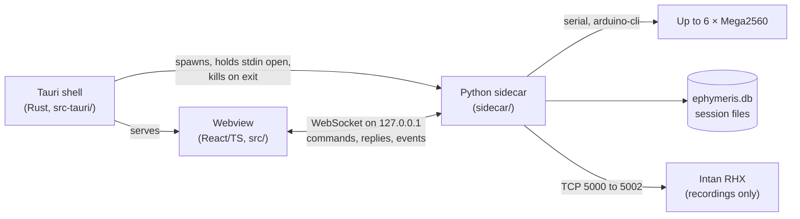
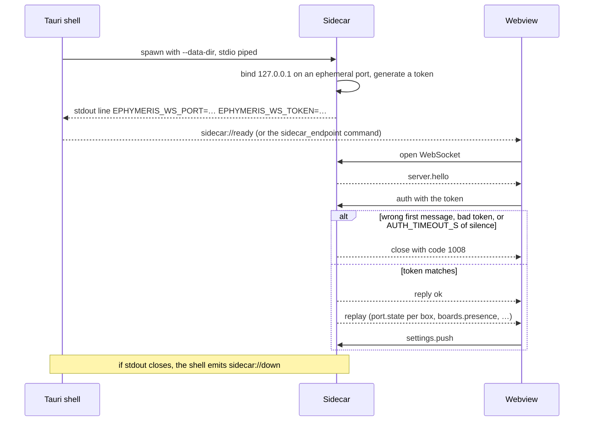
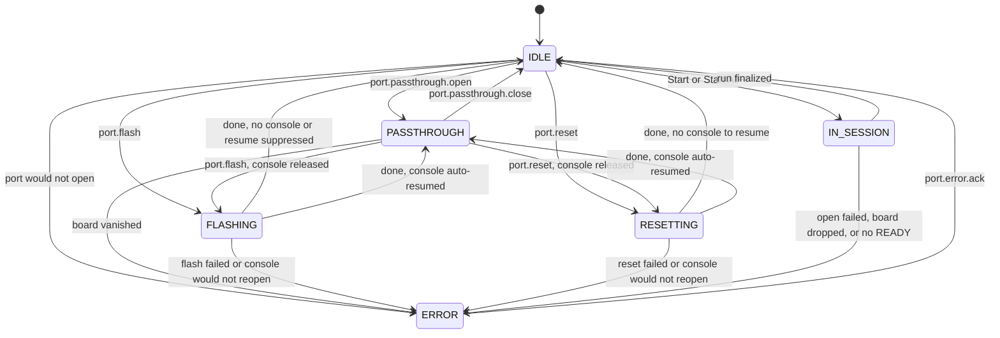
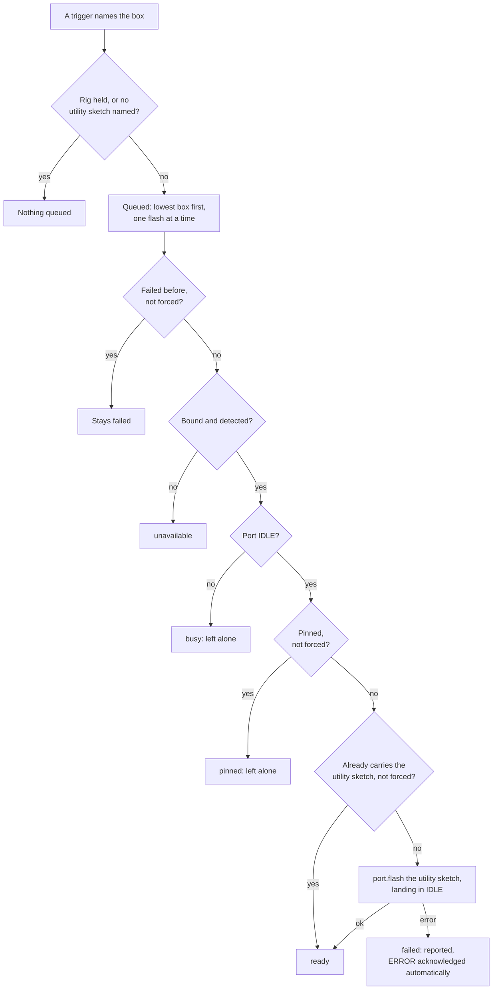
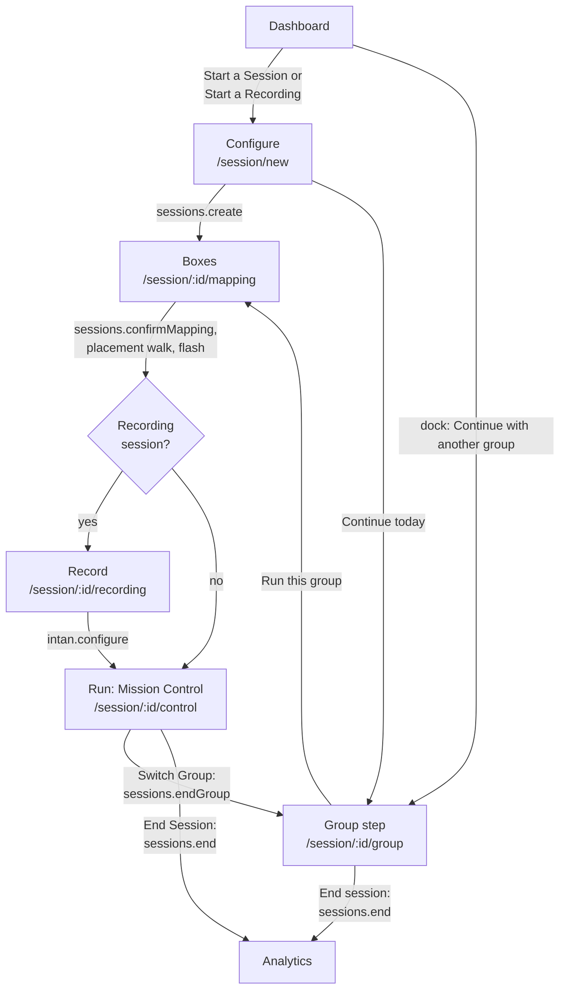
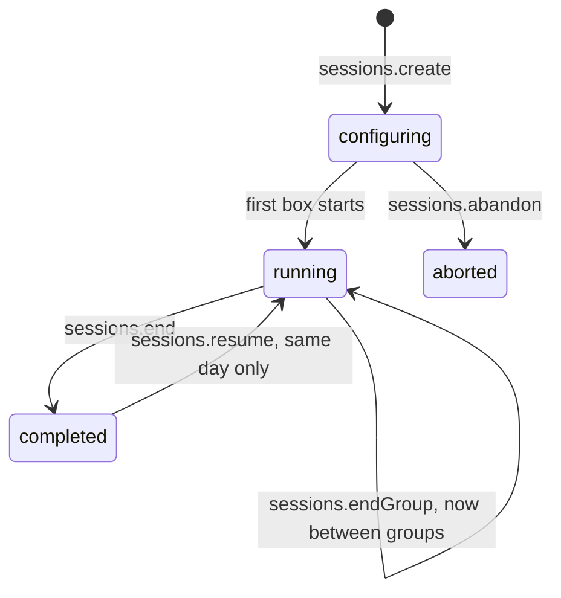
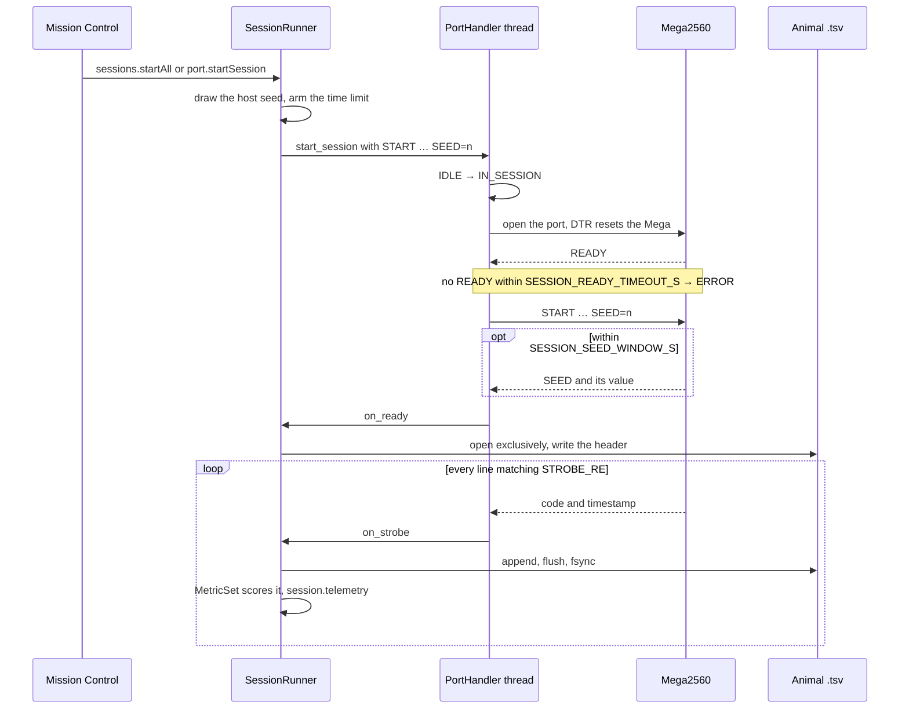
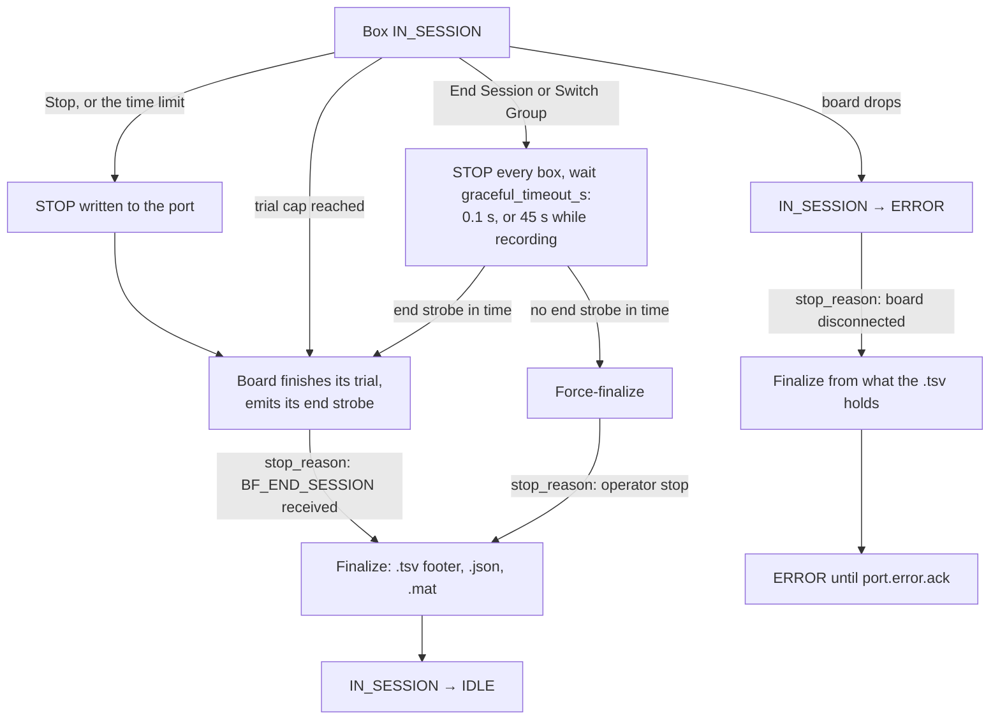
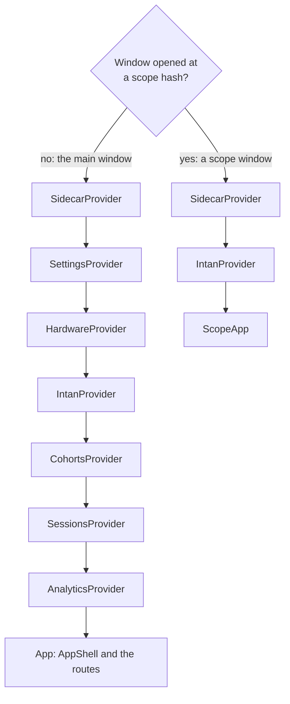

# Architecture

How Ephymeris is put together and the rules that keep it honest. The per-message reference is
[PROTOCOL.md](PROTOCOL.md); tasks and firmware are [TASKS.md](TASKS.md); files, the database and analytics
are [DATA.md](DATA.md); Intan recording is [RECORDING.md](RECORDING.md).

## Contents

- [Overview](#overview)
  - [Three processes](#three-processes)
  - [Rules that explain most decisions](#rules-that-explain-most-decisions)
- [Process lifecycle](#process-lifecycle)
  - [Startup handshake](#startup-handshake)
  - [Orphan protection](#orphan-protection)
  - [No auto respawn](#no-auto-respawn)
  - [Which sidecar runs](#which-sidecar-runs)
- [Wire protocol](#wire-protocol)
  - [Source of truth and generated files](#source-of-truth-and-generated-files)
  - [Changing the wire](#changing-the-wire)
  - [Connection and authentication](#connection-and-authentication)
  - [Replay on connect](#replay-on-connect)
  - [Reconnection](#reconnection)
  - [Envelope](#envelope)
  - [Reply timeouts](#reply-timeouts)
  - [Invariants](#invariants)
  - [Versioning](#versioning)
  - [Settled decisions](#settled-decisions)
- [Settings](#settings)
  - [Who owns settings](#who-owns-settings)
  - [Where each setting is edited](#where-each-setting-is-edited)
  - [Settings keys](#settings-keys)
  - [Persistence and push](#persistence-and-push)
- [Boxes and boards](#boxes-and-boards)
  - [Box bindings](#box-bindings)
  - [Board discovery](#board-discovery)
  - [Handshake test](#handshake-test)
- [Port state machine](#port-state-machine)
  - [States](#states)
  - [Transitions](#transitions)
  - [Exclusivity](#exclusivity)
- [Flashing reset and passthrough](#flashing-reset-and-passthrough)
  - [Flashing](#flashing)
  - [Reset](#reset)
  - [Passthrough read](#passthrough-read)
  - [Passthrough send](#passthrough-send)
  - [Baud](#baud)
- [Hardware utility baseline](#hardware-utility-baseline)
  - [When a restore happens](#when-a-restore-happens)
  - [Three rules it never breaks](#three-rules-it-never-breaks)
  - [Failed restores](#failed-restores)
  - [Identify](#identify)
  - [What a baseline sketch owes the rig](#what-a-baseline-sketch-owes-the-rig)
  - [Running a task from Debug Mode](#running-a-task-from-debug-mode)
- [Session lifecycle](#session-lifecycle)
  - [The flow](#the-flow)
  - [Configuration](#configuration)
  - [Mapping and the placement walk](#mapping-and-the-placement-walk)
  - [Leaving set-up](#leaving-set-up)
  - [Flash sequence](#flash-sequence)
  - [Recording step](#recording-step)
  - [Group step](#group-step)
  - [Running boxes](#running-boxes)
  - [Entering IN_SESSION](#entering-in_session)
  - [Clean exit](#clean-exit)
  - [Board drop](#board-drop)
  - [Stop reasons](#stop-reasons)
- [Frontend](#frontend)
  - [Routes](#routes)
  - [Scope windows](#scope-windows)
  - [Status constellation](#status-constellation)
  - [One sky](#one-sky)
  - [Cohort browser](#cohort-browser)
  - [Shaders and lights](#shaders-and-lights)
  - [Live session views](#live-session-views)
  - [Drag and drop](#drag-and-drop)
- [Theme](#theme)
- [Dependency policy](#dependency-policy)
- [Module map](#module-map)
  - [Sidecar packages](#sidecar-packages)
  - [Frontend directories](#frontend-directories)
  - [Rust shell](#rust-shell)
  - [Repo tooling](#repo-tooling)

## Overview

### Three processes

The three processes and everything the sidecar talks to; the webview reaches hardware only through the
sidecar's WebSocket.



| Process | Owns | Never does |
|---|---|---|
| **Sidecar** (`sidecar/ephymeris_sidecar/`) | Everything stateful: serial ports, `arduino-cli`, SQLite, session files, Intan RHX, the port state machine | Own settings — it receives them |
| **Shell** (`src-tauri/`) | Spawning the sidecar, settings persistence, OS dialogs and windows | Hardware or session logic |
| **Webview** (`src/`) | Rendering what the sidecar reports; editing settings | Touch serial ports or `arduino-cli`; predict a state transition |

### Rules that explain most decisions

1. **The sidecar owns all state.** The frontend renders what it is told. An illegal operation is rejected
   server-side with a typed error code; a disabled button is a courtesy, not enforcement.
2. **A serial port has exactly one owner.** This is why the [port state machine](#port-state-machine) exists.
3. **Box number 1–6 is the key, never a port address.** Windows renumbers COM ports across reboots; the
   sidecar resolves `box → hardware_id → current address` internally ([Box bindings](#box-bindings)).
4. **Nothing slow or optional may stall a session.** The backup mirror ([DATA.md](DATA.md#backup-mirroring))
   and Intan RHX ([RECORDING.md](RECORDING.md#the-rule)) may be slow, absent or dead.
5. **Data is written as it happens.** Every strobe is fsync'd to the animal's `.tsv` on arrival
   ([DATA.md](DATA.md#crash-safety)).

## Process lifecycle

### Startup handshake

1. The shell (`src-tauri/src/sidecar.rs`) spawns the sidecar with piped stdin, stdout and stderr and
   `--data-dir <app_data_dir>`. The shell resolves that directory so the two can't disagree about where
   `ephymeris.db` lives.
2. The sidecar binds `127.0.0.1` on an **ephemeral port** — lab PCs are shared and a fixed port is a
   collision waiting to happen — and generates a random token, because any local process could otherwise
   connect and drive the hardware.
3. It prints **exactly one line** to stdout: `EPHYMERIS_WS_PORT=<port> EPHYMERIS_WS_TOKEN=<token>`.
   Everything else goes to stderr, which the shell forwards into the app log.
4. The shell parses it (`parse_handshake`, covered by `cargo test`) and emits `sidecar://ready`, or
   `sidecar://down` if stdout closes.
5. The frontend gets the endpoint from the `sidecar_endpoint` command (for a sidecar ready before the
   webview loaded) or the event, connects, and authenticates
   ([Connection and authentication](#connection-and-authentication)).

The same steps as a sequence, through to the first `settings.push` (`sidecar.rs`, `server.py`,
`src/lib/ws/client.ts`):



With no shell (a plain-browser dev preview), `src/lib/ws/client.ts` reads a manual endpoint from
`localStorage` key `ephymeris:endpoint`, for a sidecar started with `--token` and `--no-parent-watch`. It is
`localStorage` rather than a URL parameter because the token never goes in a URL. Production compiles it out.

### Orphan protection

> [!IMPORTANT]
> **Load-bearing, not a nicety.** The shell holds the sidecar's stdin open for the app's lifetime; the
> sidecar exits on stdin EOF, and the shell also kills the child on exit. A sidecar that outlived its
> parent would keep serial ports open and lock out the next launch. Don't remove or bypass either half.
> `--no-parent-watch` exists only for running the sidecar by hand.

### No auto respawn

If the sidecar dies, `sidecar://down` is surfaced and the user restarts the app. A silent respawn would
resurrect the process without the port ownership or session state it had. For the same reason a group is
never resumed mid-run after a restart; continuing *between* groups is supported ([Group step](#group-step)).

### Which sidecar runs

`resolve_launch` in `sidecar.rs`: `EPHYMERIS_SIDECAR_PYTHON` always wins; otherwise a debug build prefers
the `sidecar/.venv` interpreter and a release build prefers the PyInstaller-frozen `ephymeris-sidecar`
from the resource directory, each falling back to the other. When bundled resources exist, the shell
exports `EPHYMERIS_BUNDLED_ARDUINO_CLI`, `EPHYMERIS_BUNDLED_ARDUINO_DATA_SEED` and
`EPHYMERIS_BUNDLED_SKETCHES` to the sidecar. Packaging: [README](../README.md#building-the-installer).

> [!CAUTION]
> **Every path built from `resource_dir()` must go through `simplified()` before it leaves the shell.**
> On Windows, Tauri returns a verbatim path (`\\?\C:\…`) and everything joined onto it inherits the
> prefix. Windows APIs and Python accept it, so nothing looks wrong — but `arduino-cli` is Go, and given
> `--libraries \\?\C:\…` it finds no libraries and says nothing. The compile then fails on
> `#include <BehaviorBox.h>`, reading exactly like a library missing from the install. Dev builds never
> see it, because they fall back to `<repo>/sketches`. `simplified()` leaves verbatim UNC paths and paths
> past `MAX_PATH` alone, where the prefix is needed; `discovery._plain()` strips it again on the Python side.

## Wire protocol

### Source of truth and generated files

`protocol/schema.py` is the single authority for every command, event, error code and payload shape.
`protocol/generate.py` writes three committed files from it — never edit them by hand:
`sidecar/ephymeris_sidecar/protocol.py` (names, specs, the validator), `src/lib/ws/protocol.ts` (names and
the `CommandArgsMap`/`CommandResultMap`/`EventDataMap` that make `client.call` fully typed) and
`docs/PROTOCOL.md` (the reference). Frontend domain type files re-export the generated shapes; don't
re-declare a wire shape by hand. Every command except `auth` is registered in `app.py`; `server.py`
handles `auth` before dispatch.

### Changing the wire

1. Edit `protocol/schema.py`, including each new name's `doc` string.
2. Run `npm run gen:protocol` (`predev` and `prebuild` run it too, so a forgotten run shows as a dirty tree).
3. Commit the regenerated files with the schema change.
4. Run `pytest tests/test_protocol_contract.py`: it regenerates with `--check` and fails on stale or
   hand-edited output, and on any command, event or error code without a description.

Shapes are guarded on both sides. A stale TypeScript shape fails `npm run typecheck`. In the sidecar,
`EPHYMERIS_WIRE_VALIDATE=1` checks every event payload and dispatched reply against the schema; the test
suite sets it globally (`tests/conftest.py`), production leaves it off. `tests/test_wire_shapes.py` pins
the real `to_json` emitters to the schema — extend it when adding an emitter. Nothing verifies that a
command *has* a handler.

### Connection and authentication

The server sends `server.hello` on connect. The client's **first** message must be `auth` with the token;
anything else, a bad token, or `AUTH_TIMEOUT_S` (`server.py`) of silence closes the connection with code
`1008`. The token travels in a message body so it never lands where a URL would be logged.

### Replay on connect

After `auth`, `Application._replay_state` (`app.py`) sends current state **to that client alone**: one
`port.state` per box (with `prev` equal to `state`, reason `"initial state"`), then `boards.presence`,
`sketches.updated`, `tasks.updated`, `cohorts.updated`, `prefixes.updated`, and `utility.updated`,
`backup.status` and `intan.status` once those services exist. Events are otherwise sent only on change, so
without it a client connecting in a quiet period would have to guess. A replay callback that raises is
logged and swallowed rather than dropping the connection.

**Live session state is not replayed.** A reconnecting client asks: `sessions.active` to discover what is
running with no prior ids, or `sessions.status` for a session it knows. The runner is the authority on the
confirmed mapping, and asking beats a snapshot that may be stale on arrival; `session.lifecycle`
broadcasts keep the answer current afterwards.

### Reconnection

`client.ts` reconnects on the `BACKOFF_MS` schedule, holding at its last step. **On every successful
authentication, reconnects included, the frontend re-sends `settings.push`** — the wire form of the
one-way settings sync.

### Envelope

```jsonc
{ "v": 1, "id": "c7", "cmd": "port.flash", "args": { "box": 1, "sketchPath": "…" } }       // command
{ "v": 1, "corr": "c7", "ok": true,  "result": { … } }                                     // reply
{ "v": 1, "corr": "c7", "ok": false, "error": { "code": "…", "message": "…", "detail": null } }
{ "v": 1, "evt": "port.output", "ts": 1721600000.123, "data": { … } }                      // event
```

JSON, UTF-8. `v` is the protocol version, `id` a client correlation id unique per connection, `corr`
echoes it, `ts` is server Unix time in float seconds. Every command gets exactly one reply; long-running
ones also emit events carrying `corr` (`flash.progress`), so progress is attributable to its request.

### Reply timeouts

`client.ts` applies `DEFAULT_CALL_TIMEOUT_MS`, with longer values in `CALL_TIMEOUT_OVERRIDES` for work that
runs long (flashing, library refresh, backup sync, analytics indexing, recovery, ending a session or group,
starting a recording, configuring RHX). **A client timeout does not cancel sidecar work**; the resulting
`port.state` is what the UI shows.

### Invariants

- **`box` is the key, never a port address**, or a COM renumber would silently re-point a box at the wrong
  board. A box with no bound board still exists and reports `IDLE`; commands against it fail with
  `PORT_NOT_BOUND`; `boards.presence` also lists seen-but-unassigned boards (`boxId: null`).
- **The sidecar is authoritative on state.** The frontend never sets port state optimistically.
- **`port.output` is batched**, one array per port per `FLUSH_INTERVAL_S` tick (`ports/manager.py`, about
  20 Hz); six chatty boards at a message per line would flood the UI. Sent lines are interleaved with
  `dir: "tx"` so scrollback stays chronological.
- **Passthrough data never enters storage** beyond the per-port ring buffer (`RING_CAPACITY`,
  `ports/handler.py`). Saving a console log is a manual action outside the data pipeline.
- **Settings flow one way**, shell to sidecar ([Persistence and push](#persistence-and-push)).

### Versioning

`PROTOCOL_VERSION` (`schema.py`) is one integer, bumped on any breaking change. Shell and sidecar ship
together, so there is no negotiation: a mismatched `v` is rejected with `PROTOCOL_VERSION_MISMATCH`, since
it means a stale build.

### Settled decisions

Don't relitigate these without new information: a loopback WebSocket carrying JSON; an ephemeral port
handed over on stdout; a per-launch token sent as the first message body, never in a URL; correlated
replies **plus** unsolicited events (a pure event stream can't attribute a failure to its request); box
number as the per-port key; generated mirrors plus a contract test (hand-kept mirrors drifted in their
payload shapes); exit on stdin EOF; no auto-respawn.

## Settings

### Who owns settings

**The Tauri shell owns settings** (`tauri-plugin-store`), not the sidecar. Settings must work when the
sidecar doesn't: a wrong `arduino-cli` path or bad save directory is exactly what stops a sidecar
starting, and a sidecar-owned store would lock the user out of the screen that fixes it. The shell also
gives native directory pickers for free.

### Where each setting is edited

Four screens, **split by subject**, all writing through one `useSettings().update`:

| Screen | Route | Answers |
|---|---|---|
| **Settings** | `/settings` | Where data goes and how the app feels: directories, reduced motion, the status constellation |
| **Rig** | `/config` (file `routes/Config.tsx`) | What this box *is*: box→board bindings and the handshake test, the utility baseline, default baud, the `arduino-cli` path, and the channel→pin wiring editor at `/config/wiring` ([TASKS.md](TASKS.md#rig-wiring)) |
| **Recording** | `/recording` | The RHX link and ports, each box's sync input, recording defaults ([RECORDING.md](RECORDING.md#recording-walkthrough)) |
| **Task** | `/task` | What the animal does: saved tasks, the editor, the strobe vocabulary ([TASKS.md](TASKS.md#the-task-tab)) |

Box→board and channel→pin are **different wirings**: the first is runtime indirection that changes whenever
a board is swapped, the second compile-time input baked into the firmware every task generates. A box's
sync input is a third cable, a binding like the board binding, edited on Recording because its far end is
the recording controller; its value stays in `boxes`, so the two screens can't drift.

### Settings keys

Defaults and normalization: `src/lib/settings/schema.ts` (`DEFAULT_SETTINGS`, `normalizeSettings`). The
sidecar's receiving end: `sidecar/ephymeris_sidecar/settings.py`.

| Key | Edited on | Sidecar reads | Meaning |
|---|---|---|---|
| `dataDirectory` | Settings | yes | Base for new cohorts' data folders ([DATA.md](DATA.md#directory-layout-and-naming)) |
| `backupDirectory` | Settings | yes | Mirror target ([DATA.md](DATA.md#backup-mirroring)). Setting it does not backfill |
| `arduinoCliPath` | Rig | yes | Override for the bundled `arduino-cli` |
| `utilitySketchName` | Rig | yes | The baseline sketch, or `null` for none ([Hardware utility baseline](#hardware-utility-baseline)) |
| `defaultBaud` | Rig | yes | Starting baud per console ([Baud](#baud)) |
| `boxes` | Rig (board, label), Recording (`intanDigitalIn`) | yes | The box list ([Box bindings](#box-bindings)) |
| `intan` | Recording | yes | RHX's command, waveform and spike ports. No host: RHX is always local |
| `recordingDefaults` | Recording, and the Record step | no | What a recording saves, thresholds, save root, per-box memory (`src/lib/intan/defaults.ts`) |
| `reducedMotion` | Settings | no | Forces reduced motion on; the system preference applies on top |
| `constellation` | Settings | no | Zodiac layout of the status constellation, validated against the catalogue on load |
| `constellationSlots` | Settings (drag), Rig (box add/remove) | no | Which star each box sits on. `reconcileSlots` is the single authority and runs in the same write as a box add or remove |
| `taskDefaults` | none | no | Middle layer of the parameter merge, per sketch ([TASKS.md](TASKS.md#the-start-line)) |

**Adding a key the sidecar doesn't read is a non-event, and so is removing one.** The sidecar's parser is
deliberately lenient — an unknown key is ignored and a malformed value degrades to a default rather than
killing the process that owns the ports. `normalizeSettings` drops retired keys; a path-valued
`utilitySketchPath` heals to its basename on both sides. Keys naming a sketch use its **folder name, not a
path**, because the bundled library's path differs per install while the name is what a session file
records. `taskDefaults` has no editor; entries for a sketch that no longer exists are inert, because the
merge iterates the profile's own fields.

### Persistence and push

`settings.json` in the app data directory holds one `"settings"` key, opened with `autoSave: false` and
saved after every `set`. A rejected open is never cached, so one transient IO failure doesn't poison the
session; a failed load falls back to defaults; a failed save shows a persistent note on Rig and Settings.

> [!IMPORTANT]
> **The sync is one-directional, shell to sidecar.** The full payload is pushed on every connect and
> reconnect and on every change. The sidecar is never the source of truth; at worst it runs briefly on
> stale values. Scope windows deliberately never push ([Scope windows](#scope-windows)).

## Boxes and boards

### Box bindings

```ts
BoxBinding = { box: number; hardwareId: string | null; label: string; intanDigitalIn: number | null }
```

- `box` is 1–6, unique and sorted. The list holds only the boxes the user created.
- **Bound** means `hardwareId !== null` — the board's USB serial number, stable across COM renumbering.
  It is the single definition of a real box, and every "is there a box here" check gates on it.
- `intanDigitalIn` is 1–16 or `null`. Two boxes may not share an input: both normalizers drop the
  duplicate (lower box wins), leaving the later box unwired and refused by the recording step rather than
  recording wrongly ([RECORDING.md](RECORDING.md#the-sync-line)).
- **Gates are on bound, not detected.** Detection only downgrades a label. The sidecar validates a
  cohort's `boxNumber` against the bare 1–6 range, never against what is bound now, which keeps a cohort
  editable on the other lab machine.

> [!WARNING]
> **A stale handler must never survive a rebind.** Close the port before rebinding, or rebind only in `IDLE`.

### Board discovery

**Presence is checked without ever opening a port** — through the daemon's board-list RPC (or
`arduino-cli board list` on the fallback backend), every `POLL_INTERVAL_S` (`ports/manager.py`). Polling is
therefore outside the state machine: "connected" and "flashing" are two independent facts, and a poll
never contends with a port's owner. The poller keeps only entries with `protocol == "serial"`, a hardware
id (falling back to `properties.serialNumber`), a vendor id and an address. It deliberately does **not**
allow-list vendor ids: CH340 and FTDI clones are common in the lab and report no FQBN. Both backends apply
the same filter, pinned against each other by `test_grpc_tool.py`.

### Handshake test

The Rig tab's per-box test (`src/lib/hardware/useHandshakeTest.ts`) uses existing commands, with **no
command of its own**: `port.passthrough.open` (asserting DTR resets the Mega, with the reader attached in
time to see its boot output), listen for `READY` within the sidecar's own `READY` budget, and close in a
`finally`, including on unmount. A box already in `PASSTHROUGH` is closed first, since the re-open is what
produces the observable reset.

| Tier | Meaning |
|---|---|
| `ready` | A `READY` line: the sketch speaks the Ephymeris protocol |
| `output` | Some output: wiring and port fine, not an Ephymeris sketch |
| `silent` | Port opened, nothing heard: **wrong baud**, or a mute sketch |
| `failed` | The port never opened: unbound, missing or busy |

> [!CAUTION]
> **The test must never use `port.reset`.** Its DTR pulse opens a throwaway handle that is never read, so
> the boot output is unobservable — and from `PASSTHROUGH` it would reset the board twice.

## Port state machine

Each of the six ports runs its own state machine. `ports/states.py` (`TRANSITIONS`, `assert_transition`)
is the authority, and every state change goes through it.

> [!IMPORTANT]
> **The invariant everything here protects: a serial port has exactly one owner at a time.** Transitions
> are enforced in the sidecar; an illegal one is rejected with `ILLEGAL_TRANSITION`.

### States

| State | Meaning |
|---|---|
| `IDLE` | Port not open, no owner. The board may or may not be connected |
| `PASSTHROUGH` | Port open, raw bidirectional text to the GUI. No parsing, no storage |
| `FLASHING` | Compile and upload in progress; the upload owns the port |
| `RESETTING` | The DTR toggle is running |
| `IN_SESSION` | Owned by the session runner; strict strobe parsing into the data pipeline |
| `ERROR` | An open failed, the board vanished, or an operation failed |

### Transitions

| From | May go to |
|---|---|
| `IDLE` | `PASSTHROUGH`, `FLASHING`, `RESETTING`, `IN_SESSION`, `ERROR` |
| `PASSTHROUGH` | `IDLE`, `FLASHING`, `RESETTING`, `ERROR` |
| `FLASHING`, `RESETTING` | `IDLE`, `PASSTHROUGH`, `ERROR` |
| `IN_SESSION` | `IDLE`, `ERROR` |
| `ERROR` | `IDLE`, by `port.error.ack` only |

The same table as a diagram, each transition labelled with what drives it (`ports/handler.py`,
`ports/manager.py`):



A failed *utility baseline* restore is the one `ERROR` the app acknowledges itself
([Failed restores](#failed-restores)); every other one waits for the operator.

The absences carry the meaning. **Only `IDLE` reaches `IN_SESSION`** — which is why the session flash
sequence suppresses passthrough resume. **`IN_SESSION` leads only to `IDLE` or `ERROR`**, so a running
animal's box can't be flashed, reset or monitored out from under it. **`ERROR` is a dead end until
acknowledged** — no timeout, no retry — so a failed flash must be acknowledged before it can be retried. A
transition to the current state is a silent no-op.

### Exclusivity

- Entering `FLASHING` or `RESETTING` **force-releases `PASSTHROUGH`** first, closing the port cleanly.
- **Auto-resume:** a port in `PASSTHROUGH` immediately before a flash or reset returns to it afterwards,
  so the user sees the new sketch's output without another click.
- **`port.flash` takes `suppressPassthroughResume`** (default `false`). The session flash sequence sets it
  so every box lands in `IDLE` for the runner; Debug Mode never does — which is also how the utility
  baseline recognises an operator's flash and **pins** it ([Three rules it never breaks](#three-rules-it-never-breaks)).
- A Debug Mode flash from `IDLE` lands in `IDLE`, and the **client** then opens passthrough, so the rules
  above hold and the operator gets a console. The open toggles DTR, so a behavior sketch reboots and
  prints `READY` into the console it will be started from.

## Flashing reset and passthrough

### Flashing

`arduino-cli` compile then upload, FQBN `arduino:avr:mega` (`ports/manager.py`). The sketch must be in the
current discovery result — the bundled library plus this rig's saved tasks
([TASKS.md](TASKS.md#sketch-library)) — and `port.flash` enforces that with `SKETCH_UNKNOWN`, not just the
picker. Progress streams as `flash.progress`. A compile or upload failure moves the port to `ERROR` with
the parsed message; it never falls back silently to `IDLE`.

`boards/__init__.py`'s `create_board_tool` picks a `BoardTool` (`boards/tool.py`) backend:
`boards/grpc_tool.py`, one long-lived `arduino-cli daemon` over gRPC with live streaming and no spawn per
presence poll, when `grpcio` imports and the daemon starts; otherwise `boards/cli_tool.py`, the subprocess
`--format json` backend, which also owns binary resolution and the packaged data seed.
`EPHYMERIS_NO_GRPC_DAEMON=1` forces the subprocess. The stubs in `boards/rpc/` are generated from protos
vendored in `sidecar/proto/` by `sidecar/scripts/gen_grpc.py`; re-vendor at the matching tag when bumping
`arduino-cli`.

> [!IMPORTANT]
> **The daemon must be spawned with a held-open stdin pipe.** It exits on stdin EOF (its parent-death
> watch), so `stdin=DEVNULL` kills it instantly and silently.

> [!CAUTION]
> **Each flash phase opens with the invocation echoed by the backend that performs it.** The subprocess
> backend prints its real argv (`_command_echo`); the daemon prints its RPC, not dressed as a shell command
> because no such process runs. A hand-composed echo once omitted `--libraries` and sent an investigation
> after a missing path instead of the malformed one. Echo from the arguments, or don't echo.

### Reset

A serial-layer operation, not an `arduino-cli` one: close the port if open, DTR low, about 100 ms, DTR
high, reopen (`_dtr_pulse`, `ports/manager.py`). The Mega's auto-reset circuit fires on the edge.

### Passthrough read

One implementation serves priming and a general console, whenever a port isn't `FLASHING` or `IN_SESSION`.

| Property | Rule (constants in `ports/handler.py`, `ports/manager.py`) |
|---|---|
| Data | Opaque text, bad bytes replaced. Never passed to the strobe parser |
| Retention | A ring buffer per port (`RING_CAPACITY`). Debug output, not data |
| Delivery | Batched per `FLUSH_INTERVAL_S` tick, never one message per line |
| Unterminated line | Force-flushed past `MAX_PARTIAL_BYTES`, so a sketch with no newline can't grow the buffer |
| Line endings | `\n`, `\r` and `\r\n`. A trailing `\r` is held briefly in case it is half a split CRLF, then released after two quiet ticks |

### Passthrough send

The handler that owns a port's read loop also owns its `write()`; reads and writes for one port are never
split across objects or threads, to avoid races with transitions. **`port.send` is accepted only in
`PASSTHROUGH`** (`SEND_NOT_PASSTHROUGH` otherwise), enforced in the sidecar so a queued send can't fire
mid-transition. Each console picks its line ending (none, `\n`, `\r`, `\r\n`), and sent lines are echoed as
`tx`.

### Baud

Per box, starting from `defaultBaud`; Debug Mode allows a per-box override.

> [!WARNING]
> **A baud mismatch fails silently** — the console prints nothing legible and reads as a dead board.
> `DEFAULT_BAUD` (both `schema.ts` and `settings.py`) must match what the bundled sketches declare; the
> value and the firmware only ever move together. The default binds a fresh install only: `defaultBaud` is
> persisted, so an existing machine keeps its stored value and must be set on the Rig tab before flashing.

## Hardware utility baseline

`sidecar/ephymeris_sidecar/utility.py` (`UtilityBaseline`). **The rig has a resting state and the app
maintains it:** every bound box that isn't flashing, in a console or in a session should carry the
operator's utility sketch (`utilitySketchName`). With a known sketch on every free box, the app can ask a
box to do things — light itself, prime a line — without first asking the operator to flash.


*The baseline's face on the Rig tab: the named sketch, **Reflash boxes** (the one `force` caller) and each
box's restore state, which is where a failed restore stays visible.*

### When a restore happens

**The trigger is always a box becoming free, never a clock.**

| Trigger | Notes |
|---|---|
| Startup | When the first presence poll reports the rig |
| A board appears | Replugged, or newly bound |
| A port falls back to `IDLE` | Hooked on the **transition**, so every path to idleness is covered by one rule — including a Debug Mode flash, which is why the pin exists |
| A session lets go | `sessions.end`, `sessions.endGroup`, `sessions.abandon` (`_release_baseline`, `app.py`). `endGroup` restores at once because the operator's next act is walking the rig, which wants the lights |
| On demand | `utility.ensure`: the Rig tab's **Reflash boxes** (the only caller passing `force`), the placement walk, Debug Mode's **Return to baseline** |

What a trigger does to one box (`UtilityBaseline.ensure` and `_restore`). A `utility.ensure` that arrives
over the wire first unpins the boxes it names; `force` skips the three "not forced" checks:



Restores run **one box at a time**, like the session flash sequence, so a cold start is up to six
sequential flashes. If that proves annoying, defer the cold restore until a box is needed; don't
parallelise it, which would fight the one-owner rule.

### Three rules it never breaks

> [!CAUTION]
> **Only an `IDLE` port is ever touched.** Entering `FLASHING` would force-release a `PASSTHROUGH`
> console — right when a user asks to flash, wrong for a background restore. The check is on the port
> already being idle, not on the transition being legal.

> [!CAUTION]
> **A confirmed session mapping holds the whole rig** — `hold()` at `sessions.confirmMapping`, `release()`
> when the session lets go. In between, boxes carry task sketches and fall idle constantly; a restore there
> would erase the sketch the runner is about to start. If an exit path fails to release, the rig quietly
> stops returning to baseline; if a release lands early, a restore erases a task mid-setup.

> [!CAUTION]
> **A deliberate flash is pinned.** A Debug Mode `port.flash` lands in `IDLE`, which is the restore
> trigger; without the pin the baseline re-flashed itself over the operator's task within seconds,
> silently, and the box could not be started. The two kinds of flash are told apart by
> `suppressPassthroughResume` (`note_flashed(..., pin=not suppress)` in `app.py`). A pinned box reports
> `pinned` and is skipped by **every automatic trigger**; only something a person did releases it: any
> `utility.ensure` naming the box, a session releasing the rig, the board vanishing, a different utility
> sketch being named, or flashing the utility sketch by hand. `force` overrides it. `test_utility.py` wires
> the idle hook to a no-op, which is how this hid; `test_debug_flash.py` wires it the way `app.py` does.

### Failed restores

A failed restore is reported and then **acknowledged back out of `ERROR` automatically**. A manual ack is
right when the operator asked for the flash and wrong when they didn't: a broken `arduino-cli` would
otherwise leave six boxes each needing a clear. The failure shows on the Rig tab and is **sticky per box**,
so the acknowledgement can't bounce straight into another doomed attempt.

### Identify

`utility.identify` asks one box to point at itself. Its commands come from the utility profile's
`identify` pair ([TASKS.md](TASKS.md#task-profile)), **never from anything hardcoded**, so a rig that
signals with a buzzer or a different LED works too. Sequence: open `PASSTHROUGH`, wait for the boot line,
send *on*, then **wait for the sketch's own telemetry line as confirmation**; *off* closes the console only
if this layer opened it. Waiting is what catches the likeliest silent failure, a baud mismatch, and names
it. A sketch declaring `identify` but no `telemetry` gets no confirmation and is trusted on the send. The
placement walk is its consumer and runs before the session flash for that reason: only the baseline can be
asked to light a box.

### What a baseline sketch owes the rig

1. **Announce `READY` on boot** like a task sketch — the handshake test's top tier and the only evidence
   the board speaks the protocol — but **don't block for `START`**; the app sends commands at once.
2. **Do nothing on its own.**

> [!CAUTION]
> **A baseline sketch reacts to the app and nothing else.** It is the firmware on every box while animals
> are placed into them, and an animal in a chamber nose-pokes. A self-test triggered by an odor poke would
> fire every odor line into the chamber.

### Running a task from Debug Mode

- **Send START** sends `port.sendStart`. The **sidecar** builds the line with `build_start_command` — the
  one place that knows the wire keys and the line cap — from the same merged values a session uses
  ([TASKS.md](TASKS.md#the-start-line)), and arms `debug_run.py`, which feeds the box's `port.output`
  strobes to **the same `MetricSet` a session uses** and pushes `port.telemetry` into the per-box slot
  `session.telemetry` fills. Debug Mode therefore mounts Mission Control's `MetricStrip` and `LivePanels`
  unchanged. Don't write a second scorer; `test_debug_flash.py` pins the two to identical output.
- **End sends `STOP`** via `port.send`. **The board ends the task**: it takes `STOP` at the next trial
  boundary and emits `BF_END_SESSION`, and the panel reads *running* until the sidecar sees it. The host
  cannot send a strobe. Leaving `PASSTHROUGH` also ends the run.
- **A Debug run records nothing** — no writer, no run row, no `SEED`. A `START` typed by hand runs but
  isn't scored, because the sidecar learns which profile to score only from `port.sendStart`.
- **Prime** (`components/debug/PrimeControls.tsx`) opens chosen fluid lines in turn using only the utility
  sketch's own verbs over `port.send`: paced from the app so it knows which line is open, restoring the
  sketch's global pulse width afterwards, stopped with `ALLOFF`.


*A Debug run. The LIVE tile is Mission Control's `MetricStrip` and `LivePanels`, fed by `debug_run.py`. This
box's animal is side-biased: P(right well) 1.00 against P(left well) 0.00.*


*The same panel on the baseline sketch: the utility controls and Prime that a known resting sketch makes
possible without a flash. They act only while the console is open in `PASSTHROUGH`.*

## Session lifecycle

The operator's view is [USER-GUIDE.md](USER-GUIDE.md#running-a-session); session records, runs and their
files are [DATA.md](DATA.md#sessions-and-runs).

### The flow

Configure (`/session/new`) → Boxes (`/session/:id/mapping`: placement walk and flash) → Record
(`/session/:id/recording`, recording sessions only) → Run (`/session/:id/control`) → Switch Group → group
step (`/session/:id/group`) → Boxes … → End Session → `/analytics`. The Dashboard can reopen one of today's
sessions at the group step. Status (`SessionStatus`, `sessions/models.py`) is `configuring` → `running` →
`completed`, or `aborted` for an abandoned set-up; `sessions.active` reports crash-orphaned `running` rows
as `stale`.

The routes and the command that moves the operator between them, including the between-groups loop
(`navigate` calls in `routes/Session*.tsx` and `MissionControl.tsx`):



On a session the runner no longer holds (the app was closed, or the session was ended too early), the group
step's Run this group calls `sessions.resume` before moving on. A session's status over the same flow:



Mission Control's End Session on a session where no box ever ran calls `sessions.abandon` instead, and
returns to the Dashboard.

### Configuration

`sessions.create` needs a cohort with a group holding an animal with a `boxNumber` (`SESSION_NOT_READY`
otherwise). The operator picks the cohort, **which group runs first**, a prefix, a session number
(`sessions.suggestNumber`) and an optional time limit. Reusing a `(prefix, number)` that already has data
today is a soft warning. **Groups have no run order**: which group is ready is a fact about the room that
morning, not data set up weeks before. `Group.order` is display order only.

The **time limit** is stored on the session and is **per box, from that box's own start**, and **enforced
by the sidecar**: at the deadline the runner sends the same `STOP` an operator would, and the run
finalizes normally. The limit decides when the request is sent, not how the run ends. A box that ends
early cancels its pending auto-stop, so a freed port never gets a ghost `STOP`. A sketch with no end strobe
can't be finalized by `STOP` alone; the operator closes it out.

### Mapping and the placement walk

Each box gets a sketch and, if it has a profile, a config seeded from the three-layer merge
([TASKS.md](TASKS.md#the-start-line)). **Mapping changes are session-local** and never write back to the
cohort. `sessions.confirmMapping` hands the runner its per-box configs and **holds the utility baseline**.
The **placement walk** then visits one box at a time, lighting it with `utility.identify` while it still
carries the baseline; the mapping locks during the walk, and a missing light never blocks it — the box's
number is the instruction and the light only corroborates it.

> [!CAUTION]
> **The walk goes in box-number order, not animal order.** The operator is walking down a bench; sending
> them from box 5 to box 2 and back is how an animal ends up in the wrong chamber. **A mis-placed animal
> produces a complete, plausible, silently mislabelled data file, and nothing downstream can detect it.**

Backing out of a first-entry mapping abandons the session (`sessions.abandon`). **Any other exit keeps
it** — a sidebar tab, Open Task, Open Rig — because that is a visit, not a cancellation (next section).
Re-entered from the group step, the session already has group runs, so the step offers another group or
ending instead.

### Leaving set-up

Every set-up step — Configure, the group step, Boxes, Record — can be left for any tab and resumed where it
was. `lib/sessions/setupResume.ts` remembers two things:

- **the step** — the last set-up URL, pathname *and* search, since Boxes carries its cohort and group there.
  While one is held, the sidebar's Dashboard row opens it instead of `/` and reads *Resume · <step>* (with a
  waveform mark for a recording). From inside the flow the row still goes to `/`, which is the way to the
  Dashboard itself while a set-up is pending.
- **drafts** — each step's form, keyed by step and (past Configure) session and group, so a draft can never
  seed another session's form. A Boxes draft is dropped if the group's animals changed meanwhile; a walk left
  mid-placement comes back to the review with the mapping re-confirmable (the confirm is idempotent, and the
  boxes re-flash).

The memory is dropped on reaching Mission Control and by a deliberate Cancel or End session, and the offer is
withheld whenever `sessions.active` no longer reports the session, because the sidecar is the authority on
whether it still exists. It is **memory only**: after a restart, the dock's *Set-up in progress* rows are the
way back in, and the dock's own Resume uses the remembered step when it is this session's.

### Flash sequence

Closing an enclosure queues that box; boxes flash **one at a time, in the order closed**, through
`port.flash` with `suppressPassthroughResume: true`, so each lands in `IDLE` for the runner. The mapping is
confirmed first because the hold is what stops a freshly flashed, idle box being restored to baseline. A
queued flash waits up to `PORT_WAIT_MS` (`routes/SessionMapping.tsx`) for its port. A failed flash leaves
its box in `ERROR`; the acknowledgement is offered on that box's card, and flashing stays disabled while
any mapped box is faulted.

### Recording step

Recording sessions only, after the mapping and once per group: which headstage port each mapped box uses.
Whether a session is a recording is read from the sidecar's snapshot, never the URL, because the flow is
re-entered from the dock, a group switch and a reload ([RECORDING.md](RECORDING.md#recording-walkthrough)).

### Group step

`/session/:id/group` picks the next group — **any** group. `sessions.endGroup` (Switch Group) ends the
group on the rig, closes its group run, clears the runner and releases the baseline, leaving the session
**between groups**: `running`, with no boxes and `groupId` null. The sidecar never picks a group and never
finalizes here; only `sessions.end` finishes a session. A group may run again — new timestamped files,
nothing overwritten.


*Nothing is ordered: Group A is badged because it already ran, not locked, and the operator picks whichever
group is ready.*

**Continuing is not resumption.** `sessions.resume` continues one of today's sessions that already ran a
group: any group run a crash left open is closed (its `.tsv` files are the record) and the session
re-enters the between-groups state. **Same day only**, because the session folder is named for its date.

### Running boxes


| Action | Sidecar behaviour |
|---|---|
| **Start All** / **Start** | `sessions.startAll` / `port.startSession`: [IN_SESSION entry](#entering-in_session) for each box not running. A recording session starts RHX first and refuses before any box starts if it can't ([RECORDING.md](RECORDING.md#start-and-end)) |
| **Stop** | Writes the literal `STOP`. The firmware honours it at the next trial boundary — firmware behaviour the app relies on, not enforces |
| **Reset** | The DTR reset; the box returns to waiting at `READY` |
| **End Session** | `sessions.end`: `STOP` every box, wait `graceful_timeout_s` (`SessionRunner.end_all`), force-finalize the rest, close the group run, mark `completed`, release the baseline. The UI abandons a session that never ran instead |

Run clocks come from the runner's per-box `startedAt`, never a client stopwatch, so a reload resumes
mid-count. A per-box write failure is pushed as `sidecar.error`.

### Entering IN_SESSION

Per box (`ports/handler.py`, `sessions/runner.py`):

1. `IDLE → IN_SESSION`, refused from any other state.
2. Open the port, which pulls DTR and resets the Mega.
3. Wait `SESSION_READY_TIMEOUT_S` for `READY`, else `ERROR`.
4. Send the built `START … SEED=<n>`. **The seed is drawn at the click**, not at mapping, or every box in a
   group would share it and it would survive a Stop/Start ([TASKS.md](TASKS.md#the-start-line)).
5. Watch `SESSION_SEED_WINDOW_S` for an optional `SEED\t<value>`; a strobe also ends the window.
6. Strict parsing: a data line is exactly `^\d{1,3}\t\d+$` (`STROBE_RE`). Anything else goes to scrollback
   — a profile-less sketch's raw log — and is never data.
7. Each strobe is appended and fsync'd to the animal's `.tsv`, then fed to the rolling metrics
   ([DATA.md](DATA.md#crash-safety)).

Writer I/O stays on the port's session thread; anything touching the socket or state machine is scheduled
back onto the event loop.

The same sequence for one box. The file is opened only once the handshake resolves — on a `SEED` line,
the first strobe, or the end of the seed window — so its header can carry the seed:



### Clean exit

`STOP` → the board finishes its trial and emits its end strobe → the sidecar finalizes →
`IN_SESSION → IDLE`. `STOP` is a nudge, written to the port and nothing else; only the end strobe forces
the transition, or a forced finalization for boxes that didn't answer when the session ends.

> [!IMPORTANT]
> **The end strobe is found by name**: `TaskProfile.end_code` is the first `strobes` entry whose name
> contains `END_SESSION`. A sketch with no profile, or one naming its terminal strobe otherwise, has no end
> code and ends only when the operator stops it or the board drops.

### Board drop

A board dropping during `IN_SESSION` is **always a hard stop into `ERROR`**, cleared by a manual
`port.error.ack`, with no auto-recovery. The run is finalized at once from what the `.tsv` already holds,
so the hard stop costs no data.


*One board dropped: its tile shows the stop reason, its sidebar star turns red, and the other boxes run on.*


*The box's own panel names the fault. **Acknowledge** sends `port.error.ack`, the only way out of `ERROR`.
The operator's procedure is [USER-GUIDE.md](USER-GUIDE.md#when-a-box-shows-error-or-a-board-disconnects).*

Every way a run ends, side by side (`SessionRunner.finalize_box`, `end_all`, `board_dropped`):



### Stop reasons

| `stop_reason` | Source |
|---|---|
| `"BF_END_SESSION received"` | `CLEAN_STOP_REASON` (`sessions/runner.py`): the board ended the run — trial cap, `STOP`, or time limit |
| `"operator stop"` | End Session or Switch Group force-finalized a box that hadn't ended itself within the wait. A box's own Stop never produces it: the board answers `STOP` with its end strobe |
| `"board disconnected"` | The port dropped mid-session |
| `"sidecar error: <cause>"` | The session files couldn't be opened |
| `"recovered after crash"` | `RECOVERED_STOP_REASON`, from [crash recovery](DATA.md#crash-recovery) |

The set is open; treat any other string as a reason, not an error.

## Frontend

### Routes

All routes are children of `components/chrome/AppShell.tsx` in `src/App.tsx`; files are in `src/routes/`.

| Route | File | Notes |
|---|---|---|
| `/` | `Dashboard.tsx` | The rig's sky, the session dock, summary tiles |
| `/debug` | `DebugMode.tsx` | Per-box instrument panel. No nav entry: reached by selecting a box; redirects to `/` when none is selected |
| `/cohorts`, `/cohorts/new`, `/cohorts/:id` | `Cohorts.tsx`, `CohortEditor.tsx` | Cohort browser; create and manage |
| `/task`, `/task/new`, `/task/:taskId`, `/task/strobes` | `Task.tsx`, `TaskEditor.tsx`, `TaskStrobes.tsx` | Saved tasks, the editor, the read-only strobe vocabulary |
| `/analytics` | `Analytics.tsx` | Its cold landing is the cohort browser |
| `/config`, `/config/wiring` | `Config.tsx`, `RigWiring.tsx` | Rig tab and wiring editor |
| `/recording`, `/settings` | `Recording.tsx`, `Settings.tsx` | |
| `/session/new`, `/session/:id/mapping`, `/session/:id/recording`, `/session/:id/group`, `/session/:id/control` | `SessionConfig.tsx`, `SessionMapping.tsx`, `SessionRecording.tsx`, `SessionGroup.tsx`, `MissionControl.tsx` | The [session flow](#the-flow) |
| `*` | | Redirects to `/` |

Rig and Task are split **by subject**: a pin is compile-time input that belongs to the box, while a strobe
code is what a condition is named by, and the trial table's onset picker is its only consumer.

`src/lib/ws/` holds the client and generated protocol; each domain (`lib/hardware`, `lib/cohorts`,
`lib/sessions`, `lib/settings`, `lib/analytics`, `lib/intan`) has **one Provider + store** wrapping the
shared client. `HardwareProvider` is mounted at the **app root**, not per view, because the sidebar's status
constellation needs box health on every screen.

**Unit tests cover `src/lib/**` only** (vitest), on purpose: no jsdom, no component rendering. What's worth
pinning is the arithmetic and decoding where a mistake draws something plausible, and that lives in pure
modules so it can be tested without a DOM, a settings context and a socket.

### Scope windows

The recording pop-ups are real OS windows (`routes/scope/`). `main.tsx` branches on a `#/scope/` hash and
gives them a **slim provider tree: `SidecarProvider` + `IntanProvider` only**. No `SettingsProvider` — it
pushes settings on every connect, and a scope window must not re-push a stale copy over the main window's.
`lib.rs` closes every other window when `main` closes, or the app, the sidecar and its serial ports would
not exit. Their canvas drawing is fenced to `routes/scope/`, not a second house style
([RECORDING.md](RECORDING.md#live-windows)).


The two provider trees `main.tsx` mounts, outermost first:



### Status constellation

The sidebar's widget (`components/chrome/ConstellationStatus.tsx`) shows only **bound** boxes, each
**pinned to its star** until dragged on Settings, never reflowing as health changes; in zodiac mode the
frame fits the whole asterism so its shape doesn't warp. Drag snaps to a star, swaps with an occupant, and
writes settings **once per completed drag**.


> [!CAUTION]
> **Two constellations, two linking rules.** This widget draws a declared adjacency (the zodiac's stick
> figure) because a status readout must be glanceable and never reflow. The 3D sky is a different object
> with its own placement. They share a visual family and nothing else.

### One sky

There is **one app-wide WebGL canvas** (`components/constellation3d/SharedCanvas.tsx`) that views adopt in
turn — never a canvas per view.


*The rig's sky on the Dashboard. Compare it with Mission Control under [Running boxes](#running-boxes): the
same stars sit in the same places, relabelled with the animals they hold, because both views resolve
through `useRigSky`.*

> [!CAUTION]
> **Every route mounts a constellation.** A route that mounts none is the only thing that makes
> `ConstellationStage.release()` do real work, and a genuine release destroys three's refcounted shader
> programs and blanks the canvas while a debounced resize settles; the stall then lands in the next frame's
> `delta` and jumps any eased animation in flight. A route wanting a plain background mounts `SkyBackdrop`
> (at `opacity: 0` if need be), never nothing. `/cohorts` and the Analytics landing mount `CohortSky`
> instead, and the Dashboard and Debug mount `DebugConstellation`: the rule is *a* constellation.

> [!CAUTION]
> **The rig's sky is built in exactly one place, `useRigSky`.** Every 3D view resolves its layout, seed and
> `box → star` mapping through it. A second placement mode gives a view stars at different coordinates, and
> since one camera serves every view, navigating between them can only cut — a camera artifact several
> files from its cause.

- **No view owns the camera.** `CameraRig` is mounted once; views publish a subject (`sceneIntent.ts`).
  Focus changes fly; an unfocused view arriving off-centre eases home. Don't reintroduce per-view camera
  state — it depends on mount order across two React reconcilers.
- **Route transitions never animate the sky.** The canvas host stays outside the entrance transition and
  only chrome fades; a sky route must fade its own chrome on exit, since the shell holds it opaque.
- **A star is the box, not the animal**, so the session view mirrors the rig. Star size and rotation are
  seeded per star, never per occupant, or a star changes size between views.
- **A focused star is framed by a projection shift** (`setViewOffset`, `STAR_FRAME_BIAS` in `CameraRig.tsx`),
  not by aiming past it, which puts the orbit pivot beside the star and swings it behind the panel.
- **A cage-ship crew is keyed by cohort and cage.** Cage numbers restart in every cohort and the rig pools
  every active cohort's fleet; keying on cage alone merges unrelated cohorts onto one hull.

### Cohort browser

`components/cohorts/CohortSky.tsx` makes each cohort a `SceneNode` whose `body` is a procedural planet, so
hover, reticle, nameplate, arrival rings and flight are `ConstellationScene`'s (`Scene.tsx`) and not
reimplemented; home cages ride `SceneNode.orbiters`.


- **Search dims in place; it does not filter.** Spatial memory is the whole return on a spatial layout, and
  a focused node whose position moves retriggers the camera flight. Sort is the one control that rearranges.
- **`radiusFor` (`lib/cohorts/appearance.ts`) is tuned against `lib/constellations/cohortSky.ts`'s span.**
  `Scene.tsx` hangs a nameplate 3.5 radii below each node; at a larger radius range a big world's plate lands
  under its neighbour and labels it. Change both or neither.
- **A world is derived from the cohort's `id` unless tuned**, so `appearance: null` is the normal state.
- **The `rand()` call order in `derivedAppearance` is a contract.** Reordering it re-rolls every untouched
  cohort in the lab with no error; add new draws at the end. `appearance.test.ts` pins one id to literals.
- The appearance editor mutates uniforms per frame and writes only on Save, so a drag never recompiles a
  material or sends a `cohorts.update` per pixel. `PlanetDisc` is the flat stand-in at icon size, drawn
  from the same record so a cohort has one identity everywhere.

### Shaders and lights

The theme forbids gradients and glow. **Two bounded exceptions** exist, each earned because the effect *is*
a reading: the **star** surface (`starSurface.ts`, `StellarSurface.tsx`), whose colour and size are pooled
accuracy, and the **cohort planet** (`planetSurface.ts`, `PlanetarySurface.tsx`, the browser's scene), whose
size is roster, spin and daylight recency, ships cages. The ships' red/green navigation pair is a further
exception to "status colours are state only", valid only as a pair on a hull. A third exception must make
the same argument. `PlanetDisc` and all 2D chrome get none.

> [!CAUTION]
> **The scene contains no lights, and the planet must not use `meshStandardMaterial`.** three keys every
> non-raw material's program on the scene's light count, so a per-belt light relinked the whole scene
> whenever a fleet came or went — every search keystroke included. Hulls are shaded in `shipSurface.ts`
> from the direction of the belt's centre instead.

> [!CAUTION]
> **Opening the cohort browser must not link a shader.** `PLANET_FRAGMENT` takes seconds to link on Windows
> (ANGLE to HLSL). `ProgramWarmth.tsx`, in the permanent part of `SharedCanvas`, links the planet and hull
> programs in the background with `compileAsync` and **never disposes them**, because three refcounts
> programs and an exiting route would otherwise destroy them for the next entry to relink. It works only
> while the warm material yields the **same program key** as the drawn one, so both are built from the one
> table in `planetMaterials.ts`: change `side`, `transparent` or `blending` there, never on one caller.

**Measuring link time:** use a long-task observer and **change the shader source between runs** — the
browser caches linked programs by source text, so an unchanged shader measures as instant and proves nothing.

### Live session views

Mission Control's star panel and Debug Mode's live tile share `MetricStrip` and `LivePanels`.

> [!IMPORTANT]
> **All live trial panels read one derived record** (`lib/sessions/liveTrials.ts`), so they can't disagree,
> and it is derived by **strobe name, never raw code**, keeping the app free of per-sketch knowledge. The
> well-hold threshold is inferred from the shortest held trial and drawn only once one exists.

> [!WARNING]
> **The session store keeps its own decoded strobe log per box**, separate from the console ring buffer,
> which is capped and trimmed oldest-first. A real session emits thousands of strobes; deriving from the
> ring would silently drop the early trials — the part of a learning curve you most want.

A star's temperature is **pooled** rolling accuracy with chance as the ramp's floor, because a single
condition can't tell learning from a side bias ([DATA.md](DATA.md#derived-metrics)).

### Drag and drop

> [!CAUTION]
> **Every drag-and-drop depends on `dragDropEnabled: false` in `src-tauri/tauri.conf.json`.** Tauri's
> default routes drag-and-drop to the OS file-drop handler, which swallows HTML5 DnD on Windows. The failure
> is partial: `dragstart` and `dragover` fire and targets highlight, but `drop` never arrives and the chip
> springs back, so it looks like a CSS or React bug; click-to-carry still works. JSON can't carry a
> comment — if drag silently stops working, check that key first.

## Theme

Every token is declared once, in `src/styles/index.css`'s Tailwind v4 `@theme` block; there is no
`tailwind.config.js`. **Dark mode only** — no light mode, not even a placeholder toggle.

The six identity tokens: **Void** (background), **Nebula** (elevated surfaces), **Halo** (hairlines, idle
indicators), **Pulsar** (primary accent, matte desaturated purple), **Ion** ("connected / nominal" only),
**Starlight** (primary text). `Static` (muted text) is a seventh `@theme` colour but a text weight, not a
theme decision; the `status-*` values carry state and are never decorative. The neutrals are tinted toward
Pulsar's hue, which is why the app reads as one thing; a new token should follow suit. Analytics' data
ramps are in [DATA.md](DATA.md#analytics-views).

> [!IMPORTANT]
> **No gradients, glossy highlights or glow on Pulsar.** Its low saturation is what makes it read as a
> material rather than a light source. This is the stylistic bet to defend against scope creep; the only
> exceptions are the fenced shaders in [Shaders and lights](#shaders-and-lights).

**Typefaces have fixed roles:** Space Grotesk for **headers only** (in body text it dilutes into just
another sans), Inter for all UI text, JetBrains Mono for all data — timestamps, IDs, port names, console
text. **Motion** is Framer Motion spring physics everywhere except the 3D camera's zoom-to-star flight, the
one deliberate cubic-eased move. Ambient motion respects `prefers-reduced-motion` and the `reducedMotion`
setting, and reduced motion stills things rather than removing them. Icons are Lucide, outline only.

## Dependency policy

Lab machines never run `pip`: the installer ships a PyInstaller-frozen sidecar, so a wheel's install
risk falls on dev and packaging machines. That makes a stable, widely used package cheaper than code
written and kept by hand to avoid it. **A sidecar runtime dependency is welcome when it meets all four:**

1. **Stable and widely used**, with wheels for Windows x64 on the CPython the freeze uses.
2. **It removes code we would otherwise maintain** — the hand-written thing it duplicates is deleted, not
   kept beside it.
3. **No runtime cost.** Nothing heavy is imported on the session path (the port threads, strobe → `.tsv`,
   the event loop's per-message work): import it inside the function that needs it, take a large import at
   startup on a thread, and measure before and after.
4. **Fenced**: a failure to import costs only the feature that uses it.

The current dependencies beyond `pyserial` and `websockets`, and their fences:

| Dependency | For | Fence |
|---|---|---|
| `grpcio`, `protobuf` | The `arduino-cli` daemon backend | **Capability**: `create_board_tool` falls back, loudly, to the subprocess backend when `grpcio` won't import or the daemon won't start. A failed wheel loses live streaming, never flashing. `grpcio-tools` is dev-only |
| `jsonschema` | Validating the rig wiring document and task profiles | **Scope**: there is no second validator, so every import is inside the function that needs it, never at module scope. A failure disables the wiring and task editors and nothing else |
| `scipy` (with `numpy`) | Writing the `.mat` mirror (`sessions/matwriter.py`, [DATA.md](DATA.md#the-mat-mirror)) | **Scope**: imported only inside `matwriter`, preloaded on a thread at startup so the first run to finish doesn't pay for it. A failure costs the `.mat` file — the `.tsv` and `.json` are already written |

`jsonschema` pulls the native `rpds-py`, the part that can fail on a too-new CPython; a packaged build
resolves it once and freezes it, so the exposure is dev and packaging machines.

> [!IMPORTANT]
> **A dependency that can take an existing feature down with it doesn't qualify**, and neither does one
> whose import lands on the session path. Prefer the `grpcio` pattern — the feature **degrades, not
> disappears** — and otherwise the scoped pattern: the feature that needs it disappears cleanly and
> nothing that worked before stops working.

Small maths stays hand-written when the package's import costs more than the code it would replace: the
Wilson interval ([DATA.md](DATA.md#derived-metrics)) is a few lines over `math.sqrt`, and `scipy.stats`
takes about 0.3 s to import.

The Intan subsystem is stdlib only. Frontend dependencies (`three`, `@react-three/fiber`,
`@react-three/drei`, `modern-screenshot`) are less constrained because they are bundled at build time;
`npm install` never runs on a lab machine.

## Module map

### Sidecar packages

`sidecar/ephymeris_sidecar/`

| Module | Responsibility | Docs |
|---|---|---|
| `__main__.py` | CLI entry (`--data-dir`, `--token`, `--no-parent-watch`), stdin-EOF watch | [Process lifecycle](#process-lifecycle) |
| `server.py` | WebSocket server, auth, dispatch, event fan-out | [Wire protocol](#wire-protocol) |
| `app.py` | `Application`: wires every service, registers every handler. Start here for any command | [PROTOCOL.md](PROTOCOL.md) |
| `protocol.py` | **Generated** wire mirror | [Wire protocol](#source-of-truth-and-generated-files) |
| `settings.py` | Lenient `settings.push` receiver | [Settings keys](#settings-keys) |
| `discovery.py` | Bundled library, saved tasks and rig-pinned copies; scanning and skip reporting | [TASKS.md](TASKS.md#sketch-library) |
| `ports/` | `states.py` (transition table), `handler.py` (per-port owner, ring buffer, session handshake, strobe parsing), `manager.py` (handlers, bindings, presence poll, output flush, reset) | [Port state machine](#port-state-machine) |
| `boards/` | `BoardTool`, the gRPC and subprocess backends, generated `rpc/` stubs | [Flashing](#flashing) |
| `utility.py` | The utility baseline and `identify` | [Hardware utility baseline](#hardware-utility-baseline) |
| `debug_run.py` | Live scoring for a task started from Debug Mode | [Running a task from Debug Mode](#running-a-task-from-debug-mode) |
| `sessions/` | `runner.py`, `writer.py` (write-ahead `.tsv`), `matwriter.py`, `models.py`, `repository.py`, `paths.py` (`parse_name_date`), `recovery.py`, `tidy.py` | [Session lifecycle](#session-lifecycle), [DATA.md](DATA.md#per-animal-files) |
| `cohorts/` | `db.py` (SQLite, schema, migrations), `models.py`, `repository.py`, `folders.py`, `grouping.py` | [DATA.md](DATA.md#cohorts-animals-and-groups) |
| `tasks/` | `profile.py` (`task.json`, hashes), `start_command.py`, `metrics.py` (`MetricSet`), `seed.py` | [TASKS.md](TASKS.md#task-profile) |
| `taskdef/` | Task definitions: `model.py`, `fields.py`, `validate.py`, `generate.py`, `store.py`, `bundled.py` | [TASKS.md](TASKS.md#task-definitions) |
| `rig/` | Channel and strobe registries: `registry.py`, `schema/`, `hardware/` pinouts, `paths.py` | [TASKS.md](TASKS.md#rig-wiring) |
| `hardware/` | The operator's `rig.json`: `store.py` (load, validate, save), `service.py` (located problems) | [TASKS.md](TASKS.md#rig-wiring) |
| `analytics/` | `derive.py` (pure metric definitions), `infer.py` (profile inferred from a stream), `reader.py`, `repository.py`, `service.py` | [DATA.md](DATA.md#derived-metrics) |
| `backup/` | `manager.py` (the mirror), `paths.py` (cohort-anchored paths) | [DATA.md](DATA.md#backup-mirroring) |
| `intan/` | `client.py`, `streams.py`, `analysis.py`, `probemap.py`, `service.py` | [RECORDING.md](RECORDING.md) |

`sidecar/tests/` holds the suite (`conftest.py` sets wire validation, `fake_rhx.py` is the fake RHX);
`sidecar/packaging/` the freeze specs; `sidecar/proto/` the vendored protos.

### Frontend directories

`src/`

| Path | Responsibility | Docs |
|---|---|---|
| `main.tsx`, `App.tsx` | Provider trees (main, scope) and the router | [Routes](#routes) |
| `lib/ws/`, `lib/settings/`, `lib/hardware/` | Client and protocol; settings `schema.ts`; hardware store, `useHandshakeTest.ts`, `useRig.ts` | [Wire protocol](#wire-protocol), [Settings](#settings) |
| `lib/sessions/`, `lib/cohorts/`, `lib/analytics/`, `lib/intan/` | Domain stores; `defaultConfig`, `liveTrials.ts`, `stars.ts`; `appearance.ts`; `view.ts`; recording defaults and scope maths | [Session lifecycle](#session-lifecycle) |
| `lib/tasks/`, `lib/taskdef/` | `topology.ts`, `graphLayout.ts`, `useLiveNode.ts`; task commands | [TASKS.md](TASKS.md#derived-state-machine) |
| `lib/constellations/` | `zodiac.ts`, `slots.ts`, `ships.ts`, `cohortSky.ts`, `viewMemory.ts` | [One sky](#one-sky) |
| `lib/prng.ts`, `lib/motion.ts`, `lib/useReduceMotion.ts` | Seeded PRNG behind every procedural visual; springs; reduced motion | [Theme](#theme) |
| `components/chrome/`, `components/constellation3d/` | Shell and status constellation; the shared canvas, scene, camera, backdrop, shaders, `ProgramWarmth` | [One sky](#one-sky), [Shaders and lights](#shaders-and-lights) |
| `components/sessions/`, `components/debug/` | Mission Control and the session flow; Debug Mode, flash dialog, Prime | [Session lifecycle](#session-lifecycle) |
| `components/cohorts/`, `components/task/`, `components/hardware/` | Cohort browser and editor; task editor and landing; board map and wiring editor | [Cohort browser](#cohort-browser), [TASKS.md](TASKS.md#the-task-tab) |
| `components/recording/`, `routes/scope/` | Recording tab, rail and pop-up windows | [RECORDING.md](RECORDING.md) |
| `components/analytics/`, `components/charts/` | Observatory panels, PNG report, chart primitives | [DATA.md](DATA.md#analytics-views) |
| `components/{config,settings,dashboard,common}/` | Rig and Settings parts, Dashboard tiles, shared HUD and form pieces | |
| `styles/` | `index.css` theme, fonts | [Theme](#theme) |

### Rust shell

| File | Responsibility |
|---|---|
| `src-tauri/src/main.rs` | Binary entry |
| `src-tauri/src/lib.rs` | Tauri builder, plugins, `sidecar_endpoint`, window sizing, closing other windows with `main` |
| `src-tauri/src/sidecar.rs` | Launch resolution, spawn, handshake parsing, stdio forwarding, held-open stdin, kill on exit, `simplified()` |
| `src-tauri/tauri.conf.json` | App config, including `dragDropEnabled: false` |

### Repo tooling

| Path | Purpose |
|---|---|
| `protocol/schema.py`, `wire_dsl.py`, `generate.py` | The wire schema, its DSL, and the generator for the three generated files |
| `scripts/gen-protocol.mjs` | `npm run gen:protocol` |
| `scripts/stage-sketches.mjs` | Copies the sibling Arduino repo into the gitignored `sketches/` ([TASKS.md](TASKS.md#firmware)) |
| `scripts/package-resources.mjs` | Stages the frozen sidecar, `arduino-cli` and its data seed for the installer |
| `scripts/check.mjs` | `npm run check`: protocol freshness, typecheck, unit tests |
