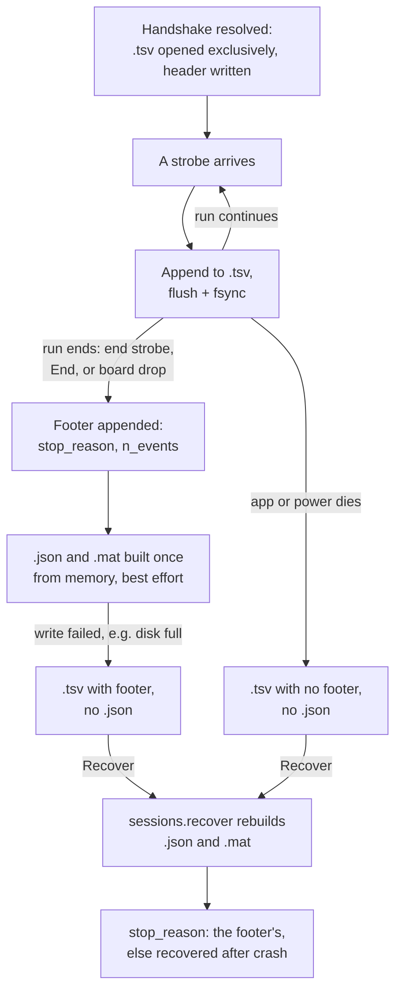
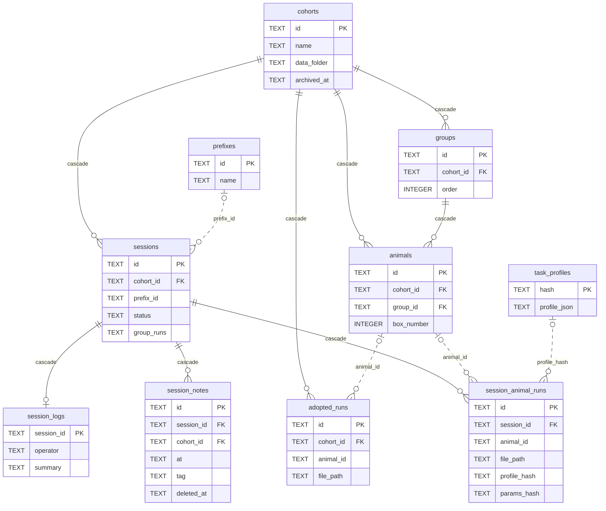
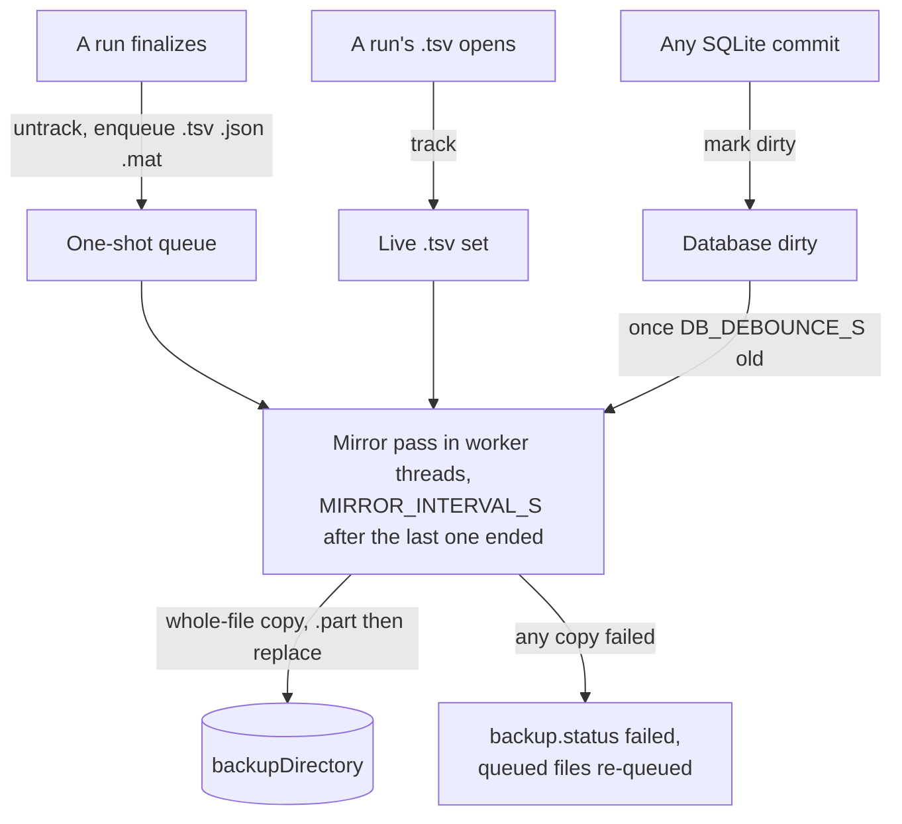
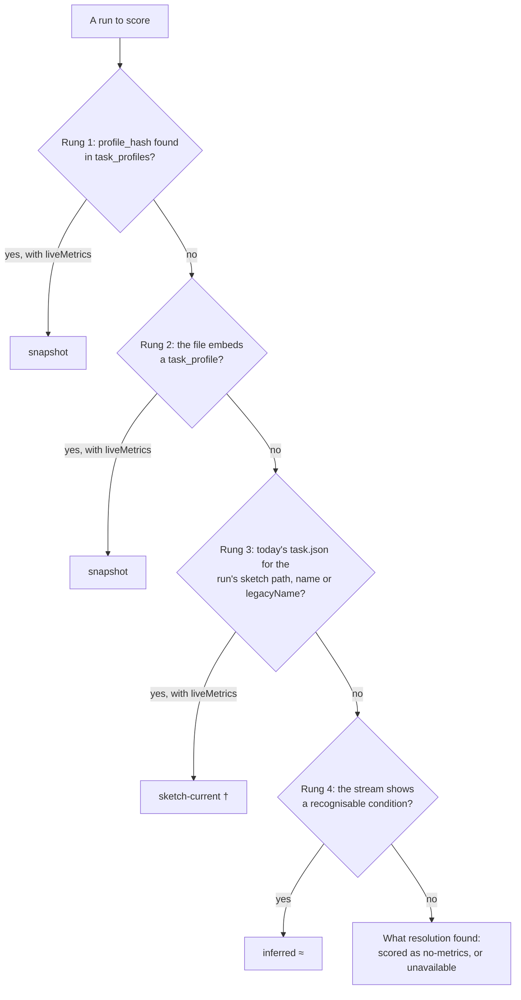
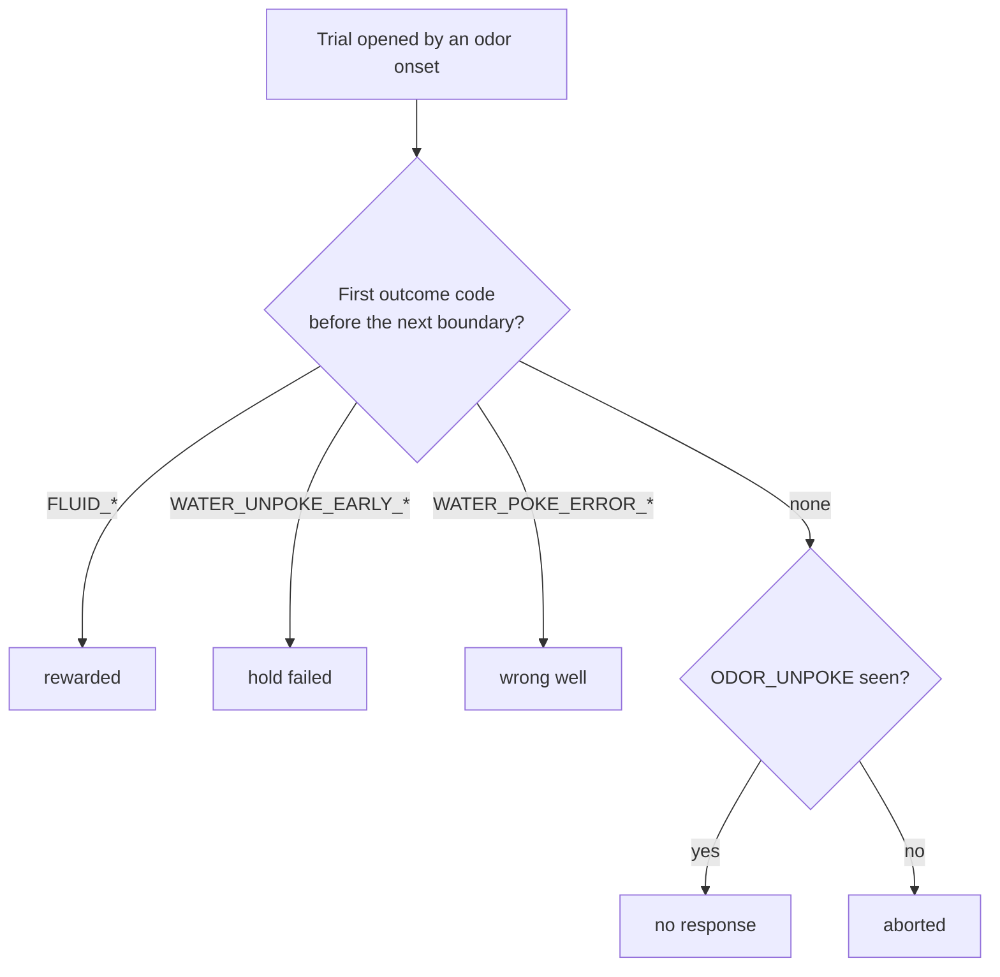
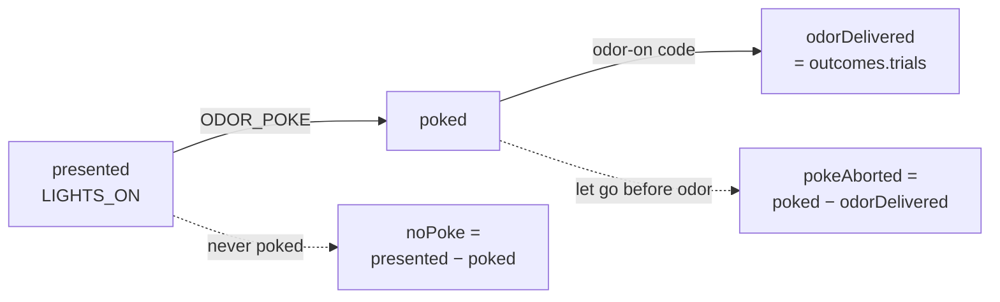

# Data

Everything that lands on disk, everything in the database, and everything read back out of them: the session folder layout, the per-animal files, crash safety and recovery, the SQLite schema, backup mirroring, the archive walk, the cohort model, and **the derived-metric definitions**.

Read with [TASKS.md](TASKS.md) (the profile that decodes a run) and [ARCHITECTURE.md](ARCHITECTURE.md#session-lifecycle) (what triggers these writes). Every command named here is specified in [PROTOCOL.md](PROTOCOL.md).

> [!IMPORTANT]
> **`.tsv` is not an export format.** It is the write-ahead log that makes the crash-durability guarantee real. Every strobe is `flush()`+`fsync()`'d to it the instant it arrives; `.json` and `.mat` are built once, at clean finalization. Read [Crash safety](#crash-safety) before treating `.tsv` as redundant with the other two.

> [!IMPORTANT]
> **The numbers in [Derived metrics](#derived-metrics) are the scientific output, not a UI detail.** They are what a paper would report. Treat that section as a specification.

## Contents

- [Directory layout and naming](#directory-layout-and-naming)
  - [Layout](#layout)
  - [Names](#names)
  - [Why the date is hyphenated](#why-the-date-is-hyphenated)
  - [Reading names other software wrote](#reading-names-other-software-wrote)
- [Cohorts animals and groups](#cohorts-animals-and-groups)
  - [Data model](#data-model)
  - [Validation](#validation)
  - [Auto-Balance](#auto-balance)
  - [Data folder](#data-folder)
  - [Archive and delete](#archive-and-delete)
- [Sessions and runs](#sessions-and-runs)
  - [Prefixes](#prefixes)
  - [Session records](#session-records)
  - [Run records](#run-records)
  - [Continuing between groups](#continuing-between-groups)
- [The session log](#the-session-log)
  - [The session clock](#the-session-clock)
  - [Notes](#notes)
  - [Carry-forward flags](#carry-forward-flags)
  - [What changed](#what-changed)
  - [The notes.md mirror](#the-notesmd-mirror)
  - [Exporting a log](#exporting-a-log)
- [Per-animal files](#per-animal-files)
  - [The JSON document](#the-json-document)
  - [The tsv log](#the-tsv-log)
  - [The mat mirror](#the-mat-mirror)
  - [The embedded task profile](#the-embedded-task-profile)
- [Crash safety](#crash-safety)
  - [Written live](#written-live)
  - [Built once at the end](#built-once-at-the-end)
  - [What is guaranteed](#what-is-guaranteed)
- [Crash recovery](#crash-recovery)
- [SQLite database](#sqlite-database)
  - [Tables](#tables)
  - [Indexes](#indexes)
  - [Changing the schema](#changing-the-schema)
- [Backup mirroring](#backup-mirroring)
  - [Mirror layout](#mirror-layout)
  - [Session files](#session-files)
  - [The database copy](#the-database-copy)
  - [No automatic backfill](#no-automatic-backfill)
  - [Failures](#failures)
- [Reading the archive](#reading-the-archive)
  - [Database first](#database-first)
  - [Orphan adoption](#orphan-adoption)
  - [Which profile decodes a run](#which-profile-decodes-a-run)
  - [Caching](#caching)
  - [Never at the expense of a session](#never-at-the-expense-of-a-session)
  - [Pruning](#pruning)
  - [Carrying adoptions forward](#carrying-adoptions-forward)
  - [Tidy records](#tidy-records)
- [Derived metrics](#derived-metrics)
  - [Boundary codes](#boundary-codes)
  - [Two probabilities per metric](#two-probabilities-per-metric)
  - [Trial counts](#trial-counts)
  - [Run-level scalars](#run-level-scalars)
  - [Uncertainty](#uncertainty)
  - [Edge cases](#edge-cases)
  - [Pooled accuracy](#pooled-accuracy)
  - [Rewarded and response accuracy](#rewarded-and-response-accuracy)
  - [Per-condition tally](#per-condition-tally)
  - [Engagement ladder](#engagement-ladder)
  - [Per-trial tape](#per-trial-tape)
- [Analytics views](#analytics-views)
  - [Pooling across tasks](#pooling-across-tasks)
  - [Session order](#session-order)
  - [Strategy plane](#strategy-plane)
  - [Learning curves](#learning-curves)
  - [Colour palette](#colour-palette)
  - [Drawing lines](#drawing-lines)
  - [Exporting a sheet](#exporting-a-sheet)
  - [Recover and Tidy](#recover-and-tidy)

## Directory layout and naming

### Layout

```
<dataDirectory>/
└── <cohort name>/                                     ← Cohort.dataFolder
    └── <prefix>/                                      ← session prefix
        └── <prefix>_<sessionNumber>_<YYYY-MM-DD>/     ← one per (prefix, number, date)
            ├── notes.md                               ← the session log, when there is one
            ├── behavior.tsv/                          ← written live
            │   └── remy1_<prefix>_<number>_<date>_<HHMMSS>.tsv
            ├── behavior.json/                         ← built once, at run end
            │   └── remy1_<prefix>_<number>_<date>_<HHMMSS>.json
            └── behavior.mat/
                └── remy1_<prefix>_<number>_<date>_<HHMMSS>.mat
```

Built by `sessions/paths.py` (`resolve_session_folder`, `resolve_animal_files`). `notes.md` is derived from the database ([The notes.md mirror](#the-notesmd-mirror)). Example: `Batch A/2O-Bdisc/2O-Bdisc_25_2026-07-22/behavior.json/remy1_2O-Bdisc_25_2026-07-22_113123.json`.

**A session folder is keyed by `(prefix, sessionNumber, date)`.** A second session with the same prefix and a different number the same day gets its own folder; reusing prefix **and** number the same day (unusual, not blocked — `sessions.suggestNumber` returns `sameDayNumbers` for a soft warning) lands in the same folder with new files beside the old. The per-animal `HHMMSS` suffix means same-day reruns never collide, so there is no "already exists" logic. The writer still opens its `.tsv` exclusively ([Written live](#written-live)): the naming makes a collision unreachable; the exclusive open makes an unreachable collision fail loudly instead of truncating data.

### Names

| Element | Format | Example |
|---|---|---|
| Date | ISO `YYYY-MM-DD` | `2026-07-22` |
| Time | `HHMMSS`, 24-hour | `113123` |
| Session folder | `<prefix>_<sessionNumber>_<YYYY-MM-DD>` | `2O-Bdisc_25_2026-07-22` |
| Per-animal file | `<animal>_<prefix>_<number>_<date>_<HHMMSS>.<ext>` | `remy1_2O-Bdisc_25_2026-07-22_113123.json` |

The per-animal timestamp is the moment **that animal's run starts**, not session-config time, so animals starting minutes apart get distinct, honest stamps. Cohort, prefix, session-number and animal names all pass through `cohorts/folders.py`'s `sanitize_name`.

### Why the date is hyphenated

The lab's original convention was `MM_DD_YY`, which does not sort across a year boundary (`12_31_26` sorts after `01_01_27`). The replacement is hyphenated ISO, **not** underscored ISO, because both underscored forms split into the same number of `_` tokens:

```
remy1_2O-Bdisc_25_07_22_26_113123      →  7 tokens   (legacy)
remy1_2O-Bdisc_25_2026_07_22_113123    →  7 tokens   (underscored ISO — rejected)
remy1_2O-Bdisc_25_2026-07-22_113123    →  6 tokens   (used)
```

A script parsing these names positionally would survive the underscored form and read every date wrong. The hyphenated form changes the token count, so such a script breaks visibly.

**Nothing on disk is ever renamed.** Old folders keep `MM_DD_YY`, so a prefix folder holds both spellings for as long as its history spans the change.

> [!CAUTION]
> **Never sort these names as strings.** Both formats coexist on disk indefinitely, so lexical order over a real archive is wrong whichever format you assume. Call `sessions/paths.py`'s **`parse_name_date`**, which reads both, anchored at the end of the name. The anchoring is what disambiguates the legacy form: an unanchored `NN_NN_NN` search in `2O-Bdisc_25_07_22_26` matches `25_07_22` — the session number plus two thirds of the date.

### Reading names other software wrote

What the app *reads* is wider than what it writes, because the archive walk meets folders named by other programs, and those names are read as they are, permanently.

- **The session number can lead** (`00_01_shaping_gr_06_17_26`). `parse_session_folder` finds the number by *being numeric*, not by position: trailing first (so every name this app wrote reads as before), then leading.
- **Separators vary within one archive.** A separator variant is reported **as written**, never normalized: folding `-` into `_` would tidy one stray folder and also merge `2O-Bdisc` with `2O_bdisc`, which are distinct prefixes in a real archive. Renaming a folder belongs to whoever owns the data.

## Cohorts animals and groups

### Data model

Defined in `cohorts/models.py`, stored in the `cohorts`, `groups` and `animals` tables.

| Entity | Fields |
|---|---|
| **Cohort** | `id`, `name` (unique among active cohorts), `dataFolder` (absolute, resolved once at creation), `createdAt`, `updatedAt`, `archivedAt` (null = active), `appearance` (null = derived from `id`; see [ARCHITECTURE.md](ARCHITECTURE.md#frontend)), plus its `animals` and `groups` |
| **Animal** | `id`, `name` (unique within the cohort, case-insensitive), `groupId` (exactly one group), `boxNumber` (1–6 or null — the standing box), `cage` (home-cage number ≥ 1, or null = unknown), `sex` (`M` / `F` / `unknown` / null — an enum because sex-balanced grouping needs it), `idNumber` (free text; ID schemes vary), `notes` |
| **Group** | `id`, `name`, `order` — **display order only**; groups have no run order |

A cohort can be created with zero animals and filled in over the following days.

**Groups always exist.** A cohort whose operator never makes one gets a single default group (`Group 1`), so grouped and ungrouped cohorts share one code path. Groups exist to split a roster larger than the rig into consecutive runs; which group runs next is chosen by the operator each time ([ARCHITECTURE.md](ARCHITECTURE.md#session-lifecycle)).

**`cage` changes what the sky draws, never what a session may do.** Housing and grouping are independent facts, so cagemates can sit in different groups; the 3D views draw one ship per cage.

### Validation

Enforced by `cohorts/repository.py`'s `_validate` (per-field errors, so the editor can show them inline) and, for cohort names, by the partial unique index `idx_cohorts_active_name`.

| Rule | Detail |
|---|---|
| Cohort name | Unique among **active** cohorts; archived ones release the name |
| Animal name | Required; unique within its cohort, not globally |
| `boxNumber` | `1`–`6` (`MIN_BOX`/`MAX_BOX`), validated against that range **and nothing else** |
| `boxNumber` uniqueness | Scoped to the **group**: groups run consecutively, so one physical box is legitimately reused across groups. `null` collides with nothing |
| `cage` | Integer ≥ 1, no upper bound, no occupancy limit, no interaction with groups |
| `groupId` | Must name one of the cohort's groups |

> [!IMPORTANT]
> **The box rule is split across two places on purpose.** The sidecar validates only the range, because two lab machines with independent bindings share one data directory, and a cohort set up on one must stay editable on the other. The editor is opinionated: it offers only boxes bound on *this* machine (`src/lib/cohorts/boxAvailability.ts`), because offering a box that does not exist produced an assignment discovered to be impossible halfway through the flash sequence. Don't fold either half into the other.

> [!CAUTION]
> **A stored assignment this machine can't honour is kept and reported, never rewritten.** A box that is merely unplugged is still the box that animal belongs in; clearing it would turn a loose USB hub into data loss. The editor names the affected animals and the browser flags the cohort — and both stay silent while the sidecar is disconnected, because reporting blindness as a fault is worse than saying nothing.

### Auto-Balance

Proposes a complete grouping instead of animal-by-animal placement (`cohorts.suggestGroups`). It is a **preview the operator reviews and can hand-edit**, applied as an ordinary `cohorts.update` — never a silent bulk change.

Implemented twice: `cohorts/grouping.py` in the sidecar and `src/lib/cohorts/grouping.ts` in the client (so it runs on a roster not yet saved). **The two are kept in sync by hand**; there is no contract test, and `sidecar/tests/test_grouping.py` is the behavioural spec both must satisfy.

- **Inputs.** Either a group count or a max group size; the other is derived. *Balance by sex* is offered only when at least one animal is `M` or `F`. Group size pre-fills with the number of boxes **bound** on this machine (not detected — a default that moved as USB re-enumerated would be useless); a roster that outgrew the rig pre-fills the count with `ceil(animals / boxes)`.
- **The hard constraint.** No group may exceed 6 animals (`MAX_GROUP_SIZE`): box numbers span 1–6, so a larger group can never be uniquely assigned. Such a request is **rejected** with `minimumGroups = ceil(animals / 6)`.
- **The algorithm** is a balanced round-robin, not an optimization: partition by sex into `M`, `F`, then `unknown`/null (one bucket when balancing is off); walk the buckets in that order assigning groups `0, 1, … N−1, 0, …` with **one cursor carried across buckets** (restarting it per bucket would pile each bucket's first animals onto the low groups); then number boxes `1, 2, 3 …` within each group in landing order. Sizes stay within one of each other.
- **Always a full re-proposal.** It ignores the existing grouping entirely; the preview makes the change unambiguous.

### Data folder

Resolved by `cohorts/folders.py`. On creation, unless overridden: `dataFolder = <dataDirectory>/<sanitized name>`, suffixed `-2`, `-3`, … until the path is unused. **The resolved path is stored verbatim**, never re-derived from the name.

> [!IMPORTANT]
> **Renaming a cohort does not move its data folder.** An automatic move-on-rename is exactly the kind of implicit file operation this project avoids; the detail view shows the real path instead.


Relocating is a separate action, `cohorts.setDataFolder` (`relocate`), with two intents chosen by `moveExisting` and **opposite** requirements for the destination:

| `moveExisting` | Meaning | Destination |
|---|---|---|
| `true` | Move this cohort's data there | **Must be empty** — refuses rather than merging or overwriting |
| `false` | Point the cohort at data already there | **Expected to be full**; nothing is moved or written |

> [!WARNING]
> **`moveExisting: false` is how a cohort attaches to an archive written before this app existed** — the reason [orphan adoption](#orphan-adoption) exists. Requiring an empty destination in both cases made that intent impossible to express. The empty rule protects against merge collisions, and there are none when nothing is written.

### Archive and delete

| Action | Meaning |
|---|---|
| **Archive** (`cohorts.archive`) | The everyday "delete". Hides the cohort, keeps the record and folder intact, reversible with `cohorts.restore`. No confirmation, deliberately — it is reversible |
| **Permanent delete** (`cohorts.delete`) | Only on an already-archived cohort (`COHORT_NOT_ARCHIVED` otherwise) — a two-step guard. Removes the cohort's rows, and by cascade its groups, animals, sessions, run records and adoptions |

> [!IMPORTANT]
> **Deleting a cohort record never touches its `dataFolder` on disk.** The app removes its own bookkeeping, never a user's data files.

## Sessions and runs

### Prefixes

A **prefix** (`id`, `name`, unique case-insensitively) names a task or paradigm, not a cohort, so prefixes are **global** — shared by every cohort. Operator-managed (`prefixes.*`), offered in the session config step. Deleting one only removes it from the dropdown; nothing on disk changes, and a session keeps its own `prefix_name` copy (so `sessions.prefix_id` deliberately has no foreign key).

### Session records

One row in `sessions` per session-flow invocation (`sessions/models.py`'s `Session`):

| Field | Notes |
|---|---|
| `cohortId`, `prefixId`, `prefixName` | |
| `sessionNumber` | Free text, not strictly numeric — never sort by it |
| `date` | The calendar day the folder belongs to (ISO) |
| `startedAt`, `endedAt` | When the record was created (Step 1) and closed — **not** when boxes ran; see [The session clock](#the-session-clock) |
| `status` | `configuring` → `running` → `completed`, or `aborted` |
| `folderPath` | The session folder |
| `groupRuns` | JSON list of `{groupId, order, startedAt, endedAt}` — one per group run, `order` its position in this session's sequence. A group may appear more than once |
| `durationMinutes` | Optional per-box time limit; null = none |
| `recording` | Null for behavior only; otherwise one entry per group run ([RECORDING.md](RECORDING.md#what-is-written)) |

Every session listing is ordered by `(date, startedAt)` and carries an `ordinal` from that order — never from `sessionNumber`, which would sort `10` before `9`.

### Run records

One row in `session_animal_runs` per animal per session — the unit Analytics scores (`SessionAnimalRun`): `sessionId`, `animalId`, `boxNumber`, `sketchPath`, `filePath` (the finalized `.json`; null if the writer never opened), `startedAt`, `endedAt`, `stopReason`, `profileHash`, `config` (stored as `config_json`, the merged parameter values) and `paramsHash`.

> [!IMPORTANT]
> **`profileHash` records which Task Profile this run used.** A `task.json` lives beside its sketch, outside the data directory, and can be edited or deleted long after the session; without a snapshot, an old run would be silently re-read with today's codes and metrics. Null means the run predates snapshotting, which is exactly what Analytics needs in order to flag it. How the hashes are computed: [TASKS.md](TASKS.md#profile-and-params-hashes).

### Continuing between groups

Resuming a group **mid-run** after a crash is out of scope by decision (reconnecting boards, restoring trial state, deciding whether the animal kept running). What is built is continuing **between** groups: `sessions.resume` re-holds one of *today's* sessions that already ran a group — a crash-orphaned `running` one or a `completed` one ended too early — closes any group run the crash left open, and leaves it between groups so the operator can run any group. The new files land in the same folder beside the earlier ones. Same day only, because the folder is named for its date. Flow: [ARCHITECTURE.md](ARCHITECTURE.md#session-lifecycle).

## The session log

The **Log** tab's lab notebook: timestamped notes and a few free fields per session, plus what the app can say on its own — when the session ran and what changed since each animal's previous run. Owned by `logbook/` in the sidecar; the commands are `logbook.*` ([PROTOCOL.md](PROTOCOL.md#session-log)). What the operator sees: [USER-GUIDE.md](USER-GUIDE.md#keeping-the-log).

> [!IMPORTANT]
> **Notes are user data, not bookkeeping.** Every other table here can be rebuilt from the archive or is the app's own record; a note is the operator's words and exists nowhere else. So a session carrying one is **never** judged empty by [Tidy records](#tidy-records) and never [pruned](#pruning), and a delete is soft (`deleted_at`) — hidden, never erased.

### The session clock

`sessions.started_at` is stamped when Step 1 creates the record, which can be many minutes of set-up before a box runs. The **session clock** is what the operator means by "the session":

| Field | Definition (`Session.clock_started_at`, `clock_ended_at`) |
|---|---|
| `clockStartedAt` | The earliest group run's `startedAt`; the record's `startedAt` if no group ran |
| `clockEndedAt` | The latest group run's `endedAt` once every run is closed, else the record's `endedAt`; null while the session is `configuring` or `running` |

Both are derived, never stored, and ride on `Session` and `SessionListItem`. Elapsed time everywhere — the Log header, Mission Control, the PDF — is `clockEndedAt − clockStartedAt`, or `now − clockStartedAt` while open.

A note's **T+ offset** (`offsetMs`) is its `at` minus `clockStartedAt`, derived on every read so a tidy merge or an edited `at` can never leave a stale one. A note whose `at` falls outside `[clockStartedAt, clockEndedAt or now]` — one written the next morning about the session — has no offset rather than a misleading one.

> [!CAUTION]
> **The session clock is not a run's clock.** Each animal's stream `t = 0` is its own first strobe, which trails its run's `started_at` (stamped before the board handshake, to the second). Placing a note on a run's [trial tape](#per-trial-tape) is therefore approximate to a few seconds, and is drawn as approximate.

### Notes

`session_notes`, one row per entry: `at` (the moment it is about, UTC with milliseconds, editable), a **tag** (`observation`, `intervention`, `hardware`, `animal-health`, `protocol-deviation`), a **scope** (the whole session, one animal, or one box), and free text. Editing stamps `edited_at`; there is no revision history.

A session's **operator** and **summary** live in `session_logs`, one row per session, a table of its own so the `sessions` row and its wire shape stay untouched.

A recovered-files session (`adopted:…`, [Orphan adoption](#orphan-adoption)) takes no notes: it has no record to hang one on, and fabricating one would corrupt session-number suggestion.

### Carry-forward flags

A note flagged **carry forward** stays open until resolved, and every open flag for the cohort is shown in Step 1 of the next set-up and on Mission Control (`logbook.openFlags`). Resolving records when and, if during a session, which one (`resolved_in_session`). If tidy later deletes that session, the flag stays resolved and only loses the reference; if tidy merges it, the reference follows to the kept record.

### What changed

For every recorded run, `logbook/diff.py` compares the same animal's previous recorded run, in `(date, started_at)` order — never by session number:

- **Task**: the `profile_hash` differs (a snapshotless run compares `sketch_path`). Same name with a different hash reads as *definition revised*.
- **Box**.
- **Parameters**: equal `params_hash` is no change; otherwise a key-level diff of `config`. A run from before parameters were recorded (`config` null) reports `paramsKnown: false` — **unknown, never "changed"**.

Adopted runs are not compared: they carry no parameters or box of their own, and a diff against one would report missing knowledge as change. Entries appear as each run is recorded at finalization.

### The notes.md mirror

Each session folder that has a log gets a `notes.md` beside its format folders: header times, operator, summary, what changed, and the notes in time order. The database is the source of truth; the file is **derived**, rewritten whole, never read back. It exists so the log travels with the data — to the backup mirror, a colleague's copy, whoever opens the folder without Ephymeris.

- **One file per folder, not per record.** Split records share a folder ([Tidy records](#tidy-records)), so the file covers every record pointing at it.
- **Written about a second after the last change** (debounced per session), in a worker thread, via `notes.md.part` and an atomic replace, then queued for [backup](#session-files). A command reply never waits on it and the runner never calls it, so a slow share costs only a stale copy.
- **A missing session folder is created; a missing parent is not.** A missing prefix folder means an unmounted or moved archive, and recreating its path would scatter notes away from their data. Any failure is logged; the database copy is intact.
- **Invisible to the archive walk**, which only reads inside the format folders.

### Exporting a log

**Session PDF** and **Logbook PDF** (the Log header) write a vector PDF with selectable text: one session's page, or the whole cohort oldest-first behind a cover that lists the open flags. Rendered in the webview by `@react-pdf/renderer` (`components/logbook/pdf/`), loaded by dynamic `import()` on the first export only, and saved through the shell like the [PNG sheet](#exporting-a-sheet). Every string comes from `lib/logbook/document.ts`, built from the same helpers as the screen — the performance table from `sessionRunsOf` and `conditionColumns`, what changed from `changeParts` — and is unit-tested there; the renderer only lays it out. Printed in the paper palette ([ARCHITECTURE.md](ARCHITECTURE.md#printed-documents)).

> [!CAUTION]
> Each of these, done wrong, yields a **plausible-looking wrong PDF**, or none:
>
> - **Ligatures are off on every page** (`fontFeatureSettings`). The faces are `@fontsource` latin subsets, and a ligature — JetBrains Mono's `...`, `//`, `==`, `--`; Inter's `->` — maps to a glyph the subset dropped. That does not misprint; it throws inside the font engine and loses the export, on text people type in notes all the time.
> - **A character no embedded face covers prints as `?`** (`printable`). Left alone, the engine falls through to a built-in face and draws *another* glyph — `≥ 3` printed as `ꞓ3`. Inter's latin-ext and Greek subsets are registered as fallbacks, so accented names and `ΔF/F` print correctly; common symbols (`→ ≥ ≤ ≠`) are spelled out.
> - **Fonts are `.woff`, inlined with `?inline`**, for the PNG sheet's reason: a fetch over the packaged app's custom scheme fails silently, and the fallback is Helvetica.
> - **Titles have a pinned height.** The engine measures Space Grotesk's line box short and draws the next line through the title.
> - **The page footer is pinned from the top, with its own height and line height.** A `fixed` element is laid out again on every page; pinned by `bottom` it grew roughly fortyfold per page until, around page seven, the writer refused a coordinate of −2.6e21 and the whole logbook export failed — while every short export worked. The page number is the exception that proves the care needed: a `render` text given an explicit height prints nothing, so it spans the margins instead. `lib/logbook/pdf.test.ts` renders a forty-session logbook to keep this honest.
> - **A recovered session reads as one.** Its run ends are derived from the recorded stream, marked `~`, as on screen; what changed says its runs are not compared rather than that there were none.

## Per-animal files

### The JSON document

```jsonc
{
  "rat": "remy1",
  "serial_port": "COM6",
  "session_id": "2O-Bdisc_25",
  "sketch": "GRGL",
  "correction_left": 0,          // ← task fields, flat, from the Task Profile
  "lazy_escalation": true,
  "task_profile": { /* the serialized Task Profile */ },
  "stop_reason": "BF_END_SESSION received",
  "trial_seed": 288577176,
  "host_seed": 288577176,
  "n_events": 2392,
  "ts_data": [[221, 0], [222, 1000], [223, 5001], /* … */ [246, 3523555]]
}
```

| Field | Source |
|---|---|
| `rat` | `Animal.name` |
| `serial_port` | The literal OS port the run used — *which physical port*, distinct from the abstract box number |
| `session_id` | `<prefix>_<sessionNumber>` |
| `sketch` | The sketch chosen at mapping |
| task fields | The run's merged parameter values, one top-level key per declared `metadataKey`. Absent for a profile-less sketch |
| `task_profile` | The profile snapshot ([below](#the-embedded-task-profile)). **The only nested value.** Absent for a profile-less sketch |
| `stop_reason` | Set by the sidecar at run end. Open set: `BF_END_SESSION received` (clean), `board disconnected`, `sidecar error: <cause>`, `recovered after crash`, … |
| `trial_seed` | What the **board** reported on its `SEED` line; absent if it never sent one |
| `host_seed` | What the **app** put on the `START` line. Differs from `trial_seed` only if the firmware ignored it |
| `intan_*` | Present only inside a recording ([RECORDING.md](RECORDING.md#what-is-written)) |
| `n_events` | `len(ts_data)` |
| `ts_data` | `[code, timestamp_ms]` pairs exactly as the board sent them — ms since **that animal's own** session start, never re-based to wall clock |

> [!CAUTION]
> **Task fields are merged flat at the top level**, not under a `config` key. A profile whose `metadataKey` matched a core field would silently overwrite it, so `parse_profile` rejects any `metadataKey` in `tasks/profile.py`'s `CORE_METADATA_KEYS`. The set includes `task_profile` (the writer sets the snapshot after the task fields) and the `intan_*` fields; add any new core field to it.

### The tsv log

A live append-only log, not a serialization of the document:

```
# rat: remy1
# serial_port: COM6
# session_id: 2O-Bdisc_25
# sketch: GRGL
# correction_left: 0
# task_profile: {"config":[…],"liveMetrics":[…],"strobes":{…},"taskName":"GRGL"}
221	0
222	1000
…
# stop_reason: BF_END_SESSION received      ← footer, at finalization
# n_events: 2392
```

The `# key: value` header is written by `AnimalWriter.open_files` after `START`/`SEED` resolve and before the first strobe. The **profile snapshot rides in the header as one compact JSON line, always last**, so a `.tsv` rebuilt by [crash recovery](#crash-recovery) yields a `.json` as self-describing as a finalized one — and the recovered file is exactly the one someone carries to another machine. `stop_reason` and `n_events` are unknown until the end, so they form a **footer**. **A `.tsv` cut off mid-session lacks only that footer.**

### The mat mirror

Same field names, written from the same in-memory dict as the JSON — one source serialized twice. `ts_data` becomes an `N×2` double array; `task_profile` becomes a **char array holding JSON** (`jsondecode(task_profile)` in MATLAB), since a profile is a deep ragged tree nobody reads as a struct.

Every number is a `double` and every bool a `logical`; an empty `ts_data` is still `0×2`. `sessions/matwriter.py` writes it with `scipy.io.savemat` (uncompressed Level 5) and owns the conversion from Python values, because `savemat` unaided would keep an int as `int64` and an empty list as `0×0`. `tests/test_matwriter.py` pins each class and shape through `scipy.io.loadmat`.

> [!CAUTION]
> **A `.mat` is refused rather than written wrong.** `savemat` sizes a char array in code points where MATLAB counts UTF-16 code units, so a character outside the BMP (an emoji) would yield a string whose dimensions disagree with its data; it also drops a variable whose name starts with `_` with only a warning. Both raise instead, the `.mat` is skipped and logged, and the `.tsv` and `.json` carry the run. `task_profile` is ASCII-escaped JSON, so labels in it never trip this; a top-level string such as an animal name can.

### The embedded task profile

**A run is only as readable as the declaration that decodes it.** A `task.json` and the database snapshot both live on the machine that ran the session, but sessions in this lab are routinely copied to another machine for analysis. Carrying the declaration inside the file makes the copy decode exactly as the original, anywhere, with **the same `profile_hash`** — so it lands in the same profile group and comparability set as its origin.

- **The hash identity depends on `TaskProfile.to_json` round-tripping byte-for-byte through `parse_profile`.** A test pins it across every shipped profile; anything added to `TaskProfile` must keep it true, or a copied run leaves its origin's group.
- **The snapshot names which fields are parameters.** The values are already flat in the document, but only the profile says which keys are declared fields (`recorded_config`). With it, a copied run recomputes the same `params_hash` its own rig did; without it, two differently-tuned runs of one task would pool silently. `trial_seed`/`host_seed` describe the run, not its tuning, and are never hashed.
- **It costs roughly 10–15 KB per file**, a fraction of `ts_data`, and buys independence from the machine that wrote it.

A profile-less sketch writes no snapshot: an empty one would claim a declaration that never existed.

## Crash safety

The goal is recoverable data up to the moment of a power loss, not eventual consistency.

One animal's files from the first strobe to the last, and the two ways a run can be left with a `.tsv` and
no `.json` (`sessions/writer.py`, `sessions/recovery.py`):



### Written live

Every parsed strobe is appended to the `.tsv` **the instant it arrives**, with `flush()` + `fsync()` on every line (`AnimalWriter.record`). A real session averages under one event per second, so a few-millisecond fsync per line costs nothing. Lines are written **exactly as the board sent them** (`<code>\t<timestamp>`), so no formatting bug can corrupt the one file that must be bulletproof.

> [!IMPORTANT]
> **The file is opened exclusively (`"x"`), never truncating.** The `HHMMSS` suffix makes a collision practically unreachable, but this is the file carrying the durability guarantee. If it ever fires, the box refuses to start with an error naming the file in the way. **Refusing to start is recoverable; a truncated write-ahead log is not.**

**If a write fails mid-session** (disk full, permissions), the runner logs it and broadcasts `sidecar.error` naming the box — the one failure with no command to attribute it to — which Mission Control shows on that box. The strobe is dropped, not retried, and the run continues: the operator is told at once that data is no longer being saved. A failure to *open* the file takes the same route and records `stop_reason: "sidecar error: <cause>"`.

### Built once at the end

`.json` and `.mat` are not append-friendly and don't need to be; they are built once in `AnimalWriter.finalize`. Finalization is **idempotent** (the first `stop_reason` wins, so a board-drop racing an operator stop cannot rewrite history), and the two structured writes are **best-effort**: an `OSError` is logged, not raised. The `.tsv` is already closed and durable by then, so failing to produce a convenience format must never look like failing to save data.

### What is guaranteed

- **Guaranteed:** if the PC loses power mid-session, every strobe through the last completed line is on disk in the `.tsv`, human-readable, with at most the in-flight line at risk.
- **Guaranteed:** a board dropping mid-run finalizes with `stop_reason: "board disconnected"`; the file is complete up to the drop.
- **Not guaranteed, by decision:** resuming an interrupted group mid-run. See [Continuing between groups](#continuing-between-groups) and [Crash recovery](#crash-recovery).

## Crash recovery

`sessions/recovery.py` (`sessions.recover`, the **Recover** button in Analytics) finds a cohort's orphaned `.tsv` files — logs with no `.json` sibling — and rebuilds `.json` and `.mat` from them. It is a pure file transformation, the inverse of `AnimalWriter`: **not** session resumption, and it never talks to a board.

- **It shares the archive walker** (`analytics/reader.py`'s `walk_orphaned_tsvs`, over `_walk_format_dirs`), so every legacy layout [adoption](#orphan-adoption) reads, recovery reads too, and it backfills in the same layout (a `recovery_tsv/` orphan gets `behavior_json/` and `behavior_mat/`).
- **A footer wins.** A `.tsv` with a footer finalized cleanly and only its best-effort `.json` write failed (the disk-full case); it keeps its recorded `stop_reason`. Only a footer-less log gets `stop_reason: "recovered after crash"` (`RECOVERED_STOP_REASON`).
- **`n_events` is recomputed** from the lines actually parsed, never copied from a footer.
- **Header values are coerced** to numbers and bools except the always-string fields (`_STRING_FIELDS`: names, port, `intan_*` text). `task_profile` is decoded as JSON; a line torn by the crash is **dropped**, not kept as text — half a snapshot every reader must defend against is worse than none.
- Strobe lines must match the live parser's strict `^\d{1,3}\t\d+$`, so a torn final line costs only itself.
- **Rejected while any box is running:** a live run's `.tsv` legitimately has no `.json` yet.

The Recover button chains an `analytics.rescan`, so recovered files are adopted in the same click. It is a `sessions.*` command because it **writes** session files; analytics never writes the archive.

## SQLite database

`ephymeris.db` lives in the **app data directory**, not in `dataDirectory`: that folder is where lab members browse session output, and an opaque database file does not belong among session files. Owned by `cohorts/db.py`: one connection behind a lock, called through `asyncio.to_thread` so the event loop never blocks on disk. The current version is `SCHEMA_VERSION` in that file.

### Tables

The relations between the tables, with key columns only. Dotted lines are references **without** a foreign
key, each deliberate (see the notes below). `run_metrics_cache` is left out: it is a pure cache whose
`run_id` names either a run record or an adopted run.



| Table | Columns | Notes |
|---|---|---|
| `cohorts` | `id`, `name`, `data_folder`, `created_at`, `updated_at`, `archived_at`, `appearance_json` | |
| `groups` | `id`, `cohort_id`, `name`, `"order"` | Cascades from `cohorts` |
| `animals` | `id`, `cohort_id`, `group_id`, `name`, `box_number`, `cage`, `sex`, `id_number`, `notes` | Cascades from `cohorts` and `groups` |
| `prefixes` | `id`, `name` (`UNIQUE COLLATE NOCASE`) | Hard delete; nothing on disk depends on it |
| `sessions` | `id`, `cohort_id`, `prefix_id`, `prefix_name`, `session_number`, `date`, `started_at`, `ended_at`, `status`, `folder_path`, `group_runs` (JSON), `duration_minutes`, `recording_json` | No FK on `prefix_id` |
| `session_animal_runs` | `id`, `session_id`, `animal_id`, `box_number`, `sketch_path`, `file_path`, `started_at`, `ended_at`, `stop_reason`, `profile_hash`, `config_json`, `params_hash` | Cascades from `sessions`; **no FK on `animal_id`** |
| `task_profiles` | `hash`, `task_name`, `kind`, `profile_json`, `first_seen_at` | **Content-addressed** snapshots: identical profiles store once, and comparability is an indexed equality test |
| `run_metrics_cache` | `run_id`, `file_path`, `file_mtime_ns`, `file_size`, `profile_hash`, `profile_source`, `scored_profile_hash`, `params_hash`, `codec_version`, `computed_at`, `status`, `detail`, `summary_json` | A pure cache. **No FK on `run_id`** — adopted runs have no run record. `profile_hash` is what *resolution* reached; `scored_profile_hash` what the run was *scored* with ([why both](#which-profile-decodes-a-run)) |
| `adopted_runs` | `id`, `cohort_id`, `animal_id`, `file_path`, `prefix_name`, `session_number`, `date`, `started_at`, `sketch_name`, `sketch_path`, `adopted_at`, `file_mtime_ns`, `file_size` | Files the archive walk matched to an animal. Deliberately separate from `sessions`/`session_animal_runs` |
| `session_notes` | `id`, `session_id`, `cohort_id`, `at`, `created_at`, `edited_at`, `deleted_at`, `tag`, `scope_kind`, `animal_id`, `box_number`, `body`, `carry_forward`, `resolved_at`, `resolved_in_session` | [The session log](#notes). Cascades from `sessions` and `cohorts`; **no FK on `animal_id`** (the caution below) or `resolved_in_session` |
| `session_logs` | `session_id`, `operator`, `summary`, `updated_at` | One per session that has one. Cascades from `sessions` |

### Indexes

Indexes live in their own `INDEXES` block, applied **after** migrations: an index on a column a migration is adding would otherwise fail on exactly the databases that migration exists for.

| Index | Why |
|---|---|
| `idx_cohorts_active_name` | **Partial** unique index on `name COLLATE NOCASE WHERE archived_at IS NULL` — the database enforces "unique among active cohorts" rather than every code path remembering it |
| `idx_runs_animal` | Per-animal cross-session history |
| `idx_runs_profile`, `idx_runs_params` | Comparability is the pair `(profile_hash, params_hash)` |
| `idx_sessions_cohort_dt` | The chronological session axis, index-ordered |
| `idx_adopted_file` | Unique `(cohort_id, file_path)`: one adoption per file |
| `idx_notes_open_flags` | **Partial** on `cohort_id` for open carry-forward flags — asked on every Step 1 |

Plus plain lookup indexes on each table's parent id.

> [!CAUTION]
> **An index on `animal_id`, never a foreign key.** `cohorts.update` deletes and re-inserts the cohort's entire animal set on every roster edit. With `ON DELETE CASCADE`, a single rename would destroy every historical run in the cohort. **The missing foreign key is load-bearing.** The same holds for `adopted_runs.animal_id`; storing the *id* is what lets an adopted run survive a rename.

### Changing the schema

> [!CAUTION]
> **Adding a table needs only a `CREATE TABLE IF NOT EXISTS` in `SCHEMA`** — that covers fresh and existing databases alike.
>
> **Adding a column does not.** The same statement leaves an existing table untouched, so the column would appear only on new databases — while `user_version` is stamped to the new number anyway. The database then *claims* the new version without the column, and the next query raises `OperationalError`, on a lab machine, at session finalization.
>
> **Do all three:** bump `SCHEMA_VERSION`, update `SCHEMA` to the final shape, **and** add a `MIGRATIONS` entry (keyed by the version it upgrades *to*). Either half alone leaves one class of database wrong.

- **Freshness is decided by whether `cohorts` exists, not by `user_version`.** A file from a build that predates versioning reports 0 while holding real tables; it is treated as v1 so every migration applies.
- **`add_column` is idempotent** (it checks `PRAGMA table_info`), so a migration interrupted by a power loss re-runs safely. New columns must be nullable or have a constant default.
- **Startup commits once**, because every commit marks the database dirty for [backup](#the-database-copy).
- **A newer database still opens**, with a loud error rather than a refusal: every change is additive, and refusing would strand a machine that merely ran an older installer.
- **A migration may repair a cache**, never data: the v8 step deletes `inferred` cache rows that would otherwise never recompute ([below](#which-profile-decodes-a-run)).

> [!TIP]
> `tests/test_migrations.py` pins the v1 and v2 schemas as **literal fixtures**. Extend it rather than importing the current schema, which would test today's code against itself.

## Backup mirroring

Two complementary protections:

| Mechanism | Protects against | Where |
|---|---|---|
| The `.tsv` write-ahead log | The app or power dying mid-session | The same disk |
| Backup Directory mirroring (`backup/`) | Losing the whole `dataDirectory` | A different disk or share (`backupDirectory`) |

> [!IMPORTANT]
> **The backup target may be slow, networked, or dead, and none of that may ever slow, stall, or fail a session.** Finalization *queues* copies rather than waiting, `.tsv` mirroring is a periodic whole-file pass rather than per line, and every filesystem operation runs in a worker thread. Don't "optimize" any of it into the critical path: a mirror that blocks finalization is worse than no mirror.

Everything the session side does is mark or queue and return; the copying happens in the manager's own
passes (`backup/manager.py`):



### Mirror layout

```
<backupDirectory>/
├── <cohort folder basename>/       ← that cohort's folder, contents unchanged
├── ephymeris.db                    ← current mirror of the database
└── db-snapshots/
    └── ephymeris_<YYYY-MM-DD>.db   ← one per day, newest DB_SNAPSHOT_KEEP kept
```

> [!IMPORTANT]
> **Mirror paths are anchored on the cohort folder, not on `dataDirectory`.** `cohorts.setDataFolder` can put a cohort anywhere, so subtracting `dataDirectory` from a path doesn't generalize. In the normal case this reproduces the familiar layout, which is the point: a last-resort archive nobody can navigate is worth much less.

Two relocated cohort folders sharing a basename both get a short path-derived suffix (`backup/paths.py`'s `mirror_segments`), so the layout does not depend on enumeration order.

**The mirror is additive.** Nothing is deleted from it because it disappeared from the source — a mirror that reproduces a deletion protects against nothing.

### Session files

- **`.json`/`.mat` at finalization are queued**, never copied inline. `backup.status` reports the queue depth, so "not yet mirrored" is visible.
- **A running `.tsv` is mirrored every `MIRROR_INTERVAL_S` (10 s)**, measured from the end of the previous pass, so a slow target stretches the cadence instead of overlapping passes. That leaves at most a few strobes unmirrored, against a local file already fsync'd per line.
- **`notes.md` is queued whenever it is rewritten** ([The notes.md mirror](#the-notesmd-mirror)).
- **Every copy is whole-file** via a `.part` file plus an atomic replace, so a crash mid-copy never leaves a torn file where a good one was.

### The database copy

`ephymeris.db` is mirrored on **every commit**, debounced by `DB_DEBOUNCE_S` (5 s) because a roster edit commits many times in quick succession.

> [!NOTE]
> **The trigger hangs off SQLite `commit` itself** (`_TrackedConnection`), not a call in each repository method: no write path can forget to announce itself, and the trigger is truly "the database changed" — `session_animal_runs` is written during unattended overnight runs.

**The copy is two-step.** `Database.snapshot_to` uses SQLite's online backup API (a plain copy of a live database can capture a torn page), but that holds the lock, so it writes to a **local** temp file first and the slow copy to the mirror happens with nothing locked. Pointing it straight at a network share would let the share's latency block every database read.

**Dated snapshots** exist because a single live mirror would faithfully propagate an accidental cohort deletion within seconds. One per day, **first-of-day wins** (a later one would overwrite the state someone is trying to undo), newest `DB_SNAPSHOT_KEEP` retained.

### No automatic backfill

Setting a backup directory mirrors from then on; it does **not** copy what is already on disk. An automatic copy could mean an unannounced multi-gigabyte transfer the moment someone picks a folder, repeated on every repoint. The explicit version is `backup.syncNow`, which walks every cohort folder and copies anything missing or stale — and doubles as a way to prove a target works.

### Failures

Mirroring failures surface as `state: "failed"` on `backup.status` with the underlying error, shown persistently in Settings and compactly in Mission Control. They are deliberately **not** `sidecar.error` toasts: a dead share fails every pass, and a notification every 10 s teaches people to ignore notifications. Retries continue on the normal cadence and success clears the state. **A failed mirror never affects the session.**

## Reading the archive

`analytics/` reads runs back: `reader.py` (walking and reading files), `service.py` (indexing, adoption, pruning, tidy), `repository.py` (the cache and adoptions), `derive.py` (the [metrics](#derived-metrics)) and `infer.py` (inference).

### Database first

Run records carry a file path, and that is the primary path: the record also carries `animal_id` (immune to renames), the box, timings and stop reason, none of which a filename gives. But it is not complete — files exist that no record points at: crashes between the file write and the commit, files restored from the mirror, sessions copied from the other lab machine, and every pre-Ephymeris archive.

So a **walk exists, but only on an explicit user action** — `analytics.rescan` (the Rescan button). Adopted runs get a deterministic synthetic id so rescanning is idempotent, and they **never** get fabricated `sessions` rows, which would corrupt session-number suggestion and the same-day warning. In summaries they are grouped under synthetic `adopted:<prefix>_<number>_<date>` sessions.

> [!CAUTION]
> **The walk finds format folders by name, at any depth — don't reintroduce an assumption about a prefix level.** One real archive nests session folders under a prefix, another puts them straight under the cohort, and nothing stops a per-year level appearing next. A fixed two-level glob found **zero** of the second archive's 444 files. `session_folder_of` stays correct because it is defined relative to the *format* folder, not the cohort root.
>
> The scoping rule is what makes that safe: **a file is data only if it sits directly inside a format folder.** That is all that keeps every stray `.json` on a shared drive out of the archive, and it disposes of report folders (`00_session_analytics/`, `behavior_json/analytics/`) as a consequence rather than a list of names.

### Orphan adoption

An `adopted_runs` row carries only what a name can honestly supply: the matched `animal_id`, the path, prefix/number/date from the folder, and the start time from `HHMMSS`. **Box, stop reason and end time stay unknown** — `boxNumber` is `null` on the wire, not a plausible default.

This is the **only** path by which a pre-Ephymeris archive reaches Analytics, and every shape below is one a real archive has:

| Legacy shape | Handling |
|---|---|
| Format folders `behavior_json` / `recovery_tsv` / `behavior_mat` | Both spellings read (`reader.FORMAT_DIRS`); siblings follow the layout found |
| Session folders dated `MM_DD_YY` | Read and normalized to ISO at adoption |
| A hand-made grouping level, or none at all | Format folders found by name at any depth |
| Non-data folders beside and inside format folders | A format folder's data is exactly its direct children |
| **Session number written first** | `parse_session_folder` looks for a *numeric* token; reading positionally reported the prefix as `00_01_shaping` and the number as `gr` |
| A folder typed with hyphens among underscored siblings | Reported as written ([above](#reading-names-other-software-wrote)) |
| `sketch` recorded as a human label | Resolved through a task's declared `legacyNames` ([TASKS.md](TASKS.md#task-definitions)) |
| A typo in one document's `rat` (`HmM103` beside a filename `HM103`) | Falls back to the animal the filename names — below |
| **AppleDouble files** (`._name.json`) | Skipped (`is_sidecar_file`). One real archive held 454 of them against 586 real files |
| A consolidated copy of every session beside the originals | Deduplicated by run identity — below |

**The animal is recorded twice; use both.** When the document's `rat` matches no animal, the file stem is tried (`_animal_from_filename`) — but only if the stem has exactly the shape [Names](#names) prescribes, checked against the folder on disk, and the surviving token must still match a roster name exactly (case-folded). The document wins wherever it matches. A run silently missing from an animal's history reads as *the animal didn't run that day*, which is worse than the typo.

**Duplicate copies are one run.** Identity is the case-folded **file stem** (`reader.run_identity`): animal + session + start time. In one real archive 290 of 296 runs exist twice; adopting both would double every animal. The surviving copy is chosen **by content, not walk order** (`_prefer`): a copy whose document names its `sketch` can be decoded and one that doesn't cannot, with the path breaking ties. In that archive 30 runs carry `sketch` only in the consolidated copy.

> [!WARNING]
> **The synthetic run id is keyed on run identity, not on the path** (`_orphan_run_id`). Which copy wins can change between scans, so a path-keyed id would mint a second row for the same run and reintroduce the double-counting deduplication prevents.

**A missing data folder is reported, not treated as empty.** `analytics.rescan` returns `folderMissing`, and `analytics.summary` emits a `data-folder-missing` warning — otherwise an unplugged drive reads as "this cohort has no data". **An unreadable directory** costs a warning and its own contents, never the cohort.

### Which profile decodes a run

`profileSource` on each run says which declaration decoded it:

| Source | Meaning | Shown as |
|---|---|---|
| `snapshot` | The profile the run actually used — this database's snapshot, or **the file's own** | Trusted, unmarked |
| `sketch-current` | Today's `task.json` for the recorded sketch | Flagged `†`: may have changed since |
| `inferred` | No declaration resolved; conditions read from the strobes (`analytics/infer.py`) | Flagged `≈`: scored from the strobes alone |
| `unavailable` | Nothing resolves and the stream shows no recognisable condition (a utility log, an empty file) | Flagged: cannot decode |

The ladder has four rungs:

1. **the database snapshot** (`profile_hash` → `task_profiles`);
2. **the file's own snapshot** ([embedded profile](#the-embedded-task-profile)), reported as `snapshot`;
3. **today's `task.json`** for the recorded sketch name — including a saved task whose `legacyNames` claim a historical name;
4. **inference** from the stream.

Rungs 1 and 3 are *resolution* and run before any file is opened (`_resolve_profile`); rungs 2 and 4 need the file open and live in `_scoring_profile`. A malformed `task.json` or a damaged embedded snapshot degrades to the next rung rather than raising: a file with a broken declaration is still a file full of real strobes. So does a declaration with no `liveMetrics`: a rung is taken only if its profile declares something to score.



Each "no" also covers a rung whose profile exists but declares no `liveMetrics`, with one wrinkle: rung 3 is consulted only when rung 1 found no snapshot at all, so a metric-less database snapshot goes from rung 2 straight to inference.

> [!CAUTION]
> **The file's snapshot outranks today's `task.json`, deliberately.** Both are "a declaration for this sketch"; only one is the declaration this run used. Ranked the other way, a rig holding a same-named task would score a visiting file against its own edit of it — silently, under a `profileHash` asserting the two are comparable.

> [!IMPORTANT]
> **The digest a run is *scored* with is not the digest *resolution* reached, and the cache keeps both.** Rungs 2 and 4 are reached after resolution found nothing, so the cache key's `profile_hash` is NULL for them by definition. Storing only that column made such a run report its hash on the pass that computed it and NULL on every cached pass after — silently dropping it out of its own profile group, the strategy plane, the learning curves and the parameter-mismatch check once the cache warmed. `scored_profile_hash` is the second column.

**Why inference is sound, and its limits.** Every behaviour task this lab runs shares one firmware lineage and the append-only strobe registry ([TASKS.md](TASKS.md#strobe-vocabulary)), so a code means the same thing in every file. The stream says which conditions ran (the `ODOR_n_ON`-shaped onsets present) and which answer was correct: `checkResponse()` reaches `FLUID_x` / `WATER_UNPOKE_EARLY_x` only at the *correct* well and `WATER_POKE_ERROR_x` only at the wrong one, so any settled trial names the side; the majority wins across the session. The inferred profile goes through the **same scorer** as a declared one, and `tests/test_analytics_infer.py` pins identical counted/hits/pooled figures against the declared GRGL profile over the same stream — extend that pin before touching either side. Inference cannot know conditions never presented, the operator's labels, or the authored window (it uses `INFERRED_WINDOW`), so the declared path always wins. A condition never answered all session keeps its trial boundary (or other conditions would be mis-scored) with a deterministic, inert orientation.

**What a run ran and what decoded it are separate fields.** `sketchName` is what the file itself recorded (its `sketch`, else the last path segment) and is what every task label prints. `sketchPath` is where *this install* found a `task.json`, legitimately empty for a session recorded on another rig. Showing such runs as "unknown sketch" would claim the record is silent when the file says exactly what it ran; the missing profile costs decoding fidelity, carried by `profileSource`.

**A sketch name is resolved when a run is read, never frozen at adoption.** The stored `sketch_path` is a cache of the lookup. Since the sketch library ships with the app, the failure mode is a sketch dropped from the bundle — which `tests/test_bundled_library_covers_archives.py` guards.

> [!IMPORTANT]
> **Comparability is the pair `(profileHash, paramsHash)`, not the profile hash alone.** A profile hash covers the declaration, identical across every run of a task however it was tuned: a 10 ms poke hold and a 500 ms one share it. A comparability set holding more than one parameter set gets **one `parameter-mismatch` warning** rather than a split — splitting would fragment a cohort's history the first time someone nudged a timeout, and whether it matters is the reader's call. Runs with no recorded parameters (they ran on firmware constants) are ignored, not treated as their own set.

### Caching

**Persist summaries; never persist series.** Summaries go in `run_metrics_cache` and survive a sidecar restart (every app launch). Series (`analytics.series`) are computed from the file on each request: persisted, a cohort's floats would bloat a database the backup copies wholesale on a 5 s debounce.

The cache key (`repository.CacheKey`) is file path, mtime, size, profile hash and `CODEC_VERSION`. **Every part is answerable from a `stat`, so a cache hit opens nothing**: `stat_run` settles the key and `parse_run` runs only on a miss. On a networked 444-run archive that is the difference between reading 30 MB per dashboard open and reading nothing.

> [!CAUTION]
> **Bump `CODEC_VERSION` in `analytics/derive.py` whenever the payload changes — the maths *or its shape*.** A cache hit is served verbatim, so without a bump every already-indexed run keeps the old answer forever, with no symptom. "The numbers didn't move" is not an exemption: adding a field without a bump means every warm-cache run answers without it. (When `answerSide` was added that way, the strategy plane concluded "no condition says which well it rewards" on an archive whose profiles say exactly that.) `tests/test_analytics_derive.py` pins the payload's field names as a literal list against the version.

- **Profile resolution is memoized per indexing pass, never across passes**, so an edited `task.json` takes effect on the next summary.
- **Never delete a cache entry because a file vanished** on the read path — mark it stale and keep serving it. The read path cannot tell a deletion from an unplugged drive; only [pruning](#pruning) can.
- **A corrupt file caches its negative result** (`unreadable`) under the same key and surfaces as a warning. One bad `.json` must never blank a year of history.

### Never at the expense of a session

> [!IMPORTANT]
> **No analytics operation may slow, stall, or fail a running session.**

- **One indexing job at a time** behind a lock (`AnalyticsBusy` otherwise), so a double-click cannot launch two walks.
- **Reads are sequential in one worker thread, not a pool** — six boxes are fsyncing per strobe, and a pool would multiply disk contention against the write-ahead log.
- **Runs go to that worker in chunks** (`INDEX_CHUNK`), still read one after another, small enough that a batch of misses cannot hold the event loop off a live `port.output` flush.
- **Cache writes go in one transaction per job**; per-run commits would trigger a whole-file backup copy each time.

### Pruning

Adoption fixes files with no record. The other direction — **a record with no file** — is more misleading: delete a session folder and the keep-the-last-summary rule serves its numbers forever. So `analytics.rescan` (unless `adoptOrphans: false`, which makes it read-only) **prunes as well as adopts** (`_prune`). The rescan is the right place: it is an explicit request to reconcile against what is actually there.

> [!CAUTION]
> **Absence is evidence only when the storage is reachable.** `exists() == False` means both *the operator deleted this* and *this volume isn't mounted today*. Acting on the second would let one rescan with the archive drive unplugged erase a cohort's history. So a path counts as gone only when **some ancestor of it is readable** (`_is_gone`, `_storage_is_reachable`): a deleted tree always leaves one, an unmounted volume leaves none.

Also never pruned, preferring a stale record to a wrong deletion: a run with **no recorded path** (nothing was observed; it reports `missing`); a path whose `stat` fails **for any reason but absence**; a `.json` whose **`.tsv` survives** ([recovery](#crash-recovery) will rebuild it, and the record's `animal_id`/`profile_hash`/`config_json` are worth more than adoption could reconstruct); and a path that exists but is **the wrong kind of thing**.

Order of removal:

1. **Run records** and **adoptions** whose file is gone — and adoptions whose file a *run record* now claims (otherwise the file counts twice: the record wins).
2. **Their cache rows**, which are what was actually still serving numbers.
3. **Sessions** only where the folder is gone, no run of the session survived, **and** it carries no [session log](#the-session-log) entry. Folder-gone alone would delete sessions whose runs were written elsewhere (a cohort relocated with `moveExisting: false`); no-runs alone would delete every aborted session.

A session that is `configuring` or `running` is never deleted (enforced in the repository). The result reports `pruned: {runs, sessions, adopted}`. **Records only** — the rescan never writes to the archive.

### Carrying adoptions forward

Re-adopting every file on every rescan re-reads and rewrites the whole archive (and each commit triggers a backup copy). So a file is **carried forward** — not read, not written (`_carry_over`) — when an adopted row exists for its **run identity**, that row names **this same path**, and the file's **mtime and size** match the row's. The stat check, the same freshness key the cache uses, keeps this a cache rather than a do-once flag: an edited or recovered file is read again.

> [!CAUTION]
> **Same run is not the same file — the path condition is load-bearing.** Which duplicate wins is a *content* decision (`_prefer`), so a second copy must still be read and judged; carrying by identity alone would let whichever copy was adopted first keep the row forever (30 runs in the real archive decode or don't on this). Conversely, a carried row **holds its slot** in the scan, so a later, poorer copy cannot replace a good row by default.

A row with no recorded stat is never fresh: it is re-read once and carried from then on. `adopted` in the result counts what *this* scan decided, so an unchanged archive reports `0`.

### Tidy records

A day that goes wrong leaves two kinds of leftover; **Tidy records** (`sessions.tidy`, `sessions/tidy.py`) clears both. It previews first (`apply: false`) and the apply re-plans from scratch rather than trusting the preview.

- **Split records are merged.** Records sharing prefix, number and date (compared through `sanitize_name`, case-folded, exactly as the folder name is built) share one folder, so they are one session: they fold into **the earliest one holding data** — runs re-parented, group and recording runs concatenated in start order, earliest `started_at`, latest `ended_at`, status `completed`.
- **Empty records are deleted** — no run, no recording run, no file in the folder, no [note or log field](#the-session-log) — with the folder itself when it contains no file at all.
- **The session log follows a merge.** Notes are re-parented, a flag resolved during an absorbed record names the kept one, and operators and summaries merge (the kept record's operator, else the first; summaries joined in record order).

> [!IMPORTANT]
> **Only the database changes.** Records merge only when they share a number, which is exactly when they share a folder, so no file ever ends up belonging to a session whose folder it is not in. Nothing on disk is moved, renamed or rewritten. Run ids don't change, so the cache follows them. A folder is removed bottom-up with `rmdir`, which the OS refuses for anything non-empty — never `rmtree`.


**Never touched:** the session the runner holds and every record sharing its folder; a `configuring` record from today (it may be under an operator's hands); and any record whose folder is unreachable (the same rule as [pruning](#pruning)). The first two are listed in the preview with the reason.

**A recovered file counts under its recorded session without a tidy.** The rescan adopts a recovered `.json` under a synthetic session; when the database also recorded that session, the adopted run is attributed to the recorded one (the earliest, as a tidy would keep) at read time (`service._adoption_owners`) — in summaries and `sessions.list` — and it counts as data, so its record is never judged empty.

## Derived metrics

Everything here is computed from `ts_data`. **There are no trials, accuracies or metrics on disk**; all of it is derived at read time from raw codes plus the profile that decodes them.

`analytics/derive.py` is **pure** — no I/O, no database, no clock — which is what lets a test assert it agrees with the live path over a recorded stream. **Nothing here reimplements scoring**: it replays the stream through `tasks/metrics.py`'s `MetricAccumulator`, the same machinery Mission Control uses ([TASKS.md](TASKS.md#live-metrics)). A run's summary is `RunSummary`; its `status` is `ok`, `no-metrics`, `missing` or `unreadable`.

### Boundary codes

> [!CAUTION]
> **The offline scan must be given the union of *every* trigger code in the profile, exactly as the live runner does.** `MetricSet` builds that union live, and `derive.boundaries_for` builds it offline — use it. `compute_series` **defaults to only the metric's own trigger** when `boundary_codes` is omitted, and for any profile with more than one metric that differs: a trial where Odor 1 fires, the animal does not respond, and Odor 3 fires next is **excluded** by the live path and **mis-scored** by the default, which attributes the later response to the abandoned trial. Every unanswered trial scores wrongly, silently.

### Two probabilities per metric

| | Definition | Used by |
|---|---|---|
| **`pWindow`** | The rolling value at the end of the run, over the authored `windowSize` | Reconciling a run against the last number Mission Control showed |
| **`pSession`** | `hits / counted` over every trial the same accumulator scored | **Every summary**: strategy plane, cross-session curves, session summary |

Both come from **one replay through one accumulator** (`_summarize_metric`), so they differ *only* in averaging window and cannot disagree on how a trial was classified.

> [!WARNING]
> **The two diverge sharply over the first `windowSize` trials. They are not interchangeable.** Two panels using different ones under the same axis label is an invisible error. Each view states which it reads.

`pSession` is the summary statistic wherever a summary is shown: less noisy, and the only one with a defensible sample size.

### Trial counts

| Count | Definition |
|---|---|
| **`counted`** | Trials scored as hit or miss. A series has one entry per counted trial |
| **`hits`** | Counted trials scored as hits — carried so pooling stays exact over integers |
| **`triggered`** | Occurrences of the metric's `trigger_code` — trials presented |
| **`excluded`** | `triggered − counted`: lazy, invalid and no-response trials |

`excluded` is scientifically meaningful: 200 triggers with 90 counted is a different session from 200 with 195 at the same P(correct). **Surface it.** A session's last trial is usually unresolved when the board ends and correctly lands in `excluded`.

> [!CAUTION]
> **`MetricValue.n` (and a series' `n`) is the window length, capped at `windowSize` — not a trial count.** Using it as the sample size for an interval on `pSession` is wrong by an order of magnitude. **`counted` is the count.**

### Run-level scalars

- **`totalEvents`** = `len(ts_data)`. Trust `ts_data` over the document's `n_events`; a mismatch means a hand-edited or recovered file.
- **`durationMs`** = `max − min` of the stream's timestamps — stream-relative, and `max − min` rather than `last − first` so a disordered file can never yield a negative duration.
- **Wall duration** = `ended_at − started_at` from the run record.
- **`stopReason`**, and `clean = stopReason == "BF_END_SESSION received"`.
- **`seed`** = the document's `trial_seed`.

> [!NOTE]
> **Report both durations and do not reconcile them.** `started_at` is stamped when the runner creates the run; stream `t=0` is the board's own start, after the DTR reset and `READY` handshake.

### Uncertainty

Every probability carries `counted` and a **95% Wilson score interval** (`wilson_interval`). Wilson, not the normal approximation, because this data lives at small *n* **and** at *p* near 1 (a trained animal sits near 0.95) — exactly where the normal interval runs past 1.0. It is a few lines over `math.sqrt`, cheaper than importing `scipy.stats` for it ([dependency policy](ARCHITECTURE.md#dependency-policy)).

**The sidecar never suppresses.** It reports value, count, interval and a `lowConfidence` flag (`counted < minCountedTrials`, default `DEFAULT_MIN_COUNTED` = 10). Suppression is a presentation choice made client-side: a learning curve draws a widening band; a strategy point draws hollow and smaller; a session-summary chip drops to an outline. Keeping the value preserves the difference between *"cut short after three trials"* and *"never happened"*.

### Edge cases

| Case | Rule |
|---|---|
| **Zero counted trials** | `null`, **never `0.0`**. Zero percent and "no trials" are opposite claims. No strategy point is placed |
| **Profile-less sketch** | `no-metrics`, no metrics invented. **The run is still listed** — it has a real duration, event count and stop reason |
| **Utility-kind profile** | Scored if it declares metrics, but `excludedByDefault` from cohort aggregates |
| **Board disconnected mid-run** | Finalized with `stop_reason: "board disconnected"`. **Include it**, show the reason; a drop at trial 180 of 200 is good data. Distinct from an `aborted` session, which wrote nothing |
| **No file path recorded** | The writer never opened (handshake failed, or the exclusive open collided): `missing` |
| **Path recorded, file absent** | `missing` — and if the sibling `.tsv` exists, say so: that is the disk-full case [recovery](#crash-recovery) fixes |
| **Two runs for one (animal, session)** | Real (a restart after a board drop, a same-day prefix+number reuse). Both are runs and both are listed; no view may silently keep whichever came last |

### Pooled accuracy

Each run also carries **`overall`** (id `__overall__`): correct trials over scored trials, pooled across every condition. **It is every per-run readout's default** — the animal rail and the session rail read it.

> [!IMPORTANT]
> **A single condition cannot show a side bias.** An animal that pokes right on every trial scores ~1.0 on "P(R | Odor 1)" and ~0.0 on "P(L | Odor 3)", so any readout keyed on one declared metric paints a completely bias-locked animal as one of the best in the cohort. Pooled, it sits at chance, which is the truth. This was found on real output, where a deliberately non-learning animal read 0.72–0.84.

- **Pooled by summing hits and counted**, never by averaging proportions, so a session with 90 trials of one condition and 10 of another is weighted as it ran.
- **The rate pools only conditions that scored; the counts pool all of them**, so a condition fired twenty times and never answered still appears in `triggered`/`excluded`, and `triggered == counted + excluded` holds on the pooled row.
- **It is a summary, not a condition**: never a strategy axis, and no within-session series (the conditions interleave and the live path has no pooled accumulator).

### Rewarded and response accuracy

The declared metrics are **reward-unconditional**: `WATER_POKE_L/R` scores the instant the poke is seen, so reaching the correct well and releasing early still scores a hit. Right for a live discrimination readout; not "how often did this animal earn water". So each run also carries `outcomes` (`TrialOutcomes`), classified per trial from the profile's own strobe names:

| Outcome | Recognised by | Meaning |
|---|---|---|
| **rewarded** | `FLUID_*` | Fluid delivered |
| **hold failed** | `WATER_UNPOKE_EARLY_*` | Correct well, released before the hold — no drop |
| **wrong well** | `WATER_POKE_ERROR_*` | Wrong side |
| **no response** | administered, none of the above | Sampled, never answered |
| **aborted** | no `ODOR_UNPOKE` | Odor delivered, left before sampling cleared |

How one trial is classified (`derive._classify_trials`). A trial runs from its onset to the next boundary
code, and the first outcome code inside it decides; only a trial with none falls through to the sampling
check:



`administered` (odor sampled to completion: every trial but `aborted`) is the denominator:

- **Rewarded accuracy** (`pRewarded`) = `rewarded / administered`. Conservative.
- **Response accuracy** (`pSide` on the wire) = `(rewarded + holdFailed) / administered` — the correct side was chosen, held or not. **Always ≥ rewarded accuracy; the gap is the consummatory hold-failure rate**, a real behaviour.

Each has its own Wilson interval. Three deliberate choices:

- **Administered, not trials, is the denominator**: an unsampled trial is not evidence about discrimination.
- **Matched by anchored name, never by code number.** `^FLUID(_|$)` so `STOP_FLUID_G_R` (delivery *ending*) is not a second reward; `^ODOR_UNPOKE$` so `ODOR_UNPOKE_EARLY` cannot satisfy completed sampling.
- **A task declaring no reward vocabulary reports `outcomes: null`**, not zeros: "no notion of a reward" and "earned nothing" are different claims.

> [!WARNING]
> Two limits invisible in the numbers:
>
> - **`trials` counts odor onsets, not trials offered.** The firmware strobes odor-on only after the animal has poked and held, so an ignored trial produces no boundary and appears nowhere, not even as `aborted`. **Every figure here is conditioned on engagement**; the [engagement ladder](#engagement-ladder) measures it.
> - **A no-go withhold would land in `no response`**: the correct no-go answer looks exactly like a non-response from the strobes. No sketch in this lab runs no-go trials, so nothing is mis-scored today, but a no-go task needs its own bucket first.

### Per-condition tally

`conditions` is the same tally restricted to the trials each declared condition opened. A **condition** is a `liveMetrics` entry; its trials are those its `triggerCode` opened. The pooled figure cannot show a rat at 95% on one odor and 25% on the other.

- **Driven off the profile, never off a task's vocabulary.** Five declared conditions, five entries.
- **Authored `liveMetrics` order**, so it lines up with the strategy plane.
- **A partition**: every trial belongs to exactly one condition and the entries sum to `outcomes` field-for-field, because one classification pass produces both.
- **A condition with no trials is zeroed, not omitted** (its rates stay `null`).
- **Empty — not `null` — when `outcomes` is `null`.**

### Engagement ladder

Everything above is delimited on odor onset, which the firmware reaches only after the animal has poked and held. So **two animals with identical accuracy, one working every trial and one skipping four fifths, produce identical numbers** everywhere above. `engagement` (`TrialEngagement`) is delimited on the **trial light** instead: `LIGHTS_ON` happens first and unconditionally, before the animal can do anything.

| Rung | Reached when | Meaning |
|---|---|---|
| `presented` | `LIGHTS_ON` | The box offered a trial |
| `poked` | `ODOR_POKE` within that presentation | The animal engaged the odor port |
| `odorDelivered` | An odor-on code within it | The pre-odor hold cleared and odor was delivered |

**`pEngaged = poked / presented`** (with a Wilson interval) and `pDelivered = odorDelivered / presented`. The gaps are reported as `noPoke` and `pokeAborted`.

The rungs and their gaps. Each gap is the difference between neighbouring rungs, and the last rung is where
the outcome tally above begins:



- **A ladder, not a partition**: each rung counts presentations reaching that stage, so `presented ≥ poked ≥ odorDelivered` by construction and no gap is negative.
- **`pokeAborted` is not `outcomes.aborted`**: both let go of the port, but only the latter had smelled anything.
- **`odorDelivered` should equal `outcomes.trials`** — the same trials counted from opposite ends. The tests assert it.
- **`null`, never zeroed, when the profile declares no trial light.**

> [!CAUTION]
> Matched by **anchored** name: `LIGHTS_OFF` is the same word and the opposite edge, and an unanchored match would roughly **double `presented`** while still looking plausible.

### Per-trial tape

The tallies say *how often*; the tape says *when* (streaks, bias episodes, the moment an animal stopped). `analytics.series` returns each run's trials as `TrialRecord {index, triggerCode, outcome, atMs, latencyMs}` in stream order.

- **The tape is the same classification the tallies are summed from** — `_classify_trials` yields it and `_tally` consumes it. A test pins that tallying the tape reproduces `outcomes_of` and grouping it by `triggerCode` reproduces `conditions_of`.
- `outcome` uses hyphenated wire spellings (`hold-failed`, `no-response`, …).
- `atMs` is ms from the run's **earliest** timestamp (not first, for `durationMs`'s reason). `latencyMs` is open → settling code; `null` for `no-response`/`aborted`, and nulled rather than negative on a disordered file.
- Empty, not `null`, when the profile can't express outcomes.
- Carried on `analytics.series` because the file is already open there; uncached, like the series.
- **Session-log notes are drawn on it** (`lib/logbook/tapeMarkers.ts`): a note marks every run if it is
  session-wide, otherwise only its animal's or box's run, and only if it falls within the run (a minute's
  slack at either end). It sits before the first trial that opened after it — approximate to a few
  seconds, for [the session clock's](#the-session-clock) reason, and its hover text says so.

## Analytics views

`/analytics` (`routes/Analytics.tsx`, `components/analytics/`, pure helpers in `src/lib/analytics/view.ts`). Its cold landing is the 3D cohort browser ([ARCHITECTURE.md](ARCHITECTURE.md#frontend)). Selecting a session **narrows** every panel rather than navigating; per-animal identity colour is what ties the panels together. Only the rules a change could break are recorded here.

**Layout.** Across sessions (`CohortTrends`, shared with the PNG sheet): the animal rail, the [strategy plane](#strategy-plane) and the accuracy trend in one row — the plane square at a fixed width, the trend taking the rest with the task strip directly above it — then effort and outcome mix side by side. Within a session: the session summary, then the rail, the strategy walk and the rolling [learning curve](#learning-curves) in the same proportions. The panels are [telemetry panels](ARCHITECTURE.md#telemetry-panels).

> [!CAUTION]
> **The task strip and the accuracy trend are one column.** They share x slots (`sessionOutcomePoints`), so a session's segment sits directly above its point; anything placed between them, or a strip and a trend of different widths, misaligns every boundary with no error.

### Pooling across tasks

There is no task filter. The **outcome tallies and engagement ladder are vocabulary-defined** — the same measurement on every task — so the trend panels show every run and **disclose** the task instead: the task strip (one segment per run of sessions sharing a dominant task, on the trends' own session slots), a dashed rule where the dominant task changes, and the mix in hover titles. What changes across tasks is difficulty, and the disclosure keeps a cliff at a boundary reading as a task change rather than forgetting. **Declared metrics stay incomparable**, so views of them scope to one profile.

- **Accuracy across sessions** draws response and rewarded accuracy on one plot, cohort-pooled per session by **summed trials**, each with its own Wilson ribbon; the band between them is the hold-failure rate. On one real archive response accuracy climbs 0.55 → 0.99 while rewarded stays flat — read on the rewarded line alone, a cohort that learned the discrimination looks like one that never did.
- **Outcome mix** is normalised to each session's own `administered`; a session that administered nothing leaves its slot empty.
- **Session summary** is a roll call: **every animal that ran is listed**, numeric-aware name order. A run that can't be scored appears muted **with its reason**, never as zeroes; a condition a run's task doesn't declare is dashed, not zeroed; headline pooled percentages appear only when every scored run shares one profile. **One column per condition**, each cell the rewarded share as a chip over the trials sampled, with the run's clock and program folded under the animal's name — so the table grows by one narrow column per condition and fits ten before it scrolls, in Analytics and in the Log alike (`tableTemplate` in `lib/analytics/session.ts`; a test pins the ten). The chip is `pRewarded` (stricter than response accuracy) and the key under the table says so. The program is what the run **recorded**, with its provenance mark (none, `†`, `≈`).

> [!CAUTION]
> **The effort panel's total is the trial light (`presented`), not the odor onset.** Counting `trials` drew a session the cohort largely ignored as a **short** bar rather than a mostly-hollow one, hiding exactly the collapse the panel exists to show. A profile with no trial light falls back to `trials` — an undercount, knowingly.


*The trend panels pool every task and disclose it in the task strip. In the session rail the numbers restart
(1–4 under one prefix, then 1–14 under the next), which is why sessions are placed by date, never by number.*

### Session order

> [!CAUTION]
> **Order sessions by `(date, started_at)` — use the sidecar's `ordinal`. Never by `session_number`** (free text), and never by sorting folder names as strings ([why](#why-the-date-is-hyphenated)). "Last session ran" is the highest ordinal, not the last list item. The session rail places sessions on a real date axis, because a gap in training often explains the dip after it.

After a session ends, the landing on Analytics **always refetches, keyed on the navigation** — the client cache predates the run that just finished. It does not rescan: for a session this app ran, the record and file exist by the time `sessions.end` returns.

### Strategy plane

Separates *learning* from *picking a side*: one point per run, x = accuracy at one well, y at the other. Top-right is discrimination, the centre is chance, **the anti-diagonal `x + y ≈ 1` is pure side bias**, bottom-left is a reversed contingency.

> [!IMPORTANT]
> **The axes are SIDES, not conditions** (`derive.strategy_axes`, `view.strategyAxes`, `view.sideAccuracy`). x pools every condition answered at one well, y every condition answered at the other — **over integers** (sum hits, sum counted) — so a four-odor task reads on the same two axes as a two-odor one. Taking `liveMetrics[0]` against `[1]` silently blanked the plane for every task with more than two conditions.
>
> - **A condition's side comes from its own `successCode` only** (`answer_side_of`), never from `alternateCode`: a no-go metric's alternate means "any port will do", and the fallback prints "left well" for a condition whose answer is to poke nothing. Unprovable → `null` → no axis.
> - **A withhold condition and `__overall__` never count toward a side.**
> - **A profile that cannot be split into two opposing answers has no plane**, and is listed in the panel's picker **disabled, with its reason** (`view.strategyProfiles`), never silently omitted.

- **Across sessions** the plane is task-agnostic: x = left well, y = right well (`SIDE_AXES`), read from each run's own `answerSide` — a side is a physical well, comparable across tasks when conditions are not. It plots the cohort's 30 most recent sessions with a scored run (`view.recentSessions`), points only. A run with no answers at one well has no position and is counted, not placed.
- **Within a session** it walks the same plane at trial resolution, scoped to one profile with a picker; x takes the side of the first declared metric. Coordinates are the **rolling** figures, never the running whole-session average (which would flatten the transition the walk exists to show). A point needs both sides scored and both windows holding `minCountedTrials` — a rolling proportion over one trial is exactly 0 or 1 and would thrash between corners. Its `n` is the smaller window. The clock is counted trials across both conditions, which is why the walk is computed sidecar-side (`strategy_trail`, sent as `trail`): each metric's series is indexed by its own trials, so index *k* of one is not the same moment as index *k* of another.
- A session point and a trial point never share a frame.


*Across sessions the axes are the two wells, whatever the task. Every number in the Animals rail is
[pooled accuracy](#pooled-accuracy). (This screenshot predates the current layout, which drops the Overall
accuracy chart and sets the plane beside the accuracy trend — [Analytics views](#analytics-views).)*

**Not a signal-detection ROC.** Hit rate against false-alarm rate needs one metric's `successCode` and another's `alternateCode` to be the same physical response — a fact about the rig that no profile states. The plane as built needs no such inference. Folding conditions onto sides doesn't reintroduce it: each side comes from the metric's own code, through the profile's own `strobes` map.

### Learning curves

| Scope | x axis | y |
|---|---|---|
| One session | Counted trial index | Rolling P(hit) at the authored window, one condition chosen from a picker |

Session scope only. Across sessions, each animal's history is the accuracy trend (pooled per session, with the animal picked out on hover) and its rail sparkline, and its strategy is the plane beside them; a third per-animal accuracy chart only repeated those at a lower resolution, so there is none.

> [!IMPORTANT]
> **The x axis is trial index, never time.** `timestamp_ms` is elapsed since that animal's own start, animals in a session start minutes apart, and stream `t=0` trails `started_at`. Any plot aligning animals on a shared time axis is quietly wrong.


*The one-session views: the strategy walk (here x is the first declared metric's side, the right well) and
the rolling learning curve, both on counted-trial clocks.*

### Colour palette

Per-animal identity uses a six-colour series ramp (`--color-series-1`…`6` in `src/styles/index.css`, assigned stably by roster position, repeating past six); proportions centred on chance use a seven-bin diverging ramp (`view.HEAT_BINS`), so a rate means the same colour wherever it appears. Colour is never the only channel: a highlighted series also gains stroke weight. Pulsar stays the primary accent ([ARCHITECTURE.md](ARCHITECTURE.md#theme)).

> [!CAUTION]
> **Don't "fix" the series ramp's lightness spread.** An iso-lightness ramp gives equal visual weight, but two of its pairs collapse to ΔE ≈ 0.9 under deuteranopia — indistinguishable. Lightness is the only channel that survives dichromacy, so the uneven contrast against Void is the price of a colour-blind-safe ramp. Re-simulate under deuteranopia and protanopia before changing any value.

### Drawing lines

> [!WARNING]
> **A line draws on by being wiped, never with Framer Motion's `pathLength`** (`components/charts/DrawOn.tsx`). `pathLength` animates `stroke-dasharray` in user space while `vector-effect="non-scaling-stroke"`, which every chart here uses, paints the dash in screen space; an upscaled chart finishes holding a dash far shorter than the line, settling as disconnected chunks. The within-session strategy walk fades instead, because a left-to-right wipe would assert a chronology its x axis (a probability) doesn't have.

### Exporting a sheet

**Export PNG** saves the panels in scope as one image. The sheets (`components/analytics/report/`) **mount the existing panel components with their existing props** — there is no second chart implementation to drift from the screen. Both carry a masthead and `summary.warnings`: a sheet made while the data folder was unreachable shows the last good read and must say so. Saving is shell-side (`plugin-dialog` + `plugin-fs`).

> [!CAUTION]
> Each of these, done wrong, yields a **plausible-looking wrong picture**, not an error:
>
> - **The sheet renders off-screen, not hidden.** `display: none` has no layout and `visibility: hidden` is copied onto the rasterizer's clone; both capture as nothing.
> - **`useRevealOnView` is forced true inside a sheet** (`report/context.ts`). Panels gate their *data* on it, so an honest off-screen answer exports empty panels.
> - **`MotionConfig skipAnimations`, never a `transition` default** — inline transitions win that merge, so only `skipAnimations` makes the sheet settle.
> - **A pinned animal is cleared during export and restored after**; otherwise every other animal exports at low opacity.
> - **Rasterize at 1×.** Scaling the raster is exactly what makes screen and user space disagree for non-scaling strokes.
> - **Scroll containers are captured as whatever is visible**, so a sheet turns scrolling off (`AnimalRail scroll={false}`) and passes explicit layout props (`SessionSummary columns`) instead of relying on viewport breakpoints, which an export from a narrow window would hit.

Fonts are inlined as data URLs at build time (`report/fonts.ts`): a font the rasterizer cannot fetch is silently dropped, and neither the macOS dev loop nor the Windows build exercises the failing direction. The settle wait races each frame against a timer, because `requestAnimationFrame` stops while the window is hidden.

### Recover and Tidy

The Analytics header carries the three reconciliation actions, each explicit and never a side effect of opening a view:

- **Rescan** — `analytics.rescan`: [adopt](#orphan-adoption) and [prune](#pruning).
- **Recover** — `sessions.recover`, then a rescan: [crash recovery](#crash-recovery).
- **Tidy records** — `sessions.tidy` with a preview: [tidy records](#tidy-records).
