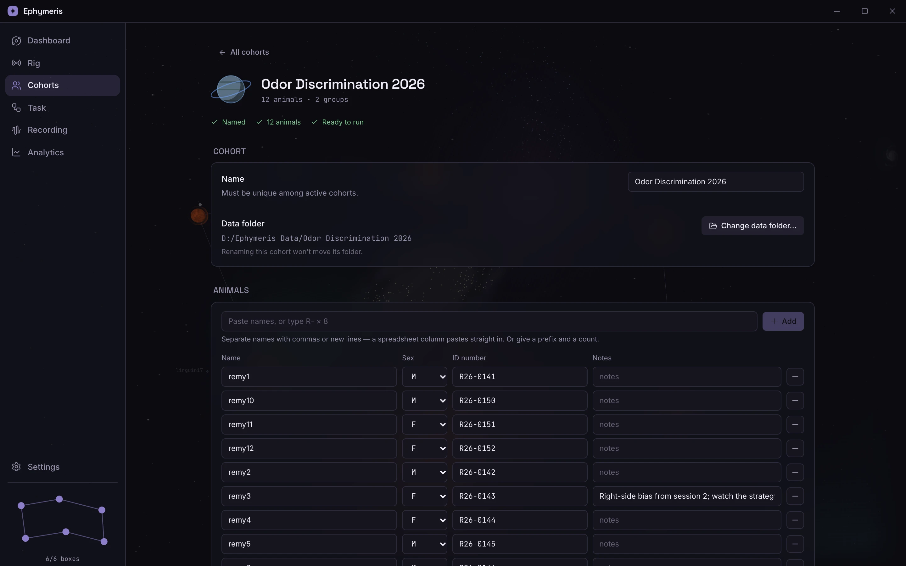
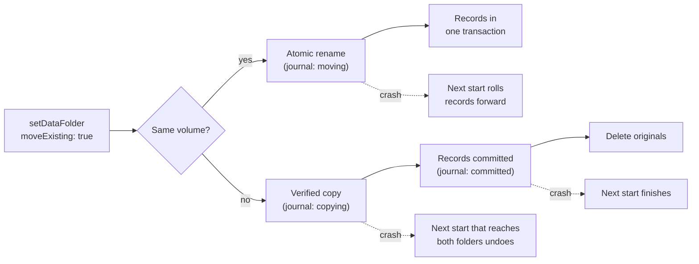
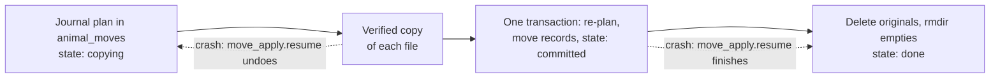
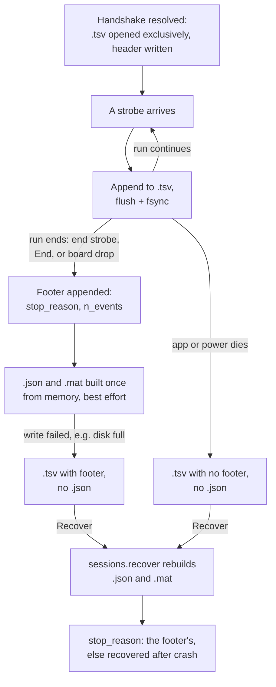
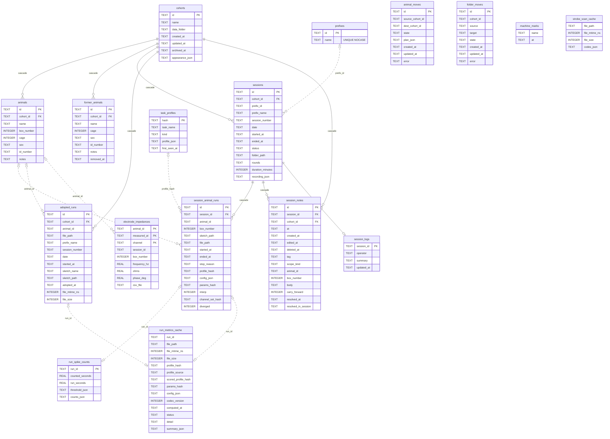
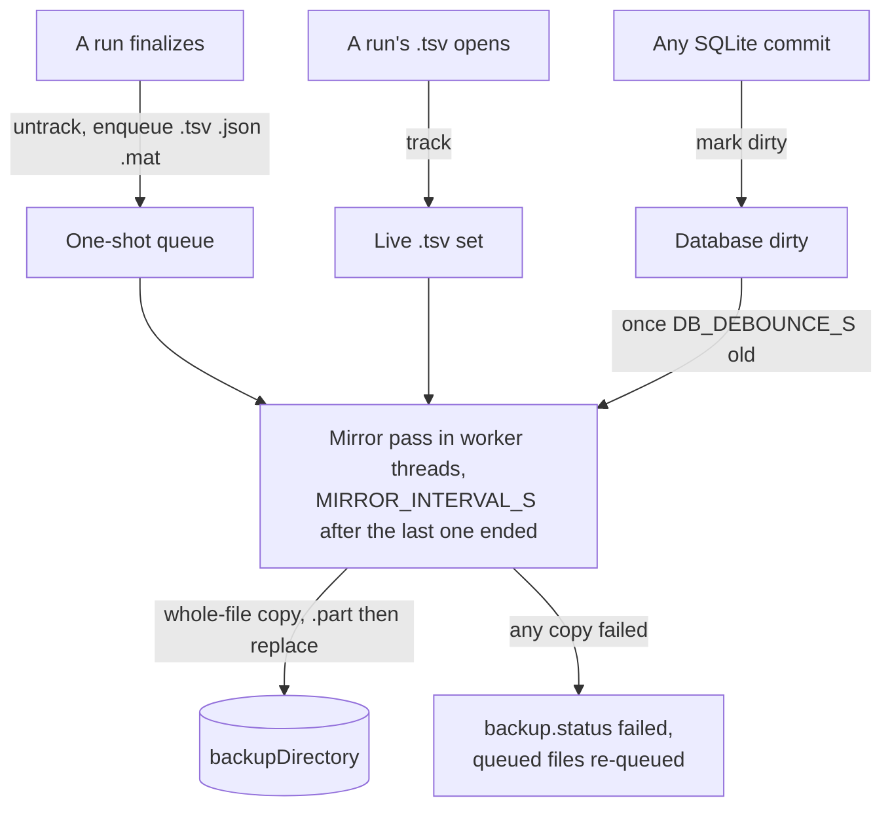
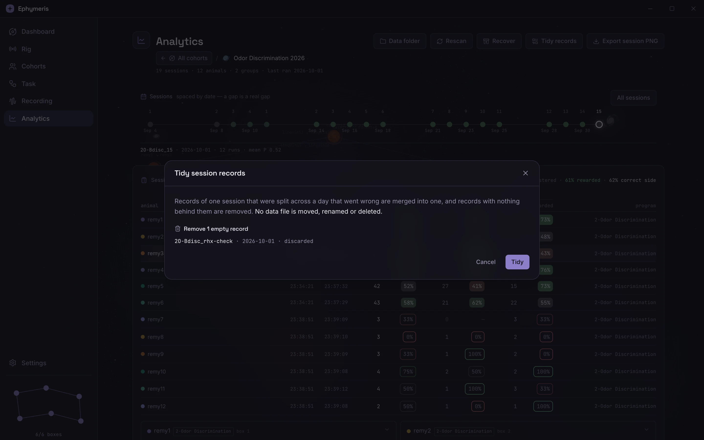

# Data

What lands on disk and in the database, and how it is read back. Metric definitions: [ANALYTICS.md](../sidecar/ephymeris_sidecar/analytics/ANALYTICS.md). What triggers the writes: [ARCHITECTURE.md](ARCHITECTURE.md#session-lifecycle). Commands: [PROTOCOL.md](PROTOCOL.md).

> [!IMPORTANT]
> **`.tsv` is not an export format.** It is the write-ahead log, fsync'd per strobe; `.json` and `.mat` are built once, at clean finalization ([Crash safety](#crash-safety)).

## Contents

- [Directory layout and naming](#directory-layout-and-naming)
- [Cohorts and animals](#cohorts-and-animals)
- [Sessions and runs](#sessions-and-runs)
- [The session log](#the-session-log)
- [Per-animal files](#per-animal-files)
- [Crash safety](#crash-safety)
- [Crash recovery](#crash-recovery)
- [Re-derive](#re-derive)
- [SQLite database](#sqlite-database)
- [Backup mirroring](#backup-mirroring)
- [Reading the archive](#reading-the-archive)
- [Analytics views](#analytics-views)

## Directory layout and naming

### Layout

```
<dataDirectory>/<cohort name>/<prefix>/<prefix>_<sessionNumber>_<YYYY-MM-DD>/
    notes.md                                    ← the session log, derived
    behavior.tsv/<animal>_<prefix>_<number>_<date>_<HHMMSS>.tsv     ← written live
    behavior.json/….json  behavior.mat/….mat                         ← built at run end
    events/….events.json  ….events.mat           ← a recorded run's events on RHX's clock, when first viewed
```

Built by `sessions/paths.py` (`resolve_session_folder`, `resolve_animal_files`). Reusing a prefix and number on one day is allowed (`sessions.suggestNumber` warns via `sameDayNumbers`); the files land side by side.

### Names

| Element | Format | Example |
|---|---|---|
| Session folder | `<prefix>_<sessionNumber>_<YYYY-MM-DD>` | `2O-Bdisc_25_2026-07-22` |
| Per-animal file | `<animal>_<prefix>_<number>_<date>_<HHMMSS>.<ext>` | `remy1_2O-Bdisc_25_2026-07-22_113123.json` |

`HHMMSS` is when **that animal's run** started. Every name part passes through `cohorts/folders.py`'s `sanitize_name`.

### Why the date is hyphenated

Older folders use `MM_DD_YY`, which does not sort across years. Hyphenated ISO changes the number of `_` tokens, so a positional parser breaks visibly instead of misreading dates. Nothing is renamed; both spellings coexist.

> [!CAUTION]
> **Never sort these names as strings.** Use `sessions/paths.py`'s `parse_name_date`, which reads both formats anchored at the end of the name.

### Reading names other software wrote

Names are read as written: `parse_session_folder` finds the session number by being numeric, trailing or leading (`00_01_shaping_gr_06_17_26`), and separators are never normalized (`2O-Bdisc` and `2O_bdisc` are distinct prefixes).

## Cohorts and animals

### Data model

`cohorts/models.py`; tables `cohorts`, `animals` ([Tables](#tables)).

| Entity | Notes |
|---|---|
| **Cohort** | `name`; `dataFolder` (absolute, resolved once); `archivedAt` (null = active); `appearance` (null = derived from `id`) |
| **Animal** | `boxNumber` (1–6 or null, the **usual box**); `cage` (≥ 1 or null); `sex` (`M`/`F`/`unknown`/null); `idNumber` (free text) |

The usual box is only where session set-up starts: which animals run together, and in which boxes, is chosen per [round](../GLOSSARY.md#round) ([ARCHITECTURE.md](ARCHITECTURE.md#mapping-and-the-placement-walk)), and the box a run used is on its [run record](#run-records). `cage` only changes what the 3D views draw.

### Validation

`cohorts/repository.py`'s `_validate`, per field:

| Rule | Detail |
|---|---|
| Cohort name | Unique among **active** cohorts (`idx_cohorts_active_name`) |
| Animal name | Unique within the roster, case-insensitively; a [former member](#former-members)'s may be reused |
| Animal id | Refused if another cohort holds it; use a [move](#moving-animals-between-cohorts) |
| `boxNumber` | `1`–`6` only. Animals may share a usual box: a clash matters only among the animals of one round, where set-up gives the box to one of them |

> [!IMPORTANT]
> **The box rule is split on purpose.** The sidecar checks only the range, since two machines with different bindings share one data directory; the editor offers only boxes bound here (`src/lib/cohorts/boxAvailability.ts`). A stored box this machine can't honour is **kept and reported, never rewritten**, and not reported while the sidecar is disconnected.

### Former members

History keeps `animal_id` with no foreign key ([Indexes](#indexes)), so a **former member** (`cohorts/members.py`) keeps the name of an animal no longer on the roster:

| Source | What it is |
|---|---|
| `removed` | Removed by `cohorts.update` while it had a run, adoption or note; kept in `former_animals` with its name and biography. An animal with no history is just deleted |
| `files` | An id the history names with no row; named at read time from its runs' stored paths, never written back |

On the wire as `Cohort.formerAnimals` (single-cohort loads only); `Cohort.animals` stays the roster. Restoring is posting the id in `animals` again. Analytics lists former members after the roster (`AnalyticsAnimal.former`), so no colour shifts. `former_animals` is its own table because `animals` rows are deleted and re-inserted on every roster save.

### Data folder

`cohorts/folders.py` sets `dataFolder = <dataDirectory>/<sanitized name>` (suffixed `-2`, `-3`, … if taken) and stores it verbatim: **renaming a cohort never moves its folder.**



`cohorts.setDataFolder` (`cohorts/relocate.py`) with `moveExisting: true` moves the data into an **empty** folder; with `false` it points at data already there (how a pre-Ephymeris archive is attached for [adoption](#orphan-adoption)) and writes nothing.

A move carries every stored absolute path with it (records, adoptions, cache rows with their [freshness keys](#caching), and RHX save locations and impedance CSVs inside the folder; all listed in `cohorts/db.py`'s `DATA_PATHS`, which a test keeps complete), journalled in `folder_moves`:


```mermaid
flowchart LR
    req["setDataFolder<br/>moveExisting: true"] --> same{"Same volume?"}
    same -->|"yes"| rename["Atomic rename<br/>(journal: moving)"] --> rec1["Records in<br/>one transaction"]
    same -->|"no"| copy["Verified copy<br/>(journal: copying)"] --> rec2["Records committed<br/>(journal: committed)"] --> del["Delete originals"]
    rename -.->|"crash"| fwd["Next start rolls<br/>records forward"]
    copy -.->|"crash"| undo["Next start that reaches<br/>both folders undoes"]
    rec2 -.->|"crash"| fin["Next start finishes"]
```

It runs under the [archive lock](#the-cohort-archive) and is refused while any session is set up or running, or the cohort has an open session. An unfinished journal refuses only operations that would collide with it.

> [!CAUTION]
> **A session recorded during a copy keeps its files at the old place**, so `sessions.create` is refused until the originals are deleted, and the commit abandons the move if anything was recorded meanwhile.

A rescan re-points (`rehomed`) records an older relocate left behind, wherever the file exists at the same tail under the cohort's folder.

### Moving animals between cohorts

`cohorts.moveAnimals` (`cohorts/move.py` plans, `cohorts/move_apply.py` applies) moves animals **with their history**: their files go to the destination's folder, and run records, recovered runs and notes follow. Preview with `apply: false`; the apply re-plans.

- **Identity**, by case-folded name: a roster animal or [former member](#former-members) of that name in the destination is **joined**; otherwise the animal is carried under its own id.
- **Files:** every `.json`/`.tsv`/`.mat` of its recorded and [adopted](#orphan-adoption) runs, plus unrecorded files whose stem names it. Never `notes.md`, RHX recordings or AppleDouble files.
- **Sessions** only moved animals ran in move whole; shared ones are **split**, the destination getting its own record (no recording). Notes about moved animals or their boxes move, about staying ones stay, and the rest (whole-session, shared box) are **copied**.
- **Impedance history** ([RECORDING.md](RECORDING.md#impedance-tracking)) follows the animal into the one it
  joins.
- **Caches** follow with their [freshness keys](#caching). An adoption whose run the destination already holds joins that row, which keeps its id and ruling.
- **Refused** with nothing touched when: anything runs; either cohort has an open session; a folder is unreachable, shared or nested; a destination file differs; a run file lies outside the source; two moved animals share a name; the destination is archived; or an earlier move would collide.


```mermaid
flowchart LR
    j["Journal plan in animal_moves<br/>state: copying"] --> c["Verified copy<br/>of each file"] --> m["One transaction: re-plan,<br/>move records, state: committed"] --> d["Delete originals, rmdir empties<br/>state: done"]
    c -.->|"crash: move_apply.resume undoes"| j
    m -.->|"crash: move_apply.resume finishes"| d
```

> [!CAUTION]
> **The other lab machine still points at the source folder**, and a rescan there would [prune](#pruning) the moved runs. **Run the same move there first**; it finds the files moved and re-points its records.

### Verified transfer

A cross-volume [relocate](#data-folder) and a [move](#moving-animals-between-cohorts) copy through `cohorts/transfer.py`: each file via `<name>.part`, fsync, rename, then a SHA-256 check against the original. Undo removes a copy, and the final delete an original, only when the other file is present **with the same content**, read now, never a remembered hash.

A file that can't be seen (`relocate.out_of_reach`: a `stat` failing other than not-found, or no ancestor answering) is never read as deleted: the transfer waits, journal unchanged, for a start that reaches both folders. [Pruning](#pruning) reads absence the same way.

### Archive and delete

**Archive** (`cohorts.archive`) is the everyday delete: hidden, intact, reversible (`cohorts.restore`). **Permanent delete** (`cohorts.delete`) works only on an archived cohort and cascades to its rows. **Neither touches `dataFolder` on disk.**

## Sessions and runs

### Prefixes

A **prefix** names a task and is global (`prefixes.*`, unique case-insensitively). Deleting one only hides it from the dropdown; sessions keep their own `prefix_name`.

### Session records

One `sessions` row per session flow (`sessions/models.py`'s `Session`). `sessionNumber` is free text: never sort by it. `startedAt`/`endedAt` are when the record opened (Step 1) and closed, not when boxes ran ([The session clock](#the-session-clock)). `status` runs `configuring` → `running` → `completed`, or `aborted`. `rounds` lists `{order, startedAt, endedAt, label}` per [round](../GLOSSARY.md#round), `label` being the group's name on a round recorded while cohorts had groups and null since; `durationMinutes` is an optional per-box limit; `recording` is null for behavior only ([RECORDING.md](RECORDING.md#what-is-written)). Listings are ordered by `(date, startedAt)` and carry an `ordinal`.

### Run records

One `session_animal_runs` row per animal per session (`SessionAnimalRun`), the unit Analytics scores. Beyond ids, box, timings and `stopReason`, it stores `filePath` (the `.json`), `profileHash`, `config_json` (merged parameters), `paramsHash`, and, from finalization, `interp` and `channel_set_hash` (as in the [`.tsv` header](#the-tsv-log)). `diverged` is written by Analytics: 1 when replay could not predict the run, 0 when it scored it, null otherwise ([ANALYTICS.md](../sidecar/ephymeris_sidecar/analytics/ANALYTICS.md#how-a-spine-run-is-scored)).

> [!IMPORTANT]
> **`profileHash` records the Task Profile the run used**, since `task.json` can change later; null marks a run from before snapshots ([TASKS.md](TASKS.md#profile-and-params-hashes)).

### Continuing between rounds

Resuming a round mid-run is out of scope. `sessions.resume` re-holds one of *today's* sessions that already ran a round, closes any round left open, and waits between rounds ([ARCHITECTURE.md](ARCHITECTURE.md#between-rounds)).

## The session log

The **Log** tab: notes and free fields per session, the session clock and what changed per run. Owned by `logbook/` (`logbook.*`, [PROTOCOL.md](PROTOCOL.md#session-log); [USER-GUIDE.md](USER-GUIDE.md#keeping-the-log)).

> [!IMPORTANT]
> **Notes are user data.** A session with one is never judged empty by [Tidy records](#tidy-records) or [pruned](#pruning); deletes are soft (`deleted_at`).

### The session clock

Derived, never stored (`Session.clock_started_at`, `clock_ended_at`): `clockStartedAt` is the earliest round's start (else the record's), `clockEndedAt` the latest round's end once all are closed (null while open). Elapsed time everywhere uses it. A recovered session (`adopted:…`) runs from its earliest file to its latest stream end (from the [metrics cache](#caching)), shown with `~`. A note's T+ offset (`offsetMs`) is derived on read, and absent outside the clock's span.

> [!CAUTION]
> **The session clock is not a run's clock**: a stream's `t = 0` trails its run's `started_at`, so notes on a [trial tape](../sidecar/ephymeris_sidecar/analytics/ANALYTICS.md#per-trial-tape) are approximate.

### Notes

`session_notes`: `at` (editable), a tag (`observation`, `intervention`, `hardware`, `animal-health`, `protocol-deviation`), a scope (session, animal or box) and text; no revision history. Operator and summary live in `session_logs`. A recovered-files session takes no notes.

### Carry-forward flags

A **carry forward** note stays open until resolved and shows in Step 1 and Mission Control (`logbook.openFlags`); `resolved_in_session` follows a tidy merge.

### What changed

`logbook/diff.py` compares each run, recorded or [adopted](#orphan-adoption), with the animal's previous one by `(date, started_at)`: task (by profile hash; a new hash under one name is *definition revised*), box (only when both are known; recovered runs' are `null`), and parameters (by `params_hash`, then key by key). Missing parameters report `paramsKnown: false`, **unknown, never "changed"**.

### The notes.md mirror

Each folder with a log gets a derived `notes.md`, rewritten whole about a second after a change (via `.part`, per-folder lock, off every command path) and queued for [backup](#session-files). Never read back, never creates a missing prefix folder, invisible to the archive walk.

### Exporting a log

**Session PDF** and **Logbook PDF** are rendered by `@react-pdf/renderer` (`components/logbook/pdf/`) from strings built in `lib/logbook/document.ts` ([ARCHITECTURE.md](ARCHITECTURE.md#printed-documents)).

> [!CAUTION]
> Keep ligatures off (`fontFeatureSettings`; subset fonts throw), unsupported characters mapped (`printable`), fonts as inlined `.woff`, title heights pinned, and the page footer **pinned from the top** (pinned by `bottom` it grows per page until a long export fails; `lib/logbook/pdf.test.ts` renders forty sessions).

## Per-animal files

### The JSON document

| Field | Source |
|---|---|
| `rat`, `sketch` | `Animal.name`; the sketch chosen at mapping |
| `serial_port` | The OS port, not the box |
| `session_id` | `<prefix>_<sessionNumber>` |
| task fields | Merged parameters, **flat**, one key per `metadataKey` |
| `task_profile` | The [profile snapshot](#the-embedded-task-profile) |
| `stop_reason` | `BF_END_SESSION received` (clean), `board disconnected`, `sidecar error: <cause>`, `recovered after crash`, … |
| `trial_seed`, `host_seed` | From the board's `SEED` line and the app's `START` line |
| `interp`, `stream`, `free_ram` | Announced before `READY` ([TASKS.md](TASKS.md#confirming-the-parameters), [stream](TASKS.md#stream-grammar)) |
| `sync` | `"tick"`: one sync pulse per strobing tick ([RECORDING.md](RECORDING.md#firmware-pulse)); absent, one per strobe |
| `channel_set_hash`, `_version` | The sketch's channel set ([TASKS.md](TASKS.md#registry-rules)); a hash without a version is version 1, which ignored channel order |
| `intan_*` | Recordings only ([RECORDING.md](RECORDING.md#what-is-written)) |
| `n_events`, `ts_data` | `[code, timestamp_ms]` as sent, ms from **that animal's** start |
| `derived` | The [trial table](#the-derived-trial-table), last |

> [!CAUTION]
> **Task fields share the top level with core fields**, so `parse_profile` rejects any `metadataKey` in `tasks/profile.py`'s `CORE_METADATA_KEYS`; add each new core field there.

### The tsv log

```
# rat: remy1
# …                                  ← header, written before the first strobe
# task_profile: {…}                  ← snapshot, always the last header line
221	0
222	1000
# stop_reason: BF_END_SESSION received   ← footer, at finalization
# n_events: 2392
```

Written by `AnimalWriter.open_files` after the handshake and `SEED`. **A `.tsv` cut off mid-session lacks only the footer**, and its header makes a [recovered](#crash-recovery) run as self-describing as a finalized one; a [spine](TASKS.md#spine-tasks) run's snapshot carries all replay needs ([TASKS.md](TASKS.md#the-snapshot)).

### The mat mirror

`sessions/matwriter.py` writes the same dict with `scipy.io.savemat`: numbers `double`, bools `logical`, `ts_data` `N×2` (`0×2` empty), `task_profile` a JSON char array, `derived` a struct. `tests/test_matwriter.py` pins it.

> [!CAUTION]
> **scipy is preloaded on the main thread before any other thread starts** (`matwriter.preload`): importing numpy while a thread blocks on stdin deadlocks the frozen sidecar. **A `.mat` that would be wrong is refused** (non-BMP characters, `_` names) and logged; `.tsv` and `.json` carry the run.

### The embedded task profile

The snapshot makes a copied run decode anywhere with **the same `profile_hash`**, which requires `TaskProfile.to_json` to round-trip byte-for-byte through `parse_profile` (tested). It names which flat keys are parameters, so `params_hash` recomputes; its `strobes` map is the machine's whole [vocabulary](TASKS.md#strobe-vocabulary) at run start, outside the hash. Profile-less sketches write none.

### The derived trial table

[Spine runs](TASKS.md#spine-tasks) carry their [trial table](../sidecar/ephymeris_sidecar/analytics/ANALYTICS.md#the-trial-table) (`sessions/derived.py`), and [stream-grammar-2](TASKS.md#stream-grammar) runs theirs (`grammar2.rows_of`, marked `"grammar": 2`), for the lab's scripts:

```jsonc
"derived": {"status": "ok", "detail": null, "interp": 6, "replay_version": 4,
            "phases": ["wait", "present", "…"], "trials": [{"index": 0, "outcome": "correct", "complete": true}]}
```

- Columns are the dataclass fields (`ReplayTrial`, `grammar2.TrialRow`), checked as MATLAB identifiers by `test_derived_trials.py`.
- `diverged` or `unreplayable` blocks have no trials and must not be analysed; legacy runs have no block.
- `replay_version` (`spine.REPLAY_VERSION`) moves with any table change, pinned by `test_the_replay_version_pins_the_trial_table`.
- Written at finalization and recovery (last trial `complete: false`); rewritten only by [Re-derive](#re-derive).
- In the `.mat`, `trials` is an **N×1 struct array** (`struct2table(S.derived.trials)`).

> [!CAUTION]
> **Nulls are `NaN` (numbers) and `''` (strings) in the `.mat`, never `[]`**, or concatenating a column misaligns every later trial.

> [!IMPORTANT]
> **The app never reads the derived table**: `analytics/reader.py` drops it and Analytics replays.

## Crash safety


```mermaid
flowchart TD
    opened["Handshake resolved:<br/>.tsv opened exclusively, header written"] --> strobe["A strobe arrives"]
    strobe --> append["Append to .tsv,<br/>flush + fsync"]
    append -->|"run continues"| strobe
    append -->|"run ends: end strobe,<br/>End, or board drop"| footer["Footer appended:<br/>stop_reason, n_events"]
    footer --> built[".json and .mat built once<br/>from memory, best effort"]
    built -->|"write failed, e.g. disk full"| withFooter[".tsv with footer,<br/>no .json"]
    append -->|"app or power dies"| noFooter[".tsv with no footer,<br/>no .json"]
    withFooter -->|"Recover"| recover["sessions.recover rebuilds<br/>.json and .mat"]
    noFooter -->|"Recover"| recover
    recover --> reason["stop_reason: the footer's,<br/>else recovered after crash"]
```

### Written live

`AnimalWriter.record` appends each strobe exactly as sent and fsyncs every line. The file is opened **exclusively (`"x"`)**: a name collision refuses to start the box rather than truncate a log. A failed write is broadcast as `sidecar.error` for that box and the run continues.

### Built once at the end

`AnimalWriter.finalize` writes the footer, replays a spine run's table, then builds `.json` and `.mat`. It is idempotent (first `stop_reason` wins), and the structured writes are best-effort: an `OSError` is logged, not raised. Each is atomic (`write_atomic`: a per-process, per-thread `.part`, fsync, rename), so a power cut leaves a `.part`, never a torn document.

`sweep_parts` removes stale parts once per process, at the first `settings.push`: only `<name>.<pid>-<thread>.part` files from another pid, older (mtime and ctime) than `PART_GRACE_S` before start, outside the backup directory.

### What is guaranteed

After a power loss, every strobe through the last complete line is in the `.tsv`; a dropped board finalizes as `board disconnected`. Resuming a round mid-run is not offered ([Continuing between rounds](#continuing-between-rounds)).

## Crash recovery

`sessions.recover` (`sessions/recovery.py`, the **Recover** button) rebuilds `.json` and `.mat` for each `.tsv` without a parseable `.json` (an unreadable one counts as present). It never talks to a board.

- It uses the archive walker (`walk_orphaned_tsvs`), so it reads every layout [adoption](#orphan-adoption) does and writes into the same one.
- A footer's `stop_reason` wins; otherwise `"recovered after crash"`. `n_events` is recounted; spine runs get their [table](#the-derived-trial-table).
- Strobe lines must match `^\d{1,3}\t\d+$`, and **an unterminated last line is dropped**, so a torn line never reads as real. A torn `task_profile` line is dropped.
- **Pre-Ephymeris logs** (first line `LEGACY_HEADER`) allow a third name column and an unterminated last line, and record `"recovered from a legacy log"`; header-only ones are refused.
- Refused while a box runs; an [archive write](#the-cohort-archive). Recover then runs a rescan to adopt what it wrote.

## Re-derive

`sessions.rederive` replays every spine run in a cohort's folder and rewrites only the [derived table](#the-derived-trial-table), in `.json` then `.mat`, where it differs from this build's; current files are not touched. Every other key is kept and the `.tsv` never opened. A block from a newer `replay_version`, or an `ok` block of an unknown `INTERP`, is `skipped`, so an older build never undoes a newer one. A `.mat` is judged by content, not mtime, and its failure is reported apart (`matError`). Refused while a box runs.

## SQLite database

`ephymeris.db` lives in the **app data directory**, not `dataDirectory`. `cohorts/db.py` owns one connection behind a lock, used through [units of work](#transactions) via `asyncio.to_thread`; the version is `SCHEMA_VERSION`.

### Tables

Solid lines are foreign keys; dotted ones deliberately have none ([Indexes](#indexes)).


```mermaid
erDiagram
    cohorts ||--o{ animals : "cascade"
    cohorts ||--o{ former_animals : "cascade"
    cohorts ||--o{ sessions : "cascade"
    sessions ||--o{ session_animal_runs : "cascade"
    cohorts ||--o{ adopted_runs : "cascade"
    sessions ||--o{ session_notes : "cascade"
    cohorts ||--o{ session_notes : "cascade"
    sessions ||--o| session_logs : "cascade"
    prefixes |o..o{ sessions : "prefix_id"
    animals |o..o{ session_animal_runs : "animal_id"
    animals |o..o{ adopted_runs : "animal_id"
    animals |o..o{ electrode_impedances : "animal_id"
    session_animal_runs |o..o| run_spike_counts : "run_id"
    task_profiles |o..o{ session_animal_runs : "profile_hash"
    session_animal_runs |o..o| run_metrics_cache : "run_id"
    adopted_runs |o..o| run_metrics_cache : "run_id"
    cohorts {
        TEXT id PK
        TEXT name
        TEXT data_folder
        TEXT created_at
        TEXT updated_at
        TEXT archived_at
        TEXT appearance_json
    }
    animals {
        TEXT id PK
        TEXT cohort_id FK
        TEXT name
        INTEGER box_number
        INTEGER cage
        TEXT sex
        TEXT id_number
        TEXT notes
    }
    former_animals {
        TEXT id PK
        TEXT cohort_id FK
        TEXT name
        INTEGER cage
        TEXT sex
        TEXT id_number
        TEXT notes
        TEXT removed_at
    }
    animal_moves {
        TEXT id PK
        TEXT source_cohort_id
        TEXT dest_cohort_id
        TEXT state
        TEXT plan_json
        TEXT created_at
        TEXT updated_at
        TEXT error
    }
    folder_moves {
        TEXT id PK
        TEXT cohort_id
        TEXT source
        TEXT target
        TEXT state
        TEXT created_at
        TEXT updated_at
        TEXT error
    }
    prefixes {
        TEXT id PK
        TEXT name "UNIQUE NOCASE"
    }
    sessions {
        TEXT id PK
        TEXT cohort_id FK
        TEXT prefix_id
        TEXT prefix_name
        TEXT session_number
        TEXT date
        TEXT started_at
        TEXT ended_at
        TEXT status
        TEXT folder_path
        TEXT rounds
        INTEGER duration_minutes
        TEXT recording_json
    }
    session_animal_runs {
        TEXT id PK
        TEXT session_id FK
        TEXT animal_id
        INTEGER box_number
        TEXT sketch_path
        TEXT file_path
        TEXT started_at
        TEXT ended_at
        TEXT stop_reason
        TEXT profile_hash
        TEXT config_json
        TEXT params_hash
        INTEGER interp
        TEXT channel_set_hash
        INTEGER diverged
    }
    machine_marks {
        TEXT name
        TEXT at
    }
    task_profiles {
        TEXT hash PK
        TEXT task_name
        TEXT kind
        TEXT profile_json
        TEXT first_seen_at
    }
    run_metrics_cache {
        TEXT run_id
        TEXT file_path
        INTEGER file_mtime_ns
        INTEGER file_size
        TEXT profile_hash
        TEXT profile_source
        TEXT scored_profile_hash
        TEXT params_hash
        TEXT config_json
        INTEGER codec_version
        TEXT computed_at
        TEXT status
        TEXT detail
        TEXT summary_json
    }
    adopted_runs {
        TEXT id PK
        TEXT cohort_id FK
        TEXT animal_id
        TEXT file_path
        TEXT prefix_name
        TEXT session_number
        TEXT date
        TEXT started_at
        TEXT sketch_name
        TEXT sketch_path
        TEXT adopted_at
        INTEGER file_mtime_ns
        INTEGER file_size
    }
    electrode_impedances {
        TEXT animal_id PK
        TEXT measured_at PK
        TEXT channel PK
        TEXT session_id
        INTEGER box_number
        REAL frequency_hz
        REAL ohms
        REAL phase_deg
        TEXT csv_file
    }
    run_spike_counts {
        TEXT run_id PK
        REAL counted_seconds
        REAL run_seconds
        TEXT threshold_json
        TEXT counts_json
    }
    session_notes {
        TEXT id PK
        TEXT session_id FK
        TEXT cohort_id FK
        TEXT at
        TEXT created_at
        TEXT edited_at
        TEXT deleted_at
        TEXT tag
        TEXT scope_kind
        TEXT animal_id
        INTEGER box_number
        TEXT body
        INTEGER carry_forward
        TEXT resolved_at
        TEXT resolved_in_session
    }
    session_logs {
        TEXT session_id PK
        TEXT operator
        TEXT summary
        TEXT updated_at
    }
    strobe_scan_cache {
        TEXT file_path
        INTEGER file_mtime_ns
        INTEGER file_size
        TEXT codes_json
    }
```

`task_profiles` is **content-addressed**, so comparability is an indexed equality. `run_metrics_cache` and `strobe_scan_cache` are pure caches keyed by file freshness; the former's `profile_hash` is what resolution reached and `scored_profile_hash` what scored the run ([why](../sidecar/ephymeris_sidecar/analytics/ANALYTICS.md#which-profile-decodes-a-run)), and `codec_version` the [cache version](#caching). `adopted_runs` are files the walk matched, kept apart from `sessions` on purpose.

### Indexes

`INDEXES` is applied after migrations. Notable: `idx_cohorts_active_name` (partial unique name among active cohorts), `idx_runs_profile`/`idx_runs_params` (comparability), `idx_sessions_cohort_dt` (session order), `idx_adopted_file` (one adoption per file), `idx_notes_open_flags` (partial, open flags).

> [!CAUTION]
> **An index on `animal_id`, never a foreign key.** `cohorts.update` re-inserts every animal on each roster edit, so a cascade would wipe the cohort's history on a rename.

### Transactions

All callers share one connection, so writes that belong together go in **one unit of work**:

```python
with db.write() as tx:                 # the lock, then BEGIN IMMEDIATE
    digest = profiles.remember_profile(profile, tx=tx)
    sessions.record_animal_run(run, tx=tx)
# COMMIT here; ROLLBACK if the block raised
```

- A method given `tx=` joins and commits nothing; without it, it is its own unit. Nesting raises `NestedWrite`.
- **No transaction is ever open while the lock is free**; a unit finding one refuses (`WriteInProgress`). After SQLite rolls a unit back, later statements raise `TransactionAborted`.
- `db.read()` holds the lock with the connection `query_only`.
- A commit that changed a row fires the [backup hook](#the-database-copy); `tx.on_commit(fn)` runs after it.

A finalization records its profile and run in one unit; an indexing pass writes once at its end; a [tidy](#tidy-records) is one unit.

### Machine marks

`machine_marks` rows are permanent facts about this machine, read by `has_mark` before `connect` (an unreadable database answers "marked"). The one mark, `wiring_record`, says the start allowed to seed the wiring record has happened ([TASKS.md](TASKS.md#the-channel-set-and-the-pin-map)).

### Changing the schema

> [!CAUTION]
> **A new table** needs only `CREATE TABLE IF NOT EXISTS` in `SCHEMA`. **A new column** needs all three: bump `SCHEMA_VERSION`, update `SCHEMA`, **and** add a `MIGRATIONS` entry keyed by the version it upgrades to; otherwise existing databases claim the version without the column. **Removing** a table or column needs the same three, and a migration that carries what was recorded there first.

1. Make new columns nullable or constant-default; `add_column` is idempotent.
2. Migrations may re-key or repair a cache, never reinterpret data.
3. Add the version you are leaving to `tests/fixtures/schemas/` as `vN.sql`, copied from git; `tests/test_migrations.py` upgrades each and compares it with a fresh database.

A database newer than the build still opens, with a loud error, and works as long as every change since was additive. v17 was not (it removed groups), so a build older than it fails on a v17 file's first roster query.

> [!CAUTION]
> **Dropping a table deletes the rows that cascade from it.** A column with a foreign key cannot be dropped in place, so its table is rebuilt without it first, and the referenced table dropped last (`_to_v17`).

## Backup mirroring

The `.tsv` protects against a crash; mirroring to `backupDirectory` (`backup/`) protects against losing the disk.

> [!IMPORTANT]
> **The backup target may be slow or dead, and that must never slow or fail a session.** Finalization only queues, and every copy runs in a worker thread.


```mermaid
flowchart TD
    started["A run's .tsv opens"] -->|"track"| live["Live .tsv set"]
    finalized["A run finalizes"] -->|"untrack, enqueue .tsv .json .mat"| queued["One-shot queue"]
    commit["Any SQLite commit"] -->|"mark dirty"| dirty["Database dirty"]
    queued --> pass["Mirror pass in worker threads,<br/>MIRROR_INTERVAL_S after the last one ended"]
    live --> pass
    dirty -->|"once DB_DEBOUNCE_S old"| pass
    pass -->|"whole-file copy, .part then replace"| target[("backupDirectory")]
    pass -->|"any copy failed"| failedState["backup.status failed,<br/>queued files re-queued"]
```

### Mirror layout

```
<backupDirectory>/<cohort folder basename>/    ← contents unchanged
<backupDirectory>/ephymeris.db
<backupDirectory>/db-snapshots/ephymeris_<YYYY-MM-DD>.db
```

Anchored on each **cohort folder**, not `dataDirectory`; clashing basenames get a suffix (`mirror_segments`). **Additive**: deletions are never mirrored.

### Session files

`.json`, `.mat` and rewritten `notes.md` are queued; a live `.tsv` is copied every `MIRROR_INTERVAL_S` (10 s). Every copy is whole-file via `.part`.

### The database copy

Mirrored after any committed change, debounced `DB_DEBOUNCE_S` (5 s): SQLite's online backup to a local temp file under the lock, then an unlocked copy. It never runs with a write open; if one is (a bug), it defers as `WriteInProgress` and is reported [deferred](#failures). One dated snapshot per day, **first of day wins**, newest `DB_SNAPSHOT_KEEP` kept.

### No automatic backfill

A new backup directory mirrors from then on; `backup.syncNow` copies whatever is missing or stale.

### Failures

Failures show as `state: "failed"` on `backup.status` (Settings, Mission Control), never as toasts, and clear on the next success; a deferred database copy shows `deferred`. **A failed mirror never affects the session.**

## Reading the archive

`analytics/` reads runs back ([map](../sidecar/ephymeris_sidecar/analytics/ANALYTICS.md#the-folder-at-a-glance)): `reader.py` reads files, `walk.py` walks and matches, `archive.py` holds the archive, `scoring.py` and `repository.py` the cache.

### Database first

Run records are the primary source. Files no record names are found only by `analytics.rescan`, and adopted runs never get `sessions` rows: summaries group them under synthetic `adopted:<prefix>_<number>_<date>` sessions.

### The cohort archive

`CohortArchive` (`analytics/archive.py`) is the one read of a cohort's recorded and recovered runs, used by summaries, `sessions.list`, [what changed](#what-changed), [tidy](#tidy-records) and the Dashboard. A recovered run counts under the recorded session owning its folder (`_adoption_owners`), and is dropped when a run record has its path.

**Every archive write** (rescan, tidy, [recover](#crash-recovery), [re-derive](#re-derive), [relocate](#data-folder), [move](#moving-animals-between-cohorts)) goes through `CohortArchive.write` under the archive lock (`ArchiveBusy` otherwise), and asks the rig only once the lock is held. Rescan, Recover and Re-derive are refused while a box runs (`RIG_IN_USE`); relocate and move also while a session is set up; tidy skips the held session. A box runs until its record is committed (`SessionLifecycle.writing`). Afterwards `on_changed` queues backups and publishes updates.

> [!CAUTION]
> **The walk finds format folders by name at any depth**, and a file is data only if it sits **directly inside** one. Never assume a prefix level.

### Orphan adoption

An `adopted_runs` row holds only what a name gives: animal, path, prefix, number, date and start. **Box, stop reason and end stay unknown** (`boxNumber: null`). This is how pre-Ephymeris archives reach Analytics: both format-folder spellings (`reader.FORMAT_DIRS`), `MM_DD_YY` dates, any nesting, [odd names](#reading-names-other-software-wrote), labels resolved by `legacyNames` ([TASKS.md](TASKS.md#task-definitions)), and AppleDouble files skipped.

- **Animal:** the document's `rat`, else the file stem's animal token if the stem has exactly the [Names](#names) shape, else a `removed` [former member](#former-members) of that name.
- **Duplicates are one run** by case-folded stem (`reader.run_identity`); the kept copy is chosen by content (`_prefer`).
- **A missing data folder is reported** (`folderMissing`), never read as empty.

> [!WARNING]
> **The adopted run id is keyed on cohort and run identity, never path** (`_orphan_run_id`), and a stored run keeps its id, since rulings and the cache use it.

### Caching

**Summaries persist** in `run_metrics_cache`; series and trial tables never do. The key (`repository.CacheKey`: path, mtime, size, profile hash, version) needs no file open, so a hit reads nothing. The version (`scoring.current_version`) combines `SCORE_VERSION`, a **canary** hash of the scoring code's answers for fixed runs (`scoring._canary_runs`), and this machine's [strobe vocabulary](TASKS.md#strobe-vocabulary).

> [!CAUTION]
> **A hit is served verbatim.** If you change scoring and the pinned canary in `tests/test_analytics_scoring.py` does not fail, add a canary case or bump `SCORE_VERSION`. Changes to file reading (`reader.stat_run`, `reader.parse_run`), `missing`/`unreadable` rows or reason texts always need the bump.

> [!CAUTION]
> **A relocate or move carries a key only if it was fresh for the original** (`cohorts/freshness.py`). A dropped fresh key re-matches adoptions by name (a renamed animal's runs go astray); a carried stale one vouches for content that changed.

A vanished file never deletes its row on the read path; only [pruning](#pruning) does. A corrupt file caches `unreadable`. `lowConfidence` is applied per request.

### Never at the expense of a session

> [!IMPORTANT]
> **No analytics operation may slow, stall or fail a running session.** One indexing job at a time; reads sequential in one worker, in chunks (`INDEX_CHUNK`); cache writes one transaction per job.

### Pruning

A rescan (unless `adoptOrphans: false`) also deletes records (with their [spike counts](RECORDING.md#active-site-yield)), adoptions and their cache rows whose file is gone, then sessions with no folder, no runs **and** no [log entry](#the-session-log). Records only; never open sessions.

> [!CAUTION]
> **Absence counts only when the storage is reachable**: a path is gone only if some ancestor is readable (`_storage_is_reachable`). A `.json` whose `.tsv` survives is kept for [recovery](#crash-recovery).

### Carrying adoptions forward

A rescan skips a file (`_carry_over`) when its adopted row names **the same path** with the same mtime and size. The path condition is load-bearing: every other copy must still be read for `_prefer` to judge.

### Tidy records

**Tidy records** (`sessions.tidy`) previews, then merges records sharing prefix, number and date into the earliest holding data, and deletes empty ones (no run, file or [log entry](#the-session-log)). Notes and flags follow a merge.

> [!IMPORTANT]
> **Only the database changes**; empty folders go by `rmdir`, never `rmtree`. Held, today's `configuring` and unreachable records are left alone.



## Analytics views

`/analytics` (`routes/Analytics.tsx`, `components/analytics/`, `src/lib/analytics/view.ts`). Selecting a session **narrows** every panel; per-animal colour ties them. Rescan, Recover, Re-derive and Tidy are explicit header actions.

> [!CAUTION]
> **The task strip and accuracy trend share x slots** (`sessionOutcomePoints`); anything between them misaligns every boundary.

### Pooling across tasks

No task filter: outcome tallies mean the same on every task, so trends pool every run and **disclose** the task in the task strip. Accuracy draws response and rewarded accuracy pooled by **summed trials** ([spine runs](../sidecar/ephymeris_sidecar/analytics/ANALYTICS.md#a-spine-run-on-the-cross-session-panels)). The session summary lists every animal that ran; an unscorable run shows its reason, never zeroes.

> [!CAUTION]
> **The effort total is the trial light (`presented`)**, not odor onset, so an ignored session reads hollow, not short.


### Session order

> [!CAUTION]
> **Order sessions by the sidecar's `ordinal` (`date`, `started_at`)**, never by `session_number` or names as strings ([why](#why-the-date-is-hyphenated)).

### Strategy plane

One point per run, x and y the accuracy at each well; the anti-diagonal `x + y ≈ 1` is pure side bias.

> [!IMPORTANT]
> **The axes are sides, not conditions** (`stream.strategy_axes`, `view.sideAccuracy`). A condition's side comes only from its own `successCode` (`answer_side_of`); a profile without two opposing answers is listed disabled with its reason.

Across sessions the axes are left and right wells (`SIDE_AXES`); within a session, rolling figures on a counted-trial clock computed sidecar-side (`strategy_trail`).


### Learning curves

Session scope only: rolling P(hit) per counted trial for one condition.

> [!IMPORTANT]
> **The x axis is trial index, never time**: each animal's `timestamp_ms` starts at its own run.


### Colour palette

Animals take `--color-series-1`…`6` by roster position; rates use the diverging `view.HEAT_BINS`.

> [!CAUTION]
> **Don't even out the series ramp's lightness**: it is what keeps it colour-blind safe.

### Drawing lines

> [!WARNING]
> **Lines draw on by wiping (`components/charts/DrawOn.tsx`), never `pathLength`**, which breaks under `non-scaling-stroke`.

### Exporting a sheet

**Export PNG** mounts the existing panels (`components/analytics/report/`) off-screen with a masthead and `summary.warnings` ([export card](ARCHITECTURE.md#export-progress)).

> [!CAUTION]
> Render off-screen (not hidden), force `useRevealOnView` true, use `MotionConfig skipAnimations`, unpin the pinned animal, rasterize at 1×, and turn scrolling off; each mistake yields a plausible wrong picture.
