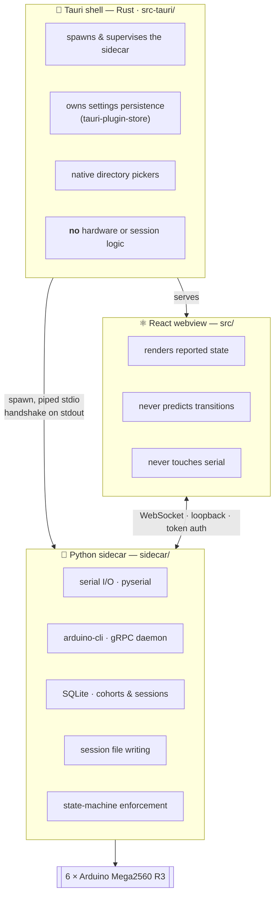
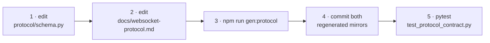

# Ephymeris — Engineering Guide

   

> **What this is** · The one document to read before touching code. It covers the architecture, how to get running, where every module lives, what's actually built, and what's still open.
>
> **Owns** · Where things live · what is built · how to develop · the open-issue register · the documentation map.
>
> **Verified** · 2026-07-30, against the working tree. `tsc --noEmit` clean · **671** sidecar tests · **2** Rust tests · wire surface **44 commands / 15 events / 23 error codes**.

**Contents** — [1. Architecture](#1-architecture) · [2. Get running](#2-get-running) · [3. Commands](#3-commands) · [4. Repo map](#4-repo-map) · [5. Test map](#5-test-map) · [6. Invariants that bite](#6-invariants-that-bite) · [7. Open issues](#7-open-issues) · [8. Documentation map](#8-documentation-map) · [9. Glossary](#9-glossary)

---

## 1. Architecture

Ephymeris is a lab desktop app for running rodent behavior sessions on up to six Arduino Mega2560 R3 boards ("boxes"). It discovers sketches and flashes them, streams live serial during a session, parses a strobe protocol into per-animal data files, keeps the cohort/animal/group bookkeeping, and reads the archive back into an analytics dashboard.

Three processes, one WebSocket, one strict ownership rule.



### 1.1 The three rules that explain most design decisions

1. **The sidecar owns all state.** The frontend renders what it is told. An illegal operation is rejected server-side with a typed error code — disabled UI buttons are a courtesy, not enforcement.
2. **A serial port has exactly one owner.** This is the core invariant of the hardware layer and the entire reason the [per-port state machine](dashboard.md#5-the-per-port-state-machine) exists.
3. **Box number 1–6 is the key, never a port address.** Windows renumbers COM ports across reboots; the sidecar resolves `box → hardware_id → current address` internally.

### 1.2 Process lifecycle

Rust spawns `python -m ephymeris_sidecar --data-dir <app_data_dir>` with piped stdio. The sidecar binds `127.0.0.1` on an ephemeral port, generates a random token, and prints **exactly one line** to stdout:

```
EPHYMERIS_WS_PORT=<port> EPHYMERIS_WS_TOKEN=<token>
```

Everything else it logs goes to stderr and is forwarded into the Tauri log. Rust parses that line and emits `sidecar://ready`, or `sidecar://down` if stdout closes. Full detail: [websocket-protocol.md §1](websocket-protocol.md#1-transport--lifecycle).

> [!IMPORTANT]
> **Orphan protection is load-bearing, not a nicety.** Tauri holds the sidecar's stdin open for the app's lifetime; the sidecar exits on stdin EOF, and Rust also kills the child on exit. A sidecar that outlived its parent would keep serial ports open and lock out the next launch.

> [!IMPORTANT]
> **There is no auto-respawn.** A crashed sidecar surfaces `sidecar://down` and the user restarts the app. A silent respawn would resurrect the process without the port ownership or session state it had.

---

## 2. Get running

Both platforms run the same three-process arrangement. The only real differences are the system toolchain and the path to the Python interpreter.

### 2.1 Prerequisites

| Tool | Version | Notes |
|---|---|---|
| Node.js | 20+ | |
| Python | 3.12+ | |
| Rust | stable | via [rustup](https://rustup.rs) |
| `arduino-cli` | recent | On `PATH`, or set an explicit path in **Config** |

<details open>
<summary><strong>🪟 Windows 11</strong></summary>

Install [Node.js](https://nodejs.org), [Python](https://www.python.org/downloads/windows/) (tick **Add python.exe to PATH**), and [rustup](https://rustup.rs).

Tauri also needs the **Microsoft C++ Build Tools** — from the [Visual Studio Build Tools](https://visualstudio.microsoft.com/visual-cpp-build-tools/) installer, select *Desktop development with C++*. WebView2 already ships with Windows 11.

```powershell
winget install ArduinoSA.CLI
```

</details>

<details open>
<summary><strong>🍎 macOS</strong></summary>

```bash
xcode-select --install
brew install node python rustup arduino-cli
rustup-init
```

</details>

Then the AVR core the Mega2560 compiles against, on both platforms:

```bash
arduino-cli core update-index && arduino-cli core install arduino:avr
```

### 2.2 Clone and install

```bash
git clone https://github.com/Chase-NJ/Ephymeris.git && cd Ephymeris && npm install
```

### 2.3 The sidecar virtual environment

> [!WARNING]
> The Tauri shell looks for a Python interpreter at **exactly `sidecar/.venv`**. This is the one step whose command differs by platform. If you keep the environment elsewhere, point `EPHYMERIS_SIDECAR_PYTHON` at the interpreter instead.

**Windows 11 (PowerShell)**

```powershell
python -m venv sidecar\.venv; sidecar\.venv\Scripts\pip.exe install -e "sidecar[dev]"
```

**macOS**

```bash
python3 -m venv sidecar/.venv && sidecar/.venv/bin/pip install -e "sidecar[dev]"
```

### 2.4 Run it

```bash
npm run tauri:dev
```

That builds the Rust shell, starts Vite on port 1420, spawns the sidecar, and opens the app window. The first run compiles the Rust dependencies and takes a few minutes.

### 2.5 First-launch setup

Nothing is guessed or shipped with defaults — point the app at your own folders and hardware.

| Step | Where | What |
|---|---|---|
| 1 | **Config** | A five-step box-setup wizard opens on first launch. Bind each box 1–6 to a connected board (listed by USB serial), nickname them, optionally run the handshake test, pick a constellation. Skippable — the same things are on the Config screen directly. See [settings.md §5](settings.md#5-the-config-screen). |
| 2 | **Task → Arduino Directory** | The root folder holding your sketch category folders and a shared `libraries/`. See [tasks.md §2](tasks.md#2-the-arduino-directory). |
| 3 | **Settings → Data directory** | Where session data is written. Optionally a **Backup directory** on another drive or share. See [data.md §1](data.md#1-directory-structure). |

Then create a cohort under **Cohorts** and start a run from the Dashboard.

### 2.6 If something doesn't work

| Symptom | Cause |
|---|---|
| **No boards detected** | Genuine Mega2560 R3 boards need no driver on either platform, but many clones use a CH340 USB-serial chip that does. Ephymeris only lists what `arduino-cli board list` reports — check the board appears as a serial device to the OS first. |
| **"Sidecar interpreter not found"** | The venv isn't at `sidecar/.venv`, or was created by a Python older than 3.12. |
| **Flashing fails on one box** | A failed flash leaves that port in `ERROR`, and `ERROR → FLASHING` is refused by design. Acknowledge the fault on the box's card (or in Debug Mode) before retrying. |
| **The app starts but nothing connects** | The sidecar exited. There is no automatic respawn on purpose — restart the app. Its stderr is forwarded into the Tauri log. |

---

## 3. Commands

| From | Command | Purpose |
|---|---|---|
| root | `npm run tauri:dev` | The full app: shell + sidecar + webview |
| root | `npm run dev` | Vite alone, fixed port 1420 (Tauri expects it) |
| root | `npm run typecheck` | `tsc --noEmit` — the only automated frontend check |
| root | `npm run build` | Typecheck, then a production Vite build |
| root | `npm run gen:protocol` | Regenerate the two wire mirrors from `protocol/schema.py` |
| root | `npm run package` | Stage bundle resources, then build the Windows installer |
| `sidecar/` | `pytest` | Full sidecar suite (inside its venv) |
| `sidecar/` | `pytest tests/test_protocol_contract.py` | The mirror-drift guard — run after **any** wire change |
| `src-tauri/` | `cargo test` | Handshake parser and shell unit tests |

---

## 4. Repo map

### 4.1 Python sidecar — `sidecar/ephymeris_sidecar/`

Owns everything stateful. See [§6.4](#64-dependency-policy) before adding a runtime dependency.

| Module | Responsibility | Spec |
|---|---|---|
| `__main__.py` | CLI entry, `--data-dir`/`--token`/`--no-parent-watch`, stdin-EOF orphan watch | [protocol §1](websocket-protocol.md#1-transport--lifecycle) |
| `app.py` | Wires everything together and registers every command handler (`auth` never reaches dispatch). The largest module, and the place to look first for any command's behaviour | [protocol §3](websocket-protocol.md#3-commands-client--server) |
| `server.py` | WebSocket server, auth handshake, command dispatch, event fan-out. Handles `auth` itself, before dispatch | [protocol §1.1](websocket-protocol.md#11-authentication) |
| `settings.py` | Receives the shell's settings push. Deliberately lenient — an unknown key is a non-event, a malformed value degrades to a default rather than killing the process that owns the ports | [settings §3](settings.md#3-persistence--push) |
| `discovery.py` | Arduino Directory validation and sketch/library scanning, including the skipped-but-reported rule | [tasks §2](tasks.md#2-the-arduino-directory) |
| `protocol.py` | **Generated** mirror of the wire schema — do not edit | [protocol](websocket-protocol.md) |
| **`ports/`** | | |
| `ports/states.py` | The transition table and `assert_transition`. Small, and the authority on what is legal | [dashboard §5](dashboard.md#5-the-per-port-state-machine) |
| `ports/handler.py` | Per-port owner: read loop, write path, ring buffer, line splitting, the three-phase session handshake, strobe parsing | [dashboard §6](dashboard.md#6-flashing-reset-and-passthrough) |
| `ports/manager.py` | Owns the six handlers, the binding map, the 1.5 s presence poll, and the 20 Hz output flush | [settings §7](settings.md#7-board-discovery) |
| **`boards/`** | | |
| `boards/__init__.py` | `create_board_tool` — the daemon backend when `grpcio` imports, the subprocess backend otherwise; `EPHYMERIS_NO_GRPC_DAEMON=1` forces the latter | |
| `boards/tool.py` | The `BoardTool` interface — the seam both backends sit behind | |
| `boards/cli_tool.py` | Subprocess backend: `arduino-cli --format json`. Kept as the daemon's fallback; also owns binary resolution and the packaged data-seed environment for both | |
| `boards/grpc_tool.py` | **Primary backend**: one long-lived `arduino-cli daemon` over gRPC, with live compile/upload streaming and no spawn per presence poll | |
| `boards/rpc/` | Generated gRPC stubs from vendored protos (`sidecar/proto/`, tag in `scripts/gen_grpc.py`). Committed like the wire mirrors — regenerate with the script, never edit | |
| **`cohorts/`** | | |
| `cohorts/db.py` | SQLite connection, schema, and **migrations**. Its connection subclass reports every commit, which is what triggers a database backup | [data §6](data.md#6-the-sqlite-database) |
| `cohorts/models.py` | Cohort/Animal/Group dataclasses | [cohorts §1](cohorts.md#1-data-model) |
| `cohorts/repository.py` | CRUD, validation, archive/delete semantics | [cohorts §2](cohorts.md#2-validation-rules) |
| `cohorts/folders.py` | Data folder resolution, name sanitization, collision suffixing | [cohorts §7](cohorts.md#8-data-folder-resolution) |
| `cohorts/grouping.py` | Auto-Balance balanced round-robin | [cohorts §6](cohorts.md#7-auto-balance) |
| **`sessions/`** | | |
| `sessions/models.py` | `Session` and `SessionAnimalRun` records | [data §3](data.md#3-session-prefix-and-session-entity) |
| `sessions/repository.py` | Session/prefix persistence, session-number suggestion | [data §3](data.md#3-session-prefix-and-session-entity) |
| `sessions/paths.py` | Directory and filename construction. Pure. Also `parse_name_date`, which reads both date spellings — **use it instead of sorting names as strings** | [data §2](data.md#2-naming-conventions) |
| `sessions/writer.py` | Per-animal file writer. `.tsv` write-ahead log with per-line `flush()`+`fsync()`, opened exclusively so a collision fails loudly; `.json`/`.mat` built once at finalization | [data §4](data.md#4-per-animal-file-schema), [§5](data.md#5-write-strategy--crash-safety) |
| `sessions/matwriter.py` | Hand-written MAT v5 serializer — exists specifically to avoid a `scipy` dependency | [data §4.3](data.md#43-the-mat-mirror) |
| `sessions/runner.py` | Live session runner: which animal is in which box, its writer, its metrics, its run record. Writer I/O stays on the port's session thread; anything touching the socket or state machine is scheduled back onto the event loop | [dashboard §10](dashboard.md#10-in_session-entry-and-exit) |
| `sessions/recovery.py` | Crash-recovery backfill: rebuilds `.json`/`.mat` from an orphaned `.tsv`. The inverse of `writer.py`; discovery shares `analytics/reader.py`'s walker | [data §12](data.md#12-crash-recovery) |
| **`analytics/`** | | |
| `analytics/derive.py` | **Pure.** `(document, profile)` → summary or series. No I/O, no database, no clock — which is what lets a test assert it agrees with the live metric path over a recorded stream | [data §9](data.md#9-derived-metrics) |
| `analytics/reader.py` | Walks a cohort's archive and reads a finalized `.json` back. A bad file becomes a status, never an exception. One traversal (`_walk_format_dirs`) underlies both adoption and crash recovery | [data §8](data.md#8-reading-the-archive-back) |
| `analytics/repository.py` | Profile snapshots and the derived-metrics cache | [data §8.4](data.md#84-caching-and-codec_version) |
| `analytics/service.py` | Orchestration: the indexing lock, progress events, profile resolution, the archive walk. Sequential reads in one worker thread, never a pool | [data §8](data.md#8-reading-the-archive-back) |
| **`backup/`** | | |
| `backup/manager.py` | The mirror: queued finalization copies, the 10 s `.tsv` pass, the debounced `ephymeris.db` backup, the explicit sync walk. Every filesystem operation runs in a worker thread | [data §7](data.md#7-backup-mirroring) |
| `backup/paths.py` | Mirror path resolution, anchored on the **cohort folder** rather than `dataDirectory`. Pure | [data §7.1](data.md#71-layout--anchored-on-the-cohort-folder) |
| **`tasks/`** | | |
| `tasks/profile.py` | `task.json` parsing and validation; `profile_hash`; `params_hash`; the legacy-name index | [tasks §3](tasks.md#3-taskjson-reference), [§7](tasks.md#7-profile_hash-and-params_hash) |
| `tasks/start_command.py` | Builds `START <wireKey>=<value> …`; enforces `START_LINE_MAX` (mirrored in `BehaviorBox.h`) | [tasks §6](tasks.md#6-from-values-to-the-wire) |
| `tasks/metrics.py` | Rolling live-metric computation. Scientific output, not a UI detail | [tasks §5](tasks.md#5-live-metrics) |
| `tasks/seed.py` | Draws the per-run `SEED` value | [tasks §6.4](tasks.md#64-seed) |
| `utility.py` | The hardware utility baseline: what firmware each box is believed to carry, restoring idle boxes, and the `identify` signal | [settings §8](settings.md#8-the-hardware-utility-baseline) |

### 4.2 React frontend — `src/`

Talks to the sidecar over the WebSocket only.

| Path | Responsibility |
|---|---|
| `lib/ws/client.ts` | Connection lifecycle, auth, reconnect with backoff (250 ms → 8 s, six steps then held), request/reply correlation, event fan-out |
| `lib/ws/protocol.ts` | The second **generated** mirror: names, payload types, and the `CommandArgsMap`/`CommandResultMap`/`EventDataMap` that make `client.call` fully typed |
| `lib/{hardware,cohorts,sessions,settings,analytics}/` | One Provider + store per domain, each wrapping the shared client |
| `lib/settings/schema.ts` | The settings shape and its normalizer, tolerant of older stored shapes |
| `lib/tasks/topology.ts` | **Derives the task state machine** from a profile's declared strobe names; owns the parameter-group order too. See [tasks.md §4](tasks.md#4-the-derived-state-machine) |
| `lib/tasks/useLiveNode.ts` | Walks a live token across that graph from the box's recent strobes |
| `lib/cohorts/boxAvailability.ts` | Which boxes this machine can offer a cohort. Gates on *bound*, not detected — detection only downgrades a label |
| `lib/cohorts/roster.ts` | Bulk-add parsing: separated names, or `prefix × count`. Pure |
| `lib/sessions/types.ts` | Session domain types **and `defaultConfig`** — the whole three-layer parameter merge ([tasks.md §6.1](tasks.md#61-the-three-layer-merge)) |
| `lib/sessions/liveTrials.ts` | The one derived trial record all three live panels read from |
| `lib/sessions/stars.ts` | Deterministic star placement seeded from `(cohortId, animalId)`, plus the nearest-neighbour link pass |
| `lib/constellations/` | The twelve hand-authored zodiac asterisms (`zodiac.ts`), the box→star slot logic (`slots.ts`), and cage-ship assignment (`ships.ts`) |
| `lib/backup/useBackupStatus.ts` | Live mirroring state plus the `backup.syncNow` call. A hook rather than a Provider — nothing needs this on every screen |
| `lib/hardware/useHandshakeTest.ts` | The Config handshake test — passthrough open/listen/close composition, tiered result, teardown-safe |
| `lib/hardware/utility.ts` | Presentation for the baseline: only a real fault is coloured as one — `busy` and `held` are the sidecar correctly keeping its hands off |
| `lib/prng.ts` | The `mulberry32`-style seeded generator behind every procedural visual |
| `lib/motion.ts`, `lib/useReduceMotion.ts` | Shared spring definitions and the reduced-motion hook |
| `styles/index.css` | **The theme.** Tailwind v4 `@theme` block — every colour, font, and radius token. There is no `tailwind.config.js` |
| `components/chrome/` | Persistent shell: sidebar, titlebar, starfield, constellation status widget |
| `components/cohorts/` | Cohort grid, editor panels, procedural icon, Auto-Balance |
| `components/config/` | Setup wizard, interactive constellation board, zodiac picker, handshake indicator/list |
| `components/task/` | The derived state-machine graph (`TaskGraph`, also docked live in Mission Control), the same nodes as a pinned strip (`TaskRail`), and the per-group parameter tiles |
| `components/constellation3d/` | The shared 3D browser both Mission Control and Debug render: **one app-wide WebGL canvas** the views adopt in turn — never a canvas per view |
| `components/debug/` | Constellation landing, per-box detail, scrollback, flash dialog, state badges, utility controls |
| `components/sessions/` | Mission Control surfaces — 3D constellation, metric strip, star panel, journey rail, placement banner, and `ConfigFields` (the one grouped renderer for a profile's `config`) |
| `components/analytics/` | The Observatory's panels: rails, heatmap, learning curves, strategy space, trends, summaries |
| `components/charts/` | Shared chart primitives (`UnitChart`, `ChartFrame`, `ChartDots`, `DrawOn`) |

> [!NOTE]
> `HardwareProvider` is mounted at the **app root**, not per-view, because the sidebar's constellation status widget needs box health on every screen — not only in Debug Mode.

#### Routes

Every route is a child of `<AppShell />`, wired in `src/App.tsx`.

| Route | Component | Purpose |
|---|---|---|
| `/` | `routes/Dashboard.tsx` | Landing: full-bleed 3D rig sky with a hero launch CTA, the session dock, and Cohorts/Rig/Analytics summary cards |
| `/cohorts` | `routes/Cohorts.tsx` | Cohort browser — card grid, search/sort/archived toggle |
| `/cohorts/new`, `/cohorts/:id` | `routes/CohortEditor.tsx` | Create (progressive reveal) or manage (all at once) a cohort |
| `/task` | `routes/Task.tsx` | Arduino Directory, sketch picker, the derived trial-flow graph, per-sketch parameter defaults |
| `/analytics` | `routes/Analytics.tsx` | The Observatory — one route, no tabs; cohort/session/animal are filters |
| `/config` | `routes/Config.tsx` | Rig wiring: constellation, box→board bindings, handshake, utility baseline, baud, `arduino-cli` |
| `/settings` | `routes/Settings.tsx` | Storage and interface only |
| `/debug` | `routes/DebugMode.tsx` | Per-box instrument panel. **No nav entry** — reached by selecting a box |
| `/session/new` | `routes/SessionConfig.tsx` | Session setup step 1 — cohort, prefix, number, time limit |
| `/session/:id/mapping` | `routes/SessionMapping.tsx` | Step 2 — animal→box mapping, guided placement walk, flash sequence |
| `/session/:id/control` | `routes/MissionControl.tsx` | Live session runner — 3D constellation + two HUD rails |
| `*` | `Dashboard` | Unknown paths fall back to the Dashboard rather than a blank pane or a 404 |

### 4.3 Rust shell — `src-tauri/src/`

| File | Responsibility |
|---|---|
| `main.rs` | Binary entry |
| `lib.rs` | Tauri builder, plugin registration, the `sidecar_endpoint` command |
| `sidecar.rs` | Spawn, handshake parsing, stdout/stderr forwarding, stdin-held-open orphan protection, kill on exit |

The interpreter resolves to `sidecar/.venv` unless `EPHYMERIS_SIDECAR_PYTHON` overrides it. The app data directory is resolved here so shell and sidecar cannot disagree about where `ephymeris.db` lives.

### 4.4 The wire surface

[`protocol/schema.py`](../protocol/schema.py) is the machine-readable authority; [websocket-protocol.md](websocket-protocol.md) carries the prose. The surface is **44 commands, 15 events, 23 error codes**. All but `auth` are registered in `app.py`; `auth` is handled in `server.py` as the connection's mandatory first message and never reaches the dispatch table.

---

## 5. Test map

**671 sidecar tests · 2 Rust tests · no frontend test runner.**

| Test file | Tests | Covers |
|---|---:|---|
| `test_protocol_contract.py` | 83 | Stale-mirror regeneration check + every wire name appears in the doc |
| `test_analytics_derive.py` | 65 | The derived metrics, including offline-equals-live and the pooled-accuracy bias case |
| `test_task_profiles.py` | 59 | `task.json` parsing, validation, `START` building, the line cap, metric computation |
| `test_analytics_adoption.py` | 45 | Orphan adoption of pre-Ephymeris archives, both legacy layouts |
| `test_analytics_service.py` | 36 | Profile resolution, caching and invalidation, damaged files, the archive walk |
| `test_port_states.py` | 35 | Transition table legality |
| `test_cohort_repository.py` | 35 | CRUD, validation, archive/delete |
| `test_session_repository.py` | 32 | Session/prefix persistence, number suggestion, both date spellings |
| `test_port_handler.py` | 30 | Read loop, line splitting, ring buffer, send gating |
| `test_discovery.py` | 26 | Sketch scanning, the four directory states |
| `test_backup.py` | 25 | Mirror layout, copy semantics, db backup and snapshots, explicit sync |
| `test_migrations.py` | 23 | Schema version reading, ordered migrations, idempotent `ADD COLUMN`, the real upgrades |
| `test_grpc_tool.py` | 19 | Daemon banner parsing, board-filter parity, stream splitting, fallback; four tests drive a **real daemon** and skip where arduino-cli isn't installed |
| `test_grouping.py` | 19 | Auto-Balance round-robin |
| `test_data_folder.py` | 19 | Resolution, sanitization, collision suffixing |
| `test_utility.py` | 18 | The baseline against the real port manager: restores only from `IDLE`, the session hold, belief invalidation, the identify handshake incl. the silent-board case |
| `test_wire_shapes.py` | 16 | Validator semantics + real `to_json` emitters conform to `protocol/schema.py` |
| `test_session_runner.py` | 13 | Runner orchestration, including the end-all finalization drain |
| `test_in_session.py` | 13 | `IN_SESSION` entry/exit sequence |
| `test_flash_reset.py` | 12 | Flash and DTR reset paths |
| `test_settings.py` | 10 | Lenient settings parsing |
| `test_recovery.py` | 10 | Crash-recovery backfill: writer round-trip, footer honesty, torn lines, recovery→adoption handoff |
| `test_writer.py` | 9 | Write-ahead log, exclusive open, finalization |
| `test_sessions_active.py` | 8 | Active/stale session surfacing |
| `test_matwriter.py` | 6 | Hand-written MAT v5 output |
| `test_trial_seed.py` | 5 | Seed drawing and range |

> [!TIP]
> `test_writer.py` includes a crash-durability test that kills a child mid-write (`_kill_writer_child.py`) to prove the `.tsv` guarantee holds. It runs on Windows.
>
> `test_backup.py` deliberately tests more than "did the file appear." A mirror that works but blocks session finalization, or one that drops a queued file when the target blinks, would pass a naive check and still be wrong — so isolation and failure-recovery have their own cases.

---

## 6. Invariants that bite

### 6.1 Changing the wire — the required order

Both mirrors are **generated** from [`protocol/schema.py`](../protocol/schema.py) at the repo root. Never edit `sidecar/ephymeris_sidecar/protocol.py` or `src/lib/ws/protocol.ts` by hand.



Steps 1 and 2 happen **together** — the contract test requires every wire name to appear in the doc. `prebuild`/`predev` also run the generator, so a forgotten step 3 shows up as a dirty tree rather than a broken build.

Payload shapes are guarded from both sides: the generated `CommandArgsMap`/`CommandResultMap`/`EventDataMap` make the frontend's `client.call` fully typed, and the sidecar validates event and reply payloads against the schema under `EPHYMERIS_WIRE_VALIDATE=1` (set suite-wide by `tests/conftest.py`; off in production). `tests/test_wire_shapes.py` pins the real `to_json` emitters to the schema. The only thing still unverified is that a command *has* a handler.

### 6.2 Behaviours worth knowing before you debug

- **State replay on connect.** After a successful `auth` the server unicasts current state to that client alone: one `port.state` per box, then `boards.presence`, `sketches.updated`, `cohorts.updated`, `prefixes.updated`. **Live session state is not replayed** — a client reconnecting mid-session must call `sessions.status`.
- **Settings re-push on every auth**, including reconnects. This is the wire-level implementation of the one-directional Tauri→sidecar sync.
- **`port.output` is batched at ~20 Hz**, not one message per line, and is never persisted beyond a capped in-memory ring buffer (~2000 lines/port).
- **Client-side timeouts don't cancel sidecar work.** Default 15 s; `port.flash` gets 300 s and `sketches.refresh` 60 s. The sidecar remains the authority on what actually happened.

### 6.3 The four that silently corrupt

Each is documented in place with a `[!CAUTION]` in the owning document. They share a property: getting them wrong produces plausible output rather than an error.

| Trap | Where | Consequence |
|---|---|---|
| Boundary codes default to the metric's own trigger | [tasks.md §5](tasks.md#5-live-metrics) | Mis-scores every unanswered trial |
| `START_LINE_MAX` is checked, not trusted | [tasks.md §6.3](tasks.md#63-the-line-length-cap) | Firmware truncates and runs on whichever values fit |
| A new **column** needs a `MIGRATIONS` entry, a new table does not | [data.md §6.3](data.md#63-changing-the-schema) | The column appears only on freshly-created databases |
| `CODEC_VERSION` must be bumped when the maths changes | [data.md §9](data.md#9-derived-metrics) | Cached summaries keep serving the old definition with no symptom |

### 6.4 Dependency policy

Sidecar runtime dependencies were **deliberately just `pyserial` and `websockets`** for most of v1. Lab machines are maintained by non-technical users, so install failure modes are a real cost. This is why `.mat` writing is a hand-written serializer rather than `scipy` — a large binary wheel, and by far the most likely thing to fail at install time.

**One exception has been granted, with its risk fenced:** `grpcio` + `protobuf`, for the arduino-cli daemon backend. The policy's concern — an install that fails and takes a feature with it — is answered structurally: the subprocess backend remains as the fallback, and `create_board_tool` degrades to it (loudly, in the log) when `grpcio` doesn't import or the daemon won't start. A lab machine where the wheel failed loses live compiler streaming, never flashing. `grpcio-tools` is dev-only.

Frontend dependencies are less constrained (the 3D stack is `three` + `@react-three/fiber` + `@react-three/drei`) because npm install failures don't happen on the lab machines.

> [!IMPORTANT]
> Don't add a sidecar runtime dependency without strong justification — and when one is granted, follow the `grpcio` pattern: the feature it powers must **degrade, not disappear**, when the dependency is absent.

### 6.5 Theme constraints

Dark mode only for v1 — no light mode, not even a placeholder toggle. Every token is declared in one place, `src/styles/index.css`, as a Tailwind v4 `@theme` block. **Pulsar is deliberately matte** — no gradients, no glow. Three faces with fixed roles. Full detail: [dashboard.md §1](dashboard.md#1-identity--theme).

---

## 7. Open issues

> [!NOTE]
> **P1 is empty.** Nothing blocks shipping v1.0. Item numbers are inherited from the retired `TODO.md` register so older commit messages still resolve; the one duplicate (two items numbered 27) is fixed here by renumbering installer signing to **30**.

### 7.1 P2 — real gaps with user-visible consequences

<table>
<tr><th>#</th><th>Item</th></tr>
<tr><td><b>26</b></td><td>

**The Observatory at real-archive scale — rendered, not yet judged.** It *does* render the lab's real archive (50 sessions × 6 animals, 295 of 296 runs scored) and nothing errored. What hasn't happened is anyone looking at it with a scientist's eye. Three things are known-marginal at that scale and were only ever designed against an 18-session synthetic set: heatmap cell density at 50 columns, session-selector length, and the six-colour ramp repeating past six animals. A **second** cohort sharpens all three — 30 sessions × **12 animals**, so the ramp repeat is guaranteed, and its profile declares exactly **one** live metric, making the single-condition strategy space the normal case rather than an edge.

</td></tr>
<tr><td><b>29</b></td><td>

**The utility baseline and the placement walk are untested on hardware.** Built and covered by 18 sidecar tests against the real port state machine, but never run against boards. Three things want watching: **cold start is six sequential flashes** (the first presence poll after launch restores every bound box, so a fresh launch has the rig busy for a minute or two — if that proves annoying, defer the cold restore rather than parallelising it, which would fight the one-owner rule); **the identify confirmation assumes `telemetry`** (a utility sketch declaring `identify` but no `telemetry` gets no confirmation and is trusted on the send alone); and **the hold window is load-bearing** (if any path out of a session fails to release, the rig quietly stops returning to baseline; if a release landed *early*, a restore would erase a task sketch mid-setup).

</td></tr>
<tr><td><b>5</b></td><td>

**Switch Group's second lap is untested on hardware.** The bookkeeping that makes Switch Group advance rather than cycle is verified. What hasn't been driven end to end is a full two-group session: switch, re-map, re-flash, run, end. This is the highest-value remaining hardware test, and multi-group runs are normal for any cohort larger than the box count. Note a `null` `nextGroupId` now completes the session sidecar-side, so the pass should confirm the final status flip too.

</td></tr>
<tr><td><b>6</b></td><td>

**No frontend test runner or linter.** `tsc --noEmit` is the entire automated frontend check — no vitest, jest, eslint, prettier, or biome, and no test file anywhere under `src/`. The wire mirrors are guarded by the contract test, so the highest-risk surface is covered; but store logic (`lib/sessions/store.ts`, `lib/hardware/store.ts`), the session flow's step transitions, and `lib/tasks/topology.ts` are untested code paths that real sessions depend on.

</td></tr>
</table>

### 7.2 P3 — open decisions

| # | Item |
|---|---|
| **10** | **Multi-port batching for Debug Mode.** The *session* flash sequence is strictly sequential and halts at first failure, and that's built. Still open: whether Debug Mode wants a "flash all 6" affordance at all, whether it shares the halt policy, and whether it would be one command with six progress streams or six independent commands. |
| **11** | **Full settings schema.** The twelve implemented keys ([settings.md §2](settings.md#2-the-twelve-keys)) are a starting point, not final. The sidecar reads only seven and ignores the rest, so adding a field is deliberately a non-event — proven by the four shell-only keys, which needed no sidecar change at all. |
| **12** | **Back-pressure policy for `port.output`.** Currently unbounded send, relying on the ring buffer cap. No policy exists for a frontend that cannot keep up with 20 Hz × 6 boards. Not observed as a problem — but undefined. |
| **14** | **Box→board re-binding UX.** A board swap is a routine lab event. Partially addressed: bindings live in Config with a re-runnable wizard and a per-box handshake test to confirm a swap took. Still open is proactive surfacing — "a new board appeared, bind it to box 3?" — rather than the user knowing to open Config. |
| **15** | **Live filesystem watcher for the Arduino Directory.** Scan-on-trigger (setting change, manual refresh, route mount) was judged sufficient. Revisit only if that proves wrong in practice. |
| **16** | **Archive has no confirmation.** Deliberate — archive is the reversible everyday action and only permanent delete is gated. Revisit if it proves too easy to trigger on a large cohort. |
| **30** | **Installer signing and a CI build.** The shipped installer is unsigned, so every fresh lab machine shows the SmartScreen dialog once. A code-signing certificate (or Azure Trusted Signing) would remove that. Separately, the installer is built by hand via `npm run package`; a Windows CI build would make the artifact reproducible and untie it from any one machine's `arduino-cli`. Neither blocks the two lab machines. |

### 7.3 P4 — deferred by explicit decision

Recorded so they aren't rediscovered as oversights. Each was decided, not missed.

| Item | Decision |
|---|---|
| **Session resumption after app/sidecar restart** | Out of scope. Materially bigger than crash recovery — reconnecting boards, resuming trial state, deciding whether the animal kept running. Mission Control recovers a *reload* fine via `sessions.status`; if the sidecar dies, the run is over and the `.tsv` is the record. Crash-orphaned `running` rows are *surfaced* read-only on the Dashboard — visibility changed, the decision did not. |
| **Light mode** | Out of scope for v1, not even a placeholder toggle. |
| **Auto-respawn of a crashed sidecar** | No. A silent respawn would resurrect the process without the port ownership or session state it had — worse than an honest failure the user can see. |
| **Auto-recovery from a mid-session board drop** | No. Always a hard stop into `ERROR`, cleared manually. Costs nothing in data because of the write-ahead log. |
| **Custom/uploaded cohort icons** | Deferred; procedural generation from the cohort id is sufficient and stores nothing. |
| **Arbitrary sketch browse outside the Arduino Directory** | No. One source of truth makes the error and empty states unambiguous. |
| **`scipy` for `.mat` writing** | Replaced by a hand-written MAT v5 serializer to keep sidecar runtime dependencies minimal. |
| **A `states`/`graph` key in `task.json`** | No. It would change `profile_hash` and permanently split every sketch's historical runs from its future ones. See [tasks.md §4.1](tasks.md#41-why-derived-not-declared). |

### 7.4 Known rough edges

Small things that are true today and will confuse a reader who assumes otherwise. None are bugs.

- **`PlaceholderView` claims three callers, has one.** Its doc comment still says "the three unwired sections" and it exposes a `preview` prop no caller passes. Only Analytics uses it now — the last trace of the original build order. *(item 21)*
- **The "six-token palette" is seven `@theme` colours** once `Static` is counted, plus three status values. Several code comments say six. The six are the ones carrying the theme's identity; `Static` is a text weight, not a colour decision. *(item 22)*
- **`kind` in a task profile is a convention, not a schema gate.** `tasks/profile.py` parses `config`, `strobes`, `liveMetrics`, `controls`, and `telemetry` from every profile regardless of `kind`. A `utility` profile carrying `liveMetrics` is accepted and simply never scored. Worth *enforcing* only if it ever causes confusion in the lab. *(item 23)*
- **`RatPlacementBanner.tsx` is ~780 lines**, by a wide margin the largest file in `src/`. That is not complexity to be refactored away: it is a hand-authored isometric SVG animation — six pose tables across nine choreography phases, an articulated hand, a rat drawn as bezier paths. It contains no data logic at all.
- **`components/charts/DrawOn.tsx` is how a chart line draws itself on**, and `pathLength` is not — it is unusable alongside the `vector-effect="non-scaling-stroke"` every chart here relies on, and leaves an upscaled line permanently broken into chunks rather than merely animating oddly.
- **`GraphCounts` in `TaskGraph.tsx` is defined and wired, but no caller passes `counts`.** Deliberate: partial mid-session tallies must not be shown.

---

## 8. Documentation map

Seven documents. This one is the entry point.

| If you need to know… | Read |
|---|---|
| How to develop, where a module lives, what's open | **README.md** (this page) |
| The theme, any screen, the session flow, the port state machine | [**dashboard.md**](dashboard.md) |
| The Cohort/Animal/Group model, cohort UI, Auto-Balance | [**cohorts.md**](cohorts.md) |
| `task.json`, how the trial-flow graph is derived, how to author a task | [**tasks.md**](tasks.md) |
| What lands on disk, the database, the metrics, the Observatory | [**data.md**](data.md) |
| Every settings key, box bindings, the utility baseline | [**settings.md**](settings.md) |
| The exact shape of any command, event, payload, or error code | [**websocket-protocol.md**](websocket-protocol.md) |

### 8.1 Conventions

- **Box number, 1–6** is the stable key for anything per-port — in the UI, on the wire, and in the data model. A COM port address is never a key.
- **`.tsv` means write-ahead log**, not an export format. See [data.md §5](data.md#5-write-strategy--crash-safety) before treating it as redundant with `.json`/`.mat`.
- **The sidecar is authoritative.** Anywhere a document describes the frontend "showing" a state, it means rendering what the sidecar reported — never predicting it.
- **Two things named "constellation"** appear throughout and are not the same object: the sidebar's fixed six-node hardware status widget, and Mission Control's 3D per-animal view. They share a visual family and nothing else.
- **Section references** are written as `doc.md §N` and link directly.
- **Alert callouts** carry what will cost you time if you miss it: `[!NOTE]` context · `[!TIP]` shortcuts · `[!IMPORTANT]` invariants · `[!WARNING]` traps · `[!CAUTION]` things that silently corrupt data.

### 8.2 Where the old documents went

The eleven-file set was consolidated on 2026-07-30. If you have a link or a code comment pointing at one of these:

| Retired | Now |
|---|---|
| `ephymeris_v1.0.md` | [dashboard.md](dashboard.md) (theme, IA, screens) · [settings.md](settings.md) (§4.5–4.6) · README §1 (stack) |
| `hardware-interaction.md` | [dashboard.md §5–§6](dashboard.md#5-the-per-port-state-machine) (state machine, flashing, passthrough) · [settings.md §7–§9](settings.md#7-board-discovery) (discovery, utility baseline, handshake) |
| `arduino-directory.md` | [tasks.md §2](tasks.md#2-the-arduino-directory) |
| `starting-a-session.md` | [dashboard.md §7–§10](dashboard.md#7-the-session-flow) |
| `cohorts.md` | [cohorts.md](cohorts.md) — same file, renumbered |
| `data-saving.md` | [data.md §1–§7](data.md) · §6 (Task Profiles) → [tasks.md §3–§7](tasks.md#3-taskjson-reference) |
| `analytics.md` | [data.md §8–§12](data.md#8-reading-the-archive-back) |
| `reference.md` | **README.md** (this page) |
| `TODO.md` | **README.md** [§7](#7-open-issues) — open items only; closed history is in git |

---

## 9. Glossary

| Term | Meaning |
|---|---|
| **Box** | One of up to six Arduino Mega2560 R3 behavior chambers. Identified by box number 1–6 — the stable key everywhere |
| **Binding** | The `box_number → hardware_id` map in settings. `hardware_id` is the board's USB serial number, stable across COM renumbering |
| **Strobe** | One event line from the board: `<code>\t<timestamp_ms>`, elapsed since that animal's own session start |
| **Passthrough** | Raw bidirectional serial monitoring. Opaque text, ephemeral, never persisted beyond a 2000-line ring buffer |
| **Task Profile** | A sketch's optional `task.json`, declaring its config fields, strobe names, and live metrics |
| **Prefix** | A global task/paradigm name (e.g. `2O-Bdisc`) used in session folder naming. Shared across all cohorts |
| **Group** | A subset of a cohort's animals that run together. Groups run consecutively, which is why a box number may repeat across them |
| **Session** | One invocation of the session flow, possibly spanning several consecutive group runs |
| **Run** | One animal's participation in one session — the unit Analytics scores |
| **Write-ahead log** | The per-animal `.tsv`, fsync'd per line. The mechanism behind the crash-durability guarantee |
| **Constellation** | The astronomy motif, used in three places with three different link rules: the sidebar status widget (fixed adjacency), the procedural cohort icon (seeded nearest-neighbour), and Mission Control's 3D view (seeded nearest-neighbour, per animal) |
| **Observatory** | The Analytics dashboard's internal name |

---

**Where to next** — [dashboard.md](dashboard.md) · [cohorts.md](cohorts.md) · [tasks.md](tasks.md) · [data.md](data.md) · [settings.md](settings.md) · [websocket-protocol.md](websocket-protocol.md)
