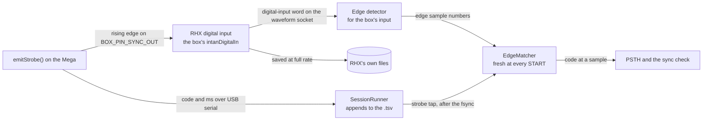
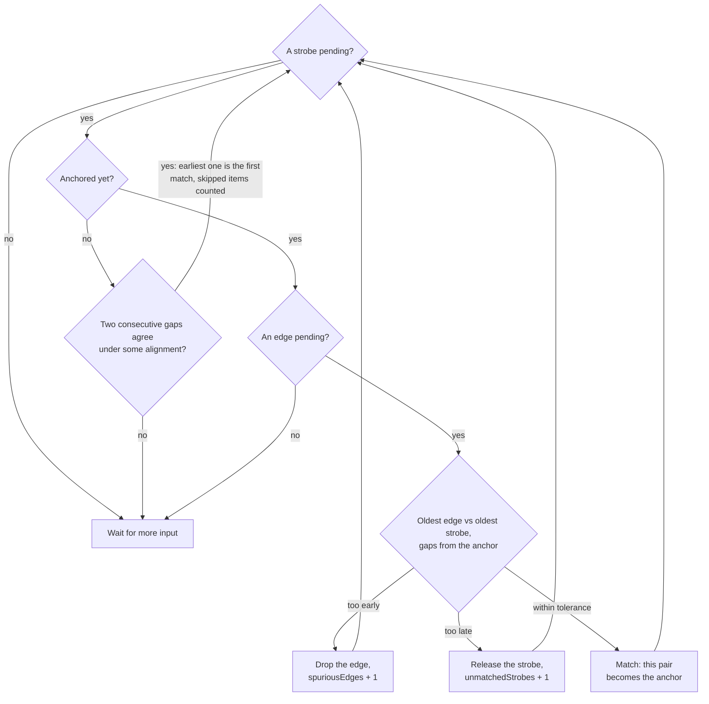
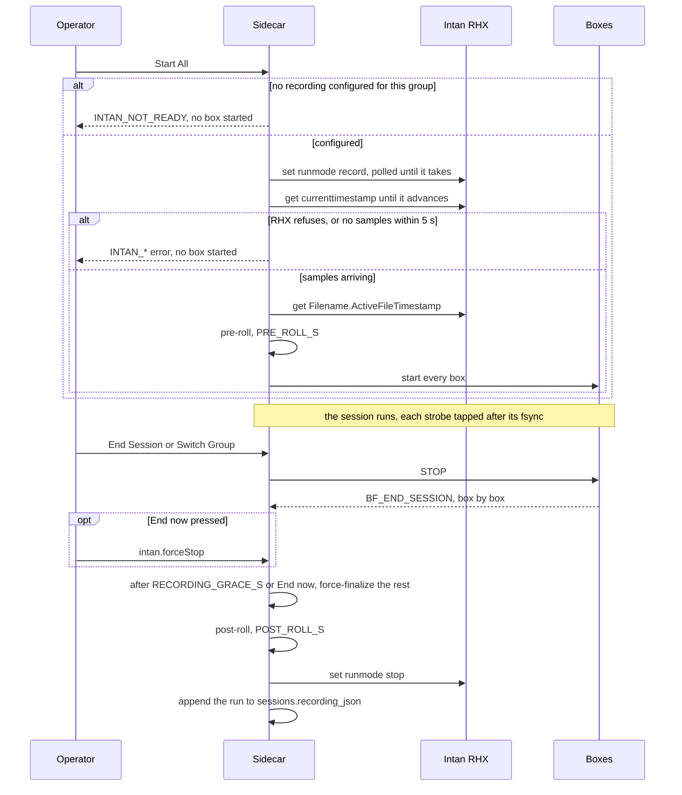

# Recording with Intan RHX

A session can also be an electrophysiology recording: Ephymeris drives a locally running **Intan RHX**
over its TCP protocol. The code is `sidecar/ephymeris_sidecar/intan/` (stdlib only), the wire is
[PROTOCOL.md](PROTOCOL.md#intan-recording), and the operator's steps are in
[USER-GUIDE.md](USER-GUIDE.md#recording-with-intan). Recording has been run through the app against a
real RHX and real boxes; a full-length recording from a real animal has not ([Not yet verified](#not-yet-verified)).

## Contents

- [The rule](#the-rule)
- [Talking to RHX](#talking-to-rhx)
  - [What the protocol lacks](#what-the-protocol-lacks)
  - [Confirmed writes](#confirmed-writes)
  - [Run mode](#run-mode)
  - [Data sockets](#data-sockets)
  - [Synthetic data](#synthetic-data)
- [The sync line](#the-sync-line)
  - [Firmware pulse](#firmware-pulse)
  - [Wiring and binding](#wiring-and-binding)
  - [Edge matcher](#edge-matcher)
- [Recording walkthrough](#recording-walkthrough)
  - [Recording tab](#recording-tab)
  - [Record step](#record-step)
- [Start and end](#start-and-end)
  - [Start](#start)
  - [Graceful end](#graceful-end)
  - [When RHX goes away](#when-rhx-goes-away)
  - [Runner taps](#runner-taps)
- [What is written](#what-is-written)
- [Live windows](#live-windows)
- [Not yet verified](#not-yet-verified)
  - [Answered by the probe](#answered-by-the-probe)
  - [To watch on the first full-length recording](#to-watch-on-the-first-full-length-recording)

## The rule

> **RHX may be slow, absent or dead, and none of that may stall or fail a behavior session.**

It is the [Backup mirror's](DATA.md#backup-mirroring) rule restated for a second external system, and it
decides almost everything below.

| Rule | Reason |
|---|---|
| Nothing on the session path awaits RHX, **except starting** | `sessions.startAll` and `port.startSession` on a recording session begin the RHX recording *first* and refuse with an `INTAN_*` code if they cannot, **before any box is started**. A behavior session quietly missing its electrophysiology cannot be re-run, so this is the one place a failure must be loud |
| `IntanService.stop_recording` never raises | By the time it runs the animals are done; a raise could only strand the session as `running`. RHX unreachable → the run is still recorded and `intan.status` says to stop it from RHX |
| The data sockets are a convenience | Losing them costs the live windows, never the recording. RHX writes to disk on its own |
| Closing our sockets never stops RHX | So neither a reconnect nor the sidecar exiting ends a recording. `IntanService.stop()` closes *our* sockets and nothing else |

It runs **locally only**: `client.py`'s `HOST` is `127.0.0.1` and there is no host setting, which removes
every networking failure mode from the list.

## Talking to RHX

RHX exposes three TCP servers (its **Network → Remote TCP Control** dialog): commands on 5000, waveforms
on 5001, spikes on 5002 by default. If they were changed there, the Recording tab's TCP ports
(`settings.intan`) must be changed to match. The operator presses **Connect** on RHX's Commands tab; the sidecar opens the two
data sockets itself over the command socket (`set tcpwaveformdatasocket.status pending`).

> [!NOTE]
> **That click is needed again after every disconnect.** When its command client goes away, RHX's command
> server returns to *Disconnected*, not *Pending*, so port 5000 stops listening until Connect is pressed
> again. The service's once-a-second reconnect (`service.py`'s `POLL_S`) can only succeed after that click,
> and `INTAN_UNAVAILABLE`'s message, which names it, is the normal first thing an operator sees each day.

### What the protocol lacks

- **No command opens RHX's SpikeScope, PSTH or ISI windows** — only their parameters. So the four
  [live windows](#live-windows) are Ephymeris' own, computed from the data sockets.
- **No command loads a probe map.** `intan/probemap.py` parses the same XML the operator would load in RHX.
- **No "pin channel" command.** "Pin a digital input per box" is a **binding**
  ([Wiring and binding](#wiring-and-binding)); configuring a recording enables, names (`BOX3_EVENTS`) and
  streams exactly the bound inputs.

### Confirmed writes

The protocol is bare text with no framing: a `get` answers `Return: <Name> <value>`; a **`set` or
`execute` answers nothing on success** and an error sentence on failure. Intan's example clients
`sleep(0.1)` after every command. Copying them would be wrong twice: a sleep confirms nothing (a refused
`set` looks exactly like an accepted one), and the sleep really exists because two unanswered writes can
share one TCP segment, which RHX reads as **one command**.

So every write from `intan/client.py` is **one transmission that ends in a `get`** — the *sentinel*
(`_SENTINEL`). Commands are `;`-separated (the documented batching form) and answered in order, so
whatever arrives before the sentinel's reply is that transmission's error text. No two transmissions
are ever in flight (`_lock`).

> [!CAUTION]
> **The sentinel is an assumption about RHX, and it is fenced.** Intan documents batching with `set`
> only. If a build does not answer a `get` riding a batch, the first write times out; the client drops to
> the examples' discipline (one command per transmission, a fixed `SETTLE_S`) for the rest of the
> connection, logs it, and reports `confirmsWrites: false`, which the Recording tab shows. Slower and
> blind to refusals, but correct: degrade, don't disappear ([dependency policy](ARCHITECTURE.md#dependency-policy)).

**The three values a recording cannot be wrong about are read back regardless** — `FileFormat`,
`Filename.Path`, `Filename.BaseFilename` (`set(..., verify=True)`). That works in both disciplines and is
the only thing that catches RHX *accepting* a command and storing something else. `verify` compares
case-insensitively, because RHX lowercases notes and custom channel names.

> [!CAUTION]
> **A save location with a space in it.** The lab's data directory has a space in its path. RHX documents
> that settings-file paths must contain no spaces and says nothing about `Filename.Path`. A build that
> split the value on whitespace would **accept** `C:/Hart Lab/x` and record into `C:/Hart`: no error,
> plausible files, wrong place. The read-back catches it and `intan.configure` refuses with a message
> saying to pick a path without a space. The Record step warns under its resolved save location when the path
contains a space, before anything reaches RHX. RHX 3.5.0 keeps the space, so on that build the refusal never
> fires; the read-back stays because it is cheap and is the only defence on a build that differs.

### Run mode

`set runmode` is the one command RHX documents as not immediate. `set_run_mode` polls `get runmode` until
it takes, and first checks `UploadInProgress` (RHX refuses a run-mode change during an upload, silently).

> [!CAUTION]
> **Nothing may ride behind `set runmode` in a transmission, so it is the one write with no sentinel.**
> On the real RHX, whatever follows `set runmode run` in a batch is not processed until acquisition
> *stops*: the `get` goes unanswered for the whole run, and its reply turns up after the next stop,
> answering some other question. `set_run_mode` writes the command alone and takes its receipt from the
> poll; `_write_confirmed` raises on a batch containing one. `tests/fake_rhx.py` defers the same way, and a
> test pins the fake's deferral so the client test cannot pass trivially.

Not every reply is named: `CurrentTimestamp` and `CurrentTimeSeconds` answer `Return: 704383`, so `get()`
treats a lone token as the value.

### Data sockets

`intan/streams.py` is pure: bytes in, records out.

| Socket | Framing |
|---|---|
| Waveform | Blocks of `FRAMES_PER_BLOCK` (128) frames, each block led by `WAVEFORM_MAGIC`. A frame is an `int32` timestamp (samples since acquisition began), then one `uint16` per enabled output **in RHX's order**: every enabled band of every amplifier channel (wide, low, high), aux, board ADCs, and last, **once however many digital inputs are enabled**, one word holding all sixteen. Amplifier samples are offset binary at 0.195 µV/bit |
| Spike | 14-byte chunks: `SPIKE_MAGIC`, a 5-character native channel name, `uint32` timestamp, `uint8` id |

**The waveform stream does not describe itself.** `FrameLayout` is the reader's copy of a fact that lives
in RHX, and a wrong copy parses garbage without complaint. The defences:

- **A block is believed only when the next block's magic sits exactly one block-length later.** A real
  stream splits blocks across reads, so the parser accumulates (Intan's example checks `len % blockSize`
  on one `recv`). Cost: one block of latency.
- **The layout is kept sorted the way RHX writes** (`native_sort_key`, `BAND_ORDER`), not the order outputs
  were enabled. A caller-ordered copy swaps two channels' samples and still passes every magic check.
- **A layout change mid-run is safe** for the same two-ended reason: when a SpikeScope opens, blocks in the
  old shape are still in flight; the old layout parses until it stops confirming, then the pending one
  takes over. `WaveformParser.discarded` counts bytes thrown away hunting for a boundary; TCP does not
  corrupt, so a climbing count means the layout is wrong.

> [!CAUTION]
> **A same-size layout change cannot be detected by framing.** A SpikeScope switching channel swaps one
> streamed column for another: every block confirms under either layout, the old one forever, and the new
> channel's samples are filed under the old name. So a same-size change is switched on a **sample
> marker**: the service reads `currenttimestamp` after RHX acknowledged the change, and the parser
> switches at the first block at or past it. Blocks before the marker are **dropped, not guessed**, since
> a wrong guess draws one channel's waveform as another's.

**What is streamed is kept small on purpose**: around ten channels at 30 kS/s is where Intan says TCP stops
keeping up. So: spike output for every recorded channel (event-rate, cheap), the digital-input word, and
the highpass band of only the channels with an open SpikeScope, at most `MAX_SCOPED_CHANNELS`.

### Synthetic data

RHX's demo mode (`synthetic: true`, no controller attached) generates its own digital inputs, which no
box's pin drives, so the [edge matcher](#edge-matcher) would diagnose wiring that does not exist. In
synthetic mode the matcher is **bypassed**: `sync` is published **empty**, and a strobe is placed on the
recording clock by **arrival** (the newest sample seen when the serial line delivered it, tens of
milliseconds late). The PSTH payload carries `alignment: "arrival"` and the window labels it. Real data
never takes this path; there an unmatched strobe is a fact about the wiring.

## The sync line

The behavioral timestamps that matter are on the **recording's** clock, and they come from a wire: one
line per box, carrying no code. The pulse says *when*, the serial strobe says *what*, and the two are
paired by the [edge matcher](#edge-matcher). Eight lines per box would leave room for two boxes on a
16-input controller.

The two paths one event takes, and where they meet:



### Firmware pulse

`emitStrobe()` in `BehaviorBox.h` brackets its serial print with a pulse on `BOX_PIN_SYNC_OUT`, in this
order: wait out the LOW gap **first** (so the wait lands before the timestamp, not between it and the
edge); stamp, then drive HIGH at once (**the rising edge is what the controller timestamps**); print while
high, spending the pulse width on work that had to happen anyway; hold out the remainder, then LOW.

| Macro (`BoxPins.h`, `#ifndef`-guarded) | Meaning |
|---|---|
| `BOX_PIN_SYNC_OUT` | Default **49**, free on the box as built. **Not 13**: the bootloader blinks it on every reset, which a recording logs as events. Not 0/1 (serial) or 50–53 (SPI). **`-1` compiles the pulse out** |
| `BOX_SYNC_PULSE_US` | Pulse width |
| `BOX_SYNC_GAP_US` | Minimum LOW before the next pulse |

> [!CAUTION]
> **Two pulses with no LOW between them are one edge.** Events can be emitted back to back, and a fused
> pair makes every later event match one strobe late, which reads as plausible data, not a failure. The
> gap is enforced in firmware and pinned by the host tests (`libraries/BehaviorBox/extras/host_test/`),
> whose shim logs every pin write with its `micros()`.

`GRGL_Sim` prints its own strobes and pulses through the same helpers (`syncGap`/`syncRise`/`syncFall`),
so the sync line and controller input can be proven **with no animal**. `shutdownHardware()` (called by
`initBoxHardware()`) holds the line LOW, because a floating controller input reads as noise, i.e. events.
Firmware structure in general: [TASKS.md](TASKS.md#firmware).

### Wiring and binding

Two different facts in two places:

- **Which Mega pin pulses** is *wiring*: a channel of kind **`sync`** in the rig document (`sync_out`,
  pin 49 as shipped), edited on `/config/wiring` and compiled into `TaskPins.h`
  ([TASKS.md](TASKS.md#rig-wiring)). `RIG105` (`ChannelMap.sync_problems`) refuses a second sync channel:
  the firmware pulses one line, so a second would be a wire believed to carry events that carries nothing.
- **Which controller input it reaches** is a *binding*: `BoxBinding.intanDigitalIn`, 1–16, edited on the
  Recording tab's Sync inputs table (`SyncInputsTable.tsx`) while the value stays in `settings.boxes`
  ([ARCHITECTURE.md](ARCHITECTURE.md#boxes-and-boards)). A cable between two instruments, not a fact
  about the box — the reasoning that makes `hardwareId` a binding. Two boxes may not share an input: both
  would match every edge. `settings.py` keeps the first claim and drops the second, so the later box reads
  as unwired and the Record step refuses it.

> [!CAUTION]
> **`BOX_PIN_SYNC_OUT` is the one pin that is always emitted** (`taskdef/generate.py`'s `_sync_lines`).
> Every other undeclared pin keeps `BoxPins.h`'s default, so a partial rig document degrades one pin at a
> time. Here that default would pulse pin 49 on a rig whose operator declared no sync channel, and may
> have put something else there, while the app reports the box has no sync line. So absence is stated:
> `-1`.
>
> **A saved `<data_dir>/hardware/rig.json` replaces the shipped pair** rather than merging, so a rig
> wired before the `sync` kind existed has no `sync_out` until someone adds one. The Record step's
> readiness list checks for it (`intan.status.rigHasSync`) and `intan.configure` refuses without it.

### Edge matcher

`intan/analysis.py`'s `EdgeMatcher`. The firmware pulses once per strobe, so the Nth edge is the Nth
strobe, in principle. By count alone, **one** extra edge (the line twitching as the Mega resets through
DTR, a glitch on a long cable) attributes every later event to its neighbour, and the PSTH still looks
like a PSTH. So order proposes and **time disposes**: an edge is accepted for a strobe only if it lands
where the strobe's own millisecond timestamp says, measured from the last accepted pair.

| Head edge is | Meaning | Action |
|---|---|---|
| within tolerance | this strobe's pulse | match; becomes the new anchor |
| too early | spurious | drop the edge, count `spuriousEdges` |
| too late | this strobe's pulse never came | release the strobe unmatched, count `unmatchedStrobes` |

The same loop as a flow, run whenever a strobe or a batch of edges arrives (`EdgeMatcher._drain`):



- **The tolerance is relative**: the larger of `ABS_TOLERANCE_MS` and `REL_TOLERANCE` of the gap. The
  Mega's ceramic resonator drifts about half a percent, so over a long ITI the clocks honestly disagree by
  ~100 ms and a fixed tolerance would call that a missing pulse. Measuring from the *last* pair keeps the
  error from accumulating.
- **The first pair** is the earliest alignment under which two consecutive gaps agree. Strobes are trusted
  far more than edges (a serial line does not invent events), so at most `MAX_LEAD` leading strobes but
  any number of leading edges may be skipped; that is what discards the reset twitch instead of anchoring
  on it.
- **A box gets a fresh matcher at every START** (`IntanService._box_started`), because the Mega's clock
  restarts there.
- An unconnected line must not queue strobes forever: past `MAX_PENDING`, the oldest is given up on.

`intan.status.sync` publishes `matched`/`spuriousEdges`/`unmatchedStrobes` per box and Mission Control
shows them as the **sync check**, columns *matched*, *missed* (`unmatchedStrobes`) and *stray*
(`spuriousEdges`): **it is the wiring check**. `unmatchedStrobes` climbing with `matched` at zero is a sync
line not reaching its input, and the row then reads "no pulses arriving — check the sync line"
(`RecordingStatus.tsx`).


*A healthy sync line: every box matching, nothing missed, one stray edge on box 3 dropped rather than paired.*

The matcher exists for the **live views only**. The durable record needs none of it: RHX saves the digital
input at full rate, the `.tsv` holds the strobes, and offline alignment can apply the same algorithm, or a
better one, to complete data.

## Recording walkthrough

What the operator does is in [USER-GUIDE.md](USER-GUIDE.md#recording-with-intan); this is what each
surface owns.

### Recording tab

`/recording` (`routes/Recording.tsx`) is a [telemetry display](ARCHITECTURE.md#telemetry-panels) sized to
fit one screen without scrolling:

| Part | Holds |
|---|---|
| Readout strip | Link state, controller (and the `synthetic` flag), RHX version, sample rate, headstage ports, and boxes wired / whether the wiring declares a sync channel |
| Live (only while a recording exists) | `RecordingStatus`, the same block as Mission Control's rail, and a link to Mission Control |
| Link — Connection | `IntanConnectionPanel`: Connect/Disconnect, `confirmsWrites`, the one RHX click as a disclosure (open while there is no link), and the three TCP ports (`settings.intan`) |
| Link — Sync inputs | `SyncInputsTable`: box → `DIN n` |
| Defaults — Saving, Spike thresholds | `settings.recordingDefaults` (shaped in `lib/intan/defaults.ts`), edited outright via `RecordingConfigRows` |

Link is the left column and Defaults the right. Rows are `SettingRow` at **compact** density
(`SettingRowDensityContext`): label and control on one line, the explanation behind an ⓘ `InfoHint`. The
Record step renders the same rows at full density.


### Record step

The Dashboard's Start Recording tile opens `/session/new?mode=recording`, which creates the session with
`recording: true`. From there the flow reads the flag off the sidecar's session snapshot
(`useIsRecordingSession`), **not the URL**: the flow is re-entered from the dock, a group switch and a
reload, and a query flag would have to survive every one of those.

```
/session/new → /session/:id/mapping → /session/:id/recording → /session/:id/control
                                       (SessionRecording.tsx)
```

**After mapping, not before**: the step asks which headstage port each *mapped* box is on. It runs **once
per group** (animals, ports and probes change between groups) and opens prefilled from
`settings.recordingDefaults`, which it writes back on Continue.

- **Readiness**: RHX connected, not already recording, a headstage present, the wiring has a sync channel,
  every recorded box has a digital input. Each failing line links to where it is fixed.
- **Saving**: the resolved location, `<session folder>/ephys` by default or the session's folder name
  under a chosen root (recordings are large and often live on their own drive; the shared folder name lets
  the two halves match by eye), with the defaults collapsed to one summary behind an Edit door.
- **Boxes**: per mapped box, Record or Behavior only, its DIN, headstage port, channel range and optional
  probe-map XML. Two boxes may share a port on disjoint ranges; an overlap is refused.


**Wideband defaults on**: it is the one option that cannot lose data. Everything else RHX saves is derived
from it, and a threshold picked badly cannot be re-picked afterwards without it.

Nothing talks to RHX until **Continue**; `intan.configure` (`IntanService.configure`) then applies the plan
in one pass. An RHX left in `Run` is stopped (it ignores every saving parameter while running); one already
in `Record` is refused and not touched. **Channels nobody claimed are switched off**, so an unassigned
headstage does not fill the disk. RHX's three notes carry the session, cohort and group, and the
box→animal→port map; `livenotes` stamps each box's start and end into RHX's notes file.

## Start and end

Where these steps sit in the wider session: [ARCHITECTURE.md](ARCHITECTURE.md#session-lifecycle).

One group's recording from Start All to the stored run (`Application._begin_recording_if_any`,
`_end_all_boxes`, `IntanService.start_recording` and `stop_recording`):



If RHX cannot be reached at the stop, `stop_recording` still returns the run and says to stop RHX by hand.

### Start

`sessions.startAll`, or the first `port.startSession`, goes through `Application._begin_recording_if_any`
and `IntanService.start_recording`:

1. `set runmode record`, polled until it takes.
2. **Wait for samples** (`currenttimestamp` advancing). "Record" is a request; samples arriving is the fact.
3. Read `Filename.ActiveFileTimestamp`, RHX's own stamp naming the folder and files it created.
4. Pre-roll (`PRE_ROLL_S`), so every channel has a baseline ahead of the first event.
5. Only now are boxes started.

A failure in 1–2 is an `INTAN_*` error with no box started.

### Graceful end

`sessions.end` and `sessions.endGroup` go through `Application._end_all_boxes`:

1. `STOP` to every box.
2. **Wait for each box's own `BF_END_SESSION`**, up to `Application.RECORDING_GRACE_S` (longer than any
   trial the lab runs). `intan.status.waitingOn` names who is still out; Mission Control offers End now
   (`intan.forceStop`).
3. Post-roll (`POST_ROLL_S`), then `set runmode stop`.
4. The run is appended to `sessions.recording_json`.

> [!IMPORTANT]
> **Behavior-only sessions keep their 100 ms.** `SessionRunner.end_all` sends `STOP` and waits
> `graceful_timeout_s`, default 0.1 s, before force-finalizing, which cuts the trial in flight; that is the
> behavior-session contract. A recording passes the long timeout because electrophysiology with no
> behavioral outcome to align to is the expensive half of the experiment with the cheap half missing.


**One recording per group run**, not per session: another group is different animals, possibly on
different ports.

### When RHX goes away

| Event | What happens |
|---|---|
| RHX hangs up (Disconnect in its dialog, or quit) | Seen within `WATCH_S` without sending anything: EOF reaches the reader when the peer closes (`RhxCommandClient.peer_closed`). `connected: false` at once; the reconnect succeeds once Connect is pressed in RHX again |
| RHX silent with the socket open | `SILENT_POLLS` consecutive unanswered polls (one silence can be RHX busy) and the link is declared lost **and our end is closed** (`_lost`). The close matters: `connected` is the socket's, so a link marked lost on an open socket would go on reading *connected* |
| Command socket lost mid-recording | `state: error`, "RHX keeps recording on its own; reconnecting". The session is untouched. On reconnect, if RHX is still in `Record`, the run is picked back up and the streams reopened |
| Stop pressed in RHX | The poll sees `runmode ≠ record` → `error`, said plainly. The session is untouched |
| RHX unreachable at End | `stop_recording` swallows it, records the run, and says to stop RHX by hand |
| Data sockets fail to open | `liveStreams: false`; Mission Control says the live views are unavailable, the recording is unaffected |
| The sidecar exits | Its sockets close. RHX keeps recording |

### Runner taps

`SessionRunner` exposes three optional callbacks, wired in `app.py`: `recording_fields`, `on_box_started`,
`on_strobe_tap` (plus `IntanService.box_ended`, called from the app when a box finishes). All run **on the
port's session thread**, so the service hops to the loop with `call_soon_threadsafe`. **The strobe tap runs
after the fsync, never before**: the strobe is on disk whatever the tap does. Each call site swallows
exceptions; a test pins that a throwing tap costs the run nothing.

## What is written

**By RHX**: its own files, in its own format, under `Filename.Path`, in a directory it timestamps itself
(`createnewdirectory true`, so two recordings never overwrite each other). Ephymeris never reads or moves
them. Probe-map XMLs are copied beside them as `box<n>_<name>.xml`.

**`sessions.recording_json`** ([DATA.md](DATA.md#sqlite-database)): `{"runs": [...]}`, one per group run
(path, base filename, RHX's file timestamp, format, sample rate, start/end, and per box its DIN, port,
channels and probe-map file). `NULL` means behavior only.

**Each animal's document** ([DATA.md](DATA.md#per-animal-files)) gains flat `intan_*` fields, also in the
`.tsv` header so a crash-recovered file keeps them:

| Field | |
|---|---|
| `intan_recording` | base filename + RHX's timestamp: the name to look for |
| `intan_path` | where RHX was told to save |
| `intan_digital_in`, `intan_port`, `intan_channels` | this box's input, port and `A-016:A-031` range |
| `intan_sample_rate` | for converting sample numbers |

> [!IMPORTANT]
> **Core, not config, so they stay out of `params_hash`.** They describe the rig, not the task: two runs
> of one tuning must be comparable in Analytics whether or not one was recorded
> ([TASKS.md](TASKS.md#profile-and-params-hashes)). They are in `tasks/profile.py`'s `CORE_METADATA_KEYS`
> (a profile may not claim them), and the string ones in `sessions/recovery.py`'s `_STRING_FIELDS` (a base
> filename like `0423_7` must not come back as a number).

The durable record of a recording is RHX's own file plus the `.tsv`; nothing the live views compute is
persisted.

## Live windows

Real OS windows (`WebviewWindow`, labels `scope-*`), not panels, because they are dragged to a second
monitor beside RHX and left open across boxes. They are opened from `lib/intan/windows.ts`.

**A slim provider tree.** A pop-up is the same bundle at `#/scope/<kind>`; `main.tsx` sees the hash and
mounts `ScopeApp` under `SidecarProvider` + `IntanProvider` only. **No `SettingsProvider`**: its job is
pushing settings on every connect, and a scope window must not re-push a stale copy over the main
window's (`lib/intan/scopeTree.test.ts` pins the import graph). Each window opens its own authenticated
WebSocket, so it keeps drawing whatever the main window does. Everything it needs rides in the URL,
including the PSTH's trigger vocabulary, since only the main window holds the task profile.
`src-tauri/capabilities/scope.json` grants these windows their own frame and opening one window, nothing
else. **`src-tauri/src/lib.rs` closes `scope-*` windows with the main window**, or the app, the sidecar and
its serial ports would not exit until each was closed by hand.

| Window | Fed by | Rules |
|---|---|---|
| Spike Scope | spike times + that channel's highpass waveform | Snippets are cut sidecar-side at the widest window (`SNIPPET_PRE_MS`/`SNIPPET_POST_MS`) and sent incrementally; the window crops. **The threshold line is live**: dragging it moves RHX's detector, which changes what is saved, so it commits on release (`intan.setThreshold`). Changing channel is the same-size layout change ([Data sockets](#data-sockets)) |
| PSTH | spike times + matched sync edges | RHX triggers on a digital input's edge, and here every event pulses the same input, so RHX would align to "anything happened". The sidecar knows which event each edge was, so the trigger is a **named event** from the profile. Only trials whose post-window has closed count (else the right edge sags by how recent the last trigger was), and only trials whose pre-window starts at or after `SpikeRing.complete_since` (else an old trial is drawn with whichever spikes survived eviction). Sent only when it changes |
| ISI | spike times | Intervals past the span are **counted and shown**, not dropped: a histogram that looks complete while most intervals fall outside it is how a slow unit reads as a quiet one. A span that is not a whole number of bins gets a partial last bin at its true width |
| Probe map | spike times | Each site shaded by its last second of firing (square-root ramp). Clicking a site opens its Spike Scope. **The file's colours are ignored** (they are RHX's UI); the geometry is the information. **Y is flipped at draw time**: Intan's y points up, and skipping the flip draws the probe tip-up with every site misplaced |

| | |
|---|---|
|  |  |
|  |  |

*The four windows. The PSTH aligns to a named event, the ISI counts what falls past its span ("373 beyond
200 ms"), and the probe map is drawn tip down.*

RHX's own option sets are offered (`lib/intan/types.ts`) so the two read the same. A scope is kept alive
by `intan.scope.update` every `KEEPALIVE_MS` (`lib/intan/context.ts`); one untouched for `SCOPE_TTL_S` is
swept, so a killed window stops costing RHX a streamed channel.

**Canvas, fenced.** The Spike Scope, PSTH and ISI draw on a 2D canvas, redrawn straight from the socket
handler (`routes/scope/useCanvas.ts`) rather than through React state. This drawing stays in
`routes/scope/`: it is not a second house style, and the session views stay SVG
([ARCHITECTURE.md](ARCHITECTURE.md#theme)). The probe map is SVG because its sites must be clickable. The
shared arithmetic is pure and tested in `lib/intan/scopeMath.ts`.

## Not yet verified

Recording has been run end to end on real hardware — configure, record, the live windows, the sync line
into a real digital input, and the graceful end — against a real RHX. **What has not been done is a
full-length recording from a real animal.**

The automated suite runs against the **fake RHX** (`sidecar/tests/fake_rhx.py`: the three servers on real
sockets, each survivable behaviour switchable). `sidecar/tests/test_intan_real_rhx.py` is the probe for a
real one: opt-in (`EPHYMERIS_REAL_RHX=1`), polite (refuses if RHX is running, only ever enters `run`, never
`record`, and restores every value it touches), and **one connection for every check**, because RHX's
command server returns to *Disconnected* when its client leaves.

### Answered by the probe

Run against RHX 3.5.0, `ControllerRecordUSB3`, synthetic:

| Question | Answer |
|---|---|
| Is a `get` riding a `;` batch answered? | Yes: the confirmed write works; the fallback is not exercised |
| Is a refused `set` reported? | Yes (`Unrecognized parameter`), including sets forbidden while running |
| Does `Filename.Path` keep a space? | Yes. The read-back stays for builds that differ |
| Digital-input names on a Recording Controller? | `digital-in-01`: two digits, one-based (`digital_in_name`) |
| Commands batched behind `set runmode run`? | Not processed until acquisition stops ([Run mode](#run-mode)) |
| Are all replies named? | No: `CurrentTimestamp`, `CurrentTimeSeconds` answer namelessly |
| Can stream outputs and spike thresholds change while running? | Yes, so a SpikeScope can open and its threshold drag mid-recording |
| Does RHX keep case? | Paths, base filenames, enums: yes. Notes and custom channel names: lowercased |
| Are all of `intan.configure`'s parameter names real? | Yes |

### To watch on the first full-length recording

| Question | If the answer is the bad one |
|---|---|
| Does the RMS-relative threshold need the board to have run first? | Thresholds land wrong. Fix: a short `run` before `SetSpikeDetectionThresholds` |
| Where a channel swap lands in the stream | The marker is read after RHX acknowledged the swap, assuming RHX's TCP output lags acquisition. If its output thread can run ahead of the clock read, a snippet or two lands on the wrong channel once, then corrects |
| Digital-input naming on the USB Interface Board (zero-based) | Handled in `digital_in_name`; only matters on a rig using that board |
