# Tasks

Everything between "a box runs firmware that emits strobes" and "the app draws its trial flow, builds its `START` line, and scores it live". For maintainers and firmware authors. What the recorded values become on disk and in Analytics is [DATA.md](DATA.md); the session flow that sends the line is [ARCHITECTURE.md](ARCHITECTURE.md#session-lifecycle).

## Contents

- [Overview](#overview)
  - [Two places a value can come from](#two-places-a-value-can-come-from)
  - [The three bundled sketches](#the-three-bundled-sketches)
- [Firmware](#firmware)
  - [Guarded defaults](#guarded-defaults)
  - [Counts that move with their key lists](#counts-that-move-with-their-key-lists)
  - [Reward volume on the trial type](#reward-volume-on-the-trial-type)
  - [Selection modes](#selection-modes)
  - [Compiling and the host tests](#compiling-and-the-host-tests)
- [Sketch library](#sketch-library)
  - [Library roots](#library-roots)
  - [Folder rules](#folder-rules)
  - [Discovery](#discovery)
  - [Library states](#library-states)
- [Task profile](#task-profile)
  - [Top level keys](#top-level-keys)
  - [Config fields](#config-fields)
  - [Ramped values](#ramped-values)
  - [Strobes](#strobes)
  - [Live metric entries](#live-metric-entries)
  - [Utility controls and telemetry](#utility-controls-and-telemetry)
  - [Identify](#identify)
  - [Legacy names](#legacy-names)
- [Task definitions](#task-definitions)
  - [What a definition holds](#what-a-definition-holds)
  - [The field catalogue](#the-field-catalogue)
  - [Diagnostics](#diagnostics)
  - [Saving and regeneration](#saving-and-regeneration)
  - [Rebuilt bundled sketches](#rebuilt-bundled-sketches)
  - [The box utility](#the-box-utility)
  - [Order is meaning](#order-is-meaning)
- [Rig wiring](#rig-wiring)
  - [Three documents](#three-documents)
  - [Registry rules](#registry-rules)
  - [The wiring page](#the-wiring-page)
  - [Wiring rules](#wiring-rules)
  - [The sync channel](#the-sync-channel)
- [Strobe vocabulary](#strobe-vocabulary)
  - [Append only](#append-only)
  - [Editing the vocabulary](#editing-the-vocabulary)
  - [Moving codes between machines](#moving-codes-between-machines)
  - [Every declared code is emitted](#every-declared-code-is-emitted)
  - [Port slots](#port-slots)
  - [Onset codes](#onset-codes)
- [Live metrics](#live-metrics)
  - [The definition](#the-definition)
  - [Boundary codes](#boundary-codes)
  - [Runtime](#runtime)
- [The START line](#the-start-line)
  - [Three layer merge](#three-layer-merge)
  - [Building the line](#building-the-line)
  - [The length cap](#the-length-cap)
  - [SEED](#seed)
- [Profile and params hashes](#profile-and-params-hashes)
- [Derived state machine](#derived-state-machine)
  - [Why derived](#why-derived)
  - [The model](#the-model)
  - [Gates](#gates)
  - [Nodes and outcomes](#nodes-and-outcomes)
  - [One condition node](#one-condition-node)
  - [Live token](#live-token)
  - [Layout](#layout)
- [The Task tab](#the-task-tab)
  - [Landing](#landing)
  - [Editor](#editor)
  - [Trial types](#trial-types)
  - [Trial generation](#trial-generation)
  - [Ramp and START meter](#ramp-and-start-meter)
  - [Parameter dial](#parameter-dial)
- [Writing a new sketch](#writing-a-new-sketch)
  - [Authoring steps](#authoring-steps)
  - [Verify](#verify)
  - [Troubleshooting](#troubleshooting)
  - [What raises](#what-raises)
  - [What degrades silently](#what-degrades-silently)

## Overview

A **task** is a sketch plus an optional `task.json` sibling that describes it (its *profile*). The profile is what lets the app render a config form, draw the trial-flow diagram, build the `START` command and score live metrics for a sketch it has never seen. A sketch with no `task.json` is fully supported: it gets a bare `START`, no form, and a raw scrolling strobe log instead of charts.

> [!IMPORTANT]
> **No sketch is special-cased in app code.** Drive everything off the profile. If you are about to write `if (sketchName === "GRGL")`, the profile is missing a declaration.

Operators do not write `task.json` by hand. They author a **task definition** on the Task tab and the app generates a sketch folder from it plus this rig's wiring ([Task definitions](#task-definitions)). A hand-written profile is for a firmware author adding a sketch of their own ([Writing a new sketch](#writing-a-new-sketch)).

### Two places a value can come from

Everything an experiment varies reaches the firmware one of two ways. Which way follows from what the firmware can accept, not from preference.

| | Arrives at | Carries | Changing it costs |
|---|---|---|---|
| **Generated headers** (`TaskPins.h`, `TaskTrials.h`) | compile time | channel→pin map, the strobe vocabulary, the trial table, how many ramp stages and trial types exist, which selector runs | a rebuild and reflash |
| **The `START` line** | run time | every timing, hold, window, penalty, per-condition reward volume (`RW<n>`), pool weight (`PW<n>`), anti-bias clamp and stage threshold | one serial line |

The two roads to the board. The left one runs once per save or rewiring; the right one runs at every start:

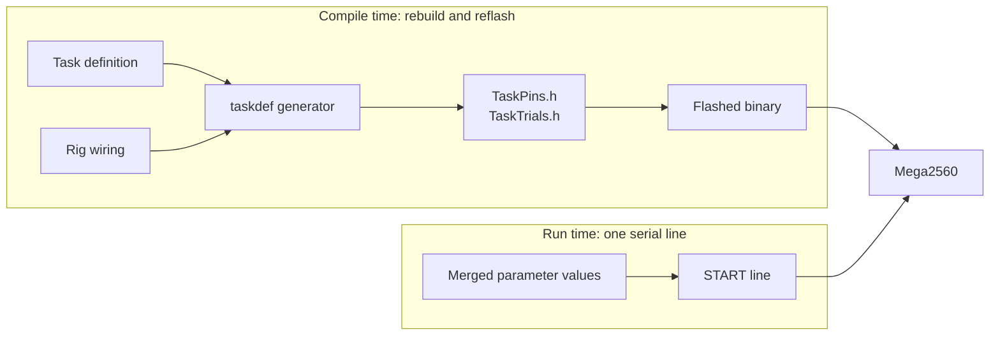

The dividing line is [`START_LINE_MAX`](#the-length-cap): a trial table and a pin map do not fit on the line, and pins must be compile-time constants anyway. Everything that fits stays on the wire, which is what lets **one flashed binary serve six boxes tuned differently** — the per-box overrides at mapping would otherwise mean six compiles.

### The three bundled sketches

| Sketch | Folder | What it is |
|---|---|---|
| **GRGL** | `Olfactory Behavior/GRGL/` | The one behavioural sketch. Covers discrimination, shaping and eased variants of either; every generated task is a copy of it with new headers. Its shipped `TaskPins.h`/`TaskTrials.h` are defaults, so a bare checkout runs the lab's historical 2-odor task. |
| **BOX_Utility** | `Utility/BOX_Utility/` | The resting baseline every idle box is returned to ([ARCHITECTURE.md](ARCHITECTURE.md#hardware-utility-baseline)). |
| **GRGL_Sim** | `Utility/GRGL_Sim/` | Drives a real box through a full session with no animal in it — valves, light, vacuum and fluid on this rig's pins. **Its fluid lines really open**: run it dry or with a catch vessel unless you mean to dispense. |

## Firmware

The firmware lives in `firmware/` ([its README](../firmware/README.md)); it was a separate repository until it was imported here with its history. A checkout's sidecar reads it in place, and `scripts/package-resources.mjs` copies it into the installer. **Edit firmware in `firmware/`**; there is no other copy to keep in step.

All trial logic lives in `libraries/BehaviorBox/BehaviorBox.h`: the serial helpers (strobe emitter, `START` reader, `STOP` poll), `TaskParams` and the one declarative wire-key list `TASK_PARAM_LIST` the `START` parser is generated from, the trial primitives (`TrialType`, `generateTrials`), the selection policies, and one `runTrial()` loop. That shared loop is why the state machine can be [derived](#derived-state-machine) rather than declared. The pinout is in `BoxPins.h`; the strobe codes are in no file of the firmware repo — the app generates them into `TaskPins.h`, and `BoxStrobes.h` only refuses to build without them.

`emitStrobe()` also pulses a sync pin for electrophysiology alignment; see [RECORDING.md](RECORDING.md#the-sync-line).

### Guarded defaults

Every pin in `BoxPins.h` is `#ifndef`-guarded. Strobe codes are not defaults at all: `BoxStrobes.h` defines none and stops the build with an `#error` unless the generated `TaskPins.h` has already defined them ([Strobe vocabulary](#strobe-vocabulary)). A sketch includes the generated headers around the library:

```cpp
#include "TaskPins.h"    // pure preprocessor: pins, strobes, counts, selection mode
#include <BehaviorBox.h>
#include "TaskTrials.h"  // constructs TrialType, so it must come after
```

Whatever `TaskPins.h` declares wins; an unmentioned pin falls back to the box as built. A sketch built bare from `firmware/` therefore does not compile — build the folder the app generated. `TaskPins.h` must stay pure preprocessor — it is read before `BehaviorBox.h` has defined any type.

### Counts that move with their key lists

Two counts size arrays that the `START` parser writes into, so each must move with its key list(s) or a token writes past the end of an array:

| Count | Key list(s) |
|---|---|
| `NUM_STAGES` | `BOX_STAGE_KEY_LIST` |
| `BOX_MAX_TRIAL_TYPES` | **both** `BOX_POOL_KEY_LIST` and `BOX_REWARD_KEY_LIST` |

A key list shorter than its count only leaves slots unreachable; a longer one corrupts memory. The generator emits each count together with its list(s), which is the only reason the counts are safe to make variable. The unguarded defaults reproduce the historical line, so a sketch with no generated header parses exactly what it always did.

### Reward volume on the trial type

`TrialType::rewardTime` is the one non-const member. The compiled value is the profile's default, and `applyRewardTimes()` overwrites it from the `START` line (`RW<slot+1>`) before the first trial, so `deliverReward()` never consults `TaskParams` for it. The table is therefore `static TrialType kTrials[]`, not `const`.

### Selection modes

`BOX_SELECTION_MODE` picks one of three, all compile-time:

| Mode | Behaviour |
|---|---|
| `BOX_SELECT_ANTIBIAS` | Draw a side against the animal's recent bias, then a type uniformly within the side. Weights are ignored. |
| `BOX_SELECT_WEIGHTED` | The same side draw, then a type within the side by `poolWeights` (`WeightedAntiBiasSelector`; no virtuals, `TrialPolicy` still holds the base pointer). For showing a stimulus still being learned more often without giving up side balancing. A side whose weights sum to zero is drawn uniformly. |
| `BOX_SELECT_POOL` | A block-shuffled sequence built from `poolWeights` at `START`, exact proportions per block of `BS`, `NT` clamped to 1000. |

What each reads — the editor's [trial generation](#trial-generation) panel mirrors this by hand (`src/lib/taskdef/selection.ts`):

| | Anti-bias | Weighted | Pool |
|---|---|---|---|
| Side balancing (`BW`, `MCS`, `DBS`, `PMN`, `PMX`) | yes | yes | no |
| Row weights (`PW<n>`) | no | within a side | across the session |
| Block size (`BS`) | no | no | yes |
| Correction budgets (`CL`, `CR`) | yes | yes | no — `runTrial` gets no policy |
| Abstention escalation (`LAZY`, `LZS`, `LZM`, `LZG`) | yes | yes | no; `LZD` still applies, flat |
| No-go types presented | no — a withhold has no side | no | yes |

The three values are themselves guarded in `BehaviorBox.h`. A header that once omitted them made `#if BOX_SELECTION_MODE == BOX_SELECT_POOL` evaluate as `0 == 0`.

### Compiling and the host tests

> [!CAUTION]
> **`arduino-cli compile` will not tell you about a type error.** The AVR core builds with `-fpermissive -w`, so passing a `const TrialType*` where an `int` is expected is a warning the build then suppresses: you get a size report and exit 0 on wrong code. `GRGL_Sim` once compiled clean against a changed `AntiBiasSelector` signature while reading a truncated pointer as its trial count. After any shared-signature change, compile every sketch with `--warnings all` **and** run the host tests (`libraries/BehaviorBox/extras/host_test/run.sh` and `run_box.sh`), which build without `-fpermissive` and are the strictest check available.

The host tests compile `BehaviorBox.h` off-target against a minimal `Arduino.h` shim. They do not replace a real AVR compile and flash.

## Sketch library

Sketches **ship with the app**. There is no configured sketch directory: the library is a fact about the build, so adding or changing a bundled sketch needs a new build. Owned by `discovery.py`.

### Library roots

The bundled root is resolved in this order (`discovery.library_root()`):

| Priority | Source | Used by |
|---|---|---|
| 1 | `$EPHYMERIS_SKETCH_LIBRARY` | A developer pointing the sidecar elsewhere. An environment variable and **deliberately not a setting**, so a configurable directory cannot come back by the back door. Reported as `source: "override"`. |
| 2 | `$EPHYMERIS_BUNDLED_SKETCHES` | An installed build; set by the Tauri shell from its resource dir. |
| 3 | `<repo>/firmware` | A checkout, read in place. The only way `tauri dev` has a library. |

Two more roots are written by the app and scanned after the bundle. **Order is the whole algorithm** (`discovery.discover`):

| Root | Holds | Effect |
|---|---|---|
| `<data_dir>/rig/sketches/` | Bundled sketches rebuilt against this rig's wiring ([Rebuilt bundled sketches](#rebuilt-bundled-sketches)) | **Replaces** the bundled entry with the same category and name, keeping `source: "bundled"`. A rebuild is the same sketch with the right pins; offering both would make flashing a coin flip. A folder matching nothing in the bundle is reported, not offered. |
| `<data_dir>/tasks/` | Sketch folders generated from saved task definitions | **Appends**, as `source: "rig"`. A saved task *is* a discovered sketch, so `port.flash`, the session flow, `tasks.getProfile`, `settings.taskDefaults` and Analytics need no special case. A name colliding with a bundled sketch is reported and dropped (saving already refuses it). |

### Folder rules

```
<library root>/
├── Olfactory Behavior/GRGL/     category / sketch (GRGL.ino, TaskPins.h, TaskTrials.h, task.json)
├── Utility/BOX_Utility/  Utility/GRGL_Sim/
└── libraries/BehaviorBox/       reserved; the one path passed to arduino-cli --libraries
```

> [!WARNING]
> **A folder is a sketch only if it holds a `.ino` whose name matches the folder's own** (`clean_flush/clean_flush.ino`, never `clean_flush/main.ino`). This is arduino-cli's rule, and the most common reason a sketch fails to appear. A folder that breaks it is **skipped and reported**, never silently dropped.

- **Categories** are any top-level folder other than `libraries/` (matched case-insensitively). Names are not hardcoded. A sketch's category is the folder **directly** containing it.
- **Sketches need a category.** A valid sketch at the root is reported as skipped.
- **Sketch folders are terminal.** Their contents (`src/`, `extras/`) are not scanned.
- **`libraries/` is reserved at every depth**, and only the root one goes to `arduino-cli`, so every sketch compiles against one collection. Put shared headers directly in it — plain folders of `.h`/`.cpp`, no `library.properties` needed, and no symlinks (fragile on the Windows lab machines).
- **Hidden folders** (leading `.`) are ignored silently, so `.git/objects` does not bury real problems.

### Discovery

The sidecar rescans on every `settings.push` (connect and every change), on `sketches.refresh`, after `tasks.save`/`tasks.delete`, and after a wiring rebuild, then broadcasts `sketches.updated`. There is no filesystem watcher; the library changes when the app does. The scan descends at most `MAX_SCAN_DEPTH` levels, follows symlinks but records every resolved directory so a loop terminates, and treats a folder with no `.ino` at all as plain organisation (not reported).

Skip reasons, each reported with its path:

| Reason | Meaning |
|---|---|
| `no <name>.ino matching the folder name` | Holds some `.ino`, just not the one arduino-cli needs |
| `sketch folders belong inside a category folder` | A valid sketch at the root |
| `couldn't be read: <error>` | Permissions or I/O failure |
| `a rebuilt copy of a sketch this version no longer ships` | A `rig/sketches/` leftover |
| `a bundled sketch is already called …` | A generated task shadowing a bundled name |

### Library states

`SketchLibraryStatus.state`, carried on the `settings.push` reply and on `sketches.updated`. Every non-ok state means a **broken or partial install**, never a wrong setting, so the copy points at reinstalling.

| State | Condition |
|---|---|
| `damaged` | Root missing, not a directory, or unreadable |
| `empty` | Readable, but no valid **bundled** sketch. A saved task does not rescue it: with no bundled `GRGL` there is nothing to generate from |
| `ok` | Sketches found. A non-zero `skippedCount` is a non-blocking "some items couldn't be read" note |

`source` records whether the root was the bundle or the developer override, so a bug report can say which library was scanned. `LibraryStatusNote` shows the state on the Task landing.

## Task profile

`task.json` sits **beside the `.ino`** and is **per sketch, never shared**: one file serving two sketches drifts out of sync with one of them. The parser `tasks/profile.py` (`parse_profile`) is the only enforcement point; `load_profile` returns `None` for a missing file and raises `TaskProfileError` for a broken one.

### Top level keys

| Key | Type | Default | Meaning |
|---|---|---|---|
| `taskName` | non-empty string | **required** | Display name |
| `kind` | `"behavior"` \| `"utility"` | `"behavior"` | Anything else raises |
| `config` | array | `[]` | Fields for the form, the `START` line and the session file |
| `strobes` | object, integer-string keys → names | — | **Ignored** in a sketch's `task.json`: filled from the [strobe vocabulary](#strobe-vocabulary) at load. Kept verbatim in a session snapshot |
| `liveMetrics` | array | `[]` | Rolling P metrics, and the gate on the diagram's condition rows |
| `controls` | array | `[]` | Utility profiles: Debug Mode widgets |
| `telemetry` | object | absent | Utility profiles: how to parse `STATUS` lines |
| `identify` | `{on, off}` | absent | Commands that make a box point at itself |
| `legacyNames` | array of strings | `[]` | Names older software wrote into a run's `sketch` field |

Unknown top-level keys are ignored. `kind` is a convention, not a schema gate: every key is read from every profile, and a utility profile's `liveMetrics` is simply never scored.

> [!CAUTION]
> **There is no `states` or `graph` key, and none should be added.** It would change `profile_hash` and split the sketch's runs in Analytics; see [Derived state machine](#derived-state-machine).

### Config fields

Each `config` entry is a `ConfigField`:

| Key | Required | Rules |
|---|:---:|---|
| `metadataKey` | yes | The key the form collects under, and the key written **flat** into the session `.json`/`.mat` |
| `wireKey` | yes | The `START` token; must match what the firmware's `TASK_PARAM_LIST` parses |
| `type` | yes | `int`, `float`, `bool` or `string` |
| `label` | | Falls back to `metadataKey` |
| `default` | | Type-checked (`bool` is guarded separately, being an `int` in Python). A `string` default may not contain whitespace — the grammar is space-separated |
| `group` | | Section the field is filed under, the key the diagram's `governedBy` matches, and what `GROUP_ORDER` sorts |
| `unit`, `help` | | Non-empty strings |
| `min`, `max` | | Numbers, inclusive; the form **clamps, never rejects**. `min > max` raises |
| `step` | | A number; presentation only |
| `advanced` | | Strictly `true` collapses the field behind a disclosure |

> [!CAUTION]
> **Four silent-failure guards, enforced at parse time.** Each would otherwise yield wrong data, not an error:
>
> 1. **`wireKey` may not be `SEED`** — the host appends that token itself ([SEED](#seed)).
> 2. **`metadataKey` may not collide with a core session-file field** (`CORE_METADATA_KEYS` in `tasks/profile.py`, which includes the `intan_*` fields). Config merges in flat, so a collision would overwrite the core field.
> 3. **No duplicate `metadataKey`.**
> 4. **No duplicate `wireKey`.**

`to_json()` omits absent optional keys rather than emitting `null`, and emits `advanced` only when true. That keeps `profile_hash` stable for profiles that declare none of them.

**Every operator-tunable parameter is a config field.** The lab's profiles expose every timing, hold, window, penalty, reward volume, pool weight and stage threshold.

### Ramped values

> [!CAUTION]
> **A ramped value is declared per stage, never once.** The firmware rewrites `odorPokeHold`, `fluidWellHold`, `fluidWellPoll` and `odorPortTimeout` from `stage[]` on every completed trial. A single field for one of them would appear to work and then be **silently overwritten at the first stage boundary** (around trial 15–20 on the lab's schedules).

Each ramp row is a group of ordinary `int` fields with wire keys `S<n>P` (odor-poke hold), `S<n>H` (well hold), `S<n>W` (response window), `S<n>O` (odor-port timeout) and, for rows after 0, `S<n>T` (the completed-trial count at which the row engages). Row 0 is live from trial 0 and has no `T` field. The generator names the groups `Stage 0` … `Stage N`, or `Holds & windows` when there is only one row. A task that does not ramp declares row 0 only.

### Strobes

A profile does not declare strobe codes. `load_profile` fills `TaskProfile.strobes` with the machine's whole [strobe vocabulary](#strobe-vocabulary) — every live code and every retired one, code → name — and a `strobes` key still found in a sketch's `task.json` is ignored with a warning, once per file. The end-of-session code is found by **name**: the first entry whose name contains `END_SESSION`, which is how the runner knows to finalize.

Mission Control's strobe console, `liveTrials.ts`'s `vocabFrom` and the [state machine](#derived-state-machine) all key off this map, so it is always the full set. It used to be a hand-maintained copy in each `task.json`, and a partial copy degraded all three silently. What a sketch *presents* is stated by `liveMetrics`, never by which codes the map holds.

> [!IMPORTANT]
> **A session snapshot keeps its own map.** `parse_profile` without a vocabulary — an embedded profile in a session file, a stored `task_profiles` row — reads `strobes` verbatim, because that map is the record of what decoded the run and must survive the vocabulary being edited afterwards ([DATA.md](DATA.md#the-embedded-task-profile)).

### Live metric entries

```jsonc
{ "id": "p_r_odor1", "label": "P(R | Odor 1)",
  "trigger": "ODOR_1_ON", "success": "WATER_POKE_R", "alternate": "WATER_POKE_L", "windowSize": 20 }
```

Each code is named, and resolved against the vocabulary at load; a name that is not a live code raises. The numeric keys (`triggerCode`, `successCode`, `alternateCode`) still parse, because every recorded snapshot carries them, and `to_json` always writes numbers — so the two spellings of one metric hash the same.

| Key | Required | Notes |
|---|:---:|---|
| `id` | yes | A stable identifier only. A generated profile numbers them (`p_correct_1`), which names no condition |
| `trigger` (or `triggerCode`) | yes | Opens a trial for this metric |
| `success` (or `successCode`) | yes | Scores a hit |
| `alternate` (or `alternateCode`) | yes | Scores a miss (still in the denominator) |
| `label` | | What every readout titles the metric with. Falls back to `id`; a generated profile builds it from the trial type's required name |
| `windowSize` | | Default 20, matching the firmware's anti-bias `biasWindow` default |

> [!IMPORTANT]
> **`liveMetrics` order is load-bearing**, and the array does double duty: besides scoring, it is the gate that decides which declared odor codes become drawn conditions ([Gates](#gates)). One metric per condition actually presented.

Scoring semantics are in [Live metrics](#live-metrics).

### Utility controls and telemetry

A `"kind": "utility"` profile makes a priming, cleaning or self-test sketch first-class in Debug Mode. Utility sketches run in `PASSTHROUGH`, so their controls and status ride the passthrough primitives: **no new wire commands, and nothing they emit is stored.**

| Control `type` | Renders as | Sends | Requires |
|---|---|---|---|
| `button` | a button | its `command` | non-empty `command` |
| `select` | a dropdown | the chosen option's `command` | non-empty `options[]`, each with a `command` |
| `grid` | one row per channel with a state lamp | that row's `toggle` or `pulse` | non-empty `channels[]`; each needs a `label` and at least one of `toggle`/`pulse` |

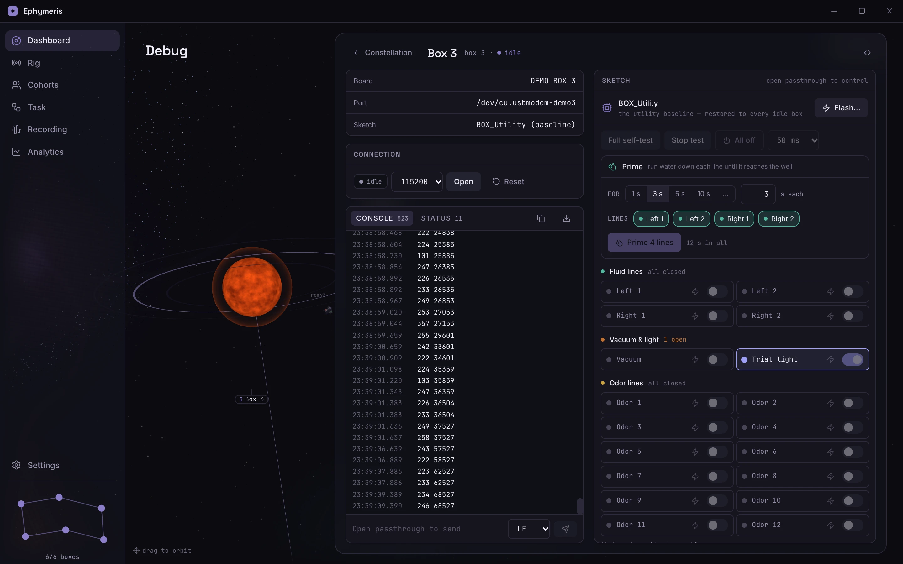

*`BOX_Utility`'s profile rendered in Debug Mode: `button`s, a `select` for the pulse width, and `grid`s whose
section headers count what is open. Prime is the app's own control
([ARCHITECTURE.md](ARCHITECTURE.md#running-a-task-from-debug-mode)), not a profile control.*

`grid` exists because "which solenoid is energized right now" on a fluid rig is a safety readout, not a convenience. A row with neither `toggle` nor `pulse` is rejected rather than rendered as inert decoration. A missing `state` leaves the lamp neutral rather than claiming "closed" — not reported and closed are different facts.

`telemetry` is `{ match?: string (default "STATUS"), fields?: [{key, label?}] }`. The app finds the newest `port.output` line beginning with `match`, parses space-separated `key=value` pairs, and shows the declared fields. **`STATUS` values cannot contain spaces.** Prose belongs in ordinary `Serial.println` lines, which land in the console.

### Identify

```jsonc
{ "identify": { "on": "ON trial_light", "off": "OFF trial_light" } }
```

The two commands that make a box announce itself, used by the utility baseline's `utility.identify` and the guided placement walk ([ARCHITECTURE.md](ARCHITECTURE.md#hardware-utility-baseline)). Keeping them in the profile is what lets the walk work on a rig that signals with a buzzer, another LED, or not at all. **Both halves are required together** — a box that can be lit but not unlit would announce itself indefinitely. Omitting the block is normal: that box simply cannot be asked. For the box utility it is generated, on the rig's first `cue` channel ([The box utility](#the-box-utility)). `identify` is not the same as that channel's row in a `grid`: that is a manual control; this is a contract the app drives on its own.

### Legacy names

A finalized run records `sketch` as a name, and the archive walk resolves it to a profile ([DATA.md](DATA.md#reading-the-archive)). For anything this app wrote, the name is the folder's. Data from earlier software records labels like `"Shape - L"`; `legacyNames` maps them.

> [!IMPORTANT]
> **Declared, never inferred.** Matching `"Shape - L"` to a sketch by resemblance would decode real data with the wrong strobe map and produce confident wrong numbers. The mapping is a one-line assertion by someone who knows, reviewable in a diff.

> [!CAUTION]
> Removing a sketch from the bundle, or deleting a `legacyNames` entry, makes every archived run recorded under that name stop decoding against its profile — **with a warning, not an error**. `tests/test_bundled_library_covers_archives.py` pins the names the lab's real archives contain; keep it current when a new archive appears.

The bundled `GRGL/task.json` declares the lab's historical names (`GRGL_2-Odor`, `GRGL_2-Odor_EZ`, `shaping_GR`, `shaping_GL`, `shaping_GR_EZ`, `shaping_GL_EZ`, `Shape - R`, `Shape - L`). A saved task can re-declare them in its Details card. Only the archive walk reads this key; an unresolvable name is not an error and falls through to inference.

## Task definitions

A **definition** is the operator's document, authored on the Task tab. The app generates the sketch and its `task.json` from it plus this rig's wiring (`sidecar/ephymeris_sidecar/taskdef/`). Wire commands: [PROTOCOL.md](PROTOCOL.md#task-profiles).

```
<data_dir>/tasks/
    <id>.json                  the DEFINITION — the only thing worth preserving
    <category>/<name>/         the GENERATED sketch folder, a build output
        <name>.ino             the bundled GRGL root, copied verbatim
        TaskPins.h             pins, strobes, counts, selection mode
        TaskTrials.h           the trial table
        task.json              an ordinary profile, read by ordinary code
```

The two halves are kept apart so "regenerate everything" can never mean "delete the operator's work". The generated folder is rewritten whole; nothing hand-edited there survives.

### What a definition holds

Four answers, nothing derivable (`taskdef/model.py`):

| Field | Holds |
|---|---|
| `trials[]` | Each row names an **odor channel**, a **response channel**, a **reward channel** and an **onset strobe** (go rows; a no-go row has neither response nor reward), plus its own `rewardTime`, `weight` and required `label`. The onset strobe is still stored on the row — the format, the generator and `profile_hash` are unchanged — but the editor sets it from the line's declared onset ([Onset codes](#onset-codes)) |
| `selectionMode` | `antibias`, `weighted` or `pool` ([Selection modes](#selection-modes)) |
| `stages[]` | The ramp, at least one row |
| `params{}` | Only what **diverges** from the field catalogue's default |

Plus `id`, `name` (becomes the sketch folder and must be a legal folder name), `category`, `legacyNames` and `notes`.

A definition stores **channel names and strobe code names, never pins or numbers.** That indirection makes "odor line 3 means go-left on this rig" an edit to one document rather than to firmware, and lets a rewiring be costed before it is written.

> [!CAUTION]
> **`params` holds only divergences**, for the same reason `settings.taskDefaults` does. Storing the merged set would mean a catalogue change — a corrected range, a better help string — could never reach a saved definition.

**Reward volume and weight live on the row, never in `params`.** The generator reads `reward_time`/`weight` off each `TrialTypeDef` and emits `RW<i+1>`/`PW<i+1>` from the same loop that emits `kTrials[i]`, so a `params["reward_time_1"]` or `params["pool_weight_1"]` is accepted and ignored. The editor offers these only on the row and never writes them into `params` (`isRowOwnedField`, `src/lib/taskdef/lines.ts`). A value on the row is a property of that condition: two conditions paying from one fluid line can pay differently, and deleting the row takes its volume with it.

**There are no presets.** A task is built from scratch. What a preset would seed that matters most is a condition's *name*, which differs on every bench, and a guessed name is wrong for everyone but its author. The lab's real historical definitions survive as test data in `sidecar/tests/fixtures/task_definitions.py`, each transcribed from the sketch it replaced — a generator change that breaks one breaks something the lab actually ran.

### The field catalogue

`taskdef/fields.py` declares every scalar tunable once — wire key, label, unit, range, prose — and every generated profile is built from it, so two profiles differ in values and trial table, never in what a parameter means. Three count-dependent families are not in it, because only the definition knows how many exist: ramp rows, pool weights (one per trial type) and reward volumes (one per go trial type).

> [!CAUTION]
> **`fields.py` is a cross-repo mirror of `TASK_PARAM_LIST` and nothing enforces it at runtime.** A key it declares that the firmware does not parse is sent and **silently ignored**; the session runs on the compiled-in value with nothing reporting a problem.

### Diagnostics

`taskdef/validate.py` reports every problem, not the first. `tasks.preview` returns them as the operator types; `tasks.get` recomputes them, because most depend on the **wiring** and a task saved clean can be broken by a rewiring it never saw.

| Code | Problem | Consequence without it |
|---|---|---|
| `TSK101` | A channel this rig does not have (or an unfinished row) | The pin never fires |
| `TSK102` | A channel of the wrong kind | A valve driven as a sensor |
| **`TSK103`** | **A reward line serving the other well** | The row reads "→ left", the animal answers left, water arrives on the right |
| `TSK104` | A strobe code the vocabulary does not declare | An unlabelled number in the data |
| **`TSK105`** | **Two trial types on one odor line** (one line declares one onset code) | Two conditions, one label, pooled by every analysis |
| `TSK106` | A ramp not strictly ascending after row 0 | `liveStage()` scans down, so the row never engages |
| `TSK107` | A `START` line over the cap | The firmware truncates in silence |
| `TSK108` | No presentable trial — including a table of only no-go types outside pool, since both anti-bias selectors draw a side first | A session that runs nothing |
| **`TSK109`** | **All pool weights zero** (pool), or **a side whose go types all weigh zero** (weighted) | The firmware falls back to a uniform draw while the table says otherwise |
| `TSK110` | A condition with no name | Every readout titles it after whichever channel carried it |
| `TSK111` | Two conditions sharing a name (case- and whitespace-insensitive) | Two curves under one title |
| `TSK112` | An onset code no live metric scores — **derived client-side** in `routes/TaskEditor.tsx` | The condition silently drops out of the diagram |
| **`TSK113`** | **A go condition paying 0 ms** | A dry well every readout scores as rewarded |
| **`TSK114`** | **An onset code that is not its line's declared one** ([Onset codes](#onset-codes)) | Every session records one bottle under another's name |

> [!CAUTION]
> **`TSK103`, `TSK105`, `TSK109`, `TSK113` and `TSK114` produce plausible wrong data rather than a failure.** Read them first.

**Every trial type must be named.** The name is the one thing the trial table cannot derive, and the metric label built from it titles Mission Control's live sparkline, the learning curve and a strategy axis. Two kinds of name meet here and must stay apart: the **rig's channel label** ("sandalwood") belongs to the wiring and never enters the profile; the **row's name** ("Go right") is the condition and does.

A definition with diagnostics **still saves, and still generates a flashable sketch**: a half-finished task must be savable. Nothing refuses to flash it either — the editor says "it will still flash" — so the diagnostics are the operator's warning, not a lock. The exception is `TSK107`, whose line the sidecar refuses to build at mapping ([The length cap](#the-length-cap)). `tasks.save` refuses only a name that collides with a bundled sketch or (case-insensitively) another saved task, because two tasks with one name share a sketch folder and saving one would overwrite the other's firmware.

### Saving and regeneration

A saved task's folder is regenerated on `tasks.save`, at **every sidecar start**, on every `hardware.save`/`hardware.reset`, and on every [vocabulary edit](#editing-the-vocabulary).

- **At start**, because a folder written by an older generator either stops compiling (loud — `TrialType` grew an argument) or sends keys the firmware no longer parses (silent).
- **On a wiring change or a vocabulary edit**, because pins and strobe codes are compiled into `TaskPins.h`.

A wiring change, from the Rig tab's save to the rescan (`_hardware_save`, `_hardware_reset`,
`_rebuild_generated` in `app.py`). A vocabulary edit joins at `_rebuild_generated` after installing its document. Startup runs the same two rebuilds inline, before anything can flash:

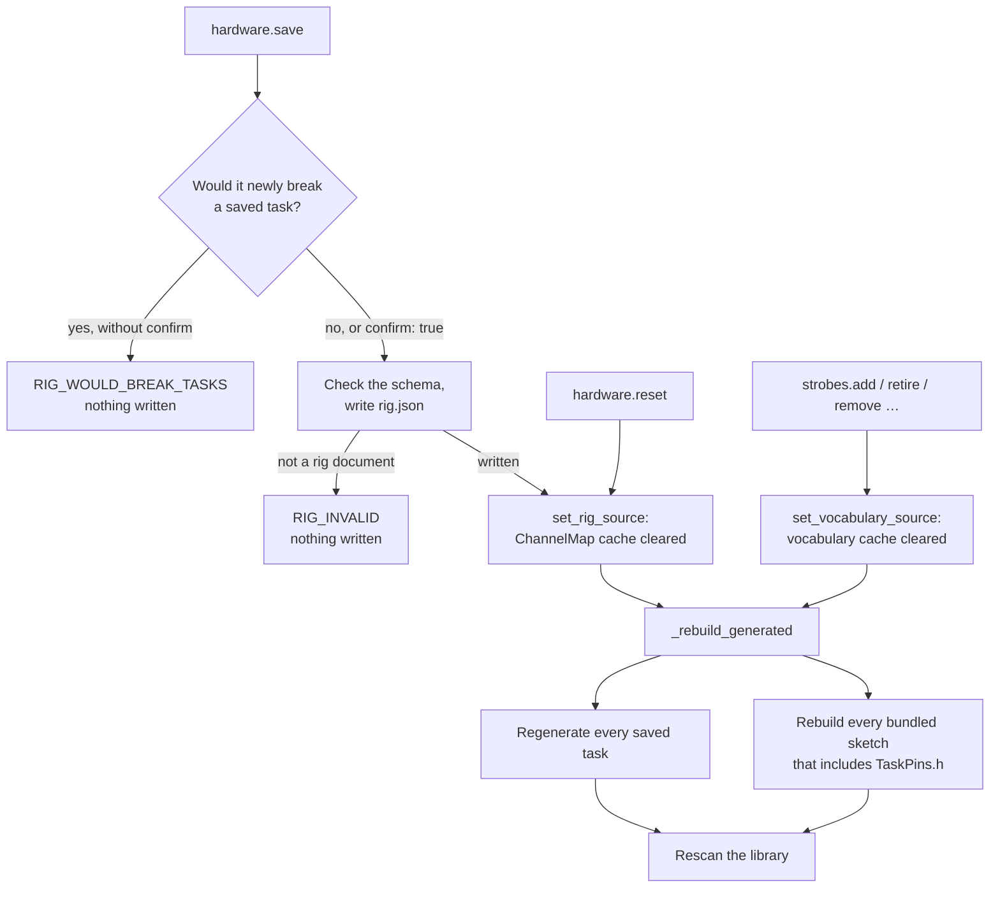

> [!CAUTION]
> **A wiring change or a vocabulary edit must rebuild every stored profile AND every bundled sketch, and the failure is invisible if it does not.** A stale folder still compiles and runs; the only symptom is a valve that never fires or an event decoded under the wrong name. Both rebuilds go through the one call site `Application._rebuild_generated` (rebuild, then rescan), because splitting it into two calls is how one eventually gets forgotten.

### Rebuilt bundled sketches

The shipped sketches compile against `BoxPins.h`'s defaults — the box as built. On a rewired rig that is silently wrong: `utility.identify` lights whatever is on the old trial-light pin and `GRGL_Sim` opens whatever is on the old odor line. So `taskdef/bundled.py` rebuilds them into `<data_dir>/rig/sketches/<category>/<name>/` with a generated `TaskPins.h`, served in place of the original.

| Rule | Why |
|---|---|
| **Opt in by `#include "TaskPins.h"`** in the `.ino` | Read from the source, so there is no manifest to drift. A test asserts every bundled sketch that drives a pin opts in. |
| **Pins and the vocabulary** (`bundled_pins_h`) | No counts or trial table — those are what a task adds — but every live code, since `BoxStrobes.h` defines none. |
| **Always rebuilt from the bundle** | `repin` refuses a source inside the rebuild root, since it clears the target before copying. |
| **On failure the bundled entry stands** | And refuses to compile at `BoxStrobes.h`, loudly — a refused flash with a reason beats firmware strobing numbers the machine decodes differently. |

### The box utility

`BOX_Utility` is the resting firmware on every idle box and Debug Mode's control panel: it latches and pulses outputs, primes lines, and runs a hardware self-test. **Nothing in it describes the box.** The logic is written once in the library's `BoxUtility.h` and host-tested (`extras/host_test/run_box.sh`, against a deliberately smaller fixture box). What the box *is* comes from the rig, through `taskdef/utility.py`, whenever the sketch is rebuilt (every start, wiring change and vocabulary edit, the same triggers as any [rebuilt bundled sketch](#rebuilt-bundled-sketches)).

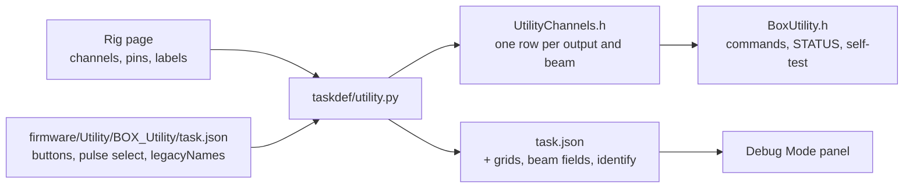

| From the rig | Becomes |
|---|---|
| Every `emitter`, `reward`, `cue` and `vacuum` channel, in declaration order within its kind | An output row: its **channel name** is the command token (`PULSE fluid_2`) and STATUS key (`fluid_2=1`); its **Rig label** names it in the self-test and the Debug Mode grid (a reward line adds its well) |
| Every `engagement` and `response` channel | A beam: a STATUS key, a telemetry field, a prompted step in the self-test |
| The first `cue` | The `identify` pair (`ON trial_light` / `OFF trial_light`) |
| `sync` | Nothing. A pulse on it would be an edge in a recording |

- **Opt-in is the include.** A sketch whose `.ino` includes `UtilityChannels.h` is generated (`wants_utility`), as one including `TaskPins.h` is re-pinned. The shipped `UtilityChannels.h` declares nothing, so a bare build stops at `BoxUtility.h`'s `#error`.
- **The profile is merged, not replaced.** The folder's own `task.json` keeps what does not depend on the box. The generator adds three grids (`fluids`, `aux`, `emitters`) whose rows carry an explicit `kind`, beam telemetry fields and `identify`. `fluids` keeps its id because Prime finds the reward grid by it.
- **The self-test follows the table.** Stimulus lines fire with the vacuum energised, reward lines pulse one by one with their labels printed, each cue blinks, then every beam must read clear at rest and break when prompted. The tally is one check per beam plus the rest check.

### Order is meaning

Two orderings carry meaning and both are emitted from a single pass so they cannot disagree:

- **Odor index.** `Odors[i]` is odor line i+1, and the pins are not monotonic past line 6. Use `ChannelMap.declared_of_kind()`, never `of_kind()` (which sorts by pin) — the wrong one swaps lines, drives the wrong valve and announces it with the wrong onset code while every trial looks correct.
- **Trial-table slot.** Slot i is `kTrials[i]`, is `poolWeights[i]` (wire `PW<i+1>`), and is `rewardTimes[i]` (wire `RW<i+1>`). Reordering the table re-weights a pool task and re-pays every condition, which is why the trial table has no drag handle.

## Rig wiring

The rig's description of itself lives in `sidecar/ephymeris_sidecar/rig/` and `hardware/`. Wire commands: [PROTOCOL.md](PROTOCOL.md#rig-wiring). Box↔board bindings are a different, runtime wiring ([ARCHITECTURE.md](ARCHITECTURE.md#boxes-and-boards)); this one is compile-time input to every generated sketch.

### Three documents

| File | Says | Owner |
|---|---|---|
| `rig/schema/channels.v1.json` | **What a channel means** — `kind`, `well`, `port_slot`, `onset_strobe` | shipped |
| `rig/hardware/<pinout>.json` (selected by `_default.json`; `$EPHYMERIS_PINOUT` for tests) | **Where it is** on this box generation — a literal transcription of the firmware pinout | shipped |
| `<data_dir>/hardware/rig.json` | This rig's own wiring, written by the wiring editor | operator |

A second box generation is a one-file pinout swap, *provided the channel names are the same* — which is what resolving by name buys. The operator's `rig.json` **replaces** the shipped pair rather than merging with it: a merge would bring back a channel someone deleted and could not describe a box that lacks one. Channel kinds are `engagement` (exactly one), `response`, `emitter`, `reward`, `cue`, `vacuum` and `sync` (at most one).

### Registry rules

Which documents become the `ChannelMap` (`registry.channels()`), and what is built from it:

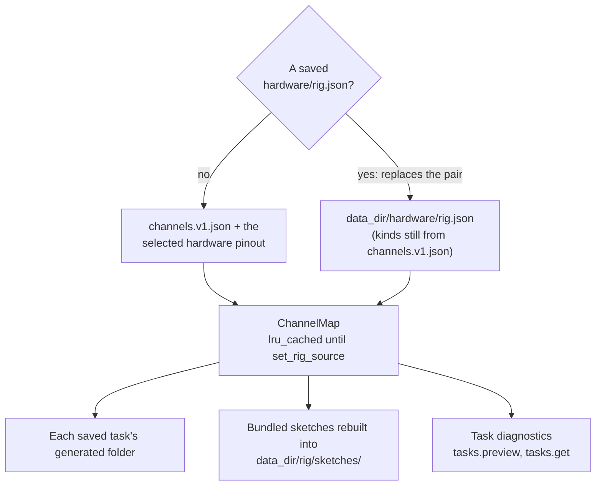

`rig/registry.py` composes the pair into a `ChannelMap`. Three rules that are easy to break:

- **`channels()` is `lru_cache`d and cleared only by `set_rig_source`**, which `Application` calls at construction and after a wiring write. Never hang invalidation off `settings.push`: it fires on every reconnect.
- **`hardware/store.py`'s `default_document()` reads the shipped pair via `shipped_channels()`**, never the wiring in force — otherwise Reset resets to itself. It also keeps declaration order (sorting by pin once re-ordered the odor table on a rig's first save).
- **`ChannelMap.content_hash()` covers only fields that can change a compiled byte** (name, kind, direction, pin, watch bit, well, port slot). A reworded rationale must not move it, or people learn to ignore it. **`onset_strobe` is excluded for the same reason**: the generator emits the code a trial row stores, so the declaration changes what the editor writes, never a compiled byte. A profile names channels, not pins, so a rewiring moves no `profile_hash`; this hash is what records which wiring a sketch was built against (it is stamped into each generated header).

### The wiring page

`/config/wiring` (`routes/RigWiring.tsx`) hosts `RigWiringEditor` and `PinTable` over one document: the page owns the `useRig` session and the selected channel, so clicking a table row and clicking its pin are the same gesture. The board map selects and moves, the inspector rail edits, and the pin table edits nothing.


*The shipped wiring ("as shipped"; a saved `rig.json` reads "this rig's own"). The hash beside it is
`ChannelMap.content_hash()`, the one stamped into each generated header. Odor lines 1–6 sit on the even pins 22–32 and
7–12 on the odd pins 23–33, which is why [odor index](#order-is-meaning) must come from declaration order,
not pin order.*

**Saving previews what it would break.** `hardware.preview` validates as the operator types and reports `breaks` — the saved tasks this wiring would *newly* break, computed by validating each definition under both wirings (`hardware/service.py`'s `impact_of`). `hardware.save` without `confirm` refuses such a change with `RIG_WOULD_BREAK_TASKS`; with `confirm: true` it writes anyway. Rewiring is the operator's call; the app only refuses to let it happen unnoticed. A document that fails validation is never written.

### Wiring rules

A well-formed document describing an impossible box is a successful reply carrying located problems; `RIG_INVALID` is reserved for a document that is not a document. Schema problems and these rules read as one list:

| Code | Problem |
|---|---|
| `RIG101` | The meaning and the pinout halves describe different boxes |
| `RIG102` | A pin the board does not have |
| `RIG103` | Two channels on one pin |
| `RIG104` | A response port with no strobe slot ([Port slots](#port-slots)) |
| `RIG105` | More than one `sync` channel |
| `RIG106` | An odor line with no onset code, one that is not a live onset code, two lines on one code, or an onset on a channel that is not an emitter ([Onset codes](#onset-codes)) |

### The sync channel

`sync` is the seventh kind: one output that pulses on every strobe into a recording controller's digital input ([RECORDING.md](RECORDING.md#the-sync-line)). It is resolved by kind, so a rig may name it anything. `BOX_PIN_SYNC_OUT` is **the one pin always emitted** — `-1` when the rig declares no sync channel — because every other undeclared pin keeps `BoxPins.h`'s default, and here that default would pulse a pin the operator never declared while the app reports the box has no sync line. Since `rig.json` replaces the shipped pair, a rig document saved without a sync channel has none until one is added.

## Strobe vocabulary

Each machine owns one vocabulary document, `<data_dir>/strobes/vocabulary.json`, and it is **the only place a strobe code is defined**. Everything else derives from it:

| Consumer | How it gets the codes |
|---|---|
| Firmware | `TaskPins.h` defines `BF_<NAME> <code>` for every live code, in every generated task folder and every rebuilt bundled sketch (`generate._strobe_lines`). `BoxStrobes.h` defines none and `#error`s without them |
| Task profiles | `load_profile` fills `strobes` from it ([Strobes](#strobes)); `liveMetrics` name their codes |
| The app | `registry.vocabulary()`, over the wire as `strobes.get` and `strobes.updated` |

The first start on a machine seeds the document from the shipped default, `rig/schema/strobe_vocab.default.json`; after that the default is never read there. There is deliberately **no reset**: a reset could drop a code this machine added and then reissue its number. A document that will not read is decoded with the default, logged, flagged on the page, and **every edit is refused** until it is repaired, for the same reason.

The page is `/task/strobes`. It lives on the Task tab rather than Rig because a code is what a *condition is named by* — the trial table's onset picker is its main consumer — while a pin is compile-time input that belongs to the box.


*The band makes the numbering visible: the odor onsets run 101–109 then 114–116, stepping over the
retired 110–113, which is why a code is always looked up by name.*

### Append only

> [!CAUTION]
> **A code is never renumbered and never repurposed, and a name is never reissued with a different number.** Tens of thousands of recorded events carry these numbers; reissuing one silently merges two unrelated event types in any analysis spanning the change.

- A code is **free** when it lies in `code_min`..`code_max` (999 — the host parses three digits), outside `reserved` (0–100), and is neither live nor retired. Free ranges are derived, never stored.
- A code whose emitter is gone but which a **real session** contains moves to `retired` and stays reserved forever. Retired is a third state — neither live nor free — and the generated header does not define it, so firmware that still emits it fails to compile.
- **Removing a code is possible, and the bar is not "unused".** It is "no recorded session has ever contained it", checked against the archive rather than assumed. A code emitted once, to a file that still exists, can never be removed; retire it.

### Editing the vocabulary

Every edit is a `strobes.*` command (`app.py`, rules in `strobes/store.py`, evidence in `strobes/usage.py`). The sidecar computes the blockers (`strobes.usage`) so the page never predicts one, checks them again inside `_rig_gate` when the edit is made, and refuses every edit while a session is running.

| Edit | Refused outright | Needs `confirm` |
|---|---|---|
| **Add** | malformed name (`^[A-Z][A-Z0-9_]*$`, no `BF_`), a name already live **or retired**, a number that is not free, a blank meaning | never |
| **Edit meaning** | a retired code; any change to the name or number (not offered) | never |
| **Retire** | a [port-slot](#port-slots) code; a code the shared firmware library names (every sketch would stop compiling) | a saved task or bundled sketch names it (`STROBE_WOULD_BREAK_TASKS`) |
| **Reinstate** | — | never; the name and number were never reissued |
| **Remove** | **any recorded session contains it** (`STROBE_IN_RECORDED_SESSION`); the retire refusals above | as for retire |

**Where a code is used** has three answers, all computed per request:

- **Firmware:** a regex for `BF_<NAME>` over every source file under the sketch library and the saved-task folders, comments stripped, the generated `TaskPins.h` and any `extras/` folder (a library's host tests) excluded. A hit under `libraries/` is a `library` reference.
- **Tasks:** `impact_of`'s method with a hypothetical vocabulary in place of a wiring — every saved task validated with and without the code, only what is *newly* broken reported.
- **Sessions:** `ArchiveScanner` walks every cohort's data folder (archived ones included) plus every file the database lists, reading each `.json` and each `.tsv` with no `.json` beside it — a crashed or running session is a recorded session. Results are cached per file in `strobe_scan_cache` on (path, mtime, size), so only the first scan reads everything; it publishes `strobes.scanProgress`.

> [!WARNING]
> **The scan sees only this machine.** Another rig's archive, an unmounted drive, a folder no cohort points at — none is checked. The reply reports what was (`scanned`: files, roots, unreachable roots, unreadable files) and the Remove dialog says so. If a code may have been recorded elsewhere, retire it instead.

### Moving codes between machines

Vocabularies are per machine, so a lab with two rigs keeps them in step by **Export** and **Import** on the page (`strobes.export`, `strobes.import`). An import is a **union**: it adds codes this machine lacks, and a code retired there and live here is retired here too (some session there contains it). It never removes a code, and never reinstates one. Any **conflict** — one name with two numbers, or one number with two names — refuses the whole import: picking a winner would relabel one machine's recorded data. `strobes.import` with `apply: false` returns the plan and writes nothing; the dialog shows it before applying. A v2 export (stored `free_ranges`) is read as v3.

### Every declared code is emitted

A declared code that nothing can emit is a name in every picker that no session will contain; an emitted code the vocabulary lacks would arrive as an unlabelled number. The second is now impossible for named codes — the generated header is the only definition, so firmware naming an undeclared code does not compile. The first is checked two ways:

- **The shipped default** is pinned by `tests/test_taskdef.py` against `firmware/`: every `BF_*` the library and bundled sketches name is a live default code, and every default code is either named there or is a stimulus onset (`_<n>_ON`) the trial table can bind to a line. The two deliberate non-emitters in `BehaviorBox.h` — `shutdownHardware()` (runs before the clock is stamped and in utility sketches) and `flashLight()` (one `LIGHTS_OFF` per blink would bury the real light edges) — carry comments saying why.
- **A code added on a machine** cannot be tested; its detail panel says "nothing on this machine names it — no firmware emits it yet" until a sketch does. Add the code first, then write `BF_<NAME>` into the firmware.

### Port slots

`port_slots` maps a slot number to the six codes a response port on it reports with (enter, error, break, exit, reward, reward-stop). There are **two** slots, pointing at the historical `_L`/`_R` names, because `checkResponse()` polls two ports. The vocabulary is the authority; `RIG104` reads it, so the channel schema deliberately does not cap `port_slot` as well. Nothing derives a code from a channel's *name*.

### Onset codes

**An odor line declares the code that announces its onset** — `onset_strobe: "ODOR_3_ON"` on the emitter in `channels.v1.json` and in a rig's own `rig.json` — the way a response port declares its slot. It is a code **name**; the number lives only in the vocabulary. Nothing derives it from the channel's name or position: the onsets run 101–109 and then 114–116, and the emitter pins are not in line order (`generate._onset_macro` records the derivation that was wrong).

- **The editor fills a row's code from its line**, and shows it read-only, so line and code are one choice. One line declares one code, so **a line can carry only one trial type** — the picker lists a line another row holds as disabled, and two rows on one line are `TSK105`.
- **The row still stores `onsetStrobe`**; the generator emits it, and `profile_hash` is unchanged. A stored row that disagrees with its line's declaration is **`TSK114`**.
- **`RIG106`** checks the declarations: every emitter has one, each is a live onset-shaped code (`ONSET_NAME`, mirrored in `src/lib/taskdef/lines.ts`), no two lines share one.
- **A rig saved before the field existed is filled on load** (`hardware/store.py`'s `upgrade`) from the shipped channel of the same name and kind, in memory until the next save. A line the rig added or renamed stays undeclared and `RIG106` asks the operator — nothing guesses.

> [!CAUTION]
> **When `TSK114` appears on a task the lab has run, fix the wiring, not the task.** Changing the row changes the code every *future* session records for that bottle, splitting it from the archive. If the bottle has always been recorded under the stored code, set the line's onset code on the Rig tab to match.

## Live metrics

> [!IMPORTANT]
> This is scientific output, not a UI detail. Implemented in `tasks/metrics.py`; the analysis-side definitions built on it are in [DATA.md](DATA.md#derived-metrics).

### The definition

For each `triggerCode` in an animal's strobe stream, scan forward for the next `successCode` or `alternateCode`, stopping at the next trial-boundary code:

| Found first | Counts as |
|---|---|
| `successCode` | **hit** — numerator and denominator |
| `alternateCode` | **miss** — denominator only ("went to the other side", not "didn't respond") |
| neither, before a boundary | **excluded** from both |

The metric is response-conditional and reward-unconditional: the firmware strobes the well poke the instant it is detected, before any hold check. The rolling window is the last `windowSize` **counted** trials, so `n` legitimately lags the trial count (`n=14` after 20 triggers means six unanswered trials), and a success or alternate code with no trial open is ignored.

### Boundary codes

> [!CAUTION]
> **Boundary codes are the easiest thing here to get silently wrong.** `MetricSet` passes every accumulator the **union of every metric's trigger code**, which is how an odor-3 onset closes an unresolved odor-1 trial. `compute_series(metric, stream, boundary_codes=None)` defaults to **only that metric's own trigger**. Pass the union when replaying a stream, or every unanswered trial stays open and is scored by whatever strobe happens to arrive next.

### Runtime

`sessions/runner.py` creates a `MetricSet(profile)` at box start and offers it every strobe, pushing all metric values in each `session.telemetry` event. Debug Mode's Send START scores through the **same** `MetricSet` (`debug_run.py`); don't write a second scorer. `hits_total`/`counted_total` give Analytics an exact integer ratio. A telemetry metric carries `id`, `value` and `n`, never its label: renderers resolve the label from the profile (`useTaskProfiles`, `metricLabels`), or a row reads `p_correct_2`.

## The START line

### Three layer merge

| Layer | Lives in | Scope |
|---|---|---|
| Profile default | the sketch's `task.json` (for a saved task, its definition) | the task, everywhere |
| Rig default | `settings.taskDefaults[sketchName]` | this machine |
| Per-box override | the session's box mapping | this animal, this run |

For each field the profile declares, the most specific layer that has a value wins. From there the line is
built sidecar-side, and only the seed is added at the click:

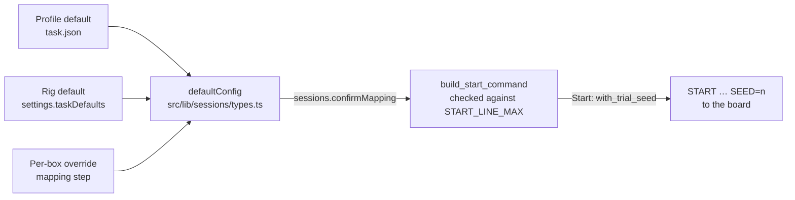

They merge in that order in exactly one place, `defaultConfig` in `src/lib/sessions/types.ts`. **It iterates the profile's fields, not the stored objects**, so a value for a field the sketch no longer declares cannot reach the wire. `taskDefaults` is keyed by sketch folder name (what the session file records as `sketch`) and stores only divergences; it has no editor, and entries keyed by a sketch that no longer exists are inert. The session file records the merged values flat, plus `config_json`/`params_hash` on the run — a reader never needs to know which layer a number came from.

### Building the line

`build_start_command(profile, config)` in `tasks/start_command.py`: `START <wireKey>=<value> <wireKey>=<value> …`, space-separated, order-independent, matching the firmware parser (unknown keys ignored, missing keys keep the compiled default).

- `config` is keyed by `metadataKey`; tokens follow the profile's `config` order.
- A missing key uses the field's default; an undeclared key is ignored, so stale UI state cannot leak.
- An unrenderable value falls back to the default; if that fails too, the token is dropped.
- `bool` → `1`/`0`; `int` → integer; `float` → trimmed; `string` → verbatim (whitespace raises).
- No profile, or no config fields → bare `START`.

It is built sidecar-side at `sessions.confirmMapping` (and by `port.sendStart` in Debug Mode, and by the validator for `TSK107`).

### The length cap

> [!CAUTION]
> **The cap is checked rather than trusted, because the firmware cannot report the failure.** `readLineInto()` truncates an overlong line and drops the rest, so an over-declared profile would run on whichever values happened to fit. `build_start_command` raises instead, naming the length and the limit. `START_LINE_MAX` lives in **two files** — `tasks/start_command.py` and `firmware/libraries/BehaviorBox/BehaviorBox.h` — and `tests/test_task_profiles.py` fails when they disagree.

The budget reserves room for the `SEED` token (`_SEED_TOKEN_BUDGET`), because the config half of the line is built at mapping, minutes before the seed is drawn. A `TaskProfileError` here becomes `TASK_PROFILE_INVALID` with the box, and **the mapping is refused**. A profile that fails to *parse* at mapping is instead treated as profile-less (bare `START`).

### SEED

`SEED` is a reserved wire key no profile may claim.

- **Host → board:** `with_trial_seed` appends `SEED=<n>` at the instant the operator starts **that box** (`tasks/seed.py`). Drawn per box at start, not at mapping, which would give every box in a group the same value and survive Stop → Start. A board that predates the convention ignores the unknown key and seeds itself.
- **Board → host:** a `SEED\t<n>` line right after `START` is captured as `trial_seed`.

The host draws it because the board cannot: opening the port pulls DTR and resets the Mega, so `micros()` at `START` measures only boot time plus a round-trip — a few hundred reachable seeds. The host uses the OS CSPRNG, held to `[1, 2^31 - 2]` (`randomSeed(0)` is a no-op; avr-libc's `random()` state space ends at `2^31 - 2`). Both values are recorded: `host_seed` is what was sent, `trial_seed` what the board reports running on. They differ only on a box still carrying a self-seeding sketch, and the sidecar warns when they do.

## Profile and params hashes

Both are SHA-256 over canonical JSON (`sort_keys`, compact separators), truncated to 16 hex characters, in `tasks/profile.py`.

| | `profile_hash` | `params_hash` |
|---|---|---|
| Input | the serialized profile — `taskName`, `kind`, the full `config` array **including presentation keys** (`group`, `label`, `unit`, `help`, ranges), `liveMetrics` (as codes), `controls`, `legacyNames`, and `telemetry`/`identify` when present — **not** `strobes` | one run's merged parameter values, keyed by `metadataKey` |
| `None` input | n/a | returns `None` — a run with no recorded parameters is not a run recorded with none |
| Stored on | `task_profiles.hash` (content-addressed) | `session_animal_runs.params_hash`, beside `config_json` |

> [!IMPORTANT]
> **Comparability in Analytics is the pair `(profile_hash, params_hash)`.** A profile hash covers only the declaration and is identical across every run of a sketch however it was tuned, so grouping on it alone would pool a shaping run with a full-task run.

What this rests on:

- **Anything in `to_json` moves `profile_hash`**, and a moved hash permanently splits a task's runs in Analytics (old hashes cannot be recomputed). This is why the diagram is derived rather than declared, why the parameter dial's tab fold is the app's rather than the profile's ([Parameter dial](#parameter-dial)), and why `group` must not be re-filed in `fields.py` casually. Editing a saved task — renaming a condition, which renames its metric label — is a new declaration and correctly a new hash. So is a generator change that alters what every regenerated `task.json` contains; earlier runs then group separately and still decode by their own snapshot.
- **`strobes` is left out** because a loaded profile's map is the machine's whole vocabulary: hashing it would split every task's history the first time anyone added a code, and codes are never renumbered, so the map says nothing about comparability. Stored hashes were re-keyed once when this changed (`cohorts/db.py` `_to_v13`, [DATA.md](DATA.md#changing-the-schema)).
- **`to_json` must round-trip through `parse_profile` byte-for-byte.** A finalized session file embeds its profile ([DATA.md](DATA.md#per-animal-files)); if the round trip drifts, a copied run lands under a different hash than its origin.
- **`intan_*` fields are core, not config** (`CORE_METADATA_KEYS`), so they stay out of `params_hash`: two runs of one tuning are comparable whether or not one was recorded.

## Derived state machine

The Task tab and Mission Control draw the trial's state machine. It is **computed from the profile** in `src/lib/tasks/topology.ts` (`taskGraph`) — pure, no React, store or fetch — and laid out by `src/lib/tasks/graphLayout.ts`. Both are pinned by `topology.test.ts` and `graphLayout.test.ts`.

### Why derived

Every behaviour sketch runs one shared `runTrial()`, so the topology is identical across them; what differs is which branches exist, and the declared strobe names say exactly that. Everything gates on **names**, never raw codes.

> [!CAUTION]
> **Never add a `states` or `graph` key to `task.json`.** It changes `profile_hash`, which Analytics groups runs by, and would split every sketch's historical runs from its future ones with nothing to recompute the old hashes.

**Left to right is when the firmware strobes it.** The condition sits at odor delivery, because the odor-on code is strobed after `ODOR_POKE` and the pre-odor hold (the odor is primed earlier, silently). `LIGHTS_OFF` is its own state between withdrawal and answer: it separates presentation from response and is where a real trial rests for seconds.

### The model

`taskGraph(profile)` returns `{nodes, edges, conditions, congruent, usable}`. A node has a `kind` (`state`, `outcome` — coloured to match Analytics' outcome palette — or `abort`), authored `column`/`row` in a 100-wide frame, `governedBy` (config `group` names that tune it), `entryNames` (strobe names that put the live token there), optional `variants` (a collapsed node's conditions) and `settlesToIti`. Edges carry a `kind` and an optional `countKey` naming the `derive.py` count drawn on them.

### Gates

- **`usable`** = `LIGHTS_ON` and any of `WATER_POKE_L`/`_R`/`_NONE`. Otherwise no diagram (prose instead), though `conditions` is still returned.
- **`conditionsOf` — the gate.** Odor names are those matching `ODOR_<n>_ON`. If any is the `triggerCode` of a `liveMetrics` entry, **only metric-named odors survive**; if none is, all declared odors survive unlabelled.
- **`scoredNames`** — names any metric's trigger, success or alternate code resolves to. Gates the `withheld` outcome.

> [!IMPORTANT]
> **A declared code is not a presented condition.** A hand-written profile lists every odor code of the shared vocabulary, and every generated profile declares `WATER_POKE_NONE` because the runner can emit it, while a task presents a few odors and often no no-go trials. So conditions and the withhold arm are gated on a `liveMetrics` entry **scoring** them, not on the code existing. Any change to this derivation must keep handling that.

### Nodes and outcomes

| Node | Gate | Entry names |
|---|---|---|
| `start` "Light" → `await-poke` "Poke" | always | `LIGHTS_ON`, `ODOR_POKE` |
| `lazy` "No poke" (abort) | `LAZY_RAT` | `LAZY_RAT` |
| the odor node | conditions exist | every condition's onset name |
| `abort-pre-odor` "Let go", `abort-sampling` "Left early" | `ODOR_UNPOKE_EARLY` (one code, two edges, told apart by whether an onset preceded) | none |
| `sample` "Unpoke" | always | `ODOR_UNPOKE` |
| `lights-off` "Light off" | `LIGHTS_OFF` (else the answer comes straight off `sample`) | `LIGHTS_OFF` |
| `choice` "Answer" | always | `WATER_POKE_L`, `WATER_POKE_R` |
| `iti` | always | `WATER_UNPOKE_L/R`, `END_CORRECT_ITI`, `END_INCORRECT_ITI` |
| `repeat` (abort) | any abort exists | `INVALID_TRIAL` |

Outcomes, best to worst, each with exactly one inbound edge (never a condition × outcome cross product):

| Outcome | Gate | From | Note |
|---|---|---|---|
| Reward | `FLUID_L` or `FLUID_R` | answer | Settles to ITI on a timer **only** if `WATER_UNPOKE_L/R` are undeclared; otherwise the animal's withdrawal moves the token |
| Withheld | `WATER_POKE_NONE` **and** scored | window | **No `countKey` on purpose**: `derive.py` has no no-go bucket, and borrowing `noResponse` would double-count |
| No hold | `WATER_UNPOKE_EARLY_L/R` | answer | |
| Wrong well | `WATER_POKE_ERROR_L/R` | answer | |
| No answer | always | window | |

With more than one condition on a fan, edge labels and counts are dropped: one figure drawn N times would read as each arm's own.

What `taskGraph` returns for the bundled `GRGL/task.json`, with the same labels. Its two conditions are congruent, so they collapse into one "Odor" node; it declares `WATER_POKE_NONE` but no metric scores it, so there is no Withheld outcome. Dashed nodes are aborts:

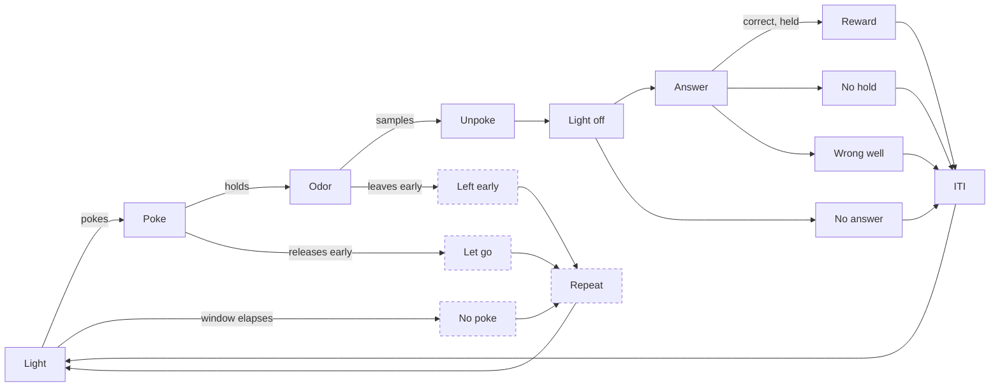

### One condition node

The conditions are **one node carrying `variants`**, drawn as a tick strip, not N nodes. The arms are congruent — same in-edge, same out-edges, same `governedBy`, same downstream, mutually exclusive — so a fan spent O(N) rows of the drawing's scarcest axis to encode a label, and collided with the abort band at four conditions. Height is now constant in the condition count. The node is labelled after its condition when there is one, and generically ("Odor") when it stands for several.

**`armsCongruent` is the guard.** Differing correct wells are still congruent, but a **go/no-go mix is not**: a withhold arm never reaches the wells, so one node would assert a path that does not exist. That profile falls back to a fan (`lane: "fan"`).

> [!CAUTION]
> **`correctWellOf` reads `successCode` only and returns `null` whenever it cannot prove an answer.** Falling back to `alternateCode` prints a confident lie: a no-go type's alternate is "any port will do" (the generator's `_first_enter_code`, `infer.py`'s `slots[0]`), so the fallback renders "Odor 4 → left well" for a condition whose answer is to poke nothing. It is the only figure the diagram *adds* rather than rearranges, so it is the only one that can be false.

**`liveConditionId`** walks the strobe tail newest-first and **stops at a trial boundary** (`LIGHTS_ON`, `INVALID_TRIAL`, the ITI and session codes), so a previous trial's odor never leaks into the current pre-odor phase. It returns a condition, **`unlisted`** (the box announced an odor the profile does not declare — almost always the `liveMetrics` gate having dropped a trial type), or `null` (no odor yet this trial). It **never falls back to `conditions[0]`**: a wrong condition looks exactly like a right one. `unlisted` exists because collapsing turned a missing arm (a visibly missing node) into a nameless absence; the Task tab makes the same finding at edit time as `TSK112`.

### Live token

`liveNodeId` walks the codes newest-first and returns the first node whose `entryNames` contains the code's name; `useLiveNode` scans the last `TAIL` strobes, and the condition lookup a wider `CONDITION_TAIL`, because a correction trial's repeated pokes can push the onset out of the short window. The newest-first walk is what disambiguates `LIGHTS_OFF`, which every path emits: each abort strobes its own code and then `INVALID_TRIAL` immediately after. On error paths the outcome strobe *is* the start of a long silent delay, so an outcome marked `settlesToIti` hands the token to `iti` after `OUTCOME_SETTLE_MS`.


*The same derivation live, on a box's panel. While a condition is in play (`liveConditionId`), the
collapsed node takes that condition's label and lights its tick.*

### Layout

> [!CAUTION]
> **Row placement is measured in the renderer, never multiplied in the model.** `graphLayout.ts` places the abort band at `max(authored depth, deepest measured content + gap)` — a lower bound, never a replacement, or the drawing's proportions would depend on how many groups a profile declares. `measureNode` must stay on the layout side: the chip count comes from the profile's declared groups, which `topology.ts` cannot see, and the live panel draws no chips at all. A model-side measurement would be right for one host and ~48px optimistic for the other, and the symptom is a band sitting inside a chip stack, not an error.

## The Task tab

The Task tab answers *what the animal does*; the Rig tab answers *what this box is*.

### Landing

`/task` (`routes/Task.tsx`) lists this rig's saved tasks (`TaskRow`), with open, **Duplicate**, delete and create; a door to the strobe vocabulary; and `LibraryStatusNote`, since a damaged install is the one thing that stops a task existing at all. Duplicate opens an **unsaved** copy named clear of every saved task (`GRGL copy`, `GRGL copy 2`) and **drops `legacyNames`**: a legacy name resolves to one sketch, so a copy carrying it would silently take over or lose the historical runs it decodes.

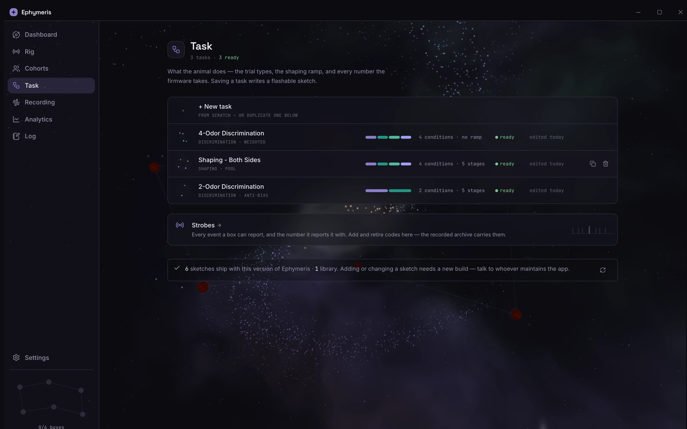

### Editor

`/task/new` and `/task/:taskId` (`routes/TaskEditor.tsx`) is a [telemetry display](ARCHITECTURE.md#telemetry-panels) in one frame: the derived **state machine** front and centre with every **trial type** beneath it, and beside them the **parameter dial** and **trial generation**. The diagram is the fastest check that an edit did what was meant, so it is never off screen. **Every redraw comes from `tasks.preview`**: the diagram is derived from the profile the *current* definition compiles to, and validation needs the wiring, which the frontend does not hold.

- **The header** (`editor/EditorHeader.tsx`): the way back, the task's glyph and name, a **Problems** popover (every diagnostic grouped by where it lives; each one jumps to its row, the dial's Holds stop or the generation panel), the **`START` meter**, the **Details** popover (category, legacy names, notes — `TaskDetailsBody`, opened once on a new task because the category decides the sketch folder), then Revert and Save.
- **One link, read from every end.** A planet, the generation panel or a machine chip lights the states it tunes; hovering a state lights its planet; a trial row or a composition segment lights its condition's tick. A chip or state click opens its home. The machine's own condition list is off here (`conditionRail={false}`): the trial rows are the accessible condition list.
- **The machine draws itself on** left to right on first sight (a `DrawOn` clip wipe, each state fading in as the wipe reaches it), and a small flat dot rides the rewarded trial from start to ITI (`happyPath`, `spinePath`). The dot is not the live token: it has no ring, and it is hidden under reduced motion and whenever anything is lit.
- **The machine has a floor and the page bends around it** (`lib/tasks/editorLayout.ts`). It is never drawn narrower than `EDITOR_MIN_W` and never scaled. **Split**: the machine and trial types in the main column, the dial and generation in an aside. **Stacked** — when the aside would squeeze the machine below its floor, as on the app's minimum window — the aside's panels move under the trial types and the page scrolls. Panels carry `layoutId`s, so they travel between homes on a spring, and the drawing's layout width moves in `WIDTH_STEP`s that glide (`useGlidingWidth`).


### Trial types

`editor/TrialTypes.tsx`, one row per condition: name, **odor line**, answers at, paid from, reward ms, weight (weighted and pool only), go/no-go.

- **The odor line is the one choice.** Its onset code is the line's own, declared on the Rig tab ([Onset codes](#onset-codes)); choosing a line writes both, and the code is shown read-only with its number from the vocabulary. A line another row presents is listed disabled ("in row 2"). A line with no declaration says so and points at the Rig tab; a stored row that disagrees (`TSK114`) shows its code in error colour with a one-click fix and the note that the wiring may be the right thing to change.
- Every cell is a **channel name or code name**, never a pin or index. Row order is the contract ([Order is meaning](#order-is-meaning)); there is no drag handle. A new row is seeded from the last one, on the first free line.
- **Reward volume and weight live on the row** and only there — the generator reads them off the row, so the editor never offers `pool_weight_N`/`reward_time_N` anywhere else and never writes them into `params` (`isRowOwnedField`).
- Each row is **named** (`TSK110`/`TSK111`) and has a second line — its onset code and the contingency in the rig's own labels ("sandalwood → left well, paid from fluid 0 · plumbed to left well"), the one rendering that catches `TSK103` by eye — or its first problem. When the rows would not all fit two lines in the room the panel has, they go to one line and the hovered row's second line shows in a caption below.
- A no-go row outside Pool says it is never presented ([Selection modes](#selection-modes)).

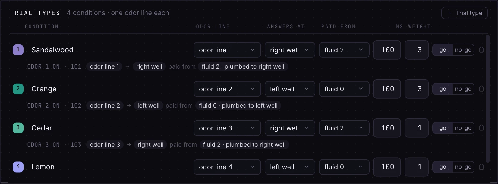

### Trial generation

`editor/GenerationPanel.tsx` makes how the next trial is chosen a choice of its own: the three modes as one control, a sentence on how each draws and a ✓/✗ row of what it does (`lib/taskdef/selection.ts`, a hand mirror of the [selection modes](#selection-modes)), and a **composition strip** — the session the mode would deal, each condition in its colour; two side halves for the anti-bias modes, one bar for the pool, never-presented types as outlines after it.

Below sit the groups that are selection policy: **Anti-bias selection**, **Trial pool** (the block size) and **Correction trials** (the firmware runs correction budgets as policy, and the pool has none). A group the mode never reads folds to one dimmed "not used in pool" line that still opens, so its values survive switching back; a field the mode skips inside a live group (the escalation fields under pool, the no-go window outside it) is dimmed with a note. Table-level `TSK109` shows here.

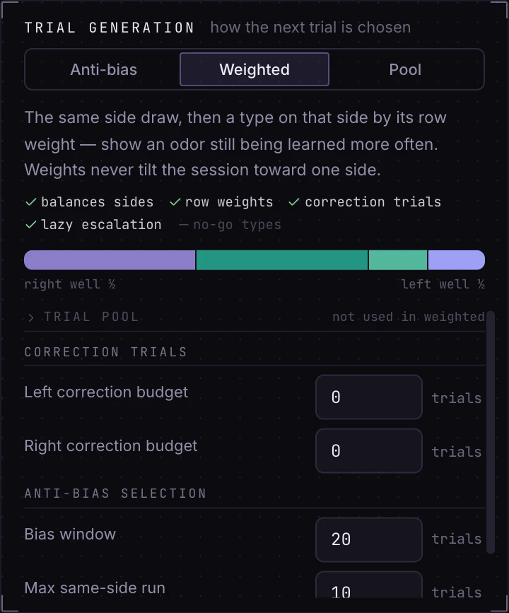

### Ramp and START meter

The ramp is the dial's **Holds & shaping** stop (`editor/StageList.tsx`): one compact row per stage — the trial it engages at, odor hold, well hold, response window, odor port window — with the timeline strip once there is more than one stage. Row 0 has no "engages at"; a new row is seeded from the row before it, never from a defaults table, so no stage appears carrying numbers nobody chose. The header's **`START` meter** shows the built line's length against `START_LINE_MAX` and is never hidden: that cap is the one budget an operator can exhaust without noticing, each added stage costs five tokens, and over the cap the meter says the firmware truncates in silence.

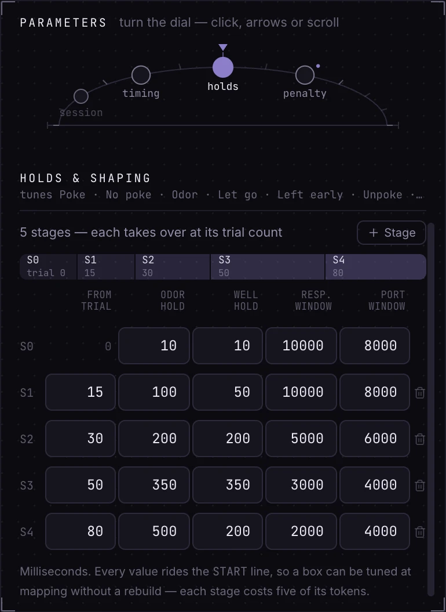

### Parameter dial

`editor/ParameterOrrery.tsx`: the task's parameter categories as planets on an **orbit** — the upper half of a tilted ellipse with a fixed zenith marker. Selecting one (click, arrow keys, Home/End, or one wheel step per gesture) turns the whole orbit on one spring until it sits at the zenith, and its fields slide in from the direction of travel. Geometry is `lib/tasks/orrery.ts`. A planet with values this task pins carries a small moon; one with problems a red ring. Under reduced motion the orbit jumps.

**Stops are tabs, not groups** (`topology.ts`'s `tabOf`, `dialTabs`):

| Home | Groups |
|---|---|
| Dial: Session, Trial timing, Abstention penalty | their own group |
| Dial: Holds & shaping | `Holds & windows`, `Stage n` |
| Trial generation panel | `Anti-bias selection`, `Trial pool`, `Correction trials` |
| Trial rows | `Reward volume` (and the pool weights, which are row-owned) |

> [!IMPORTANT]
> **The fold is the app's, never the profile's.** `group` rides in `ConfigField.to_json` and therefore inside `profile_hash`, so re-filing a field in `fields.py` would give every regenerated `task.json` a new hash and split each task's runs. `QUICK_TUNE_GROUPS` (the groups the mapping step promotes) and the mode scope in `selection.ts` rest on the same reasoning. Anything comparing a tab against a node's `governedBy` folds through `tabOf` first (`nodesGovernedByTab`); the machine's chips fold the same way (`holds`, `selection`).

`settings.taskDefaults` has no editor here or anywhere; a profile's own values are edited on this tab.

## Writing a new sketch

For a firmware author adding a sketch to the bundle with its own hand-written `task.json`. Operators make tasks on the Task tab instead.

### Authoring steps

1. **Write the sketch in `firmware/`**, inside a category folder, with `<Name>/<Name>.ino`. `#include "TaskPins.h"` before `<BehaviorBox.h>` (and ship a `TaskPins.h` that declares nothing) so the app rebuilds it against each rig's wiring and vocabulary — a `BehaviorBox` sketch without it does not compile. A name must not collide with a saved task.
2. **Minimum profile:** `{ "taskName": "My Task" }`. This alone gives a bare `START`, no form, a raw log and no diagram.
3. **Emit only codes the vocabulary holds.** Add any new one on the Strobes page first ([Editing the vocabulary](#editing-the-vocabulary)), then emit `BF_<NAME>`. Don't declare `strobes` in `task.json`; the vocabulary fills it. Which names the vocabulary holds unlocks each part of the diagram ([Nodes and outcomes](#nodes-and-outcomes)); `END_SESSION` is what lets the runner finalize cleanly.
4. **Declare every operator-tunable parameter** in `config`, with `wireKey`s that `TASK_PARAM_LIST` parses, a `metadataKey` you want in the data file, a `group` from `GROUP_ORDER` (unknown groups sort last), and ramped values **per stage**. Mind the [length cap](#the-length-cap).
5. **Declare `liveMetrics`**, one per presented condition, naming its codes. A metric whose `trigger` is an `ODOR_<n>_ON` code is what draws that condition; one scoring `WATER_POKE_NONE` draws the withhold arm.
6. **Optional:** `legacyNames`; `identify` (a baseline candidate); `kind: "utility"` with `controls` and `telemetry` for a Debug Mode tool.
7. **Restart the app** to pick the change up (an installed app gets a bundled sketch change only with a new build).

### Verify

1. Pick the sketch on a session's mapping step. A malformed `task.json` surfaces its parse error there, naming the rule (Debug Mode silently treats a broken profile as profile-less).
2. `cd sidecar && pytest tests/test_task_profiles.py tests/test_taskdef.py tests/test_discovery.py`.
3. Compile with `--warnings all` and run the host tests ([Compiling and the host tests](#compiling-and-the-host-tests)).
4. Flash a box (or run `GRGL_Sim` dry) and watch the live token; if it sticks, check that state's entry names are declared.

### Troubleshooting

| Symptom | Cause |
|---|---|
| Sketch missing from the picker | `.ino` doesn't match the folder name, or the sketch sits at the root; check `skipped` |
| No diagram, just prose | `usable` is false: `LIGHTS_ON` or all three water-poke codes undeclared |
| A condition is missing | No `liveMetrics` entry has that odor's code as its `trigger` |
| "Withheld" never appears | `WATER_POKE_NONE` declared but not scored by any metric |
| Token sticks on Reward for the ITI | `WATER_UNPOKE_L`/`_R` undeclared |
| Token jumps straight to Answer | `LIGHTS_OFF` undeclared |
| Console shows `Strobe <n>` | The firmware emitted a raw number the vocabulary never issued |
| `#error "No strobe codes…"` | Built bare — compile the folder the app generated |
| Compile error naming a `BF_` code | The code is retired or was never added; reinstate or add it on the Strobes page |
| Mapping refused, `TASK_PROFILE_INVALID` | `START` line over the cap |
| A value ignored by the board | `wireKey` not parsed by `TASK_PARAM_LIST` |
| A value reverts mid-session | A ramped value declared once instead of per stage |
| Analytics splits the sketch's history | Something in `to_json` changed ([hashes](#profile-and-params-hashes)) |
| Valve never fires on a rewired rig | The sketch does not include `TaskPins.h`, so it keeps the shipped pins |

### What raises

All raise `TaskProfileError`, surfaced as `TASK_PROFILE_INVALID` ([PROTOCOL.md](PROTOCOL.md#error-codes)):

- **Parse:** a non-object root; missing `taskName`; unknown `kind`; malformed `config` (missing keys, unknown type, reserved `SEED`, a core-field collision, duplicates, a default of the wrong type, whitespace in a string default, non-string `group`/`unit`/`help`, non-numeric `min`/`max`/`step`, `min > max`); non-object `strobes` or a non-integer key (snapshots only); a `liveMetrics` entry missing a required key, or naming a code that is not live; malformed `controls` or `telemetry`; `identify` missing a half; `legacyNames` not a list of strings.
- **Load:** unreadable or invalid JSON (`couldn't read task.json: …`). A missing file is not an error.
- **Build:** the `START` line plus the seed budget over `START_LINE_MAX`.

`tasks.getProfile` returns the error with `sketchPath`. At `sessions.confirmMapping` and `port.sendStart` a profile that fails to parse is downgraded to profile-less (bare `START`); only the length case refuses. `build_legacy_name_index` skips a broken profile so it cannot hide every other sketch's legacy names.

### What degrades silently

| Situation | Result |
|---|---|
| A vocabulary without a name the diagram gates on | Lost diagram states, a stranded live token |
| An odor code no metric scores | Dropped from the diagram (`TSK112` on a saved task; `unlisted` live) |
| Unknown top-level keys or `group` names | Ignored; unknown groups sort last |
| Out-of-range number in the form | Clamped, never rejected |
| Half-typed number in the form | Kept as text with a warning that the box would run on the default |
| A utility profile with `liveMetrics` | Accepted, never scored |
| A `fields.py` key the firmware doesn't parse | Sent and ignored; the compiled value runs |
