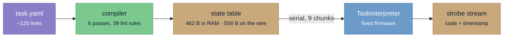
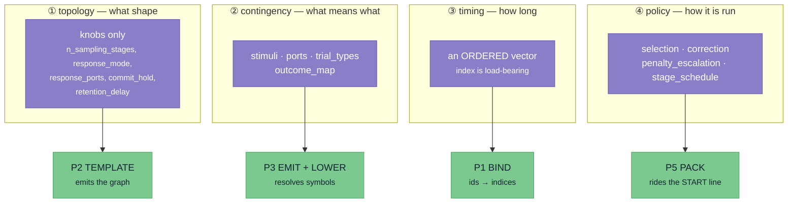
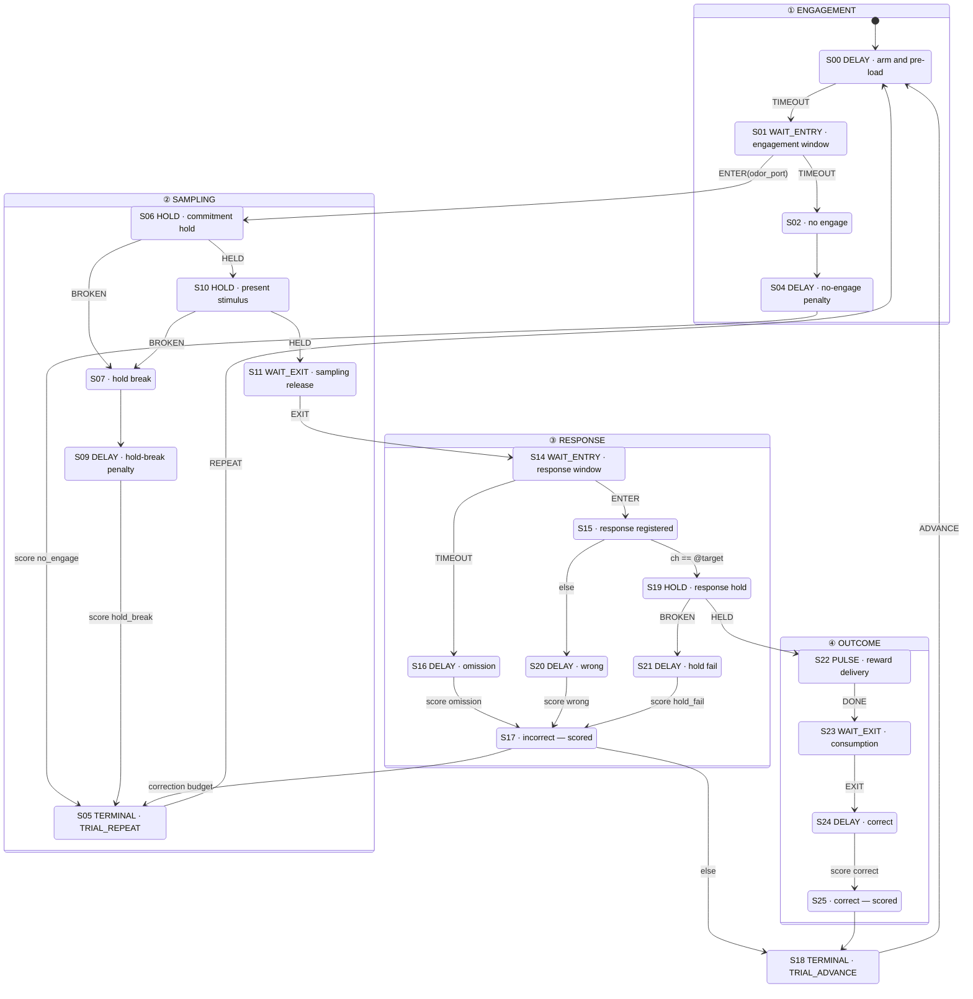
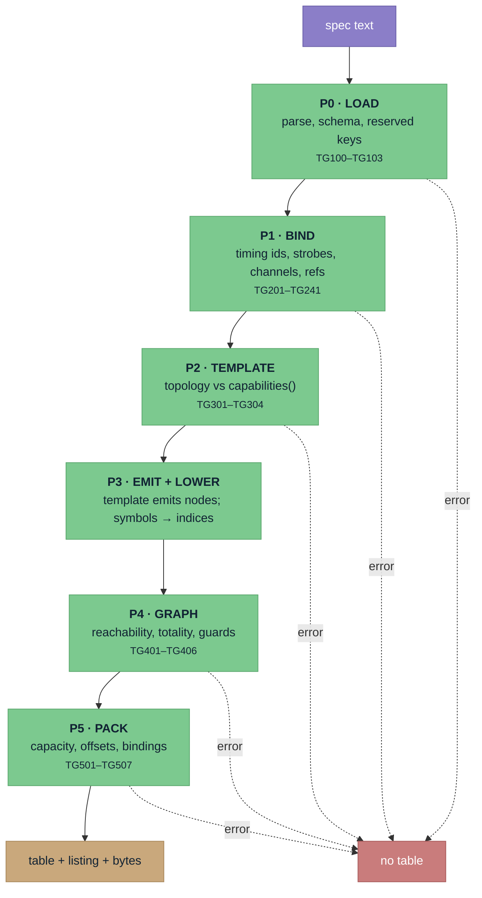
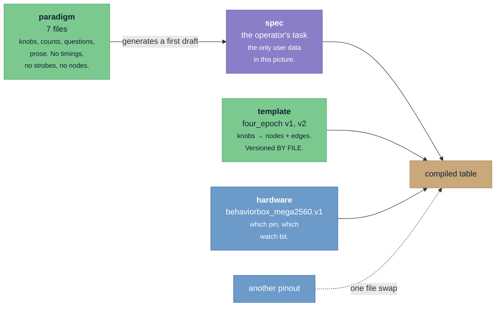
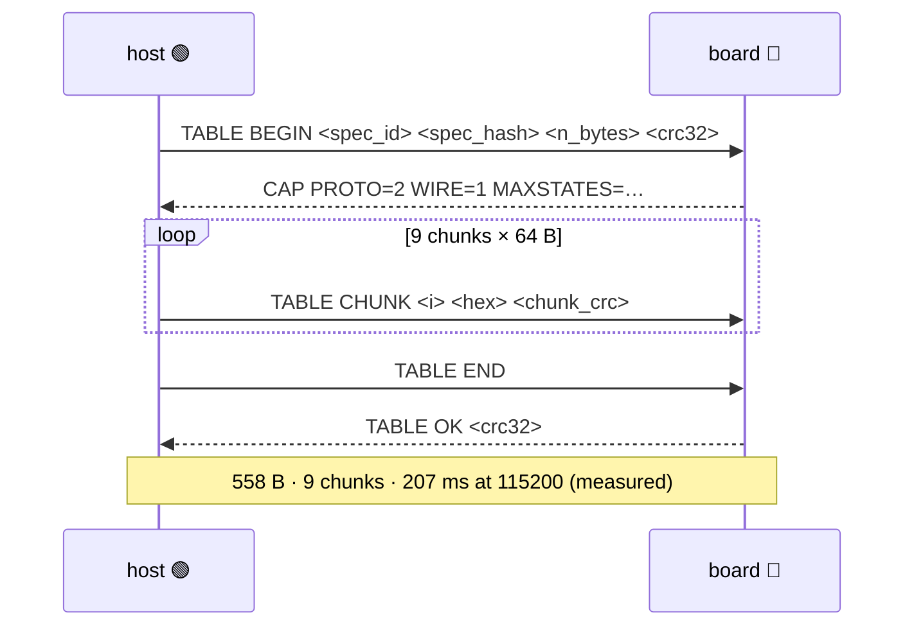

# TaskGraph

**How a behavioural task stops being firmware and becomes data.**

A rodent behaviour task used to be a C++ function. Changing what the animal did
meant editing `runTrial()`, recompiling, and reflashing six boards — and the
resulting behaviour existed nowhere but in that binary. TaskGraph replaces that
with a **declarative spec**: a YAML document describing the task, compiled on the
host into a few hundred bytes of state table that a *fixed* on-board interpreter
walks.

The firmware stops being where tasks live and becomes an engine that runs them.

> [!NOTE]
> **Status.** Verified on real hardware through the app's own wire commands, and
> **not cleared for animal use.** No wire command ties a spec to a session; the
> bench UI carries a permanent strip saying so. See [§8](#8-what-is-proven-and-what-is-not).

---

## Colour legend

Every diagram in this document uses the same four colours. They mark **where a
thing lives**, which is the distinction that matters most when reading this
system:


| | | |
|---|---|---|
| 🟣 | **authored** | the spec, the paradigm files — text a human owns |
| 🟢 | **host** | the compiler, the linter, the templates — Python in `sidecar/ephymeris_sidecar/taskgraph/` |
| 🟡 | **wire** | the packed table, the upload conversation, the strobe stream |
| 🔵 | **target** | the interpreter on the Mega2560 — fixed, task-agnostic |

---

## 1. Tasks stop being firmware



The interpreter never changes when a task does. That single property is what the
rest of this document protects, and it buys three things:

- **A task is reviewable.** The compiled listing is a checked-in text artifact.
  A diff between two versions of a task is a diff you can read, not a firmware
  binary you have to trust.
- **A task is identified.** `spec_hash` travels with the uploaded bytes, so the
  question "what exactly was this animal running" has an answer that is not
  somebody's memory of which build was on the box.
- **A task cannot be structurally invalid.** The set of representable graphs is
  exactly the image of the templates over the topology knobs. There is no way to
  author a state machine with a dead end in it, because there is no way to author
  a state machine at all.

---

## 2. The four layers

A spec has four layers, and they are ordered by **how often they change**.
Topology is the shape of the experiment and changes almost never; policy is
tuning and changes weekly.



### The rule that makes this work

> [!IMPORTANT]
> **A spec never contains a `nodes:` or `edges:` key.** A document carrying one is
> rejected outright by **TG103**, before anything else is checked
> ([D1](taskgraph-decisions.md#d1)).

Layer 1 is knobs. The graph is emitted by a versioned template. This is the
decision the whole design rests on: author-written node lists make invalid state
machines representable, force graph validation to be interactive, and pull the
editor towards a free-form node canvas — the most expensive ordering error
available in this project.

**The one shape-bearing exception** lives in layer 2. `outcome_map` names which
outcome *classes* exist, and the template emits a branch per class. So layer 2
does affect the graph — but only by selecting among branches the template already
knows how to build, never by describing one. **TG302** checks the declared
classes against `capabilities()` in *both* directions: a missing class is a
missing edge, an extra one is a branch nothing routes to.

---

## 3. Six primitives, four epochs

Every node is one of six types. Nothing else is representable, which is what
keeps the interpreter fixed.

| # | primitive | dwell ends when | can emit |
|---|---|---|---|
| 0 | `DELAY` | its duration expires | `TIMEOUT` |
| 1 | `WAIT_ENTRY` | a watched channel is entered, or timeout | `ENTER`, `TIMEOUT` |
| 2 | `HOLD` | the hold completes, or is broken | `HELD`, `BROKEN` |
| 3 | `WAIT_EXIT` | the animal withdraws | `EXIT` |
| 4 | `PULSE` | the pulse width elapses | `DONE` |
| 5 | `TERMINAL` | immediately | `ADVANCE`, `REPEAT` |

**Trigger totality is a linted property.** `TRIGGERS_FOR` in `graph.py` is the
single authority, and **TG401** requires an outgoing edge for every trigger a
node's type can emit — a `WAIT_ENTRY` needs one `ENTER` edge *per watched
channel*, plus a `TIMEOUT`. **TG404** rejects the converse: an edge whose trigger
the node cannot emit would never fire.

> [!NOTE]
> `WAIT_EXIT` deliberately has **no** `TIMEOUT`. It is unbounded by definition —
> both instances (sampling release, reward consumption) wait indefinitely for the
> animal to withdraw, and the firmware has no timeout there either. Bounding it is
> the runtime watchdog's job, not the linter's. **TG901** lists every such state
> so the set is visible rather than assumed.

### A full trial

This is `two_afc` as the compiler emits it, banded into four epochs. The spine
runs down and aborts run right, which is **the same reading order `SpecCanvas`
uses in the app**, so the document and the editor draw the same picture.

Twenty-two of the twenty-six states are drawn. The four omitted — S03, S08, S12,
S13 — are exactly the zero-duration strobe relays of the next subsection, folded
here into the arrow that follows them.



The four bands (`ENGAGEMENT`, `SAMPLING`, `RESPONSE`, `OUTCOME`) are **purely
descriptive**. They drive the listing and the editor's layout and never the
semantics — nothing in the interpreter knows a band exists.

### Two quirks worth knowing

**Paired strobes become zero-duration nodes** ([D2](taskgraph-decisions.md#d2)).
The firmware emits two strobes at one instant in four places, and the *order is
not consistent* between the abort paths and the success path. The model's
invariant is one state, one entry code, one timestamp — so a pair is two nodes,
the second a `DELAY` with `t_zero`. The ordering flip is reproduced naturally by
the template, in one reviewable place.

**A strobe emitted before its guard resolves becomes a branch node**
([D3](taskgraph-decisions.md#d3)). `S15` above emits `@ports[$ch].enter_code`
and *then* branches on whether that port was the target — because the animal's
poke is recorded at the instant it happens, not after the correctness test.

---

## 4. The compile pipeline

Six passes. Each owns a band of rule numbers, and a pass that produces an error
**stops the pipeline** — there is no table.



> [!IMPORTANT]
> **The wire carries spec TEXT, not a parsed dict.** `specs.compile` and
> `specs.save` take the document as a string, because the LOAD pass checks things
> that only exist *before* parsing — a duplicate key, a `on:` that YAML silently
> turns into a boolean ([D12](taskgraph-decisions.md#d12)), an indentation error.
> Handing the compiler a dict would mean the frontend had already done the parse
> whose failure modes the first pass exists to catch.

**Compiles run off-loop, behind a semaphore of 1.** A synchronous compile stalls
the sidecar's 20 Hz output flush and the fsync-per-strobe session write path.

### Where the interesting rules live

| rule | catches | why it is not obvious |
|---|---|---|
| **TG205** | stage rows out of `at_trial` order | the board applies *one* row — the latest reached. Unordered rows do not fail, they apply the wrong one. |
| **TG302** | declared outcome classes ≠ `capabilities()` | checked **both ways**; an extra class is a branch nothing routes to |
| **TG405** | a `(state, trigger)` group without exactly one unguarded default, last | edge resolution is first-match-wins, so a missing default silently falls through |
| **TG503** | edge offsets not monotonic | a node's edge count is *implied* by the next node's offset |
| **TG506** | a runtime-bound strobe that cannot resolve for some port | see [§6](#6-the-byte-table-and-the-wire) |
| **TG507** | a stage row that omits a timing entry another row sets | an omitted entry keeps whatever it had — **not** necessarily the previous row's value |

---

## 5. Paradigm · template · hardware · spec

Four separable things. Conflating any two of them was the state of the world
before the fold, and each pair had a specific cost.



### If you change X, what moves

| you change | what moves | what does **not** |
|---|---|---|
| a **paradigm** file | the first draft of *future* tasks | every existing spec — a spec is a complete document, not a delta |
| the **pinout** | which physical pins fire | every spec, listing and `spec_hash` — channels are named, never numbered |
| a **template** | nothing, ever | a pinned version is never edited. A change copies to a new file ([D14](taskgraph-decisions.md#d14)) |
| a **spec** | that one task | everything else |

**Channels are resolved by kind and by name, never by pin arithmetic**
([D15](taskgraph-decisions.md#d15)). `schema/channels.v1.json` says what a
channel *means*; `hardware/<box>.json` says where it *is*. `ChannelMap` composes
them, and **TG226** rejects the three ways they can disagree — including a
`watch_bit` set that is not dense and 0-based over exactly the watchable
channels, which would silently misaddress `TgNode.watchMask`.

### The eight paradigms

| id | shape | affords |
|---|---|---|
| `blank` | 1 stimulus, 1 port, rewarded — **hidden** | the from-scratch default: the smallest thing that compiles, fixing nothing |
| `two_afc` | 1 stimulus, 2 ports, rewarded | the canonical discrimination task |
| `two_afc_unrewarded` | as above, no reward | probe and extinction blocks |
| `shaping` | 1 port, ramped | approach training; **Shaping-R and Shaping-L are one paradigm** |
| `go_nogo` | withhold arm | response inhibition — the trigger inversion |
| `seq2_retention` | 2 stages + gap | working memory across a delay |
| `seq3_retention` | 3 stages | sequence length as a variable |
| `shaping_no_stimulus` | 0 stimuli | pure port training |

> [!NOTE]
> **A paradigm declares no value.** It names knobs, counts and prose, and asks
> questions. `paradigm.v1.json` rejects timings, strobes and nodes outright, so a
> paradigm file cannot grow into a second spec format. Every value in a generated
> skeleton is read from the template's `capabilities()`, the channel registry, the
> strobe vocabulary, or the operator's own answer.

---

## 6. The byte table and the wire

### Record layout

The layout lives in **one** table (`codegen/layout.py`), which generates both the
Python packer's field widths and the C++ `static_assert`s. A packer with its own
idea of the layout would be a second source of truth for the one thing both sides
must agree on byte for byte.

| record | size | note |
|---|---|---|
| `TgNode` | 8 B | `strobe` is `uint16` — five real codes exceed a byte |
| `TgEdge` | 4 B | trigger, guard, target, effect |
| `TgAction` | 2 B | channel, op |
| `TgTrialType` | 8 B | up to 4 stimulus stages, target, weight, reward line + duration |
| `TgStageRow` | 4 B | `atTrial` is `uint16` |
| `TgPort` | 16 B | six `uint16` codes + an explicit `_pad` |
| `TgStimulus` | 4 B | explicit `_pad`: `onCode` is `uint16` and must land even |
| `TgTimingSet` | 4 B | **the record that proved the hazard** |

> [!CAUTION]
> **`TgTimingSet` measured 3 bytes on AVR and 4 on the host, and compiled cleanly
> on both.** Alignment padding is not a detail the compiler may leave implicit —
> an explicit `_pad` byte is declared wherever a `uint16` must land even. This is
> why the layout table generates the `static_assert`s rather than merely agreeing
> with them.

### The whole file

```
+--------------------------------+
|  header, 24 bytes              |  magic 'TGTB', versions, spec_hash, counts
+--------------------------------+
|  body                          |  12 sections, in SECTIONS order
+--------------------------------+
|  crc32, 4 bytes                |  over everything above it
+--------------------------------+
```

**The header is inside the CRC** because the counts are the most dangerous bytes
in the file: a corrupted `n_nodes` does not produce a parse error, it produces a
table that runs and is not the one anybody compiled.

> [!NOTE]
> **Two byte counts, and they differ.** The listing's *"462 bytes uploaded"* is
> what the table occupies in **board RAM** — the arithmetic that bounds the AVR.
> The **wire payload** for the same task is 558 bytes, because it adds the 24-byte
> header, the trailing CRC, and the watch arrays packed at full extent. Both are
> real; the first is what `TG501` checks against `CAP`, the second is what crosses
> the serial link.

### Runtime bindings

Seven states emit a strobe that depends on the **trial**, not the graph — which
stimulus was presented, which port was poked, which line rewarded. The listing
shows these as `@ports[$ch].enter_code`, but that string never reaches the board.

The selector rides **in the strobe field itself**: real codes are capped at 999
by the wire format, so anything at or above `TG_BIND_BASE` (`0xFF00`) is
unambiguously a binding. No new field was needed. **TG506** then checks that
every binding resolves to a wire-legal code for *every* port or stimulus it could
select — a missing `error_code` on one port is otherwise invisible until an
animal happens to poke it.

### The upload conversation



**The CRC appears twice, on purpose.** The `TABLE BEGIN` line carries it, and
that line has no checksum of its own — so a corrupted BEGIN would have the board
verifying against the wrong number and *accepting a wrong table*. With the value
also inside the payload, the board holds two independent statements that must
agree. A truncated transfer loses the trailing copy; a mangled BEGIN disagrees
with it. Either way the table is refused.

This closes the class of bug the firmware's own `readLineInto()` names: *a lost
token is not an error the board can see, it just runs on the wrong value.*

**`CAP` exists so the host stops compiling its own copy of `MAXSTATES`**
([D11](taskgraph-decisions.md#d11)). Capacity limits are announced at runtime and
checked against the table before upload. A board that emits no `CAP` line is not
an error — it is `PROTO=1`, the legacy bare-`START` path, and the host falls back
([D10](taskgraph-decisions.md#d10)).

---

## 7. What the corpus proved

The model was validated against recorded behaviour before any of it ran an
animal: **917 recorded sessions, 1,548,724 strobe events**, spanning May–July
2026 across five sketches. Replaying each session's strobe stream through the
compiled graph, the model accepts **907 of them (98.9%)**, and **203/203** for
GRGL specifically.

That number is not the interesting part. The interesting part is the failures.

> **[D20](taskgraph-decisions.md#d20) — `INVALID_TRIAL` is the repeat marker, not
> a terminal's strobe.**
>
> The model initially treated `INVALID_TRIAL` as the strobe a terminal emits when
> a trial is scored invalid. The corpus disagreed: it appears on repeats that were
> not invalid, and is absent from some that were. Reading the real streams showed
> it marks the *repeat decision*, not the *scoring*. The model was wrong and the
> data said so.

This is the pattern the corpus is for. A model derived only from reading firmware
reproduces what the firmware's author intended; a model checked against 1.5
million real events reproduces what the boxes actually did. Where those differed,
**the data won** — and then, once corrected, the model became authoritative and
firmware conforms to *it* ([D21](taskgraph-decisions.md#d21)).

### 7.1 The corpus now spans two firmware generations

The conformance patch landed in the firmware repo on **2026-08-03** and the boxes
were reflashed before the **2026-08-04** sessions, which are the first recordings
made by firmware that emits `RESP_OMIT` and orders cue-off the model's way. So the
corpus is no longer uniformly legacy, and no single graph explains all of it:

| generation | graph | GRGL sessions |
|---|---|---|
| **v1** | `tests/compiler/fixtures/grgl_2odor_asbuilt.yaml` (template v1, as-built) | 217 |
| **v2** | the model spec, which firmware now matches | 5 |

`tests/compiler/test_corpus_replay.py` replays each session through the graph of
its own generation, and each generation reaches **every** state of its own graph
independently — pooling them would let the 217 v1 sessions vouch for branches the
model graph has never had driven through it.

> [!CAUTION]
> **Generation is read from the stream, not from the filename or the codes present.**
> A recording carries no firmware version, and its name must never be sorted as a
> string (`docs/data.md` §2). The discriminator is the abort-path strobe *order*:
> firmware emits the behavioural strobe and `LIGHTS_OFF` in the same instant, so the
> two share a timestamp and only their order differs. Splitting instead on *which*
> codes appear looks equivalent and is not — `LIGHTS_OFF`, `WATER_UNPOKE_L` and
> `WATER_UNPOKE_R` stopped being dead on 2026-07-31, three days before the ordering
> changed, so eleven v1 sessions carry the "modern" codes and are still v1. Filing
> them against the model rejects every one of them.

---

## 8. What is proven, and what is not

**Proven on a real Mega2560** (2026-08-03), through the app's own wire commands:
the legacy-sketch flash against the merged bundled libraries; the no-`CAP` probe
and refusal, with the port landing cleanly; `TaskRunner_Dev` flashed and
announcing `PROTO=2 WIRE=1` with the full capacity set at 115200; a table
uploaded — 558 bytes / 9 chunks / 207 ms — with CRC **and** body digest confirmed
(the CRC says the bytes arrived; the digest says they decoded into the right
fields); the baud cache invalidated by a flash. Off-target, the same
sidecar-compiled tables go `TABLE OK` into `tg_board`, the real receiver compiled
for the host.

**Not proven:** that an animal running a compiled task produces the same data as
one running the hand-written sketch. Nothing here has run a behavioural session.

> [!CAUTION]
> **No wire command ties a spec to a session.** `UPLOADING` and `IN_SESSION` are
> illegal in both directions, the bench panel carries a permanent "not for animal
> use" strip, and `utility.benchHold` suspends the baseline-restore machinery
> while that panel is mounted. This boundary is not a UI courtesy — it is enforced
> in the port state machine. It holds until the exit criteria in
> [`specs.md` §8](specs.md#8-what-is-proven-and-what-is-not) are met.

---

## 9. Appendix — the decision log

Twenty-one decisions constrain this design. Each entry in
[`taskgraph-decisions.md`](taskgraph-decisions.md) names the **alternative
rejected** and, where applicable, the **past failure mode it closes**. The linter
is written against that file: a rule carrying `decision: "D4"` puts a link to its
rationale into the diagnostic on the wire.

```mermaid
flowchart TB
  subgraph M["🟣 model"]
    D1["D1 templates emit nodes"]
    D2["D2 paired strobes → nodes"]
    D3["D3 strobe-before-guard → branch"]
    D9["D9 scoring is an edge effect"]
    D14["D14 templates are Python"]
    D18["D18 graph rules see a view"]
    D21["D21 model is authoritative"]
  end
  subgraph W["🟡 wire"]
    D4["D4 strobe: null is explicit"]
    D5["D5 strobes are uint16"]
    D6["D6 durations uint16 + sentinel"]
    D12["D12 the field is `trigger`"]
    D16["D16 layer 4 rides START"]
    D17["D17 TgTimingSet pads"]
    D20["D20 INVALID_TRIAL is a repeat"]
  end
  subgraph H["🔵 hardware"]
    D10["D10 CAP before READY"]
    D11["D11 limits announced"]
    D13["D13 115200, immediately"]
    D15["D15 channels by kind"]
  end
  subgraph P["⚪ process"]
    D7["D7 spec is a sibling artifact"]
    D8["D8 one value, several ids"]
    D19["D19 warnings are pinned"]
  end

  D1 --> D14
  D2 --> D4
  D3 --> D9
  D6 --> D17
  D15 --> D13

  classDef model fill:#8B7EC8,stroke:#6A5FA8,color:#fff
  classDef wire fill:#C9A87C,stroke:#A8875A,color:#123
  classDef hw fill:#6C9AC9,stroke:#4A78A8,color:#fff
  classDef proc fill:#D8D8DC,stroke:#A8A8B0,color:#123
  class D1,D2,D3,D9,D14,D18,D21 model
  class D4,D5,D6,D12,D16,D17,D20 wire
  class D10,D11,D13,D15 hw
  class D7,D8,D19 proc
```



| | # | decision | closes |
|---|---|---|---|
| 🟣 | [D1](taskgraph-decisions.md#d1) | Nodes are emitted by versioned templates, never authored | invalid machines being representable at all |
| 🟣 | [D2](taskgraph-decisions.md#d2) | Paired strobes become zero-duration nodes | firmware's inconsistent pair ordering |
| 🟣 | [D3](taskgraph-decisions.md#d3) | A strobe before its guard resolves becomes a branch | the poke recorded after the correctness test |
| 🟡 | [D4](taskgraph-decisions.md#d4) | `strobe: null` is legal and explicit | a silent transition being indistinguishable from an oversight |
| 🟡 | [D5](taskgraph-decisions.md#d5) | Strobe codes are `uint16` in the table | five real codes exceeding a byte |
| 🟡 | [D6](taskgraph-decisions.md#d6) | Durations are `uint16` with an out-of-band sentinel | firmware's 32767 sentinel, one step from a legal duration |
| ⚪ | [D7](taskgraph-decisions.md#d7) | `task.json` is not extended; the spec is a sibling | `profile_hash` splitting a sketch's history |
| ⚪ | [D8](taskgraph-decisions.md#d8) | One firmware value may map to several timing ids | `t_commit_hold` and `t_sample_hold` needing separate ramps |
| 🟣 | [D9](taskgraph-decisions.md#d9) | Scoring is an edge effect, never a node property | scoring and strobing being forced to coincide |
| 🔵 | [D10](taskgraph-decisions.md#d10) | Capabilities announced before `READY` | a legacy board being indistinguishable from a stalled one |
| 🔵 | [D11](taskgraph-decisions.md#d11) | Shared limits announced at runtime | the host's `MAXSTATES` drifting from the board's |
| 🟡 | [D12](taskgraph-decisions.md#d12) | The outcome trigger field is `trigger`, never `on` | YAML turning `on:` into `true` |
| 🔵 | [D13](taskgraph-decisions.md#d13) | Serial runs at 115200, changed immediately | a slow link making chunked upload impractical |
| 🟣 | [D14](taskgraph-decisions.md#d14) | Epoch templates are Python; the listing is the review artifact | a template DSL becoming a second language |
| 🔵 | [D15](taskgraph-decisions.md#d15) | A channel registry, resolved by kind | pin arithmetic in specs |
| 🟡 | [D16](taskgraph-decisions.md#d16) | Layer 4 rides the START line; `context_schedule` is a hard error | a block boundary with no table representation |
| 🟡 | [D17](taskgraph-decisions.md#d17) | `TgTimingSet` carries an explicit pad byte | 3 bytes on AVR, 4 on the host, clean on both |
| 🟣 | [D18](taskgraph-decisions.md#d18) | Graph rules see a `GraphView`, never a `TaskSpec` | graph rules reaching back into layer 2 |
| ⚪ | [D19](taskgraph-decisions.md#d19) | Warnings are pinned by a checked-in baseline | a new warning being noise instead of news |
| 🟡 | [D20](taskgraph-decisions.md#d20) | `INVALID_TRIAL` is the repeat marker, not a scoring strobe | the corpus contradicting the model |
| 🟣 | [D21](taskgraph-decisions.md#d21) | The model is authoritative; firmware conforms | two sources of truth for what a task is |

---

## Where the code is

| | path |
|---|---|
| compiler | `sidecar/ephymeris_sidecar/taskgraph/` |
| paths — the one place `__file__` is walked | `taskgraph/paths.py` |
| six primitives, triggers, bands | `taskgraph/graph.py` |
| record layout → Python + C++ | `taskgraph/codegen/layout.py` |
| the byte format | `taskgraph/emit/pack.py` |
| lint rules, by band | `taskgraph/lint/rules_{load,spec,topology,graph}.py` |
| paradigms + the skeleton generator | `taskgraph/paradigms.py`, `taskgraph/paradigms/*.yaml` |
| templates (never edited once pinned) | `taskgraph/templates/four_epoch/v{1,2}.py` |
| interpreter firmware | `firmware/libraries/TaskInterpreter/` |
| the app's integration | `sidecar/ephymeris_sidecar/specs/` |

**Authoring a task:** [`creating-a-task.md`](creating-a-task.md).
**The app's editor and the bench:** [`specs.md`](specs.md).
