# Ephymeris user guide

This guide is for the people who run daily behaviour sessions. It covers what to click, what the screen
is telling you, and what never to do. Words in **bold** are labels you will see on screen. Words you may
not know are in the [Glossary](#glossary).

The screenshots come from a demo rig of six boxes running a cohort called *Odor Discrimination 2026*
(animals `remy1` to `remy12`, in Group A and Group B). Your names and numbers will differ.

## Contents

- [Before you start](#before-you-start)
- [A tour of the app](#a-tour-of-the-app)
- [Setting up a cohort](#setting-up-a-cohort)
  - [Create a cohort](#create-a-cohort)
  - [Groups](#groups)
  - [Auto-balance](#auto-balance)
  - [The data folder](#the-data-folder)
  - [Archive and delete](#archive-and-delete)
- [Running a session](#running-a-session)
  - [Configure](#configure)
  - [Boxes](#boxes)
  - [Place the animals](#place-the-animals)
  - [Record](#record)
  - [Run](#run)
  - [Switching groups](#switching-groups)
  - [Ending the session](#ending-the-session)
  - [Leaving set-up and coming back](#leaving-set-up-and-coming-back)
  - [Continue a session from earlier today](#continue-a-session-from-earlier-today)
- [During a session](#during-a-session)
  - [Reading a box tile](#reading-a-box-tile)
  - [The buttons](#the-buttons)
  - [When a box shows ERROR or a board disconnects](#when-a-box-shows-error-or-a-board-disconnects)
  - [Session write failed](#session-write-failed)
  - [Backup pill](#backup-pill)
  - [Do not touch during a session](#do-not-touch-during-a-session)
- [Recording with Intan](#recording-with-intan)
- [Checking a box](#checking-a-box)
- [Looking at results](#looking-at-results)
  - [Where files are saved](#where-files-are-saved)
  - [Analytics](#analytics)
  - [Restarted runs](#restarted-runs)
  - [Exporting a sheet](#exporting-a-sheet)
  - [Rescan Recover and Tidy records](#rescan-recover-and-tidy-records)
- [Keeping the log](#keeping-the-log)
  - [Moving through sessions](#moving-through-sessions)
  - [Writing notes](#writing-notes)
  - [Carry-forward flags](#carry-forward-flags)
  - [What changed and how they did](#what-changed-and-how-they-did)
  - [Saving the log as a PDF](#saving-the-log-as-a-pdf)
- [Troubleshooting](#troubleshooting)
- [Rules that protect the data](#rules-that-protect-the-data)
- [Glossary](#glossary)

## Before you start

**What Ephymeris does.** It runs behaviour sessions for a cohort of animals. It puts the right program
(the task) on each box, starts the boxes, shows you live progress, and saves every event to a data file
for each animal while the session runs. Afterwards, the **Analytics** screen shows how each animal is
doing.

**The rig.** There are up to six behaviour boxes, numbered 1 to 6. Each box has a small computer inside
it, an Arduino board, connected to the lab computer by USB. Inside each box are odor ports, where the
animal pokes its nose to sample an odor, and water wells, where it pokes to answer and gets a drop of
water when it is right. One animal goes into one box.

**A session** is one sitting at the rig: you pick a cohort, place a group of animals in the boxes, run
them, and maybe swap in a second group. Every animal gets its own file. A session has a **prefix** (the
task's short name, such as `2O-Bdisc`) and a **session number**.

**Before your first session, check three things:**

1. **A cohort exists** with animals, and each animal has a box in its group (see
   [Setting up a cohort](#setting-up-a-cohort)).
2. **The boxes are bound.** On the **Rig** tab, each box is linked to its board. Your lab manager
   normally does this once.
3. **A task is saved** on the **Task** tab. Your lab manager normally does this too.

## A tour of the app

The sidebar on the left lists the screens: **Dashboard**, **Rig**, **Cohorts**, **Task**, **Recording**,
**Analytics** and **Log** at the top, and **Settings** near the bottom. At the very bottom is a small star
figure, one star per box, with a count such as *6/6 boxes* under it. A box's star is lit when its board
is connected, dim when it is missing, green while that box is running (or while you are placing an
animal in it), and red when it has a fault. You can check it from any screen.

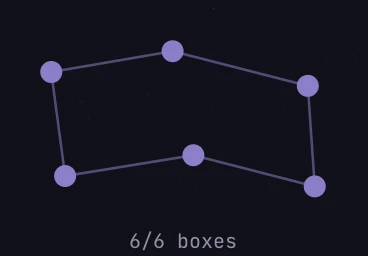

**Dashboard.** The home screen. The big button is **Start a Session** (or **Resume Session** while one is
running). Below it is **Start a Recording**, for sessions recorded with Intan. Below that, the session
dock lists anything that needs you: a running session, a set-up you left half-done, or a session that
ended unexpectedly. The tiles on the right show the rig, the task, your cohorts, the boxes (with how many
are connected), and recent results. The 3D sky behind everything is the rig: click a box's star, or its
row in the **Boxes** tile, to open that box's panel (see [Checking a box](#checking-a-box)).

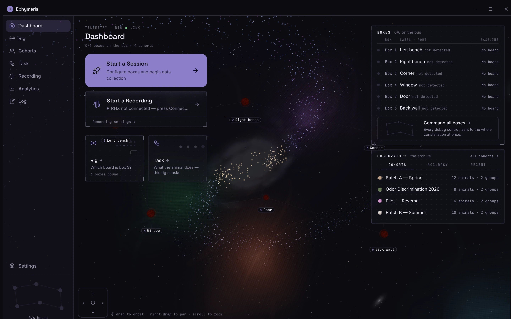

While a session is running, the big button reads **Resume Session** and the dock shows the session: its
name, which boxes are recording, and **Open Mission Control** and **End Session** buttons.

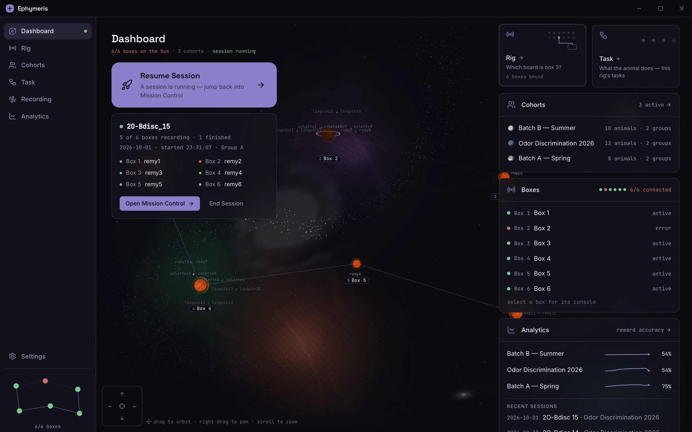

**Rig.** What each box is: which board is box 3, which program idle boxes rest on, and the wiring of
every pin. Usually set up once by the lab manager. The **Boxes** table has each box's label, its bound
board, a **Handshake** column and a **Test** button. **Constellation** chooses how the boxes are drawn
in the sidebar and the Dashboard sky; drag a box to a different star to move it. Under **Utility
baseline**, a chip per box says whether it is **Ready** on the resting program. That program is built
from the rig's wiring, so there is nothing to choose.

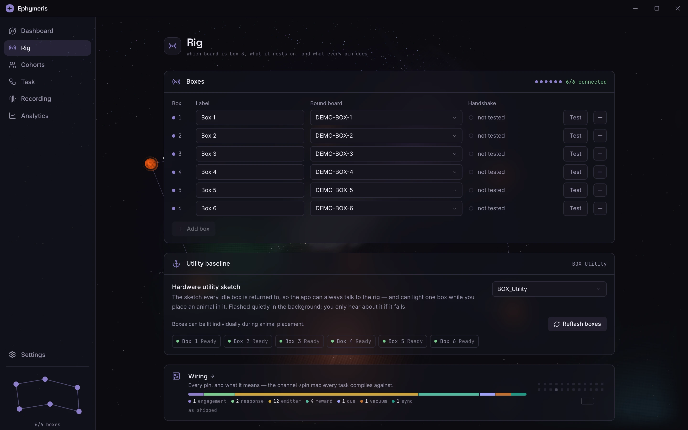

**Cohorts.** Your groups of animals, drawn as planets. Click one to open it, or click the small disc
labelled **New cohort** to make a new cohort. The **Search…** box and the **Show archived** switch are at
the top left.

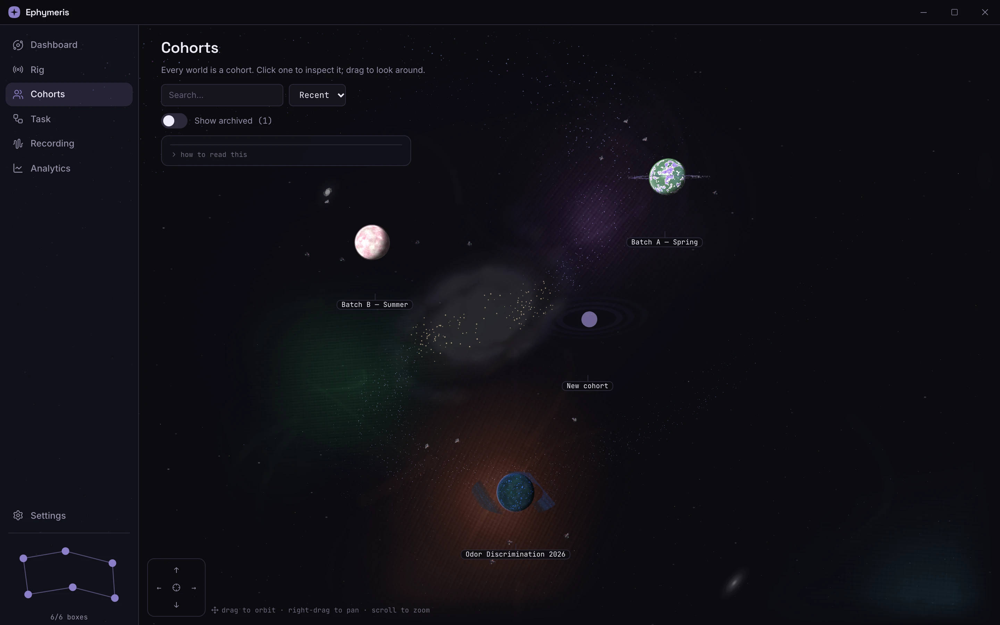

**Task.** What the animal does: the trial types, the shaping ramp and every number the box uses. Saving
a task makes a program that can be put on a box. Usually managed by the lab manager. The landing page
lists each saved task with its number of conditions, its stages and whether it is **ready**.

Opening a task shows everything about it on one screen:

- **The state machine** across the top: every step of a trial, drawn from what the task presents.
  Hover a step to see what tunes it; click it to jump to those settings.
- **Trial types** below it, one row per condition. Pick the **odor line** and its code fills itself in
  — the code belongs to the line and is set on the Rig tab. A line another row already uses is greyed
  out. Name every condition; the name titles its charts.
- **Trial generation** on the right: how the next trial is chosen. **Anti-bias** balances the sides
  against the animal's recent choices. **Weighted** does the same but shows heavier rows more often on
  their side. **Pool** deals the whole session from the row weights at the start and never reacts to
  the animal — it is the only one that presents no-go trials. Settings a mode does not use are greyed
  out, and the bar shows the share of trials each condition would get.
- **Parameters**, the dial above it: click a planet, use the arrow keys or scroll to turn it, and that
  category's settings appear below. **Holds** is the shaping ramp.
- At the top: **Problems** (click one to go to it), the **START** meter (keep it out of the red), and
  **Details** (category, older names, notes). Save when done; a task saves even with problems.

The **Strobes** tile opens the list of every event a box can report and the number it is recorded as.
The band across the top shows all the numbers from 0 to 999: purple ones are in use, grey ones are
retired, and the faint stretches are free. Click a code to see what it means, which programs use it,
and (with **Check the archive**) whether any recorded session contains it.

- **Add code** gives a new event a free number. Once a session records it, that number belongs to it
  for good.
- **Retire** stops a code being used while keeping its number reserved, so old files still read
  correctly. **Reinstate** brings it back.
- **Remove** is only allowed for a code that no recorded session on this computer contains. The app
  checks every session first and refuses otherwise; retire the code instead.
- **Export** and **Import** copy codes between the lab's computers. Do this whenever a code is added on
  one of them, so both give the same number the same meaning.

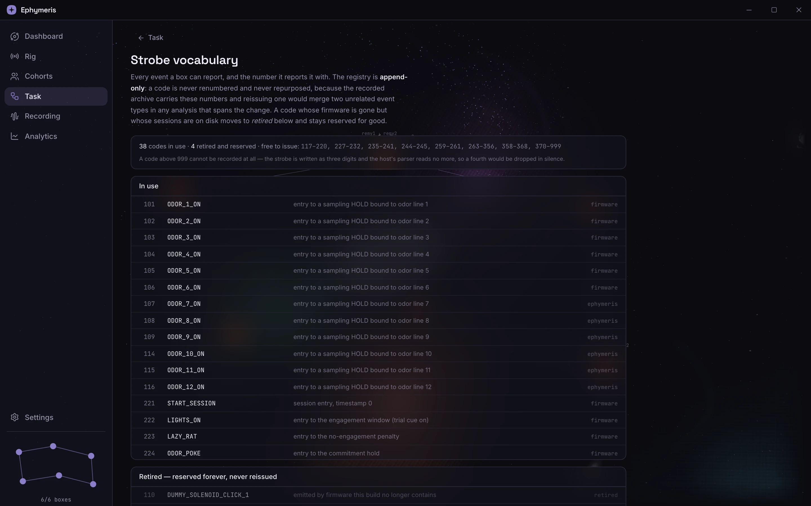

**Recording.** The link to the Intan RHX recording software, which digital input each box is wired to,
and the default recording settings. See [Recording with Intan](#recording-with-intan).

**Analytics.** Results. Pick a cohort from the list to see its sessions, animals and learning curves.
Each row shows the cohort's planet, its animals, groups and cages, how many sessions it has and when it
last ran. The most recently run cohort is at the top.

**Log.** The lab notebook: every session of a cohort on a timeline, with its start, end and elapsed
time, notes anyone wrote, and what changed since the last session. See [Keeping the log](#keeping-the-log).

**Settings.** Where data is saved (**Data directory**), where a backup copy goes (**Backup directory**),
and **Reduce motion**. If no backup directory is set, a note under it says so.

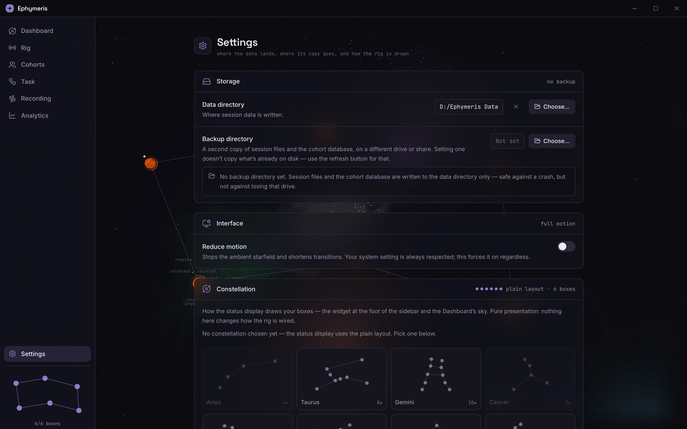

## Setting up a cohort

A **cohort** is a batch of animals that are trained together.

### Create a cohort

1. Open **Cohorts** and click the small disc labelled **New cohort**. A **New Cohort** page opens.
2. Type a **Name**. It must be unique among active cohorts.
3. If no **Data directory** is set in Settings, the page asks for a **Data folder**. Otherwise the folder
   is made for you inside the Data directory, named after the cohort.
4. Add **Animals**. The quickest way is the bulk box: paste a list of names (one per line, or copied
   from a spreadsheet column), or type a pattern like `R- × 8` to make `R-1` to `R-8`. Click **Add**.
   Names already in the cohort are skipped. You can also fill in **Sex**, **ID number** and **Notes**.

   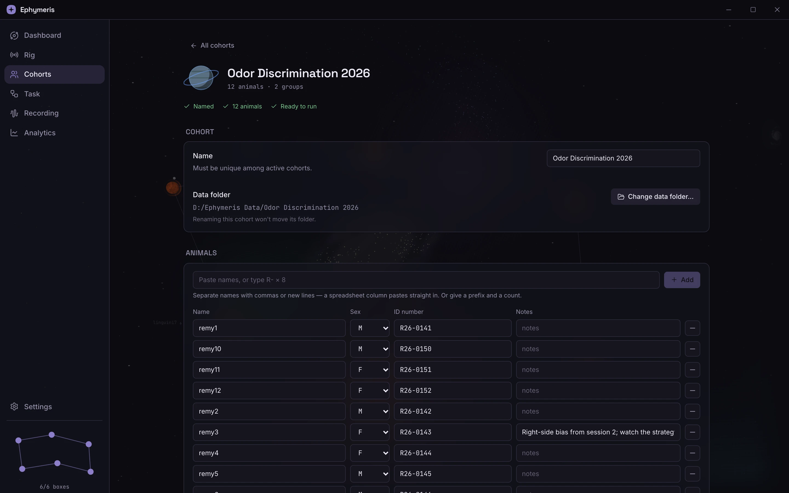

5. Optional: under **Cages & spaceships**, drag cagemates onto a shared spaceship (one per home cage).
   **Add a spaceship** makes another one.
6. Under **Groups & boxes**, drag each animal onto the box it runs in. You can also click an animal, then
   click its box.

   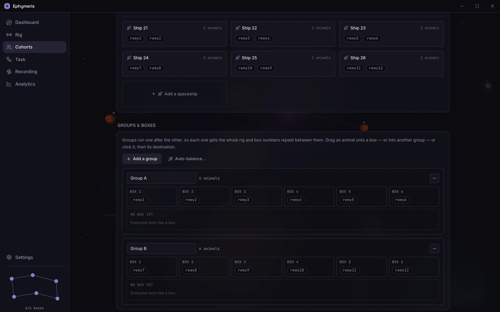

7. Click **Create cohort**. To change an existing cohort later, open it and click **Save changes**.

You can save a cohort before it is finished and fill it in over the next few days. Ticks at the top of
the page (**Named**, the number of animals, **Ready to run**) show what is still missing.

### Groups

A **group** is the set of animals that are in the boxes at the same time. If you have more animals than
boxes, split them into groups: each group gets the whole rig, so box numbers repeat between groups. Use
**Split into groups** or **Add a group**, then drag animals between group cards. A box can hold only one
animal per group. **Fill boxes** assigns boxes to everyone in a group who does not have one. Anyone in a
group without a box is listed under **No box yet**.

Groups have no fixed order. You choose which group runs when you start the session, and again each
time you switch.

### Auto-balance

**Auto-balance…** proposes a complete grouping for you.

1. Under **Split by**, choose **Number of groups** or **Max group size**, and type the number in the box
   beside it.
2. Turn on **Balance by sex** to spread males and females evenly (only offered when some animals have a sex).
3. Click **Suggest grouping**. A preview appears. Nothing is saved yet.
4. Adjust the preview by hand if you like, then click **Apply grouping**, or **Cancel**.

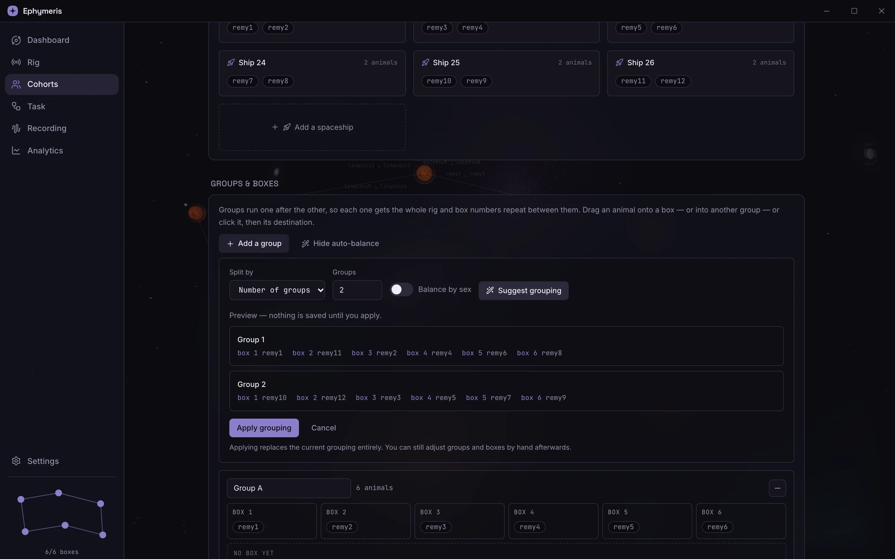

Applying replaces the current grouping entirely. A group can never have more than six animals.

### The data folder

The cohort's data folder is fixed when the cohort is made. **Renaming a cohort does not move or rename
its folder.** To move it, use **Change data folder…**: with **Move existing contents to the new location**
ticked, the files are moved and the new folder must be empty. With it unticked, nothing is moved; the
cohort is simply pointed at a folder that already holds its data.

### Archive and delete

**Archive** hides a cohort but keeps everything. Turn on **Show archived** on the Cohorts screen to see
archived cohorts and **Restore** one. **Delete permanently** is only offered for archived cohorts. It
removes the cohort, its animals and groups from Ephymeris, but **never deletes its data folder**.

## Running a session

A session day at a glance. Each step is explained in the sections below:

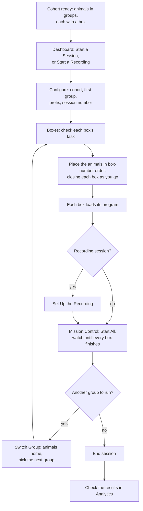
```mermaid
flowchart TD
    cohort["Cohort ready: animals in groups,<br/>each with a box"] --> start["Dashboard: Start a Session,<br/>or Start a Recording"]
    start --> configure["Configure: cohort, first group,<br/>prefix, session number"]
    configure --> boxes["Boxes: check each box's task"]
    boxes --> place["Place the animals in box-number order,<br/>closing each box as you go"]
    place --> flashed["Each box loads its program"]
    flashed --> recording{"Recording session?"}
    recording -->|"yes"| record["Set Up the Recording"]
    recording -->|"no"| run["Mission Control: Start All,<br/>watch until every box finishes"]
    record --> run
    run --> another{"Another group to run?"}
    another -->|"yes"| swap["Switch Group: animals home,<br/>pick the next group"]
    swap --> boxes
    another -->|"no"| finish["End session"]
    finish --> results["Check the results in Analytics"]
```

A row of dots at the top of every step (**Configure**, **Boxes**, **Run**, **Finish**, plus **Record**
for a recording) shows where you are.

### Configure

1. On the Dashboard, click **Start a Session**.
2. Pick the **Cohort**. If an earlier session left a note for this one, it appears under **Before you
   start**. Check it, then click **Resolve**.
3. Pick the **Group** that goes on the rig first. Each group card lists which animal goes in which box.
   Only groups with at least one animal assigned to a box are offered.
4. Pick the **Prefix** (the task's short name). Use **Add a prefix** for a new one.
5. Check the **Session number**. It is filled in with the next number for this prefix.
6. Optional: a **Time limit** in minutes. Each box stops by itself that many minutes after *it* started.
7. Click **Continue**.

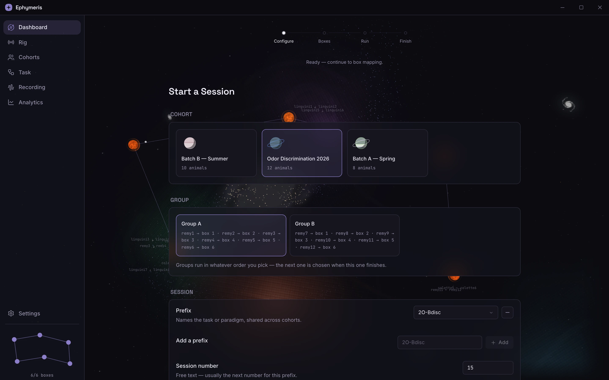

If a warning says this session number already has data from today, you are about to write into the
same folder. That is usually a mistake. If you meant to continue today's session, use **Continue today**
instead (see [Continue a session from earlier today](#continue-a-session-from-earlier-today)).

### Boxes

This step is titled **Confirm boxes**. Each animal in the group gets a card with two pickers: the
**sketch** (the task program) and the **box** it goes in. Changes here apply to this run only.

1. Pick the sketch for each box. A new card starts at **— none —**; the list groups the sketches by
   kind.

   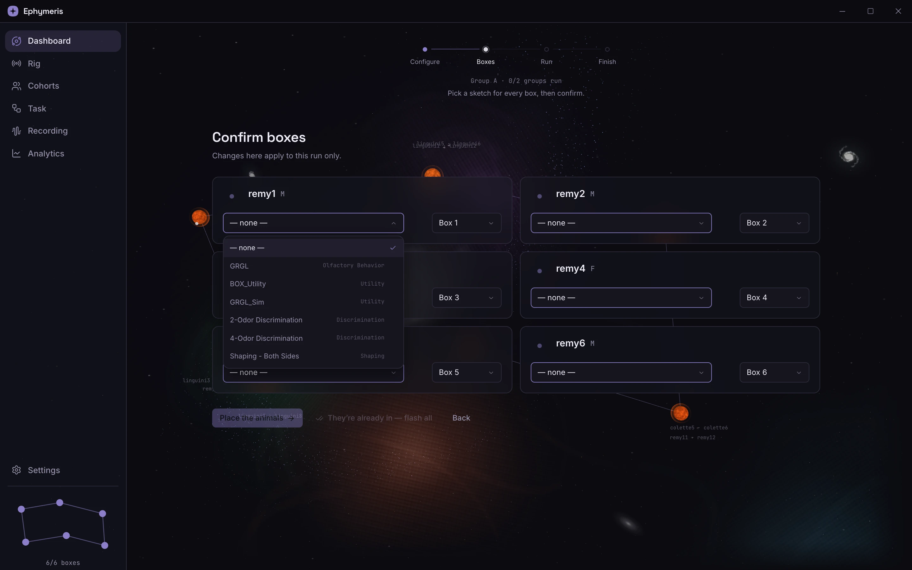

2. Once a sketch is picked, the card shows the task's settings as one summary line with the number of
   parameters. Open it to see **Quick tune** (the values usually changed per animal, per day) and
   **All parameters**.

   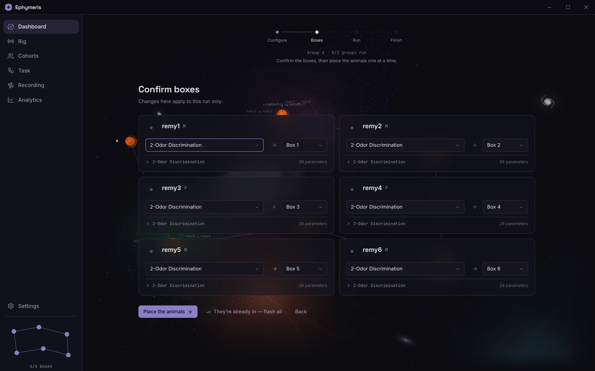

   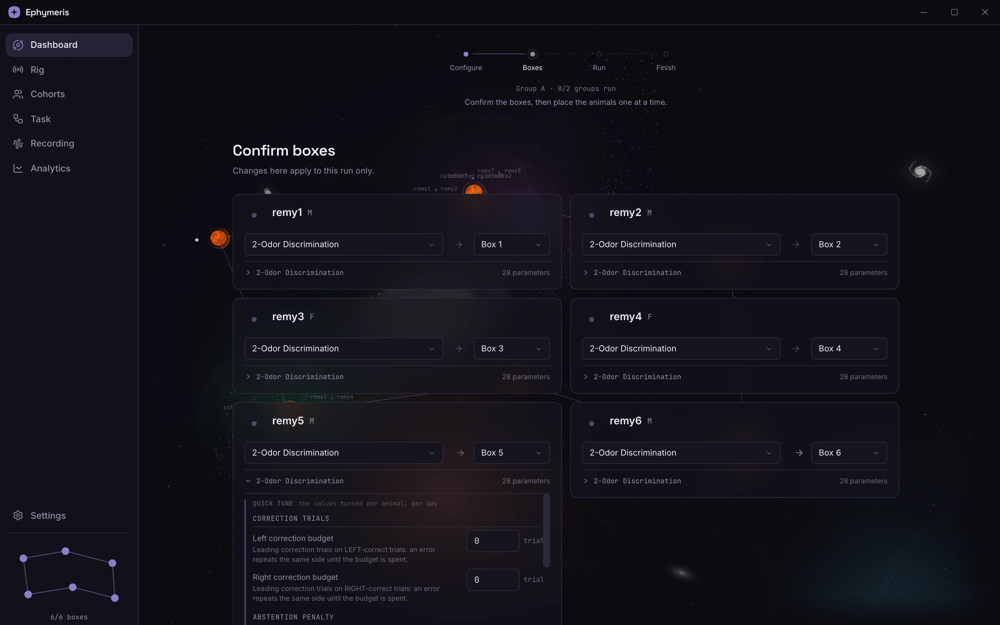

3. If a box shows an error, read its message and click **Acknowledge**. You cannot continue while any
   box is in an error state.
4. Click **Place the animals**. (**Back** returns to Configure.)

### Place the animals

The app walks you down the bench, one box at a time, **in box-number order**.

1. The screen points at one box: *Place this animal in box 1*. If the rig allows it, **that box lights
   up** (*Its light is on, and goes out when you confirm*), and its star in the sidebar turns green. The
   light only confirms the box. Always check the number on the box itself.
2. Put the named animal in that box and close it.
3. Click **Enclosure closed**. That box starts flashing (loading its program) while you fetch the next
   animal.

   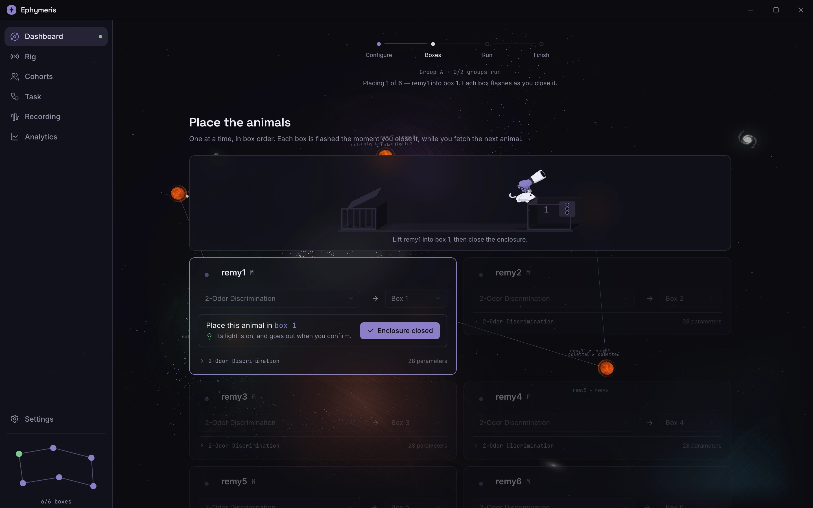

4. Repeat until every animal is in. Boxes already done are marked **flashed** with a tick.
   **Skip this box** passes over one box; **All animals are in** finishes the walk in one click if you
   already loaded them.

   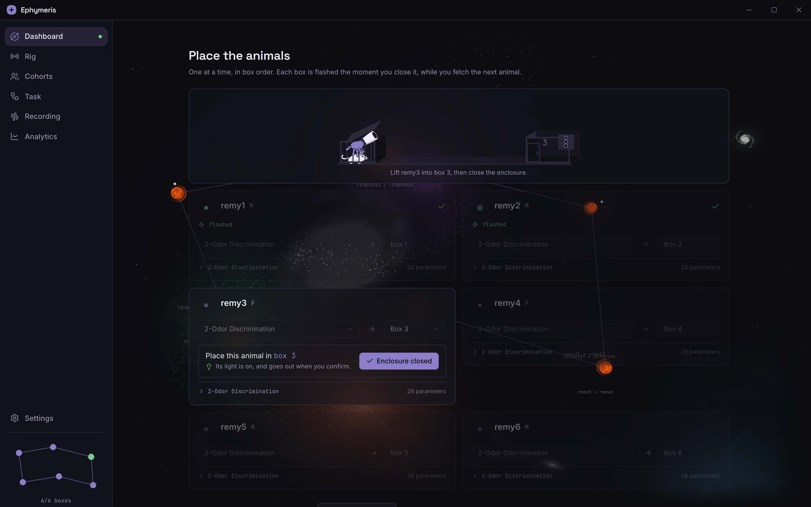

If you loaded the rig before opening this screen, click **They're already in — flash all** instead of
**Place the animals**.

> [!CAUTION]
> **An animal in the wrong box produces a complete, normal-looking data file under the wrong name.**
> Nothing later can detect it. Follow the box order, and trust the number on the box over the light.

When every box has flashed, Mission Control opens by itself (or the Record step, for a recording). If a box fails to flash, click
**Acknowledge** on its card, then **Retry flash**.

### Record

Only a session started with **Start a Recording** has this step, after the boxes have flashed. See
[Recording with Intan](#recording-with-intan).

### Run

On **Mission Control**, click **Start All** to start every box, or **Start** on one box. Before anything
has started, every box tile says `IDLE` and *No live metrics yet*, and the second button reads
**Discard session**. See [During a session](#during-a-session).

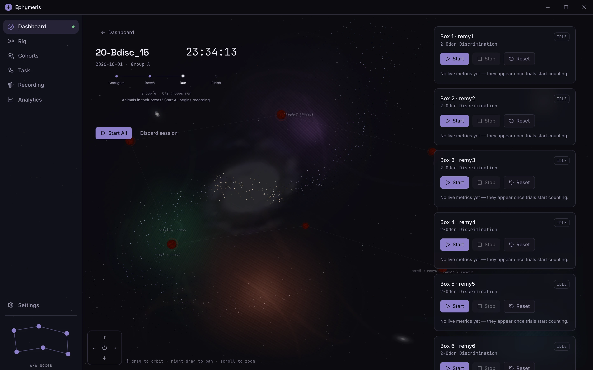

### Switching groups

When every box in the group has finished, a prompt appears with a return checklist: *All boxes
finished — return each animal to its home cage, then pick the next group*.

1. Take each animal back to its home cage and tick it off, or click **All animals are out**.
2. Click **Pick next group**, or **End session** if you are done. You can also click **Switch Group** at
   any time after a group has run.

   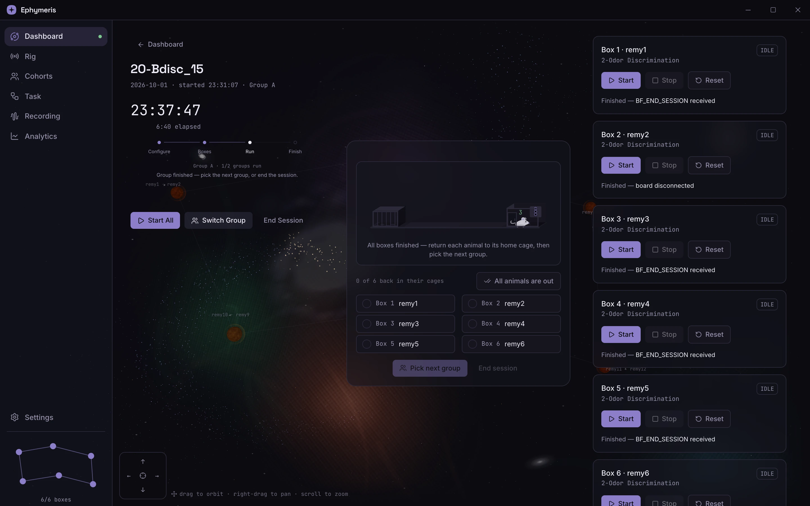

3. On the **Next Group** step, choose **any** group and click **Run this group**. A group that already
   ran shows when it ran (for example *ran 10:42*). Running it again is allowed: it adds new files beside
   the old ones and overwrites nothing.

   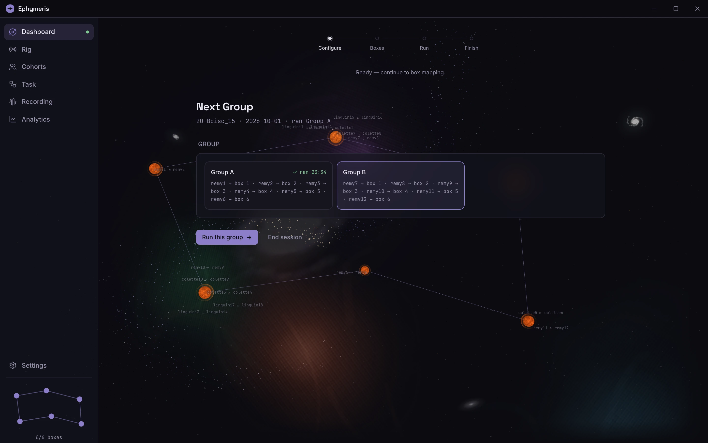

4. You return to the Boxes step for the new animals. Confirm sketches and place the animals again.

### Ending the session

When the last group finishes, a **That's a wrap** window appears. Tick each animal home, then click
**End session**. Under the checklist, **For the log** takes the operator's name, a short summary and one
last note while it is fresh; it is optional and saves as you go (see [Keeping the log](#keeping-the-log)). The files are already saved, and Analytics opens on this session. **Run another group**
is still offered if you need it; **Not yet** closes the window.

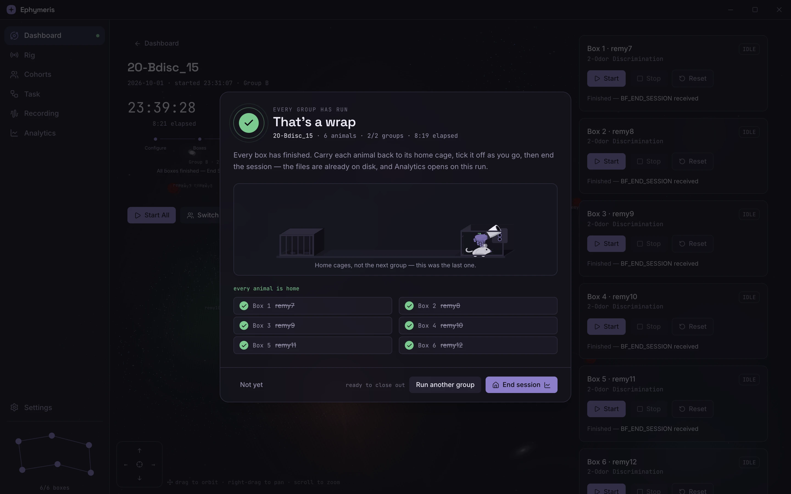

You can also click **End Session** in Mission Control at any time. If no box ever ran, the button reads
**Discard session** and nothing is saved. Only ending the session finishes it; switching groups never does.

> [!IMPORTANT]
> **End Session and Switch Group stop any box still running straight away, cutting its current trial
> short.** If you want every trial complete, click **Stop** on each box and wait for **Finished** before
> ending. (Recording sessions are different: they wait for each box to finish its trial.)

### Leaving set-up and coming back

You can leave any set-up step — to check the **Rig** or a **Task**, say — and nothing is lost. While a set-up
is unfinished, the sidebar's **Dashboard** row reads **Resume ·** and the step's name; click it to return to
exactly where you were, with everything you had filled in. **Back** on the Boxes step the first time, or
**Cancel**, is what throws a set-up away. If the app was closed, the Dashboard dock lists the set-up under
**Set-up in progress** instead.

### Continue a session from earlier today

If the app was closed between groups, or a session was ended too early, you can run another group under
the same session (same folder, same number):

- Click **Start a Session**, pick the cohort, and under **Continue today** click **Continue**, or
- If the Dashboard dock lists the session as **Ended unexpectedly**, click **Continue with another group**.

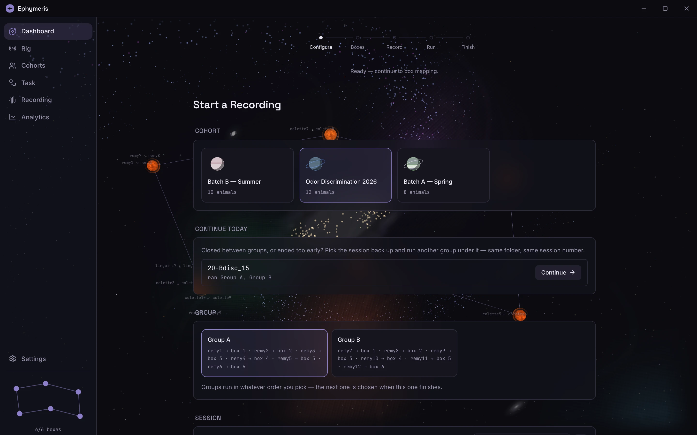

Then choose the group and click **Run this group**.

This only works on the same day. It cannot resume a group in the middle of its run.

## During a session

Mission Control shows the 3D view of the session, a tile for each box, and the session controls. You can
leave it (for example to the Dashboard) and the session keeps running; come back with **Resume Session**.
The line under the session name reminds you how Stop works: *Stop takes effect at the next trial
boundary*.

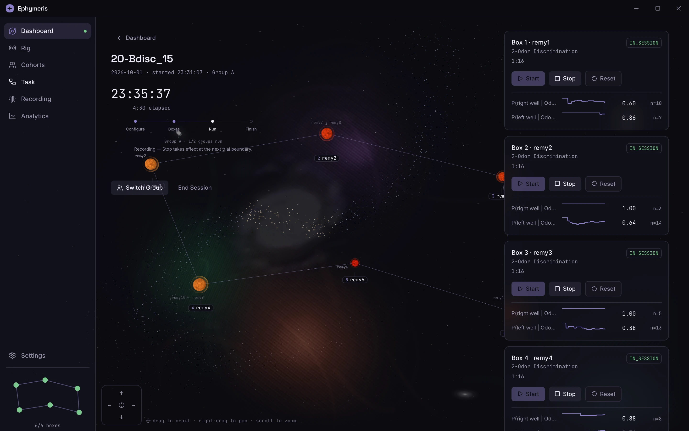

**Taking a note.** Click **Note** under the session controls, or press **n**, and type what happened; it
is stamped with the time and how far into the session it was. In a box's panel, **Note about box 3** does
the same with the note already about that box. If the last session left a flag for this one, it is listed
under the session controls: click **Resolve** once you have dealt with it.

### Reading a box tile

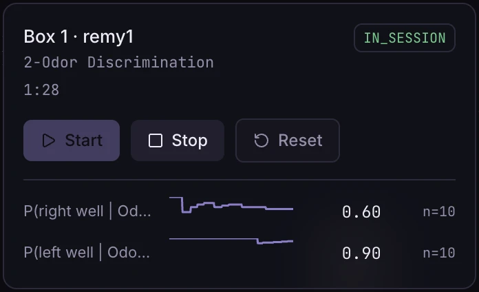

- **Box 3 · Remy** names the box and the animal, with the sketch underneath.
- **The clock** shows time since *this* box started (`12:04`). With a time limit it shows both
  (`12:04 / 30:00`). At the limit it reads *time up — stopping at the next trial boundary*: the box is
  finishing its last trial and will stop by itself.
- **The state chip** shows the box's state. `IN_SESSION` (green) means running. `IDLE` means not running.
  `FLASHING` and `RESETTING` are brief. `ERROR` (red) means something went wrong; hover over it to read why.
- **Live metrics** show how the animal is doing, such as the rolling chance of a correct answer for each
  odor, with a small trend line. They fill in as trials complete.
- **Finished — …** replaces the metrics when the box's run is over, with the reason. *Finished —
  BF_END_SESSION received* means the box ended on its own; *Finished — board disconnected* means it lost
  its connection (see below).

Click a tile, or a star, to see that box's full panel: its **Rolling accuracy**, the **Trial flow**
diagram with the state the box is in right now, a chart of each odor's answers over time, the
**Outcome mix**, the **Live metrics** and the **Recent strobes** (the latest events from the board).
**Back to overview** (or Esc) returns.

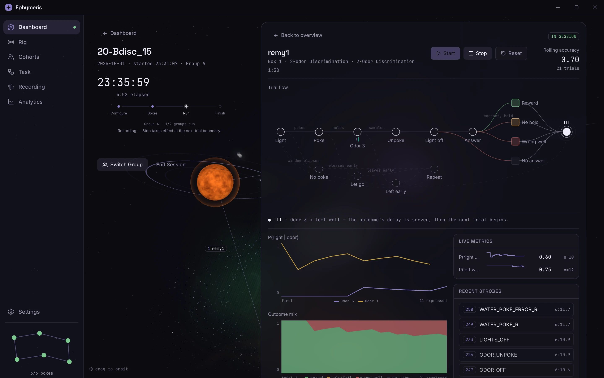

### The buttons

- **Start** starts that box. Starting resets the board, waits for it to be ready, then sends the task.
- **Stop** asks the box to stop. **It stops at the end of the current trial, not instantly. Wait for it.**
  Do not click again or reset it while you wait.
- **Reset** restarts the board. It works only while the box is not running. Use it if a box will not start.

### When a box shows ERROR or a board disconnects

If a board loses its USB connection, or something else fails, that box's run stops at once and its state
becomes `ERROR`. Its tile reads *Finished — board disconnected* (or another reason), and its star turns
red. Everything recorded up to that moment is safe. Other boxes keep running.

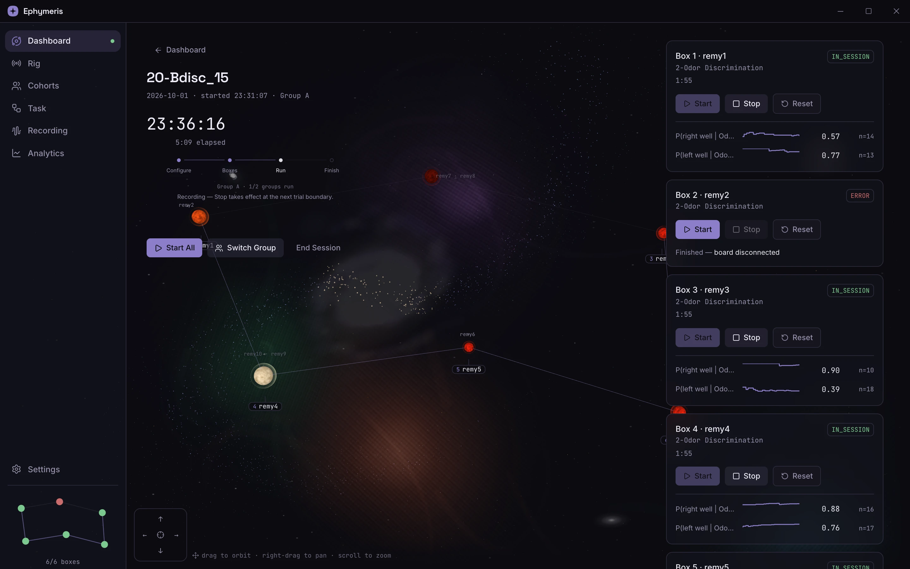

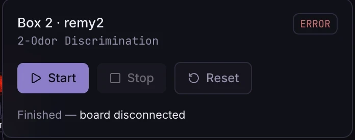

1. Write down the box, the animal and the time.
2. Check the USB cable and that the board's lights are on.
3. To clear the error: go to the **Dashboard**, click that box's star, and click **Acknowledge** in its
   panel. The panel shows the fault under **Connection**, for example *board disconnected or
   unreadable*, with **Acknowledge** beside it.

   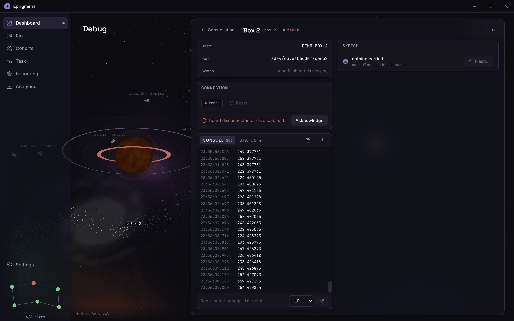

4. Ask your lab manager before restarting that animal. If you press **Start** again, a new file is begun
   for it and the earlier file is kept.

What to do depends on where you see the error. **Reset** never clears it; only **Acknowledge** does.

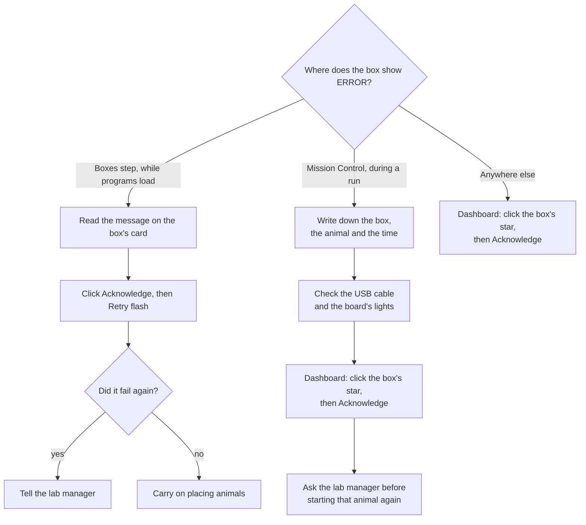
```mermaid
flowchart TD
    where{"Where does the box show ERROR?"}
    where -->|"Boxes step, while programs load"| card["Read the message on the box's card"]
    card --> retry["Click Acknowledge, then Retry flash"]
    retry --> again{"Did it fail again?"}
    again -->|"yes"| tellFlash["Tell the lab manager"]
    again -->|"no"| carryOn["Carry on placing animals"]
    where -->|"Mission Control, during a run"| writeDown["Write down the box,<br/>the animal and the time"]
    writeDown --> cable["Check the USB cable<br/>and the board's lights"]
    cable --> clear["Dashboard: click the box's star,<br/>then Acknowledge"]
    clear --> ask["Ask the lab manager before<br/>starting that animal again"]
    where -->|"Anywhere else"| panel["Dashboard: click the box's star,<br/>then Acknowledge"]
```

### Session write failed

A red line on a box tile that starts **Box N: session write failed** means **that box's data is not being
saved**. The animal is still running. The usual cause is a full or disconnected drive. Tell the lab
manager straight away, and note the box and time.

### Backup pill

The Mission Control header shows **backup ok** or **backup failing**. A failing backup never stops the
session and data is still saved locally. Tell the lab manager after the session.

### Do not touch during a session

- Do not unplug a box or its USB cable.
- Do not close Ephymeris. Closing it stops every box's recording.
- Do not open the data folder and move or edit files.
- Do not change the Rig, Task or Settings screens.

## Recording with Intan

A recording session runs the behaviour and an Intan RHX electrophysiology recording together. Details
for maintainers are in [Recording with Intan RHX](RECORDING.md).

**Once, on the Recording tab** (usually done by the lab manager):

- **Connection**: shows whether Ephymeris is talking to RHX, with **Connect** or **Disconnect**. Leave
  the **TCP ports** at RHX's defaults (5000, 5001, 5002) unless someone changed them in RHX's Remote TCP
  Control dialog.
- **Sync inputs**: each recorded box needs its **Digital input**, the RHX input its sync cable plugs into.
  The tab also says if the rig's wiring has no sync channel yet; the lab manager adds one on the Rig tab.

  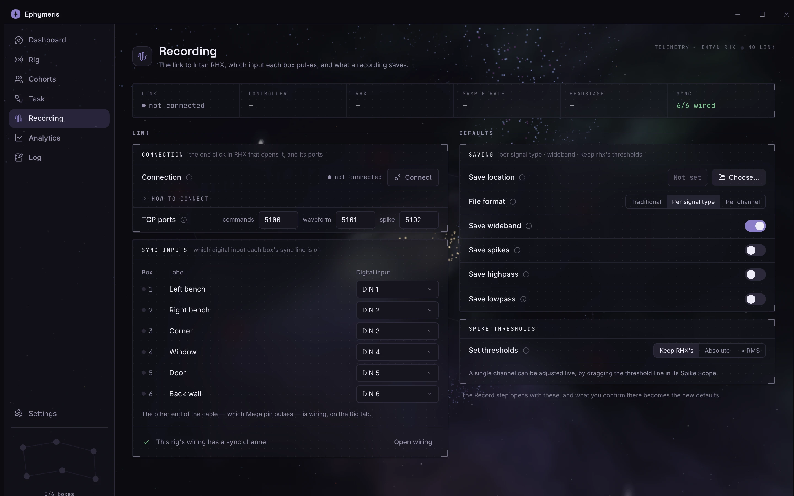

  *This screenshot is from a demo machine whose ports were changed to 5100–5102. RHX's own defaults are
  5000–5002.*

- **Defaults**: where recordings are saved, the file format, which signals to save, and the spike
  thresholds.

  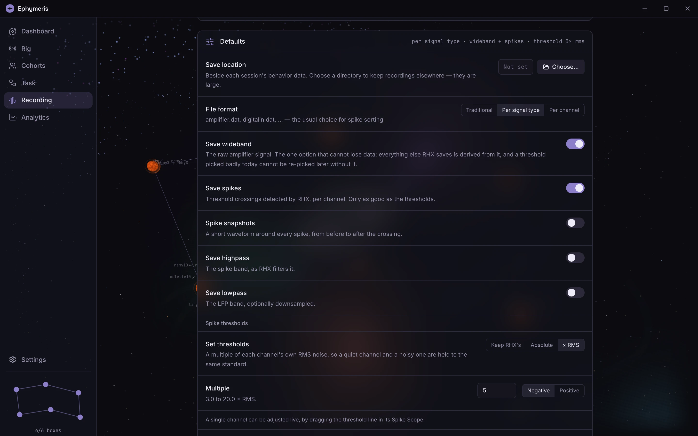

**Each recording session:**

1. Open RHX first. In RHX, open **Network → Remote TCP Control**, go to the **Commands** tab and press
   **Connect**.
2. In Ephymeris, open the **Recording** tab and click **Connect**. You must do this again whenever RHX
   disconnects.
3. On the Dashboard, click **Start a Recording** (not Start a Session). Its subtitle tells you whether
   RHX is connected.
4. Configure and place the animals as usual. After the Boxes step comes **Set Up the Recording**:
   - **Readiness** lists anything still missing. Each line says what to fix.
   - **Saving** shows where the recording will be saved and **Using your defaults**. Click
     **Edit for this session** to change them. A yellow line warns if the path contains a space.
   - **Boxes**: for each box choose **Record** or **Behavior only**, its port and channel range, and
     optionally a probe map.

   

5. Click **Configure RHX and continue**. Nothing is sent to RHX before this.
6. In Mission Control, **Start All** starts the RHX recording first. If RHX cannot start, no box starts.
   A **Recording** panel shows **REC**, the file being written and a **Sync check** table: for each box,
   how many sync pulses were **matched** to events, **missed**, or arrived as **stray** pulses. *no pulses
   arriving* means the sync cable is not reaching RHX.
7. Each recorded box's tile shows its port, digital input and channels, and has **Spike Scope**, **PSTH**,
   **ISI** and (with a probe map) **Probe map** buttons. Each opens its own window, which you can drag to
   another monitor.

   

8. **End Session** and **Switch Group** let each box finish its current trial first (up to 45 seconds).
   The panel shows **ENDING**, *Finishing the trials in flight*, and which boxes are still finishing;
   **End now** stops RHX without waiting.

   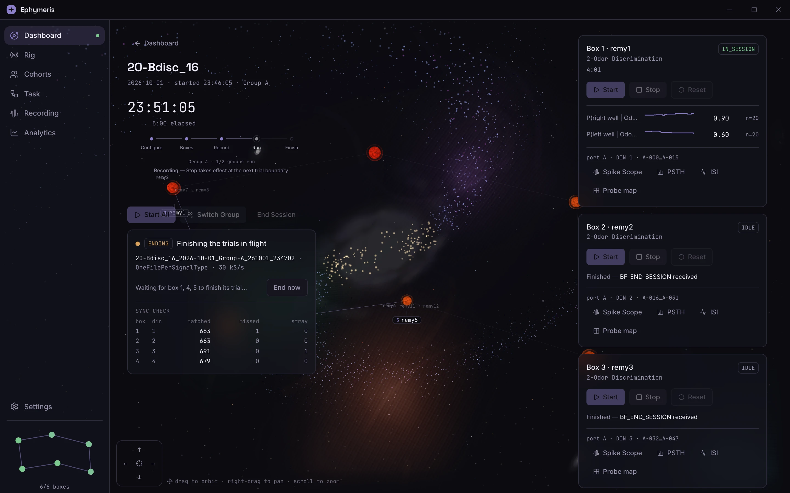

The four live windows:

| Spike Scope | PSTH |
|---|---|
| 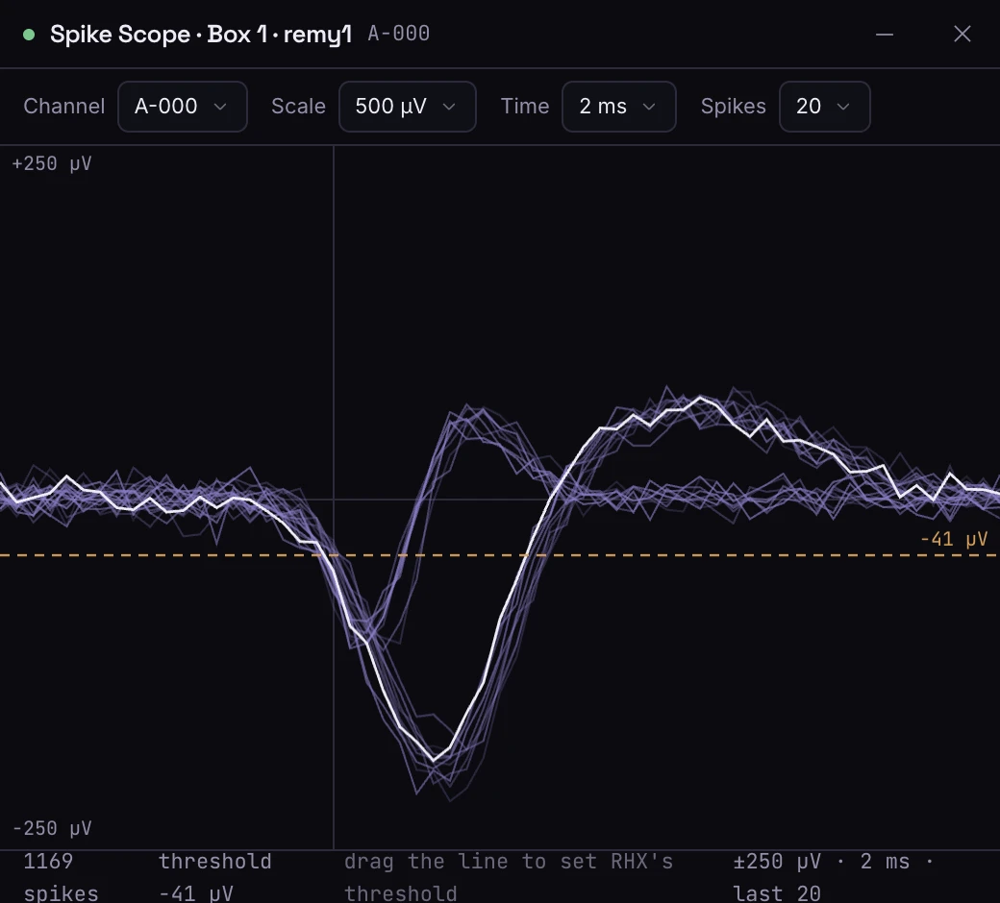 | 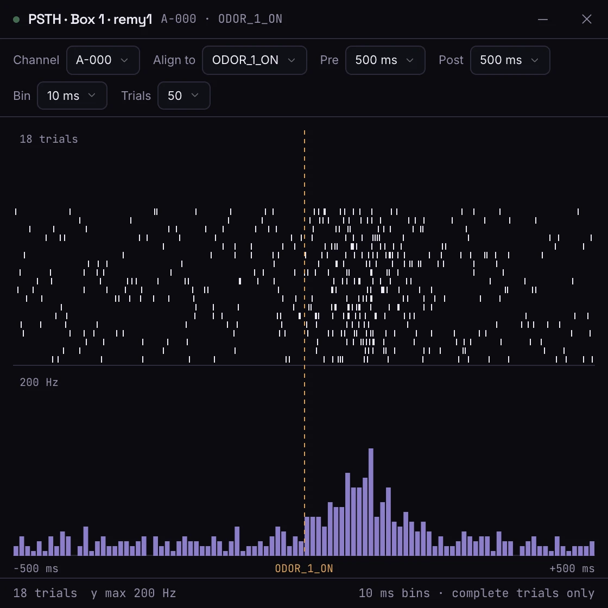 |
| **ISI** | **Probe map** |
| 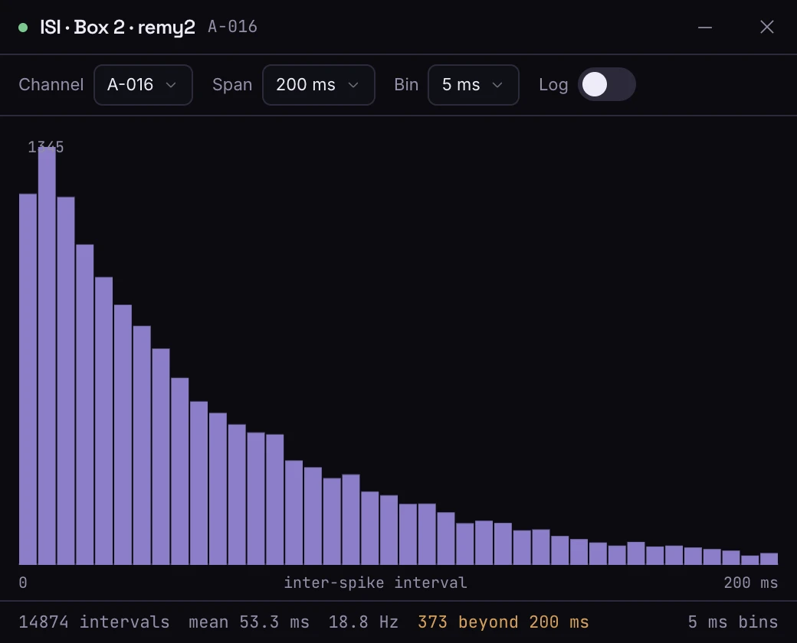 | 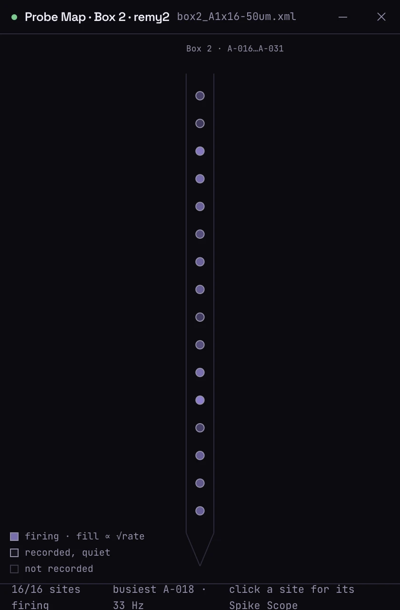 |

- **Spike Scope** overlays recent spikes on one channel. Drag the dashed threshold line to set RHX's
  threshold for that channel.
- **PSTH** lines up each trial on an event (such as an odor coming on) and shows the spikes around it.
- **ISI** shows how long the gaps between spikes are.
- **Probe map** shades each site by its firing. Click a site to open its Spike Scope.

There is one recording per group. The Record step comes back for each new group.

## Checking a box

Debug Mode is for checking or testing a box outside a session. Open it by clicking a box's star on the
Dashboard, or its row in the **Boxes** tile. **Nothing you do in Debug Mode is recorded as data.** Press
Esc, click empty space, or click **← Constellation** to leave.


The panel has three parts:

- **Connection.** **Open** connects to the box's console. **Close** disconnects. **Reset** restarts the
  board. **Acknowledge** clears an `ERROR`.
- **Sketch.** **Flash…** puts a program on the box. Pick a sketch and click **Flash**. The log shows the
  program being built and loaded; when it says *Flashed. The console is open*, click **Close**.

  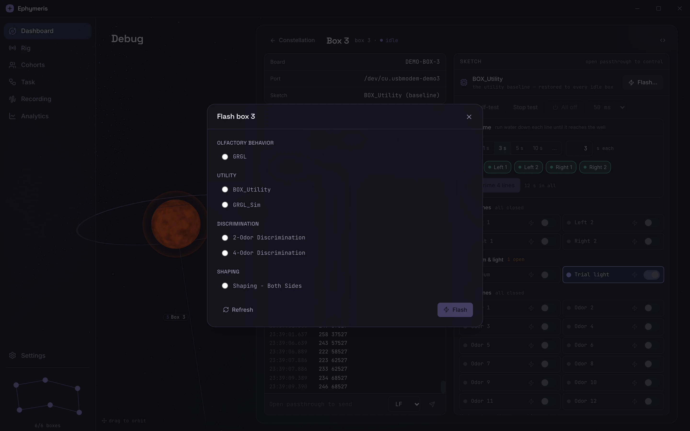

  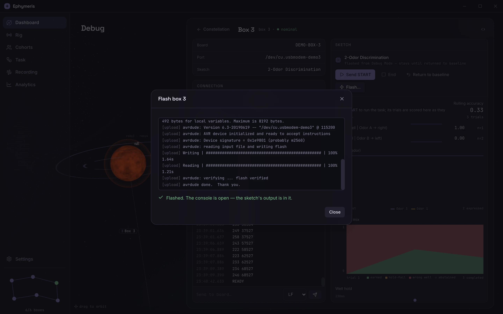

  For a task sketch, **Send START** starts it with the rig's usual values and shows live metrics, marked
  *Scored as a session would be. Nothing here is recorded.* **End** asks it to stop at the next trial
  boundary.

  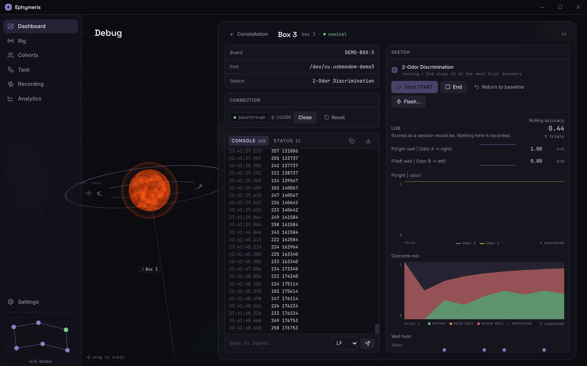

  When the box is resting on the utility sketch, open the console first (the panel says *open
  passthrough to control*). You then get a switch and a pulse for each valve and odor line, **All off**,
  **Full self-test**, and **Prime**, which runs water down each chosen line in turn: pick how many
  seconds and which lines, then click **Prime** (it reads, for example, **Prime 4 lines**). After flashing your own sketch, **Return to baseline**
  puts the box back on the utility sketch.
- **Console.** Everything the board prints. Type in the box and press Enter to send a command. The
  **Status** tab holds the utility sketch's regular status lines, so the **Console** tab stays readable.
  You can copy or save the log.

**Finding which physical box is which:** on the **Rig** tab, click **Test** on a box's row. It connects to
the board and waits for it to announce itself; the **Handshake** column then reads *speaks Ephymeris —
READY received*. During animal placement the app lights each box for you.

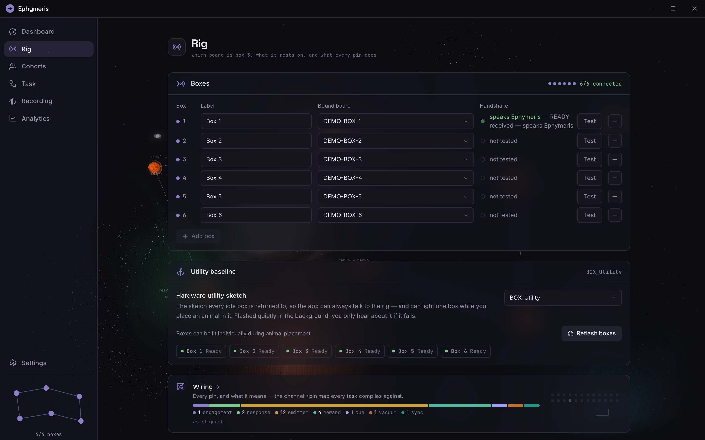

> [!WARNING]
> **`GRGL_Sim` really opens the fluid lines.** It runs a whole session with no animal in the box. Run it
> dry (no water in the reservoirs) unless you mean to dispense.

## Looking at results

### Where files are saved

Each animal gets three files per run, inside the cohort's data folder:

```
<Data directory>/<cohort>/<prefix>/<prefix>_<number>_<YYYY-MM-DD>/
    behavior.tsv/   written live, one line per event
    behavior.json/  built when the run ends
    behavior.mat/   the same, for MATLAB
```

A file is named `<animal>_<prefix>_<number>_<date>_<time>`, for example
`remy1_2O-Bdisc_25_2026-07-22_113123.json`. The `.json` and `.mat` files are the ones to analyse. The
`.tsv` is the safety copy written during the run (see [Crash safety](DATA.md#crash-safety)). A recording
is saved in an `ephys` folder in the session folder, unless the Recording defaults name another place.

### Analytics

1. Open **Analytics** and click a cohort in the list (or move with the arrow keys and press Enter).
2. The **Sessions** rail places sessions by date, so a gap in training shows as a gap. Under it, in one
   row: the **Animals** list, **Strategy space**, and the **Accuracy** chart with the **Task** strip
   above it, showing which task each stretch of sessions was running. Below them are the **Effort** and
   **Outcome mix** charts.

   

3. The **Animals** list shows each animal with its trend. Hover over one to highlight it in every chart;
   click to keep it highlighted. **Strategy space** places each animal per session in one of four
   corners (*discriminating*, *chance*, *side bias*, *reversed*). Each chart has a **how to read this**
   note you can open. (The screenshots here show an earlier arrangement of the same charts.)

   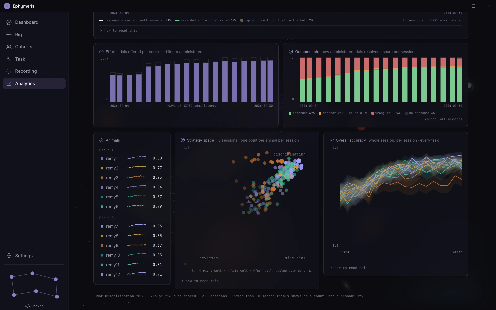

4. Click a session on the rail to look at just that one, or **All sessions** to see everything. One
   session shows a **Session summary** table: one row per animal, with its start and end time and
   program under its name, then one column for all trials and one per condition. Each cell shows the
   share rewarded as a coloured box, with the number of trials sampled under it.

   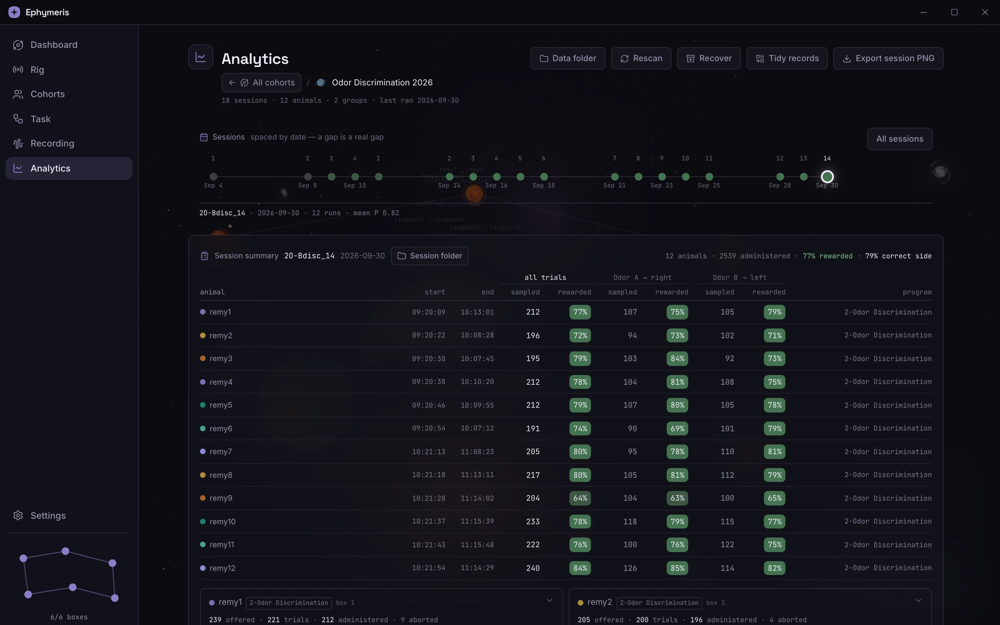

   Further down, each animal has a card with its conditions and outcomes, and the strategy and rolling
   accuracy charts follow that session trial by trial. On a card's **Tape**, a thin purple line marks a
   note from the [log](#keeping-the-log), at about the trial it was taken; hover it to read the note. Clicking an animal in the **Animals** rail picks it
   out in these charts.

   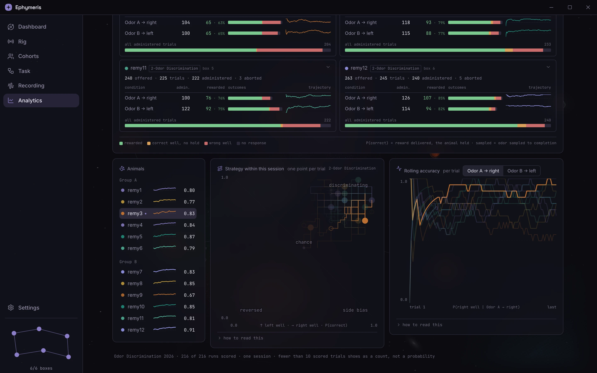

5. **All cohorts** goes back to the cohort choice.

**What accuracy means.** For each trial the animal answered, it was either correct or not. Accuracy is
the fraction correct. By default Ephymeris shows **pooled accuracy across conditions**: every condition's
trials counted together. This matters. An animal that always pokes the same side would look perfect on
one condition and terrible on the other; pooled, it correctly sits at chance (0.5). Some charts also
separate *rewarded* accuracy (the animal earned the water) from *response* accuracy (it chose the right
side, even if it let go too early). Full definitions are in [Derived metrics](DATA.md#derived-metrics).

### Restarted runs

If a box was stopped and started again for the same animal in one session, the first run is a
**false start** when it got fewer than 10 trials in. It stays listed under **Restarts** below the
session table, greyed out, but no number, curve or chart counts it, and **What changed** in the log
compares the real run with the animal's previous session instead.

You can overrule the app: **Set aside** marks any run as a false start (a wrong animal, say), and
**Count it** puts one back. **Use the rule** lets the app decide again. Your choice is saved and shows
in the log.

### Exporting a sheet

**Export cohort PNG** (or **Export session PNG** when one session is selected) saves the charts on
screen as one image, with the cohort, task and dates written on it.

Every export (the PNG, the log PDFs, the strobe list) shows a card in the bottom-right corner while it
works: each step in turn, then where the file was saved, with a **Show** button that opens its folder. The
card goes away on its own a few seconds later. If an export fails, its card stays and says why until you
close it. You can switch tabs while an export runs.

### Rescan Recover and Tidy records

These buttons are at the top of Analytics. Use them when the lab manager asks, or as described here.

- **Rescan** looks for session files that Ephymeris has no record of, such as sessions from the other lab
  machine. Use it when a session you expect is missing or marked *not indexed*.
- **Recover** rebuilds the `.json` and `.mat` files from a `.tsv` that a crash left behind. Use it after
  the app or computer crashed during a session. It is refused while any box is running.
- **Tidy records** merges one session that ended up as two records (for example after starting the same
  session number twice in a day) and removes records with no data. It shows what it will do first, in a
  **Tidy session records** window, and it never moves, renames or deletes a data file. Click **Tidy** to
  go ahead, or **Cancel**.

  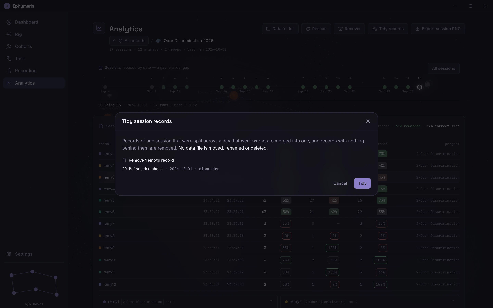

## Keeping the log

The **Log** tab is the cohort's lab notebook. Open it and click a cohort in the list. The left column is the
cohort's sessions; the right is the selected session's page.

### Moving through sessions

The sessions sit on a timeline, newest at the top, **spaced by real days**: a weekend or a missed day is
a visible gap, and a long break is marked with how many days it lasted. The selected session always sits
at the bar near the top of the column, and the timeline slides past it.

- **Scroll** over the timeline, or press **j** (older) and **k** (newer), to step one session at a time.
- Click a session to jump to it, or a month in the strip at the top to jump to that month.
- **Page Up** and **Page Down** jump a month while the timeline has focus; **Home** and **End** go to the
  newest and oldest.

A diamond is filled for a finished session, green with **live** for a running one, and hollow for an
abandoned session or one recovered from files. A number beside a session is how many notes it has; a
flag means it has a note carried forward.

The top of the page reads the session's **Date**, **Start**, **End** and **Elapsed**. Start is when the
first group began running, not when you started setting up; set-up time is noted underneath. The strip
below shows each group run, with a tick for every note at the moment it was taken. Click a tick to go to
the note. For a session recovered from files, End and Elapsed are marked **~**: nothing recorded when it
stopped, so they are read from how long each animal's file ran.

**Session folder**, beside the session's status, opens its folder on disk; **Cohort folder**, at the top
right of the Log, opens the cohort's data folder.

### Writing notes

Press **n**, or click the note box under **Notes**.

1. Pick what kind of note it is: **Observation**, **Intervention**, **Hardware**, **Health** or
   **Deviation** (from the protocol).
2. Pick what it is about: the whole session, one box, or one animal.
3. Type it. **⌘↵** (Ctrl+Enter on Windows) saves.

A note is stamped with the time you save it. To record something that happened earlier, type the time in
**At** first. A note taken while the session was running shows how far into the session it was, such as
**T+12:04**; a note written afterwards shows only the clock time.

To change or remove a note, hover over it and click the pencil or the bin. Edited notes say **edited**.

**Operator and summary**, at the bottom of the page, are for who ran the session and how it went. They
save when you click away.

Every session's notes are also written to a file called `notes.md` in its session folder, so they stay
with the data when the folder is copied or backed up. Change notes in the app, not in that file.

### Carry-forward flags

Turn on **Carry forward to next session** for anything the next person at the rig needs to know, such as
*Box 2's right port beam flickers*. Open flags are listed at the top of the Log, under **Before you start**
when setting up the next session, and on Mission Control. Click **Resolve** once it has been dealt with.

### What changed and how they did

**Performance** is the same per-animal table as in Analytics: the share rewarded and the trials
sampled, overall and for each condition. **Open in Analytics** goes to that session there.

**What changed** lists, for each animal, anything different from its previous session: a new task, a
different box, or a changed setting. Each animal with something to report gets a row, marked with its
colour from the performance table, and each change its own line — the kind at the left (**task**,
**box**, **settings**), then the old value and the new one, the new one brighter. Settings line up in a
small table (`holdMs  200 → 300`). Animals with nothing to report are named once underneath, and the
heading counts how many changed. Ephymeris records these itself, so you don't have to. Sessions copied
from the other lab machine are compared too, from the settings saved in each animal's file; they show
**recovered** instead of a box, because the file doesn't say which box it was. Very old files saved no
settings, so only their task is compared.

### Saving the log as a PDF

At the top right of the Log, **Session PDF** saves the selected session's page, and **Logbook PDF**
saves every session of the cohort, oldest first, after a cover page listing any open flags. A card in the
bottom-right corner shows the progress; choose where to save it when it asks. The PDF is printed on white, and its text can be searched and copied.

Notes print as written, except that a few symbols are spelled out (`≥` becomes `>=`), and characters the
PDF's fonts don't have, such as Chinese or emoji, print as `?`. Accented letters and Greek print normally.

## Troubleshooting

| What you see | What to do |
|---|---|
| A box's star is dim, or missing from the Boxes tile | The board is not detected. Check its USB cable and power. If it still does not appear, the box may not be bound: check the **Rig** tab |
| A box will not flash | Read the message on its card. If the box shows `ERROR`, click **Acknowledge**, then try again. If it fails again, tell the lab manager |
| A box is stuck in `ERROR` | Open it from the Dashboard (click its star) and click **Acknowledge**. Reset does not clear an error |
| A box will not start | Click **Reset**, wait a few seconds, then **Start** again |
| **Stop** seems to do nothing | The box stops at the end of the current trial. If no animal is poking, that can take until the trial times out. Wait |
| Screens say *Waiting for the backend* or *The backend isn't connected*, or Debug Mode shows *sidecar down* | The app lost its connection to its own background process. Close Ephymeris and open it again. It does not restart this by itself |
| **backup failing** on Mission Control, or a warning under **Backup directory** in Settings | Data is still saved locally; the backup copy is not being made. Tell the lab manager. The refresh button beside the warning copies anything missing once the backup drive is back |
| A session from earlier today needs another group | **Start a Session**, pick the cohort, then **Continue today**. See [Continue a session from earlier today](#continue-a-session-from-earlier-today) |
| The dock shows a session that **Ended unexpectedly** | The app closed during a session. Use **Continue with another group** (same day only), **View in Analytics**, or **Close out**. Then run **Recover** in Analytics |
| The placement walk says it could not light a box | Go by the number on the box. The walk works without the light |

## Rules that protect the data

- **Do not unplug a box during a session.** The run for that animal stops at once.
- **Do not rename, move or delete anything in the data folder.** Analytics finds sessions by their folder
  and file names, and a renamed file can be lost from its session or read under the wrong date.
- **Never edit a `.tsv` file.** It is the original record of the run, and Recover rebuilds the other
  files from it.
- **`GRGL_Sim` really opens the fluid lines.** Run it dry unless you mean to dispense.
- **Close Ephymeris normally**, with its own close button, and only after ending the session. Closing it
  during a session stops every box's recording.
- **Run only one copy of Ephymeris per computer.** Two copies fight over the boxes' connections and the
  same database.
- **Follow the box order when placing animals**, and check the number on each box. A wrong placement
  cannot be detected later.
- **Add strobe codes on one computer and import them on the other**, rather than adding the same event
  on both: two computers can give one number two meanings, and Import refuses to merge them.
- **Do not reuse a session number by accident.** If the configure step warns that the number already has
  data today, stop and check.

## Glossary

| Term | Meaning |
|---|---|
| **Cohort** | A batch of animals trained together, with its own data folder |
| **Group** | The animals that are in the boxes at the same time. A cohort with more animals than boxes has several groups |
| **Box** | One behaviour chamber, numbered 1 to 6. The box number is how Ephymeris identifies it everywhere |
| **Board** | The Arduino computer inside a box, connected by USB. A box is *bound* to its board on the Rig tab |
| **Sketch** | A program for the board |
| **Task** | What the animal does in a session: its trial types, shaping ramp and timings. Saving a task on the Task tab makes a sketch |
| **Task profile** | The description that ships with a sketch, telling Ephymeris its settings, events and live metrics |
| **Prefix** | The task's short name used in folder and file names, such as `2O-Bdisc`. Shared across cohorts |
| **Session** | One sitting at the rig, named by prefix, number and date. It may include several groups |
| **Run** | One animal's part in one session. Each run has its own files |
| **Strobe** | One event the board reports (an odor poke, a water delivery), with a code and a time |
| **Trial** | One attempt: the animal samples an odor, then answers at a well, or does not |
| **Condition** | One kind of trial, such as a particular odor whose correct answer is the left well |
| **START line** | The message that starts a task on a board, carrying all its settings |
| **Utility sketch (baseline)** | The resting program idle boxes are kept on. It lets the app light a box and run Prime |
| **Mission Control** | The screen where you start, watch and stop the boxes during a session |
| **Constellation** | The star figures: the small one in the sidebar shows box health, and the 3D views show the rig or the session's animals |
