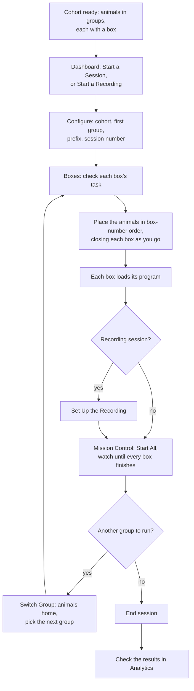
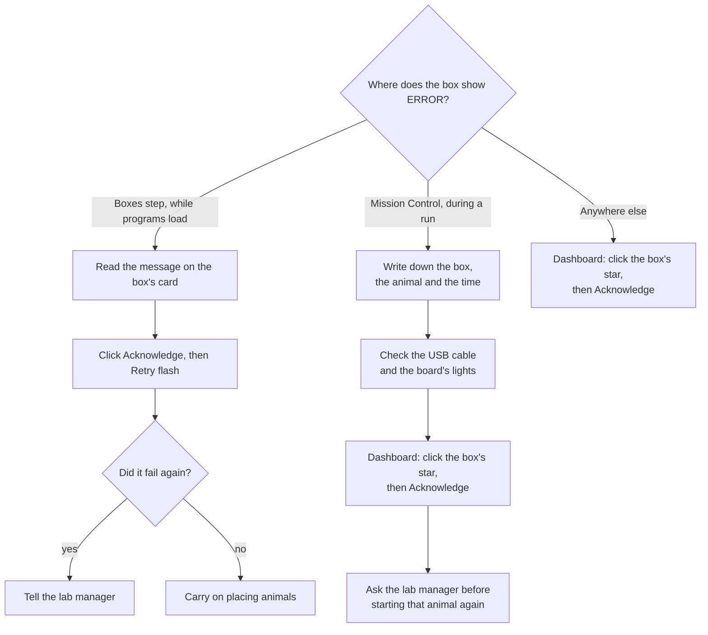

# Ephymeris user guide

This guide is for the people who run daily behaviour sessions. It covers what to click, what the screen
is telling you, and what never to do. Words in **bold** are labels you will see on screen. Words you may
not know are in the [Glossary](#glossary).

## Before you start

**What Ephymeris does.** It runs behaviour sessions for a cohort of animals. It puts the right program
(the task) on each box, starts the boxes, shows you live progress, and saves every event to a data file
for each animal while the session runs. Afterwards, the **Analytics** screen shows how each animal is
doing.

**The rig.** There are up to six behaviour boxes, numbered 1 to 6. Each box has a small computer inside
it, an Arduino board, connected to the lab computer by USB. Inside each box are odor ports, where the
animal pokes its nose to sample an odor, and water wells, where it pokes to answer and gets a drop of
water when it is right. One animal goes into one box.

**A session** is one sitting at the rig: you pick a cohort, place a group of animals in the boxes, run
them, and maybe swap in a second group. Every animal gets its own file. A session has a **prefix** (the
task's short name, such as `2O-Bdisc`) and a **session number**.

**Before your first session, check three things:**

1. **A cohort exists** with animals, and each animal has a box in its group (see
   [Setting up a cohort](#setting-up-a-cohort)).
2. **The boxes are bound.** On the **Rig** tab, each box is linked to its board. Your lab manager
   normally does this once.
3. **A task is saved** on the **Task** tab. Your lab manager normally does this too.

## A tour of the app

The sidebar on the left has seven screens, top to bottom. At the very bottom is a small star figure,
one star per box. A box's star is lit when its board is connected, dim when it is missing, and red
when it has a fault. You can check it from any screen.

**Dashboard.** The home screen. The big button is **Start a Session** (or **Resume Session** while one is
running). Below it is **Start a Recording**, for sessions recorded with Intan. Below that, the session
dock lists anything that needs you: a running session, a set-up you left half-done, or a session that
ended unexpectedly. The tiles on the right show the boxes, cohorts and recent results. The 3D sky behind
everything is the rig: click a box's star, or its row in the **Boxes** tile, to open that box's panel
(see [Checking a box](#checking-a-box)).

**Rig.** What each box is: which board is box 3, which program idle boxes rest on, and the wiring of
every pin. Usually set up once by the lab manager.

**Cohorts.** Your groups of animals, drawn as planets. Click one to open it, or click the small dust disc
in the middle to make a new cohort.

**Task.** What the animal does: the trial types, the shaping ramp and every number the box uses. Saving
a task makes a program that can be put on a box. Usually managed by the lab manager.

**Recording.** The link to the Intan RHX recording software, which digital input each box is wired to,
and the default recording settings.

**Analytics.** Results. Pick a cohort to see its sessions, animals and learning curves.

**Settings.** Where data is saved (**Data directory**), where a backup copy goes (**Backup directory**),
**Reduce motion**, and how the star figure is drawn.

## Setting up a cohort

A **cohort** is a batch of animals that are trained together.

### Create a cohort

1. Open **Cohorts** and click the dust disc in the middle of the sky. A **New Cohort** page opens.
2. Type a **Name**. It must be unique among active cohorts.
3. If no **Data directory** is set in Settings, the page asks for a **Data folder**. Otherwise the folder
   is made for you inside the Data directory, named after the cohort.
4. Add **Animals**. The quickest way is the bulk box: paste a list of names (one per line, or copied
   from a spreadsheet column), or type a pattern like `R- × 8` to make `R-1` to `R-8`. Click **Add**.
   Names already in the cohort are skipped. You can also fill in **Sex**, **ID number** and **Notes**.
5. Optional: under **Cages & spaceships**, drag cagemates onto a shared spaceship (one per home cage).
6. Under **Groups & boxes**, drag each animal onto the box it runs in. You can also click an animal, then
   click its box.
7. Click **Create cohort**. To change an existing cohort later, open it and click **Save changes**.

You can save a cohort before it is finished and fill it in over the next few days.

### Groups

A **group** is the set of animals that are in the boxes at the same time. If you have more animals than
boxes, split them into groups: each group gets the whole rig, so box numbers repeat between groups. Use
**Split into groups** or **Add a group**, then drag animals between group cards. A box can hold only one
animal per group. **Fill boxes** assigns boxes to everyone in a group who does not have one.

Groups have no fixed order. You choose which group runs when you start the session, and again each
time you switch.

### Auto-balance

**Auto-balance…** proposes a complete grouping for you.

1. Under **Split by**, choose **Number of groups** or **Max group size**.
2. Tick **Balance by sex** to spread males and females evenly (only offered when some animals have a sex).
3. Click **Suggest grouping**. A preview appears. Nothing is saved yet.
4. Adjust the preview by hand if you like, then click **Apply grouping**, or **Cancel**.

Applying replaces the current grouping entirely. A group can never have more than six animals.

### The data folder

The cohort's data folder is fixed when the cohort is made. **Renaming a cohort does not move or rename
its folder.** To move it, use **Change data folder…**: with **Move existing contents to the new location**
ticked, the files are moved and the new folder must be empty. With it unticked, nothing is moved; the
cohort is simply pointed at a folder that already holds its data.

### Archive and delete

**Archive** hides a cohort but keeps everything. Turn on **Show archived** on the Cohorts screen to see
archived cohorts and **Restore** one. **Delete permanently** is only offered for archived cohorts. It
removes the cohort, its animals and groups from Ephymeris, but **never deletes its data folder**.

## Running a session

A session day at a glance. Each step is explained in the sections below:



### Configure

1. On the Dashboard, click **Start a Session**.
2. Pick the **Cohort**.
3. Pick the **Group** that goes on the rig first. Only groups with at least one animal assigned to a box
   are offered.
4. Pick the **Prefix** (the task's short name). Use **Add a prefix** for a new one.
5. Check the **Session number**. It is filled in with the next number for this prefix.
6. Optional: a **Time limit** in minutes. Each box stops by itself that many minutes after *it* started.
7. Click **Continue**.

If a warning says this session number already has data from today, you are about to write into the
same folder. That is usually a mistake. If you meant to continue today's session, use **Continue today**
instead (see [Continue a session from earlier today](#continue-a-session-from-earlier-today)).

### Boxes

Each box in the group gets a card showing its animal.

1. Pick the **Sketch** (the task program) for each box. The task's settings appear as one summary line;
   open it to see **Quick tune** (the values usually changed per animal, per day) and **All parameters**.
   Changes here apply to this session only.
2. If a box shows an error, read its message and click **Acknowledge**. You cannot continue while any
   box is in an error state.
3. Click **Place the animals**.

### Place the animals

The app walks you down the bench, one box at a time, **in box-number order**.

1. The screen points at one box. If the rig allows it, **that box lights up**. The light only confirms the
   box. Always check the number on the box itself.
2. Put the named animal in that box and close it.
3. Click **Enclosure closed**. That box starts flashing (loading its program) while you fetch the next
   animal.
4. Repeat until every animal is in. **Skip this box** passes over one box; **All animals are in** finishes
   the walk in one click if you already loaded them.

If you loaded the rig before opening this screen, click **They're already in — flash all** instead of
**Place the animals**.

> [!CAUTION]
> **An animal in the wrong box produces a complete, normal-looking data file under the wrong name.**
> Nothing later can detect it. Follow the box order, and trust the number on the box over the light.

When every box has flashed, Mission Control opens by itself (or the Record step, for a recording). If a box fails to flash, click
**Acknowledge** on its card, then **Retry flash**.

### Record

Only a session started with **Start a Recording** has this step, after the boxes have flashed. See
[Recording with Intan](#recording-with-intan).

### Run

On **Mission Control**, click **Start All** to start every box, or **Start** on one box. See
[During a session](#during-a-session).

### Switching groups

When every box in the group has finished, a prompt appears with a return checklist.

1. Take each animal back to its home cage and tick it off, or click **All animals are out**.
2. Click **Pick next group**. You can also click **Switch Group** at any time after a group has run.
3. Choose **any** group and click **Run this group**. A group that already ran shows when it ran (for
   example *ran 10:42*). Running it again is allowed: it adds new files beside the old ones and
   overwrites nothing.
4. You return to the Boxes step for the new animals. Confirm sketches and place the animals again.

### Ending the session

When the last group finishes, a **That's a wrap** window appears. Tick each animal home, then click
**End session**. The files are already saved, and Analytics opens on this session. **Run another group**
is still offered if you need it; **Not yet** closes the window.

You can also click **End Session** in Mission Control at any time. If no box ever ran, the button reads
**Discard session** and nothing is saved. Only ending the session finishes it; switching groups never does.

> [!IMPORTANT]
> **End Session and Switch Group stop any box still running straight away, cutting its current trial
> short.** If you want every trial complete, click **Stop** on each box and wait for **Finished** before
> ending. (Recording sessions are different: they wait for each box to finish its trial.)

### Continue a session from earlier today

If the app was closed between groups, or a session was ended too early, you can run another group under
the same session (same folder, same number):

- Click **Start a Session**, pick the cohort, and under **Continue today** click **Continue**, or
- If the Dashboard dock lists the session as **Ended unexpectedly**, click **Continue with another group**.

Then choose the group and click **Run this group**.

This only works on the same day. It cannot resume a group in the middle of its run.

## During a session

Mission Control shows the 3D view of the session, a tile for each box, and the session controls. You can
leave it (for example to the Dashboard) and the session keeps running; come back with **Resume Session**.

### Reading a box tile

- **Box 3 · Remy** names the box and the animal, with the sketch underneath.
- **The clock** shows time since *this* box started (`12:04`). With a time limit it shows both
  (`12:04 / 30:00`). At the limit it reads *time up — stopping at the next trial boundary*: the box is
  finishing its last trial and will stop by itself.
- **The state chip** shows the box's state. `IN_SESSION` (green) means running. `IDLE` means not running.
  `FLASHING` and `RESETTING` are brief. `ERROR` (red) means something went wrong; hover over it to read why.
- **Live metrics** show how the animal is doing, such as the rolling chance of a correct answer for each
  odor. They fill in as trials complete.
- **Finished — …** replaces the metrics when the box's run is over, with the reason (for example the
  box ending on its own, or an operator stop).

Click a tile, or a star, to see that box's full panel: live charts, trial flow and recent events.
**Back to overview** (or Esc) returns.

### The buttons

- **Start** starts that box. Starting resets the board, waits for it to be ready, then sends the task.
- **Stop** asks the box to stop. **It stops at the end of the current trial, not instantly. Wait for it.**
  Do not click again or reset it while you wait.
- **Reset** restarts the board. It works only while the box is not running. Use it if a box will not start.

### When a box shows ERROR or a board disconnects

If a board loses its USB connection, or something else fails, that box's run stops at once and its state
becomes `ERROR`. Everything recorded up to that moment is safe. Other boxes keep running.

1. Write down the box, the animal and the time.
2. Check the USB cable and that the board's lights are on.
3. To clear the error: go to the **Dashboard**, click that box's star, and click **Acknowledge** in its
   panel.
4. Ask your lab manager before restarting that animal. If you press **Start** again, a new file is begun
   for it and the earlier file is kept.

What to do depends on where you see the error. **Reset** never clears it; only **Acknowledge** does.



### Session write failed

A red line on a box tile that starts **Box N: session write failed** means **that box's data is not being
saved**. The animal is still running. The usual cause is a full or disconnected drive. Tell the lab
manager straight away, and note the box and time.

### Backup pill

The Mission Control header shows **backup ok** or **backup failing**. A failing backup never stops the
session and data is still saved locally. Tell the lab manager after the session.

### Do not touch during a session

- Do not unplug a box or its USB cable.
- Do not close Ephymeris. Closing it stops every box's recording.
- Do not open the data folder and move or edit files.
- Do not change the Rig, Task or Settings screens.

## Recording with Intan

A recording session runs the behaviour and an Intan RHX electrophysiology recording together. Details
for maintainers are in [Recording with Intan RHX](RECORDING.md).

**Once, on the Recording tab** (usually done by the lab manager):

- **Sync inputs**: each recorded box needs its **Digital input**, the RHX input its sync cable plugs into.
  The tab also says if the rig's wiring has no sync channel yet; the lab manager adds one on the Rig tab.
- **Defaults**: where recordings are saved, the file format and spike thresholds.

**Each recording session:**

1. Open RHX first. In RHX, open **Network → Remote TCP Control**, go to the **Commands** tab and press
   **Connect**.
2. In Ephymeris, open the **Recording** tab and click **Connect**. You must do this again whenever RHX
   disconnects.
3. On the Dashboard, click **Start a Recording** (not Start a Session). Its subtitle tells you whether
   RHX is connected.
4. Configure and place the animals as usual. After the Boxes step comes **Set Up the Recording**:
   - **Readiness** lists anything still missing. Each line says what to fix.
   - **Saving** shows where the recording will be saved and **Using your defaults**. Click
     **Edit for this session** to change them.
   - **Boxes**: for each box choose **Record** or **Behavior only**, its port and channel range, and
     optionally a probe map.
5. Click **Configure RHX and continue**. Nothing is sent to RHX before this.
6. In Mission Control, **Start All** starts the RHX recording first. If RHX cannot start, no box starts.
   The rail shows **REC**, the file being written and a **sync check** per box. *no pulses arriving* means
   the sync cable is not reaching RHX.
7. Each recorded box has **Spike Scope**, **PSTH**, **ISI** and (with a probe map) **Probe map** buttons.
   Each opens its own window, which you can drag to another monitor.
8. **End Session** and **Switch Group** let each box finish its current trial first (up to 45 seconds).
   The rail lists which boxes are still finishing; **End now** stops RHX without waiting.

There is one recording per group. The Record step comes back for each new group.

## Checking a box

Debug Mode is for checking or testing a box outside a session. Open it by clicking a box's star on the
Dashboard, or its row in the **Boxes** tile. **Nothing you do in Debug Mode is recorded as data.** Press
Esc, or click empty space, to leave.

The panel has three parts:

- **Connection.** **Open** connects to the box's console. **Close** disconnects. **Reset** restarts the
  board. **Acknowledge** clears an `ERROR`.
- **Sketch.** **Flash…** puts a program on the box. Pick a sketch and click **Flash**. For a task sketch,
  **Send START** starts it with the rig's usual values and shows live metrics; **End** asks it to stop at
  the next trial boundary. When the box is resting on the utility sketch, you get a switch and a pulse for
  each valve and odor line, and **Prime**, which runs water down each chosen line in turn. After flashing
  your own sketch, **Return to baseline** puts the box back on the utility sketch.
- **Console.** Everything the board prints. Type in the box and press Enter to send a command. The
  **Status** tab holds the utility sketch's regular status lines, so the **Console** tab stays readable.
  You can copy or save the log.

**Finding which physical box is which:** on the **Rig** tab, click **Test** on a box's row. It connects to
the board and waits for it to announce itself. During animal placement the app lights each box for you.

> [!WARNING]
> **`GRGL_Sim` really opens the fluid lines.** It runs a whole session with no animal in the box. Run it
> dry (no water in the reservoirs) unless you mean to dispense.

## Looking at results

### Where files are saved

Each animal gets three files per run, inside the cohort's data folder:

```
<Data directory>/<cohort>/<prefix>/<prefix>_<number>_<YYYY-MM-DD>/
    behavior.tsv/   written live, one line per event
    behavior.json/  built when the run ends
    behavior.mat/   the same, for MATLAB
```

A file is named `<animal>_<prefix>_<number>_<date>_<time>`, for example
`remy1_2O-Bdisc_25_2026-07-22_113123.json`. The `.json` and `.mat` files are the ones to analyse. The
`.tsv` is the safety copy written during the run (see [Crash safety](DATA.md#crash-safety)). A recording
is saved in an `ephys` folder in the session folder, unless the Recording defaults name another place.

### Analytics

1. Open **Analytics** and click a cohort's planet.
2. The **Sessions** rail places sessions by date, so a gap in training shows as a gap. Click a session to
   look at just that one, or **All sessions** to see everything.
3. The **Animals** rail lists each animal with its trend. Hover over one to highlight it in every chart;
   click to keep it highlighted.
4. **All cohorts** goes back to the cohort choice.

**What accuracy means.** For each trial the animal answered, it was either correct or not. Accuracy is
the fraction correct. By default Ephymeris shows **pooled accuracy across conditions**: every condition's
trials counted together. This matters. An animal that always pokes the same side would look perfect on
one condition and terrible on the other; pooled, it correctly sits at chance (0.5). Some charts also
separate *rewarded* accuracy (the animal earned the water) from *response* accuracy (it chose the right
side, even if it let go too early). Full definitions are in [Derived metrics](DATA.md#derived-metrics).

### Exporting a sheet

**Export cohort PNG** (or **Export session PNG** when one session is selected) saves the charts on
screen as one image, with the cohort, task and dates written on it.

### Rescan Recover and Tidy records

These buttons are at the top of Analytics. Use them when the lab manager asks, or as described here.

- **Rescan** looks for session files that Ephymeris has no record of, such as sessions from the other lab
  machine. Use it when a session you expect is missing or marked *not indexed*.
- **Recover** rebuilds the `.json` and `.mat` files from a `.tsv` that a crash left behind. Use it after
  the app or computer crashed during a session. It is refused while any box is running.
- **Tidy records** merges one session that ended up as two records (for example after starting the same
  session number twice in a day) and removes records with no data. It shows what it will do first, and
  it never moves, renames or deletes a data file.

## Troubleshooting

| What you see | What to do |
|---|---|
| A box's star is dim, or missing from the Boxes tile | The board is not detected. Check its USB cable and power. If it still does not appear, the box may not be bound: check the **Rig** tab |
| A box will not flash | Read the message on its card. If the box shows `ERROR`, click **Acknowledge**, then try again. If it fails again, tell the lab manager |
| A box is stuck in `ERROR` | Open it from the Dashboard (click its star) and click **Acknowledge**. Reset does not clear an error |
| A box will not start | Click **Reset**, wait a few seconds, then **Start** again |
| **Stop** seems to do nothing | The box stops at the end of the current trial. If no animal is poking, that can take until the trial times out. Wait |
| Screens say *Waiting for the backend* or *The backend isn't connected*, or Debug Mode shows *sidecar down* | The app lost its connection to its own background process. Close Ephymeris and open it again. It does not restart this by itself |
| **backup failing** on Mission Control, or a warning under **Backup directory** in Settings | Data is still saved locally; the backup copy is not being made. Tell the lab manager. The refresh button beside the warning copies anything missing once the backup drive is back |
| A session from earlier today needs another group | **Start a Session**, pick the cohort, then **Continue today**. See [Continue a session from earlier today](#continue-a-session-from-earlier-today) |
| The dock shows a session that **Ended unexpectedly** | The app closed during a session. Use **Continue with another group** (same day only), **View in Analytics**, or **Close out**. Then run **Recover** in Analytics |
| The placement walk says it could not light a box | Go by the number on the box. The walk works without the light |

## Rules that protect the data

- **Do not unplug a box during a session.** The run for that animal stops at once.
- **Do not rename, move or delete anything in the data folder.** Analytics finds sessions by their folder
  and file names, and a renamed file can be lost from its session or read under the wrong date.
- **Never edit a `.tsv` file.** It is the original record of the run, and Recover rebuilds the other
  files from it.
- **`GRGL_Sim` really opens the fluid lines.** Run it dry unless you mean to dispense.
- **Close Ephymeris normally**, with its own close button, and only after ending the session. Closing it
  during a session stops every box's recording.
- **Run only one copy of Ephymeris per computer.** Two copies fight over the boxes' connections and the
  same database.
- **Follow the box order when placing animals**, and check the number on each box. A wrong placement
  cannot be detected later.
- **Do not reuse a session number by accident.** If the configure step warns that the number already has
  data today, stop and check.

## Glossary

| Term | Meaning |
|---|---|
| **Cohort** | A batch of animals trained together, with its own data folder |
| **Group** | The animals that are in the boxes at the same time. A cohort with more animals than boxes has several groups |
| **Box** | One behaviour chamber, numbered 1 to 6. The box number is how Ephymeris identifies it everywhere |
| **Board** | The Arduino computer inside a box, connected by USB. A box is *bound* to its board on the Rig tab |
| **Sketch** | A program for the board |
| **Task** | What the animal does in a session: its trial types, shaping ramp and timings. Saving a task on the Task tab makes a sketch |
| **Task profile** | The description that ships with a sketch, telling Ephymeris its settings, events and live metrics |
| **Prefix** | The task's short name used in folder and file names, such as `2O-Bdisc`. Shared across cohorts |
| **Session** | One sitting at the rig, named by prefix, number and date. It may include several groups |
| **Run** | One animal's part in one session. Each run has its own files |
| **Strobe** | One event the board reports (an odor poke, a water delivery), with a code and a time |
| **Trial** | One attempt: the animal samples an odor, then answers at a well, or does not |
| **Condition** | One kind of trial, such as a particular odor whose correct answer is the left well |
| **START line** | The message that starts a task on a board, carrying all its settings |
| **Utility sketch (baseline)** | The resting program idle boxes are kept on. It lets the app light a box and run Prime |
| **Mission Control** | The screen where you start, watch and stop the boxes during a session |
| **Constellation** | The star figures: the small one in the sidebar shows box health, and the 3D views show the rig or the session's animals |
