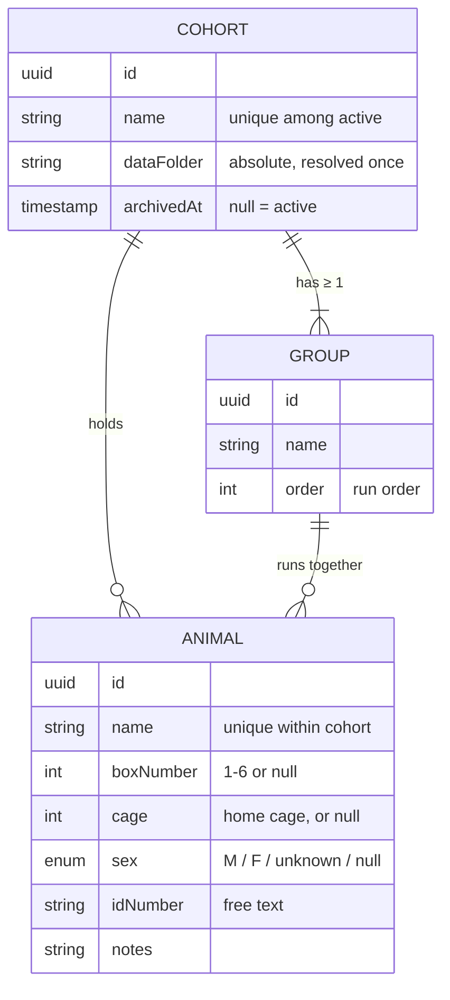
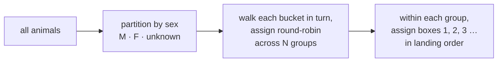

# Cohorts

 

> **What this is** · The Cohort / Animal / Group data model and everything the Cohorts tab does with it.
>
> **Owns** · The data model and its validation · the 3D cohort browser and procedural worlds · the create/edit flow · Auto-Balance grouping · data-folder resolution · archive and delete semantics.
>
> **Read with** · [data.md](data.md) (the SQLite schema, and the folder written beneath) · [dashboard.md](dashboard.md) (what a session does with a cohort) · [settings.md](settings.md) (box bindings, which the editor gates on).

**Contents** — [1. Data model](#1-data-model) · [2. Validation](#2-validation-rules) · [3. Persistence](#3-persistence) · [4. The browser](#4-the-cohort-browser) · [5. The icon](#5-procedural-icon-generation) · [6. Create / edit](#6-create--edit--manage) · [7. Auto-Balance](#7-auto-balance) · [8. Data folder](#8-data-folder-resolution) · [9. Archive & delete](#9-archive--delete-semantics)

---

## 1. Data model



```ts
Cohort {
  id: uuid
  name: string                    // unique among active (non-archived) cohorts
  animals: Animal[]
  groups: Group[]                 // always ≥ 1
  dataFolder: string              // absolute path, resolved once at creation
  iconSeed: id                    // derived from the cohort id — nothing extra stored
  createdAt, updatedAt: timestamp
  archivedAt: timestamp | null    // soft-delete
}

Animal {
  id: uuid
  name: string                    // unique within the cohort
  boxNumber: 1–6 | null           // standing/default box assignment
  cage: int | null                // home-cage number — cagemates share one
  groupId: uuid                   // every animal belongs to exactly one group
  sex: "M" | "F" | "unknown" | null   // an enum, because sex-balanced grouping needs it
  idNumber: string | null         // tag/ear-notch/RFID — free text, ID schemes vary by lab
  notes: string | null
}

Group {
  id: uuid
  name: string                    // user-defined, or auto "Group 1" / "Group 2"
  order: int                      // run order for consecutive execution
}
```

A cohort can be created with **zero animals** and populated over following days — real lab setup is rarely a single sitting.

---

## 2. Validation rules

| Rule | Detail |
|---|---|
| **Cohort name** | Unique among **active** cohorts. Archived cohorts don't block reuse of a name |
| **Animal name** | Unique within its own cohort, not globally |
| **`boxNumber`** | An abstract slot `1`–`6`, validated against that fixed range **and nothing else** |
| **`boxNumber` uniqueness** | Scoped to the **group**, not the cohort |
| **`cage`** | An integer ≥ 1. No upper bound, no occupancy limit, **no interaction with groups** |
| **Groups** | Always exist, implicitly if the user never makes one |

> [!IMPORTANT]
> **`boxNumber` is never validated against which boards happen to be bound right now.** The app runs on two lab machines with independent bindings against a shared data directory, so a cohort configured on one must stay loadable, editable, and savable on the other. Narrowing what may be *stored* would make a cohort un-editable on whichever machine has fewer boxes.
>
> **The editor is a separate question, and it is opinionated.** It offers only boxes bound on *this* machine, because offering one that doesn't exist produced an assignment nobody could honour — discovered halfway down the session flash sequence rather than at the moment of the mistake.
>
> **The two halves must stay distinct:** `src/lib/cohorts/boxAvailability.ts` holds the machine-local opinion, the sidecar holds the range rule, and neither should be "fixed" into the other.

> [!CAUTION]
> **A stored assignment this machine can't honour is kept and reported, never rewritten.** A box that is merely unplugged is still the box that animal belongs in; silently clearing it would turn a loose USB hub into data loss. The editor names the affected animals and the browser grid flags the cohort — and both fall silent when the sidecar is disconnected, because detection is unknowable then and reporting blindness as a fault is worse than saying nothing.

**Why box uniqueness is per-group.** Two animals in *different* groups can share `boxNumber: 3` — groups run **consecutively**, so the same physical box slot is legitimately reused across them. Two animals in the *same* group cannot. Animals with `boxNumber: null` don't collide with anything.

**Why groups always exist.** If the user never creates an explicit group, all animals belong to a single default group created transparently. That keeps "grouped" and "ungrouped" cohorts on **one code path** rather than a special case — a cohort with 3 animals and 3 boxes just happens to have exactly one group.

**What groups are for.** Splitting a cohort larger than the available box count into consecutive runs — six rats, three working boxes, so two groups of three run back-to-back rather than simultaneously.

**What `cage` is for.** Housing and run order are independent facts, so cagemates legitimately land in different run groups. `null` means "cage unknown," which is true of every animal entered before the field existed. The 3D constellation is the consumer: cagemates share one ship in orbit — so the field changes **what the sky draws, never what a session may do**.

---

## 3. Persistence

Cohort / Animal / Group data lives in **SQLite**, owned by the Python sidecar. The database file lives in the **app's own data directory** — *not* inside the user-configured `dataDirectory`.

> [!NOTE]
> That setting is where behavioral session output lives and gets browsed by lab members; mixing an opaque `.db` file into it would be confusing, and it is not a `.json`/`.mat`/`.tsv` session artifact.

The schema has grown well past the three cohort tables. **The full schema, the migration rules, and how the database is backed up all live in [data.md §6](data.md#6-the-sqlite-database)** — including the one rule that bites:

> [!CAUTION]
> Adding a **table** needs nothing but a `CREATE TABLE IF NOT EXISTS`. Adding a **column** needs a `MIGRATIONS` entry as well, or it appears only on freshly-created databases. See [data.md §6.3](data.md#63-changing-the-schema).

---

## 4. The cohort browser

Route `/cohorts`. **A sky of worlds, not a card grid.**

It was a responsive card grid for a long time, on the sound argument that "visualizing and selecting" calls for something you scan rather than read. The grid did that and was inert, while the app already owned a full 3D constellation stage that every route outside the rig views mounted as dead wallpaper. So the browser became the stage: one **planet per cohort**, laid out in a field you pan across, with that cohort's home cages orbiting it as ships.

- **The browser IS this route's constellation.** It mounts `CohortSky` instead of `SkyBackdrop`, the way the Dashboard mounts `DebugConstellation`. That keeps the invariant that every route mounts *some* constellation, and so keeps the shared canvas from ever being released.
- **Everything a star does, a planet does** — by construction, not by reimplementation. A cohort is a `SceneNode` whose `body` is a world, so the hover swell, the pointer cursor, the sweeping reticle, the nameplate, the arrival rings, the eased flight on click and click-away-to-deselect are all `ConstellationScene`'s.
- **Search dims; it does not filter.** A non-matching world darkens *in place* and stops being clickable; it does not leave and let its neighbours close the gap. Spatial memory is the entire return on spending a layout — once you know where a cohort lives, it stays there while you type.
- **Sort decides slot order.** It is the one control that genuinely rearranges the sky, which is right: changing it is a deliberate act, unlike a keystroke.
- **Focusing a world docks a panel** carrying what the cohort is (animals, cages, groups), the way into it, and the appearance editor (§5.1).
- **Archived cohorts stay a 2D list** behind the *Show archived* toggle. That is a recovery surface rather than a browsing one, and permanent delete is only reachable there (§9).

**"+ New Cohort" is a protoplanetary disc** in the innermost slot — dust bands around one slow pulsing point, in `Halo`, with no surface and no atmosphere. This doc described exactly that shape back when the affordance was a dashed tile: *a nebula that hasn't collapsed into a star system yet*. It is drawn rather than described now. Deliberately not a dim planet, which would read as a cohort somebody had already made and left dark.

> [!CAUTION]
> **The layout is sized against `Scene.tsx`'s geometry, and the two move together.** A node's `radius` drives the hit sphere (x4), the reticle (x2.1), the arrival rings (x2.6-4.8), the orbit reach (x2.6+) and — the one that bit — the **nameplate drop (x3.5)**. At the radius range this first shipped with, a big world's plate hung far enough below it to land under a *different* planet and label it. `radiusFor` and `cohortSky.ts`'s span are tuned against each other; changing one alone re-opens that.

---

## 5. Procedural world generation

A cohort's world is **derived, not stored**, unless the operator says otherwise. With nothing stored, all four fields come from a hash of the cohort's `id` — so every cohort that has ever existed already has a stable, distinct planet, and the column backing this carries no data for almost all of them.

This replaced a procedural *constellation* icon, which followed the same derive-from-`id` contract. What changed is only what gets drawn.

> [!CAUTION]
> **A planet has to mean something.** [dashboard.md §2.2](dashboard.md) forbids gradients and glow, and there was exactly one sanctioned exception before this: a star, allowed because its colour *is* its temperature *is* an animal's pooled accuracy. This is the second, and it is fenced the same way — three of a world's four dimensions are readings, and the exception lives only in `planetSurface.ts`, `PlanetarySurface.tsx` and the browser's scene. Nothing in the 2D chrome gains a gradient or a glow, `PlanetDisc` included.

| Reads as | From | |
|---|---|---|
| **Size** | `animalCount` | A bigger colony is a bigger world. The same move `starSurface.sizeFor` makes, where temperature sets size too so the two readings agree instead of competing |
| **Spin rate + day-side brightness** | `updatedAt` | A cohort worked on today turns visibly and catches the light; a dormant one barely moves. Never to zero — a frozen world beside turning ones reads as a rendering fault |
| **Ships in orbit** | home cages | One craft per cage, coasting. Already the app's metaphor: `CageAssignment` calls itself *crewing the fleet the sky will draw*. They coast rather than burn because "active" means a crew is running, which is a rig fact and not a library one |
| **Type, hue, ring** | the operator | §5.1 |

Rules the generation keeps from the icon it replaced:

1. Seed a small deterministic PRNG (`mulberry32`) from the cohort `id`.
2. **The `rand()` call order is the contract.** Reordering it silently re-rolls every untouched cohort in the lab, with no error anywhere. Add new fields at the *end*. `appearance.test.ts` pins the output for one id against literal values for exactly this reason.
3. **A ring lands on about a quarter of worlds.** A mark most things carry stops distinguishing anything, which is the only job a ring has here.
4. **Saturation and lightness belong to the TYPE, not the hue.** That is what keeps an ice world pale and a lava world dark at every hue — so a type survives being recoloured, and one slider cannot reach the saturated primaries a free HSL picker would.
5. **Animation stops under reduced motion** rather than anything disappearing: the spin, the band drift and the lava pulse all freeze by not advancing `uTime`, and the world stays fully drawn.

**Topography is lit, not painted.** The surface perturbs its normal by the height field's gradient before lighting (finite-difference bump mapping in object space, taken into world space with `modelMatrix` — which three prepends to the *vertex* stage only, so the fragment shader declares it itself), so a slope facing the light is bright and the slope behind it is in shadow. Without that a height field is a map, not terrain, and every rocky world came out one flat tan. The ground is a **four-stop ramp** (deep, low, high, peak) with a second `mineral` hue laid down in slow patches — one colour family across a whole world is paint; two is geology.

**A ring is a plane plus a field.** The plane carries structure (a handful of annuli with real gaps), grain (noise along the angle as well as the radius) and the planet's shadow cast across its far side; a few hundred additive point sprites scattered through the same annuli with a little vertical spread give it the thickness a plane cannot have. The grains are small on purpose — sized like the backdrop's stars, four hundred of them summed to a white bar and the ring vanished under its own debris.

The surface itself is one shader with five branches — fBm elevation with polar caps (rocky), domain-warped latitude bands with a single storm (gas), low contrast with fracture ridges (ice), an fBm *threshold* into sea and land with foam at the cut (ocean), dark crust with emissive cracks that breathe (lava) — over a soft terminator whose night side is tinted rather than black, because a black hemisphere on a dark sky is a hole punched in the scene. The value noise and fBm are lifted out of the star shader into one shared `GLSL_NOISE` chunk; two implementations would drift, and the drift would read as one of the two being wrong without saying which.

> [!CAUTION]
> **The planet must not use `meshStandardMaterial`, and nothing in the scene may be a light.** The terminator comes from a `uLight` uniform. **The scene contains no lights, and must not gain one.** three keys every non-raw material's program on the scene's light COUNTS, lit or not (`WebGLPrograms.getProgramCacheKey`), so the per-belt `pointLight` the ships used to be lit by made the whole scene relink whenever a fleet appeared or left — on entering the browser, on a cohort gaining cages, and on every search keystroke, since a dimmed world drops its fleet. Ship hulls get their day and night side from `shipSurface.ts` instead: a Lambert term from the direction of the belt's centre.
>
> **Opening the browser must not link a shader.** `PLANET_FRAGMENT` takes seconds to link on Windows — measured at a 4.4 s frozen window on first entry, with every other suspect removed and the number unchanged — because it evaluates its height field three times across the five-way type branch and goes through ANGLE to HLSL. `ProgramWarmth.tsx`, mounted in the permanent part of the shared canvas, links the four planet programs (and the hull's) in the background with `compileAsync`, which polls `KHR_parallel_shader_compile` rather than asking the blocking question, and **never disposes them**: three refcounts programs, so without a holder every visit's exit destroyed them and every re-entry linked them again. Until the link finishes a world is a flat stand-in, so the app opened straight onto this route waits on a live sky rather than a frozen one.
>
> Both halves rest on the warm material producing the **same program key** as the drawn one. That is why both are built from the one table in `planetMaterials.ts`, and it is the second reason for the no-lights rule: a light count is in every key, so a fleet's light made every warmed program a near miss.

### 5.1 What the operator chooses, and where

Four fields — `type` (rocky / gas giant / ice / ocean / lava), `hue`, `ring` and a re-roll `seed` — stored as one nullable JSON column on `cohorts`. **Null is the normal state** and means "derive it".

**`seed` shifts the noise field and nothing else.** A re-roll changes a world's weather, never its type, hue or size. That split is what lets someone hunt for a pattern they like without losing the identity the room already recognises.

The editor is **docked beside the focused planet**, not in the cohort editor: you are tuning the thing you are looking at, at the size you will see it, and a hue chosen against a 64px preview is a hue chosen for a different object. Edits are live — the uniforms are mutated per frame rather than rebuilt, so a hue drag never recompiles a material — and unsaved until Save, because a drag is not a decision and writing per slider pixel would put a `cohorts.update` and a broadcast behind each one. Reset writes an explicit `null`, which is the only way back to the derived world.

### 5.2 `PlanetDisc` — the same world at icon scale

A flat SVG disc drawn from the same record: hue, banding, a hard terminator, a hairline ring. It stands in wherever a cohort appears small — the archived list (32), the session-setup picker (40), the analytics rail (48), the cohort editor's header (64).

It exists for continuity and nothing else. A cohort that is a banded amber world in the browser and an unrelated star cluster in the session picker has two identities, and neither reminds you of the other. No canvas and no WebGL: a second GL context per list row would be absurd.

> [!NOTE]
> **The `layoutId` shared element is gone.** The grid card's icon used to fly into the cohort editor's header on a Framer layout transition. A card is a mesh in a WebGL scene now, and a layout transition cannot run from a mesh to a DOM node. The continuity is the camera instead — clicking a world flies to it and lays the arrival rings, and the header shows the same world at the other end.

> [!NOTE]
> **Group membership is still not encoded, and cages now are.** The old rule was that making the icon convey grouping too would turn a fun identifier into a dense infographic — right, for 56px of flat SVG where a second reading crowded the first. The browser is the whole viewport, the ships are separate objects rather than marks on a disc, and the fleet is something the operator crews by hand one screen away. Run *groups* remain text in the panel.

---

## 6. Create / edit / manage

One component, two shapes: `/cohorts/new` and `/cohorts/:id`.

> [!IMPORTANT]
> **Creating is a flow; editing is a form.** A new cohort reveals its sections in order — name, then roster, then groups and boxes — each arriving as the one above it is satisfied, so there is exactly one thing to do at a time and the order needs no explaining. An existing cohort shows everything at once: you came back to change one thing, and being walked past the other three would be an obstacle.
>
> The reveal collapses to a plain conditional under reduced motion — **the *ordering* is the information, and it survives without the movement.**

The readiness strip doubles as the flow's spine. Its three checkpoints (*named* / *has animals* / *session-ready*) each correspond to a section below, so it reads as "where am I" as well as "what's missing." It remains **coaching, never a gate** — a cohort can be saved incomplete at any point. The sole exception is that Create is disabled without a name, since that is a request the sidecar would only reject.

### Sections

| Section | Contents |
|---|---|
| **Name** | Autofocused on a new cohort, carrying the attention pulse until filled |
| **Data folder** | Only asked for when no `dataDirectory` is configured; otherwise derived, and asking would be noise mid-flow |
| **Animals** | Biographical data only — name, sex, ID number, notes |
| **Cages & spaceships** | Every animal is a draggable crew chip, every cage a "spaceship" card, plus a dashed dock holding the unassigned |
| **Groups & boxes** | One card per group: a run-order badge, a **rack of box slots**, and a bench for members without one. Chips drag between slots and between groups |

**Bulk entry is the primary way into the roster.** One field takes a comma-, newline- or tab-separated list (a spreadsheet column pastes straight in) **or** a prefix and a count (`R- × 8` → `R-1`…`R-8`).

> [!TIP]
> **Names already in the cohort are skipped rather than added**, because duplicates are a validation failure and a double paste would otherwise turn the whole roster red. A single blank-row button stays for the afterthought animal.

**Cages are optional at every point and never a gate.** An animal left on the dock flies solo in the constellation, exactly as every animal did before cages existed. Empty ships live only in component state — *a cage with no animals isn't a fact the roster can carry*, since `cage` lives on the animal.

> [!CAUTION]
> **Every drag-and-drop in the cohort editor depends on `dragDropEnabled: false` in `src-tauri/tauri.conf.json`.** Tauri defaults it to `true`, which routes the webview's drag-and-drop to the OS-level file-drop handler and swallows HTML5 DnD — its own schema says disabling it "is required to use HTML5 drag and drop on the frontend on Windows", which is what the lab machines run.
>
> The failure is quiet and *partial*, which is what makes it worth pinning: `dragstart` and `dragover` still fire, so a chip looks draggable and the target even highlights, but `drop` never arrives and the chip springs back. It presents as a CSS or React bug and is neither. Click-to-carry is unaffected, so the symptom is "only clicking works". A JSON config file can't carry a comment — if drag silently stops working, check that key first.

> [!IMPORTANT]
> **Box assignment lives in the Groups panel, not the Animals list**, because uniqueness is scoped per group — it is a property of a *membership*, not of an animal, and only makes sense with the whole group visible at once.

The panel is always present, since assignment has to happen somewhere regardless of group count; a single group hides its rename/reorder/remove chrome rather than exposing chrome nobody needs yet.

**Membership and box assignment are one gesture, and it is the same gesture as the cages panel above.** A group is a **rack** — one slot per box the rig offers — plus a **bench** for members that don't hold a box yet. Dragging a chip onto a slot assigns that box; dragging it into another card moves the animal between groups; dragging it to a bench takes its box away. Click-to-carry (click the chip, then its destination) is the trackpad-friendly fallback, identical to `CageAssignment`.

> [!NOTE]
> This replaced a row-per-animal layout carrying two `<select>`s. Both halves fought the task, and the failure was structural rather than cosmetic: moving an animal between groups meant opening a dropdown **inside the group it was leaving**, after which the row vanished from under the cursor and reappeared in a card further down the page — so filling a new group was N round trips, each one losing your place. An empty group's own copy read "move some in below" while offering nothing to do it with, because the control that fills it lived in the *other* card. Two panels on one screen also taught two different interaction languages for the identical task of putting animals into buckets.

**Dropping onto an occupied slot displaces rather than refuses** — a drop that silently does nothing reads as a broken control. Where the occupant goes depends on where the incoming animal came from: a move *within* one group is a true swap into the slot just vacated, while a move *across* groups only bumps the occupant off its box, because dragging one animal must never quietly move a second one into a different group.

**The rack only draws boxes bound on this machine**, marking any that isn't currently connected — plus any box a member is *already* holding that the rig no longer offers, since dropping that slot would hide a real assignment because a binding changed. Box uniqueness within a group is structural here: a slot holds one animal, so a duplicate can't be expressed.

**The panel points at the one misconfiguration that actually bites**: more animals in a single group than the rig has boxes. That can't be fixed by assigning more carefully, so the panel says so, pre-fills the split count, and opens Auto-Balance rather than leaving it to be discovered one empty slot at a time. A per-group **Fill boxes** button handles the opposite case.

**Removing a group rehomes its members into the first remaining group, without their boxes.** The box belonged to the group that went away, and carrying the number over could collide with whoever already holds it where they land.

### Colour and severity

| | Used for |
|---|---|
| 🔴 **error** | What will fail on save — missing or duplicate name, duplicate box within a group |
| 🟡 **warning** | Preconditions that still save fine — a box not connected or not set up, a group larger than the rig |
| 🟢 **Ion** | Completed readiness checkpoints, and nothing else |

The attention pulse marks the single control the flow is waiting on, and is **never applied to two things at once**.

Validation errors surface **inline against the offending row**, not as a toast after the fact.

---

## 7. Auto-Balance

A tool inside the Groups panel that proposes a full grouping rather than requiring animal-by-animal placement. It is **a suggestion the user reviews and can hand-edit, not a silent bulk mutation.**

### 7.1 Inputs

Either **number of groups** or **max group size** — whichever isn't chosen is derived from the other.

A **Balance by sex** checkbox is available whenever at least one animal has `sex` set to `M` or `F`; otherwise it is disabled, since there is nothing to balance against.

> [!NOTE]
> Group size pre-fills with the number of boxes **bound** on this machine — editable, not enforced. Bound rather than currently *detected*, matching what the box selectors offer: a box that is merely unplugged is still one this cohort can be planned around, and a default that changed as USB re-enumerated would be worse than useless.
>
> When the panel is opened because a roster outgrew the rig, the group count arrives pre-filled with `ceil(animals / boxes)` rather than a generic 2 the user has to correct.

### 7.2 The hard constraint

> [!IMPORTANT]
> **No group may exceed 6 animals.** `boxNumber` only spans 1–6, so a larger group could never get fully and uniquely assigned within itself regardless of grouping strategy. A request that would violate this is **rejected**, with the minimum viable group count suggested instead: `ceil(animalCount / 6)`.

### 7.3 The algorithm

A **balanced round-robin**, not an optimization search — simple, deterministic, and easy to reason about.



1. Partition animals into buckets by `sex`: `M`, `F`, `unknown`/`null`.
2. Walk each bucket in turn, assigning animals to the N target groups round-robin (group index cycles 0, 1, … N−1, 0, 1, …) so each bucket spreads as evenly as possible.
3. This naturally keeps group sizes **within 1 of each other**, and — when sex data is present — keeps each group's sex ratio as close to the cohort's overall ratio as the numbers allow. Animals with no sex data don't skew the balance; they fill in size-wise after the known buckets are distributed.
4. Within each resulting group, **box numbers are auto-assigned sequentially** in the order animals landed there — turning tedious manual bookkeeping into a byproduct of grouping rather than a separate step.

### 7.4 Flow

> [!IMPORTANT]
> **Always a full re-proposal, never an incremental fill-in.** Auto-Balance considers the complete current roster and proposes an entirely new grouping from scratch; it does not preserve or merge with whatever grouping already exists. That is simpler to reason about than partial-merge logic — and since the result is shown as a preview before anything is written, there is no ambiguity about what changes.

1. Set group count/size and (optionally) sex-balancing.
2. The tool displays a **preview** — proposed groups, their animals, and auto-assigned box numbers — using the same card treatment as the regular Groups panel, so it isn't a jarring separate UI.
3. **Hand-adjust the preview** before committing: drag an animal to a different group, change a box number.
4. **Apply** commits it as an ordinary groups/animals patch — no separate "apply" command.
5. **Cancel** discards it with no changes made.

---

## 8. Data folder resolution

**On creation**, if the user doesn't override it: `dataFolder = <dataDirectory>/<sanitized cohort name>`. If that path already exists on disk, a numeric suffix is appended (`-2`, `-3`, …) until unique.

**The resolved path is persisted verbatim** — computed once, not re-derived from the current name on every read.

> [!IMPORTANT]
> **Renaming a cohort does not move its data folder.** Name and `dataFolder` are deliberately decoupled after creation — an automatic move-on-rename is exactly the kind of implicit file operation this project avoids everywhere else. The detail view surfaces the real path plainly at all times, so there is never ambiguity about where the data actually lives.

**Relocating is a separate, explicit action** — *Change data folder…* — distinct from renaming. It carries **two intents**, chosen by the *Move existing contents* toggle, and they have **opposite** requirements for the destination:

| Toggle | Meaning | Destination |
|---|---|---|
| **On** | Move this cohort's data to the new folder | **Must be empty.** Refuses rather than merging into or overwriting |
| **Off** | Point this cohort at data that is already there | **Expected to be full.** Nothing is moved or written; only the recorded path changes |

> [!WARNING]
> **The "off" case is how a cohort attaches to an archive written before this app existed** — the whole reason [orphan adoption](data.md#82-what-adoption-handles) exists. Enforcing the empty-destination rule in *both* cases made that intent impossible to express: the only control for it rejected exactly the folders it was meant to accept, and because the field then re-rendered the unchanged path, it read as the setting silently reverting.
>
> The rule protects against merge collisions, and **there are none when nothing is being written.**

---

## 9. Archive & delete semantics

Two distinct actions, not one.

| Action | Meaning |
|---|---|
| 🗄 **Archive** (soft-delete) | The everyday "delete a cohort." Removes it from the active grid, keeps the record and its `dataFolder` fully intact, reversible via *Show archived* → Restore |
| 🗑 **Permanent delete** | Available **only from the archived view**, on an already-archived cohort. A two-step guard rather than a single destructive button on a live cohort |

> [!IMPORTANT]
> **Deleting the cohort record never touches its `dataFolder` on disk.** The app removes its own bookkeeping, never a user's actual data files.

> [!NOTE]
> **Archive has no confirmation, deliberately** — it is the reversible everyday action, and only permanent delete is gated. Worth revisiting if it proves too easy to trigger on a large cohort.

---

**Where to next** — [dashboard.md](dashboard.md) (running a session against a cohort) · [data.md](data.md) (what gets written beneath the data folder) · [settings.md](settings.md) · [README.md](README.md)
