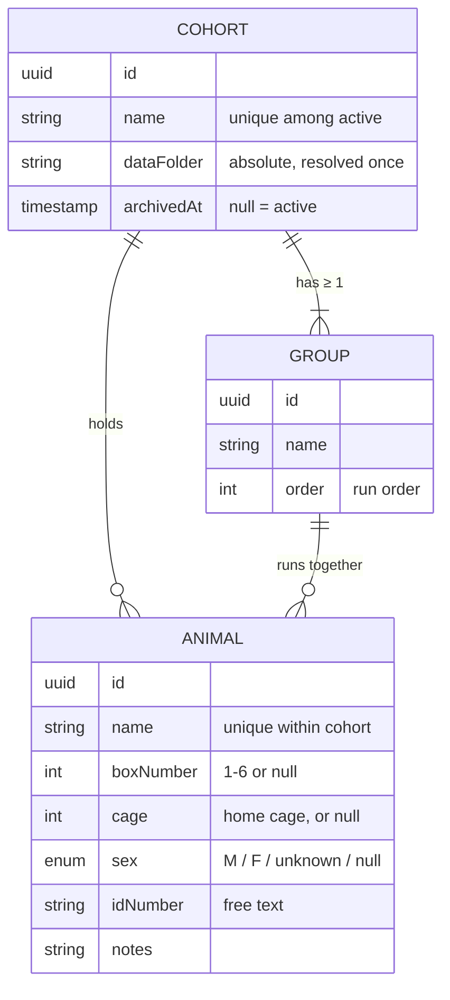
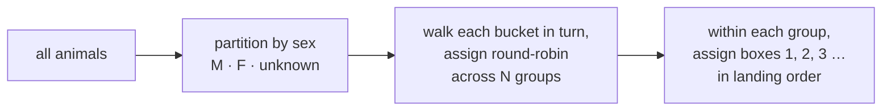

# Cohorts

 

> **What this is** · The Cohort / Animal / Group data model and everything the Cohorts tab does with it.
>
> **Owns** · The data model and its validation · the cohort browser and procedural icon · the create/edit flow · Auto-Balance grouping · data-folder resolution · archive and delete semantics.
>
> **Read with** · [data.md](data.md) (the SQLite schema, and the folder written beneath) · [dashboard.md](dashboard.md) (what a session does with a cohort) · [settings.md](settings.md) (box bindings, which the editor gates on).

**Contents** — [1. Data model](#1-data-model) · [2. Validation](#2-validation-rules) · [3. Persistence](#3-persistence) · [4. The browser](#4-the-cohort-browser) · [5. The icon](#5-procedural-icon-generation) · [6. Create / edit](#6-create--edit--manage) · [7. Auto-Balance](#7-auto-balance) · [8. Data folder](#8-data-folder-resolution) · [9. Archive & delete](#9-archive--delete-semantics)

---

## 1. Data model



```ts
Cohort {
  id: uuid
  name: string                    // unique among active (non-archived) cohorts
  animals: Animal[]
  groups: Group[]                 // always ≥ 1
  dataFolder: string              // absolute path, resolved once at creation
  iconSeed: id                    // derived from the cohort id — nothing extra stored
  createdAt, updatedAt: timestamp
  archivedAt: timestamp | null    // soft-delete
}

Animal {
  id: uuid
  name: string                    // unique within the cohort
  boxNumber: 1–6 | null           // standing/default box assignment
  cage: int | null                // home-cage number — cagemates share one
  groupId: uuid                   // every animal belongs to exactly one group
  sex: "M" | "F" | "unknown" | null   // an enum, because sex-balanced grouping needs it
  idNumber: string | null         // tag/ear-notch/RFID — free text, ID schemes vary by lab
  notes: string | null
}

Group {
  id: uuid
  name: string                    // user-defined, or auto "Group 1" / "Group 2"
  order: int                      // run order for consecutive execution
}
```

A cohort can be created with **zero animals** and populated over following days — real lab setup is rarely a single sitting.

---

## 2. Validation rules

| Rule | Detail |
|---|---|
| **Cohort name** | Unique among **active** cohorts. Archived cohorts don't block reuse of a name |
| **Animal name** | Unique within its own cohort, not globally |
| **`boxNumber`** | An abstract slot `1`–`6`, validated against that fixed range **and nothing else** |
| **`boxNumber` uniqueness** | Scoped to the **group**, not the cohort |
| **`cage`** | An integer ≥ 1. No upper bound, no occupancy limit, **no interaction with groups** |
| **Groups** | Always exist, implicitly if the user never makes one |

> [!IMPORTANT]
> **`boxNumber` is never validated against which boards happen to be bound right now.** The app runs on two lab machines with independent bindings against a shared data directory, so a cohort configured on one must stay loadable, editable, and savable on the other. Narrowing what may be *stored* would make a cohort un-editable on whichever machine has fewer boxes.
>
> **The editor is a separate question, and it is opinionated.** It offers only boxes bound on *this* machine, because offering one that doesn't exist produced an assignment nobody could honour — discovered halfway down the session flash sequence rather than at the moment of the mistake.
>
> **The two halves must stay distinct:** `src/lib/cohorts/boxAvailability.ts` holds the machine-local opinion, the sidecar holds the range rule, and neither should be "fixed" into the other.

> [!CAUTION]
> **A stored assignment this machine can't honour is kept and reported, never rewritten.** A box that is merely unplugged is still the box that animal belongs in; silently clearing it would turn a loose USB hub into data loss. The editor names the affected animals and the browser grid flags the cohort — and both fall silent when the sidecar is disconnected, because detection is unknowable then and reporting blindness as a fault is worse than saying nothing.

**Why box uniqueness is per-group.** Two animals in *different* groups can share `boxNumber: 3` — groups run **consecutively**, so the same physical box slot is legitimately reused across them. Two animals in the *same* group cannot. Animals with `boxNumber: null` don't collide with anything.

**Why groups always exist.** If the user never creates an explicit group, all animals belong to a single default group created transparently. That keeps "grouped" and "ungrouped" cohorts on **one code path** rather than a special case — a cohort with 3 animals and 3 boxes just happens to have exactly one group.

**What groups are for.** Splitting a cohort larger than the available box count into consecutive runs — six rats, three working boxes, so two groups of three run back-to-back rather than simultaneously.

**What `cage` is for.** Housing and run order are independent facts, so cagemates legitimately land in different run groups. `null` means "cage unknown," which is true of every animal entered before the field existed. The 3D constellation is the consumer: cagemates share one ship in orbit — so the field changes **what the sky draws, never what a session may do**.

---

## 3. Persistence

Cohort / Animal / Group data lives in **SQLite**, owned by the Python sidecar. The database file lives in the **app's own data directory** — *not* inside the user-configured `dataDirectory`.

> [!NOTE]
> That setting is where behavioral session output lives and gets browsed by lab members; mixing an opaque `.db` file into it would be confusing, and it is not a `.json`/`.mat`/`.tsv` session artifact.

The schema has grown well past the three cohort tables. **The full schema, the migration rules, and how the database is backed up all live in [data.md §6](data.md#6-the-sqlite-database)** — including the one rule that bites:

> [!CAUTION]
> Adding a **table** needs nothing but a `CREATE TABLE IF NOT EXISTS`. Adding a **column** needs a `MIGRATIONS` entry as well, or it appears only on freshly-created databases. See [data.md §6.3](data.md#63-changing-the-schema).

---

## 4. The cohort browser

Route `/cohorts`.

- **A responsive card grid, not a list** — "visualizing and selecting" calls for something you scan visually, not read top to bottom.
- **Card material:** `Nebula` surface, `Halo` hairline border, standard `md` radius.
- **Card contents:** the procedural icon, the cohort name in Inter (**not** Space Grotesk — that face stays confined to section headers), and a small stat line in JetBrains Mono (animal count, group count if > 1).
- **Motion:** spring-based hover/press; the icon's twinkle subtly accelerates on hover.
- **Search and sort:** a text filter and a name/recency sort above the grid.
- **Archived cohorts are hidden by default**, behind a *Show archived* toggle. Restore and permanent-delete live only there.

**The "+ New Cohort" tile** is always first in the grid and visually distinct rather than just another card: a dashed `Halo` border instead of solid, and a single dim, slowly pulsing star instead of a full generated system — *a nebula that hasn't collapsed into a star system yet*. Hover brightens the pulse.

---

## 5. Procedural icon generation

Each cohort's icon is **derived, not stored** — computed client-side from the cohort's `id` every time it renders. Nothing about it needs a database column beyond the id that already exists.

1. Seed a small deterministic PRNG (`mulberry32`) from the cohort `id`.
2. **Node count** = number of animals, capped at 8. Above 8, render a denser "cluster" glyph rather than placing nodes individually.
3. **Layout:** nodes at seeded angle + radius within a bounded circle, angularly spaced (`360° / nodeCount`) plus small seeded jitter so it doesn't look mechanically even.
4. **Connections:** each node links to its nearest neighbour(s), as thin `Pulsar` lines at reduced opacity — the exact line treatment the hardware status widget uses, so the two read as one visual family.
5. **Colour:** primarily `Pulsar`, with seeded per-node size and opacity variation. **Exactly one node** per icon renders in `Ion` — a single hero star for visual pop without introducing a hue outside the palette.
6. **No glow, no gradients.** Flat matte fills only.
7. **Animation:** gentle independent twinkle per node, falling back to a static render under reduced motion.

> [!NOTE]
> **Group membership is deliberately not encoded.** The icon stays a pure "how many animals" glyph, with group count left to the text stat line. Making it also convey grouping would turn a fun identifier into a dense infographic.

> [!TIP]
> This is the **second** of the three constellations in the app, and its link rule is nearest-neighbour — unlike the status widget's declared adjacency and unlike Mission Control's asterism. See [dashboard.md §1.7](dashboard.md#17-the-signature-element--the-constellation-status-widget).

---

## 6. Create / edit / manage

One component, two shapes: `/cohorts/new` and `/cohorts/:id`.

> [!IMPORTANT]
> **Creating is a flow; editing is a form.** A new cohort reveals its sections in order — name, then roster, then groups and boxes — each arriving as the one above it is satisfied, so there is exactly one thing to do at a time and the order needs no explaining. An existing cohort shows everything at once: you came back to change one thing, and being walked past the other three would be an obstacle.
>
> The reveal collapses to a plain conditional under reduced motion — **the *ordering* is the information, and it survives without the movement.**

The readiness strip doubles as the flow's spine. Its three checkpoints (*named* / *has animals* / *session-ready*) each correspond to a section below, so it reads as "where am I" as well as "what's missing." It remains **coaching, never a gate** — a cohort can be saved incomplete at any point. The sole exception is that Create is disabled without a name, since that is a request the sidecar would only reject.

### Sections

| Section | Contents |
|---|---|
| **Name** | Autofocused on a new cohort, carrying the attention pulse until filled |
| **Data folder** | Only asked for when no `dataDirectory` is configured; otherwise derived, and asking would be noise mid-flow |
| **Animals** | Biographical data only — name, sex, ID number, notes |
| **Cages & spaceships** | Every animal is a draggable crew chip, every cage a "spaceship" card, plus a dashed dock holding the unassigned |
| **Groups & boxes** | One card per group showing full membership: add/remove/rename, reorder to set `order`, move an animal between groups, assign its box |

**Bulk entry is the primary way into the roster.** One field takes a comma-, newline- or tab-separated list (a spreadsheet column pastes straight in) **or** a prefix and a count (`R- × 8` → `R-1`…`R-8`).

> [!TIP]
> **Names already in the cohort are skipped rather than added**, because duplicates are a validation failure and a double paste would otherwise turn the whole roster red. A single blank-row button stays for the afterthought animal.

**Cages are optional at every point and never a gate.** An animal left on the dock flies solo in the constellation, exactly as every animal did before cages existed. Empty ships live only in component state — *a cage with no animals isn't a fact the roster can carry*, since `cage` lives on the animal.

> [!IMPORTANT]
> **Box assignment lives in the Groups panel, not the Animals list**, because uniqueness is scoped per group — it is a property of a *membership*, not of an animal, and only makes sense with the whole group visible at once.

The panel is always present, since assignment has to happen somewhere regardless of group count; a single group renders as a quiet unlabeled card rather than exposing rename/reorder chrome nobody needs yet.

**Box selectors offer only boxes bound on this machine**, labelling any that isn't currently connected. **A box already taken within the same group isn't offered at all** — prevention rather than a save-time error.

**The panel points at the one misconfiguration that actually bites**: more animals in a single group than the rig has boxes. That can't be fixed by assigning more carefully, so the panel says so, pre-fills the split count, and opens Auto-Balance rather than leaving it to be discovered one empty dropdown at a time. A per-group **Fill boxes** button handles the opposite case.

### Colour and severity

| | Used for |
|---|---|
| 🔴 **error** | What will fail on save — missing or duplicate name, duplicate box within a group |
| 🟡 **warning** | Preconditions that still save fine — a box not connected or not set up, a group larger than the rig |
| 🟢 **Ion** | Completed readiness checkpoints, and nothing else |

The attention pulse marks the single control the flow is waiting on, and is **never applied to two things at once**.

Validation errors surface **inline against the offending row**, not as a toast after the fact.

---

## 7. Auto-Balance

A tool inside the Groups panel that proposes a full grouping rather than requiring animal-by-animal placement. It is **a suggestion the user reviews and can hand-edit, not a silent bulk mutation.**

### 7.1 Inputs

Either **number of groups** or **max group size** — whichever isn't chosen is derived from the other.

A **Balance by sex** checkbox is available whenever at least one animal has `sex` set to `M` or `F`; otherwise it is disabled, since there is nothing to balance against.

> [!NOTE]
> Group size pre-fills with the number of boxes **bound** on this machine — editable, not enforced. Bound rather than currently *detected*, matching what the box selectors offer: a box that is merely unplugged is still one this cohort can be planned around, and a default that changed as USB re-enumerated would be worse than useless.
>
> When the panel is opened because a roster outgrew the rig, the group count arrives pre-filled with `ceil(animals / boxes)` rather than a generic 2 the user has to correct.

### 7.2 The hard constraint

> [!IMPORTANT]
> **No group may exceed 6 animals.** `boxNumber` only spans 1–6, so a larger group could never get fully and uniquely assigned within itself regardless of grouping strategy. A request that would violate this is **rejected**, with the minimum viable group count suggested instead: `ceil(animalCount / 6)`.

### 7.3 The algorithm

A **balanced round-robin**, not an optimization search — simple, deterministic, and easy to reason about.



1. Partition animals into buckets by `sex`: `M`, `F`, `unknown`/`null`.
2. Walk each bucket in turn, assigning animals to the N target groups round-robin (group index cycles 0, 1, … N−1, 0, 1, …) so each bucket spreads as evenly as possible.
3. This naturally keeps group sizes **within 1 of each other**, and — when sex data is present — keeps each group's sex ratio as close to the cohort's overall ratio as the numbers allow. Animals with no sex data don't skew the balance; they fill in size-wise after the known buckets are distributed.
4. Within each resulting group, **box numbers are auto-assigned sequentially** in the order animals landed there — turning tedious manual bookkeeping into a byproduct of grouping rather than a separate step.

### 7.4 Flow

> [!IMPORTANT]
> **Always a full re-proposal, never an incremental fill-in.** Auto-Balance considers the complete current roster and proposes an entirely new grouping from scratch; it does not preserve or merge with whatever grouping already exists. That is simpler to reason about than partial-merge logic — and since the result is shown as a preview before anything is written, there is no ambiguity about what changes.

1. Set group count/size and (optionally) sex-balancing.
2. The tool displays a **preview** — proposed groups, their animals, and auto-assigned box numbers — using the same card treatment as the regular Groups panel, so it isn't a jarring separate UI.
3. **Hand-adjust the preview** before committing: drag an animal to a different group, change a box number.
4. **Apply** commits it as an ordinary groups/animals patch — no separate "apply" command.
5. **Cancel** discards it with no changes made.

---

## 8. Data folder resolution

**On creation**, if the user doesn't override it: `dataFolder = <dataDirectory>/<sanitized cohort name>`. If that path already exists on disk, a numeric suffix is appended (`-2`, `-3`, …) until unique.

**The resolved path is persisted verbatim** — computed once, not re-derived from the current name on every read.

> [!IMPORTANT]
> **Renaming a cohort does not move its data folder.** Name and `dataFolder` are deliberately decoupled after creation — an automatic move-on-rename is exactly the kind of implicit file operation this project avoids everywhere else. The detail view surfaces the real path plainly at all times, so there is never ambiguity about where the data actually lives.

**Relocating is a separate, explicit action** — *Change data folder…* — distinct from renaming. It carries **two intents**, chosen by the *Move existing contents* toggle, and they have **opposite** requirements for the destination:

| Toggle | Meaning | Destination |
|---|---|---|
| **On** | Move this cohort's data to the new folder | **Must be empty.** Refuses rather than merging into or overwriting |
| **Off** | Point this cohort at data that is already there | **Expected to be full.** Nothing is moved or written; only the recorded path changes |

> [!WARNING]
> **The "off" case is how a cohort attaches to an archive written before this app existed** — the whole reason [orphan adoption](data.md#82-what-adoption-handles) exists. Enforcing the empty-destination rule in *both* cases made that intent impossible to express: the only control for it rejected exactly the folders it was meant to accept, and because the field then re-rendered the unchanged path, it read as the setting silently reverting.
>
> The rule protects against merge collisions, and **there are none when nothing is being written.**

---

## 9. Archive & delete semantics

Two distinct actions, not one.

| Action | Meaning |
|---|---|
| 🗄 **Archive** (soft-delete) | The everyday "delete a cohort." Removes it from the active grid, keeps the record and its `dataFolder` fully intact, reversible via *Show archived* → Restore |
| 🗑 **Permanent delete** | Available **only from the archived view**, on an already-archived cohort. A two-step guard rather than a single destructive button on a live cohort |

> [!IMPORTANT]
> **Deleting the cohort record never touches its `dataFolder` on disk.** The app removes its own bookkeeping, never a user's actual data files.

> [!NOTE]
> **Archive has no confirmation, deliberately** — it is the reversible everyday action, and only permanent delete is gated. Worth revisiting if it proves too easy to trigger on a large cohort.

---

**Where to next** — [dashboard.md](dashboard.md) (running a session against a cohort) · [data.md](data.md) (what gets written beneath the data folder) · [settings.md](settings.md) · [README.md](README.md)
