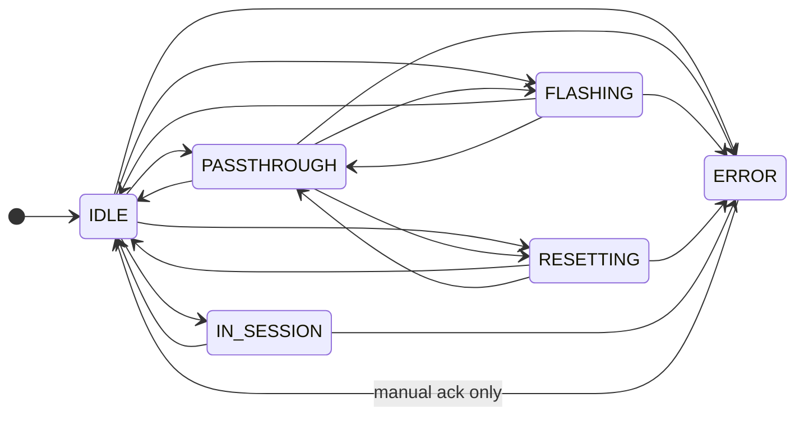
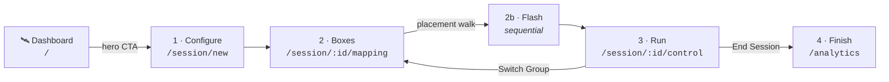
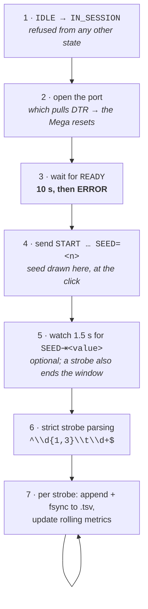

# Dashboard

  

> **What this is** · The app as a person sees it — the theme, every screen, and the whole path from the launch button to a running box.
>
> **Owns** · App identity and theme tokens · the shell and its navigation · every route's shape · **the per-port state machine** · flashing, reset and passthrough · the session flow · Mission Control and the 3D constellation.
>
> **Read with** · [settings.md](settings.md) (the rig wiring behind Debug Mode) · [tasks.md](tasks.md) (the sketch a box carries) · [data.md](data.md) (what a running session writes).

**Contents** — [1. Theme](#1-identity--theme) · [2. The shell](#2-the-shell) · [3. Dashboard](#3-the-dashboard) · [4. Debug Mode](#4-debug-mode-debug) · [5. **The port state machine**](#5-the-per-port-state-machine) · [6. Flash · reset · passthrough](#6-flashing-reset-and-passthrough) · [7. The session flow](#7-the-session-flow) · [8. Mission Control](#8-mission-control) · [9. The 3D constellation](#9-the-3d-constellation) · [10. `IN_SESSION`](#10-in_session-entry-and-exit)

---

## 1. Identity & theme

**Ephymeris** — a deliberate misspelling of *ephemeris* (the astronomical table of a celestial object's positions over time), punning on *ephys*. It is a real astronomy term and it nods at the neuroscience-adjacent research context.

### 1.1 Design thesis

The app is, functionally, a **mission-control console**: six independent instruments that need to be monitored, commanded, and trusted at a glance, often during a live, time-sensitive session. That is the observatory half of the theme. The Linux half shows up as *texture, not costume* — monospace data readouts, terminal-inflected debug tooling, unglossy surfaces. Apple's influence is procedural: clarity, restraint, and material honesty rather than literal macOS chrome, since production machines are Windows.

### 1.2 Palette

Dark mode is the default and, for v1, the **only** mode — light mode is out of scope entirely, including as a placeholder toggle.

| Token | | Hex | Usage |
|---|---|---|---|
| **Void** |  | `#0B0B10` | Base app background — near-black, faint cool undertone |
| **Nebula** |  | `#16151F` | Elevated surfaces: cards, sidebar, panels |
| **Halo** |  | `#2C2A3A` | Hairline borders, dividers, inactive/idle indicators |
| **Pulsar** |  | `#8B7EC8` | Primary accent — matte, desaturated purple |
| **Ion** |  | `#7CC98F` | Secondary accent — muted terminal green. "Connected / nominal" only |
| **Starlight** |  | `#EDEBF6` | Primary text |
| *Static* |  | `#948FA8` | Secondary and muted text |

> [!IMPORTANT]
> **The core stylistic bet — protect this one.** No gradients on the primary accent. No glossy highlights, no glow effects on `Pulsar`. Saturation stays low (~30–35%) so the purple reads as a **material**, not a light source. This is the thing to defend against scope-creep-by-gradient.

`Static` is a seventh declared `@theme` colour and is deliberately **not** one of "the six": it is a text weight, not a colour decision. Three `status-*` values carry state. Everything is declared in one place — `src/styles/index.css`, a Tailwind v4 `@theme` block. **There is no `tailwind.config.js`.**

Two data-visualization ramps were added for Analytics and change nothing above; their values and derivation live in [data.md §11.8](data.md#118-palette-additions).

> [!TIP]
> Void, Nebula, Halo, Static and Starlight all sit at **hue 285–295** — the entire neutral stack is tinted toward Pulsar's 291. That is *why* the app reads as one coherent thing rather than a dark theme with a purple accent bolted on, and it is the rule any future token should respect.

### 1.3 Typography

| Role | Face | Used for |
|---|---|---|
| **Display** | Space Grotesk | Dashboard title, section headers — geometric, slightly technical, and the name is a small on-theme wink |
| **Body / UI** | Inter | All interface text, buttons, labels. The closest widely-available cross-platform analog to SF Pro's neutrality |
| **Mono / Data** | JetBrains Mono | Timestamps, port names, box/cohort IDs, hex values, and all console text — where the Linux identity actually lives |

> [!WARNING]
> **Space Grotesk stays confined to headers.** Mixing it into body text dilutes it into "just another sans," which is the whole reason it was chosen.

### 1.4 Layout & materials

- **Radius scale:** `6 / 10 / 16 / 24px` (sm/md/lg/xl), applied consistently — no ad hoc radii.
- **Elevation:** subtle shadow + a 1 px `Halo` hairline border, not heavy drop shadows.
- **Vibrancy:** sidebar and modal surfaces use a translucent `Nebula` tint with `backdrop-filter: blur(20px)` — used **only** on persistent chrome and transient overlays, never on primary content cards.
- **Squircle, used once:** the app mark uses a continuous-corner shape via `clip-path`. Not applied to buttons or cards generally — this is the one place it is spent.

### 1.5 Motion

Framer Motion **spring physics** (not duration/easing curves) for nav selection, panel transitions, and modal open/close.

Ambient motion is restrained and functional: a slow (60 s+) very low-opacity drifting starfield behind dashboard content, which respects `prefers-reduced-motion` and pauses when the window loses focus — this app is often watched during live data collection, so ambient effects can't compete for attention.

> [!NOTE]
> **One acknowledged exception to the spring rule:** the 3D constellation's zoom-to-star camera move uses **cubic easing**, because a camera flythrough should read as cinematic rather than mechanical and a spring fights that. It is the only eased move in the app; everything else, including the panel that opens on arrival, stays on springs.

### 1.6 Iconography

Lucide, as the practical SF-Symbols analog: consistent stroke width across every icon, **outline-only** — no mixing filled and outlined icons.

### 1.7 The signature element — the constellation status widget

The hardware status indicator in the sidebar renders as a small **constellation map** rather than a plain row of status dots: nodes in the chosen zodiac layout, thin `Pulsar` lines connecting adjacent nodes when both boxes are connected and nominal. A line dims or breaks on disconnect; a node turns error-red on fault.

This is the one place the astronomy metaphor is spent deliberately — it isn't decoration, it is the actual at-a-glance system-health readout.

| Rule | Detail |
|---|---|
| **Only bound boxes appear** | A rig running two boxes shows two nodes, not two nodes and four permanently grey ones implying four boards are missing. The caption reads `N/M boxes`, or `no boxes configured` |
| **Positions are pinned per assigned star** | A box sits on its star until the user drags it elsewhere in Config. Positions are what make the map glanceable, so they must never reflow as health changes |
| **The frame reflows, not the layout** | In zodiac mode the frame fits the **whole** asterism, occupied stars and empty alike — the recognizable shape is the point, and it must not warp as boxes come and go |
| **Marks keep a constant apparent size** | Node radius and line width scale with the frame, so zooming spreads the *spacing* rather than inflating the dots |
| **An edge needs both endpoints** | A sparse selection (boxes 1 and 6) can show unconnected nodes — honest, since there is no adjacency to report |
| **Unoccupied stars render faint** | Halo fill, reduced radius — visibly different from an `absent` box, which keeps full radius |

> [!CAUTION]
> **Two constellations, two different linking rules — don't conflate them.** This widget draws a **declared** adjacency map (the chosen zodiac's stick figure), because a status readout has to be glanceable and must not reflow. Mission Control's 3D constellation ([§9](#9-the-3d-constellation)) is a different object entirely, with its own placement and link rules. They share a visual family and nothing else.

---

## 2. The shell

### 2.1 Layout

Two regions: a persistent left sidebar (frosted glass, translucent `Nebula`) and a main content area. **No top menu bar** beyond the custom titlebar — all navigation lives in the sidebar. The titlebar is app-drawn on **both** platforms; native window decorations are disabled and minimize/maximize/close are rendered by the app. The bar itself is a drag region.

### 2.2 The sidebar

Two groups, 200 px wide:

| | Item | Route |
|---|---|---|
| 1 | 🛰 **Dashboard** | `/` — default. Active for `/`, `/session/*` **and `/debug`**; carries a matte status dot while a session runs |
| 2 | 👥 **Cohorts** | `/cohorts` |
| 3 | 🔀 **Task** | `/task` |
| 4 | 📈 **Analytics** | `/analytics` |
| — | *(pinned to the bottom)* | |
| 5 | 📡 **Config** | `/config` |
| 6 | ⚙️ **Settings** | `/settings` |

Then a hairline divider and the constellation status widget ([§1.7](#17-the-signature-element--the-constellation-status-widget)) at the very bottom — always visible regardless of which section is active, since box connectivity is something the user should never have to navigate to check.

Selection is one shared `layoutId` pill, so the highlight glides between the two groups as readily as within one.

> [!NOTE]
> **There is no Debug nav entry.** The tab was a second door to a room the user was already standing in: the Dashboard's sky **is** the rig, selecting a box flies the camera in and opens its instrument panel, and `/debug` is that same sky with the flight completed.
>
> The route stays — it is where the instrument panel lives — and counts as **Dashboard** for the nav highlight, exactly as `/session/*` does. **With no box selected, `/debug` redirects to `/`**, which covers every exit path (the panel's Back control, Escape, clicking empty space, a box being unbound out from under an open panel, and a cold load with nothing selected).
>
> Config and Settings are sidebar-only and not duplicated as dashboard tiles, following the convention that configuration lives in one fixed, always-reachable place rather than as browsable content.

### 2.3 One sky, across views

**The rig's 3D constellation is the Dashboard page**, and Debug renders the same sky with the camera flown in. There is **one app-wide WebGL canvas** the views adopt in turn — never a canvas per view.

The camera pose and the selected box persist in `lib/constellations/viewMemory.ts`, keyed by subject (`"rig"`; Mission Control keys per cohort), so navigating Dashboard ↔ Debug lands exactly where the other view left off, selection included. Memory is **per-sitting** by design — a fresh launch starts at the overview; it is the within-session snap-back that would read as a glitch.

> [!IMPORTANT]
> **The sky is never animated, in either view.** Both routes keep the canvas host *outside* their entrance transition and fade only their chrome. The shared canvas physically lives in the active view's subtree, so a view-level opacity animation fades the constellation with it — and because both views show the same sky, navigating between them made it blink out and back on every arrival. **Chrome crossfades, sky holds still. Any new view that hosts the constellation must follow the same rule.**

> [!IMPORTANT]
> **Debug is the Dashboard's twin, pixel for pixel.** Full-bleed sky, header overlaid on the same title grid (32 px indent, 28 px down), detail panel docked at the same 16 px insets. That is what makes the handoff seamless: the two views hand the one shared canvas an **identical rectangle**, so the transition needs no resize, aspect change, or reflow. The old layout gave it a different rectangle and every handoff resized the renderer mid-navigation.

---

## 3. The Dashboard

Route `/`. Two columns of translucent HUD tiles docked over the full-bleed sky. Both containers ignore the pointer, so the sky between them still orbits.

### 3.1 The command column (left)

*"What do I do now," in one stack.*

- **Page title.**
- **Hero CTA** — "Start a Session," primary `Pulsar`-filled, and the one deliberately **opaque** tile: the primary action doesn't dissolve into the sky. It navigates straight to its destination — `/session/new` normally, `/cohorts` when no cohort exists yet, Mission Control while a session runs ("Resume Session"). On hover the rocket lifts toward its heading and a looping booster trail streams behind it — fire drawn with **motion, not colour or glow**; the loop stands down under reduced motion.
- **Session dock** — everything `sessions.active` reports: the running session's card (live per-box liveness, Open Mission Control, End Session), `configuring` set-ups (Resume setup / Discard), and crash-orphaned `stale` rows shown **read-only** (View in Analytics / Close out — **never** Resume). Renders nothing when there is nothing to act on, and nothing before `sessions.active` has answered — the no-spinner rule.

### 3.2 The overview column (right)

| Card | Contents |
|---|---|
| **Cohorts** | Active cohorts with animal/group counts; rows open the editor, deferring to the grid past five rows. Header opens `/cohorts` |
| **Rig** | One row per bound box with a health dot, label, and state. Clicking a row sets the rig selection and lands in Debug with the camera already flying — exactly as clicking its star does |
| **Analytics** | A reward-accuracy sparkline per cohort, plus the three most recent sessions read from the archive itself |

> [!NOTE]
> **The Rig tile is a readout, not a destination.** Its header states rig health (`n/m connected`) and carries no link or arrow, because the sky on this page **is** the rig and selecting a box is what opens its panel. `SummaryCard`'s `onOpen` is optional for exactly this reason, and its absence is the signal — *a card with one is a destination, a card without one is a readout.*
>
> It keeps a single link, to Config, and only when no box is bound — that is the one repair a click on the sky cannot perform. It also carries one quiet mono line at its foot, *select a box for its console*, shown only when boxes **are** bound: the only standing sign that per-box consoles exist. Deliberately a note and not a link, because it names a gesture and there is no single box to send anyone to.

The Analytics sparkline is **the earned-drop rate, not choice accuracy** — a correct choice that failed the hold counts against it ([data.md §9.8](data.md#98-rewarded-accuracy-vs-response-accuracy)). Fixed shared domain with a guide line at 0.5 so cohorts compare at a glance, and the latest value prints beside the line so the number is never colour-alone. The recent-session rows come from folder names only, never a file open — so sessions **another** Ephymeris machine wrote into a shared data directory appear here marked "not indexed," where this machine's database could never see them.

---

## 4. Debug Mode (`/debug`)

The same sky, with a box selected and the camera flown in. **Every bound box is selectable, however sick** — this is the deliberate divergence from Mission Control, where an unlit star is inert by construction: an absent or faulted box is precisely the one you came here to open.

### 4.1 Star colour and motion

**Colour is temperature here too.** A box's star takes the same stellar ramp Mission Control uses, and its temperature is the **mean recorded accuracy of the animals assigned to that box** — each animal pooled across *all* of its scored sessions. A box with nothing scored sits at the cool end rather than claiming warmth.

**Status moved fully into motion**, which is what lets colour carry performance:

| State | Reads as |
|---|---|
| **Detected** | The surface churns, and a mote orbits |
| **Undetected** | The photosphere is **frozen** — stillness is the status, written into the star itself |
| **Open** (passthrough or in session) | A slow dashed instrument ring |
| **Faulted** | A thin steady error-red ring — status colour's one holdout, because a fault must not be readable as merely a cool star |

### 4.2 The node detail panel

Selecting a star flies the camera to it and **docks the panel over the still-rendering scene** — translucent Nebula with a vibrancy blur. Arrival means the camera is now close to that box's star with an instrument panel open, **not** a cut to a different screen.

Grouped by intent rather than compressed into one header row:

| Group | Controls |
|---|---|
| *Identity* | Hardware id in mono, port, carried sketch |
| **Connection** | State badge, baud select, open/close, reset, error acknowledge, rejection surface |
| **Sketch** | Flash dialog; utility controls + telemetry strip for a `"kind": "utility"` profile |
| **Console** | Scrollback, send with line-ending selector, copy log, save to file |

> [!IMPORTANT]
> **"Carrying" is the baseline's word, not the flash dialog's.** A box the baseline reports `ready` has the configured utility sketch on it *right now*, so its controls and telemetry are populated from the first open with no manual flash. The sidecar's per-box belief outranks the client-tracked flash, which goes stale the moment a background restore re-flashes over it. Flashing a *different* sketch moves the box off `ready` and the tracked flash takes over until the baseline reclaims the port. See [settings.md §8](settings.md#8-the-hardware-utility-baseline).

**The console is two tabs, Console and Status.** A utility sketch emits a telemetry line on every state change *plus* a ~1 s heartbeat, so interleaved they bury the command echoes, boot banner, and self-test confirmations the console exists to show. The split is by the profile's `telemetry.match` (default `STATUS`) and applies only to **received** lines — a sent `STATUS?` is a command echo and belongs beside what it caused.

> [!WARNING]
> **This splits what is displayed, not what is kept.** Both tabs read the one capped ring buffer (~2000 lines/box). A 1 Hz heartbeat therefore still consumes that budget — roughly half an hour of scrollback on a chatty utility sketch — so a long priming session can age out earlier console lines even though the Console tab looks quiet. The copy-log affordance is the escape hatch.

Escape, Back, or clicking empty space flies back out — and, since that clears the selection, redirects to `/`.

Mounting `/debug` triggers a sketch rescan.

---

## 5. The per-port state machine

Each of the six ports runs its **own independent state machine**, enforced in [`ports/states.py`](../sidecar/ephymeris_sidecar/ports/states.py).

> [!IMPORTANT]
> **The invariant everything here exists to protect: a serial port has exactly one owner at a time.**

### 5.1 States

| State | Description |
|---|---|
| `IDLE` | Port not open. No owner. The board may or may not be physically connected |
| `PASSTHROUGH` | Port open, raw bidirectional serial streaming to/from the GUI. No parsing, no storage |
| `FLASHING` | `arduino-cli` compile + upload in progress. Port exclusively owned by the upload |
| `RESETTING` | Brief transitional state — DTR toggle in progress |
| `IN_SESSION` | Port owned by the session runner. Strict strobe parsing; output feeds the storage pipeline |
| `ERROR` | Port failed to open, board disconnected unexpectedly, or an operation failed |

### 5.2 Transitions

| From | May go to |
|---|---|
| `IDLE` | `PASSTHROUGH` · `FLASHING` · `RESETTING` · `IN_SESSION` · `ERROR` |
| `PASSTHROUGH` | `IDLE` · `FLASHING` · `RESETTING` · `ERROR` |
| `FLASHING` | `IDLE` · `PASSTHROUGH` · `ERROR` |
| `RESETTING` | `IDLE` · `PASSTHROUGH` · `ERROR` |
| `IN_SESSION` | `IDLE` · `ERROR` |
| `ERROR` | `IDLE` — **and nothing else** |

> [!WARNING]
> **Read the absences — they carry most of the meaning.**
>
> - **Nothing reaches `IN_SESSION` except `IDLE`.** In particular `PASSTHROUGH → IN_SESSION` is illegal, which is exactly why the session flash sequence passes `suppressPassthroughResume: true` — a box that auto-resumed into passthrough after its flash could not then be claimed by the runner.
> - **`IN_SESSION` leads only to `IDLE` or `ERROR`.** A running animal cannot be flashed, reset, or monitored out from under itself.
> - **`ERROR` is a dead end until acknowledged.** Only a manual `port.error.ack` clears it. There is no timeout and no retry. This is why a failed flash cannot simply be retried — acknowledge first.

A transition to the state a port is already in is a **silent no-op**, not an error.

### 5.3 Exclusivity rules

- Only one state may be active per port at any time.
- Entering `FLASHING` or `RESETTING` **forces a clean release** of `PASSTHROUGH` first — close the port cleanly before handing it to `arduino-cli` or toggling DTR.
- **Auto-resume:** if the port was in `PASSTHROUGH` immediately before a flash or reset, the sidecar auto-resumes `PASSTHROUGH` afterward, so the user sees the new sketch's output without an extra click.
- **One deliberate exception**: `port.flash` accepts `suppressPassthroughResume` (default `false`). The session flash sequence sets it `true`, forcing every box to land in `IDLE`. Debug Mode leaves it `false`.
- `IN_SESSION` is exclusive with everything.

> [!IMPORTANT]
> **All transitions are enforced in the sidecar, not the frontend.** The GUI disabling buttons is a UX courtesy, not the source of truth. An illegal transition is rejected server-side with a typed error code.

---

## 6. Flashing, reset and passthrough

### 6.1 Flashing

Two steps via `arduino-cli` (FQBN `arduino:avr:mega`): `compile` then `upload -p <port>`. Progress and errors stream to the frontend incrementally, not as a spinner-until-done — the gRPC daemon backend gives true line-by-line streaming rather than buffered replay.

The sketch comes from the categorized picker over the [Arduino Directory](tasks.md#2-the-arduino-directory) — there is no arbitrary file browse.

On failure (compile error or upload failure) the port transitions to `ERROR` with the parsed message surfaced; it does **not** silently fall back to `IDLE`.

### 6.2 Reset

Reset is a **serial-layer operation**, not an `arduino-cli` one — it does not go through the daemon. Toggle DTR, which the Mega2560 R3's auto-reset circuit interprets as a reset: close the port if open → `dtr = False` → ~100 ms → `dtr = True` → reopen. A short-lived `RESETTING` state that returns to its prior context afterward.

### 6.3 Passthrough — read

Serves two use cases with one implementation: the clean/prime workflow, and a general debug console for any sketch at any time a port isn't `FLASHING` or `IN_SESSION`.

| Property | Value |
|---|---|
| Data handling | **Opaque text**, decoded with error-replacement for bad bytes. Never passed through the strobe parser |
| Ring buffer | Last **2000 lines** per port. Debug output, not data to retain |
| Delivery | Batched and flushed on a **50 ms tick (20 Hz)**, never one message per line — six chatty boards would flood the UI |
| Unterminated line | Force-flushed once it exceeds **4096 bytes**, so a sketch that never sends a newline can't grow the buffer without bound |
| Line splitting | Accepts `\n`, `\r`, **and** `\r\n`. A trailing `\r` is held back briefly in case it's the first half of a CRLF split across two reads; after two flush ticks with no further data it is released, so a bare-CR sketch that prints once and waits still reaches the console |

> [!IMPORTANT]
> **Passthrough scrollback is ephemeral and never enters the storage pipeline** — not written to `.json`/`.mat`/`.tsv`, not associated with any cohort or session record. A copy-log / save-log affordance exists explicitly *outside* the formal data pipeline.

### 6.4 Passthrough — send

The same per-port handler object that owns the read loop exposes `write(bytes)` — reads and writes are never split across separate objects or threads for the same port, to avoid races with state transitions.

- **Line-ending selector per console:** None / `\n` / `\r` / `\r\n`. Default newline.
- Sent commands are echoed back into scrollback with a distinct prefix, so sent and received history is interleaved and reviewable.

> [!IMPORTANT]
> **Send is only permitted while the port is in `PASSTHROUGH`**, enforced in the sidecar rather than only by disabling the input — this guards against a queued send firing during a mid-flight state transition.

**Baud** is per-box and user-configurable, defaulting to `defaultBaud`.

> [!WARNING]
> **`defaultBaud` ships as 9600**, which is what every sketch in the lab's directory declares. It shipped as 115200 for most of v1, which was wrong for every box on both machines and wrong **silently** — a mismatched console prints nothing legible rather than reporting an error, so it reads as a dead board.

---

## 7. The session flow

### 7.1 "Ready to run"

A cohort is ready to start a session if it has **at least one group with at least one animal that has a `boxNumber` assigned.** A group with zero box-assigned animals is skipped automatically rather than blocking the whole cohort.

The hero CTA does an *existence* check only (`cohort count > 0`), deliberately — readiness is a property of one cohort, and Step 1 is where a cohort gets picked, so that is where the readiness check lives and warns.

### 7.2 Step 1 — configuration (`/session/new`)

| Field | Behaviour |
|---|---|
| **Cohort** | The same card-grid pattern as the Cohorts tab, not a plain dropdown — the user is already familiar with picking a cohort that way |
| **Prefix** | Dropdown over the global prefix list, with inline add/remove |
| **Session number** | Text field pre-filled with a suggestion (highest existing numeric number for that prefix, +1), degrading to "no suggestion" for a prefix with no numeric history |
| **Time limit** | Optional minutes. Empty = no limit |

**A soft warning, not a block**, if the chosen `(prefix, sessionNumber)` already has data from earlier the same day: reusing it is legal but usually accidental.

**Which group runs first is not a choice here.** The session begins with the cohort's lowest-`order` group that has at least one box-assigned animal — asking the user to also pick a starting group would be redundant with data they already set up.

> [!IMPORTANT]
> **The time limit is per-box, measured from each box's own start** — not from Start All. Boxes are started individually (a box can be restarted mid-group, a straggler started late), and the point of a time limit is that every *animal* runs for the same duration. It is stored on the `Session` record, so every group in a multi-group session runs under the same limit and a reloaded window still knows it. **Enforcement is sidecar-side, never client-side:** a closed or crashed frontend changes nothing about when boxes stop.

### 7.3 Step 2 — mapping and the guided placement walk (`/session/:id/mapping`)

A per-box card grid. This is a **confirm-and-configure step, not a console.** Each card shows the box number, the animal assigned to it, and:

- **Sketch selector** — the categorized picker, scoped to this one box.
- **Task config sub-form** — appears once a sketch is chosen, *only if that sketch has a profile*. Fields, labels, defaults and grouping come straight from the profile's `config` array.

  **Collapsed to a summary line by default**, showing how many values differ from the rig's saved defaults. It is collapsed because a behaviour sketch now declares forty-odd parameters: six cards' worth expanded inline would bury this step's actual job — confirming which animal is in which box, on which sketch — under two hundred inputs.

Configured **per box, independently**, matching real practice. Each box seeds from the merged profile + rig defaults ([tasks.md §6.1](tasks.md#61-the-three-layer-merge)) rather than from the profile alone, so "independently" costs nothing when every box wants the same thing.

> [!IMPORTANT]
> **Mapping changes here are session-local only.** They never write back to the cohort's stored mapping; permanent changes go through cohort management. That keeps this step's purpose singular — confirm and configure *this run*.

#### The guided placement walk

Confirming the mapping doesn't flash anything yet. It starts a **walk of the rig**: one animal at a time, in **box-number order**, with the app pointing at exactly one card and — where the hardware allows — lighting that box until the operator says the enclosure is closed.

> [!CAUTION]
> **Box order, not animal order.** The operator is walking down a bench. Sending them from box 5 to box 2 and back is how an animal ends up in the wrong chamber — the single failure this whole step exists to prevent. **A mis-placed animal produces a complete, plausible, silently mislabelled data file, and nothing downstream can detect it.**

- **The mapping locks while the walk runs.** Every card but the current one dims and stops accepting clicks. Changing a box number after animals are already in chambers would invalidate the placements behind it without saying so.
- **The lights are a confirmation, not the instruction.** The box's own number is on the card and on the chamber; the light is the app corroborating it. A rig with no utility sketch configured, a box still being restored, or a board that didn't answer all get the same walk with a line explaining to go by the number. **Refusing to continue because a bulb didn't light would be worse than the problem.**

The lighting is `utility.identify`, which is why this step sits **before** the flash sequence: the boxes are still carrying the utility sketch here, and that is the only firmware that can be asked to light one. Confirming the mapping is what puts the baseline on hold and extinguishes any remaining light.

**Leaving the step.** On first entry (session still `configuring`) Back returns to Step 1 and abandons the session record — marked `aborted` rather than left stranded. On re-entry via Switch Group the session already holds recorded group runs, so Back would be a lie; the step offers **End session** instead.

### 7.4 Step 2b — the flash sequence

Each box's sketch is flashed **in sequence, not in parallel**, reusing `port.flash` exactly. A box mid-flash shows its star "flaring" rather than a generic spinner, so the visual language stays consistent.

> [!TIP]
> **Recovering from a failed flash, in place.** A failed flash leaves its box in `ERROR`, and `ERROR → FLASHING` is refused — so a retry is rejected until the fault is acknowledged. The acknowledgement therefore lives **on the card that is stuck**: a faulted box shows its reason and an **Acknowledge** button, and Confirm-and-flash stays disabled while any mapped box is faulted, since the sequence would only halt on it again.
>
> Without this, the step most likely to *produce* a flash failure — a bad sketch is discovered here, not in Debug Mode — was the one place it couldn't be cleared.

A fault inherited from before a reload carries only the replay placeholder reason, so the card states plainly that the box is in an error state rather than repeating a word that explains nothing.

---

## 8. Mission Control

Route `/session/:id/control`. Full-bleed 3D constellation; nothing scrolls but the two rails.

### 8.1 Header

Always visible: session name (`<prefix>_<sessionNumber>`), date, current time, and session start time — all 24-hour.

### 8.2 Session-wide affordances

| Action | Behaviour |
|---|---|
| **Start All** | The per-box `IN_SESSION` entry sequence ([§10](#10-in_session-entry-and-exit)) for every box in the current group that isn't already running |
| **Switch Group** | Only shown for a cohort with more than one populated group, and only once a group has run. Ends the current group's runs, then re-enters **Step 2** scoped to the next group by `order` — since different animals are physically going into the boxes, the mapping/sketch/config confirmation and flash sequence genuinely need to happen again |
| **End Session** | Gracefully stops every running box, waits for each to finalize, marks the record `completed`, and lands on Analytics. A session with no run is **abandoned** rather than ended |

### 8.3 Per-box affordances

- **Start** — the entry sequence for that one box.
- **Stop** — sends the literal `STOP` line over that box's serial connection. The firmware checks for it once per trial boundary, so a trial in progress always completes before the board honors it. **This is firmware behaviour the app relies on, not something it enforces.**
- **Reset** — the DTR-toggle reset. Rebooting mid-session returns that box to waiting-at-`READY`; the operator presses Start again to resume.

### 8.4 Run clocks and the time-limit auto-stop

Each live box's card shows an elapsed clock — `m:ss` since *that box's* start, shown as `elapsed / limit` when the session carries a time limit.

> [!IMPORTANT]
> **The clock is driven by the runner's per-box `startedAt`, never by a client-side stopwatch**, so a reloaded window resumes mid-count instead of restarting from zero.

At the deadline the **sidecar** sends the same `STOP` an operator's press would — the auto-stop is exactly the per-box Stop with a scheduler behind it. Everything downstream is unchanged: the board finishes its trial, emits its end strobe, and the run finalizes through the normal path with the normal `stop_reason`. **The time limit decides *when* the request is sent, not *how* the run ends.**

Once time is up the clock stops counting and reads *"time up — stopping at the next trial boundary,"* because that is the true state: the request is in, and the board owns the timing of the end. **A box that ends early cancels its scheduled auto-stop** — a freed port must never receive a ghost `STOP`.

> [!WARNING]
> A sketch with **no** Task Profile declares no end strobe, so `STOP` alone cannot finalize it. For those, the time limit sends the request but the operator still closes the run out.

### 8.5 The group-swap prompt

When every box in the current group has finalized **and** another populated group is waiting, Mission Control prompts with the placement scene played backwards: the handler lifts the animal back out of the chamber and carries it home to its cage — literally the operator's next physical act — with a **Switch Group** button beneath it. Same scenery, same performers, mirrored choreography; the arrival flourish is omitted because leaving celebrates nothing.

The prompt appears whether the group ended by time limit, operator stop, or every board's own end strobe — *"everyone is done and more animals are waiting"* is the trigger, not how it came to be true.

### 8.6 Guided-flow chrome

**The journey rail** — a four-step indicator, **Configure → Boxes → Run → Finish**, rendered as constellation stars joined by a thin `Pulsar` path: completed stars filled, the current one pulsing in `Starlight` behind a flat expanding ring, upcoming ones `Halo` outlines. **No blur anywhere**, so the no-glow rule holds even on the pulsing element.

Beneath it, a single crossfading hint line — the only text direction in the flow — always naming the next action, plus the running group's position (`group 2/3 · Group B`). Deliberately always on and deliberately subtle: the flow is run by lab members who may use it infrequently, so the next action should never have to be inferred, but it also can't compete with live data for attention.

**The placement banner** — the box-placement instruction drawn rather than written: a lab member lifts an animal from its home cage and places it through the front door of a chamber, with the chamber's number lighting `Ion` once the animal is inside. It shows the box the walk is currently pointing at, and it is rendered **only while a walk is running** — Step 2's guided walk (§7.3) and Mission Control's reverse walk between groups (§5.5). It is an instruction, not decoration: on the confirm-boxes step and after the walk finishes there is no animal to carry, and a loop playing over the per-box settings forms would only pull attention off them.

> [!NOTE]
> **Deliberately off-theme in style, not in palette.** The rest of the app is schematic and flat; this one illustration is filled, rounded, and drawn in 3/4 perspective on purpose — it is the only moment in the flow about *handling an animal* rather than reading data, and it should feel warm. Every fill still comes from the six tokens, stays flat and matte, and takes its depth from face shading and a travelling ground shadow — never a gradient or a glow. Under reduced motion the scene renders as a still of the finished placement.

---

## 9. The 3D constellation

Built with `three.js` / `react-three-fiber`. The camera, controls, hover reticle, nameplates, arrival flight, and docked-panel offset all live in `components/constellation3d/Scene.tsx`, which **Debug Mode renders too**.

> [!NOTE]
> **The two views are the same instrument pointed at different things** — a cohort's animals here, the rig's boxes there. What each supplies for itself is the **body** of a star, because colour means different things in the two: rolling accuracy here, box health there. That is the one thing the shared module refuses to own.

### 9.1 Star identity and placement

**The scene is the rig's own asterism.** Whichever zodiac constellation Box Setup chose, and whichever star each box was slotted onto, is what this view draws — lifted out of the 2D widget's authoring frame into world space. It reads the *same* `box → star` slot map as the sidebar widget and the Debug landing, so the three cannot disagree.

> [!IMPORTANT]
> **A star is the box, not the animal.** An animal's position therefore moves when it is mapped to a different box, and two animals that run in box 1 on different days share a star. That is the point: the arrangement mirrors the **rig** rather than the roster, so an operator who has learned their rig's shape reads the session view with the same glance they read the sidebar with.

- **Unoccupied stars of the asterism are still drawn**, faint and inert, in `Halo`. Without them a two-box rig would render as two dots and a line, and the constellation the user deliberately picked would be invisible in the one view that is mostly constellation.
- **Links are the catalogue's own edges**, not nearest-neighbour. The traditional stick figure is what makes Scorpius read as the fishhook. *(The 2D cohort icon still uses nearest-neighbour — it has no asterism to be faithful to.)*
- **Scaling is uniform.** A per-axis fit would stretch the tail and turn the Teapot into a bowl. Depth is a small seeded jitter per star — enough that orbiting reveals a sky rather than a poster, small enough that near stars don't occlude the shape.

**Animals with no star** — no box mapped in the running group, or a box never bound — keep the original seeded placement, pushed onto a wider shell **outside** the asterism. Every animal in the cohort must be present, but putting them in a figure they are not part of would misreport the rig.

**The seeded fallback remains** for an install that never ran Box Setup. There, each star's position is seeded from `(cohortId, animalId)` **together** — not just the cohort id — so an animal added later doesn't reshuffle everyone else's star.

### 9.2 The orbit view

Camera starts pulled back with the full constellation visible. **Orbit** is left-drag, **pan** is right-drag or two-finger drag, **zoom** is the wheel — panning in the *screen* plane rather than a ground plane, since a sky has no floor.

Panning also has on-screen controls: a four-arrow pad with a recentre button, plus a one-line gesture legend. **The bindings alone are not enough** — this app is run by lab members who use it infrequently, and right-drag-to-pan is not something an infrequent user discovers. Each arrow moves a fixed fraction of the visible frame, so one press covers the same apparent distance at any zoom. A press **supersedes an in-progress camera flight** rather than being ignored: the operator asking to move means now, and a flight only advances while frames are being delivered, so a backgrounded window would otherwise wedge the controls until it was focused again.

**Stars for animals currently `IN_SESSION` are illuminated**; everyone else is present but dim. **Only illuminated stars are interactive** — an unlit star has no live view to show, and gets neither the hover reticle nor the click.

#### Star temperature

**A lit star's colour is its temperature, and its temperature is that animal's pooled rolling accuracy.** It renders as an actual stellar surface — granulated convection cells from a noise fBm, limb darkening so the disc reads as a sphere, and a rim-only chromosphere:

| Pooled rolling accuracy | Reads as | Class |
|---|---|---|
| ≤ chance (0.5) | deep red | M |
| ~0.6 | orange | K |
| ~0.7 | yellow, sun-like | G |
| ~0.85 | white | F/A |
| → 1.0 | blue-white | B |

- **Pooled, not per-condition.** A single-condition figure cannot tell learning from a side bias — an animal that always pokes right scores ~1.0 on the go-right odor and ~0.0 on the other, and either alone tells a story the data doesn't support. Pooled, that animal sits at chance, which is the truth ([data.md §9.7](data.md#97-pooled-accuracy--the-honest-single-number)).
- **Chance is the floor, not zero.** Below chance an animal isn't "colder," it's doing something other than the task; stretching the ramp to zero would spend half the visible range on a distinction nobody reads. An animal that has scored nothing shows at the cool end.

> [!NOTE]
> **This is a deliberate, bounded exception to the flat-matte rule.** It buys real information — the overview answers "who is working" without opening a panel — and it is confined to this 3D scene. An **unlit** star stays a flat matte dot: it has no performance to report, and giving it a surface would imply it were running. **Nothing in the 2D chrome gains a gradient or a glow.**

The colour eases toward its target rather than snapping, so a run of good trials warms a star visibly instead of flickering between classes trial by trial. Reduced motion stills the granulation; the temperature still reads.

#### Hover, nameplates, and cage-ships

**Hover** swells a lit star and draws a billboarded targeting reticle — four short `Pulsar` arcs at the quadrants that sweep inward as they appear. Both the swell and the reticle are eased frame-rate-independently rather than snapped: the pointer crosses a hit sphere four times the star's radius, so an instant jump would fire often and read as a glitch. The reticle is deliberately **not** another concentric ring — the arrival already owns that idiom, and two ring treatments moments apart read as one confused animation.

**Every lit star carries a persistent nameplate** — box number and animal name on a small matte plate hung under the star on a short leader. Persistent rather than hover-only, because *"which star is which"* is a question the overview should never make you hover to answer — but only for **lit** stars, since a plate on every animal would bury the running ones. It is DOM rather than in-scene text, so it stays crisp and uses JetBrains Mono, and it carries **no `distanceFactor`**: a plate that scaled with camera distance would be enormous on arrival.

**Cage-ships ride the stars.** One small spaceship circles a box's star per **home cage** — cagemates share a single craft, crewed together on its mini mono tag; an animal with no cage flies solo. Which star a ship orbits: the box of a currently *running* crew member, else the box its most *recently ran* member actually ran on, else wherever a member is slated to go. Inclination, bearing, orbit speed and blink phase are all seeded from the cage's id, so no two ships move alike and a full rig never blinks in sync.

The motion follows the app's grammar: a crew with a running member **orbits, burns and strobes**; a parked crew holds its seeded bearing with a steady faint light, engine cold — *"assigned here, not running."* Zodiac mode only: there a star *is* the box, so the ship says whose cage lives there; in the seeded fallback the star is the animal itself and a craft orbiting its own namesake would just repeat the nameplate.

#### The deep sky

Behind the asterism: a field of ~700 twinkling stars (one seeded `Points` draw, per-star phase and tint, the only per-frame cost a time uniform), a handful of nebula banks drifting slowly against each other, and every half-minute or so a supernova — a fast flash decaying over a few seconds while a thin shell ring expands through it.

Three rules keep it scenery rather than spectacle:

- **Deterministic.** Every position, hue, phase, and flare site is seeded through the same `mulberry32` the 2D starfield and the cohort icons use — the same sky on every mount and every machine.
- **Behind the data.** The whole field lives outside the camera's zoom range with depth-writing off, so scenery never occludes a star an operator is reading.
- **Reduced motion stills it.** The twinkle freezes at its seeded phase, the banks stop drifting, supernovae never happen. **The field stays; the theatre goes.**

**No tile.** The canvas is transparent and fades out over its last few dozen pixels on every side (two intersected linear-gradient masks — a radial one would hollow the corners of a wide frame), and the routes draw no border or rounding around it, so the browser reads as a window onto the app's sky rather than a framed widget sitting on the page.

### 9.3 Zoom-to-star ("arrival")

Clicking an illuminated star flies the camera to it — an **eased cinematic move**, the app's one deliberate exception to spring physics. On arrival, thin concentric rings in `Pulsar`/`Halo` animate outward from the star and settle into a slowly rotating decorative ring: an instrument/HUD feel rather than a glow, keeping the no-glow rule intact even at the app's single most visually ambitious moment.

**The scene stays rendering in the background.** The data panel overlays it (translucent `Nebula`, vibrancy blur, docked to one side) rather than replacing it. *Arrival means the camera is now close to that star; you're looking at it with an instrument panel open, not cutting to a different screen.*

### 9.4 The star panel

- Animal name, running sketch (and its category).
- Start / Stop / Reset for that box.
- **Rolling accuracy** — the pooled figure the star's temperature encodes, stated as a number beside the trial count. *A colour ramp nobody can read precisely still needs its value written somewhere.*
- **The live trial-flow graph** — the derived task state machine ([tasks.md §4](tasks.md#4-the-derived-state-machine)) with a token walking it in real time.
- **Live panels** — three charts:

| Panel | Shows | Reads |
|---|---|---|
| **P(right \| odor)** | One rolling curve per odor presented, over a 20-trial window, against the 0.5 chance line | Separation between the curves is discrimination; both near 0.5 is chance; both near the same extreme is a side bias |
| **Outcome mix** | Cumulative stacked proportions — earned / hold-fail / wrong well / abstained | How the session is going overall; the bands settle as trials accumulate |
| **Well hold** | Every well poke as a mark at its hold duration, filled where the hold was met and hollow where released early, coloured by side, against the inferred hold threshold | Early releases cluster below the rule; a side that only ever appears hollow is a **physical** problem, not a learning one |

> [!IMPORTANT]
> **All three are views of one trial record** (`lib/sessions/liveTrials.ts`), so they cannot disagree about what happened. That record is derived by **strobe name, never by raw code** — so resolving `WATER_POKE_L` → whatever code *this* sketch assigned keeps the app free of per-sketch knowledge. A sketch declaring none of those names shows the console alone and says so.
>
> The hold threshold is **inferred, not declared**: a held trial fires its fluid strobe the instant the hold is satisfied, so the shortest held duration *is* the threshold. Nothing is drawn until at least one trial has been held, because a reference line that later moves is worse than none.

- **Console** — a five-row strobe feed, **collapsed by default**. It is how you check the box is still talking, which matters exactly when something looks wrong and is noise the rest of the time. Newest first: code chip, the profile's decoded strobe name (a profile-less sketch shows `Strobe <code>`), and the board-side timestamp.

> [!WARNING]
> **The session store keeps its own decoded strobe log per box**, separate from the console ring. That ring is capped at ~2000 lines and trimmed oldest-first — correct for scrollback, wrong here: a real session emits several thousand strobes (2,711 in the reference archive run), so deriving from it would **silently drop the early trials**, which is exactly the part of a learning curve you want.

---

## 10. `IN_SESSION` entry and exit

### 10.1 Entry, per box

> [!IMPORTANT]
> **The seed is drawn at the click, not with the confirmed mapping.** A seed settled at mapping would be shared by every box in the group and would survive a Stop → Start — precisely the reproducibility it exists to prevent. See [tasks.md §6.4](tasks.md#64-seed).

**Parsing is stricter than passthrough's opaque text**: a data line is exactly `^\d{1,3}\t\d+$`, read as `[code, timestamp]`. Anything else is logged to scrollback — which is also what gives a profile-less sketch its raw session log — but is **never treated as data**.

### 10.2 Clean exit

`STOP` sent → the board finishes its current trial boundary → emits its end-of-session strobe → the sidecar finalizes the file → `IN_SESSION → IDLE`, with `stop_reason: "BF_END_SESSION received"`.

> [!IMPORTANT]
> **The end-of-session strobe is found by *name*, not by a fixed code** — the first entry in the profile's `strobes` map whose name contains `END_SESSION`. A sketch that names its terminal strobe something else entirely, or ships no profile at all, therefore **has no end code**, and its run ends only when the operator stops it or the board drops. Worth knowing before writing a new task's `task.json`.

> [!NOTE]
> **`STOP` is a nudge, not a command with authority.** It is written to the port, and nothing else. It does not force a state transition — only the board's own end strobe does that, or, when the operator ends the whole session, a forced finalization a beat later for any box that didn't answer.

### 10.3 Board drop

> [!IMPORTANT]
> **Always a hard stop into `ERROR`, no auto-recovery attempt.** A dropped board during `IN_SESSION` is exactly the failure `ERROR` exists for, so the port transitions `IN_SESSION → ERROR` like any other unexpected failure and clears via the manual `port.error.ack`. The file is finalized immediately at the drop with `stop_reason: "board disconnected"`, using whatever was durably captured in the `.tsv` write-ahead log.
>
> **The hard-stop policy costs nothing in data**, since real-time durability was already the point of that design.

### 10.4 `stop_reason` values

An open, extensible set rather than a fixed enum — the v1 baseline:

| Value | Trigger |
|---|---|
| `"BF_END_SESSION received"` | Clean firmware-reported end — the board hit its own trial cap, or honored a `STOP` |
| `"operator stop"` | The user pressed Stop / End Session and the board hadn't already self-ended |
| `"board disconnected"` | Port dropped mid-`IN_SESSION` |
| `"sidecar error"` | An unhandled failure on the sidecar side while parsing or writing |
| `"recovered after crash"` | Assigned by the [recovery backfill](data.md#12-crash-recovery) to a footer-less `.tsv` |

---

**Where to next** — [settings.md](settings.md) (the rig behind the sky) · [tasks.md](tasks.md) (what a box is running) · [data.md](data.md) (what a session writes) · [cohorts.md](cohorts.md) · [README.md](README.md)
