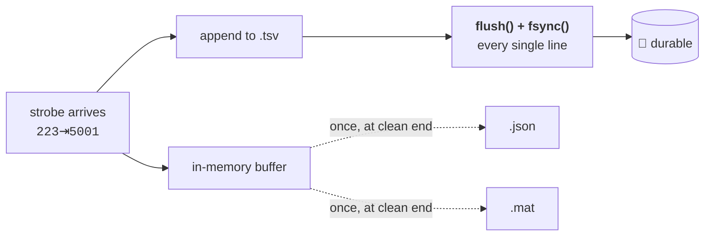

# Data

  

> **What this is** · Everything that lands on disk, everything in the database, and everything read back out of them.
>
> **Owns** · The on-disk layout · the per-animal file schema · crash safety · the SQLite schema and its migrations · backup mirroring · the archive walk · **the derived-metric definitions** · the Analytics dashboard.
>
> **Read with** · [tasks.md](tasks.md) (the profile that decodes a run) · [cohorts.md](cohorts.md) (the `dataFolder` written beneath) · [dashboard.md](dashboard.md) (what triggers these writes).

**Contents** — [1. Directories](#1-directory-structure) · [2. Naming](#2-naming-conventions) · [3. Sessions](#3-session-prefix-and-session-entity) · [4. File schema](#4-per-animal-file-schema) · [5. Crash safety](#5-write-strategy--crash-safety) · [6. The database](#6-the-sqlite-database) · [7. Backup](#7-backup-mirroring) · [8. Reading back](#8-reading-the-archive-back) · [9. **Derived metrics**](#9-derived-metrics) · [10. The Observatory](#10-the-observatory) · [11. The panels](#11-the-panels) · [12. Recovery](#12-crash-recovery)

> [!IMPORTANT]
> **`.tsv` is not an export format.** It is the **write-ahead log** — the mechanism that makes the crash-durability guarantee real. Every strobe is `flush()`+`fsync()`'d to it the instant it arrives. `.json` and `.mat` are built once, at clean finalization, from the same in-memory buffer. Read [§5](#5-write-strategy--crash-safety) before treating `.tsv` as redundant with the other two.

> [!IMPORTANT]
> **The numbers in [§9](#9-derived-metrics) are the scientific output, not a UI detail.** They are what a paper would report. Treat that section as the specification it is.

---

## 1. Directory structure

```
<Settings.dataDirectory>/
└── <cohort name>/                                     ← Cohort.dataFolder
    └── <prefix>/                                      ← Session Prefix, §3
        └── <prefix>_<sessionNumber>_<YYYY-MM-DD>/     ← one per (prefix, number, date)
            ├── behavior.tsv/                          ← written live, during the session
            │   └── remy1_<prefix>_<number>_<date>_<HHMMSS>.tsv
            ├── behavior.json/                         ← built once, at session end
            │   └── remy1_<prefix>_<number>_<date>_<HHMMSS>.json
            └── behavior.mat/
                └── remy1_<prefix>_<number>_<date>_<HHMMSS>.mat
```

Concretely: `Data Directory/Batch A/2O-Bdisc/2O-Bdisc_25_2026-07-22/behavior.json/remy1_2O-Bdisc_25_2026-07-22_113123.json`.

**A session folder is keyed by `(prefix, sessionNumber, date)`, not just date.** Starting a second session with the same prefix later the same day but a *different* number produces a second folder; reusing the same prefix **and** number the same day (unusual, but not blocked) lands in the *same* folder, with new per-animal files added alongside the earlier ones. That falls out of the naming scheme on its own — the per-animal filename's `HHMMSS` suffix means same-day reruns never collide, so there is no special-case "already exists" logic.

The writer nonetheless opens its `.tsv` **exclusively** rather than trusting that ([§5.1](#51-tsv-is-written-live-one-line-at-a-time)). The naming scheme is what makes a collision unreachable; the exclusive open is what makes an unreachable collision fail loudly instead of quietly truncating an animal's data.

---

## 2. Naming conventions

| Element | Format | Example |
|---|---|---|
| **Date** | ISO `YYYY-MM-DD` | `2026-07-22` |
| **Time** | `HHMMSS`, 24-hour | `113123` = 11:31:23 |
| **Session folder** | `<prefix>_<sessionNumber>_<YYYY-MM-DD>` | `2O-Bdisc_25_2026-07-22` |
| **Per-animal file** | `<animal>_<prefix>_<number>_<date>_<HHMMSS>.<ext>` | `remy1_2O-Bdisc_25_2026-07-22_113123.json` |

The per-animal timestamp is the moment **that animal's run actually starts** — not session-config time — so two animals starting a few minutes apart get distinct, honest timestamps. Cohort, prefix, and animal names run through the same filesystem-safe sanitization as cohort data folders.

### 2.1 Why the date is hyphenated

The original convention, taken from a real lab file, was `MM_DD_YY`. It does not sort across a year boundary — `12_31_26` sorts *after* `01_01_27` alphabetically. It was changed on an explicit lab-side decision.

**Hyphenated (`2026-07-22`), not underscored (`2026_07_22`)** — and the distinction is the interesting part. Both `MM_DD_YY` and `YYYY_MM_DD` split into the same number of `_`-separated tokens:

```
remy1_2O-Bdisc_25_07_22_26_113123      →  7 tokens   (legacy)
remy1_2O-Bdisc_25_2026_07_22_113123    →  7 tokens   (underscored ISO — rejected)
remy1_2O-Bdisc_25_2026-07-22_113123    →  6 tokens   (chosen)
```

An existing analysis script parsing these names positionally would survive the underscored change and read every date **wrong** — year where it expected month, month where it expected day. The hyphenated form changes the token count instead, so such a script fails immediately and visibly. **A loud break beats silent corruption.**

**Nothing already on disk is renamed.** The change applies to newly-written folders only, so a prefix folder contains both spellings for as long as its history spans the change.

> [!CAUTION]
> **Never sort these names lexically.** Both formats coexist on disk indefinitely, so string ordering over a real archive is wrong regardless of which format you assume. Call `sessions/paths.py`'s **`parse_name_date`**, which reads both, anchored at the end of the name — anchoring is what disambiguates the legacy form, since an unanchored search for `NN_NN_NN` in `2O-Bdisc_25_07_22_26` matches `25_07_22`: the session number plus two thirds of the date.

### 2.2 Reading names other software wrote

Everything above governs what this app *writes*. What it **reads** is wider, because the archive walk meets folders named by programs that never saw this document — and the standing rule that nothing here renames a user's files means those names have to be read as they are, permanently.

- **The session number can lead rather than trail** (`00_01_shaping_gr_06_17_26`), so `parse_session_folder` identifies the number by *being numeric* rather than by position: trailing first, so every name this app wrote is read exactly as before, then leading.
- **Separators vary within one archive** — one folder among thirty was typed `18-19-shaping-gr` while its siblings used underscores. **A separator variant is reported as written, not normalized.** Folding `-` into `_` would tidy that one folder and also merge `2O-Bdisc` with `2O_bdisc`, which are two distinct prefixes in another real archive. Renaming the folder is a five-second operation with no data risk, and it belongs to whoever owns the data.

---

## 3. Session prefix and session entity

### 3.1 Prefix

```ts
Prefix { id: uuid, name: string }   // e.g. "2O-Bdisc" — unique
```

**Global, shared across all cohorts** — a prefix names a task/paradigm, not a cohort, and the same task plausibly runs across many cohorts over time. User-managed, surfaced as a dropdown in the session config step, persisted in the same SQLite database as cohorts.

**Removing a prefix** doesn't touch any folder or file already written under its name. It just stops appearing in the dropdown for new sessions.

### 3.2 Session and run records

```ts
Session {
  id: uuid
  cohortId: uuid
  prefixId: uuid
  sessionNumber: string          // free text, not strictly numeric
  date: date                     // the calendar day this session's folder belongs to
  startedAt: timestamp
  endedAt: timestamp | null
  status: "configuring" | "running" | "completed" | "aborted"
  folderPath: string
  groupRuns: [{ groupId, order, startedAt, endedAt }]
  durationMinutes: int | null    // optional per-box time limit; null = no limit
}

SessionAnimalRun {
  id: uuid
  sessionId: uuid
  animalId: uuid
  boxNumber: 1–6
  sketchPath: string
  filePath: string               // the finalized .json (the .mat sits alongside)
  startedAt: timestamp
  endedAt: timestamp | null
  stopReason: string | null
  profileHash: string | null     // the Task Profile this run actually used
  configJson: string | null      // the merged parameter values
  paramsHash: string | null      // hash of those values
}
```

> [!IMPORTANT]
> **`profileHash` records which Task Profile decoded this run.** A `task.json` lives beside its sketch, outside the data directory, and can be edited, renamed, or deleted long after a session — so without a snapshot, a run recorded a year ago would be silently re-interpreted with today's strobe codes and metric definitions. `null` means the run predates snapshotting, and is exactly the flag Analytics needs to mark it as decoded with a possibly-changed profile.

---

## 4. Per-animal file schema

### 4.1 The JSON document

```jsonc
{
  "rat": "remy1",
  "serial_port": "COM6",
  "session_id": "2O-Bdisc_25",
  "sketch": "GRGL_2-Odor",
  "correction_left": 0,          // ← task-specific, from the Task Profile
  "correction_right": 0,
  "lazy_escalation": true,
  "stop_reason": "BF_END_SESSION received",
  "trial_seed": 288577176,
  "host_seed": 288577176,
  "n_events": 2392,
  "ts_data": [[221, 0], [222, 1000], [223, 5001], /* … */ [246, 3523555]]
}
```

| Field | Source | Notes |
|---|---|---|
| `rat` | `Animal.name` | |
| `serial_port` | Live hardware state at run time | The literal OS port string — *which physical port* this run used, distinct from the abstract `boxNumber` |
| `session_id` | `"<prefix>_<sessionNumber>"` | Matches the session folder's own naming |
| `sketch` | The sketch name selected at mapping | Discovered, not hand-typed |
| *task-specific fields* | This sketch's Task Profile | Absent for a profile-less sketch, or one declaring different fields |
| `stop_reason` | Assigned by the sidecar at session end | Open, extensible set of strings |
| `trial_seed` | A wire convention, not a profile field | What the **board** reported. Absent if the sketch never emits `SEED\t<value>` |
| `host_seed` | The CSPRNG draw the app put on the `START` line | What the **app sent**. Differs from `trial_seed` only when the firmware ignored it |
| `n_events` | `len(ts_data)` | Written once, at finalization |
| `ts_data` | The raw strobe stream | `[code, timestamp_ms]` pairs, elapsed since **that animal's own** session start — the firmware's own convention, untouched, not re-based to wall clock |

> [!CAUTION]
> **Task-specific fields are merged in flat at the top level**, not nested under a `config` key. That is why a profile's `metadataKey` may not collide with one of the core fields (`rat`, `serial_port`, `session_id`, `sketch`, `stop_reason`, `n_events`, `ts_data`, `trial_seed`, `host_seed`) — a collision would quietly overwrite the core field rather than being rejected. The guard is enforced when the profile is parsed ([tasks.md §3.2](tasks.md#32-config--a-field)).

### 4.2 The `.tsv` write-ahead log

Not a serialization of the document above — a live append-only log with a different shape entirely:

```
# rat: remy1
# serial_port: COM6
# session_id: 2O-Bdisc_25
# sketch: GRGL_2-Odor
# correction_left: 0
221	0
222	1000
223	5001
…
# stop_reason: BF_END_SESSION received      ← footer, appended at finalization
# n_events: 2392
```

The header is written once, immediately after `START`/`SEED` resolve — before the first strobe arrives, since everything needed is known by then. `stop_reason` and `n_events` aren't knowable yet, so they are appended as a **footer** at clean finalization. **A `.tsv` recovered mid-session is missing only that footer, nothing else.**

### 4.3 The `.mat` mirror

Same field names, written from the identical in-memory dict used to write the JSON — one source of truth serialized twice, not two independent writers that could drift. `ts_data` becomes an `N×2` double array.

> [!NOTE]
> **A hand-written MAT v5 serializer, not `scipy.io.savemat`.** `scipy` is a large binary wheel and by far the most likely thing to fail at install time on a lab machine maintained by non-technical users. [`sessions/matwriter.py`](../sidecar/ephymeris_sidecar/sessions/matwriter.py) writes Level-5 MAT directly (column-major `N×2` doubles, strings as `miUINT16` char arrays, bools as `miUINT8` with the logical flag `0x02`). It was validated by round-tripping a file through `scipy.io.loadmat` in a throwaway virtualenv that was then deleted, so MATLAB/scipy compatibility is proven while the runtime dependency list stays minimal.

---

## 5. Write strategy & crash safety

The goal is recoverable data up to the moment of a power loss, not "eventually consistent."



### 5.1 `.tsv` is written live, one line at a time

Every parsed strobe is appended **the instant it is received** — `flush()` + `fsync()` on every single line, not batched. That is affordable here in a way it would not be for a high-frequency DAQ: a real session averages **under one event per second**, so a few-millisecond `fsync` per line is nowhere near a bottleneck.

A line is written in **exactly the format the board sends** (`<code>\t<timestamp>`) — no transformation, so no formatting bug can corrupt the one file that has to be bulletproof.

> [!IMPORTANT]
> **The file is opened exclusively (`"x"`), not truncating.** The `HHMMSS` in the filename already makes a same-path collision unreachable, so this will effectively never fire — but this is the file carrying the durability guarantee, and "practically unreachable" is a weaker claim there than anywhere else in the codebase. On the impossible day it does fire, the box refuses to start with an error naming the file in the way. **Refusing to start is recoverable; a truncated write-ahead log is not.**

**If the write itself fails** mid-session (disk full, permissions), the runner catches it, logs it, and broadcasts `sidecar.error` naming the box — the one failure with no command to attribute it to, which is exactly why that event exists. The strobe is dropped rather than retried and the run continues: the operator is told immediately that data is no longer being saved, and can decide what to do. A failure to *open* the file takes the same route and carries the underlying cause into both the error and the recorded `stop_reason`.

### 5.2 `.json`/`.mat` are built once, at the end

Structured formats aren't append-friendly, and they don't need to be — `.tsv` already carries the real-time guarantee. Rewriting them throughout a session would be extra I/O for no additional safety.

Finalization is **idempotent** (the first `stop_reason` wins, so a double-stop can't rewrite history), and the two structured writes are **best-effort**: an `OSError` writing `.json` or `.mat` is logged, not raised. That ordering is deliberate — the `.tsv` is already closed and durable by then, so a failure to produce the convenience formats must never look like a failure to save the data.

### 5.3 What is and isn't guaranteed

✅ **Guaranteed** — if the lab PC loses power mid-session, every strobe up through the last completed line is on disk in `.tsv`, immediately readable by a human, with at most the very last in-flight line at risk.

❌ **Not in scope, by decision** — the app noticing on restart that a session was interrupted and automatically resuming it. That is a materially bigger feature (reconnecting boards, resuming trial state, deciding whether the animal even kept running during the outage). What *is* built is the backfill — see [§12](#12-crash-recovery).

---

## 6. The SQLite database

`ephymeris.db`, in the **app data directory** — *not* in the user's `dataDirectory`, which is for browsable session output. Owned by [`cohorts/db.py`](../sidecar/ephymeris_sidecar/cohorts/db.py). **`SCHEMA_VERSION = 6`.**

### 6.1 Tables

| Table | Holds |
|---|---|
| `cohorts` | Cohort records, with `archived_at` |
| `groups` | Groups within a cohort, with `order` |
| `animals` | Roster, with `group_id`, `box_number`, cage, sex, weight |
| `prefixes` | The global prefix list |
| `sessions` | One row per session-flow invocation |
| `session_animal_runs` | One row per animal per session — the unit Analytics scores |
| `task_profiles` | **Content-addressed** profile snapshots, keyed by `hash`. Identical profiles store once, so comparability is an indexed equality test rather than a blob comparison |
| `run_metrics_cache` | Persisted derived summaries. **No foreign key on the run id** — adopted orphans have no run record |
| `adopted_runs` | Files the archive walk matched to an animal. Deliberately separate from `sessions`/`session_animal_runs` |

### 6.2 Indexes

Indexes live in their own `INDEXES` block, applied **after** migrations.

| Index | Why |
|---|---|
| `idx_cohorts_active_name` | A **partial** unique index on `name COLLATE NOCASE WHERE archived_at IS NULL`. Name uniqueness applies to active cohorts only — archived ones release their name — so the database enforces the rule rather than trusting every code path to remember it |
| `idx_runs_animal` | Per-animal cross-session history was a full scan before this |
| `idx_runs_profile`, `idx_runs_params` | Comparability is the **pair** `(profile_hash, params_hash)`, so the pair is what gets looked up |
| `idx_sessions_cohort_dt` | The chronological session axis, index-ordered rather than sorted per read |

> [!CAUTION]
> **An index on `animal_id`, never a foreign key.** `cohorts.update` deletes and re-inserts the entire animal set wholesale on every roster edit. With `ON DELETE CASCADE`, a single rename would destroy every historical run in the cohort. **The missing foreign key is load-bearing, not an oversight.**

### 6.3 Changing the schema

> [!CAUTION]
> **Adding a *table* needs nothing but a `CREATE TABLE IF NOT EXISTS` in `SCHEMA`** — that covers the fresh and existing cases alike, which is why every schema change for a long time was safe.
>
> **Adding a *column* does not.** The same statement leaves an existing table untouched, so the column would appear **only on newly-created databases** — while `user_version` gets stamped to the new number regardless. The database then *claims* the new version while missing the column, and the next query raises `OperationalError` on every session finalization, on a lab machine, mid-run.
>
> **Both halves are required:** bump `SCHEMA_VERSION`, update `SCHEMA` to the final shape, **and** add a `MIGRATIONS` entry. Either alone leaves one class of database wrong.

Four properties worth knowing before adding a migration:

- **Freshness is decided by whether `cohorts` exists, not by `user_version`.** A file from a build predating versioning reports 0 while holding real tables; trusting that 0 would be the same silent failure in a different costume. Such a file is treated as v1, so every migration applies.
- **`add_column` is idempotent**, guarded on `PRAGMA table_info`. A migration interrupted by a power loss or a kill during startup must be safe to re-run. New columns must be nullable or carry a constant default — SQLite cannot add a `NOT NULL` column without one.
- **Startup commits at most once**, with a test asserting it, because each commit marks the database dirty for backup ([§7.3](#73-ephymerisdb)).
- **A newer database still opens**, with a loud error rather than a refusal. Every change is additive, so extra tables and columns are inert to an older build; refusing to start would strand a lab machine that merely ran an older installer.

> [!TIP]
> `tests/test_migrations.py` pins the v1 and v2 schemas as **literal fixtures**. Extend it rather than importing the current schema — importing would test today's code against itself and drift the moment someone edits `db.py`.

---

## 7. Backup mirroring

Two distinct, complementary mechanisms protecting against two different failures:

| Mechanism | Protects against | Where |
|---|---|---|
| **`.tsv` write-ahead log** ([§5](#5-write-strategy--crash-safety)) | The app or power dying mid-session | The **same** disk |
| **Backup Directory mirroring** | Losing the whole `dataDirectory` — drive failure, accidental deletion | A **different** disk or share |

> [!IMPORTANT]
> **Mirroring is entirely off the critical path**, and every decision below follows from one rule: *the backup target may be slow, networked, or dead, and none of that may ever slow, stall, or fail a session.* A mirror that works but blocks finalization would be worse than no mirror at all, because it would put a network share in the path of the guarantee §5 exists to make.

### 7.1 Layout — anchored on the cohort folder

```
<backupDirectory>/
├── <cohort folder basename>/       ← that cohort's folder, contents unchanged
│   └── <prefix>/<session folder>/behavior.{tsv,json,mat}/…
├── ephymeris.db                    ← current mirror of the cohort database
└── db-snapshots/
    └── ephymeris_<YYYY-MM-DD>.db   ← one per day, newest 14 kept
```

> [!IMPORTANT]
> **The mirror path is not derived by subtracting `dataDirectory` from the source path**, because it can't be: `cohorts.setDataFolder` can put a cohort's folder anywhere, including somewhere with no relationship to the data directory. Every mirrored file is anchored on the **cohort folder** containing it instead. In the normal case this reproduces the familiar layout exactly — which is the point: a last-resort archive nobody can navigate is worth much less than one they can.

Two cohorts can collide here only if *both* had their folders relocated by hand into different parents sharing a basename. When that happens every member of the colliding set gets a short path-derived suffix, so the layout doesn't depend on enumeration order.

**The mirror is additive. Nothing is ever deleted from it because it disappeared from the source** — a mirror that faithfully reproduces a deletion is no protection against one.

### 7.2 Session files

- **`.json`/`.mat` at finalization are *queued*, not copied inline.** Ending a session, or switching groups with six boxes finalizing at once, never waits on the backup target. `backup.status` reports the queue depth, so "not yet mirrored" is visible rather than assumed.
- **`.tsv` while running is mirrored on a periodic ~10 s cadence**, never per line. The interval is measured from the *end* of the previous pass, so a slow target stretches the cadence rather than queuing overlapping passes. At the real session rate this leaves at most ~10 strobes unmirrored, against a local file already `fsync`'d per line.
- **Every copy is whole-file**, not an incremental append. A partial append to a slow target could leave the mirrored write-ahead log torn; a full session `.tsv` is only tens of kilobytes. Copies land via a `.part` file plus an atomic replace, so a crash mid-copy can never leave a half-written file where a good one was.

### 7.3 `ephymeris.db`

Backed up on **every commit**, debounced by 5 s.

> [!NOTE]
> **The trigger hangs off SQLite `commit` itself** rather than a call in each repository method. Two reasons: no write path can forget to announce itself, and the trigger is genuinely "the database changed" rather than the narrower "a cohort changed" — `session_animal_runs` is written at finalization during an unattended overnight run, and is not a cohort edit by any reading.

The debounce matters because editing a roster commits many times in quick succession. No periodic timer is needed: the database only changes when something writes to it, so a timer over an idle database would re-copy identical bytes.

**The copy is two-step on purpose.** SQLite's online backup API is used rather than a file copy, since a plain copy of a live database can capture a torn page — but that API holds the database lock for its duration, so it writes to a **local** temp file first (milliseconds), and the slow copy out to the mirror happens with nothing locked. Pointing it straight at a network share would let that share's latency block every cohort read in the app.

**Dated snapshots exist because the live mirror alone doesn't protect against half of what backup is for.** A single overwritten copy would faithfully propagate an accidental cohort deletion within seconds. One snapshot per day, **first-of-day wins** (a later one would only overwrite the very state someone is trying to undo), newest 14 retained. Snapshot names are ISO-dated, so pruning the oldest is a plain sort.

### 7.4 No automatic backfill

Setting a backup directory mirrors from that moment on; it does **not** copy what's already on disk. Doing so automatically could mean an unannounced multi-gigabyte copy to a network share the instant someone picks a folder, and it would fire again on every repoint. The explicit version is **`backup.syncNow`**, surfaced beside the Settings field, which walks every cohort folder and copies anything missing or stale. It doubles as the way to prove a target actually works before trusting it with anything.

### 7.5 Failure is visible, not silent

Mirroring failures surface as `state: "failed"` on `backup.status`, with the underlying error, rendered as a persistent note in Settings and a compact indicator in Mission Control. They are deliberately **not** `sidecar.error` toasts: a dead network share fails every pass, and a transient notification every 10 s would be noise that teaches people to ignore it. Retries continue on the normal cadence and recovery clears the state on its own.

**Nothing about a failed mirror affects the session.** Local writing continues untouched, which the Settings note says in as many words.

---

## 8. Reading the archive back

### 8.1 Database first, walk on demand

Run records carry a file path, and that is the primary path. It is strictly better than walking the archive: the record also carries `animal_id` (immune to renames), the box, the timings, and the stop reason — none of which a filename gives you.

But it is not *complete*. Files exist that no record points at: runs finalized while no session was active, a crash between the file write and the database commit, and files restored from the backup mirror or copied from the other lab machine.

So a **walk exists, but only under an explicit user action** — the Rescan button — matching how `sketches.refresh` and `backup.syncNow` already handle expensive reconciliation. Adopted orphans get a deterministic synthetic id so re-running is idempotent, and they **never** get fabricated session rows, which would corrupt session-number suggestion and the same-day warning.

> [!CAUTION]
> **The walk finds format folders by name, at any depth — do not reintroduce an assumption about a prefix level.** This app files sessions under a prefix folder, but the lab's archives disagree about that level: one has it, another puts session folders straight under the cohort, and nothing stops a per-year level appearing next. A fixed two-level glob found **zero** of the second archive's 444 files. `session_folder_of` stays correct without knowing the depth because it is defined relative to the *format* folder rather than to the cohort root.
>
> The scoping rule is what makes that safe: **a file is only data if it sits directly inside a format folder.** That is the sole thing standing between the archive walk and every stray `.json` on a shared drive, and it also disposes of the report folders real archives keep (`00_session_analytics/`, `behavior_json/analytics/`) as a consequence of the rule rather than as a list of names to avoid.

### 8.2 What adoption handles

Adopted runs live in their own `adopted_runs` table. Rows carry only what a name can honestly supply: the matched `animal_id`, the file path, the prefix/number/date from the folder, and the start time from the `HHMMSS` suffix. **The box number, stop reason, and end time stay unknown**, and `boxNumber` is `null` on the wire rather than a plausible default.

This is the **only** path by which a pre-Ephymeris archive reaches Analytics, so every shape below is one a real archive actually has:

| Legacy shape | Handling |
|---|---|
| Format folders named `behavior_json` / `recovery_tsv` (underscores) | Both spellings read; `sibling_tsv` follows whichever layout it found |
| Session folders dated `MM_DD_YY` | Both spellings read, normalized to ISO at adoption |
| A hand-made prefix-grouping level (`The Remy's/2O-Bdisc/…`) | Found by name at any depth |
| **Session folders straight under the cohort** | Same rule — the case a fixed glob missed entirely |
| Non-data folders beside and inside format folders | A format folder's data is exactly its direct children; the walk stops at one |
| **The session number written first** | `parse_session_folder` looks for a *numeric* token rather than a positional one. Reading positionally reported the prefix as `00_01_shaping` and the number as `gr` |
| One folder typed with hyphens among underscored siblings | Parsed and reported **as written** — see [§2.2](#22-reading-names-other-software-wrote) |
| `sketch` recorded as a human label | Resolved through the profile's declared [`legacyNames`](tasks.md#37-legacynames) |
| **A typo in one document's `rat` field** (`HmM103` beside a filename reading `HM103`) | Falls back to the animal the *filename* names — see below |
| **AppleDouble sidecars** (`._name.json`) | Skipped. macOS writes one beside every real file when copying to a filesystem that can't hold its metadata. The real Remy archive holds **454 of them against 586 real files** — left in, junk would have been the majority of what the walk reported |
| **A consolidated copy of every session** beside the per-prefix originals | Deduplicated by run identity — see below |

**Two recordings of the animal, not a guess.** A run's animal is written twice at finalization: into the document's `rat` field and into the filename. One real archive has a file where the first is `HmM103` and the second is `HM103` — and with only the document consulted, that run vanishes from HM103's history, which reads as *the animal didn't run that day*. A hole that looks like data is worse than the typo. So when the document's name matches no animal, the file stem is tried — but the stem must be exactly what [§2](#2-naming-conventions) prescribes, checked against the folder on disk rather than assumed, and the token that survives must still match a roster name exactly and case-folded. The document always wins where it matches; no match still means unattributed; and the result reports which recording was used.

**Duplicate copies are one run, not two.** A hand-managed archive commonly keeps a rolled-up copy alongside the per-prefix folders; in one real archive **290 of 296 runs exist twice**. Adopting both would silently double every animal in the heatmap. Identity is the **file stem** — `<animal>_<prefix>_<number>_<date>_<HHMMSS>` is exactly animal-plus-session-plus-start-time — so two files with that stem *are* the same run wherever they sit. Which copy survives is decided by **content, not walk order**: a copy whose document names its `sketch` can be decoded and one that doesn't cannot, so the richer one wins, with the path breaking ties for determinism. In the real archive 30 runs carry `sketch` only in the consolidated copy, so "keep the first found" would have discarded the only usable version of each.

> [!WARNING]
> **The synthetic run id is keyed on that identity, not on the path.** Which copy wins can legitimately change between scans, so a path-keyed id would mint a *second* row for a run that already had one and leave both — exactly the double-counting the deduplication exists to prevent, reintroduced by the mechanism meant to make rescanning idempotent. Caught by re-running the walk twice against the real archive, where the row count went 296 → 297.

**A data folder that isn't there is reported, not treated as an empty archive.** A cohort pointing at an unplugged drive otherwise returns a well-formed empty result, which reads as "this cohort has no data" when it means "I can't see where its data is." `analytics.rescan` returns `folderMissing`; `analytics.summary` emits a `data-folder-missing` warning the Observatory renders separately from run-level warnings.

**A bad directory is data too.** A directory the walk can't read costs a warning and its own contents, never the cohort.

### 8.3 Which profile decodes a run

| State | Meaning | UI |
|---|---|---|
| 🟢 `snapshot` | Decoded with the profile the run actually used | Trustworthy, unmarked |
| 🟡 `sketch-current` | Decoded with today's `task.json` at the recorded sketch path | **Flag: profile may have changed since** |
| 🔴 `unavailable` | The recorded name no longer resolves against the bundled library — a sketch dropped from the bundle, or a `legacyNames` entry edited away | **Flag: cannot decode** |

A malformed `task.json` on the fallback path degrades to `no-metrics` rather than raising.

**A sketch name is resolved when a run is read, not when it is adopted.** The path stored at adoption is a cache of that lookup, never a fact about the run. Freezing it would mean a cohort adopted against one install's library paths stays wrong after every update. Verified against the real archive back when the library was a configurable directory: with it removed, 0 of 296 read as scored; restored, 295 of 296, with no re-adoption. Now that the library ships with the app, the failure mode moved from "directory re-pointed" to "sketch dropped from the bundle" — which is why `tests/test_bundled_library_covers_archives.py` exists.

> [!IMPORTANT]
> **Comparability is the pair `(profileHash, paramsHash)`, not the profile hash alone.** A profile hash covers the *declaration*, which is identical across every run of a sketch. That was sufficient while a task's timings were compiled into its firmware; it stopped being sufficient once they became operator-set, because a rat run at a 10 ms poke hold and one run at 500 ms share a profile hash and would otherwise be plotted on one axis as though the task had not changed underneath them.
>
> The mismatch **warns rather than splits** — one `parameter-mismatch` warning per comparability set holding more than one parameter set. Splitting would fragment a cohort's history the first time anyone nudged a timeout, and most parameter edits genuinely don't invalidate a comparison; but that is the reader's call, and silence denies them the chance to make it. Runs with no recorded parameters are ignored rather than treated as their own set — they ran on firmware constants, so an unknown is not evidence of a difference.

### 8.4 Caching and `CODEC_VERSION`

**Persist summaries; memoize series in memory.** Summaries survive a sidecar restart, which happens on every app launch since there is deliberately no auto-respawn. Series are **not** persisted: roughly 3.6 MB of floats for a 180-run cohort, inside a database the backup manager copies wholesale to a possibly-networked target on a 5-second debounce.

**Cache key:** file path, mtime, size, profile hash, and a **codec version**.

> [!CAUTION]
> **Bump `CODEC_VERSION` in `derive.py` whenever the maths changes.** Without it, a fixed bug in the derivation keeps serving numbers computed by the old definition, **forever, with no symptom**. It also covers fallback-decoded rows whose meaning changes when a `task.json` on disk changes. It currently sits at **6**.

**Every field of that key is answerable from a `stat`, so a cache hit opens nothing.** Worth stating because it was not always true: the indexing pass used to read and parse each file and only *then* build the key, so the persisted cache saved the arithmetic and none of the I/O. On a 444-run archive that was 30 MB pulled across the wire on every dashboard open, on the machine whose archive lives on a network share. Reading is now strictly behind the miss — `stat_run` settles the key, `parse_run` runs only if it doesn't match. Measured on that archive: a warm summary went from ~440 ms to ~10 ms, and from 30 MB to zero bytes.

**Profile resolution is memoized per pass, and deliberately not across passes.** Making that memo outlive the pass would freeze exactly what §8.3's read-time resolution keeps thawed.

**Never delete a cache entry because a file vanished** — mark it stale and keep serving it. A briefly unreachable network share must not erase history from the heatmap. Same principle the backup mirror holds to.

**A corrupt file caches its negative result** under the same key, so it is not re-parsed on every open, and surfaces as a warning. **A bad file is data, not an error** — one unreadable `.json` must never blank a year of history.

### 8.5 Never at the expense of a session

> [!IMPORTANT]
> **No analytics operation may slow, stall, or fail a running session.**

- **One indexing job at a time behind a lock**, so two clients or a double-click cannot launch two archive walks.
- **Reads are sequential in a single worker thread, not a pool.** Six boxes are `fsync`ing per strobe, and a thread pool would multiply disk contention against the write-ahead log that carries the durability guarantee.
- **Runs are handed to that worker in chunks.** This strengthens the rule rather than bending it — the runs inside a chunk are still read one after another on one thread, and chunking *reduces* the number of distinct executor threads the pass touches. The chunk is small enough that a batch of misses can't hold the event loop off a live `port.output` flush.
- **Persisted cache writes go in one transaction per job.** Individual commits would mark the database dirty repeatedly and trigger a whole-file copy to the backup target each time.

---

## 9. Derived metrics

Everything here is computed from `ts_data` — a flat `[[code, timestamp_ms], …]` list. **There are no trials, no accuracy, and no computed metrics on disk**; all of it is derived at read time from raw strobe codes plus the task profile that decodes them.

`analytics/derive.py` is **pure**: no I/O, no database, no clock — which is what lets a test assert it agrees with the live metric path over a recorded stream. **Nothing here reimplements scoring**; the derivation layer loads a document, picks a profile, and calls the existing machinery. The hard parts are *finding* the files ([§8](#8-reading-the-archive-back)), *deciding which profile decodes them* ([§8.3](#83-which-profile-decodes-a-run)), and *not lying* when a file is absent or a trial count is tiny.

**Jump to** — [9.1 Boundary codes](#91-boundary-codes) · [9.2 Two probabilities](#92-two-probabilities-per-metric-never-one) · [9.3 Trial counts](#93-trial-counts) · [9.4 Scalars](#94-run-level-scalars) · [9.5 Uncertainty](#95-uncertainty) · [9.6 Edge cases](#96-edge-cases--the-exact-rules) · [9.7 Pooled accuracy](#97-pooled-accuracy--the-honest-single-number) · [9.8 Rewarded vs response](#98-rewarded-accuracy-vs-response-accuracy) · [9.9 Per condition](#99-the-same-tally-per-condition) · [9.10 Engagement](#910-the-engagement-ladder)

### 9.1 Boundary codes

> [!CAUTION]
> **The offline scan must be passed the union of *every* trigger code in the profile, exactly as the live runner does.**
>
> `MetricSet.__init__` builds that union. But `compute_series` defaults to **only the metric's own trigger** when `boundary_codes` is omitted. For any profile with more than one metric those differ, and the difference is not academic:
>
> *A trial where Odor 1 fires, the animal does not respond, and Odor 3 fires next is **excluded** by the live path and **mis-scored** by the offline default.* The animal's later response to Odor 3 is attributed to the abandoned Odor 1 trial. **Every unanswered trial in the session scores wrongly, silently**, and the recorded numbers quietly stop matching what the operator watched.

### 9.2 Two probabilities per metric, never one

| | Definition | Window | Used by |
|---|---|---|---|
| **`pWindow`** | last value of the rolling series | `windowSize` as authored | Continuity with Mission Control — the last number the operator actually saw |
| **`pSession`** | same computation, window widened to the whole session | all counted trials | **Every summary**: heatmap cells, both strategy-space axes, cross-session curves |

Widening is done by `dataclasses.replace` on the frozen `LiveMetric`, which reuses the same accumulator, the same forward scan, and the same exclusion rules — so the two differ *only* in window length and cannot drift apart in behaviour.

> [!WARNING]
> **These two diverge sharply over the first `windowSize` trials.** Two panels using different ones under the same axis label is an invisible error, and the most likely bug in this whole document. Every panel's choice is stated explicitly in [§11](#11-the-panels).

`pSession` is the summary statistic everywhere it is a summary: it is less noisy and it is the only one of the two with a defensible sample size. `pWindow` exists so a session's headline number can be reconciled against what Mission Control displayed while it ran.

### 9.3 Trial counts

| Count | Definition |
|---|---|
| **`counted`** | Trials that scored as hit or miss. The series has exactly one entry per counted trial, so `counted = len(series)` |
| **`triggered`** | Total trials presented — occurrences of `trigger_code` |
| **`excluded`** | `triggered − counted` — the lazy, invalid, and no-response trials |

`excluded` is scientifically meaningful and free to compute: a session with 200 triggers and 90 counted is a very different session from one with 200 and 195, at identical P(correct). **Surface it.**

> [!CAUTION]
> **`MetricValue.n` is the window length, capped at `windowSize` — not a trial count.** Using it as the sample size for a confidence interval on `pSession` would be wrong by an order of magnitude. **`counted` is the real count.**

The final trial of a session is usually unresolved when the board ends; it correctly lands in `excluded`.

### 9.4 Run-level scalars

- **`totalEvents`** = `len(ts_data)`. Cross-checked against the document's own `n_events`, warning on mismatch — a disagreement means a hand-edited or recovery-produced file. **Trust `ts_data`.**
- **`durationMs`** = last timestamp − first. **Stream-relative**, not wall clock.
- **`wallDurationS`** = `ended_at − started_at` from the run record.

> [!NOTE]
> **Report both durations and do not reconcile them.** They legitimately differ: `started_at` is stamped when the runner creates the run, while stream `t=0` is the board's own session-start strobe — after the DTR auto-reset and the `READY` handshake, hundreds of milliseconds later.

- **`stopReason`** from the document, and `clean = stopReason == "BF_END_SESSION received"`.

### 9.5 Uncertainty

Every probability is reported with `counted` beside it and a **95% Wilson score interval**.

Wilson rather than the normal approximation because this data lives at small *n* **and** at *p* near 1 — a trained animal sits around 0.95 — which is precisely where the normal approximation produces intervals extending past 1.0. It is a few lines of arithmetic over `math.sqrt`, so it adds **no dependency**.

**The sidecar never suppresses.** It reports the value, the count, the interval, and a `lowConfidence` flag (`counted < minCountedTrials`, default 10). Suppression is a *presentation* policy, applied client-side and only where there is nowhere to draw a band:

| Panel | Low-*n* treatment |
|---|---|
| Learning curves | Wilson band, widening where *n* is small |
| Strategy space | Point drawn hollow and smaller; trail still passes through it |
| Heatmap | Cell suppressed to a distinct hatch — no band is possible in a cell |

> [!IMPORTANT]
> The division matters. Keeping the value server-side and suppressing only at the point of display preserves the distinction between *"this session was cut short after three trials"* and *"this session never happened"* — which is most of the point of a cohort heatmap.

### 9.6 Edge cases — the exact rules

| Case | Rule |
|---|---|
| **Zero counted trials** | Emit `null`, **never `0.0`**. Zero percent and "no trials" are opposite claims about an animal. The heatmap renders the no-data treatment; the strategy trail **skips** the session and draws a dashed gap rather than interpolating through a session that produced nothing |
| **Profile-less sketch** | Fully supported. Emit `no-metrics` and no metrics. **The run is still listed** — it has a real duration, event count, and stop reason. Do not invent a default metric |
| **Utility-kind profile** | `kind` is a convention, not a gate. Compute and return the metrics, but mark the run excluded from cohort aggregates by default |
| **Board disconnected mid-run** | A drop **does** finalize, with `stop_reason: "board disconnected"`. A complete-up-to-the-drop file exists. **Include it**, surface the reason, mark it truncated. A drop at trial 180 of 200 is good data. Distinct from a session with `status: "aborted"`, which never wrote anything |
| **No file path recorded** | The writer never opened — the handshake never resolved, or the exclusive open collided. Emit `missing` |
| **Path recorded but absent on disk** | A disk-full at finalization leaves a run record with a path, no `.json`, and a complete `.tsv`. Emit `missing`, and — because this one is actionable — check for the sibling `.tsv` and say so. Exactly the case [§12](#12-crash-recovery) exists to fix |
| **Two runs for one (animal, session)** | Real, on a restart after a board drop and on a same-day prefix+number reuse. **The run with the most `counted` trials wins the cell, and the cell is marked as having siblings.** Stated here so the frontend does not silently take whichever came last |

### 9.7 Pooled accuracy — the honest single number

Alongside each declared metric, a run carries **`overall`**: correct trials over scored trials, pooled across every condition. It is offered first in the metric selector and is what the heatmap, the animal rail, and the session rail use by default.

> [!IMPORTANT]
> **Why this exists, discovered by looking at real output.** A single metric cannot show a side bias. An animal that pokes right on every trial scores ~1.0 on "P(R | Odor 1)" and ~0.0 on "P(L | Odor 3)". A heatmap keyed on the first declared metric therefore paints a **completely bias-locked animal as one of the best in the cohort** — the exact opposite of what the heatmap exists to show. Pooled, that animal sits at chance, which is the truth.
>
> This was not in the original design. It surfaced when the first populated dashboard showed a deliberately non-learning animal reading 0.72–0.84 and looking healthy.

Pooled by **summing hits and trials, not by averaging the two proportions**, so a session that scored 90 trials of one condition and 10 of the other is weighted the way it actually ran.

**The rate pools only conditions that scored; the trial counts pool all of them.** A condition that fired twenty times and was never answered contributes no proportion to weight — but those twenty trials are exactly what `triggered` and `excluded` exist to report, and leaving them out made the pooled row assert the animal was never offered them.

**The pooled figure is a summary, not a condition.** It never becomes a strategy-space axis (that needs two real conditions), and it has no within-session series: at trial resolution the conditions interleave, and pooling them into one rolling window would need an accumulator the live path does not have.

### 9.8 Rewarded accuracy vs response accuracy

The declared metrics are **reward-unconditional**: a `WATER_POKE_L/R` scores the instant the poke is detected, so an animal that reaches the correct well and releases before the fluid hold clears still scores a hit. That is the right definition for a live discrimination readout — it measures the *choice*, not the consummatory hold — but it is not the question "how often did this animal actually earn water," and one number cannot honestly answer both.

So each run also carries a per-trial tally, classified from the profile's own strobe vocabulary:

| Outcome | Recognised by | Meaning |
|---|---|---|
| **rewarded** | `FLUID_*` | fluid delivered |
| **hold failed** | `WATER_UNPOKE_EARLY_*` | correct well, released before the hold — no drop |
| **wrong well** | `WATER_POKE_ERROR_*` | wrong side |
| **no response** | administered, none of the above | engaged, never answered |
| **aborted** | no `ODOR_UNPOKE` | odor delivered, odor port left before sampling cleared |

From which:

- **Rewarded accuracy** = `rewarded / administered`. Conservative — a hold failure counts against it.
- **Response accuracy** = `(rewarded + holdFailed) / administered`. The discrimination figure: the correct side was chosen whether or not the hold earned the drop. **Always ≥ rewarded accuracy**, and **the gap between the two *is* the consummatory hold-failure rate** — a real, separately interesting behaviour rather than noise. Carried on the wire as `pSide`.

Three things this gets right on purpose:

- **Administered is the denominator, not trials.** A trial the animal never engaged with is not evidence about discrimination.
- **Matched by anchored name, never by code number.** The patterns are anchored (`^FLUID(_|$)`) rather than substrings specifically so `STOP_FLUID_G_R` — which marks delivery *ending* — cannot be counted as a second reward, and so `ODOR_UNPOKE_EARLY` can never satisfy the completed-sampling marker `ODOR_UNPOKE`.
- **A task that declares no reward vocabulary reports `outcomes: null`**, not zeros. "This task has no notion of a reward delivery" and "this animal earned nothing" are different claims.

> [!WARNING]
> Two limits, both invisible in the numbers themselves:
>
> - **`trials` counts odor onsets, not trials the box offered.** The firmware fires its odor-on strobe only *after* the animal has poked and held the odor port, so a trial the animal ignored entirely produces no boundary and is counted nowhere — not even as `aborted`, which covers only the animal that received odor and left early. **Every figure in this section is conditioned on engagement**, and none of them can measure it; [§9.10](#910-the-engagement-ladder) is the layer that does.
> - **A no-go withhold would land in `no response`.** The correct answer on a no-go trial is to answer no well, which from the strobes alone is exactly what a non-response looks like. No sketch in this lab runs no-go trials today, so nothing is currently mis-scored — but a no-go task needs its own bucket before these numbers can be read.

### 9.9 The same tally, per condition

`outcomes` pools every trial in the run. That answers "what did this animal earn," but not "on which *kind* of trial" — and the difference is the whole question a two-condition task exists to ask. A rat that earned 60% overall could be at 95% on one odor and 25% on the other, and the pooled figure is the same number in both worlds.

So each run also carries `conditions` — the identical tally restricted to the trials one declared condition opened. A **condition** is a `liveMetrics` entry, and its trials are the ones its `triggerCode` opened.

- **Driven off the profile, never off a task's vocabulary.** Five declared conditions gets five entries; none gets an empty list. **Nothing here knows what an odor is.**
- **Authored `liveMetrics` order**, so a reader comparing this tile against the strategy space sees the same conditions in the same sequence.
- **A partition, not a second count.** Every trial belongs to exactly one condition, and the entries sum to `outcomes` field-for-field. One classification pass produces both, so they cannot drift apart.
- **A declared condition with no trials is zeroed, not omitted.** "Odor 3 never came up" is a fact about the session. Its rates stay `null` rather than collapsing to `0.0`.
- **Empty — not `null` — when `outcomes` is `null`.**

### 9.10 The engagement ladder

Everything above is delimited on **odor onset**, and the firmware only reaches its odor-on strobe after the animal has poked and held. The consequence is a blind spot with no symptom: **two animals with identical accuracy, one of which worked every trial and one of which skipped four fifths of them, produce identical numbers everywhere above.**

So each run also carries `engagement`, delimited on the **trial light** instead. `LIGHTS_ON` is the right boundary because it is the first thing that happens in a presentation and it happens unconditionally — before the animal has had any opportunity to do anything.

| Rung | Reached when | Meaning |
|---|---|---|
| `presented` | `LIGHTS_ON` | the box offered a trial |
| `poked` | `ODOR_POKE` within that presentation | the animal engaged the odor port |
| `odorDelivered` | an odor-on code within that presentation | the pre-odor hold cleared and odor was delivered |

From which **`pEngaged = poked / presented`** — the participation rate — with its own Wilson interval, and `pDelivered = odorDelivered / presented`.

- **A ladder, not a partition.** Each rung is "how many presentations reached this stage," so `presented ≥ poked ≥ odorDelivered` holds by construction and the two gaps (`noPoke`, `pokeAborted`) can never come out negative.
- **`pokeAborted` is not `TrialOutcomes.aborted`.** Both are the animal letting go of the odor port, and they differ in the only way that matters: whether it had smelled anything yet.
- **`odorDelivered` should equal `TrialOutcomes.trials`.** Two passes counting the same trials from opposite ends, neither derived from the other. Their agreement is asserted in the tests rather than assumed.
- **Null, never zeroed, when the profile declares no trial light.** A zeroed ladder reads as an animal that never engaged, rather than as a task that cannot say.

> [!CAUTION]
> Matched by **anchored** name, and for a sharper reason here than anywhere else: `LIGHTS_OFF` is the same word and the opposite edge, and an unanchored match would roughly **double `presented`** while still looking plausible.

---

## 10. The Observatory

**One route, `/analytics`. No sub-routes, no tabs.** Cohort, task, session, and animal are persistent selectors, and the panels react to them.

The **task** selector appears only when a cohort's archive holds more than one Task Profile, and defaults to the dominant one. It is not a convenience: a real cohort runs shaping before discrimination, and the profiles are not comparable — a shaping profile declares one condition where a discrimination profile declares two. Every panel is scoped by it, and changing task resets the metric selection.

### 10.1 Selection is a filter, not a navigation event

This is the design thesis, and everything else follows from it.

Selecting a session **narrows** every panel rather than swapping the view. Hovering an animal highlights its curve, its heatmap row, and its strategy trail *simultaneously*. Clicking a heatmap cell selects both that animal and that session, and every other panel follows.

That is what lets one route serve within-session, across-session, and per-cohort questions without tabs — and it is why per-animal identity colour is load-bearing rather than decorative.

| Session selector | Learning curves show | Heatmap | Strategy space |
|---|---|---|---|
| `all` | P(correct) per session, across sessions | full | every session, trails drawn |
| one session | rolling P(hit) per counted trial, within it | that column emphasised | that session's points enlarged, prior sessions faded to trail |

### 10.2 The session rail

Sessions are placed along a **real date axis**, not evenly by index. A five-day gap in training renders as a five-day gap, because that gap frequently explains the dip that follows it — and an evenly-spaced strip would hide the one piece of context that makes the dip readable.

The rail is also the browse surface, so it is a visualization in its own right rather than a dropdown. Each mark carries the cohort's mean P(correct) for that session, making the rail a sparkline of cohort progress that you also click.

> [!CAUTION]
> **Ordering is by `(date, started_at)`. Never by `session_number`**, which is free text, and never by a lexical sort of folder names ([§2.1](#21-why-the-date-is-hyphenated)).

**The rail is laid out in pixels, not in a stretched `viewBox`.** It scrolls, so its width depends on how much archive there is; scaling a fixed-unit `viewBox` with `preserveAspectRatio="none"` drew every mark as an ellipse that widened as the archive grew. Pixel space also lets each mark be a real focusable button with a hit target larger than the dot it draws.

Two collisions a date axis cannot resolve by itself:

- **Same-day sessions** share a position. They fan out horizontally around their date, and a day is never drawn narrower than the widest such fan, so one date's cluster can never drift across the next and make a real break look shorter than it was.
- **Dense stretches** would overlap their labels. Per-mark session numbers appear only when the tightest pair can hold them, and date labels thin out on the same principle.

A session that recorded nothing is drawn **hollow**, not grey: "nothing to score" and "scored badly" must not look alike.

### 10.3 The animal rail

One row per animal, grouped by the cohort's groups — since groups are usually the experimental conditions and the comparison is usually between them. Each row carries the animal's identity colour, a sparkline of its across-session trend, and its latest value in JetBrains Mono. Hover previews, click pins.

**The rail shares its row with the strategy tile and nothing else, and it caps at that tile's height.** It used to be a single grid item beside the *whole* panel stack, and grid items stretch, so a twelve-animal list ending around 450px was drawn on a card that kept going for another 1200px of empty surface. Everything below now spans the full content width instead of being indented behind it — which is what freed the space §11.3's heatmap moved up into.

The cap is CSS, not measurement. The strategy tile has no pixel height — its plane is a square viewBox at `w-full`, so its height is its column width plus chrome and changes with the window and with whether a session is selected. Rather than observe it, the rail is lifted out of flow inside a wrapper that stretches to the row: `max-height: 100%` then resolves against a height the tile has already set, and a rail contributing **zero** height cannot stretch the row it is trying to match. Under the cap the height stays `auto`, so a two-animal cohort gets a compact card and a ragged bottom edge rather than a tall empty one. Past the cap the list scrolls, with the "Animals" heading staying put.

Two consequences worth knowing:

- **Only from `lg` up.** Below that the two-column grid collapses, and an absolutely-positioned rail whose wrapper has no sibling to give it height would fall to zero and sit on top of the panel beneath. Below `lg` it is an ordinary card at natural height.
- **A report sheet turns it off** (§10.6), for the reason `CohortHeatmap`'s `scroll` prop already documents: a rasterizer captures a scroll container as whatever was in view, so a long roster would lose animals off the bottom of the PNG with nothing to show it had happened. Unbounded, the rail may make that row taller than the tile beside it — the right trade for a figure nobody can scroll.

### 10.4 Landings

**Cold arrival shows a cohort picker, not a dashboard** — the same procedural-icon card grid the Cohorts view uses, because choosing a cohort to study is the same act as choosing one to manage. This replaced auto-selecting the most recent cohort, which put an answer on screen before the reader had asked a question.

**Ending a session lands with that cohort and session already selected**, the save confirmation riding above as a dismissible banner. The guided flow's last step stops being an acknowledgement and becomes the payoff.

> [!NOTE]
> **The arrival always refetches, and it is keyed on the navigation rather than on the cohort.** Both halves are corrections of the same bug. The client cache holds a summary per cohort for the life of the app, and the run that just finished is precisely what that cache predates — so a cohort looked at earlier would land showing everything *except* the session the banner is announcing. And keying on "no cohort selected yet" meant a different cohort already in view simply won.

It deliberately does **not** rescan: for a session this app ran, the record and the file both exist by the time `sessions.end` returns. Staleness is handled separately — a finished run invalidates the client cache on `session.animalEnded`.

**Dashboard rows arrive the same way.** A cohort row lands on that cohort's across-session view; a recent-session row lands on that cohort with that session selected. A session row carries the session's **folder**, not its id, because those rows come from a walk of directory names that never opens a file.

### 10.5 The reveal

Data appears rather than blinking into place: the heatmap fills **column by column in session order**, per-animal sparklines draw left to right, and the rewarded-accuracy line draws with them. It replays on the two events that mean the data underneath is genuinely different — a cohort swap and a rescan — and never on a hover or a session selection.

This is not decoration. **The heatmap's x-axis *is* time, so filling it in time order says what the axis means before a single label is read.**

The reveal is **armed by visibility**: a panel below the fold holds its initial state until it is on screen, then plays once. A line that draws itself where nobody is looking plays to an empty room.

Since the heatmap was promoted to just under the rail row (§11.3) it is usually on screen at arrival, so its column-by-column fill now plays alongside the strategy tile and learning curves rather than waiting to be scrolled to. Nothing had to change for that — the gate is "is it visible", and now it is — but it does mean the panel most worth watching fill is the one the reader is most likely to catch.

> [!WARNING]
> **A line draws on by being wiped, never with `pathLength`** (`components/charts/DrawOn.tsx`). Framer Motion implements `pathLength` by normalising the path to length 1 and animating `stroke-dasharray`, which the browser resolves in *user* space — while `vector-effect="non-scaling-stroke"`, which every chart here needs, paints that dash in *screen* space. An upscaled chart therefore **finishes** its animation holding a dash far shorter than the line it should cover, settling as disconnected chunks whose gaps fall in arbitrary places.
>
> Measured on the shipped panels: the rewarded-accuracy trend renders at 8.2× horizontally and its finished dash covered **18%** of the line; the strategy plane broke at a perfectly *uniform* 3.52×, so upscaling is the trigger, not non-uniformity.
>
> The wipe also reads better on a time axis: `pathLength` advances along arc length, so a jagged stretch crawls while a flat one races. The one panel that cannot use it is the **within-session strategy walk**, whose x is a probability — a left-to-right wipe would assert a chronology a 2D trajectory doesn't have. It fades instead.

**Highlighting an animal replays its own history, in session order**, and runs **slower** than the arrival reveal — an arrival reveal has to get out of the way before the reader can start; a highlight reveal *is* the reading. Only the hovered animal animates. Each hop is delayed by its **session ordinal**, not by its position among the sessions the animal actually ran, so a trail with sessions missing from the middle *pauses* over the gap rather than closing it up.

### 10.6 Exporting a sheet

One **Export PNG** button in the header action row saves the panels on screen as a single composed image. It follows the scope rather than offering two controls — viewing all sessions exports the cohort sheet, viewing one session exports that session's — and its label says which (`Export cohort PNG` / `Export session PNG`), so what you get is never a guess. This is §10.1's rule applied to export: selection is a filter, and the export is a picture of the filtered view.

The sheets live in `components/analytics/report/` and **mount the existing panel components with the existing props**. They choose arrangement and nothing else; there is no second implementation of any chart, so an exported figure cannot drift away from the screen it claims to depict.

- **Cohort sheet** — the animal rail beside the strategy space and learning curves, then the heatmap on its own full-width row, then rewarded and response accuracy stacked full width (§11.5's vertical comparison only survives if a session sits above itself), then effort and outcome mix. Same order as the screen, which is the point.
- **Session sheet** — the animal rail beside the within-session strategy walk and the trial-axis learning curves, then the per-animal session summary two-up. No across-session trends and no heatmap: "just this session" is what it is for. The rail stays because it is the colour→animal legend the other panels depend on, and its sparklines place the session in each animal's history.

Both carry a masthead (cohort, task, metric, date range, export timestamp), `summary.warnings`, and the §10.4 footnote. A figure that outlives the app needs its provenance more than the screen does — a sheet generated while the cohort's data folder was unreachable is showing the last good read, and one that doesn't say so is a lie on paper.

Saving is shell-side — `plugin-dialog`'s `save()` plus `plugin-fs`'s `writeFile()`, needing `fs:allow-write-file` in the capabilities — for the same reason the debug-log save is (`debug/NodeDetail.tsx`). Nothing about it belongs in the data pipeline.

Five things are load-bearing, and getting any of them wrong yields a **plausible-looking wrong picture rather than an error**:

> [!CAUTION]
> **The sheet renders off-screen, not hidden.** `display: none` has no layout to measure and `visibility: hidden` is faithfully copied onto the rasterizer's clone; both capture as nothing. It is positioned off the side of the window instead, and stays a React portal so the panels keep the analytics store and sidecar client they expect.
>
> **`useRevealOnView` is forced true inside a sheet** (via `report/context.ts`). Panels gate their *data* on `seen`, not just their motion, so an honest `useInView` off-screen answers "no" forever and exports a page of empty panels.
>
> **`MotionConfig skipAnimations`, never `MotionConfig transition`.** Every reveal here sets its transition *inline* — the heatmap staggers per column, `ChartDots` delays each dot by its x, `DrawOn` runs a 0.9s wipe — and an inline transition wins the merge against a `transition` default, so that lever cannot make the sheet settle. `skipAnimations` is checked at the animation driver after transitions resolve and zeroes `delay` as well as duration. It is the other half of forcing `seen`, not a substitute: `seen` picks what to animate *towards*, this collapses how long getting there takes.
>
> **A pinned animal is cleared for the duration and restored after.** `getHighlightedAnimal()` falls back to the pin, which — unlike a hover — survives. With one live, the strategy planes and learning curves drop every other animal to `opacity 0.18` and the accuracy trends fade the pooled figure: the export would come out mostly blank while looking deliberate.
>
> **Rasterizing is 1×.** These charts stroke with `vector-effect="non-scaling-stroke"`, which resolves weight in screen space; scaling the raster is precisely the operation that makes screen and user space disagree (see §10.5). A 1280-wide sheet is already thousands of pixels tall, so there is nothing to buy by risking it.

Two smaller details that were each a bug first. Tailwind breakpoints are **viewport** queries, so `SessionSummary` takes an explicit `columns` prop rather than its `xl:` default — left on auto, an export from a narrow window silently comes out one card wide. And `CohortHeatmap` takes `scroll={false}`, because it sizes itself in fixed pixels per session and its normal `overflow-x-auto` would rasterize to whatever was in view, cropping the most recent sessions off the right edge. The sheet is measured once after mount and widened to fit when that happens.

Fonts are inlined as data URLs at build time (`report/fonts.ts`) rather than left to the rasterizer, which by default walks `document.styleSheets` and fetches every `@font-face` URL it finds. That is ~80 files for eight faces of latin text, and its failure mode is silent: a font it cannot load is simply dropped, so the PNG comes out in Times New Roman. Development is macOS over `http://localhost` and the lab machines are Windows over `http://tauri.localhost`, so **neither routine loop exercises the custom-scheme fetch in the direction that breaks**.

One robustness note: `requestAnimationFrame` does not fire while the window is hidden, and framer's frame loop is what applies the settled values. The settle wait therefore races each frame against a short timer, so alt-tabbing away during an export cannot leave the button stuck on "Exporting…" forever.

---

## 11. The panels

### 11.1 The strategy space

The panel that separates *learning* from *being lucky*. An animal at 70% correct looks identical whether it is discriminating imperfectly or responding to one side on most trials and getting the easy half right. A learning curve cannot separate those two; this plot separates them by construction.

For a profile declaring exactly two metrics, each session-animal pair becomes one point: **x** = `pSession` of `liveMetrics[0]`, **y** = `pSession` of `liveMetrics[1]`.

| Position | Meaning |
|---|---|
| Top-right `(1,1)` | Perfect discrimination — correct on both conditions |
| Centre `(0.5,0.5)` | Chance |
| Anti-diagonal, `x + y ≈ 1` | **Pure side bias** — same response regardless of stimulus |
| Bottom-left `(0,0)` | Reversed contingency — also learning, just inverted |

Distance from the anti-diagonal is discrimination strength; position along it is which side the animal favours. A **chronological trail** connects an animal's sessions, opacity ramping from dim (oldest) to full, latest drawn larger.

> [!IMPORTANT]
> **Axis assignment comes from the profile's authored metric order.** `liveMetrics[0]` is x, `liveMetrics[1]` is y. Reordering a `task.json`'s metrics **silently transposes every historical plot**, so authored order is load-bearing and must be treated as part of the profile's identity.

<details>
<summary><strong>Why not a signal-detection ROC</strong></summary>

The textbook framing plots hit rate against false-alarm rate, putting chance on the diagonal. It was **rejected**, and the reason is worth recording so it is not "fixed" later.

That transform requires knowing that one metric's `successCode` and the other metric's `alternateCode` are **the same physical response**. `LiveMetric` carries `trigger_code`, `success_code`, and `alternate_code` and declares no relationship whatsoever between the response codes of different metrics. Nothing in a task profile says that `WATER_POKE_R` in one metric is the same port as `WATER_POKE_R` in another — that is a fact about the rig, inferred from a shared integer.

Plotting the values as authored requires no such inference, works for any two-metric profile, and is wrong in no case. The ROC form would be more familiar to a reviewer and occasionally wrong, which is the worse trade.

</details>

**Rules:**

- Applies **only to a two-metric profile**. With any other count the panel names the profile and its metric count rather than rendering an empty frame.
- **All points on one plot must share a profile hash.** A GRGL point and an EZ-variant point on shared axes is a category error, even when both declare two metrics.
- Both coordinates are `pSession`. A run where either metric has `counted == 0` produces **no point**.
- Axis labels are the metrics' own `label` strings, so the plot reads correctly for any task without app-side knowledge.

**The within-session walk.** The plane has a second occupant: the same axes, same reference lines, walked at trial resolution. **Across-session trails render only when the scope is all sessions**; selecting one session replaces them with that session's walks — two trail types in one frame would be four unlabelled meanings of a line.

| | Across-session | Within-session |
|---|---|---|
| One point is | one session | one counted trial |
| Coordinates | `pSession` | rolling P at the authored `windowSize` |
| Clock | `(session.date, started_at)` | counted trials across **both** conditions |
| Reads as | learning, over weeks | the strategy actually running, minute to minute |

- **The coordinates are the rolling figure, never the whole-session one.** A running whole-session average is dominated by its own history and would flatten the very transition the panel exists to show.
- **A point needs both conditions to have scored**, and both windows to hold `minCountedTrials`. A rolling proportion over one trial is exactly 0.0 or 1.0, so an unfiltered walk opens pinned to a corner and thrashes between the edges — an artefact of the estimator that reads as a behaviour, which is the worst kind of wrong in this panel.
- **`n` is the smaller of the two window lengths.** A point is only as trustworthy as the condition supporting it least.

This cannot be assembled client-side from the series: those are indexed by each metric's **own** counted trials, and the conditions interleave, so index *k* of one is not the same moment as index *k* of the other. It rides along on `analytics.series` as `trail`.

### 11.2 Learning curves

P(correct) over time, at whichever resolution the session selector implies.

| Scope | x axis | y | Source |
|---|---|---|---|
| One session | counted trial index | rolling P(hit) at the authored `windowSize` | the rolling series |
| All sessions | session, positioned by date | `pSession` | one point per session |

One line per animal in its identity colour; the highlighted animal gains weight, the rest drop to a dim opacity. Chance at 0.5, dashed. A Wilson band behind each line, drawn at low opacity so six overlapping bands stay readable.

> [!IMPORTANT]
> **The x axis is trial index, not time.** `timestamp_ms` is elapsed since that animal's own start, animals within a session start minutes apart, and stream `t=0` trails `started_at` by the handshake. **Any plot aligning several animals on a shared time axis would be quietly wrong.**

### 11.3 The cohort heatmap

Rows are animals grouped by group; columns are sessions in chronological order; each cell is that animal's `pSession` for that session. It answers "who is learning and who is stuck" across a whole cohort in about two seconds, which no line chart does.

**Columns are scoped to the selected task profile**, not to every session the cohort ever ran. Sessions with no run on that task are dropped from the axis, and the count dropped is stated in the header — a filter that silently removes columns is indistinguishable from an archive that never had them. Without this the surface put a shaping column beside a discrimination column on one colour scale, and **a change of *task* read as a collapse in *performance***.

The heatmap is also a selector: clicking a cell selects that animal and that session, a row header selects the animal across all sessions, a column header selects the whole session.

**It sits directly under the rail row, spanning the full content width.** It is the one panel whose width is set by how much archive there is rather than by its container — fixed pixels per session — so it is the one with something to do with the room, and the ~236px the capped rail freed (§10.3) is real. That is a delay, not a reprieve: the width still grows with session count, so a fifty-session cohort scrolls sideways regardless. It also means the heatmap's columns never lined up with the four trend panels' x slots and nothing was lost by moving it away from them — its columns are task-scoped and drop sessions, theirs are not.

**Four cell states that must never be confused:**

| State | Treatment |
|---|---|
| **Scored** | Filled from the diverging ramp, value in JetBrains Mono |
| **Below chance** | A *different hue*, not merely a lighter fill |
| **Too few trials** | Distinct hatch, no fill, `n` shown |
| **Absent** — the animal did not run | **Outline only, no fill** |

> [!CAUTION]
> **Absent must never render as a low fill.** "Didn't run" rendered as a pale cell reads as "got everything wrong," which inverts the meaning of the single most scannable panel in the app. The chance-level fill sits ΔE 15.9 from the empty-cell surface, so a chance cell and an absent cell are unambiguous side by side.

Below-chance getting its own hue rather than a fainter one is why the ramp is **diverging** rather than sequential: below chance is a qualitatively different finding, not a smaller quantity, and frequently means the animal learned the reverse contingency.

Values are shown **in the cell**, in mono, with the label colour flipping between Starlight and Void at the ramp's lightness threshold so every bin clears WCAG AA.

### 11.4 The session summary

Selecting a session opens it up beneath the cohort views. **One card per animal**, not one row — the per-condition counts need a second dimension.

Each card answers, in this order:

| | |
|---|---|
| **Offered · trials · administered · aborted** | The effort header. Administered is every accuracy's denominator, so it is stated before any rate — and `offered` leads, because it is the outermost denominator and the one count nothing else on the card can reveal. Hovering spells out the two ladder gaps |
| **Per condition**, one row each, in authored order | `administered`, then `rewarded` and `correct` each as `count · rate` over **that condition's** administered trials, beside that condition's within-session trajectory |
| **Rewarded vs response** | The two accuracies, as **one** bar, not two |
| **Outcome composition** | How the administered trials resolved |

- **The two accuracies share one track.** Response accuracy is `(rewarded + holdFailed) / administered` and rewarded is `rewarded / administered`, so the second is a **subset** of the first. Drawing rewarded as a filled span *inside* the response span makes the containment structural, and the remaining segment **is** the hold-failure rate rather than a number the reader has to subtract.
- **The outcome bar is scaled by administered count**, not normalised per animal: a rat that engaged with half as many trials reads as half a bar rather than a full bar of different proportions.

### 11.5 Rewarded and response accuracy across sessions

Two panels, stacked, deliberately not one:

- **Rewarded accuracy** — what was actually earned. Cohort-pooled per session (summed trials, not averaged proportions) with a 95% Wilson band, saying `fluid delivered` in the frame so the basis is never in doubt.
- **Response accuracy** — the same question asked of the **choice** instead of the **drop**. Same x slots, same `administered` denominator, same Wilson treatment, same hollow-mark rule, **same accent colour**.

> [!IMPORTANT]
> **Everything is held identical so the two can be read against each other**, because this line is always the higher of the two and **the vertical gap between them is the consummatory hold-failure rate.** Giving response accuracy its own colour would imply the two measure different things rather than the same thing at two strictnesses. The one place they differ is the band: each gets a Wilson interval on its *own* numerator.
>
> **The Squeekstreet archive is the argument for this panel.** Across its 30 sessions response accuracy climbs 0.55 → 0.99 while rewarded accuracy stays flat and even falls, 0.64 → 0.26 → 0.44; the gap widens from 0.09 to 0.60. Read on the rewarded panel alone, that cohort looks like it never learned the task or got worse at it. **It learned the discrimination almost perfectly and simply does not hold for the fluid** — the opposite conclusion, and one no single panel could have reached.

Both share one x-slot list with §11.6 and §11.7 — one point per session with at least one outcome tally — so a session sits above itself in all four. Hovering an animal fades the cohort figure back and overlays that animal's own line on the same slots. Sessions the animal sat out bridge dashed rather than interpolating.

### 11.6 Effort across sessions

Every accuracy divides by `administered`, so a steady rewarded line over collapsing trial counts is a very different cohort from the same line over steady ones. One bar per session: total height is the cohort's pooled `presented`, the filled span is `administered`, and the remainder draws as an **outline, not a fill** — disengagement is an absence, and a solid block would read as one more outcome category.

> [!CAUTION]
> **The total is the trial light, not the odor onset — and this is where that mattered most.** It was `trials`, which counts odor onsets, and the firmware only reaches its odor-on strobe after the animal has poked and held. So a session the cohort largely ignored drew a **short** bar rather than a mostly-hollow one, and the panel whose entire job is to expose collapsing engagement was the one place engagement could hide. A profile that declares no trial light falls back to `trials` — an undercount, knowingly, since it is the most that profile can honestly support.

### 11.7 Outcome mix across sessions

One normalised stacked bar per session — rewarded on the baseline, then hold-failed, wrong well, no response — in the same outcome colours as the session cards, so the same behaviour is the same colour in both places. **The scientific point is the drift *between* failure modes**: a cohort moving from wrong-well errors to hold failures is learning the discrimination even while the rewarded line barely moves.

Normalised to each session's own administered count, deliberately unlike the session-card bars: composition and effort are split across this panel and §11.6 rather than folded into one bar. A session that administered nothing leaves its slot empty rather than inventing a composition.

### 11.8 Palette additions

All values computed in OKLCH, verified in gamut, contrast-checked against Void `#0B0B10`, and simulated under deuteranopia and protanopia. **Pulsar remains the primary accent and the no-gradient, no-glow rule is unchanged.**

**Series ramp — six categorical colours**, anchored on Pulsar as series-1:

| Token | Hex | | vs Void |
|---|---|---|---|
| `series-1` | `#8B7EC8` |  | 5.53:1 |
| `series-2` | `#229582` |  | 5.32:1 |
| `series-3` | `#52B79D` |  | 8.13:1 |
| `series-4` | `#9E9FF6` |  | 8.18:1 |
| `series-5` | `#CBA23E` |  | 8.14:1 |
| `series-6` | `#BE7031` |  | 5.19:1 |

Worst-case pairwise separation is **ΔE ≈ 10 under normal, deuteranopic, and protanopic vision**. Chroma stays ≤ 0.125, so the ramp reads as matte beside Pulsar's 0.110.

> [!CAUTION]
> **Do not "fix" the lightness spread.** An iso-lightness ramp — six hues at identical OKLCH L and C — gives perfectly equal visual weight and stays entirely within the app's cool character. It was built and measured, and **two of its pairs collapse to ΔE 0.9 under deuteranopia**: indistinguishable. Lightness is the only channel that survives dichromacy, so a strictly equal-weight categorical ramp is inherently colour-blind-hostile. The 5.2–8.2:1 contrast spread is the price, and it is the right one to pay.

**Colour is never the sole channel** — the highlighted series also gains stroke weight, and marks stay distinguishable in greyscale. **Assignment is stable per animal**, by roster position within the cohort. Beyond six animals the ramp repeats, disambiguated by the panel that has row labels.

**Diverging heatmap ramp — seven bins, centred on chance.** Quantized rather than continuous for two reasons: readers judge discrete bins far more accurately, and a continuous ramp necessarily passes through a mid-lightness dead zone where an in-cell label fails contrast against **both** Starlight and Void.

| P(correct) | Hex | | Label |
|---|---|---|---|
| `< 0.20` | `#D4716F` |  | Void, 5.98:1 |
| `0.20–0.35` | `#854A49` |  | Starlight, 5.80:1 |
| `0.35–0.45` | `#5A3E3D` |  | Starlight, 8.13:1 |
| `0.45–0.55` | `#3D3C44` |  | Starlight, 9.24:1 |
| `0.55–0.65` | `#3E5743` |  | Starlight, 6.72:1 |
| `0.65–0.85` | `#447250` |  | Starlight, 4.73:1 |
| `≥ 0.85` | `#7CC98F` |  | Void, 9.92:1 |

**Label rule:** OKLCH L ≥ 0.60 takes a Void label, otherwise Starlight. The ramp is built from the palette's own anchors: the top bin **is** Ion, the existing "nominal" token, and the chance bin sits just above Halo's lightness so chance-level performance reads as "nothing happening here."

> [!TIP]
> **A finding worth recording.** Void, Nebula, Halo, Static and Starlight all sit at **hue 285–295** — the entire neutral stack is tinted toward Pulsar's 291. That is *why* the app reads as one coherent thing rather than a dark theme with a purple accent bolted on, and it is the rule any future token should respect.

---

## 12. Crash recovery

`sessions/recovery.py` and the `sessions.recover` command — surfaced as **Recover**, beside Rescan in Analytics — walk a cohort's archive for orphaned `.tsv` files (write-ahead logs with no `.json` sibling) and rebuild both structured formats from them.

Discovery shares the archive walker, so **every legacy layout the adoption walk reads, recovery reads too**, and it backfills layout-preservingly (a `recovery_tsv/` orphan gets `behavior_json/`/`behavior_mat/`).

Two honesty rules:

- **A footer-carrying `.tsv` keeps its recorded `stop_reason`** — that is the disk-full case, where `finalize` ran but the best-effort `.json` write failed. Only a footer-less (crashed) log gets `stop_reason: "recovered after crash"`.
- **`n_events` is always recomputed** from the lines actually parsed, never copied from a footer a torn file may no longer live up to.

A torn final line matches neither the header nor the strobe grammar and costs only itself — exactly the at-most-one-line risk [§5.3](#53-what-is-and-isnt-guaranteed) states.

**The command is rejected while any box is running** — a live run's `.tsv` legitimately has no `.json` yet and is not an orphan.

> [!NOTE]
> The Recover button chains an `analytics.rescan` so recovered files are adopted in the same click. It is a `sessions.*` command because it **writes** session data files — analytics reads, it never writes the archive.

---

**Where to next** — [tasks.md](tasks.md) (the profile that decodes a run) · [cohorts.md](cohorts.md) · [dashboard.md](dashboard.md) · [settings.md](settings.md) · [README.md](README.md)
