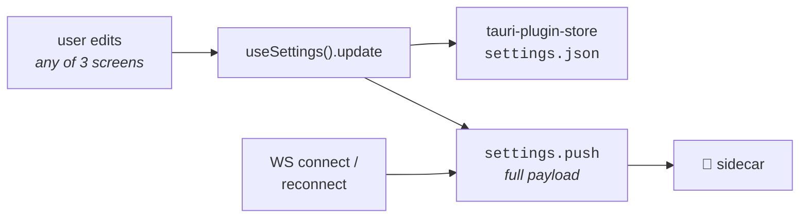

# Settings

  

> **What this is** · Every configurable value, where it is edited, and the rig-level machinery those values drive.
>
> **Owns** · The Rig / Settings / Task split · all twelve settings keys · persistence and the push to the sidecar · box→board bindings · board discovery · **the hardware utility baseline** · the handshake test.
>
> **Read with** · [dashboard.md](dashboard.md) (the port state machine these values feed) · [tasks.md](tasks.md) (the bundled sketch library and rig task defaults) · [data.md](data.md) (what the data and backup directories mean).

**Contents** — [1. The split](#1-the-split) · [2. The twelve keys](#2-the-twelve-keys) · [3. Persistence & push](#3-persistence--push) · [4. The Settings screen](#4-the-settings-screen) · [5. The Rig screen](#5-the-rig-screen-config) · [6. Box bindings](#6-box-bindings) · [7. Board discovery](#7-board-discovery) · [8. **The utility baseline**](#8-the-hardware-utility-baseline) · [9. The handshake test](#9-the-handshake-test)

---

## 1. The split

Three screens edit settings. **The split is by subject, not by shape.**

| Screen | Answers | Owns |
|---|---|---|
| ⚙️ **Settings** (`/settings`) | *Where does data go, and how does the app feel?* | Data directory, backup directory, reduced motion |
| 📡 **Rig** (`/config`) | *Which board is box 3, and what does every pin do?* | Box→board bindings (add/remove/name, with per-row health), the handshake test, the utility baseline, **the channel→pin wiring editor** (`/config/wiring`) behind a door on the landing, default baud, `arduino-cli` path. **The tab is labelled Rig; the route and `routes/Config.tsx` keep the old spelling** — the label is the operator's word for the subject, the path is an internal address nothing displays |
| 🔀 **Task** (`/task`) | *What is the animal doing?* | A **landing** listing this rig's saved tasks as cards (edit, delete, create), over the **task-profile editor** at `/task/new` and `/task/:taskId` (`tasks.md` §10–§11): the trial table, the shaping ramp, the parameters, and the state machine they derive. Saving one generates a flashable sketch. **The strobe vocabulary** (`/task/strobes`) sits behind a door here ([§5.0](#50-why-the-strobe-vocabulary-is-a-task-page)); the channel→pin map is on Rig |

> [!NOTE]
> **Both of the first two rows are about wiring, and they are different wirings.**
> The Rig tab binds a **box number to a board** — runtime indirection, per rig,
> changing whenever a board is swapped or Windows renumbers a COM port. Task → Rig
> wiring binds a **channel to a pin** — compile-time input, per box generation,
> baked into the firmware every task profile generates. The screens
> are named **Bind boxes** and **Rig wiring** so the distinction survives being
> spoken aloud; the box-setup step used to be called "Map hardware", which
> collided. The tab taking the name **Rig** is the same move one level up: the
> word the screen's own halves already used.

> [!NOTE]
> **This row has been decided twice.** The first split (Settings → Config) was by *shape*: hardware-ish vs storage-ish. The second (Config → Task) is by *subject*, and the forcing function was volume — making every firmware parameter operator-tunable turned a three-field panel into forty-odd fields, which is not a row on a hardware page.
>
> **Ownership never moved.** The settings *store* still holds every field in one place; only where each field is edited changed. All three screens write through the same `useSettings().update`.

---

## 2. The twelve keys

Defaults and normalization live in [`src/lib/settings/schema.ts`](../src/lib/settings/schema.ts); the shape is generated into `src/lib/ws/protocol.ts`.

| Key | Type | Default | Edited on | Effect |
|---|---|---|---|---|
| `dataDirectory` | `string \| null` | `null` | **Settings** → Storage | Where session data is written ([data.md §1](data.md#1-directory-structure)). Blank/whitespace normalizes to `null` |
| `backupDirectory` | `string \| null` | `null` | **Settings** → Storage | Second copy of session files and the cohort database on another drive or share ([data.md §7](data.md#7-backup-mirroring)). Setting it does **not** backfill |
| `arduinoCliPath` | `string \| null` | `null` | **Rig** → Hardware | Override for the bundled `arduino-cli`. Empty string coerces to `null` |
| `utilitySketchName` | `string \| null` | `null` | **Rig** → Utility baseline | The baseline every idle box is returned to ([§8](#8-the-hardware-utility-baseline)), by sketch **folder name** — the same key `taskDefaults` uses, because the bundled library's path is per-install while the name survives an update. `null` turns the baseline off |
| `defaultBaud` | `number` | **`115200`** | **Rig** → Hardware | Starting baud for each console. Debug Mode allows a per-box override. Options: 9600, 19200, 38400, 57600, 115200, 230400, 250000. **The default only applies to a fresh install** — the value is persisted, so an existing machine keeps whatever its store holds |
| `boxes` | `BoxBinding[]` | `[]` | **Rig** → Boxes | The user-managed box list — see [§6](#6-box-bindings) |
| `intan` | `{commandPort, waveformPort, spikePort}` | `5000 / 5001 / 5002` | **Rig** → Recording | Where Intan RHX's three TCP servers listen ([recording.md §2](recording.md#2-talking-to-rhx)). **No host** — Ephymeris only talks to an RHX on this machine. Absent on a store from before recording existed; both ends fall back to RHX's defaults |
| `recordingDefaults` | `Record<string, unknown>` | `{}` | the **Record** step (written on Continue) | The last recording setup confirmed — save root, format and save flags, thresholds, and each box's port / range / probe map — offered as the next one's starting point. Not the save directory (per session) nor the box list (per group). **Shell-only** |
| `reducedMotion` | `boolean` | `false` | **Settings** → Interface | Forces reduced motion on regardless of the system setting (which is always respected on top). **Shell-only** |
| `constellation` | `string \| null` | `null` | **Settings** → Constellation | Zodiac layout id for the box-status constellation. `null` = the legacy fixed layout. **Shell-only** |
| `constellationSlots` | `Record<string, number>` | `{}` | **Settings** → Constellation (drag), and box add/remove on Rig (reconciled) | Which star each box sits on, box number as a string key. **Shell-only** |
| `taskDefaults` | `Record<string, Record<string, unknown>>` | `{}` | **Sketches** | This rig's default task parameters, per sketch. **Shell-only** |

> [!IMPORTANT]
> **The sidecar reads only seven of these** — `arduinoCliPath`, `utilitySketchName`, `dataDirectory`, `backupDirectory`, `defaultBaud`, `boxes`, `intan` — and ignores the rest. That is why adding a settings field is deliberately a **non-event**: the shell-only keys needed no sidecar change at all. Removing one is a non-event on the same grounds: the retired `arduinoDirectory` is dropped by `normalizeSettings` on load, and a stale store still carrying it (or the path-valued `utilitySketchPath`, which heals to its basename) disturbs nothing.

**Normalization rules worth knowing:**

- `defaultBaud` accepts any `number > 0`, else falls back to 115200.
- `constellationSlots` requires an integer `>= 0`, with first-wins dedupe in box-number order. Star-index *range* validation is deliberately left to `reconcileSlots`, so a stale persisted map can never render a node off the chart.
- `constellation` is validated against the zodiac catalogue on load, so a corrupt store degrades to the legacy layout rather than breaking the widget.
- `taskDefaults` values are carried through unexamined; only values **diverging** from a sketch's own `task.json` defaults are stored, and an empty diff deletes the sketch's entry entirely.

> [!TIP]
> **`taskDefaults` is keyed by sketch folder *name*, not path**, because the bundled library's location is per-install — and the name is what the session file already records in `sketch`. `utilitySketchName` follows the same rule for the same reason.

---

## 3. Persistence & push



**The Tauri shell owns settings**, not the Python sidecar. Two reasons:

1. **Settings must work even when the sidecar doesn't.** Most of these fields — save paths, baud, the `arduino-cli` path — are exactly the values most likely to be *wrong* when something is misconfigured, and a wrong `arduino-cli` path or a bad save directory is a plausible cause of the sidecar failing to start. If the sidecar owned settings, a bad config could lock the user out of the one screen that fixes it.
2. The store plugin is simple and gives **native OS directory pickers** for free from the shell layer.

> [!IMPORTANT]
> **The sync is one-directional, Tauri → sidecar.** The full payload is pushed on every WebSocket connect/reconnect **and** on every change. The sidecar is never the source of truth. Worst case it is briefly running on stale values until the next push, rather than being unreachable entirely.

**Storage details.** `settings.json` in the app data directory, a single `"settings"` key, opened with `autoSave: false` and an explicit `save()` after every `set`. A *rejected* open promise is deliberately never cached, so one transient IO failure doesn't poison the session. Load failures fall back to the defaults so the screens stay usable.

Save failures surface as a persistent note on both Rig and Settings: *"Couldn't save to disk — your change may not survive a restart."*

> [!NOTE]
> The sidecar's own settings parser is **deliberately lenient** — an unknown key is a non-event, and a malformed value degrades to a default rather than killing the process that owns the ports.

---

## 4. The Settings screen

Three HUD tiles in the Rig tab's idiom (`HudTile` — icon, label, one live fact on the glass), cascading in over the sky. The facts are the point: **Storage** says whether the data is safe before its rows are read — no data directory outranks everything and takes the error tone, a failing mirror is next, a live mirror earns Ion, no mirror at all is quiet static because it is a choice rather than a fault; **Interface** says whether motion is reduced; **Constellation** shows the bound boxes as the sidebar's own health dots beside the chosen zodiac's name. Nothing here is gated on the WebSocket; only the backup readout goes quiet when disconnected.

### Storage

- **Data directory** — a native directory picker with a live status note.
- **Backup directory** — the same, plus a mirroring status line reporting queue depth or a failure, and a **Sync now** action (gated on the sidecar being connected).

> [!WARNING]
> **Setting a backup directory mirrors from that moment on; it does not backfill.** Automatic backfill could mean an unannounced multi-gigabyte copy to a network share the instant someone picks a folder, and it would fire again on every repoint. **Sync now** is the explicit version, and it doubles as the way to prove a target actually works before trusting it with anything.

### Interface

- **Reduced motion** — forces it on. The system preference is always respected on top, so this only ever adds restraint.

### Constellation

Moved here from the Rig screen, and the move is the argument: which zodiac the status display draws, and which star a box sits on, style how the rig is *shown* — the sidebar widget and the Dashboard sky — and never touch how it is wired. Interface, filed under Interface.

- **The interactive board** — drag a box to a different star to rearrange; per-box health lights the nodes.
- **The zodiac picker** — twelve hand-authored layouts ([§5.2](#52-zodiac-layouts)); layouts with fewer stars than configured boxes are disabled rather than distorted.

The slot map follows box add/remove made on the Rig tab automatically (`reconcileSlots` runs in the same settings write), so this section can be ignored forever and stay honest.

---

## 5. The Rig screen (`/config`)

One screen, in the order a rig comes up in — a column of HUD tiles in the Dashboard's idiom (frosted glass over the rig's sky, an icon header and one live mono fact per tile), still scrolling because these tiles are *forms* that grow with the rig.

| Tile | Contents |
|---|---|
| **Boxes** | The bindings table — add/remove a box, name it, bind it to a board — with a per-row health dot (the sidebar constellation's states and colours), plus the per-box handshake test. Header fact: connected/bound counts |
| **Utility baseline** | The utility sketch panel: which sketch idle boxes rest on, the per-box baseline state, and **Reflash boxes**. Header fact: the sketch name, or `off` |
| **Wiring** | A **door**, not a section: a full-width entrance tile in `EntranceTile`'s hover vocabulary (the tile lifts, a trace draws itself across a pin-header motif) opening the editor's own page at `/config/wiring` ([§5.1](#51-the-wiring-page-configwiring)). Fact line: channel count, and whether the wiring is this rig's own or as shipped. It is **full width** because the Strobes door that used to sit beside it moved to the Task landing ([§5.0](#50-why-the-strobe-vocabulary-is-a-task-page)) |
| **Recording** | The link to Intan RHX ([recording.md](recording.md)): connection state with RHX's controller, version, sample rate and per-port channel counts; a **Connect** button that says what to click in RHX when it cannot; and the three TCP ports. On the Rig tab because it answers *what is this rig connected to*, like the bindings above it. Header fact: connected or not |
| **Hardware** | The default baud select and the `arduino-cli` path override. Header fact: the baud |

### 5.0 Why the strobe vocabulary is a Task page

It was a Rig page, on the argument that a strobe code is a fact about what this
hardware can **report** in the same way a pin is a fact about what it can drive.
That symmetry is real, and it is not the one that decides the question.

A pin is compile-time *input* to the firmware every task generates: it goes into
`TaskPins.h`, it is the same for every task on the box, and an operator touches
it when the bench is rewired. A code is what a **condition is named by**. The
onset picker in the trial table is the only surface in the app that consumes
this table, an operator reaches for it mid-sentence while typing a trial row,
and the codes a task declares are decided one panel away by that same table. So
the vocabulary travels with the task; Rig keeps the pins.

Nothing about the page changed in the move. `/task/strobes` is **read-only**,
deliberately. The registry is append-only:
four years of recorded sessions carry these numbers, so a code is never
renumbered or repurposed. Renaming one would silently reinterpret every
historical file that carries it — confident wrong numbers rather than an error.
What a later version can safely offer is *adding* a code from `freeRanges`;
nothing else, and offering an edit that must then be refused is worse than not
offering it.

> [!CAUTION]
> **Deleting a code is possible exactly once, and the bar is not "unused".** It
> is *no recorded session has ever contained it* — which has to be checked
> against the archive rather than assumed. Thirty-four numbers were reclaimed on
> that basis in August 2026 (response ports 3-7, plus three interpreter-only
> codes); every one had been declared for firmware that never ran an animal. A
> code emitted even once, to a file that still exists, goes to `retired`
> instead.

The retired section is the part worth having on screen. Those codes are neither
live nor free — a third state — and a reader looking at a legacy session needs
to be told "retired", which is an explanation, rather than "unknown", which is a
question.

### 5.1 The wiring page (`/config/wiring`)

The channel→pin editor (`RigWiringEditor`, hosted by `routes/RigWiring.tsx`; formerly `/task/hardware`, then a section of the landing), with the room a workbench wants. The rules are unchanged through every move: the board map selects and moves, the inspector rail edits, and a save that would break tasks previews and asks first.

Two surfaces, one document, one selection — the **page** owns the `useRig` session and the selected channel; the editor and the table rent them:

- **The editor tile** — the action strip (status, problems count, Reset/Revert/Save), the board map, the legend, and the problems / would-break lists.
- **The pin table** (`PinTable`) — every configured channel as a listing, sorted by pin number: pin, channel name with its kind colour, kind, label, and a detail column (a response port's strobe slot, a reward line's `serves`/`not plumbed`, a watch bit). It edits nothing — a row click performs the map's own select gesture, so the two surfaces can never disagree; it reads the live document, unsaved edits included.

**There is no setup wizard.** There was — five linear steps over the same surfaces, gated on a `boxSetupComplete` flag — and it is retired along with the flag: with the page itself reading in setup order and the Boxes table opening on its own "add one for each box" prompt, a second, modal way through the same four surfaces was a maintenance cost with no second story to tell. First run simply lands here. (A stale store's `boxSetupComplete` is ignored, like `arduinoDirectory` before it.)

The constellation board and picker are on **Settings → Constellation** now ([§4](#4-the-settings-screen)): they style the status display and never touch the hardware. The slot map still follows box add/remove made here — `reconcileSlots` runs in the same settings write.

> [!NOTE]
> **A seventh kind: `sync`.** One output channel that pulses on every strobe, into a recording controller's digital input ([recording.md §3](recording.md#3-the-sync-line)) — `sync_out`, pin 49 as shipped. Resolved **by kind**, like the engagement port, so a rig may call it anything. **`RIG105`** refuses a second one: the firmware pulses a single line (`BOX_PIN_SYNC_OUT`), so a second sync channel is a wire believed to carry events that carries nothing. **Zero is legal** — a box with no recording controller has no sync line — and is *stated* in the generated header as `-1` rather than left to `BoxPins.h`'s default, because the default would pulse a pin the operator never declared. A rig document saved before this kind existed **has no sync channel until one is added**, since the document replaces the shipped pair rather than merging with it; the recording step checks and links here.

### 5.2 Zodiac layouts

Twelve **hand-authored, simplified asterisms** — data, not generated, because they must be recognizable.

- **Star counts are honest** (Aries has four), and the picker **disables any constellation with fewer stars than configured boxes** rather than distorting the shape.
- **Slots follow boxes.** Deleting a box frees its star; a new box takes the lowest free star; switching constellations keeps star indices that still exist. `reconcileSlots` is the single authority, and `layoutFor` runs it defensively.
- **Drag is snap-to-star** — raw pointer events with viewBox-space hit-testing, a ghost node while dragging, snap to the nearest star within radius or revert, and **swap** when the target is occupied. **One settings write per completed drag, never per pointer move.**

---

## 6. Box bindings

```ts
BoxBinding = { box: number; hardwareId: string | null; label: string; intanDigitalIn: number | null }
```

> [!IMPORTANT]
> **Box number 1–6 is the key everywhere** — in the UI, on the wire, and in the data model. A COM port address is **never** a key, because Windows renumbers COM ports across reboots. The sidecar resolves `box → hardware_id → current address` internally, where `hardware_id` is the board's USB serial number.

| Rule | Detail |
|---|---|
| `box` range | An integer 1–6. Duplicates collapse (the list is Map-keyed) and is sorted by box number |
| Not padded | The list holds only the boxes the user created — a two-box rig has two rows, not six |
| **"Bound"** | `hardwareId !== null`. This is the single definition of a real box, and what every "is there a box here" check gates on |
| `label` | Defaults to `Box N`. The per-box nickname |
| `intanDigitalIn` | Which of the recording controller's digital inputs this box's **sync line** reaches, 1–16, or `null` when the box is not wired for recording ([recording.md §3.2](recording.md#32-wiring-and-binding)). **A binding, not wiring**, for exactly the reason `hardwareId` is: it describes a cable between two instruments, not the box. **Two boxes may not share an input** — every edge would be matched against both strobe streams — so the picker does not offer one another box holds, and both normalizers drop a duplicate (lower box number wins), which leaves the later box reading as unwired and refused by the recording step rather than recording plausibly and wrongly |

> [!NOTE]
> **Gates are on *bound*, not *detected*.** Detection only downgrades a label. A cohort can be fully configured — animals assigned to boxes 1–6 — before any hardware is connected, and the sidecar validates a cohort's `boxNumber` against the bare 1–6 range only, never against which boards happen to be bound right now. That is what keeps a cohort editable on the other lab machine.

**Re-binding.** A board swap is a routine lab event. Bindings live on the Rig tab with a per-box handshake test to confirm a swap took. What is still open is proactive surfacing — *"a new board appeared, bind it to box 3?"* — rather than the user knowing to open the Rig tab.

> [!WARNING]
> **A stale handler must never survive a rebind.** Close the port before rebinding, or rebind only while `IDLE`. This is the same rule that makes the handshake test close a box already in `PASSTHROUGH` before running.

---

## 7. Board discovery

**Board presence and identity are checked without ever opening the port** — via the arduino-cli daemon's board-list RPC, backed by the OS's serial port enumeration, on a continuous **1.5 s** interval. Since the gRPC migration this costs no process spawn at all.

> [!IMPORTANT]
> **Because it never opens a port, presence polling does not participate in the per-port state machine at all** and never contends with `PASSTHROUGH`, `FLASHING`, `RESETTING`, or `IN_SESSION` for ownership. A box reports "connected" and "flashing" as **two independent facts**.

**Filtering.** Board-list output includes non-Arduino serial ports (Bluetooth, debug consoles), so the poller keeps only entries with `protocol == "serial"`, a non-blank `hardware_id` (falling back to `properties.serialNumber`), a truthy vendor id, and a non-empty address.

> [!NOTE]
> It deliberately does **not** allow-list specific vendor ids — CH340 and FTDI clones are common in the lab and must still appear, even though they report no FQBN.

Both backends (daemon and subprocess fallback) apply identical filters, pinned against each other by `test_grpc_tool.py`.

---

## 8. The hardware utility baseline

**The rig has a resting state, and the app maintains it.** A box that isn't flashing, isn't in a console, and isn't running a session should be sitting on the operator's chosen *hardware utility sketch* — the one that speaks Ephymeris's own vocabulary. That is what "baseline" means here: **not a mode the user enters, but the firmware a free box is expected to be carrying.**

The reason to want it is concrete. Before this, the state of a board between sessions was whatever the last thing to touch it happened to leave behind — a task sketch from three weeks ago, a half-finished prime, an unflashed board fresh out of a drawer. Nothing could be asked of a box without first asking the operator to flash something, so every small piece of hardware assistance had to begin with a detour. Maintaining the baseline pays that cost once, in the background, and turns those into things the app can simply do.

### 8.1 When a restore happens

**The trigger is always *a box becoming free*, never a clock.**

| Trigger | Notes |
|---|---|
| **On startup** | When the presence poll first reports the rig. The cold case: nothing is known about any board, so every bound box is a candidate |
| **When a board appears** | Replugged, or newly bound on the Rig tab |
| **When a port falls back to `IDLE`** | A run finishing, a console closing, an error acknowledged. Hooking the **transition** rather than each command means every path to idleness is covered by one rule, including ones added later — **which is also how it came to cover one it should not have**: a Debug Mode flash ends in `IDLE` too (§8.2, the pin) |
| **When a session lets go** | `sessions.end`, `sessions.switchGroup`, or `sessions.abandon`. Switch Group restores *immediately* rather than waiting for the whole session, because the operator's very next act is walking the rig to swap animals — and that walk is what wants the lights |
| **On demand** | The Rig tab's **Reflash boxes** button (the only path that passes `force`), the placement walk's request for its boxes, and Debug Mode's **Return to baseline**. Any `utility.ensure` arriving over the wire is a person asking, and is what releases a pin (§8.2) |

Restores run **one box at a time, sequentially**, for the same reason the session flash sequence does.

> [!WARNING]
> **Cold start is six sequential flashes.** The first presence poll after launch triggers a restore of every bound box, so a fresh launch has the rig busy for a minute or two. If that proves annoying the fix is to **defer** the cold restore until something needs a box — **not** to parallelise it, which would fight the one-owner-per-port rule.

### 8.2 What it will never do

Three exclusions carry the whole design, and all of them are about not being clever.

> [!CAUTION]
> **Only an `IDLE` port is ever touched.** Entering `FLASHING` would happily force-release a `PASSTHROUGH` console — correct when a *user* asks to flash, and unacceptable when a background restore does. **The check is on the port already being idle, not on the transition being legal.**

> [!CAUTION]
> **A confirmed session mapping holds the entire rig.** Between `sessions.confirmMapping` and the session ending, boxes carry task sketches and fall idle constantly — between the flash sequence and Start All, and again after each animal finishes. A restore in that window would **erase the sketch the runner is about to start**. The hold is not an optimisation; it is the difference between this feature working and it destroying sessions.
>
> If any path out of a session ever fails to release the hold, the rig quietly stops returning to baseline. If a release ever landed *early*, a restore would erase a task sketch mid-setup.

> [!CAUTION]
> **A deliberate flash is pinned.** A `port.flash` from Debug Mode puts a sketch on a box because the operator wants it there — and the port falls `IDLE` the moment that flash completes, which is exactly the trigger §8.1 listens for. With no pin, the baseline re-flashed itself over the operator's task **within seconds of it landing, silently**: the box could not be started or talked to, and nothing on screen said why. It was latent from the day the idle hook was written and surfaced when the Task tab made flashing a task from Debug Mode an ordinary thing to do.
>
> The sidecar tells the two kinds of flash apart by `suppressPassthroughResume`, which the session flash sequence already sets and Debug Mode never does (`dashboard.md` §5.3). A pinned box reports `pinned` and is skipped by **every automatic trigger**. The pin is released only by something a person did: any `utility.ensure` over the wire naming that box, a session releasing the rig, the board being unplugged, a different utility sketch being named, or the operator flashing the utility sketch by hand. `force` overrides it, as it overrides everything.
>
> `tests/test_debug_flash.py` drives the real `port.flash` handler over a port manager whose idle hook is wired the way the app's is. `test_utility.py`'s harness wires that hook to a no-op, which is how this went unseen.

**A failed restore is reported and then acknowledged back out of `ERROR`.** A failed flash normally leaves the port in `ERROR` awaiting a manual ack, which is right when the operator asked for the flash and wrong when they didn't: a broken `arduino-cli` would otherwise put all six boxes into a state needing individual clearing before anything else could run. The fault is surfaced in Config instead, and **the failure is sticky per box** so the acknowledgement can't bounce straight into another doomed attempt.

### 8.3 Identify — asking a box to point at itself

With a known sketch on the board, *"which box is box 3?"* becomes answerable in hardware. The utility sketch's profile may declare an [`identify` pair](tasks.md#36-identify) — two commands, on and off.

The sequence: open `PASSTHROUGH` → wait for the board's boot line → send the *on* command → **wait for the sketch's own telemetry line as confirmation**. The matching *off* sends the counterpart and closes the console again — but **only if this layer was the one that opened it.** A box the user has open in Debug Mode keeps its console.

> [!IMPORTANT]
> **Waiting for the reply rather than assuming it is what makes this trustworthy.** The most likely silent failure is a **baud mismatch**, and the difference between "the light is on" and "we sent something into the void" is exactly the difference the operator needs to know about. When no reply comes, the box is reported failed with that cause named.
>
> Building this is what surfaced that `defaultBaud` shipped as 115200 while every sketch in the lab's directory opened at 9600 — the check found a real misconfiguration on its first read-through, before it ever ran. *(Both have since moved to 115200 together; the lesson stands, and the direction of the mismatch is the only thing that changed.)*

> [!WARNING]
> **The confirmation assumes `telemetry`.** A utility sketch declaring `identify` but no `telemetry` gets no confirmation and is trusted on the send alone.

Its first consumer is the [guided placement walk](dashboard.md#73-step-2--mapping-and-the-guided-placement-walk-sessionidmapping), which deliberately runs **before** the session flash sequence — the boxes are still at baseline then, and that is the only firmware that can be asked to light one.

The `identify` commands come from the profile, **never from anything hardcoded**. That is why the walk works on a rig whose boxes signal with a buzzer, an LED on a different pin, or not at all.

### 8.4 What a baseline sketch owes the rig

A sketch nominated as the baseline is held to two rules a merely-useful utility sketch isn't — because of what the baseline *is*: the firmware sitting on every box the rest of the time, **including while animals are being placed into them.**

1. **Announce `READY` on boot**, exactly as a task sketch does. It is what the handshake test looks for to report the top tier, and it is the app's only evidence that the board on the far end speaks its protocol at all. It does **not** then block for a `START` the way a task sketch does — there is no session, and the app begins sending commands the moment the port opens.

2. **Do nothing on its own.**

> [!CAUTION]
> **`BOX_Utility` inherited a convenience from `TEST_Box`, where an odor poke while idle started the full self-test.** That was reasonable for a sketch you flashed by hand when you wanted to test a box. It is **not** reasonable for the resting firmware: **an animal placed in a chamber nose-pokes**, and the self-test fires all twelve odor lines and pulses every fluid line. Removed. **A baseline sketch reacts to the app and to nothing else.**

---

## 9. The handshake test

Config's per-box handshake test is composed from existing wire primitives, deliberately **with no new command**:

1. `port.passthrough.open` — the open asserts DTR, which resets the Mega, and its boot output lands in `port.output` because the reader thread is attached by then.
2. Listen up to **10 s** (the sidecar's own `READY` budget) for a `READY` line, or any output at all.
3. Always close in a `finally`, including on unmount.

| Tier | Meaning | Colour |
|---|---|---|
| 🟢 `ready` | `READY` line seen — speaks the Ephymeris protocol | Ion |
| 🟣 `output` | Some output — wiring and port good, but not an Ephymeris task sketch | Pulsar |
| 🟡 `silent` | Port opened, nothing heard — **wrong baud**, or a mute sketch | status-warning |
| 🔴 `failed` | Port never opened — unbound box, missing or busy port | status-error |

> [!CAUTION]
> **`port.reset` is unsuitable for this and the test must never use it.** Its DTR pulse opens a throwaway handle that is never read, so the boot output it provokes is **unobservable** — and from `PASSTHROUGH` it would reset the board twice.

A box already in `PASSTHROUGH` is closed before the test, since re-opening is what causes the observable reset.

---

**Where to next** — [dashboard.md](dashboard.md) (the state machine these values drive) · [tasks.md](tasks.md) (the bundled sketch library and rig defaults) · [data.md](data.md) (the directories) · [README.md](README.md)
