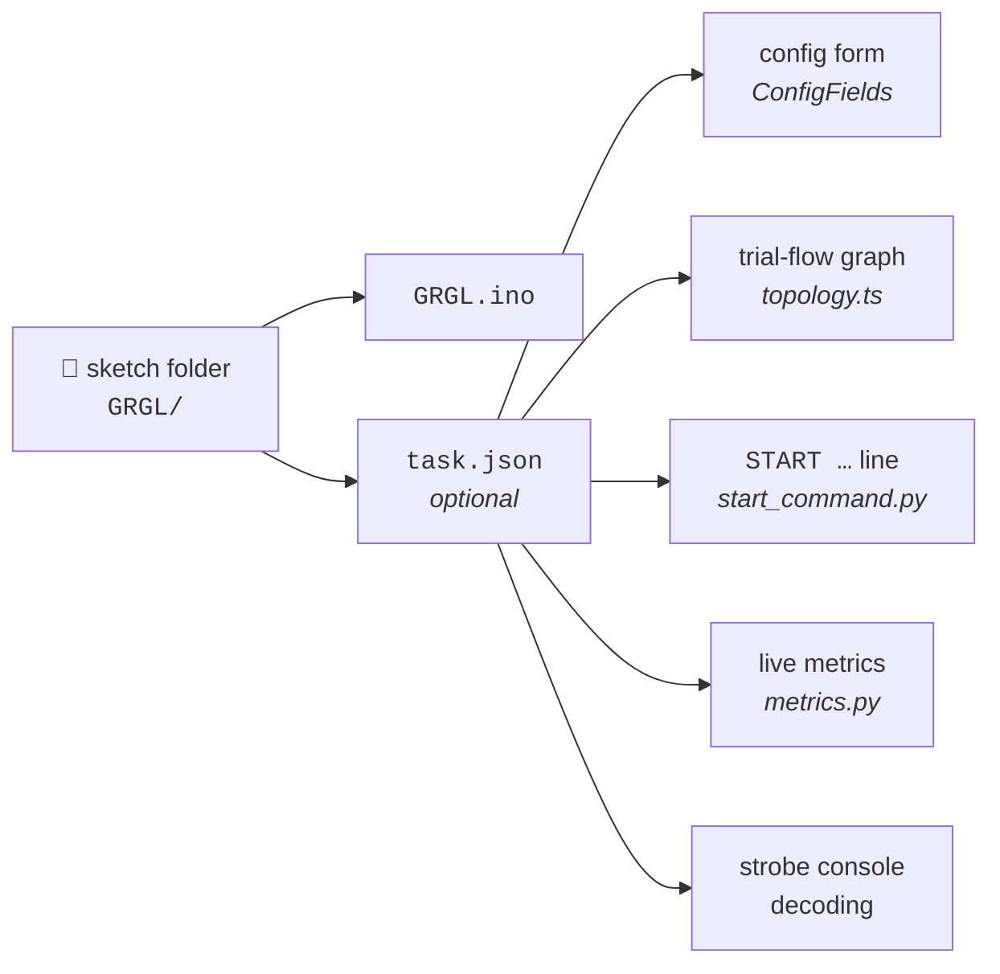
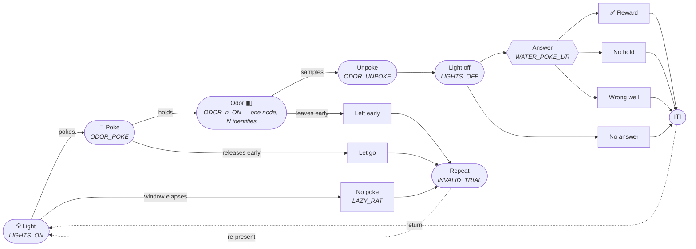
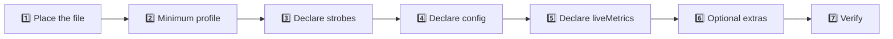

# Tasks

 

> **What this is** · Everything between "I have a sketch that emits strobes" and "the app renders its trial flow, builds its `START` line, and scores it live."
>
> **Owns** · The bundled sketch library · the `task.json` schema · the derived trial-flow state machine · live metrics · `START` construction · the profile and parameter hashes.
>
> **Read with** · [data.md](data.md) (what the recorded values become on disk and in Analytics) · [dashboard.md](dashboard.md) (where the graph is rendered live) · [settings.md](settings.md) (where the directory and rig defaults are edited).

**Contents** — [1. What a task is](#1-what-a-task-is) · [2. The sketch library](#2-the-bundled-sketch-library) · [3. `task.json`](#3-taskjson-reference) · [4. The derived state machine](#4-the-derived-state-machine) · [5. Live metrics](#5-live-metrics) · [6. Values → the wire](#6-from-values-to-the-wire) · [7. Hashes](#7-profile_hash-and-params_hash) · [8. **Authoring guide**](#8-authoring-guide--define-your-own-task) · [9. Validation](#9-validation-and-failure-modes) · [10. The Task screen](#10-the-task-screen)

---

## 1. What a task is

A **task** is a behaviour sketch plus an optional `task.json` sibling that describes it. That description is what lets Ephymeris render a configuration form, draw the trial-flow diagram, build the `START` command, and score live metrics — for a sketch the app has never seen.

> [!IMPORTANT]
> **No sketch is special-cased in app code.** Drive everything off the profile. If you find yourself writing `if (sketchName === "GRGL")`, the profile is missing a declaration.

A sketch with **no** `task.json` is fully supported. It gets a bare `START`, no config form, and a raw scrolling strobe log instead of charts. Not every sketch is a scored task.

### 1.1 Two places a value can come from

There is exactly one behaviour sketch — `GRGL` — and everything an experiment varies reaches it one of two ways. Which way is not a preference; it follows from what the firmware can accept.

| | Arrives at | Carries | Changing it costs |
|---|---|---|---|
| **Generated headers** | compile time | the trial table, the channel→pin map, the strobe selection, how many ramp stages exist, which selector runs | a rebuild + reflash |
| **The `START` line** | run time | every timing, hold, window, penalty, reward volume, anti-bias clamp and stage threshold | a serial line |

The dividing line is the [`START_LINE_MAX` cap](#63-the-line-length-cap). A trial table and a pin map do not fit on a 640-byte line, and pins have to be compile-time constants anyway. Everything that *does* fit stays on the wire, which is what lets **one flashed binary serve six boxes tuned differently** — the per-box overrides at mapping would otherwise mean six compiles.

The two headers are `TaskPins.h` (pure preprocessor, included *before* `<BehaviorBox.h>`, which guards every pin and strobe definition with `#ifndef`) and `TaskTrials.h` (constructs `TrialType`, so it comes *after*). A sketch with neither compiles against the box as built — which is how the shipped `GRGL/` folder runs the lab's historical 2-odor task from a bare checkout.



---

## 2. The bundled sketch library

Sketches **ship with the app**, and the shipped library is the **only** source of flashable sketches. There is no configured directory and no arbitrary-file fallback — one source of truth is what makes the error states in [§2.4](#24-error-and-empty-states) unambiguous, and shipping it is what makes the library a fact about the build rather than a setting someone can get wrong.

The deliberate trade, stated plainly: **adding or changing a sketch needs a new build.** The library is staged at build time by `scripts/stage-sketches.mjs` from the lab's firmware repo (behaviour sketches + `libraries/BehaviorBox`, still a sibling checkout), whose `libraries/` collection becomes the one root that reaches `arduino-cli --libraries`. The Task screen names the sketch count so an operator can say which library they have.

> [!WARNING]
> **The rule that causes the most confusion.** A folder is a valid sketch **only if it contains a `.ino` whose filename matches the folder's own name** — `clean_flush/clean_flush.ino`, never `clean_flush/main.ino`. This is arduino-cli's requirement, not ours. Folders that fail it are **skipped and reported**, never silently dropped.

### 2.1 Location

Resolution order, mirroring how the shell already picks a sidecar interpreter (`sidecar.rs::resolve_launch`):

| Priority | Source | When |
|---|---|---|
| 1 | `$EPHYMERIS_SKETCH_LIBRARY` | A developer pointing the sidecar somewhere else. An env var and **deliberately not a setting** — it never appears in the UI, never persists, and cannot reintroduce a configurable directory by the back door |
| 2 | `$EPHYMERIS_BUNDLED_SKETCHES` | An installed build. Set by the Tauri shell from its resource dir, exactly as `EPHYMERIS_BUNDLED_ARDUINO_CLI` already is |
| 3 | `<repo>/sketches` | A checkout. Staged by `npm run predev` (or `npm run stage:sketches`), which is what makes `tauri dev` work with no installer resources |

- Owned by `discovery.library_root()` / `library_status()`; the status rides the `settings.push` reply so a client learns it on connect.
- **`arduinoDirectory` is retired.** A stored value is dropped by `normalizeSettings` — silently on purpose, since the key configured a directory nothing reads any more. Do not reintroduce it.

> [!NOTE]
> **History.** Until v1.1 this was a per-machine, user-configured directory, chosen on the Task screen. That design made the library's completeness the user's problem; bundling makes it the build's. What was lost is the same-afternoon loop of writing a sketch and flashing it without a build — the walk-back, if that loss bites, is a hidden additional library that *appends* to the bundle, never a return of the configured root.

### 2.2 Required structure

```
<library root>/
├── Utility/                     ← a category
│   └── BOX_Utility/
│       ├── BOX_Utility.ino
│       └── task.json            ← optional; makes it app-drivable
├── Olfactory Behavior/          ← a category holding sub-categories
│   ├── 01_Shaping/              ← a sub-category
│   └── GRGL/                    ← the behaviour task
│       ├── GRGL.ino
│       ├── TaskPins.h           ← generated: pins, strobes, counts, mode
│       ├── TaskTrials.h         ← generated: the trial table
│       └── task.json
├── Utility/
│   ├── BOX_Utility/             ← the baseline; drives every channel
│   └── GRGL_Sim/                ← drives a real box with no animal in it
│       └── libraries/           ← reserved at any depth; not passed to compile
└── libraries/                   ← reserved name, not a category; the compile root
    └── BehaviorBox/             ← from the firmware repo
        ├── BehaviorBox.h
        ├── BoxPins.h
        └── BoxStrobes.h
```

| Rule | Detail |
|---|---|
| **Categories** | Any top-level folder other than `libraries/` (matched case-insensitively). Names are **not** hardcoded — "Utility" and "Olfactory Behavior" are examples, not an enum. |
| **Nesting** | Categories may nest. The scan descends until it finds sketches, up to **5 levels**. A sketch's category is **the folder directly containing it** — `GRGL` files under `Olfactory Behavior`. |
| **Sketch folders are terminal** | Once a folder is recognised as a valid sketch, its contents (`src/`, `extras/`, …) belong to it and are not scanned further. |
| **Hidden folders** | Anything beginning with `.` is ignored **silently**. Reporting `.git/objects` as unreadable would bury genuine problems in noise. |
| **Sketches need a category** | A valid sketch folder sitting directly at the root is reported as skipped — it has no category to be filed under. |
| **`libraries/` is reserved at every depth** | A nested `.../libraries/` is never scanned as a category or a sketch. Only the **root** one is passed to `arduino-cli --libraries`, so every sketch compiles against one predictable collection. |
| **Library layout** | Plain folders under the root `libraries/`, each holding matching `.h`/`.cpp`. No `library.properties` manifest required — confirmed against arduino-cli 1.5.1, whose `used_libraries` resolved from exactly this layout. |

> [!TIP]
> Put shared headers **directly** in the root `libraries/` (a real folder, not a symlink from the root into a nested collection). Symlinks are fragile on the Windows lab machines, and only the root path is handed to the compiler anyway.

### 2.3 Discovery

The Python sidecar performs discovery (`discovery.py`). Triggers: every `settings.push` (which arrives on connect and on any change), a manual **Refresh**, and route mount. There is **no live filesystem watcher** — the library changes when the app does, so scan-on-trigger is more than enough.

1. Resolve and check the library root ([§2.1](#21-location)).
2. Enumerate top-level subfolders; set aside the root `libraries/`, ignore hidden folders.
3. For each remaining folder, descend looking for sketches, applying the folder-name-matches-`.ino` rule. A folder that *is* a valid sketch is recorded (category = its parent) and not descended into; a folder with no `.ino` is a sub-category and is scanned one level deeper.
4. Folders that **contain an `.ino` but none matching the folder's own name** are **skipped but reported**. A folder holding no `.ino` at all is plain organisation, not a broken sketch, and is not reported.
5. Result: a flat list of `{category, sketch_name, path}`, naturally groupable for display.
6. Enumerate the root `libraries/` separately; that path goes to `arduino-cli compile --libraries <path>`.

**Bounds.** At most 5 levels deep. Symlinks are followed, but every directory is resolved and recorded, so a loop terminates and a directory reachable by two paths is reported once.

**The three reported skip reasons**, each surfaced with its path so the problem is inspectable:

| Reason | Meaning |
|---|---|
| `no <name>.ino matching the folder name` | The folder holds some `.ino`, just not the one arduino-cli needs |
| `sketch folders belong inside a category folder` | A valid sketch sitting directly at the root |
| `couldn't be read: <error>` | Permissions or an I/O failure on that directory |

### 2.4 Error and empty states

Three distinct states plus a derived note — and every non-ok state now means a **broken or partial install**, never a wrong setting. That is a genuine inversion of the copy, not a rename: the retired states offered a directory picker as the way back; these point at reinstalling, because there is nothing else a user *can* do. `not_configured` is gone entirely — there is nothing to configure, so there is no first-run state to be in.

| State | Condition | Treatment |
|---|---|---|
| 🔴 **Damaged** | The shipped library is missing, not a directory, or unreadable | "The install looks incomplete — reinstalling should fix it" |
| 🟡 **Empty** | Readable, zero valid sketches | Same remedy — a library that shipped without sketches is a partial install, not a naming lesson |
| 🟢 **Ok** | Sketches found | The Task screen names the count: *"N sketches ship with this version of Ephymeris. Adding or changing one needs a new build."* |
| 🟠 **Partial** *(derived)* | `ok` with a non-zero skipped count | Non-blocking — the list populates, with an "N items couldn't be read" note |

`SketchLibraryStatus.source` records whether the root came from the bundle or from `$EPHYMERIS_SKETCH_LIBRARY` — a developer fact, carried so a bug report can say which library was actually scanned.

---

## 3. `task.json` reference

The file sits **sibling to the `.ino`** inside the sketch's own folder, and is **per-sketch, never shared**: a profile declares *this sketch's* vocabulary and config surface, and one file serving two sketches drifts out of sync with one of them.

Authority: [`sidecar/ephymeris_sidecar/tasks/profile.py`](../sidecar/ephymeris_sidecar/tasks/profile.py) — the parser is the only enforcement point.

### 3.1 Top-level keys

| Key | Type | Required | Default | Semantics |
|---|---|:---:|---|---|
| `taskName` | string, non-empty | ✅ | — | Display name; also stored on the profile snapshot row |
| `kind` | `"behavior"` \| `"utility"` | | `"behavior"` | Only these two validate; anything else raises |
| `config` | array of field objects | | `[]` | Drives the form, the `START` line, and the session-file metadata |
| `strobes` | object, int-as-string keys → names | | `{}` | The code→name map |
| `liveMetrics` | array | | `[]` | Rolling P(hit) metrics — **and** the gate for the graph's odor rows |
| `controls` | array | | `[]` | Utility profiles: the widgets Debug Mode renders |
| `telemetry` | object | | absent | Utility profiles: how to parse `STATUS` lines |
| `identify` | `{on, off}` | | absent | The two commands that make a box announce itself |
| `legacyNames` | array of strings | | `[]` | Names older software wrote into a run's `sketch` field |

Unknown top-level keys are **silently ignored**.

> [!NOTE]
> **`kind` is a convention, not a schema gate.** The parser reads `config`, `strobes`, `liveMetrics`, `controls`, and `telemetry` from *every* profile regardless of `kind`. A `utility` profile carrying `liveMetrics` is accepted and simply never scored. A malformed `kind` is the only thing actually rejected. Write to the convention — nothing enforces it for you.

> [!CAUTION]
> **There is deliberately no `states` or `graph` key, and none should be added.** See [§4.1](#41-why-derived-not-declared).

### 3.2 `config[]` — a field

```python
@dataclass(frozen=True)
class ConfigField:
    metadata_key: str        # the .json/.mat field name
    wire_key: str            # the START command token
    label: str
    type: str
    default: Any
    group: str | None = None
    unit: str | None = None
    min: float | None = None
    max: float | None = None
    step: float | None = None
    help: str | None = None
    advanced: bool = False
```

| Key | Required | Rules |
|---|:---:|---|
| `metadataKey` | ✅ | Non-empty. The key the form collects under, and the key written **flat** into the session `.json`/`.mat`. |
| `wireKey` | ✅ | Non-empty. The `START` token. |
| `type` | ✅ | One of `int`, `float`, `bool`, `string`. |
| `label` | | Falls back to `metadataKey`. |
| `default` | | Type-checked against `type`. `bool` is guarded separately because it is an `int` subclass in Python. A `string` default **may not contain whitespace** — the `START` grammar is space-separated. |
| `group` | | Non-empty string. The section heading, **and** the key the graph's `governedBy` matches on, **and** what `GROUP_ORDER` sorts. Absent = ungrouped. |
| `unit` | | Non-empty string, rendered as a suffix (`ms`, `µL`). |
| `min` / `max` | | Numbers (bool rejected). **Inclusive**; the form *clamps*, never rejects. `min > max` raises. |
| `step` | | A number. Presentation only — currently unused by `ConfigFields`. |
| `help` | | Non-empty string, rendered under the label and as a `title`. |
| `advanced` | | Strictly `true` collapses the field behind a disclosure. |

> [!CAUTION]
> **Four silent-failure guards, all enforced at parse time.** Each of these would produce wrong data rather than an error if it were allowed through:
>
> 1. **`wireKey` may not be `SEED`** — the host appends that token itself ([§6.4](#64-seed)).
> 2. **`metadataKey` may not collide with a core session-file field** — `rat`, `serial_port`, `session_id`, `sketch`, `stop_reason`, `n_events`, `ts_data`, `trial_seed`, `host_seed`. Config merges in **flat at the top level**, so a collision would quietly overwrite the core field.
> 3. **No duplicate `metadataKey`.**
> 4. **No duplicate `wireKey`.**

> [!CAUTION]
> **A ramped value is declared per stage, never once.** The firmware rewrites `odorPokeHold` / `fluidWellHold` / `fluidWellPoll` / `odorPortTimeout` at every stage boundary. A profile offering one of them as a single field would appear to work and then be **silently overwritten around trial 15–20**.
>
> Declare the schedule as ordinary `int` fields grouped `Stage 0` … `Stage 4`: `S<n>T` is the completed-trial count at which the row engages, and `S<n>P` / `S<n>H` / `S<n>W` / `S<n>O` are that row's odor-poke hold, fluid-well hold, response window, and odor-port timeout. A task that does **not** ramp declares row 0 only, and the firmware leaves rows 1–4 at a trial count no session can reach.

**Why the presentation metadata exists.** A profile is no longer three fields. The lab's behaviour sketches expose every timing, hold, window, penalty, reward volume, pool weight and stage threshold — forty-odd fields — and a flat list of forty unlabelled numbers is not a form anyone can use safely. None of it changes the wire; a profile declaring none renders exactly as it did before these keys existed, which is what keeps a three-field profile and a forty-field one on one code path.

> [!NOTE]
> `to_json()` **omits** absent optional keys rather than emitting `null`, and emits `advanced` only when true. That is load-bearing for [`profile_hash`](#7-profile_hash-and-params_hash) stability across profiles written before those keys existed.

### 3.3 `strobes`

`Record<string, string>` — code → name. Every key is coerced with `int()`; a non-integer key raises. Values are taken verbatim with no validation.

> [!WARNING]
> **Declare the whole shared `BF_*` vocabulary — every code in `BehaviorBox.h`, not the subset this sketch happens to emit.** `liveMetrics` doesn't need it (those reference raw codes), but three consumers are keyed entirely off it:
>
> 1. Mission Control's strobe console decodes each line through it.
> 2. `liveTrials.ts`'s `vocabFrom` builds its whole recogniser from it.
> 3. The trial-flow graph ([§4](#4-the-derived-state-machine)) is *derived* from it.
>
> **A partial map degrades all three silently.** `GRGL_Sim` declared 23 of 31 codes, omitting `LIGHTS_OFF`, `WATER_UNPOKE_L`/`_R` and `WATER_POKE_NONE` — all of which it emits. The console showed `Strobe 233` for codes the protocol names perfectly well; the graph lost its response-window state; and the live token had no way to leave the reward node, so it sat on `Reward` for the whole ITI. **Nothing errored** — each layer degraded exactly as designed for a genuinely unknown code.
>
> Declaring the full vocabulary costs nothing: what a sketch *presents* is stated by `liveMetrics`, never by which codes it lists here.

**Derived property.** The end-of-session code is found by *name*, not by a fixed number — the first entry whose name contains `END_SESSION`.

### 3.4 `liveMetrics[]`

```jsonc
{ "id": "p_r_odor1", "label": "P(R | Odor 1)",
  "triggerCode": 101, "successCode": 249, "alternateCode": 248, "windowSize": 20 }
```

| Key | Required | Notes |
|---|:---:|---|
| `id` | ✅ | Stable identifier, and **only** that — a generated profile numbers them `p_correct_1`, `p_correct_2`, which names no condition |
| `triggerCode` | ✅ | int — opens a trial for this metric |
| `successCode` | ✅ | int — scores a hit |
| `alternateCode` | ✅ | int — scores a miss (still in the denominator) |
| `label` | | What every readout titles this metric with. Falls back to `id`, which is a slot number — so a profile generated from a task definition builds it from the trial type's own name (`P(right well | Go right)`), and naming that type is [required](#113-the-eleven-diagnostics) |
| `windowSize` | | Default **20**, deliberately matching the sketch's own anti-bias `biasWindow` default |

> [!IMPORTANT]
> **`liveMetrics` order is load-bearing** — it names the graph's odor conditions in authored order. And `liveMetrics` is doing double duty: besides scoring, it is [the gate](#43-the-three-pre-passes) that decides which declared odor codes become drawn conditions.

### 3.5 `controls` and `telemetry` — utility profiles

A `"kind": "utility"` profile makes a cleaning/priming/self-test sketch first-class in **Debug Mode** without hardcoding it. Utility sketches run in `PASSTHROUGH`, never `IN_SESSION`, so their control and status ride the existing passthrough primitives: **no new wire commands, and nothing they emit is stored.**

<details>
<summary><strong>Example — a priming sketch</strong></summary>

```jsonc
{
  "taskName": "Prime Lines (latch)",
  "kind": "utility",
  "controls": [
    { "id": "gear", "label": "Fluid set", "type": "select", "options": [
      { "label": "Set 1", "command": "SET GEAR=1" },
      { "label": "Set 2", "command": "SET GEAR=2" }
    ] },
    { "id": "toggle_l", "label": "Toggle L", "type": "button", "command": "TOGGLE L" },
    { "id": "alloff",   "label": "All off",  "type": "button", "command": "ALLOFF" }
  ],
  "telemetry": {
    "match": "STATUS",
    "fields": [
      { "key": "gear",  "label": "Fluid set" },
      { "key": "left",  "label": "Left line" },
      { "key": "right", "label": "Right line" }
    ]
  }
}
```

</details>

| Control type | Renders as | Sends | Requires |
|---|---|---|---|
| `button` | one button | its `command` | non-empty `command` |
| `select` | a dropdown | the chosen option's `command` | non-empty `options[]`, each with a `command` |
| `grid` | a labelled row per channel, each with a live state lamp | that row's `toggle` or `pulse` | non-empty `channels[]`; each needs a `label` **and at least one of `toggle`/`pulse`** |

**Why `grid` exists.** A behavior box has 18 controllable outputs (12 odor solenoids, 4 fluid lines, vacuum, trial light). As flat buttons that is 36 controls in a wrapped row with no indication of which are *open* — and for solenoids on a fluid rig, "what is energized right now" is a safety readout, not a convenience. A row with neither `toggle` nor `pulse` is **rejected at parse time** rather than rendered as inert decoration. An absent `state` key leaves the lamp neutral rather than claiming "closed" — not-reported and closed are different facts.

**`telemetry`** — `{ match?: string (default "STATUS"), fields?: [{key, label?}] }`. The app scans `port.output` for the newest line beginning with `match`, parses space-separated `key=value` pairs, and shows the declared fields. Display-only: parsed client-side off the capped passthrough ring, never persisted.

> [!WARNING]
> **`STATUS` values cannot contain spaces** — the parser splits on whitespace. A sketch's *prose* (a self-test's running commentary, its pass/fail confirmations) belongs in ordinary `Serial.println` lines, which land in the console pane where a human reads them. `STATUS` carries only the structured state.

### 3.6 `identify`

```jsonc
{ "identify": { "on": "ON LIGHT", "off": "OFF LIGHT" } }
```

"Point at box 3" is a universal thing for the app to want; `ON LIGHT` is a Hart-lab detail. Putting the pair in the profile is why the guided placement walk works on a rig whose boxes signal with a buzzer, an LED on a different pin, or not at all. Consumed by the [hardware utility baseline](settings.md#8-the-hardware-utility-baseline).

> [!WARNING]
> **Both halves are required together.** A sketch that can be lit but not unlit would leave a box announcing itself indefinitely, so a profile declaring only one is malformed rather than half-supported. Omitting the block entirely is normal and fine — it means the box can't be asked, which every caller degrades around.

`identify` is deliberately **not** the same thing as a `LIGHT` row in a `grid`. That row is a manual control a human toggles while debugging; `identify` is a contract the app drives on its own. They happen to reach the same solenoid, and would not on a rig that signalled some other way.

### 3.7 `legacyNames`

A finalized run records `sketch` as a **name**, and the archive walk resolves that name against the bundled library to find the profile that can score it. For anything this app wrote, the name is the folder's and resolution is exact. Data written by whatever the lab used before is not so lucky — a real archive records `"Shape - L"`, and the sketch that ran it no longer exists under that name.

> [!CAUTION]
> Because the library ships with the app, dropping a sketch from the bundle — or editing away a `legacyNames` entry — makes every archived run recorded under that name stop decoding, **with a warning rather than an error**. `tests/test_bundled_library_covers_archives.py` pins the names the lab's real archives contain; keep it current when a new archive appears.

```jsonc
{ "legacyNames": ["Shape - L"] }
```

> [!IMPORTANT]
> **Declared, never inferred.** Matching `"Shape - L"` to a sketch by resemblance would decode real data with the wrong strobe map and produce confident, wrong numbers. Resemblance is not evidence. So the mapping is a one-line assertion by the person who knows, sitting in the profile it belongs to — where it travels with the sketch and is reviewable in a diff.

Only the archive walk reads this. It never picks a sketch to flash, never shows in the picker, and has no effect on a live session. An unresolvable name is not an error: the run decodes to `no-metrics` and its detail **names the sketch it wanted**.

---

## 4. The derived state machine

The Task screen draws the sketch's state machine and every branch between its states. That diagram is **computed from the profile**, in [`src/lib/tasks/topology.ts`](../src/lib/tasks/topology.ts) — a pure module with no React, no store, and no fetch.

**Jump to** — [4.1 Why derived](#41-why-derived-not-declared) · [4.2 The model](#42-the-model) · [4.3 Pre-passes](#43-the-three-pre-passes) · [4.4 The nine steps](#44-the-nine-steps) · [4.5 Outcomes](#45-the-outcome-table) · [4.6 Canonical graph](#46-the-canonical-graph) · [4.7 Worked example](#47-worked-example--what-a-partial-vocabulary-costs) · [4.8 The live token](#48-the-live-token) · [4.9 Companion exports](#49-companion-exports)

### 4.1 Why derived, not declared

Every behaviour sketch in the lab runs one shared `runTrial()` in `BehaviorBox.h`, so the topology is genuinely identical across them. What differs is **which branches exist**, and the `strobes` a profile declares already say exactly that: no `LAZY_RAT`, no failure-to-initiate branch; two `ODOR_<n>_ON` codes scored by metrics, two condition rows.

Deriving is the accurate model here, not a shortcut — and it is the same name-keyed rule that `liveTrials.ts`, `metrics.py` and `derive.py` already follow.

> [!CAUTION]
> **Never add a `states` or `graph` key to `task.json`.** A profile's hash covers its whole canonical JSON, and that hash is the key Analytics groups runs by. Adding a block to an existing `task.json` would **split that sketch's historical runs from its future runs on every plot**, with nothing to recompute the old hashes — a permanent scar on the record, paid for a diagram.

**Left to right is when the firmware strobes it, not a narrative order.** The whole diagram is worthless if it isn't, since its only claim is to describe the run. Two placements follow and are easy to get backwards:

- **The condition fan-out is at odor delivery, not at the choice.** `runTrial()` strobes the odor-on code *after* `ODOR_POKE` and *after* the pre-odor hold verifies — it marks the vacuum closing, i.e. odor reaching the nose. The odor is primed several hundred milliseconds earlier and silently, so there is nothing earlier to draw. Drawing the conditions to the right of the withdrawal would put a condition after events it precedes. The arms rejoin at `Unpoke`; which well is correct for which odor lives on the condition node **in words**, rather than as a cross product of unlabelled edges into the outcomes.
- **`LIGHTS_OFF` is a state of its own**, between the withdrawal and the answer. It is what separates presentation from response: the light is written low immediately after `ODOR_UNPOKE`, and only then does `checkResponse()` watch the wells. It is also the resting state of a real trial for seconds at a time — the live token has nowhere honest to sit during a response without it.

> [!IMPORTANT]
> **A declared code is not a presented condition.** Every profile lists all six odor codes and `WATER_POKE_NONE`, because they all mirror one shared vocabulary; the sketches present two odors and no no-go trials at all. So the odor rows and the withhold arm are gated on a `liveMetrics` entry **scoring** them — the nearest thing a profile has to a statement of what it actually runs. Any change to this derivation must keep handling that.

### 4.2 The model

```ts
export type NodeKind = "state" | "outcome" | "abort";
export type EdgeKind = "advance" | "choice" | "abort" | "error" | "reward" | "return";
export type CountKey =
  | "presented" | "noPoke" | "poked" | "pokeAborted" | "odorDelivered"
  | "aborted" | "administered" | "rewarded" | "holdFailed" | "wrongWell" | "noResponse";

export interface TaskNode {
  id: string; label: string; kind: NodeKind;
  column: number; row: number;          // a 100-wide authored frame
  lane?: "fan" | "floor";               // the renderer places these (§4.11)
  variants?: readonly Condition[];      // a collapsed node's identities (§4.10)
  multiplicity?: number;
  detail?: string;
  labelAnchor?: "below" | "right" | "above";
  governedBy: readonly string[];        // config `group` names
  entryNames: readonly string[];        // strobe names that put the live token here
  settlesToIti?: boolean;
}

export interface TaskEdge {
  id: string; from: string; to: string;
  label?: string; kind: EdgeKind; countKey?: CountKey;
}

export interface TaskGraphModel {
  nodes: TaskNode[];
  edges: TaskEdge[];
  conditions: Array<{ id: string; label: string; metricLabel: string | null; strobeName: string }>;
  usable: boolean;
}
```

| Node kind | Meaning |
|---|---|
| `state` | Somewhere the trial passes through |
| `outcome` | How an administered trial resolved. Coloured to match the analytics outcome palette, so the graph and `OutcomeMix` agree at a glance |
| `abort` | The trial ended without an answer, and is re-presented |

**The layout frame.** Nodes carry authored coordinates in a 100-wide space; the drawing refits from the actual extents.

```ts
const COL = { start: 6, awaitPoke: 24, odor: 42, sample: 60,
              respond: 78, choice: 96, outcome: 116, iti: 140 };
const ABORT_ROW = 2.4;  const ABORT_STEP = 0.5;
const SPINE_ROW = 0;    const ROW_GAP = 1;
const STAGES = ["Holds & windows", "Stage 0", "Stage 1", "Stage 2", "Stage 3", "Stage 4"];
```

Rows are centred on the spine: `centredRows(1) → [0]`, `centredRows(2) → [-0.5, +0.5]`, `centredRows(3) → [-1, 0, +1]`.

### 4.3 The three pre-passes

Everything gates on **names**, never on raw codes. A code number means nothing without the map that names it.

#### `declaredNames(profile)`

Uppercases every **value** of `profile.strobes` into a `Set<string>`. The helper `has(name)` used throughout the algorithm is a lookup into this set.

#### `conditionsOf(profile, names)` — **the gate**

1. `odorNames` = names matching `/^ODOR_\d+_ON$/`, sorted ascending by the `\d+` capture.
2. If empty → return `[]`.
3. Build `byCode`: uppercased name → numeric code, inverted from `strobes`.
4. Build `labelled`: for each `liveMetrics` entry, for each `[name, code]` in `byCode`, if `code === metric.triggerCode` then `labelled[name] = metric.label`.
5. **The gate:**
   ```ts
   const declared = labelled.size > 0
     ? odorNames.filter((n) => labelled.has(n))
     : odorNames;
   ```
   If *any* odor name is named by a metric trigger, **only metric-named odors survive**. If no metric names any odor, all declared odor names survive (with a `null` label). This is what stops the six-odor shared vocabulary from drawing four branches the animal never sees.
6. Emit `{ id: "odor-<n>", label: "Odor <n>", metricLabel, strobeName }`.

#### `scoredNames(profile)`

Inverts `strobes` to code→NAME, then for every metric adds the names of `triggerCode`, `successCode` and `alternateCode`. Used solely to gate the `withheld` outcome.

### 4.4 The nine steps

`taskGraph(profile: TaskProfile | null): TaskGraphModel`

<table>
<tr><th>#</th><th>Step</th><th>Gate</th><th>Produces</th></tr>

<tr><td><b>0</b></td><td><b>Usability</b></td><td>

```ts
usable = has("LIGHTS_ON") &&
  (has("WATER_POKE_L") || has("WATER_POKE_R") || has("WATER_POKE_NONE"))
```

</td><td>If not usable, returns `{nodes: [], edges: [], conditions, usable: false}` — note `conditions` is still returned.</td></tr>

<tr><td><b>1</b></td><td><b>Spine head</b></td><td>always</td><td>

`start` ("Light", entry `LIGHTS_ON`, governed by *Trial timing · Session · Trial pool*) → `await-poke` ("Poke", entry `ODOR_POKE`, governed by `STAGES`). Edge labelled **"pokes"**, `countKey: "poked"`.

</td></tr>

<tr><td><b>2</b></td><td><b>Failure to initiate</b></td><td><code>has("LAZY_RAT")</code></td><td>

`lazy` ("No poke", kind `abort`, entry `LAZY_RAT`, governed by *Abstention penalty* + `STAGES`); edge **"window elapses"**, `countKey: "noPoke"`.

</td></tr>

<tr><td><b>3</b></td><td><b>The odor node</b></td><td><code>conditions.length > 0</code></td><td>

**One** node at `COL.odor` on the spine carrying every condition as `variants` and **all** their strobe names as `entryNames`, governed by *Trial pool · Anti-bias selection · Correction trials* + `STAGES` (§4.10). It is labelled after the single condition when there is one and generically ("Odor") when it stands for several — naming it after the first would read as *this node IS Odor 1* on a task presenting four.

Falls back to one node per condition, `lane: "fan"`, when [`armsCongruent`](#410-one-odor-node-n-identities) is false. With no conditions at all, a single generic `odor` node with no entry names.

</td></tr>

<tr><td><b>4</b></td><td><b>The two early aborts</b></td><td><code>has("ODOR_UNPOKE_EARLY")</code></td><td>

One firmware code, **two** edges: `abort-pre-odor` ("Let go", from `await-poke`, `countKey: "pokeAborted"`) and `abort-sampling` ("Left early", from the odor node, `countKey: "aborted"`). Distinguished downstream by whether an odor-on code preceded. Both have empty `entryNames` — nothing puts the live token there.

</td></tr>

<tr><td><b>5</b></td><td><b>Sample</b></td><td>always</td><td>

`sample` ("Unpoke", entry `ODOR_UNPOKE`, governed by `STAGES`); `countKey: "administered"`.

</td></tr>

<tr><td><b>6</b></td><td><b>Response window</b></td><td><code>has("LIGHTS_OFF")</code></td><td>

`lights-off` ("Light off", entry `LIGHTS_OFF`, governed by `STAGES`), plus an unlabelled edge from `sample`. Sets `answerFrom = "lights-off"`, else `"sample"`.

</td></tr>

<tr><td><b>7</b></td><td><b>Choice</b></td><td>always</td><td>

`choice` ("Answer", `entryNames: ["WATER_POKE_L","WATER_POKE_R"]`, governed by `STAGES` + *Correction trials*); edge from `answerFrom`, kind `choice`, no label or count.

</td></tr>

<tr><td><b>8</b></td><td><b>Outcomes</b></td><td>per-outcome <code>needs()</code></td><td>See <a href="#45-the-outcome-table">§4.5</a>. Rows are <code>centredRows(n, 1.35)</code>; each gets exactly one inbound edge — never a condition × outcome cross product.</td></tr>

<tr><td><b>9</b></td><td><b>The two returns</b></td><td>always / any abort exists</td><td>

`iti`, with `entryNames: ["WATER_UNPOKE_L", "WATER_UNPOKE_R", "END_CORRECT_ITI", "END_INCORRECT_ITI"]`. Every outcome gets an edge to it, plus `iti → start` (kind `return`). Then, **only if** any of `lazy` / `abort-pre-odor` / `abort-sampling` were created: a `repeat` node ("Repeat", entry `INVALID_TRIAL`, governed by *Abstention penalty*), with edges from each abort and back to `start`.

</td></tr>
</table>

> [!NOTE]
> **The fan-edge suppression rule.** With two or more odor arms, the edge label and `countKey` are dropped entirely:
> ```ts
> const singleArm = conditions.length <= 1;
> const fanEdge = (label, countKey) => (singleArm ? { label, countKey } : {});
> ```
> A single figure drawn N times would read as each arm's own, and `derive.py` has no per-condition breakdown to draw instead.

### 4.5 The outcome table

Declared as an ordered `OutcomeSpec[]` (best → worst) and filtered by `needs()`.

| id | Label | `needs()` | From | `countKey` | Edge kind | `settlesToIti` | Entry names |
|---|---|---|---|---|---|:---:|---|
| `reward` | Reward | `FLUID_L \|\| FLUID_R` | answer | `rewarded` | reward | *conditional* ¹ | `FLUID_L`, `FLUID_R` |
| `withheld` | Withheld | `WATER_POKE_NONE` **and** scored | window | — ² | reward | ✅ | `WATER_POKE_NONE` |
| `hold-fail` | No hold | `WATER_UNPOKE_EARLY_L \|\| _R` | answer | `holdFailed` | error | ✅ | both |
| `wrong-well` | Wrong well | `WATER_POKE_ERROR_L \|\| _R` | answer | `wrongWell` | error | ✅ | both |
| `no-response` | No answer | always | window | `noResponse` | error | ✅ | — |

¹ `rewardSettles = !(has("WATER_UNPOKE_L") || has("WATER_UNPOKE_R"))`. A reward **must not** settle on a timer when the withdrawal codes are declared: the firmware waits for the animal to leave the well before delaying, so `WATER_UNPOKE_*` moves the token honestly. That is precisely what a profile omitting those codes loses.

² <!-- -->
> [!WARNING]
> **`withheld` carries no `countKey` on purpose.** `derive.py` has no no-go bucket, so borrowing `noResponse` would silently double-count. `withheld` is also the second place the `liveMetrics` gate applies — declaring `WATER_POKE_NONE` is not the same as presenting a no-go trial.

### 4.6 The canonical graph

What a discrimination profile with the full vocabulary produces — **at any number of conditions**, because the conditions are one node (§4.10):



The aborts hang below the states they leave from and converge on `Repeat`; the outcomes fan right from `Answer` and converge on `ITI`. The three edges into and out of the odor node carry their labels — *holds*, *samples*, *leaves early* — which they could not while N copies of each collided around a fan-out.

### 4.7 Worked example — what a partial vocabulary costs

Take the graph above and delete three names from `strobes`: `LIGHTS_OFF`, `WATER_UNPOKE_L`, `WATER_UNPOKE_R`. Nothing errors. Here is what changes.

| Consequence | Mechanism |
|---|---|
| **The "Light off" node disappears** | Step 6 is gated on `has("LIGHTS_OFF")`. `answerFrom` falls back to `"sample"`, so `Unpoke → Answer` becomes a direct edge. |
| **`no-response` and `withheld` now come off `Unpoke`** | Both are declared `from: "window"`, which resolves to `answerFrom`. |
| **The live token has nowhere to sit during the response window** | `LIGHTS_OFF` is the resting state of a real trial for seconds at a time. Without it the token jumps `Unpoke → Answer` instantly and then waits on `Answer`. |
| **The token strands on `Reward` for the whole ITI** | `rewardSettles` is `!(has("WATER_UNPOKE_L") \|\| has("WATER_UNPOKE_R"))` — with both absent it flips to `true`, so `Reward` gets `settlesToIti` and the token advances on a **timer** instead of on the animal's actual withdrawal. The timer is right for an error path and wrong here. |
| **The console shows `Strobe 233`** | The strobe log decodes through the same map. |

Now delete `LIGHTS_ON` as well, or all three water-poke codes: `usable` goes `false` and **the diagram disappears entirely**, replaced by prose. The `conditions` array is still returned, so the condition count still renders.

### 4.8 The live token

```ts
export function liveNodeId(
  model: TaskGraphModel,
  strobes: Record<string, string>,
  codes: readonly string[],
): string | null
```

Walks `codes` **newest → oldest**, resolves each raw code through `strobes`, uppercases, and returns the first node id whose `entryNames` contains it. Returns `null` before the first recognised strobe.

> [!IMPORTANT]
> **The newest-first walk is what disambiguates `LIGHTS_OFF`.** That code is emitted on all four paths — the administered path and all three aborts. It isn't ambiguous for the token because each abort strobes its own code (`LAZY_RAT`, `ODOR_UNPOKE_EARLY`) and then `INVALID_TRIAL` **immediately after**, so walking backwards finds the abort first.

`useLiveNode(box, model, strobes)` scans only the **last 24 strobes** (`TAIL = 24`), re-running on a render trigger because the log is mutable.

**The one thing the strobes cannot say is when a trial's delay begins.** On the error paths the outcome strobe *is* the start of the delay: the firmware emits `WATER_POKE_ERROR_x` or `WATER_UNPOKE_EARLY_x` and then goes silent for the whole `errorDelay` or `noPokeHoldTimeout` — 20 s and 10 s on the lab's defaults — before `END_INCORRECT_ITI` closes the trial. Following the codes literally parked the token on "Wrong well" for twenty seconds, on a box already counting down to the next trial. So an outcome whose delay starts at its own strobe is marked `settlesToIti`, and after `OUTCOME_SETTLE_MS = 1200` the hook returns `"iti"` instead.

### 4.9 Companion exports

| Export | Purpose |
|---|---|
| `nodesGovernedBy(model, group)` | `model.nodes.filter(n => n.governedBy.includes(group))`; `[]` for `null`. Drives the hover highlight from a parameter group |
| `nodeIndexByName(model)` | `Map<entryName, nodeId>` |
| `liveConditionId(model, strobes, codes)` | Which condition the **current trial** is presenting (§4.10) |
| `correctWellOf(successName)` | The answer a condition rewards, or `null` (§4.10) |
| `armsCongruent(conditions)` | Whether the conditions can honestly be one node (§4.10) |
| `GROUP_ORDER` | The canonical parameter-group order: *Session · Trial pool · Trial timing · Holds & windows · Stage 0…4 · Correction trials · Abstention penalty · Reward volume · Anti-bias selection* |
| `orderGroups(groups)` | Known groups first by rank, unknown last, ties by `localeCompare` |

### 4.10 One odor node, N identities

The conditions used to fan out as N nodes stacked around the spine. They no longer do, and the reason is not that the fan collided (it did — at four conditions the bottom arm landed on the abort band, at six it swept past it) but *why* it collided.

**The arms were congruent.** Same in-edge, same two out-edges, same `governedBy`, same downstream. They differed only in which odor was delivered, and they are mutually exclusive — a trial passes through exactly one. So the fan spent O(N) rows of the drawing's scarcest axis, 2N edges, and the suppression of three edge labels, to encode a **label**. Six arms is a picture of a trial with six branches; the trial has one branch drawn from six labels. Everywhere else conditions meet data in this app — the tape view's lanes, the by-odor rows, the session table's column groups — they are already a categorical row dimension and never a branch.

So: one node, carrying the conditions as `variants`. The renderer draws them as a **tick strip** beneath the glyph, one tick per condition, the active one taller *and* lit — taller because the theme bans gradients and glow, and shape survives distance and colour-vision deficits where brightness alone does not. Height stops being a function of N: **constant in the condition count, linear in the outcome count**. Measured, over the whole matrix:

| | 1 | 2 | 4 | 6 |
|---|---|---|---|---|
| creator, 4 outcomes | 401 | 401 | 401 | 401 |
| live, 4 outcomes | 279 | 279 | 279 | 279 |
| creator, 5 outcomes (a no-go profile) | 471 | 471 | 471 | 471 |

Before the collapse the creator drew 410px at four conditions and 524px at six — **with the bottom arm's label overlapping `Let go`** at four and the fan crossing the whole abort band at six. The fallback fan is the one path that still grows (637px at six conditions with five outcomes) and it grows *correctly*: §4.11's derived band keeps the aborts below it at every N.

**`armsCongruent` is the guard.** Differing correct wells are still congruent — the topology is identical and the rail carries the difference — but a **go/no-go mix is not**: a withhold arm resolves at the response window and never reaches the wells, so one node standing for both would assert a path that does not exist. Such a profile fans, `lane: "fan"`, and the fan's geometry is *measured* rather than constant (§4.11), because shipping the original spacing bug in the path that draws the unusual task is exactly backwards.

**Where the identity is read.** The creator gets a `ConditionRail` — real HTML `<button>`s below the drawing, because both SVGs are `role="img"` and everything inside them is invisible to assistive tech and unreachable by keyboard. The rail is the only readable form the condition set has and the only pointer-free way into the drawing. It does **not** print the contingency: the trial table below already says *"sandalwood → right well · paid from fluid_2"* in the rig's own words, and the metric label the rail prints contains the well besides.

Mission Control gets no rail — the sparklines below it already enumerate the conditions — but its caption strip gains the contingency, which is the one thing that screen has **no other source for**: there is no trial table in a live panel.

> [!CAUTION]
> **`correctWellOf` reads `successCode` and nothing else, and returns `null` whenever it cannot prove an answer.** The obvious convenience — falling back to `alternateCode` when the success code is not a well — prints a confident lie: the generator sets a no-go type's alternate to *"any port will do"* (`_first_enter_code`), and `infer.py` does the same with `slots[0]`, so that fallback renders **"Odor 4 → left well" for a condition whose correct answer is to poke nothing**. This is the only figure the diagram *adds* rather than rearranges, so it is the only one that can be false — and it would be false silently, in a screenshot that outlives the session that made it.

**The live condition has four states, kept apart on purpose.** `liveConditionId` walks the strobe tail newest-first and stops at a trial boundary (`LIGHTS_ON`, guaranteed present because step 0 requires it, plus `INVALID_TRIAL` and the ITI/session codes), so a previous trial's odor can never leak into the current trial's pre-odor phase. It scans a **wider window than the token does** (`CONDITION_TAIL` 160 vs `TAIL` 24): a correction trial with repeated pokes can push the odor-on code past 24 while the trial is still running, and the ticks would go dark mid-trial. It returns:

| | |
|---|---|
| a condition | this trial is presenting a declared one |
| **unlisted** | the box announced an odor the profile does not declare — almost always the `liveMetrics` gate having silently dropped a trial type. Drawn as its own warning line in the caption |
| `null` | no odor yet this trial: before the first, after a reconnect with an empty log, or on an abort that never reached delivery |

It **never** falls back to `conditions[0]`. A wrong condition looks exactly like a right one.

> [!IMPORTANT]
> **Collapsing turned a structural absence into a nameless presence, which is why `unlisted` exists.** A missing arm used to be a missing *node* — visible. Now a condition the gate dropped is simply a name with no tick, which renders identically to "nothing yet". The same finding is also made where it can be acted on: the Task tab derives a per-row diagnostic (`TSK112`) against the trial table for any trial type whose onset code no live metric scores. That is what the fan was doing by accident, done deliberately.

### 4.11 Rows are measured, not multiplied

The abort band used to sit at constant rows 2.4 / 2.9 / 3.4 while the fan grew from a constant 1.6 — two numbers hand-fitted to a two-odor task, which measured at **two pixels of clearance** even there. `frameFor` now resolves rows in three passes (`rowsFor`):

1. the **fan** (fallback only) is spaced by the tallest arm's measured box rather than by 1.6;
2. the **deepest content** over everything that is not the band is measured;
3. the **band** is placed at `max(authored depth, deepest + gap)`.

> [!CAUTION]
> **The floor is a lower bound, never a replacement.** Deriving it in both directions would make the drawing's proportions a function of how many parameter groups a profile happens to declare — silently altering every screenshot ever taken of it. And `measureNode` **must** stay in the renderer: the chip count comes from `profile.config`'s declared groups, which the model cannot see, and the live panel draws no chips at all. A model-side measurement would be right for one host and ~48px optimistic for the other, and the symptom would be a band sitting inside a chip stack rather than an error.

---

## 5. Live metrics

> [!IMPORTANT]
> This is the actual scientific output, not a UI detail. Implemented literally in [`tasks/metrics.py`](../sidecar/ephymeris_sidecar/tasks/metrics.py).

**The definition.** For each occurrence of `triggerCode` in an animal's strobe stream, scan forward for the *next* occurrence of either `successCode` or `alternateCode`, stopping at the next trial-boundary code — whichever comes first.

| Outcome | Counts as |
|---|---|
| `successCode` found first | **hit** — numerator and denominator |
| `alternateCode` found first | **miss** — denominator only. This is "did they go to the other side," not "did they fail to respond" |
| Neither, before the scan stops | **excluded entirely** — neither numerator nor denominator |

That makes the metric **response-conditional but reward-unconditional**: a response that was detected and then failed hold verification still counts, because the firmware fires `WATER_POKE_L`/`R` the instant a poke is *detected*, before any hold check.

**The rolling window is the last `windowSize` *counted* trials, not the last `windowSize` strobe events.**

Two consequences, so nobody reads them as bugs:

- **A `successCode` or `alternateCode` arriving with no trial open is ignored entirely.** Only a strobe following a `triggerCode` can score.
- **`n` legitimately lags the true trial count**, because excluded trials never enter the window. `n=14` after 20 triggers means six trials had no response — information, not a defect.

```python
def offer(self, code: int) -> None:
    if self._pending:
        if code == self._metric.success_code:   self._record(True);  return
        if code == self._metric.alternate_code: self._record(False); return
        if code in self._boundaries:
            self._pending = False
            # fall through: this same code may itself begin the next trial
    if code == self._metric.trigger_code:
        self._pending = True
```

> [!CAUTION]
> **Boundary codes are the easiest thing here to get silently wrong.** `MetricSet` builds `boundaries = frozenset(m.trigger_code for m in metrics)` — **the union of every metric's trigger code** — which is how an odor-3 onset closes an unresolved odor-1 trial. But `compute_series(metric, stream, boundary_codes=None)` defaults to **only that metric's own trigger**. Pass the union when replaying a stream, or every unanswered trial is mis-scored: it stays open and is closed by whatever strobe happens to arrive next.

**Runtime wiring.** `sessions/runner.py` creates `MetricSet(profile)` at box start and calls `offer(code)` per strobe, pushing **all** metric values in every telemetry event (the frontend replaces its whole per-box set). `hits_total` / `counted_total` give `analytics.derive` an exact integer ratio for Wilson intervals.

> [!NOTE]
> **A telemetry metric carries `id`, `value` and `n` — never its label.** The label is a property of the profile, not of the tick, so anything rendering live values resolves it: Mission Control fetches the box's profile once per distinct sketch (`useTaskProfiles`) and passes `metricLabels(profile)` into `MetricStrip`. Without it a row reads `p_correct_2`, which is a slot number and names no condition.

> [!NOTE]
> Metrics reference **raw codes**, so they work without `strobes` at all. But the `strobes` map is what lets `topology.ts` translate those codes back into names — which is how `liveMetrics` ends up gating the graph's odor arms and withhold arm.

---

## 6. From values to the wire

### 6.1 The three-layer merge

| Layer | Lives in | Scope |
|---|---|---|
| **Profile default** | the sketch's `task.json` | the task, on every rig, forever |
| **Rig default** | `settings.taskDefaults[sketchName]` | this machine, until changed |
| **Per-box override** | the session's box mapping | this animal, this run |

They merge in that order, and there is **exactly one place** a value can enter a `START` line no matter which layer set it — `defaultConfig` in [`src/lib/sessions/types.ts`](../src/lib/sessions/types.ts):

```ts
export function defaultConfig(
  profile: TaskProfile | null,
  rigDefaults: Record<string, unknown> = {},
  overrides: Record<string, unknown> = {},
): Record<string, unknown> {
  if (!profile) return {};
  return Object.fromEntries(
    profile.config.map((f) => {
      const key = f.metadataKey;
      if (key in overrides)    return [key, overrides[key]];
      if (key in rigDefaults)  return [key, rigDefaults[key]];
      return [key, f.default];
    }),
  );
}
```

> [!IMPORTANT]
> **It iterates the profile's fields, not the saved objects.** A rig default for a field the sketch no longer declares therefore cannot survive a `task.json` edit and reappear on the wire.

**Why the rig layer exists.** The mapping step configures **per box, independently**, so without it a six-box session would mean typing the same forty values six times. With it, the mapping step's job shrinks back to the handful of values that genuinely differ for one animal today, and shows which those are.

`taskDefaults` is keyed by sketch **folder name** rather than path, because the two lab machines keep their Arduino Directories in different places — and the name is what the session file already records in `sketch`. Only values **diverging** from the profile's own defaults are stored; an empty diff deletes the sketch's entry entirely.

> [!NOTE]
> Rig defaults are **not** written into the session file as a separate layer. The file records the values the run actually used, flat. A reader of the data never has to know which layer a number came from.

### 6.2 Building the `START` command

Grammar: `START <wireKey1>=<value1> <wireKey2>=<value2> …` — space-separated, order-independent, matching the firmware's `parseStartCommand()` exactly (unknown keys ignored, missing keys keep the sketch's own defaults).

```python
def build_start_command(profile: TaskProfile | None, config: dict[str, Any]) -> str:
    if profile is None or not profile.config:
        return "START"
    tokens: list[str] = []
    for field in profile.config:
        value = config.get(field.metadata_key, field.default)
        if value is None:
            continue
        try:
            rendered = _format_value(field, value)
        except (ValueError, TypeError):
            if field.default is None:
                continue
            rendered = _format_value(field, field.default)
        tokens.append(f"{field.wire_key}={rendered}")
    ...
```

| Property | Behaviour |
|---|---|
| Input keying | `config` is keyed by **`metadataKey`**; the profile maps each to its `wireKey` |
| Token order | Follows the profile's authored `config` order |
| Missing key | Falls back to the field's `default` |
| Undeclared key | **Ignored** — stale UI state can't leak onto the wire |
| Value *and* default both `None` | Field skipped entirely |
| Unrenderable value | Falls back to the declared default; if that also fails, the token is dropped |

**Rendering.** `bool` → `1`/`0`; `int` → `str(int(v))`; `float` → trimmed (`str(int(v))` when integral, else `repr(v)`); `string` → verbatim, with a whitespace check that raises.

### 6.3 The line-length cap

```python
START_LINE_MAX = 640          # mirrors START_LINE_MAX in BehaviorBox.h
_SEED_TOKEN_BUDGET = 16       # len(" SEED=2147483646")
```

> [!CAUTION]
> **The cap is checked rather than trusted, because the firmware cannot report the failure.** `readLineInto()` truncates an overlong line and drops the rest — so an over-declared profile would run on whichever values happened to fit, silently. `build_start_command` **refuses** instead, raising with the actual length, the limit, and the fix.
>
> `START_LINE_MAX` exists in **two repositories** and must be changed in lockstep: here, and `BehaviorBox.h` in the Arduino repo.

The budget reserves 16 characters for a `SEED` token that doesn't exist yet, because the config half of the line is built at `sessions.confirmMapping` — minutes before the seed is drawn.

A `TaskProfileError` here becomes `TASK_PROFILE_INVALID` with the offending box, and **the mapping is refused**, deliberately.

### 6.4 `SEED`

The trial seed travels in both directions, and neither half is declared in `config`. Both are protocol-level conventions available to any sketch — which is why `SEED` is a **reserved wire key** no profile may claim.

**Host → board: `SEED=<uint32>` appended to the `START` line**, by `with_trial_seed(command, seed)`, at the instant the operator starts **that box**. A sketch whose firmware predates the convention ignores the token under the unknown-key rule and seeds itself, so an un-reflashed box degrades rather than failing.

**Board → host: `SEED\t<int>`.** Any line of that form immediately following `START` is captured as `trial_seed`.

<details>
<summary><strong>Why the host draws it</strong></summary>

The obvious answer is for the firmware to seed from `micros()` at `START`, and it is wrong in a way that reads as right. **Opening the serial port is both what begins the run and what pulls DTR, which resets the Mega** — so `micros()` is not measuring the operator's click, it is measuring the fixed interval from the board's own reset to the host's `START`, and the click cancels out of it exactly. What remains is boot time plus one serial round-trip: a few milliseconds, at the 4 µs `micros()` actually resolves, clustered around the same value every run. That is a few hundred reachable seeds — two sessions drawing an identical trial order is a birthday problem over a very small space, a matter of when rather than if. An AVR has nothing better: no RNG peripheral, and a floating-ADC read is a folk remedy rather than a guarantee.

So the seed is drawn on the host from the OS CSPRNG (`secrets.token_bytes(32)` + `time.time_ns()` + `time.perf_counter_ns()`, blake2b), **per box, at start** — not at mapping confirmation, which would hand every box in the group the same value and would survive a Stop → Start.

The value is held to `[1, 2^31 - 2]` for two firmware reasons: Arduino's `randomSeed(0)` is a documented no-op, and avr-libc's `random()` is the Park–Miller generator, whose state space ends at `2^31 - 2`.

**Two recorded fields, on purpose.** `trial_seed` records what the board *reported it is running on*; `host_seed` records what the app *sent*. After a reflash they agree and the pair is redundant. Before one they don't, and the difference is the only signal that a box is still carrying a sketch that seeds itself — the sidecar logs a warning when they diverge. Recording only the board's value would hide that a better seed was offered and refused; recording only the host's would put a number in the file that never reached the RNG.

</details>

---

## 7. `profile_hash` and `params_hash`

Both are SHA-256 over canonical JSON, truncated to **16 hex characters**.

```python
def profile_hash(profile: TaskProfile) -> str:
    canonical = json.dumps(profile.to_json(), sort_keys=True, separators=(",", ":"))
    return hashlib.sha256(canonical.encode("utf-8")).hexdigest()[:16]

def params_hash(config: dict[str, Any] | None) -> str | None:
    if config is None:
        return None
    canonical = json.dumps(config, sort_keys=True, separators=(",", ":"), default=str)
    return hashlib.sha256(canonical.encode("utf-8")).hexdigest()[:16]
```

| | `profile_hash` | `params_hash` |
|---|---|---|
| **Input** | the **serialized** profile — `taskName`, `kind`, the full `config` array *including all presentation metadata*, `strobes`, `liveMetrics`, `controls`, `legacyNames`, and `telemetry`/`identify` when present | one run's **actual parameter values**, keyed by `metadataKey` — the merged three-layer result |
| **Authoring order** | irrelevant (`sort_keys=True`) | irrelevant |
| **`None` input** | n/a | returns `None` — a pre-v6 run with no recorded params is not the same as a run recorded with none |
| **Stored on** | `task_profiles.hash` (content-addressed, `INSERT OR IGNORE`) | `session_animal_runs.params_hash` |

> [!IMPORTANT]
> **Comparability in Analytics is the pair `(profile_hash, params_hash)`**, indexed together. A profile hash covers only the *declaration* and is identical across every run of a sketch however it was tuned — so grouping on it alone would pool a shaping run with a full-task run.

This is also the concrete reason [§4.1](#41-why-derived-not-declared) forbids a `states` block: it would change every existing profile's hash.

---

## 8. Authoring guide — define your own task

You have a sketch that emits strobes. Here is how to make Ephymeris understand it.



### Step 1 — place the file

`task.json`, **sibling to the `.ino`**, inside the sketch's own folder:

```
Olfactory Behavior/MyTask/
├── MyTask.ino      ← must match the folder name
└── task.json
```

If the sketch doesn't appear in the picker at all, that's [§2](#2-the-arduino-directory), not this file.

### Step 2 — the minimum viable profile

```jsonc
{ "taskName": "My Task" }
```

`taskName` is the only required key. This alone is valid, and gets you: a bare `START` with no arguments, no config form, a raw scrolling strobe log, and no diagram. Everything below is additive.

### Step 3 — declare the strobe vocabulary

Copy **the whole** `BF_*` map from `BehaviorBox.h`, not the subset your sketch emits ([§3.3](#33-strobes)). Which names you declare is what unlocks each part of the diagram:

| Declare | And you get |
|---|---|
| `LIGHTS_ON` **and** one of `WATER_POKE_L` / `_R` / `_NONE` | **the diagram at all** — without these, `usable` is `false` |
| `ODOR_POKE` | the `Poke` node's entry name |
| `LAZY_RAT` | the "No poke" abort |
| `ODOR_<n>_ON` | a candidate condition arm (still needs step 5 to be drawn) |
| `ODOR_UNPOKE_EARLY` | both "Let go" and "Left early" aborts |
| `ODOR_UNPOKE` | the `Unpoke` node |
| `LIGHTS_OFF` | the response-window node — and somewhere honest for the live token to rest |
| `FLUID_L` / `FLUID_R` | the `Reward` outcome |
| `WATER_UNPOKE_L` / `_R` | **an honest exit from `Reward`** — without them it advances on a timer |
| `WATER_UNPOKE_EARLY_L` / `_R` | the "No hold" outcome |
| `WATER_POKE_ERROR_L` / `_R` | the "Wrong well" outcome |
| `WATER_POKE_NONE` | the "Withheld" outcome (still needs a metric scoring it) |
| `END_CORRECT_ITI` / `END_INCORRECT_ITI` | ITI entry for the live token |
| `INVALID_TRIAL` | the `Repeat` node |
| `END_SESSION` (any name containing it) | **clean session end** — this is how the runner knows to finalize |

### Step 4 — declare `config` fields

One entry per operator-tunable parameter. **Every** operator-tunable parameter — the lab's sketches expose all of them.

```jsonc
{ "metadataKey": "odor_poke_hold", "wireKey": "S0P", "label": "Odor poke hold",
  "type": "int", "default": 100, "unit": "ms", "min": 0, "max": 5000,
  "group": "Stage 0", "help": "How long the nose must stay in before odor is delivered." }
```

Checklist for each field:

- [ ] `metadataKey` is the name you want **in the data file**, and doesn't collide with a core field
- [ ] `wireKey` is the token the **firmware's** `parseStartCommand()` looks for, and isn't `SEED`
- [ ] `type` matches what `default` actually is (watch `bool` vs `int`)
- [ ] a `string` default has **no whitespace**
- [ ] `group` is set — this is what binds the parameter to graph nodes via `governedBy`, and what `ParameterTiles` sections by
- [ ] a **ramped** value is declared once **per stage**, never once overall

> [!TIP]
> Use group names from `GROUP_ORDER` (*Session · Trial pool · Trial timing · Holds & windows · Stage 0…4 · Correction trials · Abstention penalty · Reward volume · Anti-bias selection*) so they sort in the order they take effect. Unknown group names are accepted and simply sort last.

**Keep an eye on the total length.** All tokens plus 16 reserved characters must fit in 640 ([§6.3](#63-the-line-length-cap)). Roughly forty short wire keys fit comfortably; the builder tells you the exact numbers if you exceed it.

### Step 5 — declare `liveMetrics`

```jsonc
"liveMetrics": [
  { "id": "p_r_odor1", "label": "P(R | Odor 1)",
    "triggerCode": 101, "successCode": 249, "alternateCode": 248, "windowSize": 20 }
]
```

> [!IMPORTANT]
> This does **two** jobs. Besides scoring, a metric whose `triggerCode` matches an `ODOR_<n>_ON` code is what makes that odor arm **appear in the diagram**. One metric per condition you actually present. A profile that declares six odors and one metric draws **one** arm — which is correct, and is the whole point of the gate.

Same for `WATER_POKE_NONE`: declaring the code isn't enough, a metric must score it before the "Withheld" outcome is drawn.

### Step 6 — optional extras

| Add | When |
|---|---|
| `legacyNames: [...]` | Older software wrote a different name into the `sketch` field of runs you want Analytics to decode |
| `identify: {on, off}` | This is a utility sketch and you want boxes to be able to point at themselves |
| `kind: "utility"` + `controls` + `telemetry` | This is a priming / cleaning / self-test sketch driven from Debug Mode rather than scored |

### Step 7 — verify

1. **Open `/task`** and pick your sketch. A malformed `task.json` shows its parse error in a red strip right here — this page is where someone comes to fix it.
2. **Check the condition count** in the Trial flow header. If it's lower than you expect, a metric isn't scoring an odor code (step 5).
3. **Hover a parameter group.** The nodes it governs light up. If nothing lights, your `group` name isn't on any node's `governedBy`.
4. **Run the sidecar suite:** `pytest tests/test_task_profiles.py` — it covers parsing, the four guards, the `START` builder, and the line cap.
5. **Flash a box and start a run.** Watch the token move in `StarPanel`. If it sticks somewhere, work back through the entry-names column in step 3.

### Troubleshooting

| Symptom | Cause |
|---|---|
| Sketch doesn't appear in the picker | The `.ino` doesn't match the folder name ([§2](#2-the-arduino-directory)) |
| Red error strip on `/task` | Malformed `task.json` — the message names the specific rule |
| **No diagram at all**, just prose | `usable` is `false`: missing `LIGHTS_ON`, or all three water-poke codes |
| **An odor arm is missing** | No `liveMetrics` entry has that odor's code as its `triggerCode` |
| **"Withheld" never appears** | `WATER_POKE_NONE` is declared but not scored by any metric |
| **Token sticks on `Reward`** for the whole ITI | `WATER_UNPOKE_L`/`_R` not declared |
| **Token never leaves `Answer`** | `LIGHTS_OFF` not declared, so there's no resting node before it |
| Console shows `Strobe 233` | That code isn't in `strobes` |
| **Mapping refused** with `TASK_PROFILE_INVALID` | The `START` line exceeds 640 characters ([§6.3](#63-the-line-length-cap)) |
| A field's value ignored by the board | `wireKey` doesn't match what `parseStartCommand()` reads |
| A value reverts around trial 15–20 | It's a ramped value declared once instead of per stage |
| Analytics splits this sketch's history | Something changed `profile_hash` — check you didn't add a `states` block ([§4.1](#41-why-derived-not-declared)) |

---

## 9. Validation and failure modes

### 9.1 What raises

All of these raise `TaskProfileError`, surfaced on the wire as `TASK_PROFILE_INVALID`.

| Stage | Conditions |
|---|---|
| **Parse** | Non-object root · missing/blank `taskName` · unknown `kind` · `config` not an array, or an entry not an object · missing `metadataKey`/`wireKey` · unknown `type` · reserved `SEED` wire key · `metadataKey` colliding with a core field · duplicate `metadataKey` or `wireKey` · `default` not matching its declared type · whitespace in a `string` default · `group`/`unit`/`help` not non-empty strings · `min`/`max`/`step` not numbers · `min > max` · `strobes` not an object, or a non-integer key · `liveMetrics` not an array, or an entry missing a required key · `controls` malformed (unknown type, button without command, empty `options`, empty `channels`, channel without a label, channel with neither `toggle` nor `pulse`) · `telemetry` not an object / empty `match` / field without a key · `identify` not an object, or either half missing · `legacyNames` not a list of strings |
| **Load** | `json.loads` or read failure → `couldn't read task.json: <exc>`. A **missing** file is not an error — it returns `None` |
| **Build** | `START` line + 16 > `START_LINE_MAX` |
| **Transport** | `tasks.getProfile` returns the error with `{sketchPath}`; `sessions.confirmMapping` returns it with `{box}` and refuses the mapping |

> [!NOTE]
> A profile that fails to **parse** at `sessions.confirmMapping` is downgraded to `None` (bare `START`) rather than blocking the session. Only the line-length case refuses. `build_legacy_name_index` likewise swallows per-sketch errors so one broken profile can't hide every other sketch's legacy names.

### 9.2 What degrades silently

These never error, and are the ones to know about when something looks wrong but nothing complains.

| Situation | Result |
|---|---|
| An incomplete `strobes` map | Lost graph nodes, lost console decoding, a stranded live token ([§4.7](#47-worked-example--what-a-partial-vocabulary-costs)) |
| Missing `LIGHTS_ON` or all water-poke codes | `usable: false` — no diagram at all, prose instead |
| An odor code no metric scores | Dropped from the graph |
| Unknown top-level keys | Ignored |
| Unknown `group` names | Accepted; sort last via `orderGroups` |
| An out-of-range number in the form | **Clamped**, never rejected |
| A mid-typed number in the form | Kept as raw text with an inline warning: *"Not a number — the box would run on `<default>`."* |
| A `utility` profile carrying `liveMetrics` | Accepted, never scored |

---

## 10. The Task screen

`/task` is the **landing** — this rig's saved tasks as a card grid, with the
Strobes door (§3.3, `settings.md` §5.0) and the Walkthrough door beneath it. The
**editor** is behind it at `/task/new` and `/task/:taskId`; it replaced the
sketch *viewer*, because a viewer could show what a sketch declared and this
decides it.

The split happened when the presets went (§11.4). While a task was born from one
of five starting points, the library and those five were one rail beside the
editor and touching either opened something. Built from scratch there is no menu
to pick from, and the first question became *what have I got* — which a text
rail answered badly and a grid of cards answers at a glance. Each card carries
a **glyph**: one dot per condition in the six-colour series ramp (`data.md`
§7.1), one ring per shaping stage, and the arrangement saying which selection
mode — so a shelf is scannable before a name is read.

> [!IMPORTANT]
> **The Dashboard's HUD layout survives, and so does its point** (`dashboard.md`
> §3): the machine and the thing being edited stay on screen together, because
> the diagram is the fastest check that an edit did what was meant. What changed
> is that the CENTRE column scrolls — there are three editors in it now, and
> only the first is a hero. The page still does not scroll, so the rail stays
> put.

| Region | Contents |
|---|---|
| **Left** | The **section spine**: the way back to the landing, this task's glyph and name, then scroll targets for the four editors with their counts (`Conditions 4`, `Shaping ramp 5`), and the problem count at the foot. It was the library rail; the list moved to the landing, because *what have I got* and *what is this one* are different questions |
| **Centre** | `TaskDetails` (category, `legacyNames`, notes — §11.4), the derived **state machine** (`SketchStateMachine`), `TrialTypeTable`, then `StageRamp` |
| **Right** | `ParameterInspector` — group pills, one group's fields, a Pulsar dot on every group this profile pins |

`LibraryStatusNote` is on the **landing**. A profile is generated *from* the
bundled root sketch, so "the install is damaged" is the one thing that stops a
task existing at all, and it belongs where the absence would be noticed.

**Every redraw comes from `tasks.preview`.** The state machine is derived from
the profile the *current* definition compiles to, not from a saved file, so
adding a trial type grows an arm before the save. That same round trip is what
validates, because most of the eleven rules depend on the wiring and the
frontend holds no copy of it.

### 10.1 The trial table

The screen this whole system exists for. *"Odor 1 is go-right here and go-left
on the bench next door"* used to be a firmware edit; it is a dropdown now.

Every cell is a **channel name** or a **code name**, never a pin and never an
index — the rig's wiring supplies the options, so a channel that was renamed or
removed shows as a diagnostic against the row that binds it rather than as a
task that compiles and drives nothing.

> [!CAUTION]
> **Row order is the contract.** Slot *i* is pool weight `PW<i+1>` is
> `kTrials[i]` in the generated firmware, so reordering the table re-weights a
> pool task. That is why there is no drag handle, and why the weight column
> lives *on* the row rather than in the parameter rail, where it would outlive
> the row it describes.

Each row is **named by the operator, and the name is required** (`TSK110`,
`TSK111`). Two kinds of name meet on this screen and keeping them apart is the
point: the **rig's channel label** is what this bench calls a line
("sandalwood"), follows the wiring, is free to rename and never enters the
recorded profile; the **row's own name** is what the operator calls the
*condition*, and it does enter the profile — it becomes the metric label that
titles Mission Control's live sparkline, the learning curve, and a strategy
axis. Nothing can derive it, and left empty the generator falls back to the odor
channel, so the chart ends up titled after whichever line happened to carry the
condition. The presets seed a name for the contingency ("Go right") and never
for the substance.

Each row carries a **contingency sentence** in plain language — *"odor line 3 →
left well, paid from fluid 2 (plumbed to right well)"*. It is the one rendering
that catches `TSK103` by eye before the diagnostic does.

The onset-code picker offers a **numbered line turning on** (`ODOR_3_ON`, and a
hypothetical `TONE_2_ON` on a box with speakers). Matching a bare `_ON` suffix
offered `LIGHTS_ON`, the trial-availability cue the runner emits on every trial:
a task that picked it would announce two conditions with one code and every
analysis would pool them, silently.

### 10.2 The ramp

Four values, declared **per row, never once**. The firmware rewrites all four
from `stage[]` on every completed trial, so a single field per value would
appear to work and then be silently overwritten around trial 15–20. The whole
schedule is on screen at once, and a row that engages is a row you can see.

Row 0 has no "engages at" — it is live from trial 0 by construction, and
`liveStage()` never reads its count. A one-row ramp is a task that does not
ramp, which is the common case; hence "Add stage" rather than a fixed five.

A new row is **seeded from the one before it**, never from a defaults table. A
stage that appeared carrying numbers nobody chose reads as deliberate.

### 10.3 The `START` meter

The header carries the built line's length against `START_LINE_MAX`.

> [!CAUTION]
> **It is not decoration.** That cap is the one budget an operator can exhaust
> without noticing: the firmware truncates an overlong line **in silence** and
> runs the session on whichever values happened to fit ([§6.3](#63-the-line-length-cap)).
> Adding a stage costs five tokens, so the number is worth watching while the
> ramp grows rather than being explained afterward.

### 10.4 What `settings.taskDefaults` is now

Still the middle merge layer ([§6.1](#61-the-three-layer-merge)), still read by
`SessionMapping` on every session, and **no longer edited here**. A profile's
own values are the bottom layer and are edited on this screen; a rig default is
a different thing and its editor went with the sketch viewer.

> [!WARNING]
> Stored `taskDefaults` entries keyed by a retired sketch's folder name are
> **inert** rather than wrong: `defaultConfig` iterates the *profile's* fields,
> so a key no sketch declares cannot reach a `START` line. They are dead weight
> in the store, not a hazard — but nothing can currently clear them.

### 10.5 The walkthrough

`TaskGuide` — a **spotlight over the editor's own controls**, not a wizard. It
dims the page, cuts a hole around the thing the current step is about, and says
what to do there; the operator edits the real table underneath and the step
ticks itself off when the *document* satisfies it.

A wizard was the obvious alternative and is the wrong one twice over. It would
be a second form over the same document — two places that have to agree about
what a trial type is, what clamps, and which values are legal, and the one used
twice a year is the one that drifts. And it is the shape this app already
retired once, when the five-step rig setup wizard went (`settings.md` §1).

> [!IMPORTANT]
> **Nothing is blocked.** The scrim is `pointer-events-none` and only the step
> card takes clicks, so every control on the page stays live at every moment —
> including the ones the spotlight is not on. That is the whole reason to prefer
> a coach: it can be ignored, worked around, or done out of order, and it can
> never trap someone in a step they cannot satisfy. Each step's `done` is a
> statement about the definition, never about whether anyone clicked Next, so
> working ahead ticks the steps behind you.

Six steps — name, conditions, selection mode, ramp, parameters, save — of which
four are `optional` and never gate Next. The hole is **measured, never
modelled**: `getBoundingClientRect` on a ref the editor hands down, re-measured
on scroll (capturing, at the window: the scroller is whichever ancestor has
overflow and this page has two), on resize, and on anything the `ResizeObserver`
sees. A remembered rectangle drifts off its target within one wheel click.

It appears **unasked exactly once**: `/task/new` on a rig with no saved tasks,
unless `ephymeris:taskGuideSeen` is set. The landing's Walkthrough door
(`/task/new?guide=1`) is the only way back in, and it ignores both conditions —
somebody asking for it has answered the question the conditions ask.

---

## 11. Task profiles — the operator's task

`docs/tasks.md` §1–§10 describe a `task.json` as something a *sketch author*
writes. A **task profile** is the same thing authored on the Task tab instead:
the app holds a **definition**, and generates the sketch and its `task.json`
from that plus this rig's wiring.

```
<data_dir>/tasks/
    <id>.json                  the DEFINITION — the operator's document
    <category>/<name>/         the GENERATED sketch, found by discovery
        <name>.ino             the bundled GRGL root, copied verbatim
        TaskPins.h             pins, strobes, counts, selection mode
        TaskTrials.h           the trial table
        task.json              an ordinary profile, read by ordinary code
```

**The generated folder is a sketch, and that is the whole design.** `discovery`
scans this root as a second library (`source: "rig"`), so `port.flash`, the
session flow, `tasks.getProfile`, `settings.taskDefaults` and Analytics all
operate on a profile-backed run with **no special case anywhere**. It is the
walk-back [§2.1](#21-location) names: *a hidden additional library that appends
to the bundle, never a return of the configured root.*

### 11.1 What a definition holds

Four answers, and nothing derivable:

| | |
|---|---|
| `trials[]` | which trials the animal sees — each naming an **odor channel**, a **response channel**, a **reward channel** and an **onset strobe** |
| `selectionMode` | `antibias` (draw a side against recent bias, then a type from that side) or `pool` (a block-shuffled weighted sequence drawn at `START`) |
| `stages[]` | the shaping ramp, one row to as many as fit the line |
| `params{}` | only what **diverges** from the field catalogue's default |

A definition stores no pin number and no strobe code. That indirection is what
makes *"odor line 3 means go-left on this rig"* an edit to one document rather
than to firmware — and it is why a rewiring can be costed before it is written.

> [!CAUTION]
> **`params` holds only divergences, for the same reason `taskDefaults` does.**
> Storing the full merged set would mean a catalogue change — a corrected range,
> a better help string — could never reach a profile somebody already saved.

### 11.2 The field catalogue

`taskdef/fields.py` declares every tunable once: the wire key, the label, the
unit, the range and the prose. It replaced the same forty-odd rows hand-copied
into seven `task.json` files, where retuning one sketch's help text left six
others saying something else.

> [!CAUTION]
> **It is a cross-repo mirror of `TASK_PARAM_LIST` and nothing enforces it at
> runtime.** A key here that the firmware does not parse is accepted, sent, and
> **silently ignored** — the session runs on the compiled-in value with nothing
> reporting a problem.

Three families are *not* in the catalogue, because only the definition knows how
many of each exist: the ramp rows, the pool weights (one per trial type), and
the reward volumes (one per fluid line the rig declares).

### 11.3 The eleven diagnostics

Each names a failure that is silent without it. `TSK103`, `TSK105` and `TSK109`
are the three that produce plausible-looking wrong **data** rather than an
obvious failure.

| | |
|---|---|
| `TSK101` | a channel this rig does not have — the pin never fires |
| `TSK102` | a channel of the wrong kind — a valve driven as a sensor |
| `TSK103` | **a reward line serving the other well** — the row reads *"odor 3 → left"*, the animal answers left, and the water arrives on the right |
| `TSK104` | a strobe code that is not declared — an unlabelled number in the data |
| `TSK105` | **two types sharing an onset code** — two conditions, one label, pooled by every analysis without a word |
| `TSK106` | a ramp that is not ascending — `liveStage()` scans down, so the row simply never engages |
| `TSK107` | a `START` line over the cap — the firmware truncates in silence ([§6.3](#63-the-line-length-cap)) |
| `TSK108` | a table with no presentable trial — a session that runs nothing |
| `TSK109` | **a pool whose weights are all zero** — `generateTrials()` would divide by the total, so it falls back to equal weights; the box runs a uniform pool while the table on screen says otherwise. Pool mode only: anti-bias draws a side and weights nothing |
| `TSK110` | a condition with no name — the generator falls back to the odor channel, so every readout titles the condition after whichever line happened to carry it |
| `TSK111` | two conditions sharing a name — two curves under one title, compared case- and whitespace-insensitively because that is how a reader compares them |

**Naming every condition is required**, which is what `TSK110` and `TSK111` say
between them. A trial type's name is the one thing the table cannot derive, and
it is the only handle everything downstream has on the condition: the metric
label built from it ([§3.4](#34-livemetrics)) titles Mission Control's live
sparkline, the learning curve, and a strategy axis. The shipped presets
therefore seed a name — but a name for the *contingency* ("Go right"), never for
the substance, which belongs to the rig's wiring.

A definition with diagnostics **still saves**. A half-finished task must be
savable; the gate is flashing, not saving.

### 11.4 Building one from scratch, and `legacyNames`

**There are no presets.** Five shipped for a while — one per sketch the lab ran
before the firmware was unified, since those differed by one substantive line
apiece and so really were five sets of *numbers* over one task. They were
retired with `tasks.presets` / `tasks.fromPreset`, because the thing a preset
seeded that mattered most was a **condition's name**, and a name is the one
value the trial table cannot derive: "go right" is a restatement of the row,
"sandalwood" is a claim about one bench's bottles, and every rig's odor lines
carry something different. A preset that guessed it guessed wrong for everyone
but its author, silently. A task is built from scratch now, and `/task/new` on a
rig with no tasks opens a walkthrough that points at each step in turn.

The five definitions survive as **test data** (`sidecar/tests/fixtures/
task_definitions.py`): they are the only real task definitions in existence,
every value transcribed from the sketch it replaced, so a generator or validator
change that breaks one is breaking something the lab actually ran.

**`legacyNames` is what a preset supplied that nothing else could**, and it is
now a field on the Task tab's Details card. A pre-Ephymeris archive records
`sketch` as a human label, and the archive walk (`data.md` §8.1) resolves that to
a task by matching this list — so a name typed here is what makes those runs
decode against the profile that actually ran them instead of falling through to
inference. Declared and never guessed: matching `Shape - L` to a task by
resemblance is a guess, and a wrong guess decodes real data with the wrong
strobe map.

The names the lab's own archives carry, for anyone re-declaring them:

| Task | `legacyNames` |
|---|---|
| 2-odor discrimination | `GRGL_2-Odor` |
| 2-odor discrimination, eased | `GRGL_2-Odor_EZ` |
| Shaping, go-right | `shaping_GR`, `Shape - R` |
| Shaping, go-left | `shaping_GL`, `Shape - L` |
| Shaping, eased | `shaping_GR_EZ`, `shaping_GL_EZ` |

### 11.5 Regeneration

Every stored profile is regenerated on `tasks.save` and again on every
`hardware.save` / `hardware.reset`.

> [!CAUTION]
> **A wiring change must regenerate, and the failure is invisible if it does
> not.** Pin numbers are compiled into `TaskPins.h`. A folder generated under
> the old wiring would flash the old pins — it still compiles, the session still
> runs, and the only symptom is a valve that never fires.

### 11.6 The bundled sketches follow the wiring too

A task profile is generated against the rig's wiring, so it drives the right
pins by construction. The sketches that *ship* were not — they compiled against
`BoxPins.h`'s defaults, which are the box as built.

> [!CAUTION]
> **On a rewired rig that is silently wrong.** `utility.identify` lights whatever
> is on the old trial-light pin; `GRGL_Sim` opens whatever is on the old odor
> line. The sketch still compiles, the session still runs, and the strobe stream
> still reads perfectly — the only symptom is hardware that does not move.

So the app rebuilds them (`taskdef/bundled.py`). Every bundled sketch that asks
for one gets a copy under `<data_dir>/rig/sketches/<category>/<name>/` with a
generated `TaskPins.h`, and discovery serves that copy **in place of** the
bundled original.

| | |
|---|---|
| **Opting in** | The sketch's `.ino` contains `#include "TaskPins.h"`. That is the whole signal — derived from the source, so there is no manifest to fall out of sync, and it is greppable |
| **Replace, not append** | A rebuild is the *same* sketch with this rig's pins. It keeps `source: "bundled"`, so nothing downstream learns which copy it got; offering both would make flashing a coin flip |
| **When** | At startup, and on every `hardware.save` / `hardware.reset`. One call site — `Application._rebuild_for_wiring` — rebuilds profiles *and* bundled sketches, because splitting them is how one gets forgotten |
| **Pins only** | No counts, no trial table, no strobe overrides. Those are what a *profile* adds; a bundled sketch references only codes its own `BoxStrobes.h` defines |
| **On failure** | The bundled entry stands and the rig runs the shipped pins. A rig that cannot flash at all is a far worse failure than one flashing a wrong pin, and the wrong pin is visible the moment somebody watches the box |

`GRGL_Sim` is the reason this stopped being optional. It used to talk serial only
— which made it a test of the *app* and nothing else. It now drives the box:
valves, light, vacuum and fluid lines, on this rig's pins, so a session is a full
rehearsal you can stand at the bench and watch. **Its fluid lines really open**,
so run it dry or with a catch vessel unless you mean to dispense.

### 11.7 Analytics at the cutover

A generated profile has its own `profile_hash`, so grouping on
`(profile_hash, params_hash)` splits at the changeover from the retired sketches.
That is **correct** — it is a different declaration — and unavoidable, since an
old hash cannot be recomputed. `legacyNames` keeps archive adoption working, so
historical runs still decode; what changes is that they group separately from
runs made on the profile that replaced them.

---

**Where to next** — [data.md](data.md) (what the recorded values become) · [dashboard.md](dashboard.md) (the graph, live) · [settings.md](settings.md) (the directory and rig defaults) · [README.md](README.md)
