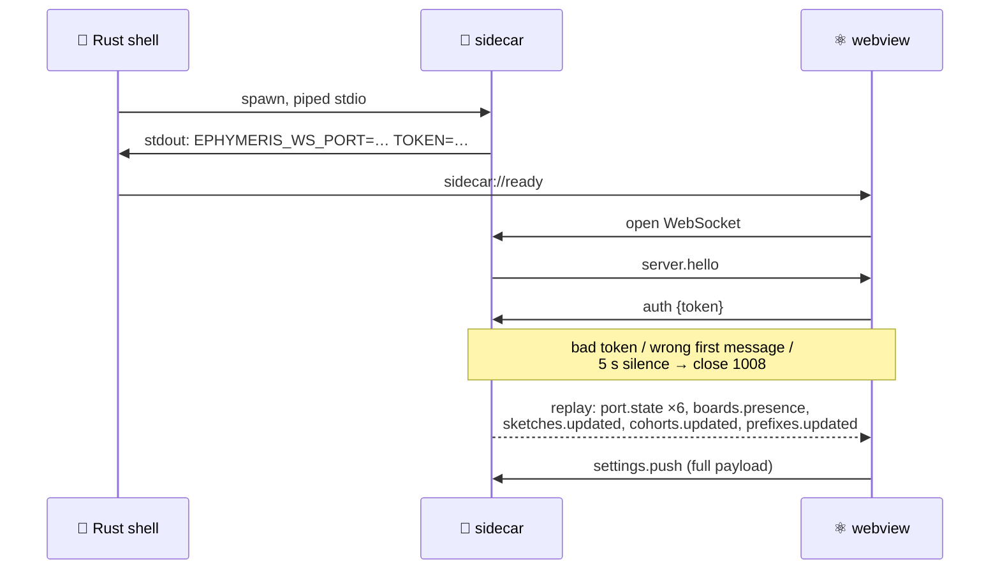

# WebSocket / IPC Message Schema

   

> **What this is** · The complete wire schema between the React frontend and the Python sidecar. Every command and event below is implemented and emitted.
>
> **Owns** · The wire. This document is **canonical** — where any other document describes a message differently, this one wins.
>
> **Read with** · [dashboard.md](dashboard.md) (the port state machine these messages drive) · [tasks.md](tasks.md) (sketch discovery and task-profile payloads) · [settings.md](settings.md) (the `settings.push` payload) · [README.md](README.md) (the module map behind each handler).

**Contents** — [1. Transport & Lifecycle](#1-transport--lifecycle) · [2. Envelope](#2-envelope) · [3. Commands](#3-commands-client--server) · [4. Events](#4-events-server--client) · [5. Invariants](#5-invariants) · [6. Error Codes](#6-error-codes) · [7. Versioning](#7-versioning)

> [!CAUTION]
> **Never edit the generated mirrors by hand.** This document is the **prose** authority (rationale, lifecycle, invariants); [`protocol/schema.py`](../protocol/schema.py) at the repo root is the **shape** authority. `sidecar/ephymeris_sidecar/protocol.py` and `src/lib/ws/protocol.ts` are generated from it.
>
> The required order for any wire change is in **[README.md §6.1](README.md#61-changing-the-wire--the-required-order)**. The short version: edit `protocol/schema.py` **and this document together**, run `npm run gen:protocol`, commit both regenerated mirrors, then run `pytest tests/test_protocol_contract.py` — which fails if a mirror is stale or hand-edited, **and requires every wire name to appear in this document.**

> [!NOTE]
> Because both mirrors come from one schema, they cannot drift from each other — including **payload shapes**, which hand-maintained mirrors never guarded. On the TypeScript side the generated `CommandArgsMap`/`CommandResultMap`/`EventDataMap` make `client.call` fully typed, so a stale shape fails `npm run typecheck`. On the Python side the generated specs power a runtime validator: with `EPHYMERIS_WIRE_VALIDATE=1` (the test suite sets it; production leaves it off) every `event()` payload and every dispatched reply is checked against the schema, and `tests/test_wire_shapes.py` pins the real emitters to it. **What remains unverified is only that a command *has* a handler.**

---

## 1. Transport & Lifecycle



The sidecar is spawned by the Tauri shell, not by the frontend. Startup sequence:

1. Rust spawns the sidecar with piped stdin/stdout/stderr.
2. The sidecar binds `127.0.0.1` on an **ephemeral port** (`port=0`) and generates a random token.
3. It prints exactly one line to **stdout**:
   ```
   EPHYMERIS_WS_PORT=<port> EPHYMERIS_WS_TOKEN=<token>
   ```
   Everything else the sidecar logs goes to **stderr**, keeping stdout a single-purpose channel. Rust forwards stderr into the app log.
4. Rust parses that line, stores the endpoint, and emits the Tauri event `sidecar://ready`. If the sidecar's stdout closes, Rust emits `sidecar://down`.
5. The frontend obtains the endpoint via the `sidecar_endpoint` Tauri command (covering the case where the sidecar was ready before the webview loaded) or via `sidecar://ready`, then opens the WebSocket.

**Why an ephemeral port:** lab PCs are shared and a fixed port is a collision waiting to happen. **Why a token:** the socket is loopback-only, but any local process could otherwise connect to it and drive the hardware.

**Orphan protection.** The shell holds the sidecar's stdin open for the life of the app. The sidecar watches stdin for EOF and exits when it closes. A sidecar that outlived its parent would keep serial ports open and lock out the next launch, so this is load-bearing, not a nicety. The shell additionally kills the child on exit.

**Development fallback (dev builds only).** When no Tauri shell is present (plain-browser preview), the frontend accepts a manually supplied endpoint from `localStorage` under `ephymeris:endpoint` — `{"port": N, "token": "…"}` — so the full UI can be driven against a standalone sidecar started with `--token`/`--no-parent-watch`. Deliberately `localStorage` rather than URL parameters: the token-never-in-a-URL rule (§1.1) has no dev exception. Compiled out of production builds.

### 1.1 Authentication

The server sends `server.hello` immediately on connect. The client's **first** message must be the `auth` command; anything else, a bad token, or silence for more than 5 seconds closes the connection with code `1008`.

The token travels in a message body rather than a URL query string, so it never lands anywhere a URL would be logged.

### 1.2 State replay on connect

Immediately after a successful `auth`, the server replays current state **to that client alone** (unicast, not a broadcast), in this order:

1. One `port.state` per box — with `prev` deliberately equal to `state`, and reason `"initial state"`.
2. One `boards.presence`.
3. One `sketches.updated`.
4. One `cohorts.updated`.
5. One `prefixes.updated`.
6. One `specs.updated` — skipped entirely when the spec compiler is unavailable, so a client's empty spec list means "no compiler" exactly when the Task screen's banner says so.

Events are otherwise emitted only when something changes, so a client connecting during a quiet period would have nothing to render and would have to guess. Guessing is exactly what §5.2 forbids.

> **Live session state is *not* replayed.** No runner snapshot, no `groupId`, no in-flight telemetry. A client that reconnects mid-session gets correct port, board, and cohort state, then must **ask**: `sessions.active` for global discovery (which session is running, with no prior knowledge of ids — what the Launch page and a fresh window need), or `sessions.status` for a session it already knows. This is deliberate — the runner is the authority on the confirmed mapping, and asking it beats replaying a snapshot that could already be stale by the time it arrives. After that first ask, `session.lifecycle` broadcasts keep the answer current without polling.

A replay callback that raises is logged and swallowed rather than dropping the connection.

### 1.3 Reconnection

The frontend reconnects with backoff (250ms → 8s, capped). **On every successful authentication — including reconnects — the frontend re-sends `settings.push`.** This is the wire-level implementation of the one-directional Tauri→sidecar settings sync required by [settings.md §3](settings.md#3-persistence--push).

---

## 2. Envelope

JSON, UTF-8. Client→server is always a command. Server→client is either a correlated reply or an unsolicited event.

```jsonc
// client → server
{ "v": 1, "id": "c7", "cmd": "port.flash", "args": { "box": 1, "sketchPath": "/…/clean_flush" } }

// server → client — reply (exactly one per command)
{ "v": 1, "corr": "c7", "ok": true,  "result": { … } }
{ "v": 1, "corr": "c7", "ok": false, "error": { "code": "SEND_NOT_PASSTHROUGH", "message": "…", "detail": null } }

// server → client — event (unsolicited; `corr` present when caused by a command)
{ "v": 1, "evt": "port.output", "ts": 1721600000.123, "data": { … } }
```

| Field | Meaning |
|---|---|
| `v` | Protocol version. A mismatch is rejected with `PROTOCOL_VERSION_MISMATCH` rather than best-effort parsed |
| `id` | Client-generated correlation id, unique per connection |
| `corr` | Echoes the `id` of the command this message relates to |
| `ts` | Server-side Unix timestamp (float seconds) |

Every command receives exactly one reply. Long-running commands (`port.flash`) additionally emit `flash.progress` events carrying `corr`, so progress can be attributed to the specific request that caused it.

### 2.1 Reply timeouts

The client applies a default 15s reply timeout, overridden per command where the work legitimately runs long:

| Command | Timeout |
|---|---|
| `port.flash` | 300s — a compile plus upload routinely outlasts the default |
| `sketches.refresh` | 60s |
| everything else | 15s |

Timing out client-side does **not** cancel the sidecar's work. The sidecar remains the authority on what actually happened; the resulting `port.state` event is what the UI reflects.

---

## 3. Commands (client → server)

`box` is always a **box number, 1–6** — never a port address. See §5.1.

Of the 43 commands, 42 are registered in the sidecar's dispatch table. **`auth` is the exception:** it is consumed by the server's authentication step before dispatch begins and never reaches a handler, because it must be the connection's literal first frame (§1.1).

| Command | Args | Result | Notes |
|---|---|---|---|
| `auth` | `{token}` | `{authenticated: true}` | Must be the first message (§1.1) |
| `ping` | — | `{pong, sidecarVersion}` | Liveness probe for the connection indicator |
| `settings.push` | full settings payload (§4) | `{library: <SketchLibraryStatus>}` | Sent on connect and on every change. The reply carries the bundled library's state (`tasks.md` §2.1) — no longer a function of the settings, but answered here so a client learns it on connect without a second round trip |
| `sketches.refresh` | — | `<SketchDiscovery>` (§4) | Manual Refresh and Debug Mode mount, per `tasks.md` §2.3 |
| `port.passthrough.open` | `{box, baud}` | `{state}` | `baud` per box; omitted means the configured `defaultBaud`, which ships as 115200 (`dashboard.md` §6.4) |
| `port.passthrough.close` | `{box}` | `{state}` | |
| `port.send` | `{box, text, lineEnding}` | `{bytesWritten}` | `lineEnding` ∈ `none` \| `lf` \| `cr` \| `crlf`, default `lf`. Rejected with `SEND_NOT_PASSTHROUGH` unless the port is in `PASSTHROUGH` (`dashboard.md` §6.4) |
| `port.flash` | `{box, sketchPath, suppressPassthroughResume?}` | `{state, resumedPassthrough: bool}` | Streams `flash.progress`. `resumedPassthrough` reports the §3.3 auto-resume. `suppressPassthroughResume` (default `false`) forces the port to land in `IDLE` afterward regardless of pre-flash state — the session flash sequence needs `IDLE` so the runner can claim the port (`dashboard.md` §7.4) |
| `port.reset` | `{box}` | `{state, resumedPassthrough: bool}` | DTR toggle (`dashboard.md` §6.2) |
| `port.error.ack` | `{box}` | `{state}` | `ERROR` → `IDLE` (`dashboard.md` §5.2) |

### 3.1 Cohorts

Merged from `websocket-protocol.md` §3.1, which proposed these; this document is canonical.
All cohort state lives in the sidecar's SQLite database (`cohorts.md` §3).

| Command | Args | Result | Notes |
|---|---|---|---|
| `cohorts.list` | — | `{cohorts: [CohortSummary]}` | Includes archived; the client filters (`cohorts.md` §4) |
| `cohorts.get` | `{id}` | `{cohort: <Cohort>}` | Full detail, fetched when a card is opened |
| `cohorts.create` | `{name, dataFolder?, animals?, groups?}` | `{cohort: <Cohort>}` | `dataFolder` resolved per `cohorts.md` §8 when omitted. **The roster may travel with the create**, which is what makes the editor's Create a single call: animals and groups are built client-side with their own ids before the cohort exists, and sending them afterwards meant a second command that could fail on its own and leave a named, empty cohort. Both are validated *before* any row is written, so a rejected roster leaves no cohort and no folder. Omitting `groups` still mints the implicit default group (§2) |
| `cohorts.update` | `{id, patch}` | `{cohort: <Cohort>}` | `patch` may carry `name`, `animals`, `groups`. Also the commit path for an Auto-Balance preview (§7.4) — no separate apply command |
| `cohorts.archive` | `{id}` | `{cohort: <Cohort>}` | Soft-delete; record and `dataFolder` stay intact (§9) |
| `cohorts.restore` | `{id}` | `{cohort: <Cohort>}` | Rejected with `COHORT_NAME_TAKEN` if an active cohort has since claimed the name |
| `cohorts.delete` | `{id, confirm: true}` | `{deleted: true}` | Rejected with `COHORT_NOT_ARCHIVED` unless already archived. **Never touches `dataFolder` on disk** (§9) |
| `cohorts.setDataFolder` | `{id, path, moveExisting}` | `{cohort: <Cohort>}` | The explicit relocate of `cohorts.md` §8 — distinct from renaming. **`moveExisting` selects between two intents:** `true` moves the cohort's data and refuses with `DATA_FOLDER_INVALID` if the destination isn't empty; `false` writes nothing and simply re-points the cohort, so a full destination is expected — that is how a cohort attaches to a pre-existing archive |
| `cohorts.suggestGroups` | `{id, groupCount?, maxGroupSize?, balanceBySex?}` | `<GroupProposal>` | **Non-mutating.** Computes §7.3's balanced round-robin for preview; the user applies via `cohorts.update` |

### 3.2 Sessions & Prefixes

Merged from `websocket-protocol.md` §3 and `websocket-protocol.md` §3; this document is
canonical. Prefixes and session records live in the same SQLite database as
cohorts. The actual per-strobe file writing happens sidecar-side and is not a
command — see `data.md` §5.

| Command | Args | Result | Notes |
|---|---|---|---|
| `prefixes.list` | — | `{prefixes: [Prefix]}` | Global, shared across all cohorts (`data.md` §3.1) |
| `prefixes.create` | `{name}` | `{prefix: <Prefix>}` | Name-unique; rejected with `PREFIX_NAME_TAKEN` |
| `prefixes.delete` | `{id}` | `{deleted: true}` | Non-destructive — never touches folders already written under the name (`data.md` §3.1) |
| `tasks.getProfile` | `{sketchPath}` | `<TaskProfile>` \| `{profile: null}` | Reads the `task.json` sibling to the sketch's `.ino` (`tasks.md` §3). A sketch with none returns `{profile: null}` — fully supported |
| `sessions.suggestNumber` | `{prefixId}` | `{suggestion, sameDayNumbers: [string]}` | Step 1's pre-fill (`dashboard.md` §7.2). `suggestion` is the highest numeric session number for the prefix +1, or `null` where there's no numeric history. `sameDayNumbers` are the numbers already used for this prefix *today*, driving the **soft** reuse warning — reuse is legal, never blocked. Aborted sessions count toward neither: they never wrote data, so their numbers stay claimable |
| `sessions.create` | `{cohortId, prefixId, sessionNumber, durationMinutes?}` | `{session: <Session>}` | Status `configuring`. Rejected with `SESSION_NOT_READY` if the cohort has no group with a box-assigned animal (`dashboard.md` §7.1). `durationMinutes` is the optional per-box time limit (`dashboard.md` §7.2): the sidecar sends `STOP` to each box that long after *that box's* start — measured per box, not from Start All, because boxes are started individually. `STOP` remains a request the firmware honours at a trial boundary, so the recorded `stop_reason` is still the board's own clean end |
| `sessions.abandon` | `{sessionId}` | `{session: <Session>}` | Discards a session still in `configuring` — Step 2's Back button (`dashboard.md` §7.3). Marks it `aborted` and clears any confirmed-but-unstarted mapping from the runner. Rejected with `SESSION_INVALID` once a group has started running; abandoned sessions never wrote data, so nothing on disk is touched |
| `sessions.confirmMapping` | `{sessionId, groupId, boxes: [{box, animalId, sketchPath, config}]}` | `{ok: true}` | Session-local mapping + per-box Task Profile config; feeds §4's flash sequence. `config` is a `{metadataKey: value}` map |
| `sessions.status` | `{sessionId}` | `{session: <Session>, groupId, boxes: [{box, animalId, animalName, sketchName, sketchPath, running, startedAt}]}` | What Mission Control renders (`dashboard.md` §8). The runner is the authority on the confirmed mapping and which boxes are live, so reopening the window mid-session shows the truth rather than a stale client copy. `startedAt` (null unless running) is what lets a reloaded window resume its per-box elapsed clocks |
| `sessions.startAll` | `{sessionId}` | `{session: <Session>}` | Enters `IN_SESSION` on every box in the current group not already running (`dashboard.md` §8.2) |
| `sessions.switchGroup` | `{sessionId}` | `{nextGroupId}` | Ends current runs, advances to the next populated group by `order`; the client re-enters Step 2. A `null` `nextGroupId` means every populated group has run — the sidecar then finalizes exactly as `sessions.end` would (marks `completed`, releases the runner), so the client never has to follow up with a second command |
| `sessions.end` | `{sessionId}` | `{session: <Session>}` | Gracefully stops all boxes, finalizes files, marks `completed` |
| `sessions.active` | — | `<ActiveSessions>` | The global "what is running?" query — deliberately argument-free, so a client with no prior knowledge of ids (the Launch page, a reconnecting window) can discover the running session. The `running` slot is keyed off the **live runner**, never a bare DB status query: a `running` row with no live runner is a crash orphan and lands in `stale` instead, surfaced for honesty but never offered for resume (session resumption after a restart is out of scope by decision). `configuring` rows are setups never finished — legitimately resumable into Step 2 |
| `port.startSession` | `{box, startCommand}` | `{state}` | Per-box `IN_SESSION` entry: open → DTR reset → await `READY` → send `startCommand` → optional `SEED` (`dashboard.md` §10) |
| `port.stopSession` | `{box}` | `{state}` | Sends the literal `STOP` line. Does **not** force the transition — the board's own end-of-session strobe does (`dashboard.md` §8.3) |

### 3.3 Backup

Mirroring itself takes no commands — it runs off `Settings.backupDirectory`, pushed with everything else via `settings.push` (`data.md` §7). The one command here is the deliberate backfill.

| Command | Args | Result | Notes |
|---|---|---|---|
| `backup.syncNow` | — | `{copied, skipped, failed, errors: [string], directory}` | Walks every cohort data folder and mirrors anything missing or stale, then backs up `ephymeris.db`. Setting a backup directory deliberately does **not** backfill on its own — that could mean an unannounced multi-gigabyte copy to a network share the moment a folder is picked — so this is the explicit version, and doubles as the way to prove a target works before trusting it. Rejected with `BACKUP_UNAVAILABLE` when no directory is set or a sync is already running. Long-running: the client should raise its reply timeout for this command |

### 3.4 Analytics

The metric definitions behind these payloads are in [data.md §9](data.md#9-derived-metrics). Implemented and in both mirrors.

> [!NOTE]
> **The granularity is deliberate.** Selecting a cohort makes **one** `analytics.summary` call, and every subsequent session or animal selection filters that payload client-side — the heatmap and the strategy space are literally the same data. Per-session calls would mean one round trip per column to build a single picture, re-fetched on every selector change.

| Command | Args | Result | Notes |
|---|---|---|---|
| `sessions.list` | `{cohortId, includeAborted?}` | `{sessions: [SessionListItem]}` | Belongs to the `sessions.*` family rather than `analytics.*` because session history is independently useful. **Must never touch the filesystem**, so selectors populate instantly. Returns a chronological `ordinal` derived from `(date, startedAt)` — never from `sessionNumber`, which is free text. `SessionListItem` is the trimmed listing form of `Session` (no `prefixId`/`groupRuns`, plus `ordinal` and `runCount`) and is the same shape `analytics.summary` embeds — one emitter serves both |
| `analytics.summary` | `{cohortId, sessionIds?, animalIds?, minCountedTrials?}` | cohort table — sessions, animals, run summaries, profile groups, counts, warnings | One call per cohort; every session and animal selection filters it client-side. The heatmap and the strategy space are the same data, so they share one command. Run summaries are a **flat list, not a matrix** — a matrix has nowhere to put two runs for one animal and session, which really happens |
| `analytics.series` | `{runIds: [], mode?, metricIds?}` | `{series: [RunSeries], warnings}` | Learning-curve data. **Plural** so "all six animals in this session" is one call; the list is capped server-side. The x-axis is the counted-trial index and is implicit. Each `RunSeries` also carries `trail` — the within-session walk through the strategy plane (`data.md` §11.1) as `[StrategyPoint]`. It rides here rather than in its own command because the file is already open and decoded, and it is **always rolling** whatever `mode` says. Empty unless the profile declares exactly two conditions, and **not** derivable client-side from `metrics`: those are indexed by each metric's own counted trials, which interleave. Each `RunSeries` also carries `trials` — the per-trial tape (`data.md` §9.11) as `[TrialRecord]` in stream order, from the same classification pass the outcome tallies are summed from; empty when the profile can't express outcomes |
| `analytics.rescan` | `{cohortId, adoptOrphans?}` | `{scanned, adopted, orphans: [RescanOrphan], cohortId}` | The explicit archive walk, for files no run record points at. Same pattern as `sketches.refresh` and `backup.syncNow`: expensive reconciliation is a deliberate user action, never a side effect of opening a view |
| `analytics.recentSessions` | `{limit?}` | `{sessions: [DiskSession]}` | The N most recent session folders across every active cohort's archive, ordered by folder-name date. **Directory names only — no file is ever opened**, which is what keeps this cheap enough for the Dashboard where the rescan deliberately is not. Each `DiskSession` carries the identity a folder name alone can assert (`sessions/paths.py`'s parsers, both date spellings): cohort, prefix, session number, ISO date, path, and `recorded` — whether this machine's database knows that folder: a session row, **or adopted runs from a rescan**, which deliberately writes no session row (`data.md` §8.1). `recorded: false` is the point of the command: a session another Ephymeris machine wrote into the shared archive is real history and belongs on the landing page, but it has no record here until a rescan adopts it — and once one has, the flag clears |
| `sessions.recover` | `{cohortId}` | `{scanned, recovered, failed, entries: [RecoveredTsv], cohortId, dataFolder, folderMissing}` (`RecoverResult`) | The crash-recovery backfill (`data.md` §12, §11): rebuilds `.json`/`.mat` from orphaned write-ahead `.tsv` files — same traversal as the rescan's walk, same explicit-action discipline. Each `RecoveredTsv` entry is `{tsvPath, jsonPath, status, nEvents, stopReason, reason}`; a footer-carrying `.tsv` keeps its recorded `stop_reason`, a footer-less (crashed) one gets `"recovered after crash"`. Rejected with `SESSION_INVALID` while any box is running — a live run's `.tsv` has no `.json` yet and is not an orphan |

A corrupt or missing file is **data, not an error** — it yields a run with a non-ok status plus a warning, and the command still succeeds. One unreadable `.json` must never blank a year of history.

Each `RescanOrphan` reports one file the walk found and what could honestly be said about it. `animalName` is always the name the *document* carries, reported as written even when that is what failed to match; `animalSource` says which recording `animalId` was resolved from. `document` is the normal case. `filename` means the document's `rat` matched no animal on the roster and the file stem did — the per-animal naming rule (`data.md` §2) gives a second independent recording of the same fact, and matching it exactly is not the same act as guessing from a resemblance. Null `animalSource` means the run is kept unattributed, which stays the outcome whenever neither recording matches.

### 3.5 Hardware utility baseline

The rationale is in [settings.md §8](settings.md#8-the-hardware-utility-baseline). The baseline is the state the app returns every idle box to: the configured utility sketch, flashed and left in `IDLE`, so any box that isn't doing something else is a box Ephymeris can talk to. Restores are automatic — on startup, when a board appears, and whenever a run or session ends — so these commands exist for the two moments the automatic path can't cover: a client that wants the picture, and the placement walk that needs a specific box lit *now*.

| Command | Args | Result | Notes |
|---|---|---|---|
| `utility.status` | — | `<UtilityStatus>` | The same snapshot `utility.updated` pushes, for a client that just mounted |
| `utility.ensure` | `{boxes?, force?}` | `<UtilityStatus>` | Restore the baseline now instead of waiting for the next board or session event. **Returns as soon as the work is scheduled** — flashing six boxes outlasts any sane reply timeout, so progress arrives on `utility.updated`. Never touches a box that isn't `IDLE`, and never one held by a confirmed session mapping. `force` reflashes a box already believed to be at baseline (the Config button; no automatic path sets it) |
| `utility.identify` | `{box, on}` | `{delivered, state: <UtilityBoxState>}` | Make one box point at itself with its profile's `identify` pair (`dashboard.md` §7.3). Opens `PASSTHROUGH` if the box is `IDLE` and closes it again on the matching `off`; a box the *user* already has open in Debug Mode keeps its console. `delivered: false` is the ordinary answer for a box not at baseline — the placement walk carries on by number rather than failing |

Rejected with `UTILITY_UNAVAILABLE` when no utility sketch is configured or the configured one can't be used at all. A box-level problem is **not** an error: it is a `state` on that box in the returned snapshot.

```jsonc
// UtilityStatus — the utility.status/utility.ensure result AND the
// utility.updated payload. One shape, one emitter.
{
  "configured": true,
  "sketchPath": "/…/Utility/BOX_Utility",
  "sketchName": "BOX_Utility",
  "canIdentify": true,        // the profile declares an `identify` pair
  "held": false,              // a confirmed session mapping owns the rig
  "message": null,            // why the baseline isn't operating at all
  "boxes": [
    { "box": 1, "state": "ready", "detail": null, "identifying": false },
    { "box": 2, "state": "restoring", "detail": "flashing BOX_Utility", "identifying": false },
    { "box": 3, "state": "busy", "detail": "port is PASSTHROUGH", "identifying": false },
    { "box": 4, "state": "unavailable", "detail": "no board bound to box 4", "identifying": false }
  ]
}
```

`state` ∈ `unknown` | `restoring` | `ready` | `busy` | `held` | `unavailable` | `failed`. Only `failed` is a fault; `busy` and `held` both mean *not now, deliberately* — the sidecar never takes a port away from a console, a flash, or a running session to restore a baseline.

An `identify` pair rides on the utility sketch's own `task.json` (`tasks.md` §3.6) rather than in settings, for the same reason the rest of the Task Profile does: the app must not know that a Hart-lab box says `ON LIGHT`.

### 3.6 Task specs

The task-spec compiler's surface ([specs.md](specs.md), [TaskGraph.md](TaskGraph.md)). A spec is a **sibling artifact** to a sketch's `task.json`, never an extension of it — the two hash differently, and `profile_hash` is what Analytics groups a sketch's historical runs by.

| Command | Args | Result | Notes |
|---|---|---|---|
| `specs.list` | — | `{specs: [SpecEntry]}` | Enumerates the library from a cheap **parse**, never a compile, so it stays instant however many specs exist. A document that won't parse still gets a row (with nulls) — a broken spec is exactly the one someone needs to find |
| `specs.get` | `{specId}` | `{specId, origin, text, raw}` | `text` is the YAML source verbatim, comments and all; `raw` is the parsed document or `null` when it won't parse — the form binds to `raw`, and the compile that runs on mount is what reports *why* a null one won't parse |
| `specs.schema` | — | `{schema, overlay: <SpecOverlay>, strobes, channels, limits, templates}` | Everything a form needs, once, on route mount. Served from the registry **files** — the same bytes the compiler validates against, so a picker cannot offer a value the compiler then rejects. `channels` is the one composed member: a channel is two files now (what it *means*, and where it *is* on this box), so what goes on the wire is the compiler's own resolved view of both, which is a stronger guarantee than either half. The frontend must never hold its own copy of a registry. `overlay` is the one member with a declared shape; see below |
| `specs.compile` | `{text, specId?}` | `<SpecCompileResult>` | Stateless; the live per-edit call. Takes **text**, not a dict — the LOAD pass (schema validation, TG1xx, the YAML `on:` trap) checks things that only exist before parsing, so the editor compiles exactly the bytes it would save. Runs in a worker thread behind a semaphore of 1; the frontend debounces ~120 ms and discards stale replies by `corr` |
| `specs.capabilities` | `{topology}` | `<SpecCapabilities>` | Which outcome classes and timing ids this topology produces — the palette's validity model, from the template's own `capabilities()`. A pure function of the knobs (half-built topologies welcome; unspecified knobs take the schema defaults), so the form re-gates its rows the instant a knob moves, before any compile returns. Carries `timingHelp` and `outcomeHelp` alongside `outcomeClasses`/`requiredTiming`; see below |
| `specs.paradigms` | — | `{paradigms: [ParadigmSummary]}` | Every shape a new task can start from, in gallery order. **A paradigm is a shape, not a spec**: it names a template, fixes the knobs that make a kind of experiment what it is, and declares what to ask about the rest. `ramped` is the one member the skeleton generator deliberately does **not** consume — it names the timing ids a shaping ramp is expected to move, and a stage schedule additionally needs trial boundaries and per-stage values that no paradigm declares, so generating one would invent precisely the numbers the generator is forbidden to invent. The wizard's session step offers them as a suggestion the operator applies. Its own command rather than a member of `specs.schema` because that reply is what the *form* needs on route mount and is fetched by the Designer, which has no use for paradigms — while the gallery and the wizard need paradigms and never the overlay. Static for the life of the process |
| `specs.skeleton` | `{paradigmId, specId, answers, label?, description?}` | `{text, result}` | A first draft for a paradigm, and the compile of it. Returns **text** for the same reason `specs.compile` takes it — the LOAD pass checks things that only exist before parsing, and the editor must hold the exact bytes it would save. The compile rides along so the wizard's first render already has a graph: one round trip, and *"it compiles at every step"* is true from step zero rather than from step one. **Pure — it writes nothing**, so creating a task stays `specs.save` and rename-and-save keeps its single definition. The generator emits no value it did not read from an existing authority (the paradigm, the template's `capabilities()`, the channel registry, the strobe vocabulary, or the operator's answer), which is what stops it being a second definition of what a minimal legal spec is |
| `specs.save` | `{specId, text}` | `{entry, result}` | **Always saves, even with ERROR diagnostics** — a half-finished spec must be savable; the gate is upload, not save. Writes land under the sidecar's app-data dir (`<data_dir>/specs/user/`), like session files and `ephymeris.db` — no Tauri fs capability involved. The frontend passes the *document's own* `spec_id` as the target, so renaming the id and saving creates a copy; a parsed document whose `spec_id` disagrees with the target is refused (`SPEC_INVALID`) because the id names the file, the table, and what a board reports after an upload. The reply carries the compile of what was just written |
| `specs.delete` | `{specId}` | `{entry: null}` | Deletes the spec. **One meaning, where there used to be three** — nothing ships as a spec, so there is no bundled version underneath to fall back to and nothing that can be read-only. The reply keeps `entry` and always returns null, so a client rendering the result of a delete need not special-case its absence |
| `specs.diff` | `{specId, text?, baseline?, againstSpecId?}` | `<SpecListingDiff>` | A diff of the **listing** — the checked-in review artifact — never of the YAML; a topology change is reviewed here against the same rendering a reviewer reads upstream. Hunks are grouped by the listing's own ruled sections (STATES, TIMING VECTOR, …) so a change reads as *"3 states added"* rather than *"line 71 moved"*; `spec_hash`/`template_hash` move on every edit and are deliberately excluded from the hunks — the before/after summaries carry them once, as a provenance strip. `text` is the editor's unsaved document (absent = the stored file); The before side is the saved file unless `againstSpecId` names another spec — which is how a "same machine, different numbers" claim gets read, and how Shaping-R against Shaping-L shows no structural hunks. A deliberate Review action, never per-keystroke |
| `specs.export` | `{specId, text?, artifacts}` | `{artifacts: [SpecArtifact]}` | Returns bytes **in the reply** — the spec YAML, the listing, the lint baseline, the canonical `table.json`, the packed `table.bin` (base64), the bench card — and the frontend writes them through a dialog-picked path. That keeps "no wire command writes an arbitrary file" intact: the sidecar's own writes stay under its data dir. Everything but the YAML is a function of a compiled table, so a spec that doesn't compile exports only itself |

```jsonc
// SpecCompileResult — a spec that doesn't compile is a SUCCESSFUL reply
// carrying diagnostics, never a command error (the Analytics corrupt-file
// discipline). SPEC_INVALID is reserved for a document that isn't a document.
{
  "ok": true,
  "diagnostics": [ {
    "code": "TG204", "severity": "ERROR",
    "message": "…", "location": "timing[3].ms",
    // Where it lands on screen, computed by the ONE definition in the
    // compiler (taskgraph/presentation.py). `field` anchors are overlay keys,
    // so mapping a diagnostic onto its input is a dictionary lookup.
    "placement": "field" /* | "row" | "section" | "node" | "document" */,
    "anchor": "timing[].ms",
    "detail": "…", "help": "…", "decision": "D6"
  } ],
  "table": { /* SpecTableSummary */ },   // null whenever any diagnostic is an ERROR —
                                         // the compiler's structural gate, mirrored
  "graph": { "nodes": [/* SpecGraphNode */], "edges": [/* SpecGraphEdge */], "entry": 0 },
  "listing": "…",   // emit.listing.render verbatim — the review artifact, byte-equal
                    // to the checked-in specs/<id>.table.txt when the spec is unedited
  "elapsedMs": 48.1
}
```

The graph is the compiled **machine** graph — six node primitives (`DELAY`/`WAIT_ENTRY`/`HOLD`/`WAIT_EXIT`/`PULSE`/`TERMINAL`), trigger-keyed edges with guards and effects — deliberately not the derived `TaskGraphModel`, which describes what an animal does rather than what the interpreter executes.

**One of `specs.schema`'s five registries is typed, and it is the presentation overlay.**

```jsonc
// SpecOverlay — schema/task_spec.presentation.v1.json, verbatim.
{
  "presentation_version": 1,
  // SpecOverlayGroup — the form's section order.
  "groups": [ { "id": "timing", "label": "Timing", "order": 40, "help": "…" } ],
  // Keyed by dotted DOCUMENT path. `rows` is a literal union because each
  // value is a distinct rendering branch; `gatedBy` names a capabilities key,
  // and which rows EXIST is capabilities()'s answer while which are VALID is
  // the compiler's.
  "sections": {
    "contingency.outcome_map": {
      "group": "outcomes",
      "rows": "by_key" /* | "indexed" | "by_id" | "object" */,
      "gatedBy": "outcome_classes"
    }
  },
  // SpecOverlayField, keyed by OVERLAY key — the same string a diagnostic's
  // `anchor` carries, which is what makes placing an error next to the input
  // that caused it a dictionary lookup rather than a parse.
  "fields": {
    "timing.ms": { "label": "Duration", "widget": "number", "group": "timing",
                   "order": 20, "unit": "ms", "step": 1 }
  }
}
```

`widget` is deliberately **not** a literal union: the renderer carries a documented default case, so an overlay that gains a widget degrades to a plain input rather than failing to compile. The other four members (`schema`, `strobes`, `channels`, `limits`) stay untyped `any` on purpose — those are passthrough JSON the frontend reads with lookups, not a shape it binds a form to.

**`capabilities()` carries prose as well as a validity model.**

```jsonc
// SpecCapabilities — a pure function of the topology knobs.
{
  "outcomeClasses": ["correct", "hold_break", "no_engage", "omission", "wrong"],
  "requiredTiming": ["t_zero", "t_arm", "t_engage_win", "t_poll_interval", "…"],
  "knobs": ["n_sampling_stages", "retention_delay", "response_mode", "…"],
  "template": "four_epoch", "templateVersion": 2,

  // The template's own `timing_defaults`, keyed by timing id. `note` is the
  // firmware field this duration mirrors — the only place a duration's MEANING
  // is written down — and `wireKey` is the legacy START token it corresponds
  // to (null when it has none). `ms` is the template's default, for reference
  // only: the document's own value is the authority.
  "timingHelp": {
    "t_commit_hold": { "note": "odorPokeHold at BehaviorBox.h:1176 — the pre-odor commitment hold.",
                       "wireKey": "S0P", "ms": 500 }
  },

  // The template's own `outcome_defaults`, keyed by outcome class. `note` says
  // what the class MEANS — why one ending is a discrimination error and another
  // carries no evidence at all — which `outcomeClasses` cannot: it says only
  // which classes exist. `delay` names the timing id the class waits in.
  "outcomeHelp": {
    "no_engage": { "note": "No stimulus was presented, so the trial carries no evidence about discrimination: scored invalid and repeated, never counted as an error.",
                   "trigger": "TIMEOUT", "terminal": "TRIAL_INVALID",
                   "delay": "t_pen_noengage", "strobe": "LAZY_RAT" }
  }
}
```

Both help maps ride here rather than on `specs.schema` because they are a function of the **topology**, not of the build: go/no-go's `correct` is a genuinely different fact from n-alternative's (a different trigger, a different strobe, a different sentence). They are the same values the skeleton generator already reads, so nothing new is defined — what changes is that a form can now explain a row instead of only labelling it.

### 3.7 Rig wiring

Which pin each channel is on, and what it means. Four commands, and the reason there are four rather than a settings key is that **a pin has no safe default**: the settings pipeline is shell-owned, leniently parsed and silently degrades a malformed value to a working one, which is right for a directory path and catastrophic for a number that decides which valve opens. This is the `specs.*` pattern instead — a sidecar-owned document under `<data_dir>/hardware/rig.json`, validated on the way in, with every problem located.

| Command | Args | Result | Notes |
|---|---|---|---|
| `hardware.get` | — | `<RigDocument>` | This rig's wiring plus everything wrong with it. A rig that has never been edited gets the **shipped pinout as an editable document**, so the editor always opens something real rather than a blank form. `document` is served even when `problems` is non-empty — refusing to show a broken document would be refusing to show the one that needs fixing |
| `hardware.preview` | `{document}` | `<RigSaved>` | Validate and cost it, writing nothing. Two jobs with one answer: the editor calls it as the operator types, so a schema violation or TG226–229 lands against the field that caused it; and it is what the save preflight shows, because `breaks` is the honest form of "this applies to every task" |
| `hardware.save` | `{document, confirm}` | `<RigSaved>` | Validate, then write. **Validation happens before the write**, so there is no state in which the file on disk is one the compiler refuses. `confirm: false` refuses a change that would stop a task compiling and returns them as `RIG_WOULD_BREAK_TASKS`; `confirm: true` proceeds. On success the compiler's channel cache is cleared and `hardware.updated` is broadcast |
| `hardware.reset` | — | `<RigDocument>` | Back to the wiring the build shipped with. Replies in `hardware.get`'s shape so the editor re-renders from one shape either way |

> [!CAUTION]
> **A pin change applies to every task, immediately, and moves no `spec_hash`.** Specs name channels and never numbers ([D15](taskgraph-decisions.md#d15)), so re-wiring a box changes the bytes every task compiles to while its identity is unchanged. That is the split working — rewiring a box is not a new task, and folding the pinout into `spec_hash` would split an animal's history at the boundary exactly as a rename does.
>
> It is also why the compiled listing carries a `pinout` line ([D22](taskgraph-decisions.md#d22)). Without it `specs.diff` — which diffs the *listing* — showed **nothing** for a re-pin, because the listing prints channel names. The review artifact reported that nothing had changed.

**Why `confirm` rather than a refusal.** Full channel authoring means an operator can delete a channel a saved task binds. TG223 catches that at compile — too late, since by then the wiring is written and the task is broken. So the save path recompiles every stored spec first and reports which ones a change would newly break. The app does not veto a rewiring; the operator rewired the box and the app's model of it must follow. It refuses to let one happen *unnoticed*.

**Failure split, by where the fault lies.** `RIG_INVALID` = the document is not a document (wrong shape, too large). A document that is well-formed and describes an impossible box — pin 300, two channels on one pin, a response port with no strobe slot — is **not** an error: it is a successful `hardware.preview` carrying located problems, exactly as a spec that will not compile is a successful `specs.compile`.

---

### 3.7 Bench boxes

Probing and table upload for the interpreter firmware in `firmware/` ([specs.md](specs.md)). These commands claim the port through a dedicated `UPLOADING` state that mirrors `FLASHING` exactly — force-releases `PASSTHROUGH` on entry, auto-resumes it on success — because the ownership question is identical; what differs is that the uploader opens its **own** serial handle and holds a line-oriented request/response conversation with deadlines, which the passthrough ring buffer (drained, not consumed) cannot provide.

> [!IMPORTANT]
> **The structural invariant: no command anywhere ties a spec to a session.** `sessions.confirmMapping` does not learn a `specId`, `port.startSession` is untouched, and `UPLOADING ↔ IN_SESSION` is illegal in the transition table. The interpreter is proved off-target and has never driven a pin — a box carrying it accepts a table and reports whether it fits. That door opens at the Phase 5 exit criteria (actuator timing verified on hardware, parallel run clean), not before.

| Command | Args | Result | Notes |
|---|---|---|---|
| `board.capabilities` | `{box, baud?}` | `<BoardCapabilities>` | Read a board's `CAP` banner and stop — what a box says about itself, changing nothing on it (costs one DTR reset, since opening the port *is* the reset). `baud` absent = try 115200 then 9600, the two rates the fleet actually contains mid-rollout; the answer is cached per `hardware_id` and invalidated by any `port.flash` to that box, since flashing is precisely what changes it. **Never `settings.defaultBaud`** — that is the console default. `present: false` means an un-migrated board (no `CAP` line) — not an error; it means "flash the interpreter sketch first", and the UI offers exactly that |
| `board.uploadTable` | `{box, specId, text?}` | `<UploadResult>` | Compile → detect → CAP check → chunked transfer → CRC+digest verify. **Compiled server-side either way** — a client-supplied table is never trusted, so the compiler's structural gate holds on the hardware path too. The capability check runs *before* any byte of table moves, so a board that can't hold this task says so in milliseconds and names both numbers. Progress streams on `upload.progress` with this command's `corr`. Success means the board echoed both the CRC (the bytes arrived) **and** the body digest (they decoded into the right fields) — a transfer can be perfect and a decode wrong, and only the second catches it |
| `utility.benchHold` | `{held}` | `<UtilityStatus>` | Suspend baseline restores while the bench panel is open. Without it, an upload ends with the port falling `IDLE`, the baseline quietly reflashing `BOX_Utility` over the interpreter, and the uploaded table dying with it — a bug nothing had ever exercised, because nothing before this flashed a non-baseline sketch outside a session. A **separate flag** from the session hold, so releasing the bench can never release a rig a confirmed mapping owns. In-memory only: a crashed client leaves it set until app restart, which errs on the side of *not* reflashing |

**Failure split, by where the fault lies.** `UPLOAD_REFUSED` = the board is healthy and said no before any byte moved (no CAP, protocol/wire mismatch, capacity exceeded) — the port lands cleanly and passthrough resumes. `UPLOAD_FAILED` = the transfer itself broke (no rate answered, went quiet mid-transfer, `TABLE FAIL`, CRC/digest mismatch) — the port parks in `ERROR`, because a partial table leaves the board's state genuinely unknown (its own `table.valid` guard will refuse to run it, but nothing has confirmed that).

---

## 4. Events (server → client)

| Event | `data` | Notes |
|---|---|---|
| `server.hello` | `{protocolVersion, sidecarVersion}` | First frame on every connection |
| `port.state` | `{box, state, prev, reason}` | Emitted on **every** transition. `state`/`prev` are the `dashboard.md` §5.1 names |
| `port.output` | `{box, lines: [{dir, text, ts}]}` | `dir` ∈ `rx` \| `tx`. **Batched** — see §5.2 |
| `boards.presence` | `{boards: [{hardwareId, address, fqbn, boxId}]}` | The out-of-band poll (`settings.md` §7). `boxId` is `null` for an unassigned board |
| `flash.progress` | `{box, phase, stream, text}` | `phase` ∈ `compile` \| `upload`; `stream` ∈ `stdout` \| `stderr`. Carries `corr` |
| `sketches.updated` | `<SketchDiscovery>` | Pushed whenever discovery re-runs for any reason |
| `cohorts.updated` | `{cohorts: [CohortSummary]}` | Pushed whenever the cohort list changes — same push-on-change pattern as `sketches.updated`, keeping the browser grid and the dashboard tile in sync without polling |
| `prefixes.updated` | `{prefixes: [Prefix]}` | Push-on-change for the prefix list, same pattern as `cohorts.updated` |
| `session.telemetry` | `{box, animalId, metrics: [<TelemetryMetric>]}` | Pushed on every strobe that updates a rolling live metric (`dashboard.md` §10 step 7) — **not** batched at `port.output`'s 20Hz, since metric updates are far lower-frequency than raw strobes |
| `session.animalEnded` | `{box, animalId, stopReason, filePath}` | One animal's run finalized (`dashboard.md` §10.4's `stopReason` set) |
| `session.lifecycle` | `<ActiveSessions>` | Broadcast whenever session **identity or status** changes — create, abandon, confirmMapping, startAll, switchGroup, end. A full snapshot, not a delta: a second window learns "ended" by seeing `running: null` with zero merge logic, and snapshots cannot be mis-merged. Per-box liveness is deliberately **not** re-broadcast here — `port.state` remains that channel, and `boxes[].running` inside the snapshot is point-in-time |
| `hardware.updated` | `<RigStatus>` | After a successful save or reset. Every client must drop what it cached from `specs.schema` — that reply carries the composed channel map, whose own comment used to say it "cannot change while the app is running, because changing it means shipping a new build". It can now |
| `utility.updated` | `<UtilityStatus>` | The hardware utility baseline (§3.5). Sent on client connect and whenever any box's belief changes — a restore starting or finishing, a hold going on or off, an identify light. This is the only progress channel `utility.ensure` has, since that command returns before the flashing starts |
| `backup.status` | `<BackupStatus>` | The state of Backup Directory mirroring (`data.md` §7). Sent on client connect, on every settings push that changes the directory, and whenever the mirror's state changes or it actually copies something — deliberately **not** every quiet 10s tick, so six idle boxes don't generate an event stream |
| `analytics.progress` | `{cohortId, phase, done, total}` | Earns its place against the client's 15 s default reply timeout: the first summary after upgrading is a cold index of every historical run, and on a network-mounted data directory this is the difference between "working" and "hung". Published on phase change and every N files, following `backup.status`'s discipline — never per file |
| `sidecar.error` | `{code, message, detail}` | Failures with no command to attribute them to. **Emitted** by the session runner when a mid-session `.tsv` write raises (disk full, permissions) — `data.md` §5.1. Carries `code: "INTERNAL"`, a message naming the box, and `detail: {box}` |
| `specs.updated` | `{specs: [SpecEntry]}` | The spec library snapshot — replayed on connect (when the compiler is available) and pushed on every save/delete/acknowledge, the `sketches.updated` pattern |
| `upload.progress` | `{box, phase, chunk, chunks, text}` | Streamed during `board.uploadTable`, carrying the causing command's `corr` — the `flash.progress` precedent verbatim. `phase` ∈ `detect` \| `probe` \| `transfer` \| `verify`; `chunk` counts **the board's acknowledgements**, not bytes this side hopes arrived |

### Shared payload shapes

```jsonc
// SketchLibraryStatus — the three states of tasks.md §2.4. No `not_configured`:
// sketches ship with the app, so every non-ok state means a broken or partial
// INSTALL, and the messages point at reinstalling rather than at a picker.
{
  "state": "ok" | "empty" | "damaged",
  "path": "/…/resources/sketches" | null,
  "message": "The install looks incomplete — reinstalling should fix it",  // when state != "ok"
  "source": "bundled" | "override"   // "override" = $EPHYMERIS_SKETCH_LIBRARY; dev-only
}

// SketchDiscovery
{
  "library": <SketchLibraryStatus>,
  "sketches": [ { "category": "utility", "name": "clean_flush", "path": "/…/utility/clean_flush" } ],
  "skipped":  [ { "path": "/…/utility/broken", "reason": "no .ino matching folder name" } ],
  "skippedCount": 1,          // drives the "Partial" note in tasks.md §2.4
  "libraries": [ "EphymerisStrobe" ],
  "librariesPath": "/…/libraries" | null
}
```

`skipped` is carried in full rather than as a bare count so the reason a sketch is missing is inspectable, per `tasks.md` §2.3 step 4 ("skipped but reported, not silently dropped").

```jsonc
// BackupStatus — data.md §7
{
  "configured": true,                      // false when no backupDirectory is set
  "directory": "D:/EphymerisBackup" | null,
  "state": "disabled" | "pending" | "ok" | "failed",
  "pending": 2,                            // finalized files queued for their one-shot copy
  "tracking": 6,                           // live .tsv files being mirrored each pass
  "mirroredFiles": 148,                    // copies made this sidecar lifetime
  "lastSuccessAt": "2026-07-26T11:31:23+00:00" | null,
  "lastError": "remy1_….tsv: [Errno 28] No space left on device" | null,
  "syncing": false,                        // a backup.syncNow walk is running
  "intervalSeconds": 10.0
}
```

`state` is `pending` between a directory being set and the first pass completing — distinct from `ok` (a pass succeeded) and from `failed` (the last pass didn't). The distinction matters because a freshly-set network path that turns out to be unreachable should not read as healthy for its first ten seconds.

### Cohort payload shapes

Mirrors the `cohorts.md` §1 data model. Timestamps are ISO-8601 strings.

```jsonc
// CohortSummary — enough for the grid and the dashboard tile, no per-animal detail
{
  "id": "9f2c…", "name": "Batch A",
  "animalCount": 6, "groupCount": 2,
  "assignedBoxes": [1, 2, 3],   // distinct box numbers its animals hold, sorted
  "archived": false,
  "createdAt": "2026-07-23T…", "updatedAt": "2026-07-23T…"
}

// Cohort — the full record, fetched only when a card is opened
{
  "id": "9f2c…", "name": "Batch A",
  "dataFolder": "/Users/…/Behavior/Batch A",   // resolved once at creation (§8)
  "animals": [ <Animal> ],
  "groups":  [ <Group> ],                       // always ≥ 1 (§2)
  "archivedAt": null,
  "createdAt": "…", "updatedAt": "…"
}

// Animal
{
  "id": "…", "name": "R-14",
  "groupId": "…",                               // exactly one group
  "boxNumber": 3 | null,                        // abstract slot 1–6, NOT a live port
  "cage": 2 | null,                             // home-cage number — cagemates share one (cohorts.md §2)
  "sex": "M" | "F" | "unknown" | null,
  "idNumber": "0421" | null,
  "notes": "…" | null
}

// Group
{ "id": "…", "name": "Group 1", "order": 0 }

// GroupProposal — cohorts.suggestGroups; a preview, nothing is written
{
  "groups": [ { "name": "Group 1", "order": 0,
                "animals": [ { "animalId": "…", "boxNumber": 1 } ] } ],
  "rejected": null                              // or { reason, minimumGroups } — see below
}
```

The icon is **not** in any payload: it is derived client-side from `id`
(`cohorts.md` §5), so nothing about it is stored or transmitted.

`cohorts.suggestGroups` returns `rejected` rather than erroring when the request
would violate §7.2's six-animals-per-group hard constraint — the tool is meant to
answer with the minimum viable group count (`ceil(animalCount / 6)`) so the user
can accept it, which is guidance rather than a failure.

### Session & prefix payload shapes

Mirrors `data.md` §3.1–§6 and `websocket-protocol.md` §3. Timestamps are
ISO-8601 strings.

```jsonc
// Prefix — global, names a task/paradigm (data.md §3.1)
{ "id": "…", "name": "2O-Bdisc" }

// TaskProfile — parsed from the sketch's task.json sibling (tasks.md §3).
// Passed through verbatim; the sidecar validates shape but doesn't reinterpret.
// `kind` selects which fields apply: "behavior" (default) uses config/strobes/
// liveMetrics; "utility" uses controls/telemetry (§6.6). Utility control + status
// reuse the existing port.send / port.output primitives — no new wire commands.
{
  "taskName": "GRGL 2-Odor Discrimination",
  "kind": "behavior" | "utility",         // default "behavior" when omitted
  "config": [
    { "metadataKey": "correction_left", "wireKey": "CL", "label": "…",
      "type": "int" | "bool" | "float" | "string", "default": 0,
      // Everything below is optional presentation metadata (tasks.md §3.2).
      // A profile declaring none renders exactly as it did before they existed —
      // which is what keeps a three-field profile and a forty-field one on one
      // code path.
      "group": "Trial timing",   // section heading; absent = ungrouped
      "unit": "ms",              // suffix shown after the input
      "min": 0, "max": 120000,   // inclusive bounds the form clamps to
      "step": 500,               // stepper increment; presentation only
      "help": "…",               // one-line explanation shown with the field
      "advanced": false }        // true = collapsed behind a disclosure
  ],
  "strobes": { "101": "ODOR_1_ON", "246": "END_SESSION" },   // code → name, display/debug
  "liveMetrics": [
    { "id": "p_r_odor1", "label": "P(R | Odor 1)",
      "triggerCode": 101, "successCode": 249, "alternateCode": 248, "windowSize": 20 }
  ],
  // utility only — Debug-Mode controls + how to parse non-persisted STATUS lines:
  "controls": [
    { "id": "gear", "label": "Fluid set", "type": "select",
      "options": [ { "label": "Set 1", "command": "SET GEAR=1" } ] },
    { "id": "alloff", "label": "All off", "type": "button", "command": "ALLOFF" }
  ],
  "telemetry": { "match": "STATUS", "fields": [ { "key": "gear", "label": "Fluid set" } ] }
}

// Session (data.md §3.2)
{
  "id": "…", "cohortId": "…", "prefixId": "…", "prefixName": "2O-Bdisc",
  "sessionNumber": "25",            // free text, not strictly numeric (§10)
  "date": "2026-07-22",
  "startedAt": "…", "endedAt": null,
  "status": "configuring" | "running" | "completed" | "aborted",
  "folderPath": "/…/2O-Bdisc/2O-Bdisc_25_07_22_26",
  "groupRuns": [ { "groupId": "…", "order": 0, "startedAt": "…", "endedAt": null } ],
  "durationMinutes": 60 | null      // per-box time limit; the sidecar STOPs a box
}                                   // this long after that box's own start

// SessionAnimalRun (data.md §3.2) — written at finalization
{
  "id": "…", "sessionId": "…", "animalId": "…",
  "boxNumber": 3, "sketchPath": "/…/GRGL_2-Odor",
  "filePath": "/…/behavior.json/remy1_….json",
  "startedAt": "…", "endedAt": "…",
  "stopReason": "BF_END_SESSION received"   // dashboard.md §10.4
}

// ConditionOutcomes — TrialOutcomes restricted to one declared condition
// (data.md §9.9). One per liveMetrics entry, in authored order; the
// entries partition `outcomes` field-for-field. Empty (never null) when the
// profile's vocabulary cannot express an outcome at all.
{ "metricId": "p_r_odor1", "label": "P(R | Odor 1)",
  "triggerCode": 101,               // the code opening this condition's trials
  "outcomes": { /* <TrialOutcomes> */ } }

// TrialEngagement — how far each OFFERED trial got (data.md §9.10).
// Delimited on the trial light, not on odor onset: the firmware only strobes
// odor-on after the animal has poked and held, so every other count in a run
// summary is conditioned on engagement and none of them can measure it.
// A ladder, not a partition — presented >= poked >= odorDelivered by
// construction, and the two gaps are reported ready-made. Null (never zeroed)
// when the profile declares no trial light.
{ "presented": 312,                 // one per LIGHTS_ON — trials the box offered
  "poked": 264,                     // of those, the animal engaged the odor port
  "odorDelivered": 251,             // of those, reached odor delivery
  "noPoke": 48,                     // presented - poked (LAZY_RAT, in practice)
  "pokeAborted": 13,                // poked - odorDelivered: let go pre-odor.
                                    // NOT TrialOutcomes.aborted, which received
                                    // odor and left during sampling
  "pEngaged": 0.846154,             // poked / presented
  "pDelivered": 0.804487,           // odorDelivered / presented
  "engagedLow": 0.802, "engagedHigh": 0.882 }   // Wilson on pEngaged

// StrategyPoint — one sample of the within-session strategy walk (§4.4)
{ "trial": 84,                      // counted trials across BOTH conditions
  "x": 0.9, "y": 0.55,              // rolling P per condition, authored order
  "n": 20 }                         // the smaller of the two window lengths

// TrialRecord — one classified trial of the per-trial tape (data.md §9.11).
// Each RunSeries carries these as `trials`, in stream order — the SAME
// classification pass the outcome tallies are summed from, kept as a
// sequence: tallying the list by outcome reproduces the run's TrialOutcomes,
// and grouping it by triggerCode reproduces its ConditionOutcomes (pinned by
// test). Empty when the profile can't express outcomes, on the same rule as
// RunSummary.outcomes.
{ "index": 12,                      // 0-based position in trial order
  "triggerCode": 101,               // the condition code that opened the trial —
                                    // matches ConditionOutcomes.triggerCode
  "outcome": "hold-failed",         // rewarded | hold-failed | wrong-well |
                                    // no-response | aborted
  "atMs": 421876,                   // trial open, ms from the run's earliest
                                    // timestamp; null with no usable clock
  "latencyMs": 2310 }               // trial open → the settling code; null for
                                    // no-response/aborted, which nothing settles

// TelemetryMetric — one rolling live-metric value (session.telemetry)
{ "id": "p_r_odor1", "value": 0.85, "n": 20 }   // value = P(hit); n = counted trials in window

// RunnerSession — the runner-held session, identical to a sessions.status reply
{
  "session": { /* <Session> */ },
  "groupId": "…" | null,            // null only before any mapping was confirmed
  "boxes": [ { "box": 1, "animalId": "…", "animalName": "remy1",
               "sketchName": "GRGL_2-Odor", "sketchPath": "/…", "running": true } ]
}

// ActiveSessions — sessions.active result AND session.lifecycle payload.
// One shape, one emitter: the command and the event can never drift apart.
{
  "running": { /* <RunnerSession> */ } | null,  // keyed off the live runner, never bare DB status
  "configuring": [ /* <Session> */ ],           // setup never finished — resumable into Step 2
  "stale": [ /* <Session> */ ]                  // 'running' rows with no live runner — crash orphans,
}                                               // surfaced for honesty, never offered for resume
```

### `settings.push` payload

The payload mirrors the Tauri-side store, which is the source of truth ([settings.md §3](settings.md#3-persistence--push)); the complete key list is [settings.md §2](settings.md#2-the-eleven-keys). The sidecar reads the keys it needs (`arduinoCliPath`, `utilitySketchName`, `defaultBaud`, `boxes`, `dataDirectory`, `backupDirectory`) and ignores the rest — including the retired `arduinoDirectory` a stale store may still carry, and the retired path-valued `utilitySketchPath`, which the sidecar heals to its basename rather than dropping. Adding a setting the sidecar doesn't consume is deliberately a non-event — the Config view's `constellation`, `constellationSlots`, `boxSetupComplete` (`settings.md` §5), and `taskDefaults` (`tasks.md` §6.1) ride the same payload and are ignored by the sidecar entirely.

`taskDefaults` is a `{sketchName: {metadataKey: value}}` map — this rig's default task parameters per sketch, edited on the Config view. It is keyed by sketch **name** rather than path because the two lab machines keep their Arduino Directories in different places, and the name is what the session file already records. The sidecar never reads it: the frontend merges it under the profile's own defaults and sends the result as the per-box `config` at `sessions.confirmMapping`, so there remains exactly one place a value can enter a `START` line.

---

## 5. Invariants

### 5.1 `box` is the key, never a port address

Every per-port message is keyed by box number 1–6. The sidecar resolves box → `hardware_id` → current port address through the binding map supplied in settings. Windows renumbers COM ports across reboots and re-enumeration; if the wire protocol were keyed by address, a renumber would silently re-point a box at the wrong physical board. Consequences:

- A box with no bound board still exists in the protocol and reports `IDLE` with no presence.
- Commands against an unbound box are rejected with `PORT_NOT_BOUND`.
- `boards.presence` reports boards the app has *seen*, including unassigned ones (`boxId: null`), so Settings can offer them for assignment.

### 5.2 The sidecar is authoritative on state

The frontend never sets port state optimistically. It renders exactly what `port.state` reports, and an illegal operation is rejected server-side with a typed error code. This is the wire-level expression of `dashboard.md` §5.3: *"never trust the frontend to prevent an illegal transition."* Disabled buttons in the UI are a courtesy, not the enforcement mechanism.

### 5.3 Output is batched, not per-line

`port.output` carries an array of lines accumulated over a fixed ~50ms tick (20Hz), not one message per line, per `dashboard.md` §6.3. Six chatty boxes at one message per line would flood the UI. Sent commands are interleaved into the same stream with `dir: "tx"` so scrollback stays chronological (§6.3).

### 5.4 Passthrough data never enters storage

Nothing in `port.output` is persisted by the sidecar beyond the capped in-memory ring buffer (~2000 lines/port). Export is a manual, user-initiated action outside the formal data pipeline (`dashboard.md` §6.3).

---

## 6. Error Codes

| Code | Meaning |
|---|---|
| `BAD_MESSAGE` | Malformed JSON or non-object frame |
| `UNKNOWN_COMMAND` | Unrecognized `cmd` |
| `UNAUTHORIZED` | Missing/invalid token, or a non-`auth` first message |
| `PROTOCOL_VERSION_MISMATCH` | `v` does not match the sidecar's protocol version |
| `ILLEGAL_TRANSITION` | Operation not permitted from the port's current state |
| `SEND_NOT_PASSTHROUGH` | `port.send` attempted while not in `PASSTHROUGH` |
| `PORT_NOT_BOUND` | No board bound to that box number |
| `PORT_OPEN_FAILED` | Serial open failed (absent, busy, permissions) |
| `FLASH_FAILED` | Compile or upload failed; `detail` carries parsed `arduino-cli` output |
| `SKETCH_UNKNOWN` | `port.flash` named a path that isn't in the current discovery result — the bundled sketch library is the only source of flashable sketches (`tasks.md` §2), and that is enforced here, not just in the picker UI. Since the library ships with the app, this gate is now an absolute guarantee rather than a user-configurable one |
| `COHORT_NOT_FOUND` | No cohort with that id |
| `COHORT_NAME_TAKEN` | Name already used by an **active** cohort. Archived cohorts don't reserve names (`cohorts.md` §2), so this can also reject a `cohorts.restore` whose name was claimed while it was away |
| `COHORT_INVALID` | A `cohorts.md` §2 validation failure. `detail` carries per-field errors so the editor can surface them inline rather than as a toast (§6) |
| `COHORT_NOT_ARCHIVED` | `cohorts.delete` on a cohort that hasn't been archived first — the deliberate two-step guard of §9 |
| `DATA_FOLDER_INVALID` | A data folder couldn't be created, or a `cohorts.setDataFolder` destination isn't empty **while `moveExisting` is true**. Refuses rather than overwriting (`cohorts.md` §8). A non-empty destination with `moveExisting: false` is legal and expected |
| `PREFIX_NAME_TAKEN` | A prefix with that name already exists (`data.md` §3.1) |
| `SESSION_INVALID` | Malformed session command — unknown cohort/prefix/group, or a mapping referencing a box/animal that doesn't belong to the session |
| `SESSION_NOT_READY` | `sessions.create` against a cohort with no group holding a box-assigned animal (`dashboard.md` §7.1) |
| `TASK_PROFILE_INVALID` | A sketch's `task.json` exists but is malformed. `detail` carries the parse error; the sketch is otherwise treated as profile-less |
| `BACKUP_UNAVAILABLE` | `backup.syncNow` with no `backupDirectory` set, or with a sync already running. Note that an ordinary mirroring **failure** never surfaces as a command error — there is no command to attribute it to; it appears as `state: "failed"` on `backup.status` (`data.md` §7) |
| `UTILITY_UNAVAILABLE` | A `utility.*` command with no `utilitySketchName` set, or with one that can't be used at all — a name not among the bundled sketches, or a sketch whose profile isn't `kind: "utility"`. A *box-level* problem never raises this: it is reported as that box's `state` in the snapshot (§3.5), because "box 4 has no board" is a fact about the rig, not a failure of the command |
| `SPEC_NOT_FOUND` | No spec with that id in the library |
| `RIG_INVALID` | The wiring document is not a document — wrong shape, or too large. **Not** a wiring mistake: a well-formed document describing an impossible box is a successful `hardware.preview` carrying located problems |
| `RIG_WOULD_BREAK_TASKS` | `hardware.save` without `confirm` on a change that would stop a task compiling. `detail` carries them. Retry with `confirm: true` to proceed |
| `SPEC_INVALID` | The document isn't a document — `text` not a string, over the size cap, or `topology` not an object. **Not** a compile failure: a spec that doesn't compile is a successful `specs.compile` reply carrying diagnostics (§3.6) |
| `SPEC_COMPILER_UNAVAILABLE` | The task-spec compiler failed its import or self-check ([README.md §6.4](README.md#64-dependency-policy)). `detail.reason` carries the original error. Every `specs.*` command raises this; the legacy `task.json` path and the whole session flow are unaffected |
| `UPLOAD_REFUSED` | The board cannot take this table and said so **before any byte moved**: no `CAP` line (un-migrated firmware — flash the interpreter sketch first), a protocol/wire-format mismatch, or a capacity the table exceeds. The port lands cleanly; `detail` carries the comparison (§3.7) |
| `UPLOAD_FAILED` | The transfer itself broke: no rate answered, the board went quiet mid-transfer, `TABLE FAIL`, or a CRC/digest mismatch. The port parks in `ERROR` — a partial table leaves the board's state genuinely unknown (§3.7) |
| `INTERNAL` | Unhandled sidecar exception. Also the code carried by `sidecar.error` on a mid-session write failure |

> **`DIR_INVALID` has been removed** (it was defined but never raised, kept in case the reasoning reversed). The reasoning can no longer reverse: there is no configured directory to be invalid about. Library problems surface as a `SketchLibraryStatus` payload on the `settings.push` reply (§3), because the caller wants to *render* the states from `tasks.md` §2.4, not catch a failure.

---

## 7. Versioning

`PROTOCOL_VERSION` is a single integer bumped on any breaking change. Shell and sidecar ship together, so negotiation is unnecessary — a mismatch means a stale build and is surfaced as an error rather than worked around.

---

## 8. Design decisions worth not relitigating

| Decision | Outcome |
|---|---|
| **Transport** | Local WebSocket, JSON, loopback-only |
| **Port selection** | **Ephemeral**, handed to the shell over stdout — no fixed port to collide on shared lab PCs |
| **Auth** | Random per-launch token, sent as the first message body, **never in a URL** |
| **Message pattern** | Correlated request/reply **plus** unsolicited server events — not a pure event stream |
| **Per-port key** | **Box number 1–6**, resolved to a port address inside the sidecar (§5.1) |
| **Schema sharing** | **Generated mirrors** from `protocol/schema.py`, plus a contract test that fails on a stale one. The original "no codegen" call was made when the surface was a dozen names; at forty-plus commands with payload shapes, hand-maintenance was the costlier side — and shapes had already drifted |
| **Orphan protection** | Sidecar exits on stdin EOF; the shell also kills the child on exit |
| **Crashed sidecar** | **No auto-respawn.** `sidecar://down` is surfaced and the app must be restarted. A silent respawn mid-session would resurrect the process without the port ownership or session state it had |

Two wire questions are still open — Debug Mode batch flash, and a back-pressure policy for `port.output` at 20 Hz × 6 boards. Both are tracked in [README.md §7.2](README.md#72-p3--open-decisions).

---

**Where to next** — [README.md](README.md) (the module map behind each handler) · [dashboard.md](dashboard.md) · [tasks.md](tasks.md) · [data.md](data.md) · [settings.md](settings.md) · [cohorts.md](cohorts.md)
