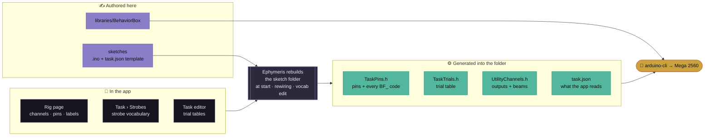
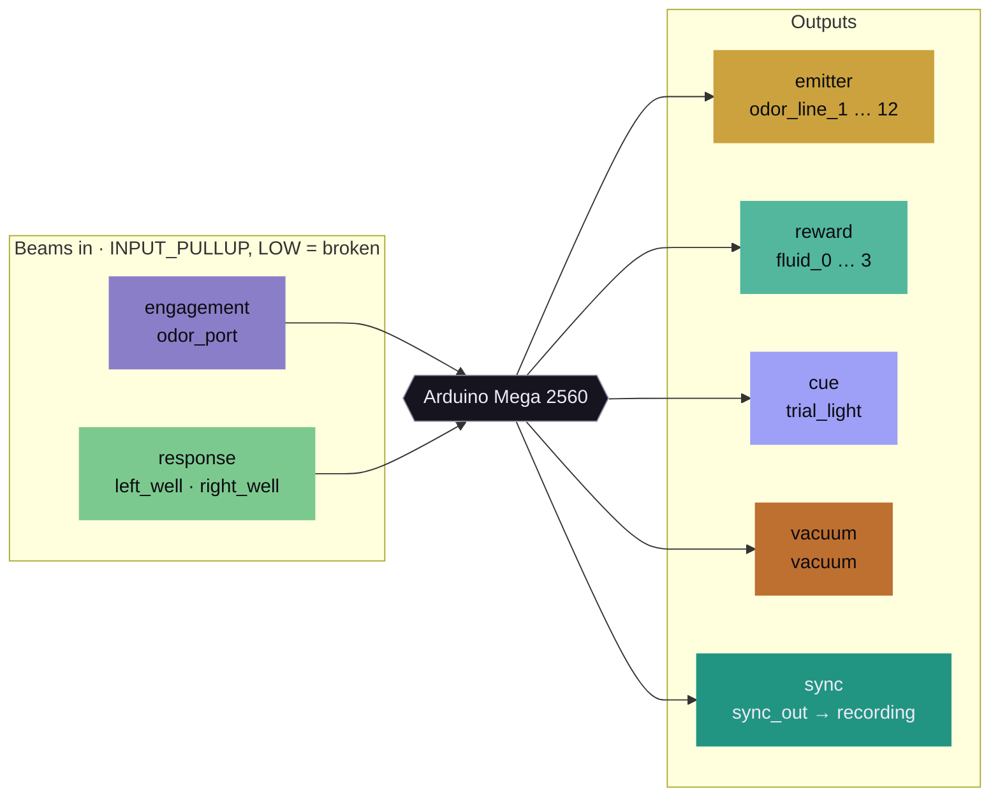

# Ephymeris firmware

The Arduino code that runs on every behavior box: the **BehaviorBox** library and the three
sketches the app ships with. It lives inside Ephymeris and changes alongside it.

> [!NOTE]
> **Edit firmware here, in `firmware/`.** `npm run stage:sketches` copies this folder into the
> gitignored `sketches/` (and `npm run predev` runs it), and the app builds from that copy. Until
> 2026-10-08 this was the separate repo `Chase-NJ/Arduino`; it was imported with its full history,
> so `git log -- firmware/` still tells the whole story.

```
firmware/
├── Olfactory Behavior/
│   └── GRGL/            the behavior task, and the template every saved task is built from
├── Utility/
│   ├── BOX_Utility/     resting firmware + Debug Mode control panel, generated per rig
│   └── GRGL_Sim/        a dry run of GRGL with a simulated animal
└── libraries/
    └── BehaviorBox/     the shared library every sketch includes
        ├── BehaviorBox.h    serial protocol, START parser, trial primitives, the trial runner
        ├── BoxPins.h        the box as built: guarded pin defaults
        ├── BoxStrobes.h     a guard only: strobe codes are generated
        ├── BoxUtility.h     the box utility's logic, driven by a generated table
        └── extras/host_test/   off-target tests (never compiled by Arduino)
```

## You never flash these folders directly

None of these sketches compiles as checked in, on purpose. The facts that differ between rigs and
machines are left out of the firmware and **generated by the app** into each sketch folder before
it is built:

- this rig's wiring, from the Rig page;
- this machine's strobe codes, from Task › Strobes;
- a saved task's trial table, from the Task editor.

A sketch built bare stops with an `#error` that says so, instead of driving pins nobody declared or
strobing numbers the app would decode under different names.



Generated folders live in the app's data directory: `<app data>/rig/sketches/…` for the three
sketches here, and `<app data>/tasks/…` for every saved task. They are rewritten at every start,
on every wiring change and on every strobe-vocabulary edit, so they are always what this version
of the app would write ([TASKS.md › Rebuilt bundled sketches](../docs/TASKS.md#rebuilt-bundled-sketches)).

## The three sketches

| | Sketch | What it is | Generated into its folder |
|:-:|---|---|---|
| 🟣 | **GRGL** | The olfactory discrimination task. Every task saved in the app is built from a copy of `GRGL.ino`, with its own trial table and parameters | Bundled copy: `TaskPins.h`. A saved task: `TaskPins.h`, `TaskTrials.h`, `task.json` |
| 🟢 | **BOX_Utility** | The resting firmware on every idle box (the utility baseline) and Debug Mode's control panel: latch, pulse and prime outputs, identify a box, run the hardware self-test | `TaskPins.h`, `UtilityChannels.h`, `task.json` (merged) |
| 🟠 | **GRGL_Sim** | GRGL with a simulated animal, for checking a box, the app and analysis without a rat. **It really opens the fluid lines**: run it dry unless you mean to dispense | `TaskPins.h` |

## The box, as the firmware sees it

Every channel on the Rig page has a **kind**, and the kind decides what the firmware does with it.
The colours are the ones the app uses for each kind on the Rig page and in Debug Mode.



| Kind | In a task | In BOX_Utility |
|---|---|---|
| **engagement** | Where a trial starts and the animal samples. Exactly one | A beam the self-test checks |
| **response** | A port a trial type can name as correct; its port slot picks its strobe family | A beam the self-test checks |
| **emitter** | A stimulus line, the condition a trial presents | A grid row; fires with the vacuum closed in the self-test |
| **reward** | Delivers the reward; pulse width is the volume | A grid row; what Prime opens |
| **cue** | The trial light: "a trial is available" | A grid row; the first one is how a box identifies itself |
| **vacuum** | Odor routing with no behavioral meaning | A grid row; energized with each stimulus line in the self-test |
| **sync** | One pulse per strobe into a recording controller | Never driven: a pulse there is an edge in a recording |

## The BehaviorBox library

| Header | Holds | Notes |
|---|---|---|
| `BehaviorBox.h` | The serial protocol shared with the app (`emitStrobe`, the `START` reader, `STOP`, `CommandReader`, `emitStatus`); `TaskParams` and `TASK_PARAM_LIST`, the one key list the `START` parser is generated from; the trial primitives, selection policies, and **one** trial runner | Everything every sketch needs. `START_LINE_MAX` here must equal the app's; a test fails if it doesn't |
| `BoxPins.h` | The box as built, every pin `#ifndef`-guarded | The generated `TaskPins.h` wins wherever it speaks |
| `BoxStrobes.h` | Nothing but a guard | Every `BF_*` code comes from the generated `TaskPins.h` ([TASKS.md › Strobe vocabulary](../docs/TASKS.md#strobe-vocabulary)) |
| `BoxUtility.h` | The box utility: commands, pulses, `STATUS`, the self-test | Knows no box. Reads the generated `UtilityChannels.h` ([TASKS.md › The box utility](../docs/TASKS.md#the-box-utility)) |

A sketch includes the generated headers around the library, and the order matters:

```cpp
#include "TaskPins.h"     // GENERATED: this rig's pins and every strobe code. First.
#include <BehaviorBox.h>
#include "TaskTrials.h"   // GENERATED: the trial table. Needs TrialType, so after.
```

### The box utility, in one table

`BOX_Utility.ino` is three includes and two calls; the box arrives as a generated table. Commands
name outputs by their Rig channel name, case-insensitively:

| Command | Does |
|---|---|
| `TOGGLE <ch>` · `ON <ch>` · `OFF <ch>` | Latch, open, close one output, e.g. `TOGGLE fluid_2` |
| `PULSE <ch>` | Open it for the pulse width, then close it |
| `SET PULSE=<ms>` | Pulse width, 10–5000 ms |
| `ALLOFF` | Close everything. Always safe, always available |
| `SELFTEST` · `STOP` | Run or abort the hardware self-test |
| `STATUS?` | Ask for a fresh `STATUS` line (one is sent on every change and every second anyway) |

> [!IMPORTANT]
> **Nothing on BOX_Utility starts on its own.** It is the resting firmware on every idle box, and
> animals are placed into boxes while it runs, so a nose poke never fires anything. Only the app
> starts things.

## Building and testing

```bash
npm run stage:sketches        # firmware/ → sketches/ (predev does this for you)

# Off-target host tests: the strictest type check the firmware gets
sh firmware/libraries/BehaviorBox/extras/host_test/run.sh       # the library
sh firmware/libraries/BehaviorBox/extras/host_test/run_box.sh   # the box utility

# A real AVR build, from a folder the app generated
arduino-cli compile --fqbn arduino:avr:mega --warnings all \
  --libraries sketches/libraries "<app data>/rig/sketches/Olfactory Behavior/GRGL"
```

The host tests run against fixture headers whose strobe codes and box are **deliberately not the
lab's**, so passing them proves the library depends on what it is told rather than on what it
happens to know. On Windows without clang or gcc, the MSVC Build Tools compile both unchanged: each
script's header carries the `cl` line.

> [!CAUTION]
> **`arduino-cli compile` will not tell you about a type error.** The AVR core builds with
> `-fpermissive -w`, so passing a `const TrialType*` where an `int` is expected is a suppressed
> warning: you get a size report and exit 0 on code that is wrong. That is how `GRGL_Sim` once kept
> compiling against a changed `AntiBiasSelector` signature while reading a pointer as a trial count.
> After changing anything shared, compile with `--warnings all` **and** run the host tests.

## Adding or changing a sketch

1. **New strobe code?** Add it on the app's **Task › Strobes** page first, then emit `BF_<NAME>`.
   The generated header is the only place a code is defined.
2. **New sketch?** Put it in a category folder as `<Name>/<Name>.ino`, `#include "TaskPins.h"`
   before `<BehaviorBox.h>`, and ship a `TaskPins.h` that declares nothing. Describe it to the app
   with a `task.json` ([TASKS.md › Writing a new sketch](../docs/TASKS.md#writing-a-new-sketch)).
3. **Changed the library?** Run both host tests and an `--warnings all` compile, then
   `npm run stage:sketches` and restart the app.

Where it is all explained: [TASKS.md › Firmware](../docs/TASKS.md#firmware) and
[ARCHITECTURE.md › Hardware utility baseline](../docs/ARCHITECTURE.md#hardware-utility-baseline).
